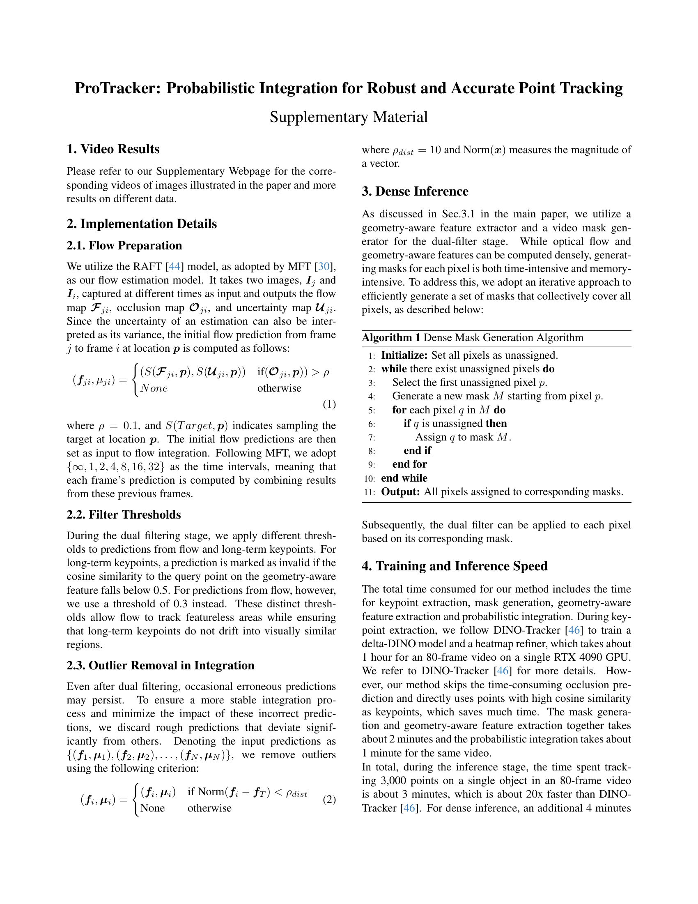

 


 2501.03220 
 Tingyang Zhang et el. 
 
 🤗 2025-01-07 
 



↗ arXiv


↗ Hugging Face


↗ Papers with Code


### TL;DR



점 추적은 비디오 분석 및 컴퓨터 비전에서 중요한 과제입니다. 기존의 감독 학습 기반 방법들은 특정 데이터셋에 과적합되는 문제와, 장기간 추적 시 발생하는 누적 오류로 인해 성능이 저하되는 문제점을 가지고 있습니다.  **자체 감독 학습 기반 방법**들은 이러한 문제를 일부 해결하지만, 여전히 정확도와 견고성 측면에서 한계를 가지고 있습니다.  본 논문에서는 이러한 문제점을 해결하기 위해, ProTracker라는 새로운 프레임워크를 제시합니다. ProTracker는 **광류와 장기간 특징 대응**을 확률적으로 통합하여, 단기 및 장기 추적의 정확도와 견고성을 향상시키는 것을 목표로 합니다.  이는 잡음이 많은 광류 예측을 필터링하고, **장기간 특징 대응**을 통해 폐색 문제를 해결하는 데 도움이 됩니다. 

ProTracker는 다양한 비디오 데이터셋에서 최첨단 성능을 달성했습니다. 특히, **자체 감독 방식**을 사용하여 우수한 성능을 달성함으로써, 감독 학습 기반 방법에 비해 데이터셋에 대한 의존성을 줄였습니다.  또한, ProTracker는 **확률적 통합**을 통해 다양한 예측의 신뢰도를 고려하여, 보다 정확하고 견고한 추적 결과를 제공합니다.  본 연구는 추후 연구에서 **다양한 센서 데이터와 추적 알고리즘을 통합**하는 데 중요한 기반을 제공할 수 있을 것으로 기대됩니다.



#### Key Takeaways


 ProTracker는 **장기간에 걸친 정확하고 견고한 점 추적**을 위한 새로운 프레임워크입니다. 



 **확률적 통합**을 통해 다양한 예측을 효과적으로 통합하여 잡음에 강인한 추적 성능을 달성합니다. 



 **자체 감독 방식**을 사용하여, 기존의 감독 방식에 비해 데이터셋에 대한 의존성을 줄이고, 다양한 상황에 대한 일반화 성능을 향상시켰습니다. 


#### Why does it matter?
본 논문은 **장기간에 걸친 정확하고 견고한 점 추적**이라는 어려운 문제에 대한 새로운 해결책을 제시하여, 비디오 분석, 4D 재구성 및 비디오 편집과 같은 다양한 분야에서 **중요한 발전**을 가져올 수 있습니다.  **자체 감독 방식**을 사용하여 우수한 성능을 달성함으로써, 방대한 레이블이 달린 데이터셋에 대한 의존성을 줄이고, 보다 광범위한 적용이 가능해집니다. 또한, 본 연구는 **확률적 통합 프레임워크**를 제시하여, 추후 연구에서 다양한 센서 데이터와 추적 알고리즘을 통합하는 데 중요한 기반을 제공할 수 있습니다.

------
#### Visual Insights

> 🔼 이 그림은 다양한 비디오에서 추적 궤적을 시각적으로 보여줍니다.  본 논문에서 제시된 방법은, 시간이 지남에 따라 궤적이 벗어나는 현상 없이 각 점의 완전한 궤적을 강건하게 복구합니다. 특히,  폐색이나 여러 유사 영역과 같은 어려운 상황에서도 효과적으로 작동함을 보여줍니다.  각 비디오의 여러 예시는 다양한 움직임과 시각적 특징을 보여주는 점들의 추적 경로를 상세히 보여줍니다.
> 

> 
read the caption

> Figure 1: Visualization of tracking trajectories in various videos. Our method robustly recovers each point’s complete trajectory without drifting over time, even in challenging scenarios such as occlusions and multiple similar regions.
> 


| Method | DAVIS-First  δxavg↑ | DAVIS-First OA ↑ | DAVIS-First AJ ↑ | DAVIS-Strided δxavg↑ | DAVIS-Strided OA ↑ | DAVIS-Strided AJ ↑ | Kinetics-First δxavg↑ | Kinetics-First OA ↑ | Kinetics-First AJ ↑ |
|---|---|---|---|---|---|---|---|---|---| 
| Omnimotion [47] | - | - | - | 67.5 | 85.3 | 51.7 | - | - | - |
| MFT [30] | 66.8 | 77.8 | 47.3 | 70.8 | 86.9 | 56.1 | 60.8 | 75.6 | 39.4 |
| CaDeX++ [40] | - | - | - | 77.4 | 85.9 | 59.4 | - | - | - |
| DecoMotion [25] | 69.9 | 84.2 | 53.0 | 74.4 | 87.2 | 60.2 | - | - | - |
| DINOTracker [46] | 74.9 | 86.4 | 58.3 | 78.2 | 87.5 | 62.3 | 69.5 | 86.3 | 55.5 |
| Ours | **77.6** | **87.3** | **62.0** | **80.8** | **88.7** | **65.3** | **71.1** | **89.6** | **56.7** |

> 🔼 표 1은 TAP-Vid 벤치마크에서 최첨단 자기 지도 학습 또는 비지도 학습 추적기와의 비교 결과를 보여줍니다.  제안된 ProTracker 방법은 다른 모든 방법보다 일관되게 우수한 성능을 보였습니다.  표에는 다양한 평가 지표(예: OA, AJ, dang)에 대한 수치가 제시되어 있으며, 가장 좋은 결과는 굵게 표시되어 있습니다. 이 표는 제안된 방법의 강력한 성능을 객관적으로 보여줍니다.
> 

> 
read the caption

> Table 1: Comparisons with SOTA self-supervised or unsupervised trackers on TAP-Vid benchmark. Our method consistently outperforms others in all metrics. The best results are bolded.
> 

### In-depth insights

#### Probabilistic Integration
본 논문에서 제시된 ‘확률적 통합’은 다양한 단기 및 장기 예측들을 결합하여 강건하고 정확한 점 추적을 달성하는 핵심 전략입니다. **다중 광학 흐름 예측들을 확률적으로 통합**하여 부드럽고 정확한 궤적을 생성하고, **폐색으로 인해 사라졌다가 다시 나타나는 점들을 효과적으로 재현위치시키기 위해 장기적 특징 대응을 통합**합니다. 이러한 접근 방식은 불확실성을 직접적으로 다루고, 노이즈가 많은 데이터에서도 강건한 추적 성능을 제공하며, 특히 장기간 추적 시 발생할 수 있는 누적 오차 문제를 효과적으로 완화하는 데 기여합니다.  **가우시안 분포를 이용한 확률적 융합은 각 예측의 불확실성을 고려**, 최적화된 추정값을 산출하고, **양방향 통합 방식은 정방향 및 역방향 광학 흐름 예측을 결합**하여 전체 궤적의 정확도를 높입니다. **하이브리드 필터를 통해 잘못된 초기 예측들을 제거**하여 후속 추정에 미치는 부정적 영향을 최소화합니다. 결론적으로, 이 논문의 확률적 통합 기법은 점 추적의 정확성과 강건성을 향상시키는 데 중요한 역할을 수행하며, 다양한 어려운 상황에서도 우수한 성능을 보입니다.

#### Long-Term Tracking
장기 추적(Long-Term Tracking)은 비디오 분석에서 매우 중요한 부분이며, **특히 물체가 장시간 가려지거나 시야에서 사라지는 경우** 추적의 정확도와 안정성을 유지하는 데 어려움이 있습니다. 본 논문에서는 이러한 문제를 해결하기 위해 **확률적 통합 기법**을 제시하고 있습니다. 이 기법은 광학 흐름(optical flow)과 장기적인 특징 매칭(long-term feature correspondence)을 결합하여 단기 및 장기 추적 모두의 정확도를 향상시키는 것을 목표로 합니다.  **광학 흐름은 단기적인 움직임을 추정**하는 데 유용하지만, **물체가 가려지는 등의 경우에는 오류가 발생**할 수 있습니다.  반면에 **장기적인 특징 매칭은 장기적인 추적을 가능**하게 하지만, **정확도가 떨어지거나 계산량이 많아질** 수 있습니다. 따라서 논문에서 제시된 확률적 통합 기법은 이 두 가지 방법의 장점을 결합하여 **추적의 정확성과 안정성을 높이는 효과적인 전략**임을 보여주고 있습니다. 특히, **가려짐(occlusion)이나 유사한 물체가 여러 개 존재하는 어려운 상황**에서도 우수한 성능을 보이는 것이 특징입니다.  결론적으로, 본 논문의 장기 추적 방법은 **실제 환경에서의 다양한 어려움을 효과적으로 극복**하고, 향상된 추적 성능을 제공할 수 있음을 시사합니다.

#### Hybrid Filtering
본 논문에서 제시된 하이브리드 필터링은 정확하고 강건한 장기간 점 추적을 위한 핵심 구성 요소입니다. 이는 **오브젝트 수준 필터**와 **기하학적 특징 필터**의 두 가지 필터를 결합하여 작동합니다.  **오브젝트 수준 필터**는 오브젝트 분할 모델을 활용하여 타겟 점과 관련 없는 영역의 예측값을 제거함으로써 정확성을 높입니다.  이는 특히 폐색이 발생하는 상황에서 광류 기반 추적의 정확도를 향상시킵니다.  **기하학적 특징 필터**는 의미적으로 유사한 점들 간의 모호성을 줄이고 깜빡임 현상을 방지하는 역할을 합니다. 이 필터는 기하학적 특징 추출기를 사용하여 타겟 점과의 특징 유사도를 측정하고, 유사도가 일정 기준 미만인 점들을 제거합니다. 두 필터의 결합은 노이즈를 줄이고, 후속 단계의 확률적 통합을 위한 견고한 기반을 마련합니다.  **이러한 하이브리드 접근 방식은 잡음이 많은 광류 예측값의 부정적 영향을 최소화하고, 추적 정확도를 향상시키는 데 중요한 역할을 합니다.**  결과적으로, 하이브리드 필터링은 강건하고 정확한 장기간 점 추적 시스템 구축에 필수적인 요소임을 알 수 있습니다.

#### Ablation Study
본 논문의 "Ablation Study"는 모델의 성능에 기여하는 각 구성요소의 중요성을 객관적으로 평가하기 위한 실험 설계입니다. **각 구성요소를 제거하거나 변경했을 때 성능 변화를 정량적으로 분석하여, 각 요소의 기여도를 파악하고 모델의 강점과 약점을 명확히** 드러냅니다. 예를 들어, 특정 필터링 기법을 제거했을 때 정확도가 얼마나 저하되는지, 또는 특정 모듈을 대체했을 때 성능이 어떻게 변화하는지 등을 분석합니다.  이를 통해 **모델의 핵심 구성요소를 확인하고 향후 연구 방향을 제시**할 수 있습니다.  **결과적으로, Ablation Study는 제시된 방법론의 신뢰성을 높이고,  개선점을 도출하며,  추후 연구의 기반을 마련**하는 데 중요한 역할을 합니다. 단순히 성능 수치만 제시하는 것이 아니라, 각 구성요소의 상호작용 및 영향을 심도 있게 분석하여, 모델의 작동 원리를 명확히 이해하고, 더욱 발전된 모델 개발에 기여합니다.  **실험 결과는 표나 그림 형태로 제시되어,  직관적이고 명확하게 이해**할 수 있도록 합니다.

#### Future Works
본 논문에서 제시된 ProTracker는 강건하고 정확한 장기간 밀집 점 추적을 위한 훌륭한 기반을 마련했지만, **향후 연구 방향**은 여전히 많습니다.  **자체 지도 학습 방식의 한계를 극복**하고,  **완전 비지도 학습 또는 실시간 처리**를 가능하게 하는 방향으로 발전시킬 수 있습니다.  특히, **장기간 특징 대응 모델의 성능 향상**과 **다양한 환경 및 복잡한 동작에 대한 일반화 능력 향상**은 중요한 과제입니다.  **오류 전파 방지 및 추적 정확도 향상**을 위한  **더욱 정교한 확률적 통합 기법** 개발도 필요합니다.  **다양한 데이터셋에 대한 실험**을 통해 알고리즘의 강건성과 일반화 능력을 더욱 검증하고,  **실제 응용 분야**에 적용 가능성을 높이는 연구가 필요합니다.  **에너지 효율적인 구현**을 통해 실시간 처리 가능성을 높이는 것도 중요한 연구 방향입니다.  **결론적으로**, ProTracker의 장점을 유지하면서 성능과 활용성을 더욱 높이는 방향으로의 지속적인 연구가 필요합니다.

### More visual insights

More on figures

> 🔼 본 그림은 제안된 ProTracker 방법의 파이프라인을 보여줍니다. 먼저, (1) Sample & Chain 단계에서 키 포인트들을 샘플링하고 광학 흐름 체이닝을 통해 연결하여 초기 궤적 예측을 생성합니다. 이후, (2) Long-term Correspondence 단계에서 장기간에 걸쳐 키 포인트들을 재현지화하여 일시적으로 사라지는 포인트들의 연속성을 유지합니다. (3) Hybrid Filter 단계에서는 마스크와 특징 필터를 적용하여 잘못된 예측들을 제거하고 후속 단계를 위한 노이즈를 줄입니다. 마지막으로, (4) Probabilistic Integration 단계에서는 필터링된 광학 흐름 예측들을 프레임별로 통합하고 장기간 키 포인트들을 결합하여 최종 예측을 생성하며, 이를 통해 더욱 부드럽고 일관성 있는 궤적들을 얻습니다.
> 

> 
read the caption

> Figure 2: Pipeline overview of our proposed method. (1) Sample & Chain: Key points are initially sampled and linked through optical flow chaining to produce preliminary trajectory predictions. (2) Long-term Correspondence: Key points are re-localized over longer time spans to maintain continuity, even for points that temporarily disappear. (3) Hybrid Filter: Masks and feature filters are applied to remove incorrect predictions, reducing noise for subsequent steps. (4) Probabilistic Integration: Filtered flow predictions across frames are first integrated and then combined with long-term keypoint to produce the final prediction, producing smoother and more consistent trajectories.
> 

> 🔼 이 그림은 점이 추적 중에 자주 사라지고 다시 나타나는 상황을 보여줍니다. 점이 사라지면 장기간의 대응 관계를 설정하여 주요 프레임에서 정확하게 재현지화하고, 어려운 상황(폐색 또는 장면 변경)에서도 점을 올바르게 식별할 수 있도록 합니다. 재현지화 후에는 흐름 통합이 재개되어 부드럽고 정확한 궤적 생성이 이어집니다.
> 

> 
read the caption

> Figure 3: A point may frequently disappear and reappear during tracking. When it disappears, establishing long-term correspondence enables accurate re-localization in a keyframe, ensuring the point is correctly re-identified, even in challenging situations like occlusion or scene changes. After re-localization, flow integration resumes, allowing smooth and precise trajectory generation to continue seamlessly for subsequent frames.
> 

> 🔼 그림 4는 제안된 ProTracker 방법을 기존 최첨단 방법들과 비교 분석한 결과를 보여줍니다. 비교 대상에는 데이터 기반 모델(Co-Tracker [21], SpatialTracker [49], LocoTrack [10], TAPTR [24])과 자기 지도 학습 모델(CaDeX++ [40], DINO-Tracker [46])이 포함됩니다. TAPVid-DAVIS 데이터셋에서 자전거를 타는 장면과 염소 장면을 선정하여 실험을 진행했습니다. 추적 예측은 256x256 해상도에서 수행되었으며, 시각화는 원본 해상도로 표시됩니다. 보다 자세한 정성적 결과는 보충 자료에 포함되어 있습니다. 그림은 다양한 방법들의 추적 성능을 시각적으로 비교하여 ProTracker의 우수성을 보여줍니다.
> 

> 
read the caption

> Figure 4: To evaluate our method, we compare it with several state-of-the-art approaches, including data-driven models such as Co-Tracker [21], SpatialTracker [49], LocoTrack [10], and TAPTR [24] as well as the self-supervised CaDex++ [40] and DINO-Tracker [46]. The test scenes selected from the TAPVid-DAVIS dataset include bike-packing and goat. Track predictions are conducted at a resolution of 256×256, while the visualizations of tracked points are displayed in the original resolution. More qualitative results are included in the supplementary material.
> 

More on tables


| Method | DAVIS-First |  |  | DAVIS-Strided |  |  | Kinetics-First |  |  | 
|---|---|---|---|---|---|---|---|---|---| 
| δavgx↑ | OA↑ | AJ↑ | δavgx↑ | OA↑ | AJ↑ | δavgx↑ | OA↑ | AJ↑ | δavgx↑ | 
|---|---|---|---|---|---|---|---|---|---| 
| TAP-Net [11] | 48.6 | 78.8 | 33.0 | 53.4 | 81.4 | 38.4 | 56.3 | 83.6 | 42.7 | 
| PIPs [15] | 64.8 | 77.7 | 42.2 | 59.4 | 82.1 | 42.0 | 47.6 | 78.5 | 31.1 | 
| TAPIR [12] | 70.0 | 86.5 | 56.2 | 74.7 | 89.4 | 62.8 | 63.6 | 86.4 | 52.6 | 
| CoTracker [21] | 75.4 | 89.3 | 60.6 | 79.2 | 89.3 | 65.1 | 65.9 | 88.0 | 52.8 | 
| SpatialTracker [49] | 76.3 | 89.5 | 61.1 | - | - | - | 67.1 | 88.3 | 53.9 | 
| TAPTR [24] | 75.9 | **91.4** | **63.5** | 78.8 | **91.3** | 66.4 | 64.4 | 85.7 | 50.8 | 
| LocoTrack [10] | 75.3 | 87.2 | 62.9 | 79.6 | 89.9 | **67.8** | 68.8 | 87.5 | 56.0 | 
| Ours | **77.6** | 87.3 | 62.0 | **80.8** | 88.7 | 65.3 | **71.1** | **89.6** | **56.7** |
> 🔼 표 2는 TAP-Vid 벤치마크에서 최첨단 지도 학습 기반 추적기들과 비교하여 제안된 방법의 성능을 보여줍니다. 제안된 방법은 모든 데이터셋에서 가장 높은 평균 정확도(δa⁢v⁢g)를 달성했으며, OA(Occlusion Accuracy)와 AJ(Average Jaccard) 지표에서도 경쟁력 있는 성능을 보였습니다. 특히, 더 많은 프레임을 포함하는 Kinetics-First 데이터셋에서는 모든 지표에서 다른 방법들을 능가하는 성능을 보였습니다. 가장 좋은 결과는 굵게 표시되어 있습니다.
> 

> 
read the caption

> Table 2: Comparisons with SOTA supervised trackers on TAP-Vid benchmark. Our method achieves the highest δa⁢v⁢gxsuperscriptsubscript𝛿𝑎𝑣𝑔𝑥\delta_{avg}^{x}italic_δ start_POSTSUBSCRIPT italic_a italic_v italic_g end_POSTSUBSCRIPT start_POSTSUPERSCRIPT italic_x end_POSTSUPERSCRIPT across all datasets, while also performing competitively in OA and AJ. Notably, on the Kinetics-First dataset, which contains videos with a higher number of frames, our method outperforms all others across all metrics. The best results are bolded.
> 


| Method | DAVIS-First  δavgx | DAVIS-First OA | DAVIS-First AJ | DAVIS-Strided  δavgx | DAVIS-Strided OA | DAVIS-Strided AJ |
|---|---|---|---|---|---|---|
| w/o key point | 71.2 | 79.2 | 47.8 | 74.6 | 87.6 | 62.8 |
| w/o geo-aware | **77.6** | 85.7 | 60.0 | **80.8** | 88.4 | 63.3 |
| w/o mask | 72.3 | 82.3 | 57.1 | 73.9 | 82.6 | 57.8 |
| w/o probabilistic | **76.9** | **87.2** | **61.3** | **79.0** | **88.2** | **63.9** |
| Ours Full | **77.6** | **87.3** | **62.0** | **80.8** | **88.7** | **65.3** |
> 🔼 표 3은 TAP-Vid-DAVIS 데이터셋에서 제안된 방법의 구성 요소별 실험 결과를 보여줍니다.  각 구성 요소(키포인트, 기하학적 특징 필터, 마스크 필터, 확률적 통합)를 제거했을 때의 성능 변화를 정량적으로 비교 분석하여 각 구성 요소의 기여도를 평가합니다.  가장 좋은 결과와 두 번째로 좋은 결과는 굵은 글씨체와 밑줄로 강조 표시되어 있습니다.  OA(Occlusion Accuracy), AJ(Average Jaccard),  Sx(Success rate) 지표를 사용하여 정확도를 평가합니다.
> 

> 
read the caption

> Table 3: Ablation on different components on TAP-Vid-DAVIS. The best and second best results are bolded and underlined.
> 

### Full paper



