 


 2501.03226 
 Beichen Zhang et el. 
 
 🤗 2025-01-07 
 



↗ arXiv


↗ Hugging Face


↗ Papers with Code


### TL;DR



대규모 언어 모델(LLMs)은 복잡한 수학 문제 해결에 있어서, **문맥 학습(ICL)** 예시의 과립도 불일치 및 그로 인한 부정적 영향으로 성능 향상에 제한이 있습니다. 기존의 ICL은 문제 전체를 다루는 반면, BoostStep은 **단계별 추론**에 집중하여 문제를 작은 단계들로 나누고 각 단계마다 관련된 ICL 예시를 제공합니다. 

BoostStep은 **'첫 시도' 전략**을 통해 모델의 현재 추론 단계를 파악하고, 유사한 예시를 찾아 제공합니다. 이를 통해 불필요한 정보로 인한 방해를 최소화하고, 각 단계의 추론 정확도를 향상시킵니다. 또한 BoostStep은 **몬테 카를로 트리 탐색(MCTS)**과도 원활하게 통합되어 후보 생성 및 의사결정 과정을 개선합니다. 실험 결과, GPT-4 및 Qwen2.5-Math-72B 모델의 성능을 향상시켰음을 보여줍니다.  이는 **LLMs의 수학적 추론 능력을 향상시키는 효과적이고 일반적인 방법론**임을 시사합니다.



#### Key Takeaways


 단계별 문맥 학습을 통해 LLMs의 한 단계 추론 정확도 향상 



 '첫 시도' 전략을 통한 관련 문맥 예시 제공 및 오류 감소 



 MCTS와의 통합을 통한 후보 생성 및 의사결정 개선 


#### Why does it matter?
본 논문은 **대규모 언어 모델의 수학적 추론 능력 향상**에 중요한 기여를 합니다. 기존의 문제점을 명확히 밝히고, 단계별 추론과정에 초점을 맞춘 새로운 방법론을 제시하여 성능 향상을 이끌어냈습니다.  **단계별 추론 전략**은 다양한 분야의 연구에 적용 가능하며, **MCTS와의 통합**은 특히 주목할 만합니다.  향후 연구 방향을 제시함으로써, 관련 분야 연구자들에게 귀중한 통찰력을 제공합니다.

------
#### Visual Insights

> 🔼 그림 1은 제안된 단계별 문맥 학습 방법이 기존의 문제 수준의 몇 번의 시도 학습 방법보다 우수함을 보여줍니다. 특히,  문제 유사도가 낮은 벤치마크(예: OlympiadBench 및 다중 모드 벤치마크)에서 문제 수준의 몇 번의 시도 학습은 부정적인 영향을 미칠 수 있지만, 제안된 방법은 여전히 유용한 지침을 제공합니다. 도표는 다양한 수학 벤치마크(도메인 내, 도메인 외 및 다중 모드)에서 단계별 문맥 학습의 성능 향상(약 4%)을 보여줍니다.
> 

> 
read the caption

> Figure 1: Our step-level in-context learning outperforms traditional problem-level few-shot learning for about 4% across in-domain, out-domain and cross-modality mathematical benchmark. Moreover, on benchmarks with lower similarity with example problem set (i.e. OlympiadBench and multi-modal benchmarks), where problem-level few-shot learning may have negative impact, while our strategy still provides valuable guidance.
> 


| Model | Method | in-domain MATH | out-domain AMC12 | out-domain AMC10 | out-domain AQUA | out-domain MathBench(C) | out-domain MathBench(H) | out-domain OlympiadBench-TO |
|---|---|---|---|---|---|---|---|---|
| GPT-4o | 0-shot | 73.4 | 53.6 | 55.8 | 81.1 | 80.0 | 77.3 | 40.6 |
|  | few-shot | 73.8 | 56.5 | 56.7 | 83.9 | 80.7 | 79.3 | 39.3 |
| **Ours** |  | **76.4** | **63.0** | **60.4** | **85.4** | **82.0** | **84.0** | **43.3** |
| Qwen | 0-shot | 83.0 | 67.4 | 67.7 | 84.6 | 80.6 | 82.0 | 49.7 |
|  | few-shot | 83.8 | 67.4 | 66.8 | 85.0 | 81.3 | 82.7 | 49.9 |
| **Ours** |  | **85.2** | **69.2** | **69.6** | **86.6** | **82.7** | **84.7** | **52.7** |

> 🔼 표 1은 GPT-4와 Qwen-2.5-Math-72B 모델에서 다양한 벤치마크에 대한 여러 가지 인 컨텍스트 학습 전략의 비교 결과를 보여줍니다.  PRM800K 데이터셋으로 생성된 예제 문제 은행을 사용했기 때문에 MATH500은 도메인 내 벤치마크이고, 나머지는 모두 도메인 외 벤치마크입니다.  표에는 다양한 벤치마크(MATH, AMC10, AMC12, AQUA, MathBench(C), MathBench(H), OlympiadBench-TO)에 대한 0-shot, few-shot, 그리고 제안된 방법(Ours)의 성능이 비교되어 있으며, 최고 성능은 굵게 표시되어 있습니다.
> 

> 
read the caption

> Table 1: A comparison of different in-context learning strategies on different benchmarks on GPT-4o and Qwen2.5-Math-72B-Instruct. The example problem bank is constructed from PRM800K, so MATH500 is an in-domain benchmark while others are all out-domain benchmarks. Best results are in bold.
> 

### In-depth insights

#### Step-Level Reasoning
단계별 추론은 기존의 문제 전체를 한 번에 해결하려는 방식에서 벗어나, **문제 풀이 과정을 여러 작은 단계로 분해**하여 각 단계별로 추론을 수행하는 접근 방식입니다. 이는 복잡한 수학 문제를 해결하는 데 있어, 각 단계의 정확성을 높이고 전체적인 해결 성공률을 향상시킬 수 있는 중요한 전략입니다.  **단계별 추론의 핵심은 각 단계의 독립성과 연관성을 유지**하면서, 각 단계에 필요한 정보만을 활용하여 추론하는 것입니다.  이는 **부정확한 추론으로 인한 오류 확산을 방지**하고, 문제 해결의 효율성을 높이는 데 기여합니다.  단계별 추론은 **문맥 학습(In-context Learning)**과 같은 기법과 결합하여 더욱 효과적일 수 있으며, 특히 대규모 언어 모델(LLM)의 추론 능력 향상에 큰 도움을 줄 수 있습니다.  하지만 **단계 분할의 적절성**, 각 단계의 독립적인 처리 및 전 단계 결과의 활용 등 해결해야 할 과제가 존재합니다.

#### First-Try Strategy
논문에서 제시된 "First-Try Strategy"는 **모델의 초기 추론 능력을 활용하여 관련 예시를 효과적으로 검색하는 전략**입니다.  단순히 문제 전체를 바탕으로 예시를 찾는 기존 방식과 달리, 모델이 먼저 해당 단계에 대한 답을 시도해 본 후(first try), 그 결과를 토대로 유사한 단계의 예시를 검색합니다. 이는 **관련성이 높은 예시를 제공**하여 모델의 추론 과정을 효과적으로 안내하고, 무관한 정보로 인한 방해를 최소화하는 데 도움이 됩니다.  **단계별 추론 과정의 세밀함을 고려**하여, 예시 검색의 정확도와 효율성을 높이고, 이를 통해 모델의 단계별 추론 성능 향상에 기여하는 핵심 전략임을 알 수 있습니다.  **전체 문제와의 유사도에 대한 의존도를 줄여** 다양한 문제 유형에 대한 적용성을 높이는 장점도 가지고 있습니다. 특히, 기존 방식이 유사한 문제를 찾지 못하는 경우에도 효과적인 가이드라인을 제공할 수 있다는 점에서 그 중요성이 더욱 부각됩니다.

#### MCTS Integration
본 논문에서 제시된 BoostStep 방법론의 핵심적인 부분 중 하나는 **MCTS(몬테 카를로 트리 탐색)**와의 통합입니다.  BoostStep은 단일 단계 추론의 정확성을 향상시키는 데 초점을 맞추고 있으며, 이러한 향상된 단일 단계 추론 능력은 MCTS 알고리즘과 매우 잘 어울립니다. MCTS는 여러 가지 가능한 추론 경로를 탐색하고 가장 유망한 경로를 선택하는 데 사용되며, BoostStep의 개선된 단일 단계 추론은 MCTS가 더욱 정확하고 효율적으로 최적의 해결책을 찾을 수 있도록 돕습니다.  **특히, BoostStep은 MCTS의 후보 추론 경로 생성 단계와 의사결정 단계 모두에 통합될 수 있습니다.** 후보 경로 생성 단계에서는 BoostStep의 단계별 문맥 학습이 더욱 정확한 후보 경로를 생성하도록 돕고, 의사결정 단계에서는 BoostStep의  **단계별 비교를 통한 정확도 평가**가 최적의 경로 선택에 기여합니다.  실험 결과는 MCTS와 통합된 BoostStep이 수학적 벤치마크에서 성능 향상을 보여주는 것으로 나타났으며, 이는 BoostStep의 단계별 추론 개선이 MCTS의 효율성을 높이는 데 상당한 기여를 한다는 것을 시사합니다.  **결론적으로, BoostStep의 MCTS 통합은 단순한 성능 향상을 넘어, 복잡한 수학적 문제 해결을 위한 강력한 추론 프레임워크를 구축하는 데 중요한 역할을 한다는 것을 알 수 있습니다.**

#### Benchmark Results
본 논문의 벤치마크 결과는 제시된 방법의 성능을 다양한 측면에서 평가한 것을 보여줍니다. **다양한 수학 벤치마크 데이터셋에 대한 실험 결과를 통해 제시된 방법의 우수성을 입증**하였습니다. 특히, 기존 방법들에 비해 **개선된 정확도와 일반화 성능**을 확인할 수 있었습니다. **단계별 추론 과정에 대한 세밀한 분석을 통해 문제 해결 과정에서의 오류를 줄이고 정확성을 높였다는 점**을 강조하고 있습니다.  **단계별 문맥 학습(Step-level in-context learning)과 첫 시도 전략(first-try strategy)의 효과**를 구체적인 수치로 제시하여, 그 효용성을 명확히 밝혔습니다.  또한, **몬테카를로 트리 탐색(MCTS)과의 통합을 통해 추가적인 성능 향상**을 이루었다는 점도 주목할 만합니다.  하지만, **벤치마크 데이터셋의 한계와 일반화 성능에 대한 추가적인 검토**가 필요하며, **다양한 모델에 대한 실험**을 통해 더욱 폭넓은 검증이 요구됩니다.

#### Future Directions
본 논문에서 제시된 BoostStep 방법의 미래 방향은 **단일 단계 추론의 정확성을 더욱 향상시키는 데 집중**되어야 합니다.  이는 더욱 정교한 컨텍스트 학습 전략을 개발하거나,  **추론 과정의 중간 단계에 대한 상세한 지침을 제공하는 새로운 방법**을 모색하는 것을 의미합니다. 또한, 다양한 수학적 문제 유형에 대한 일반화 성능을 높이기 위해 **더욱 다양하고 방대한 학습 데이터셋**을 구축하고 활용하는 방안을 고려해야 합니다.  나아가, **BoostStep을 다양한 추론 전략 (예: MCTS)과의 통합을 강화**하여 상호 시너지 효과를 극대화하고,  **실제 응용 분야에 대한 적용성을 확대**하는 연구가 필요합니다. 특히, 다양한 모달리티(텍스트, 이미지, 수식 등)를 통합하는 멀티모달 수학적 추론 문제에 대한 적용 및 확장 연구가 중요한 미래 과제입니다.  마지막으로, **모델의 추론 과정을 해석 가능하게 만들고,  오류 분석을 통해 모델의 한계점을 파악**하여 성능 개선에 반영하는 연구도 중요합니다. 이러한 노력들을 통해 BoostStep은 더욱 강력하고 범용적인 수학적 추론 능력을 갖춘 모델로 발전할 수 있을 것입니다.

### More visual insights

More on figures

> 🔼 그림 2는 제안된 방법이 문제 수준의 문맥 학습(problem-level in-context learning)에서 단계 수준의 문맥 학습(step-level in-context learning)으로 발전하는 과정을 보여줍니다.  (a)는 기존의 문제 수준 문맥 학습 방식으로, 전체 문제에 대한 몇몇 예시를 제공하여 모델이 문제를 푸는 데 도움을 줍니다. 하지만 이 방식은 문제 풀이 과정의 세부적인 단계별 지침을 제공하지 못하고, 예시 문제와의 관련성이 떨어져 오히려 방해가 될 수 있습니다.  (b)는 제안된 단계 수준 문맥 학습 방식으로, 문제 풀이의 각 단계마다 관련된 예시를 제공하여 실시간으로 보다 세밀한 지침을 제공합니다. 이는 모델이 각 단계에서 더 정확하게 추론할 수 있도록 돕고, Monte Carlo Tree Search (MCTS) 전략에서 추론 및 검증 과정을 안내하는 데에도 효과적입니다. (c)는 MCTS에서 단계 수준 문맥 학습이 어떻게 추론과 검증 과정을 안내하는지 보여주는 예시입니다.  즉, 제안된 방법은 각 단계의 추론에 대해 관련된 예제를 제공하여 더욱 정확하고 효율적인 문제 해결을 가능하게 합니다.
> 

> 
read the caption

> Figure 2: Our strategy refines in-context learning from problem-level granularity (fig.a) to step-level granularity(fig.b) to provide more real-time fine-grained guidance. Moreover, our strategy can guide the reasoning and verifying process in Monte Carlo Tree Search (MCTS) strategies by introducing examples.
> 

> 🔼 그림 3은 서로 다른 문제들이 유사한 단계들을 포함할 수 있음을 보여줍니다. 문제 수준의 문맥 학습은 문제의 유사성이 낮기 때문에 이러한 예시를 무시하지만, 본 논문에서 제안하는 단계 수준의 문맥 학습은 단계 수준 검색과 안내를 통해 핵심 기술을 도입할 수 있습니다.  즉, 문제 전체가 아닌 문제 해결 과정의 각 단계별로 유사한 예시를 찾아 활용함으로써, 문제 수준의 문맥 학습보다 더욱 효과적인 학습이 가능함을 시각적으로 보여주는 예시입니다.
> 

> 
read the caption

> Figure 3: An example of different problems may contain similar steps. Problem-level in-context learning will ignore this example due to low problem similarity, while our step-level in-context learning can introduce the core skills by step-level retrieval and guidance.
> 

> 🔼 그림 4는 단계별 문맥 학습을 통해 실시간 추론 중 추론 과정을 조정하는 구체적인 예시를 보여줍니다. 모델의 첫 번째 시도는 잘못된 방정식을 사용하지만 검색된 예시 단계는 모델이 올바른 방정식을 사용하고 올바른 결론에 도달하도록 안내합니다. 이 그림은 잘못된 방정식을 사용한 첫 번째 시도와 올바른 방정식을 사용하도록 안내하는 검색된 예시 단계를 보여줌으로써, 단계별 문맥 학습을 통한 실시간 추론 조정 과정을 자세히 설명합니다.
> 

> 
read the caption

> Figure 4: A specific example of adjusting reasoning during real-time inference through step-level in-context learning. The first-try uses a wrong equation while the retrieving example step guides the model to use the correct equation and get the correct conclusion.
> 

More on tables


| Method | MathVision-Mini | MathVerse-Mini |
|---|---|---|
| 0-shot | 30.6 | 53.2 |
| few-shot | 28.7 | 53.2 |
| **Ours** | **35.2** | **54.2** |
> 🔼 표 2는 제시된 문제 은행과 유사성이 낮은 다중 모드 수학 벤치마크에서 서로 다른 전략들을 비교한 결과를 보여줍니다.  GPT-4 모델을 기반으로, 문제 은행과의 유사도가 낮은 벤치마크(Math Vision-Mini와 MathVerse-Mini)에서 제시된 방법의 성능을 평가합니다.  '0-shot', 'few-shot' 방법과 제안된 방법의 성능 차이를 보여주어 제안된 방법의 효과를 확인합니다.
> 

> 
read the caption

> Table 2: Comparison of different strategies in multi-modal mathematical benchmarks with lower similarity with our problem bank. Base models are all GPT-4o.
> 


| Method | Math-level5 | AMC12 | AMC10 |
|---|---|---|---| 
| 0-shot | 50.7 | 53.6 | 55.8 |
| few-shot R_1 | 52.2 | 56.5 | 56.7 |
| few-shot R_4 | 46.3 (-5.9) | 52.2(-4.3) | 53.7 (-3.0) |
| Ours R_1 | 56 | 62.3 | 60.4 |
| Ours R_4 | 52.2 (-3.8) | 61.6 (-0.7) | 58.1 (-2.3) |
> 🔼 이 표는 질문과 예시 문제 데이터셋 간 유사성 민감도에 대한 실험 결과를 보여줍니다.  R_t는 어떠한 거절 전략 없이 예시들이 t번째로 유사하다는 것을 나타냅니다.  즉, 유사도가 낮은 예시가 주어졌을 때, 제안된 방법은 성능 저하가 2.26%로, 기존의 몇 샷 학습 방법(4.4%)보다 훨씬 낮다는 것을 보여줍니다. 이는 제안된 방법이 유사도가 낮은 예시에도 더 강건함을 시사합니다.
> 

> 
read the caption

> Table 3: Experiments on the sensitivity of the similarity between the question and the example problem bank. R_t indicates that the examples are the t_th similar for different method without any rejection strategy. Given a less similar example, our method suffers an 2.26% performance loss, which is much lower comparing to few-shot learning(4.4%).
> 


| Strategy | AMC12 | AMC10 | MATH |
|---|---|---|---|
| Grammatical Separation | 56.5 | 58.1 | 74.8 |
| **Reasoning Content** | **63.0** | **60.4** | **76.4** |
> 🔼 표 4는 단계별 예제 문제 은행을 구축하는 서로 다른 방법들을 비교한 표입니다.  문제 풀이 과정을 단계별로 나누는 방법으로 문법적 구분(구두점 사용)과 추론 내용 기반 구분을 비교하여,  각 방법이 AMC12, AMC10, MATH 벤치마크에서의 성능에 미치는 영향을 보여줍니다. 추론 내용 기반 구분이 문법적 구분보다 더 나은 성능을 보임을 보여줍니다.
> 

> 
read the caption

> Table 4: Comparison of different step-level example problem Bank construction methods.
> 


| Strategy | AMC12 | AMC10 | MATH | MathVision |
|---|---|---|---|---|
| Path | 56.5 | 58.1 | 73.8 | 31.7 |
| Pre-Step | 57.2 | 56.7 | 74.0 | 31.0 |
| **First-try** | **63.0** | **60.4** | **76.4** | **35.2** |
> 🔼 표 5는 단계별 문맥 학습에서 서로 다른 검색 전략을 비교한 표입니다. 기본 모델은 GPT-4이며, 모든 프롬프트는 동일합니다. '경로'는 이전 단계  𝑠𝑖−1, 𝑠𝑖−2, …, 𝑠1 및 질문 q를 포함한 추론 경로를 통해 검색하는 것을 나타내고, '이전 단계'는 바로 이전 단계 𝑠𝑖−1만을 통해 검색하는 것을 나타냅니다. 최상의 결과는 굵게 표시되어 있습니다.
> 

> 
read the caption

> Table 5: Comparison on different retrieval strategies in step-level in-context learning. The base model is GPT-4o and all the prompts are the same. ’Path’ represents retrieving by the reasoning path including all previous step si−1,si−2,…,s1subscript𝑠𝑖1subscript𝑠𝑖2…subscript𝑠1s_{i-1},s_{i-2},\ldots,s_{1}italic_s start_POSTSUBSCRIPT italic_i - 1 end_POSTSUBSCRIPT , italic_s start_POSTSUBSCRIPT italic_i - 2 end_POSTSUBSCRIPT , … , italic_s start_POSTSUBSCRIPT 1 end_POSTSUBSCRIPT and question q𝑞qitalic_q, while ’Pre-Step’ represents retrieving by only the immediately preceding step si−1subscript𝑠𝑖1s_{i-1}italic_s start_POSTSUBSCRIPT italic_i - 1 end_POSTSUBSCRIPT. Best results are in bold.
> 


| Reason | Verify | AMC12 | AMC10 | MATH |
|---|---|---|---|---|
| w/o MCTS |  | 53.6 | 55.8 | 73.4 |
| ✗ | ✗ | 58.7 | 59.0 | 77.8 |
| ✓ | ✗ | 64.4 | 62.2 | 79.2 |
| ✗ | ✓ | 61.6 | 60.4 | 78.2 |
| ✓ | ✓ | 65.2 | 63.6 | 79.4 |
> 🔼 표 6은 몬테카를로 트리 탐색(MCTS) 방법의 추론 및 검증 단계에서 유사한 단계 검색을 통합하여 세분화된 지침을 제공하는 것에 대한 자세한 절제 분석 결과를 보여줍니다. 기본 모델은 GPT-40이며 프롬프트는 동일합니다. 최상의 결과는 굵게 표시되어 있습니다.  이 표는 MCTS 방법의 추론 및 검증 단계에서 유사 단계 검색을 추가했을 때의 성능 변화를 보여줍니다.  Reason 열은 추론 단계에서 유사 단계를 활용했는지 여부를, Verify 열은 검증 단계에서 유사 단계를 활용했는지 여부를 나타냅니다.  각 열의 결과는 AMC12, AMC10 및 MATH 벤치마크에 대한 성능을 보여줍니다.
> 

> 
read the caption

> Table 6: A detailed ablation on incorporating retrieving similar steps to provide fine-grained guidance during the reasoning and verifying phases of Monte Carlo Tree Search (MCTS) methods. Base models are GPT-4o and prompts are the same. Best results are in bold.
> 

### Full paper


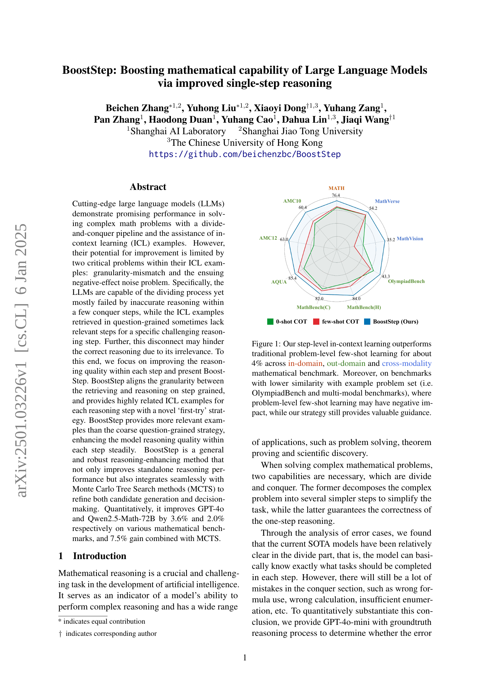
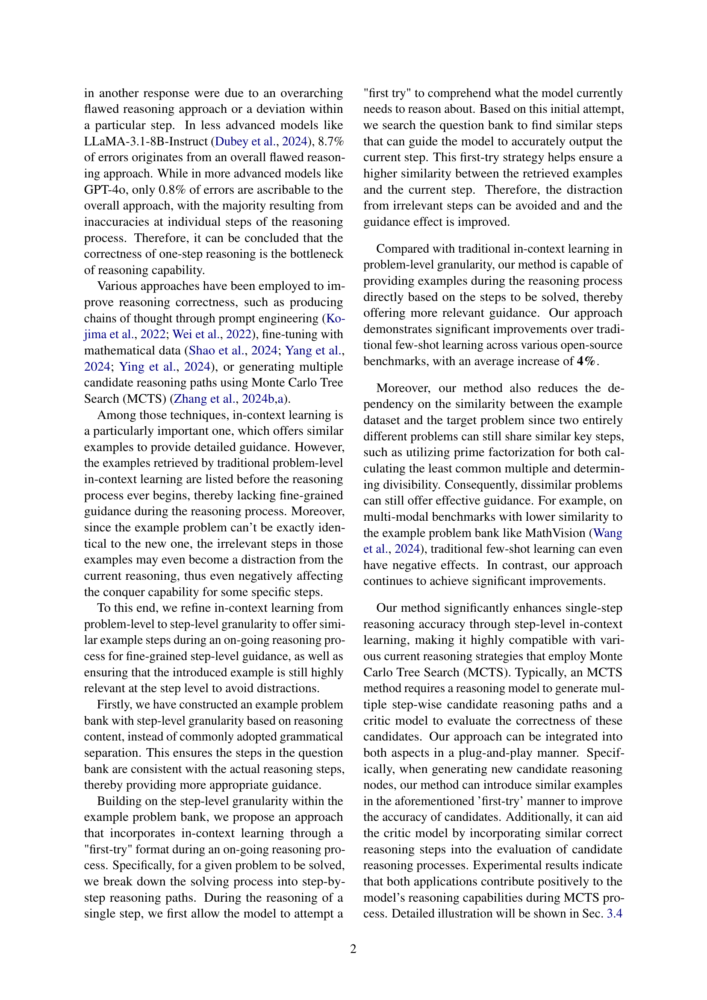
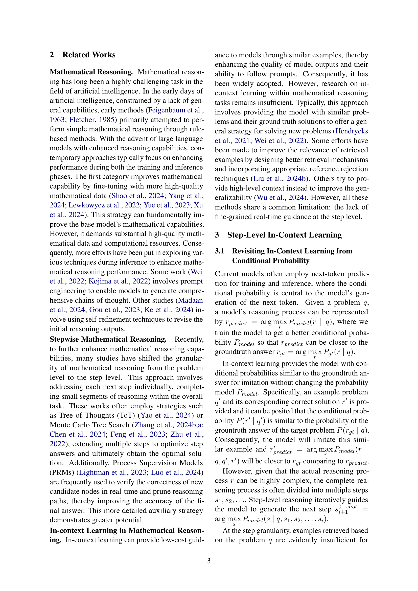
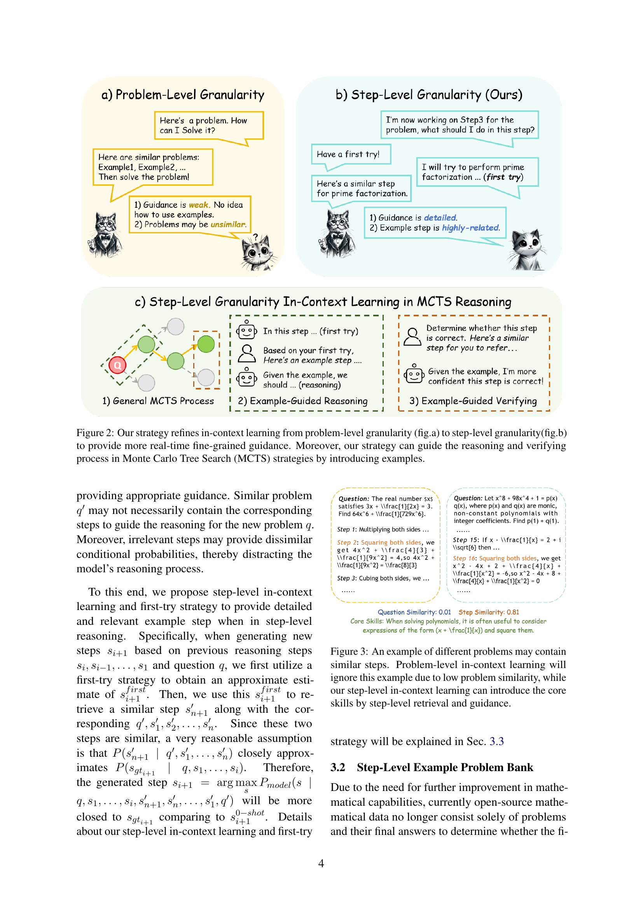
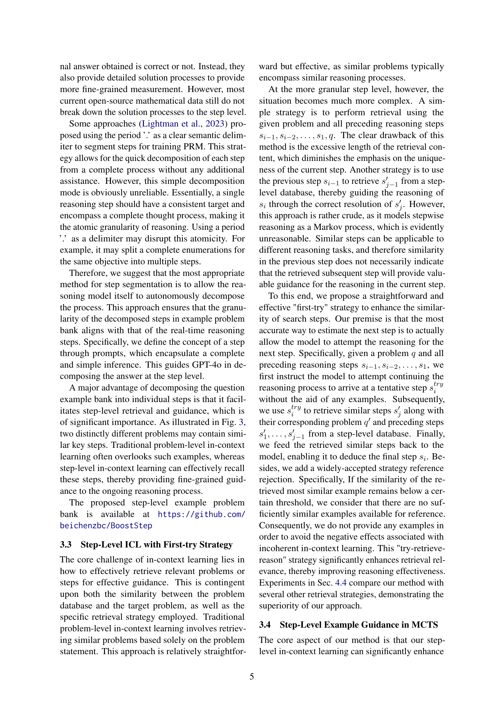
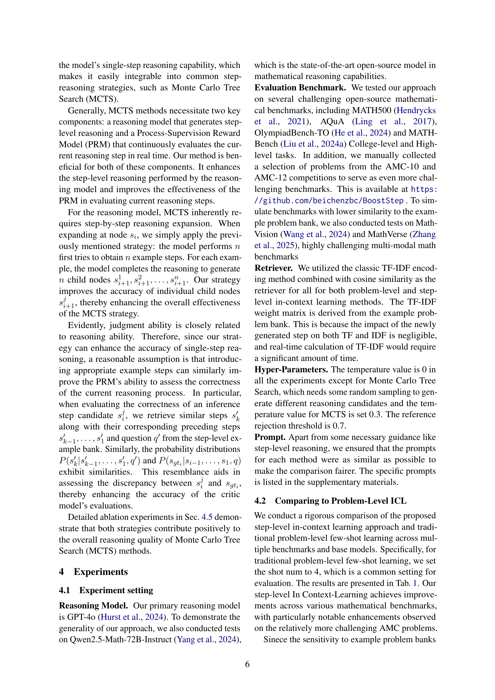
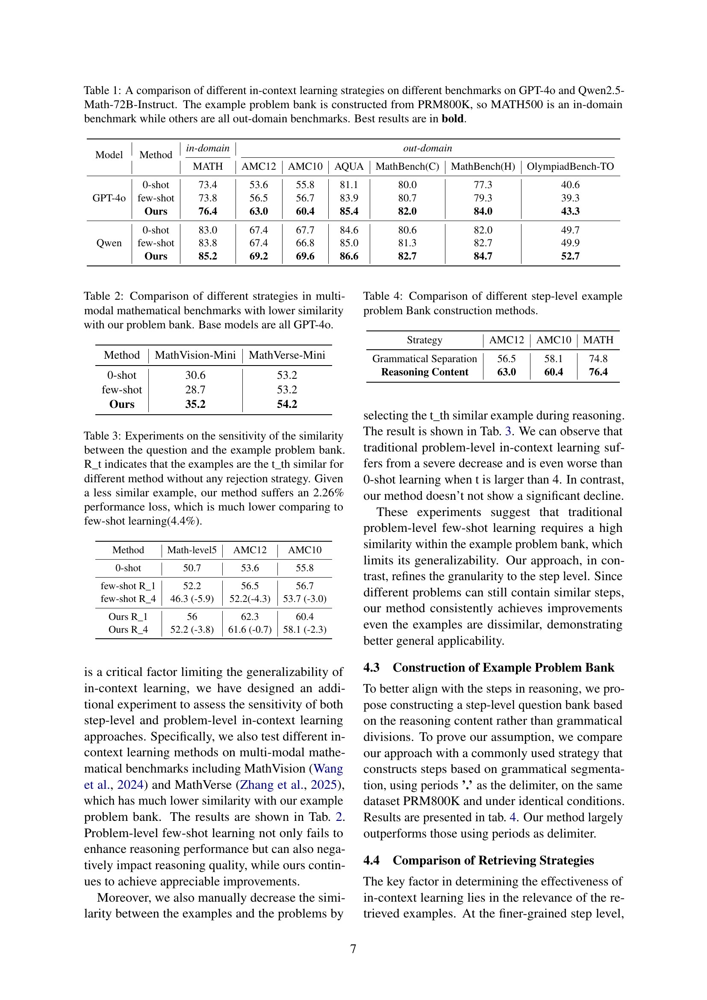
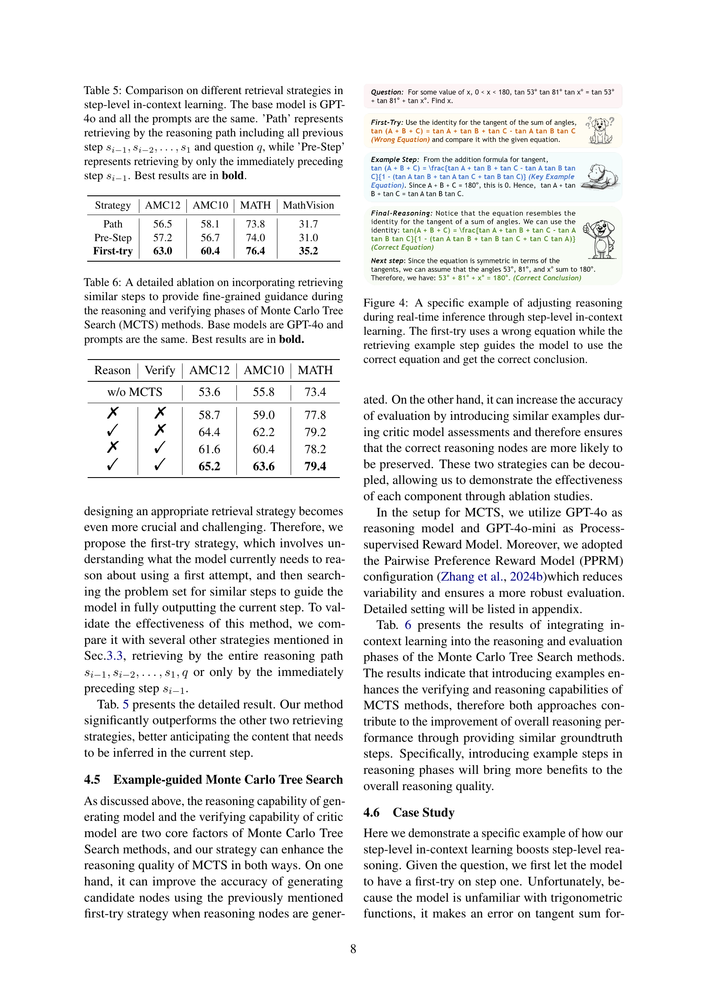
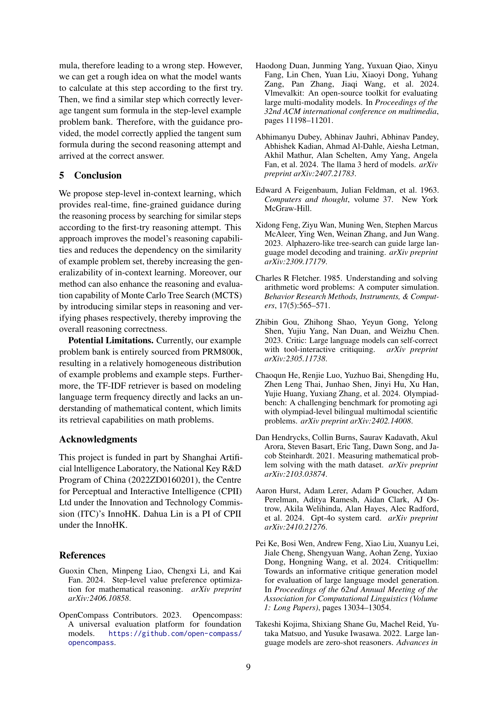
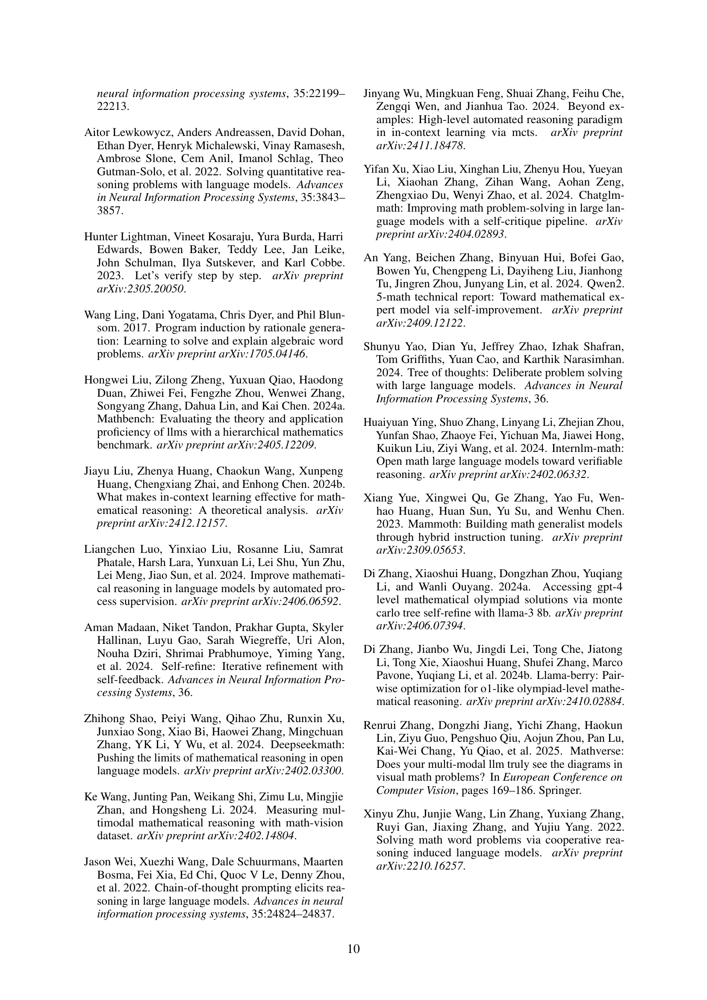
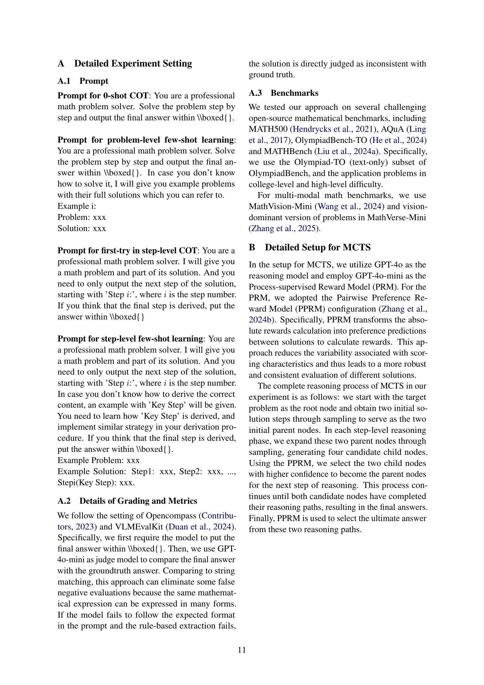
