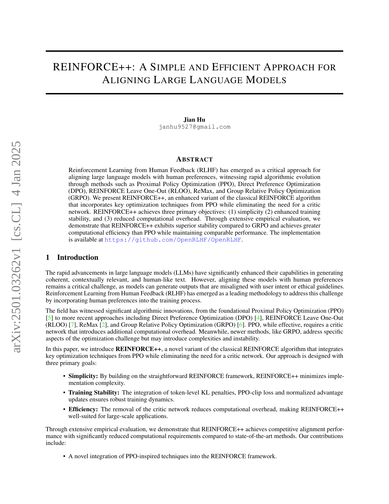
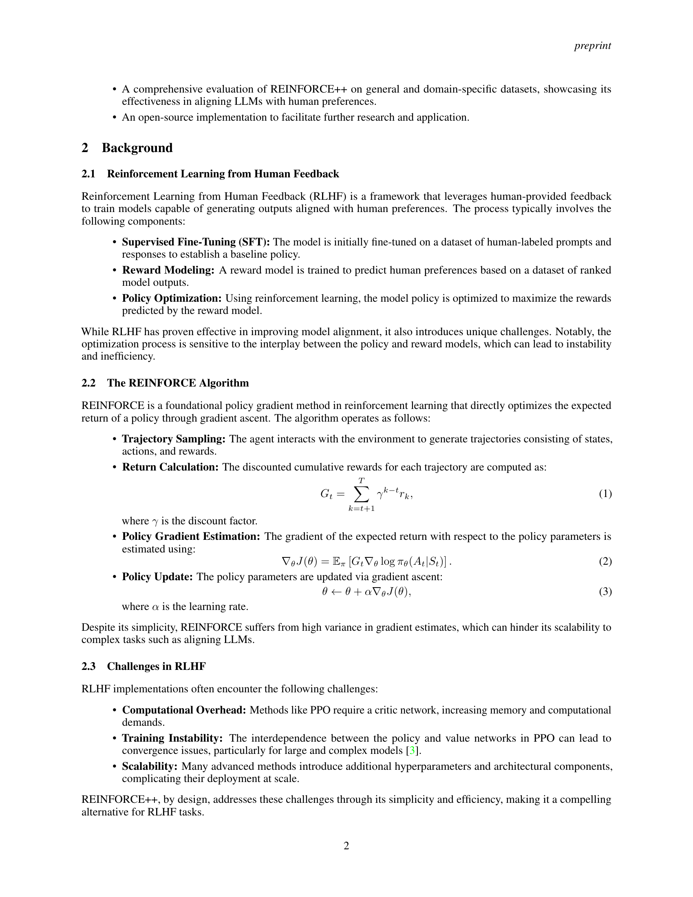
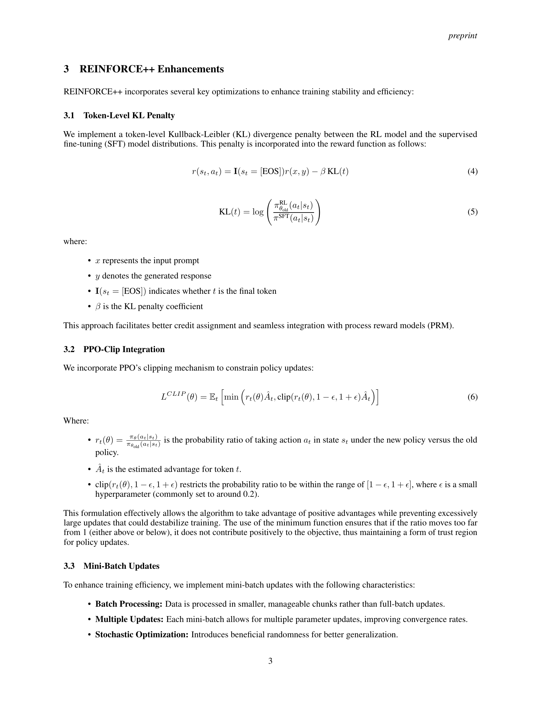
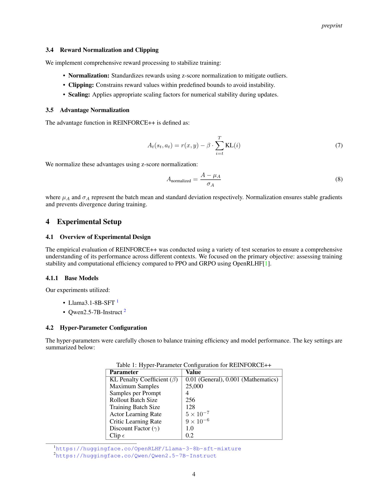
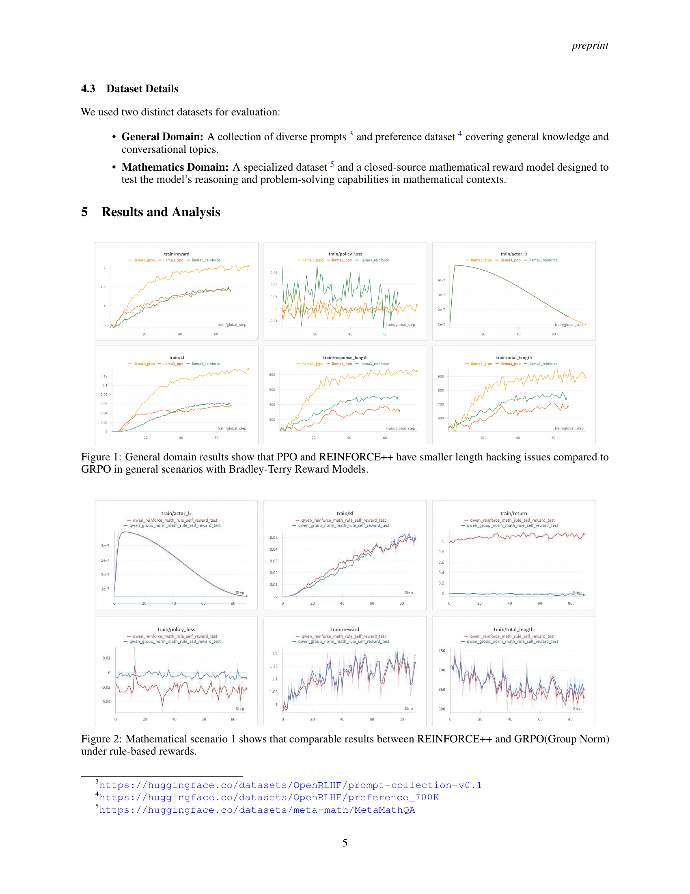
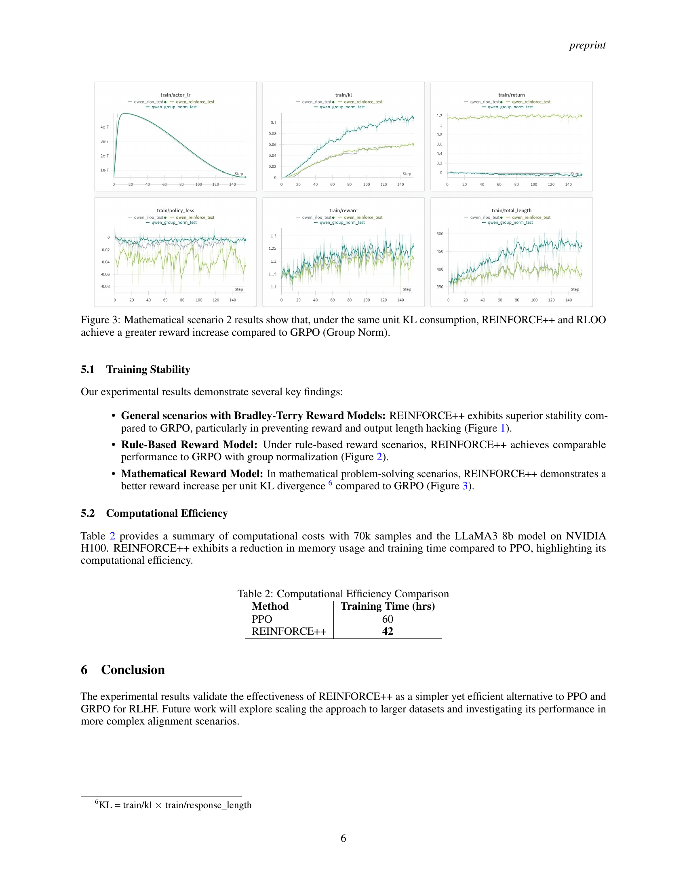
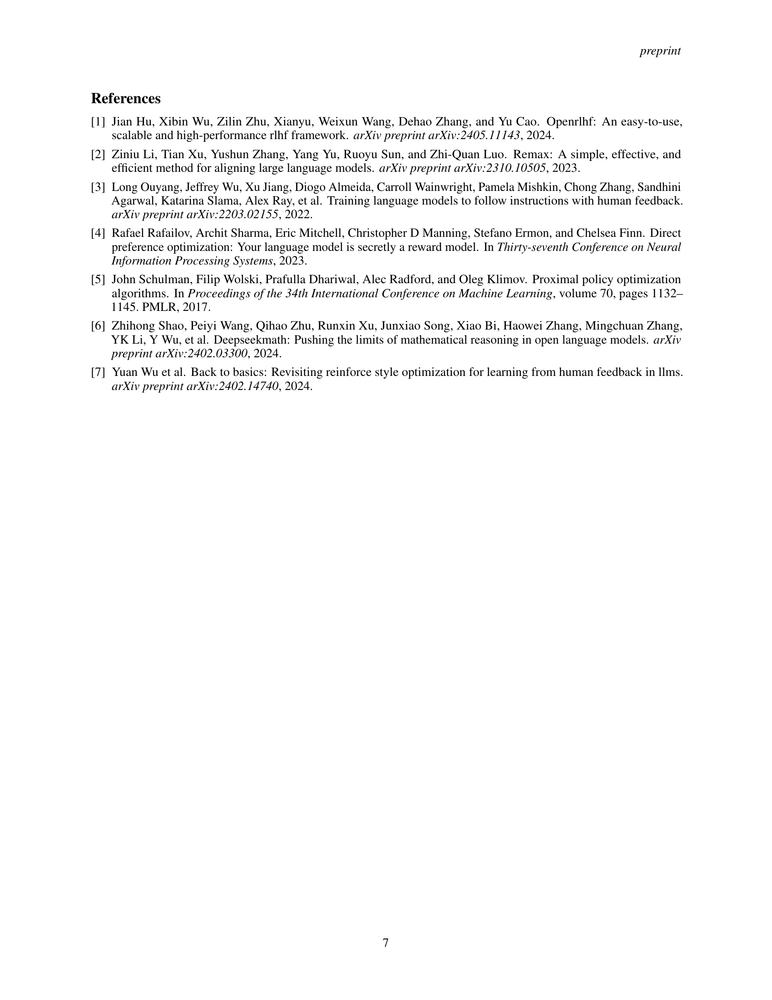

 


 2501.03262 
 Jian Hu et el. 
 
 🤗 2025-01-08 
 



↗ arXiv


↗ Hugging Face


↗ Papers with Code


### TL;DR



대규모 언어 모델(LLM)을 인간의 선호도에 맞추는 RLHF(Reinforcement Learning from Human Feedback)는 중요한 연구 분야입니다.  하지만 기존의 RLHF 알고리즘들은 **계산 비용이 많이 들고 훈련 과정이 불안정**하다는 문제점이 있습니다. 특히 PPO(Proximal Policy Optimization)는 효과적이지만 critic network 때문에 계산 비용이 높고, 최근 제안된 GRPO(Group Relative Policy Optimization)와 같은 알고리즘들도 복잡성과 불안정성 문제를 가지고 있습니다.

본 연구는 이러한 문제를 해결하기 위해 **REINFORCE++**라는 새로운 알고리즘을 제시합니다. REINFORCE++는 기존 REINFORCE 알고리즘에 PPO의 효율적인 최적화 기법들을 통합하여 **critic network 없이**  **훈련의 안정성을 높이고 계산 비용을 줄였습니다**.  여기에는 토큰 수준의 KL penalty, PPO-clip 메커니즘, 미니 배치 업데이트, 보상 정규화 등이 포함됩니다.  실험 결과, REINFORCE++는 GRPO보다 뛰어난 안정성을 보였고, PPO와 비슷한 성능을 유지하면서도 계산 효율성이 더 높았습니다.



#### Key Takeaways


 REINFORCE++는 기존 REINFORCE 알고리즘을 개선하여 PPO의 장점을 통합하면서도 critic network를 사용하지 않아 계산 비용을 줄이고 훈련 안정성을 높였습니다. 



 다양한 실험 결과를 통해 REINFORCE++가 GRPO보다 뛰어난 안정성을 보이고 PPO와 비슷한 성능을 유지하면서도 계산 효율성이 더 높다는 것을 입증했습니다. 



 REINFORCE++의 오픈소스 구현은 RLHF 연구 및 응용 분야의 발전에 기여할 것입니다. 


#### Why does it matter?
본 논문은 **RLHF(Reinforcement Learning from Human Feedback)** 분야의 주요 과제인 **계산 비용 및 훈련 불안정성**을 해결하는 새로운 접근법을 제시합니다.  **REINFORCE++** 알고리즘은 기존 REINFORCE 알고리즘의 장점을 유지하면서 PPO의 효율적인 최적화 기법을 통합하여 성능 저하 없이 안정성과 효율성을 크게 향상시켰습니다.  이는 대규모 언어 모델의 정렬 연구에 중요한 발전이며, 향후 연구의 새로운 방향을 제시할 수 있습니다. 특히, **오픈소스 구현**을 제공하여 연구자들이 쉽게 접근하고 활용할 수 있도록 함으로써,  RLHF 분야의 발전에 크게 기여할 것으로 예상됩니다.

------
#### Visual Insights

> 🔼 그림 1은 일반적인 시나리오에서 Bradley-Terry 보상 모델을 사용했을 때, PPO와 REINFORCE++가 GRPO에 비해 길이 조작 문제(length hacking issues)가 덜 발생함을 보여주는 일반 도메인 결과를 나타냅니다.  길이 조작이란 모델이 보상을 극대화하기 위해 응답 길이를 인위적으로 조절하는 현상을 말합니다. 이 그림은 REINFORCE++의 안정성과 효율성을 보여주는 주요 증거 중 하나입니다.  세 가지 알고리즘의 보상(reward), KL 발산(KL divergence), 정책 손실(policy loss), 응답 길이(response length), 학습률(learning rate), 총 길이(total length) 등의 지표를 비교 분석하여 각 알고리즘의 성능과 안정성을 평가합니다.
> 

> 
read the caption

> Figure 1: General domain results show that PPO and REINFORCE++ have smaller length hacking issues compared to GRPO in general scenarios with Bradley-Terry Reward Models.
> 


| Parameter | Value |
|---|---| 
| KL Penalty Coefficient (β) | 0.01 (General), 0.001 (Mathematics) |
| Maximum Samples | 25,000 |
| Samples per Prompt | 4 |
| Rollout Batch Size | 256 |
| Training Batch Size | 128 |
| Actor Learning Rate | 5×10⁻⁷ |
| Critic Learning Rate | 9×10⁻⁶ |
| Discount Factor (γ) | 1.0 |
| Clip ϵ | 0.2 |

> 🔼 REINFORCE++ 알고리즘에 대한 하이퍼파라미터 설정값을 보여주는 표입니다.  KL Penalty 계수, 최대 샘플 수, 프롬프트당 샘플 수, 배치 크기, 학습률, 할인율, 클립 값 등 REINFORCE++의 성능과 안정성에 영향을 미치는 주요 하이퍼파라미터 값들을 상세히 기술하고 있습니다.  이 표는 실험 설정과 결과 해석에 필수적인 정보를 제공합니다.
> 

> 
read the caption

> Table 1: Hyper-Parameter Configuration for REINFORCE++
> 

### In-depth insights

#### RLHF Algorithm Advancements
RLHF 알고리즘의 발전은 주로 **샘플 효율성**, **안정성**, 그리고 **계산 효율성** 개선에 초점을 맞추고 있습니다. 초기의 REINFORCE 알고리즘은 높은 분산으로 인해 훈련이 불안정하고 비효율적이었지만, PPO (Proximal Policy Optimization) 와 같은 방법들은 크리틱 네트워크를 도입하여 이러한 문제를 어느 정도 해결했습니다. 그러나 PPO는 여전히 계산 비용이 높다는 단점이 있습니다. 최근에는 DPO (Direct Preference Optimization), RLOO (REINFORCE Leave One-Out), ReMax, GRPO (Group Relative Policy Optimization) 등 다양한 방법들이 제시되었는데, 이들은 각기 다른 방식으로 샘플 효율성과 안정성을 개선하려는 시도를 보여줍니다. **REINFORCE++** 는 이러한 기존 방법들의 장점을 활용하면서 크리틱 네트워크 없이도 안정적이고 효율적인 훈련을 가능하게 하는 것을 목표로 합니다.  **토큰 수준의 KL 페널티**, **PPO 클리핑 메커니즘**, 그리고 **미니 배치 업데이트**와 같은 기술들을 통해 안정성과 효율성을 향상시키는 것이 핵심입니다.  이는 **단순성**과 **효율성**을 동시에 추구하는 접근 방식으로,  대규모 언어 모델의 정렬에 대한 실용적인 해결책을 제시하는 의미를 가집니다.

#### REINFORCE++ Enhancements
REINFORCE++는 기존 REINFORCE 알고리즘의 단점을 극복하고 효율성과 안정성을 개선하기 위해 몇 가지 중요한 향상을 통합합니다. **토큰 수준 KL 페널티**는 RL 모델과 SFT 모델 간의 분포 차이를 제어하여 학습 안정성을 높입니다. **PPO 클리핑 메커니즘**은 정책 업데이트를 제한하여 과도한 업데이트로 인한 불안정성을 방지합니다. **미니 배치 업데이트**는 전체 배치 업데이트보다 효율적인 학습을 가능하게 합니다.  **보상 정규화 및 클리핑**은 보상의 변동성을 줄이고 학습 안정성을 확보하며, **이점 정규화**는 안정적인 그래디언트를 보장합니다. 이러한 향상은 REINFORCE++가 기존 RLHF 접근 방식보다 뛰어난 성능과 효율성을 제공함을 보여줍니다.

#### Empirical Performance
본 논문에서 "경험적 성능" 부분은 REINFORCE++ 알고리즘의 실제 성능을 다양한 측면에서 평가한 결과를 제시할 것으로 예상됩니다. **다양한 데이터셋(일반 도메인, 수학 도메인 등)을 사용한 실험 결과**를 통해 REINFORCE++의 성능을 기존 방법(PPO, GRPO)과 비교 분석하고, **훈련 안정성, 계산 효율성, 그리고 실제 성능(예: 인간 선호도와의 정렬)** 측면에서의 우수성을 보여줄 것으로 예상됩니다.  **특히, 토큰 수준의 KL 손실, PPO 클리핑 메커니즘, 미니 배치 업데이트 등 REINFORCE++의 주요 특징들이 실제 성능 향상에 어떻게 기여하는지**에 대한 구체적인 분석이 포함될 것으로 예상되며, 이를 통해 **REINFORCE++ 알고리즘의 장점과 한계**에 대한 깊이 있는 이해를 제공할 수 있을 것입니다.  결과적으로, 이 부분은 논문의 핵심 주장을 뒷받침하는 중요한 증거를 제공하는 동시에,  **향후 연구 방향**에 대한 시사점을 제공하는 데에도 기여할 것으로 예상됩니다.

#### Computational Efficiency
본 논문에서 다룬 REINFORCE++의 **계산 효율성**은 기존 RLHF 접근 방식인 PPO와 비교하여 상당한 개선을 보여줍니다. 특히, critic network를 사용하지 않음으로써 메모리 사용량과 연산량을 줄이는 데 성공했습니다.  **PPO보다 훨씬 빠른 훈련 시간**을 기록했으며, 이는 대규모 언어 모델을 훈련시키는 데 있어 중요한 이점입니다.  **소규모 배치 업데이트** 전략을 통해 효율적인 학습을 가능하게 했고, 이는 대규모 데이터셋을 처리하는 데 매우 효과적입니다.  **Mini-Batch Updates**와 같은 기법들을 통해 **훈련 안정성**을 유지하면서 **계산 효율성**을 높인 점이 주목할 만합니다. 하지만,  **특정 하드웨어 환경** (NVIDIA H100)에서의 성능 측정 결과만 제시되어 다른 하드웨어 환경에서의 일반화 가능성은 추가 연구가 필요합니다.  **다양한 데이터셋 및 모델 규모**에 대한 실험 결과를 더 확장하여  REINFORCE++의 계산 효율성이 범용적임을 보여줄 필요가 있습니다.

#### Future Research
본 논문의 REINFORCE++는 RLHF(Reinforcement Learning from Human Feedback)에서 효율성과 안정성을 개선한 방법론으로, **향후 연구는 대규모 언어 모델의 정렬(alignment) 문제를 더욱 심도 있게 다루는 방향**으로 진행될 수 있습니다.  **더욱 방대한 데이터셋을 활용하여 모델의 일반화 성능을 향상시키고**, 다양한 도메인과 작업에 대한 적용 가능성을 확대하는 연구가 필요합니다. 또한, **REINFORCE++의 하이퍼파라미터 최적화 및 다양한 보상 함수(reward function) 설계**에 대한 연구를 통해 모델 성능을 더욱 개선할 수 있습니다. 특히, **인간의 피드백을 효율적으로 수집하고 처리하는 새로운 방법론**과, **REINFORCE++를 다른 RLHF 알고리즘과 결합하는 하이브리드 접근법**에 대한 연구는 주목할 만한 가치가 있습니다.  **모델의 설명가능성(explainability)을 높이는 연구** 또한 중요한데, 이는 모델의 의사결정 과정에 대한 이해를 높이고 신뢰성을 향상시키는 데 기여할 것입니다. 마지막으로, **다른 RL 기반 정렬 기법과 비교 분석**을 통해 REINFORCE++의 장단점을 명확히 하고, 그 한계를 극복하기 위한 후속 연구가 필요합니다. 이러한 연구를 통해, REINFORCE++는 더욱 강력하고 안정적인 RLHF 방법론으로 자리매김할 수 있을 것입니다.

### More visual insights

More on figures

> 🔼 그림 2는 규칙 기반 보상을 사용하는 수학적 시나리오에서 REINFORCE++와 GRPO(그룹 정규화)의 성능을 비교한 결과를 보여줍니다. 두 알고리즘 모두 유사한 성능을 보임을 알 수 있습니다.  이를 통해 REINFORCE++가 규칙 기반 보상 시나리오에서도 효과적임을 시사합니다.
> 

> 
read the caption

> Figure 2: Mathematical scenario 1 shows that comparable results between REINFORCE++ and GRPO(Group Norm) under rule-based rewards.
> 

> 🔼 그림 3은 수학적 시나리오 2에 대한 결과를 보여줍니다. 동일한 단위 KL 소모량에서 REINFORCE++와 RLOO는 GRPO(Group Norm)에 비해 더 큰 보상 증가를 달성함을 보여줍니다. 이는 REINFORCE++와 RLOO가 GRPO보다 학습 안정성이 더 뛰어나고 효율적임을 시사합니다.  두 알고리즘 모두 KL divergence를 효과적으로 관리하면서 보상을 극대화하는 데 성공했음을 의미합니다. 이러한 결과는 REINFORCE++와 RLOO가 복잡한 수학적 문제 해결에 더 적합하다는 것을 시사합니다.
> 

> 
read the caption

> Figure 3: Mathematical scenario 2 results show that, under the same unit KL consumption, REINFORCE++ and RLOO achieve a greater reward increase compared to GRPO (Group Norm).
> 

### Full paper



