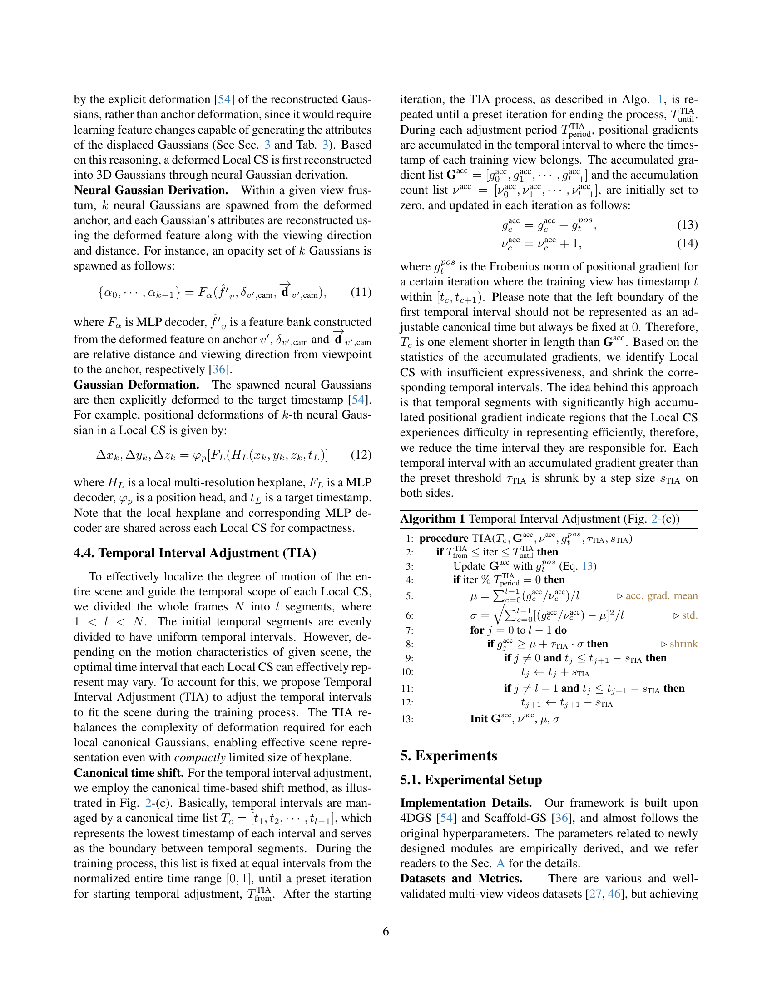

 


 2501.03714 
 Sangwoon Kwak et el. 
 
 🤗 2025-01-08 
 



↗ arXiv


↗ Hugging Face


↗ Papers with Code


### TL;DR



기존의 동적 3D 가우시안 스플래팅(3DGS) 기법들은 복잡한 동작을 가진 실제 동영상을 효율적으로 처리하는 데 어려움을 겪고 있습니다. 특히, 메모리 사용량이 많고, 복잡한 동작을 제대로 표현하지 못하는 문제가 있습니다.  이는 **대용량의 메모리**와 **느린 렌더링 속도**로 이어져 실시간 애플리케이션에 적용하는 데 제약이 있습니다.

본 논문에서는 이러한 문제를 해결하기 위해 **MoDec-GS**라는 새로운 프레임워크를 제안합니다. MoDec-GS는 **글로벌-로컬 모션 분해(GLMD)** 기법과 **시간 간격 조정(TIA)** 기법을 사용하여 복잡한 동작을 효율적으로 처리합니다. GLMD는 복잡한 동작을 **글로벌 동작**과 **로컬 동작**으로 분해하여 모델링하며, TIA는 각 로컬 영역의 시간 간격을 동적으로 조정하여 모델 크기를 최소화합니다. 실험 결과, MoDec-GS는 기존 기법들보다 훨씬 적은 메모리 사용량으로 동일하거나 더 나은 렌더링 품질을 달성함을 보여줍니다.



#### Key Takeaways


 MoDec-GS는 글로벌-로컬 모션 분해(GLMD)를 통해 복잡한 동작을 효과적으로 모델링합니다. 



 시간 간격 조정(TIA)을 통해 메모리 사용량을 최소화하고 다양한 모션에 적응합니다. 



 실제 동영상 데이터셋에서 기존 최첨단 기법보다 렌더링 품질을 유지하거나 개선하면서 모델 크기를 최대 70%까지 줄였습니다. 


#### Why does it matter?
본 논문은 **동적 3D 가우시안 스플래팅(3DGS)**의 메모리 효율성 및 렌더링 성능을 크게 향상시키는 새로운 프레임워크를 제시하여 **실시간 동적 신(scene) 재구성** 분야에 중요한 기여를 합니다.  **복잡한 동작을 효과적으로 모델링**하고, **메모리 사용량을 최소화**하며 **높은 품질의 렌더링**을 제공하는 방법을 제시함으로써, 관련 연구 분야의 발전에 큰 영향을 미칠 것으로 예상됩니다. 또한, **비균일 시간 간격 조정(TIA)** 기법을 통해 모델의 크기를 최소화하고 다양한 유형의 모션에 적응하는 방법을 제시하여 **향후 연구 방향**을 제시합니다.

------
#### Visual Insights

> 🔼 그림 1은 논문에서 제시하는 새로운 프레임워크인 MoDec-GS가 복잡한 움직임을 가진 실제 영상으로부터 효율적인 동적 3D 가우시안을 학습하는 것을 보여줍니다. 기존 최첨단 방법들([57, 20, 54])은 전역적 및 국지적 움직임의 복잡한 조합을 모델링하는 데 어려움을 겪는 반면, MoDec-GS는 GLMD(4.1절)를 통해 이러한 문제를 효과적으로 해결하여 더 작은 모델 크기로도 우수한 렌더링 품질을 제공합니다. 각 프레임워크의 성능 지표는 PSNR(dB), LPIPS [59], 저장 용량(MB)으로 나타내며, 화살표는 지표의 개선 방향을 나타냅니다(↑:개선, ↓:악화).
> 

> 
read the caption

> Figure 1: Novel view synthesis results on [45]. We introduce MoDec-GS, a novel framework for learning compact dynamic 3D Gaussians from real-world videos with complex motion. While existing SOTA methods [57, 20, 54] have difficulty modeling such complex combination of global and local motions, our approach effectively handles them thanks to GLMD (Sec. 4.1), and outperforms the prior methods in rendering quality even with a compact model size. The metrics under each framework are, PSNR (dB)↑↑\uparrow↑ / LPIPS [59] ↓↓\downarrow↓ / Storage (MB)↓↓\downarrow↓.
> 


| Method | Apple |  | Block |  | Paper-windmill |  | Space-out |  |
|---|---|---|---|---|---|---|---|---|
| SC-GS [20] | 14.96 / 0.692 / 0.508 | 173.3 | 13.98 / 0.548 / 0.483 | 115.7 | 14.87 / **0.221** / 0.432 | 446.3 | **14.79** / 0.511 / **0.440** | 114.2 |
| Deformable 3DGS [57] | ***15.61*** / ***0.696*** / **0.367** | 87.71 | ***14.87*** / ***0.559*** / **0.390** | 118.9 | ***14.89*** / 0.213 / **0.341** | 160.2 | 14.59 / 0.510 / ***0.450*** | ***42.01*** |
| 4DGS [54] | 15.41 / 0.691 / 0.524 | ***61.52*** | 13.89 / 0.550 / 0.539 | ***63.52*** | 14.44 / 0.201 / 0.445 | 123.9 | 14.29 / ***0.515*** / 0.473 | 52.02 |
| MoDec-GS (Ours) | **16.48** / **0.699** / ***0.402*** | **23.78** | **15.57** / **0.590** / ***0.478*** | **13.65** | **14.92** / ***0.220*** / ***0.377*** | **17.08** | ***14.65*** / **0.522** / 0.467 | **18.24** |

> 🔼 표 1은 iPhone 데이터셋 [16]에 대한 정량적 결과 비교를 보여줍니다. 빨간색과 파란색은 각각 최고 및 두 번째로 좋은 성능을 나타냅니다. 각 블록 요소는 5가지 성능 지표 (mPSNR(dB)↑, mSSIM↑, mLPIPS↓, 저장용량(MB)↓)를 나타냅니다.  mPSNR은 Peak Signal-to-Noise Ratio를, mSSIM은 Structural Similarity Index를, mLPIPS는 Learned Perceptual Image Patch Similarity를 의미하며, 각각 값이 높을수록, 높을수록, 낮을수록 좋습니다. 저장용량은 모델 크기를 나타내며, 값이 낮을수록 좋습니다. 이 표는 제안된 MoDec-GS 방법과 다른 최첨단 방법들의 성능을 비교하여 MoDec-GS의 효율성과 성능을 보여줍니다.
> 

> 
read the caption

> Table 1: Quantitative results comparison on iPhone datasets [16]. Red and blue denote the best and second best performances, respectively. Each block element of 5-performance denotes (mPSNR(dB)↑↑\uparrow↑ / mSSIM↑↑\uparrow↑ / mLPIPS↓↓\downarrow↓   Storage(MB)↓↓\downarrow↓).
> 

### In-depth insights

#### Dynamic 3DGS
본 논문에서 다루는 다이내믹 3DGS는 기존의 정적 3D Gaussian Splatting (3DGS)을 동적 장면에 적용하기 위한 여러 시도들을 포괄하는 개념입니다. **기존의 3DGS가 정지된 장면 표현에 탁월한 성능을 보이는 반면, 동적 장면에서는 시간에 따른 변화를 효과적으로 표현하는 데 어려움이 있습니다.**  논문에서는 이러한 문제를 해결하기 위해 시간적 변화를 모델링하는 다양한 방법론, 예를 들어 변형 기반 방법이나 4D Gaussian 기반 방법 등이 제시되었음을 분석하고 있습니다.  특히, **메모리 효율성을 높이기 위한 다양한 압축 기법들과, 복잡한 움직임을 효과적으로 모델링하는 새로운 접근법들이 연구되었다는 점을 강조합니다.**  **본 논문의 MoDec-GS는 이러한 기존 연구들을 바탕으로, 글로벌-로컬 모션 분해와 시간 간격 조정 기법을 통해 다이내믹 3DGS의 효율성과 정확도를 개선하고자 하는 새로운 시도로 볼 수 있습니다.**  결론적으로 다이내믹 3DGS는 꾸준히 발전하고 있으며, 효율성과 정확도를 동시에 향상시키기 위한 다양한 연구가 지속적으로 진행되고 있음을 보여주는 중요한 주제입니다.

#### GLMD Approach
본 논문에서 제안하는 GLMD(Global-to-Local Motion Decomposition) 기법은 **동적인 3D Gaussian Splatting을 위한 핵심적인 접근 방식**입니다.  기존의 방법들이 복잡한 동작을 모델링하는 데 어려움을 겪는 것과 달리, GLMD는 **전역적인 움직임과 국소적인 움직임을 분리하여 효과적으로 다루는 전략**을 채택합니다.  **전역적 움직임은 GAD(Global Anchor Deformation)를 통해 효율적으로 표현**하고, **국소적 움직임은 LGD(Local Gaussian Deformation)를 통해 정교하게 조정**함으로써, 복잡한 실제 영상의 동작을 효과적으로 모델링합니다.  **TIA(Temporal Interval Adjustment) 기법을 통해 각 국소 영역의 시간적 범위를 자동으로 조절**하여 모델의 크기를 줄이면서도 우수한 렌더링 품질을 유지합니다.  따라서 GLMD는 **메모리 효율성과 렌더링 속도를 동시에 개선**하는 데 크게 기여하며, 복잡한 동작을 가진 실제 세계 영상에 대한 새로운 접근 방식을 제시합니다.

#### TIA Optimization
본 논문에서 제안하는 시간 간격 조정(TIA) 최적화는 동적 장면 내 움직임의 복잡성을 효과적으로 처리하기 위한 핵심 전략입니다. **TIA는 각 로컬 CS(Canonical Scaffold-GS)에 할당된 시간 간격을 동적으로 조정하여 모델 크기를 줄이면서도 높은 시각적 품질을 유지하는 데 기여합니다.**  기존 방식과 달리, 외부 정보 없이 학습 과정에서 자동으로 최적의 시간 간격을 찾아내는 점이 특징입니다.  **이는 단순히 움직임의 크기만 고려하는 것이 아니라, 장면의 특성에 맞춰 유연하게 시간 간격을 조절함으로써 효율성을 극대화** 합니다.  이를 통해 복잡한 동작을 효율적으로 모델링하고, 메모리 효율적인 동적 3D 가우시안 스플래팅을 가능하게 합니다.  **TIA 최적화는 단순한 기술적 개선을 넘어, 동적 장면 표현의 근본적인 한계를 극복하기 위한 중요한 접근 방식**임을 시사합니다.  이는 향후 동적 신(scene) 재구성 연구에 시사하는 바가 크며, 메모리 효율성과 시각적 품질을 동시에 높이는 데 중요한 역할을 할 것으로 기대됩니다.

#### Ablation Studies
본 논문의 "절제 연구(Ablation Studies)" 부분은 **MoDec-GS 모델의 성능에 기여하는 각 구성 요소의 중요성을 객관적으로 평가**하기 위해 수행되었습니다.  **전체 모델에서 특정 모듈이나 기능을 제거하여 성능 변화를 분석**함으로써, 각 구성요소의 효과를 정량적으로 파악하고 모델 설계의 타당성을 검증하는 데 초점을 맞춥니다.  특히, **전역-지역 운동 분해(GLMD), 전역 앵커 변형(GAD), 지역 가우시안 변형(LGD), 그리고 시간 간격 조정(TIA)** 등 핵심 모듈들의 기여도를 개별적으로 분석하여, **각 모듈이 모델 성능 향상에 미치는 영향을 명확히 제시**할 것으로 예상됩니다.  또한, **다양한 변수 조합을 통해 최적의 모델 구조를 도출**하고, **개선 여지가 있는 부분을 확인**하여 향후 연구 방향을 제시하는 데 활용될 수 있을 것입니다.  **절제 연구의 결과는 모델의 견고성 및 일반화 능력을 평가하는 데에도 중요한 역할**을 합니다.

#### Future Works
본 논문의 "미래 연구 방향"에 대한 심도있는 고찰은 다음과 같습니다.  **3D 가우시안 스플래팅(3DGS) 기반의 동적 장면 재구성에서 얇고 매우 디테일한 질감을 가진 물체를 효과적으로 표현하는 데에는 한계가 존재**한다는 점을 명확히 지적하고 있습니다.  **기존 방법과 본 논문의 방법 모두 얇고 세밀한 질감을 가진 물체를 제대로 표현하는 데 어려움**을 겪는다는 것을 보여주는 실패 사례(HyperNeRF-broom 데이터셋)가 제시되었습니다. 따라서 **향후 연구는 텍스처 매핑이나 알파 매핑과 같은 기존 그래픽 기술을 3DGS에 통합하거나, 3D 가우시안 대신 일반화된 지수 스플래팅을 활용**, **계층적 피라미드 특징을 이용하여 더욱 세밀한 디테일을 포착**하는 방향으로 진행될 수 있을 것입니다.  **특히 복잡하고 세밀한 질감을 가진 장면에서의 강건성을 높이는 데 집중**하는 것이 중요하며, 이를 통해 **실제 환경에서의 동적 장면 재구성 기술의 실용성을 더욱 높일 수 있을 것**으로 예상됩니다.  **실제 로봇 공학 분야와의 연계**를 통해 더욱 현실적인 데이터를 확보하고 이를 바탕으로 알고리즘의 성능을 향상시키는 연구도 기대됩니다.

### More visual insights

More on figures

> 🔼 그림 2는 논문에서 제안하는 MoDec-GS 프레임워크의 개요를 보여줍니다. 복잡한 움직임을 가진 동적인 3D 가우시안을 효과적으로 학습하기 위해, 전역-지역 운동 분해(GLMD) 기법을 도입합니다. 먼저, 전체 프레임을 사용하여 전역 정준 Scaffold-GS(전역 CS)를 학습하고, 해당 시간 구간을 나타내는 지역 정준 Scaffold-GS(지역 CS)에 전역 앵커 변형(GAD)을 적용합니다. 다음으로, 나머지 지역 운동을 미세하게 조정하기 위해, 공유 육면체를 사용하여 재구성된 3D 가우시안에 지역 가우시안 변형(LGD)을 적용합니다. 학습 과정 동안, 시간 간격 조정(TIA)을 수행하여 장면의 움직임 수준에 맞는 비균일 시간 간격으로 시간 간격을 최적화합니다.
> 

> 
read the caption

> Figure 2: Overview of our MoDec-GS framework. To effectively train dynamic 3D Gaussians with complex motion, we introduce Global-to-Local Motion Decomposition (GLMD) (Sec 4.1). We first train a Global Canonical Scaffold-GS (Global CS) with entire frames, and apply a Global Anchor Deformation (GAD) to Local Canonical Scaffold-GS (Local CS) dedicated to represent its corresponding temporal segment (Sec 4.2). Next, to finely adjust the remaining local motion, we apply Local Gaussian Deformation (LGD) which explicitly deforms the reconstructed 3D Gaussians with a shared hexplane (Sec 4.3). During the training, Temporal Interval Adjustment (TIA) is performed, optimizing the temporal interval into a non-uniform interval that adopts to the scene’s level of motion (Sec 4.4).
> 

> 🔼 그림 3은 MoDec-GS의 핵심인 2단계 변형 과정(Global Anchor Deformation과 Local Gaussian Deformation)을 보여줍니다. 복잡한 움직임을 가진 3D Gaussian을 효과적으로 표현하기 위해, 전체 시퀀스에 걸친 큰 움직임(Global motion)은 앵커 자체의 변형을 통해 효율적으로 처리합니다. 반면, 특정 시간 간격 내의 미세한 움직임(Local motion)은 각 Gaussian을 명시적으로 변형하여 처리합니다.  즉, Global Anchor Deformation은 전체적인 움직임을, Local Gaussian Deformation은 세부적인 움직임을 각각 담당하여 효율적이고 정확하게 동적인 장면을 재구성합니다.
> 

> 
read the caption

> Figure 3: Concept and effect of 2-stage deformation. For representing a complex motion of 3D Gaussians, a global movement over time intervals can be more efficiently handled through deformation of anchor itself. In contrast, subtle motions of individual 3D Gaussians within a time interval can be effectively addressed by explicit deformation of each Gaussian.
> 

> 🔼 그림 4는 제안된 방법이 눈에 띄는 화질 개선을 달성한 영역을 강조 표시하여 세 데이터 세트 [16, 45, 58]에 대한 정성적 결과 비교를 보여줍니다. 노란색 상자는 제안된 방법이 주목할 만한 화질 향상을 달성한 영역을 강조 표시합니다. 해당 시퀀스에 대한 저장 용량은 각 렌더링된 패치 아래에 표시됩니다.  이 그림은 제안된 MoDec-GS 방법이 기존 방법보다 더 나은 화질을 제공하며, 동시에 모델 크기를 상당히 줄일 수 있음을 보여주는 시각적 증거를 제공합니다.
> 

> 
read the caption

> Figure 4: Qualitative results comparison on three datasets [16, 45, 58]. The yellow boxes highlight areas where the proposed method achieves notable visual quality improvements, and the storage for the corresponding sequence is displayed below each rendered patch.
> 

> 🔼 그림 5는 제안된 TIA(Temporal Interval Adjustment) 기법의 효과를 보여줍니다. TIA는 각 Local CS(Local Canonical Scaffold-GS)의 최적 시간 간격을 자동으로 조정하여 복잡한 동작을 효율적으로 나타내는 것을 목표로 합니다. 그림은 각 Local CS에 할당된 시간 간격을 처음에는 균일하게 설정했다가, TIA를 적용하여 비균일적인 간격으로 조정하는 과정을 보여줍니다.  수평축은 정규화된 시간을, 수직축은 정규화된 광학 흐름 크기를 나타내며, 시간 간격에 따른 광학 흐름 밀도의 변화를 시각적으로 보여줍니다.  TIA를 통해 광학 흐름이 높은 영역(동작이 많은 영역)의 시간 간격은 감소하고, 광학 흐름이 낮은 영역(동작이 적은 영역)의 시간 간격은 증가함으로써 모델 크기를 줄이면서도 동작 표현의 효율성을 높이는 것을 확인할 수 있습니다.
> 

> 
read the caption

> Figure 5: TIA effectiveness.
> 

> 🔼 그림 6은 다양한 신경망 기반 새로운 뷰 합성(NVS) 프레임워크들의 성능을 비교한 그래프입니다.  x축은 초당 프레임 수(FPS)로 렌더링 속도를 나타내고, y축은 PSNR 값으로 화질을 나타냅니다. 각 프레임워크는 원의 형태로 표시되며, 원의 크기는 모델 크기(MB)를 나타냅니다.  즉, 원이 클수록 모델이 크고, 원의 위치는 속도와 화질의 상관관계를 보여줍니다. 이 그래프를 통해 MoDec-GS가 경쟁력 있는 모델 크기로 우수한 성능을 달성했음을 시각적으로 확인할 수 있습니다.
> 

> 
read the caption

> Figure 6: Performance comparison visualization graph. The x𝑥xitalic_x-axis represents rendering speed (FPS)↑↑\uparrow↑, and the y𝑦yitalic_y-axis indicates PSNR↑↑\uparrow↑. Each framework is depicted as a bubble, with the size of the bubble representing the model storage size (MB)↓↓\downarrow↓.
> 

> 🔼 그림 7은 MoDec-GS의 GLMD(Global-to-Local Motion Decomposition) 동작을 시각적으로 보여줍니다. HyperNeRF 데이터셋의 레몬 자르는 장면을 예시로 사용하여, 고정된 카메라 시점에서 Global CS(Canonical Scaffold-GS), Local CS, 그리고 각 시간 단계의 렌더링된 패치를 보여줍니다.  각 변환 단계에서 포착된 움직임을 관찰하기 위해 패치 간의 광학 흐름 색상 맵을 함께 표시합니다. GAD(Global Anchor Deformation) 단계에서는 주로 레몬과 칼처럼 움직임이 큰 물체 주변에서 변형이 발생하며, 전반적인 색상 경향이 유사하여 유사한 전역적 움직임 방향을 나타냅니다. 반면에 LGD(Local Gaussian Deformation) 단계에서는 전체 장면에 걸쳐 다양한 방향의 국지적 움직임이 관찰됩니다. 이는 GLMD가 제한된 크기의 헥스플레인을 사용하더라도 복잡한 움직임을 효과적으로 포착할 수 있음을 시각적으로 보여줍니다.
> 

> 
read the caption

> Figure 7: Visualization of GLMD. For cut-lemon scene in HyperNeRF [45] dataset, the rendered patch of Global CS, Local CS, and each time stamp are presented for a fixed camera viewpoint. We also illustrate the optical flow color map between those patches to observe the captured motion at each deformation stage. At GAD stage, deformation in mainly found near objects with dominant motion (e.g., the lemon and knife), and the overall color trends are similar, indicating a similar global motion direction. In contrast, at the LGD stage, motion is observed across the entire scene, with relatively more diverse range of motion directions.
> 

More on tables


| Method | Spin |  | Teddy |  | Wheel |  | Average |  |
|---|---|---|---|---|---|---|---|---|
| SC-GS [20] | 14.32 / 0.407 / 0.445 | 219.1 | 12.51 / 0.516 / 0.562 | 318.7 | 11.90 / 0.354 / 0.484 | 239.2 | 13.90 / 0.464 / 0.479 | 232.4 |
| Deformable 3DGS [57] | 13.10 / 0.392 / 0.490 | 133.9 | 11.20 / 0.508 / 0.573 | 117.1 | 11.79 / 0.345 / 0.394 | 106.1 | 13.72 / 0.461 / 0.430 | 109.4 |
| 4DGS [54] | 14.89 / 0.413 / 0.441 | 71.80 | 12.31 / 0.509 / 0.605 | 80.44 | 10.83 / 0.339 / 0.538 | 96.50 | 13.72 / 0.460 / 0.509 | 78.54 |
| MoDec-GS (Ours) | 15.53 / 0.433 / 0.366 | 26.84 | 12.56 / 0.521 / 0.598 | 12.28 | 12.44 / 0.374 / 0.413 | 16.68 | 14.60 / 0.480 / 0.443 | 18.37 |
> 🔼 표 2는 논문의 실험 결과를 보여주는 표입니다. (a)는 HyperNeRF 데이터셋 [45], (b)는 Nvidia 모노큘러 데이터셋 [58]에 대한 정량적 비교 결과를 보여줍니다. 각 데이터셋에 대해 여러 방법(SC-GS [20], Deformable 3DGS [57], 4DGS [54], MoDec-GS(본 논문의 방법))의 PSNR(dB), SSIM, LPIPS, 그리고 모델 크기(Storage)를 비교하여 MoDec-GS의 성능을 보여줍니다.  PSNR과 SSIM은 높을수록, LPIPS는 낮을수록, Storage는 작을수록 성능이 좋음을 의미합니다.
> 

> 
read the caption

> Table 2: Quantitative results comparison on (a) HyperNeRF [45] and (b) Nvidia monocular [58] dataset.
> 


| Methods | PSNR ↑ | SSIM ↑ | LPIPS ↓ | Storage ↓ |
|---|---|---|---|---|
| SC-GS [CVPR’24] [20] | 26.95 | 0.815 | **0.213** | 226.0 |
| Deformable 3DGS [CVPR’24] [57] | 25.96 | 0.766 | 0.294 | 87.13 |
| 4DGS [CVPR’24] [54] | **27.44** | 0.797 | 0.302 | **72.65** |
| Ours | ***27.78*** | ***0.827*** | ***0.219*** | ***40.82*** |
> 🔼 표 3은 제안된 MoDec-GS 방법의 성능에 대한 ablation study 결과를 보여줍니다. 각 구성 요소(Global Anchor Deformation, Local Gaussian Deformation, Temporal Interval Adjustment)를 제거하거나 변경했을 때의 성능 변화를 정량적으로 분석하여 MoDec-GS의 각 부분이 전체 성능에 미치는 영향을 파악합니다. 특히, 노란색-녹색 배경은 제안된 방법을 적용함으로써 저장 용량이 눈에 띄게 감소한 경우를 강조합니다.  PSNR, SSIM, LPIPS, 모델 크기(Storage)를 측정하여 비교 분석하였습니다.
> 

> 
read the caption

> Table 3: Ablation studies of the proposed methods. Yellow-green backgrounds highlight cases where the applying of the proposed method resulted in a noticeable reduction in storage.
> 


| Methods | PSNR ↑ | SSIM ↑ | LPIPS ↓ | Storage ↓ |
|---|---|---|---|---|
| (b) Nvidia |
| 4DGS [CVPR’24] [54] | 25.82 | 0.844 | 0.219 | 67.44 |
| Ours | **26.65** | **0.876** | **0.171** | **39.64** |
> 🔼 표 4는 NeRF 확장 프레임워크와의 성능 비교 결과를 보여줍니다. 훈련 시간과 렌더링 속도를 포함합니다. 536x960 HyperNeRF vrig 데이터셋 [45]을 기준으로 평균을 냈습니다. [44, 45, 11, 22, 18]의 성능 수치는 [54]에서 가져왔습니다. [54]에서 보고된 훈련 시간과 실행 시간은 NVIDIA RTX 3090 GPU에서 측정되었지만, 본 연구의 프레임워크는 RTX A6000 GPU에서 테스트되었습니다. RTX A6000 GPU는 RTX 3090에 비해 메모리 대역폭이 약 20% 낮다는 점에 유의하십시오.
> 

> 
read the caption

> Table 4: Performance comparison with a NeRF-extension framework, including training and rendering speed. Averaged over 536×\times×960 HyperNeRF’s vrig datasets [45]. The performance numbers of [44, 45, 11, 22, 18] are sourced from [54]. The training times and run times reported in [54] were measured on an NVIDIA RTX 3090 GPU, while our framework was tested on an RTX A6000 GPU. Please note that the A6000 GPU has approximately 20 %percent\%% lower memory bandwidth compared to that of the RTX 3090.
> 


| Variant | mPSNR ↑ | mSSIM ↑ | mLPIPS ↓ | Storage ↓ |
|---|---|---|---|---|
| (a) 1stage, Gaussian deform. ([54]) | 13.73 | 0.460 | 0.509 | 78.54 |
| (b) 1stage, anchor deform. | 13.56 | 0.449 | 0.510 | 36.92 |
| (c) 2stage, all anchor deform. | 13.93 | 0.453 | 0.492 | 55.29 |
| (d) 2stage, GAD + LGD (**GLMD**) | 14.48 | 0.475 | 0.455 | 49.70 |
| (e) (d) with smaller hexplane | 14.46 | 0.475 | 0.451 | 22.67 |
| (f) (e) with  dG and dL (anchor dynamics) | 14.51 | 0.478 | 0.447 | 22.72 |
| (g) (f) with **TIA** (our final MoDec-GS) | 14.60 | 0.480 | 0.443 | 18.37 |
> 🔼 표 5는 세 가지 데이터셋(iPhone [16], HyperNeRF [45], Nvidia [58])에 대한 정량적 결과 비교를 보여줍니다. 빨간색과 파란색은 각각 최고 및 두 번째로 좋은 성능을 나타냅니다. 각 블록 요소는 5가지 성능 지표(PSNR(dB), SSIM [53], LPIPS [59], tOF [7], 저장 용량(MB))를 나타냅니다. iPhone 데이터셋의 경우 마스크된 메트릭이 사용되었고, Nvidia 단일 카메라 데이터셋의 경우 텔레포팅 아티팩트로 인해 tOF 값이 계산되지 않았습니다.
> 

> 
read the caption

> Table 5: Quantitative results comparison on (a) iPhone [16], (b) HyperNeRF [45], (c) Nvidia [58] datasets. Red and blue denote the best and second best performances, respectively. Each block element of 5-performance denotes (PSNR(dB)↑↑\uparrow↑ / SSIM↑↑\uparrow↑ [53] / LPIPS↓↓\downarrow↓ [59] / tOF↓↓\downarrow↓ [7]   Storage(MB)↓↓\downarrow↓). For iPhone dataset, the masked metrics are used. For Nvidia monocular dataset, the tOF values are not calculated due to the teleporting artifacts present in the test views.
> 

### Full paper



