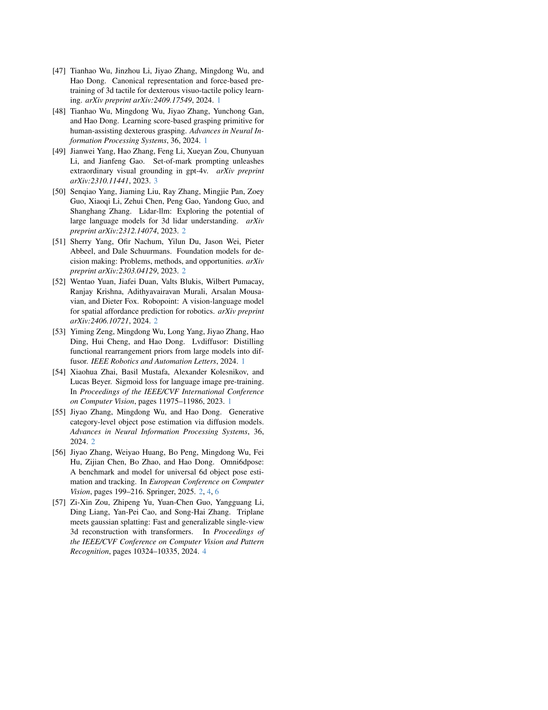

 


 2501.03841 
 Mingjie Pan et el. 
 
 🤗 2025-01-13 
 



↗ arXiv


↗ Hugging Face


↗ Papers with Code


### TL;DR



기존의 로봇 조작 시스템은 구조화되지 않은 환경에서의 조작에 어려움을 겪고 있으며, 이를 해결하기 위해 비전-언어 모델(VLM)을 로봇 데이터에 미세 조정하는 방식이 시도되었지만, 높은 데이터 수집 비용과 일반화 문제가 발생했습니다.  **OmniManip은 객체 중심 표현을 통해 VLM의 고차원 추론과 저차원 정밀도 간의 간극을 해소**하고자 합니다.  기존 방식의 한계를 극복하기 위해 새로운 접근 방식이 필요했습니다. 

OmniManip은 **객체 중심 표현과 이중 폐쇄 루프 시스템을 통해 이러한 문제를 해결**합니다. 객체의 기능적 용도를 기반으로 정의된 고유 공간에서 상호작용 기본 요소를 추출하고, 이를 공간 제약 조건으로 변환하여 로봇 조작 계획 및 실행에 활용합니다.  또한, **VLM의 환각 문제를 해결하기 위한 자기 수정 알고리즘과 실시간 포즈 추적 기능을 통해 강건하고 실시간 제어**를 가능하게 합니다. 다양한 로봇 조작 작업에 대한 제로샷 일반화 성능을 실험적으로 입증하여, 대규모 시뮬레이션 데이터 생성 자동화 가능성을 제시합니다.



#### Key Takeaways


 객체 중심 표현을 통해 고차원 추론과 저차원 정밀도 간의 간극을 해소 



 이중 폐쇄 루프 시스템으로 강건하고 실시간 제어 기능 구현 



 다양한 로봇 조작 작업에 대한 제로샷 일반화 성능 입증 


#### Why does it matter?
**본 논문은 로봇 조작 분야의 핵심적인 문제점인 일반적인 환경에서의 로봇 조작의 어려움을 해결하는 데 크게 기여합니다.**  **객체 중심 표현과 공간 제약 조건을 사용하는 새로운 방법은 데이터 수집 비용을 절감하고 일반화 성능을 향상시켜 로봇 조작 시스템 개발에 획기적인 발전을 가져올 수 있습니다.** 특히, **제로샷 일반화 능력을 통해 다양한 조작 작업에 대한 훈련 없이도 높은 성능을 달성**할 수 있다는 점이 매우 중요하며, 향후 로봇 조작 분야의 연구 방향을 제시하는 데 중요한 의미를 가집니다.

------
#### Visual Insights

> 🔼 이 그림은 OmniManip 시스템의 전체 프레임워크를 보여줍니다.  먼저, Vision-Language Model (VLM)은 Vision Foundation Model (VFM)에 의해 표시된 RGB-D 이미지와 사용자의 지시사항을 입력받습니다.  VLM은 작업 관련 객체를 필터링하고 작업을 여러 단계로 나눕니다. 각 단계에 대해 VLM은 객체 중심의 표준화된 상호작용 기본 요소를 공간적 제약 조건으로 추출하며, 이는 폐쇄 루프 방식으로 이루어집니다.  실행 단계에서는 6D 포즈 추적기를 사용하여 제약 조건에 따라 궤적을 최적화하고 폐쇄 루프를 통해 업데이트합니다.
> 

> 
read the caption

> Figure 1:  Overview framework. Given instruction and RGB-D observation marked by VFM, VLM firstly filters task-related objects and partitions the task into stages. For each stage, VLM extracts object-centric canonical interaction primitives as spatial constraints in a closed-loop manner. For execution, the trajectory is optimized by constraints and updated in a closed loop using a 6D Pose Tracker.
> 


| Tasks | VoxPoser | CoPa | ReKep | OmniManip(Ours) |  |  |
|---|---|---|---|---|---|---|
|  |  |  | Auto | Closed-loop | Open-loop |
| Pour tea | 0/10 | 1/10 | 3/10 | **7/10** | 6/10 |
| Insert flower into vase | 0/10 | 4/10 | 2/10 | **6/10** | 4/10 |
| Insert the pen in holder | 0/10 | 4/10 | 3/10 | **7/10** | 5/10 |
| Recycle the battery | 6/10 | 5/10 | 7/10 | **8/10** | 6/10 |
| Pick up the cup on the dish | 3/10 | 2/10 | **9/10** | 8/10 | 7/10 |
| Fit the lid onto the teapot | 0/10 | 2/10 | 3/10 | **5/10** | 3/10 |
| **Total** | 15.0% | 30.0% | 45.0% | **68.3%** | 51.7% |
| Open the drawer | 1/10 | 4/10 | - | **6/10** | 4/10 |
| Close the drawer | 3/10 | 3/10 | - | **8/10** | 6/10 |
| Hammer the button | 0/10 | 3/10 | - | **4/10** | 2/10 |
| Press the red button | 0/10 | 3/10 | - | **7/10** | 6/10 |
| Close the lid of the laptop | 4/10 | 3/10 | - | **6/10** | 4/10 |
| Open the jar | 2/10 | 0/10 | - | **6/10** | 5/10 |
| **Total** | 16.7% | 26.7% | - | **61.7%** | 45.0% |

> 🔼 표 1은 12가지 실제 세계 조작 작업에 대한 정량적 결과를 보여줍니다. 처음 여섯 가지 작업은 단단한 물체 조작에 중점을 두고, 나머지 여섯 가지 작업은 관절형 물체 조작에 중점을 둡니다. 표에 있는 ‘-’ 기호는 해당 방법이 기본 원리 때문에 해당 작업을 처리할 수 없음을 나타냅니다.  각 방법은 10번의 시도를 거쳤으며 성공률이 기록되었습니다.  성공률은 각 작업에 대한 각 방법의 성능을 비교하는 데 사용됩니다.  표를 통해 OmniManip이 다른 방법들보다 더 우수한 전반적인 성능을 보여줌을 알 수 있습니다.
> 

> 
read the caption

> Table 1: Quantitative results across 12 real-world manipulation tasks. The first six tasks focus on rigid object manipulation, while the latter involves articulated object manipulation. ‘-’ indicates that the method can not handle this task due to its underlying principles.
> 

### In-depth insights

#### Object-centric grasp
본 논문에서 제시된 "객체 중심 그립(Object-centric grasp)" 개념은 **객체의 기능적 특징을 고려한 3D 공간적 제약 조건을 활용**하여 로봇 조작의 정확도와 일반화 능력을 향상시키는 데 중점을 둡니다.  기존의 키포인트 기반 방식이나 6D 자세 추정 방식과 달리, **객체의 고유 공간(canonical space)을 기반**으로 상호 작용 지점과 방향을 정의하여 VLM(Vision-Language Model)의 고차원 추론 능력과 저차원 로봇 제어의 정밀성을 효과적으로 연결합니다. 이를 통해 **다양한 객체와 작업에 대한 제로샷 일반화 성능**을 확보하고, **데이터 수집 비용을 절감**하며, **로봇 시스템의 견고성과 실시간 성능**을 개선하는 데 기여합니다.  **폐루프(closed-loop) 시스템 설계**는 VLM의 환각 문제를 해결하고, 실제 환경의 동적인 변화에 효과적으로 대응하는 데 중요한 역할을 합니다.  즉, 객체 중심 그립은 효율적이고 일반화 가능한 로봇 조작을 위한 핵심적인 요소임을 강조합니다.

#### Dual closed-loop
본 논문에서 제시된 "듀얼 클로즈드-루프" 시스템은 **로봇 조작의 계획 및 실행 단계 모두에서 폐쇄 루프 제어**를 통해 강건성과 정확성을 높이는 핵심 전략입니다.  **고차원적인 계획 루프는 VLM(Vision-Language Model)의 추론 결과를 기반으로 상호작용 기본 요소를 재샘플링하고 렌더링하여 VLM 검증을 거치는 과정**을 포함합니다. 이를 통해 VLM의 환각 문제를 완화하고 계획의 정확성을 높입니다.  **저차원적인 실행 루프는 6D 포즈 추적을 이용하여 실시간으로 로봇의 자세를 정확하게 제어**함으로써, 환경의 동적인 변화에 강건하게 대응합니다.  **두 루프의 상호작용**을 통해 시스템은 불확실성을 줄이고 보다 정확하고 효율적인 로봇 조작을 가능하게 합니다.  **객체 중심 표현과의 결합**은 이러한 듀얼 클로즈드-루프 시스템의 효율성을 더욱 증대시켜주는 요소입니다.  **객체의 고유 공간 내에서 상호작용 기본 요소를 정의**함으로써, 다양한 작업 환경에서도 일관되고 효과적인 계획 및 실행이 가능해집니다.

#### VLM integration
본 논문에서는 VLM(Vision-Language Model) 통합에 대한 심층적인 논의가 부족하지만, **객체 중심 상호작용 기법을 통해 VLM의 고차원 추론 능력과 로봇 조작의 저차원 정밀도 사이의 간극을 메우는 전략**을 제시하고 있습니다.  이는 VLM이 객체의 기능적 의미를 이해하고, 이를 기반으로 상호 작용 지점과 방향을 추출하여 공간적 제약 조건으로 변환하는 방식입니다.  **VLM은 고차원 계획을 담당하고, 저차원 제어는 전통적인 계획 알고리즘이 담당**하며, 이를 통해 높은 수준의 추론과 정밀한 실행을 결합한 시스템을 구축합니다.  하지만, **VLM의 환각 문제**와 실제 환경의 역동성에 대한 고려가 필요하며, 이를 위해 **이중 폐쇄 루프 시스템**을 제안, VLM 검증, 상호 작용 렌더링 및 초 매개변수 재샘플링을 통한 고차원 계획 루프와 6D 자세 추적을 통한 저차원 실행 루프를 구성합니다. 따라서 VLM은 단순히 정보 제공의 역할을 넘어 **실시간 피드백을 기반으로 시스템의 정확성과 안정성을 확보하는 핵심 요소**로 자리매김합니다.  **데이터 효율성** 측면에서도 VLM 미세 조정 없이 제로샷 일반화를 달성하여 데이터 수집 비용과 일반화 문제를 해결하는 데 기여하고 있습니다.

#### Zero-shot learning
본 논문에서 제시된 OmniManip 시스템은 **제로샷 학습(Zero-shot learning)** 능력을 통해 다양한 로봇 조작 과제에 대한 일반화 성능을 보여줍니다.  기존의 Vision-Language Model (VLM) 미세 조정 방식과 달리,  OmniManip은 VLM의 고차원 추론 능력과 저차원 정밀 조작을 위한 3D 공간 이해를 **객체 중심의 상호 작용 기본 요소(object-centric interaction primitives)**를 사용하여 효과적으로 연결합니다.  이러한 접근 방식은 **데이터 수집 비용을 절감**하고 **일반화 문제를 해결**하는 데 기여하며,  다양한 로봇 시스템과 환경에서도 높은 성공률을 달성하는 핵심 요인입니다.  특히,  객체의 기능적 특징을 기반으로 정의된 공간적 제약 조건을 통해,  VLM의 고차원 추론 결과를 로봇 제어에 직접 적용할 수 있게 합니다. 따라서 OmniManip은 **대규모 시뮬레이션 데이터 생성 자동화**에 대한 가능성도 제시하며, **실세계 로봇 조작 분야 발전**에 크게 기여할 것으로 기대됩니다.

#### Open-vocabulary manip
**오픈-보캐벌러리 조작(Open-vocabulary manipulation)**은 사전에 정의된 명령어 집합에 국한되지 않고 자연어로 표현된 다양한 조작 작업을 로봇이 수행할 수 있도록 하는 기술입니다. 이는 **로봇의 일반화 능력을 향상**시키고, 다양한 환경 및 작업에 대한 적응력을 높이는 데 중요합니다.  본 논문에서는 이를 달성하기 위해 **비전-언어 모델(VLM)**을 활용하여 고차원적인 언어 이해와 저차원적인 물리적 조작을 연결하는 **객체 중심 표현**을 제안합니다.  **객체의 기능적 특징을 고려한 공간적 제약 조건**을 활용하여 로봇의 동작을 계획하고 실행하며, **이중 폐쇄 루프 시스템**을 통해 계획 및 실행 과정의 오류를 수정하고 로봇의 안정성과 정확성을 높입니다.  **영(zero-shot)** 일반화 성능을 실험을 통해 검증하고, **대규모 시뮬레이션 데이터 생성 자동화** 가능성을 시사합니다.  핵심은 **자연어 이해와 물리적 조작의 간극을 메우는 효율적이고 일반화 가능한 표현**을 만드는 것입니다.

### More visual insights

More on figures

> 🔼 그림 2는 물체의 상호 작용 점 생성 과정을 보여줍니다.  보이는 상호 작용 점(예: 주전자 손잡이)과 보이지 않는 상호 작용 점(예: 주전자 입구 중심)으로 구분하여 표시합니다.  보이는 점은 이미지에서 직접적으로 찾고, 보이지 않는 점은 다양한 관점의 추론을 통해 유추합니다.  이 그림은 상호 작용 점을 정의하고, 이후 단계에서 공간적 제약 조건을 설정하는 데 사용되는 상호 작용 점의 기본적인 생성 방법을 설명합니다.  즉, 객체 중심 표현을 통해 VLM의 고차원 추론과 저차원 로봇 조작 사이의 간극을 메우는 과정을 시각적으로 보여주는 그림입니다.
> 

> 
read the caption

> Figure 2: Interaction points generation.
> 

> 🔼 그림 3은 객체 중심 상호작용 기본 요소 추출 과정에서 상호작용 방향을 결정하는 방법을 보여줍니다.  VLM(Vision-Language Model)이 주요 축을 따라 상호작용 방향을 제안하고, LLM(Large Language Model)은 작업과 관련된 방향을 평가하여 최적의 상호작용 방향을 선택합니다.  그림은 주전자를 예로 들어, 주전자의 주요 축(주요 축을 따라 주전자 중심을 통과하고 주둥이 출구에서 수직으로 확장하는 축, 주전자의 주둥이 출구에서 수직인 주전자 바닥에서 꼭대기까지 수직으로 통과하는 축, 주둥이 출구에서 수평으로 확장되는 축)과 이들 각각에 대한 VLM과 LLM의 처리 과정을 시각적으로 보여줍니다.  즉, 단순히 상호작용 방향을 보여주는 것을 넘어, VLM과 LLM을 이용한 상호작용 방향 결정의 논리적 흐름을 자세히 설명하는 그림입니다.
> 

> 
read the caption

> Figure 3: Interaction directions extraction.
> 

> 🔼 그림 4는 '차 따르기' 작업을 예시로 사용하여, 서로 다른 방법들의 계획 및 실행 결과를 시각적으로 비교 분석한 것입니다.  각 방법이 어떻게 상호작용 지점(interaction primitives)을 추출하고, 계획을 세우고, 실행하는지 보여줍니다.  OmniManip을 포함한 다양한 방법들의 안정성과 효율성을 비교 분석하는 데 초점이 맞춰져 있습니다.  특히, OmniManip의 견고한 계획 및 실행 능력을 강조하기 위해, 다른 방법들과의 비교를 통해 OmniManip의 우수성을 보여줍니다.
> 

> 
read the caption

> Figure 4:  Stability analysis of interaction primitives. Visualization of planning and corresponding execution results across different methods, demonstrated using the ‘Pour tea’ as a case study.
> 

> 🔼 그림 5는 '건전지 재활용' 작업을 사례 연구로 사용하여 시점이 성능에 미치는 영향에 대한 정성적 분석을 보여줍니다.  다양한 시점에서 ReKep과 OmniManip의 계획 및 실행 결과를 비교하여 각 방법의 강점과 약점을 보여줍니다. 특히, OmniManip이 다양한 시점에서도 안정적인 성능을 유지하는 반면, ReKep은 시점 변화에 민감하게 영향을 받는다는 것을 보여줍니다. 이는 OmniManip의 객체 중심 표현과 폐쇄 루프 계획의 효과를 강조합니다.
> 

> 
read the caption

> Figure 5: Qualitative analysis of the impact of viewpoints on the performance, using ‘Recycle the battery’ as a case study.
> 

> 🔼 그림 6은 OmniManip 시스템의 폐쇄 루프 계획(closed-loop planning) 과정을 보여줍니다.  자세히 설명하자면, Vision-Language Model(VLM)의 환각(hallucination) 문제를 해결하기 위해 Resampling, Rendering, and Checking(RRC)라는 자기 수정 메커니즘을 사용하는 것을 보여줍니다.  초기 단계에서는 시스템이 3.2절에서 정의된 상호작용 제약 조건(interaction constraints)을 평가하고, 각 제약 조건에 대해 상호작용 이미지를 렌더링하여 VLM의 검증을 받습니다. VLM은 성공, 실패 또는 수정(refine) 세 가지 결과 중 하나를 반환합니다. 성공이면 작업이 진행되고, 실패이면 다음 제약 조건으로 넘어가며, 수정이 필요하다면 시스템은 정제 단계(refinement phase)로 들어가 미세 조정을 수행합니다.  이를 통해 VLM의 부정확성을 줄이고, 보다 정확한 상호작용을 가능하게 합니다.
> 

> 
read the caption

> Figure 6: Closed-planning. Self-correction mechanism via RRC.
> 

> 🔼 그림 7은 제어 루프가 닫히지 않은 실행 환경에서 발생하는 두 가지 전형적인 실패 사례를 보여줍니다. 왼쪽 그림은 그리퍼와 물체 사이의 상대적인 위치가 상호 작용 중에 변화하여 작업이 실패하는 경우를 보여줍니다. 오른쪽 그림은 물체의 목표 위치가 동적인 경우, 예를 들어 작업 중에 물체가 움직이는 경우 작업이 실패하는 경우를 보여줍니다. 이러한 실패 사례는 개방 루프 제어의 한계를 보여줍니다. 즉, 계획 단계에서 발생하는 오류를 수정하거나 실행 단계에서 발생하는 동적 변화에 적응할 수 없습니다.
> 

> 
read the caption

> Figure 7: Two typical failure cases without closed-loop execution.
> 

More on tables


| Method | $0^{\circ}$ | $25^{\circ}$ | $45^{\circ}$ | $75^{\circ}$ | $90^{\circ}$ |
|---|---|---|---|---|---| 
| **ReKep** | 0/10 | 1/10 | 3/10 | 5/10 | **7/10** |
| **OmniManip** | **7/10** | **8/10** | **8/10** | **7/10** | **7/10** |
> 🔼 표 2는 '건전지 재활용' 작업을 사례 연구로 사용하여, 다양한 시점에서의 성능에 대한 정량적 분석 결과를 보여줍니다.  특히, 각 시점에서의 성공률을 보여줌으로써, 시점 변화가 작업 성공에 미치는 영향을 파악할 수 있도록 합니다.  여기서, 성공률은 시점 변화에 따라 어떻게 변하는지를 보여주며, 시스템의 견고성과 일반화 성능을 평가하는 데 유용합니다.
> 

> 
read the caption

> Table 2: Quantitative analysis of the impact of viewpoints on the performance, using ‘Recycle the battery’ as a case study.
> 


| Sampling | Recycle Battery |  | Pour Tea |  |
|---|---|---|---|---|
| **Method** | Suc. Rate | Iter. | Suc. Rate | Iter. |
| **Uniform** | 50% | 1.8 | 30% | 3.4 |
| **OmniManip** | 80% | 1.7 | 70% | 1.8 |
> 🔼 이 표는 OmniManip의 핵심 속성 중 하나인 상호 작용 기본 요소(interaction primitive) 샘플링 효율성에 대한 정량적 분석 결과를 보여줍니다.  OmniManip은 객체의 정준 공간(canonical space)을 따라 상호 작용 방향을 샘플링하는 표적화된 전략을 사용합니다. 이 표에서는 OmniManip의 샘플링 전략을 SO(3)에서의 균일 샘플링과 비교하여 반복 횟수와 작업 성공률이라는 두 가지 주요 지표를 사용하여 효율성을 평가합니다.  표에 제시된 결과는 OmniManip의 샘플링 전략이 균일 샘플링에 비해 훨씬 적은 반복 횟수로 더 높은 성공률을 달성함을 보여줍니다.
> 

> 
read the caption

> Table 3: Quantitative analysis of the primitive sampling efficiency.
> 


| Task | Success Rate |
|---|---| 
| **Pick up the cup on the dish** | 95.24% |
| **Recycle the battery** | 91.30% |
| **Insert the pen in holder** | 86.36% |
> 🔼 OmniManip으로부터 얻은 시범 데이터를 사용한 행동 복제 결과를 보여주는 표입니다.  각 작업에 대한 성공률을 보여주어 OmniManip에서 생성한 시범 데이터의 질을 평가합니다. 성공률이 높을수록 OmniManip이 생성한 시범 데이터가 로봇 제어 학습에 효과적임을 시사합니다.
> 

> 
read the caption

> Table 4:  Behavior cloning with demonstrations from OmniManip.
> 

### Full paper



