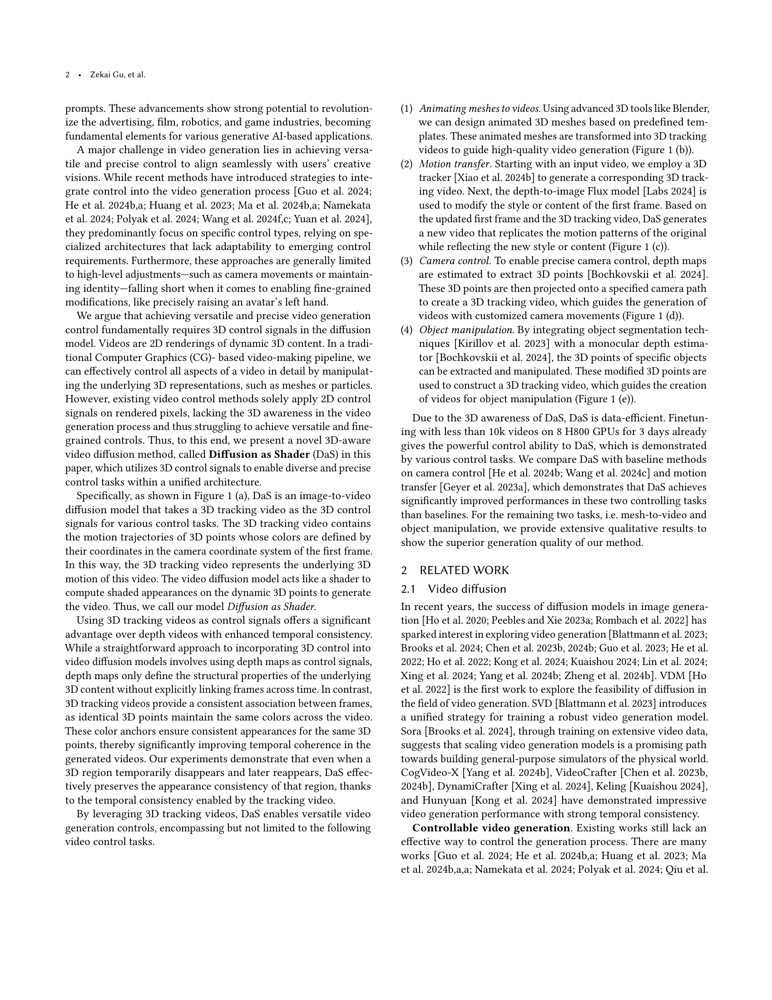
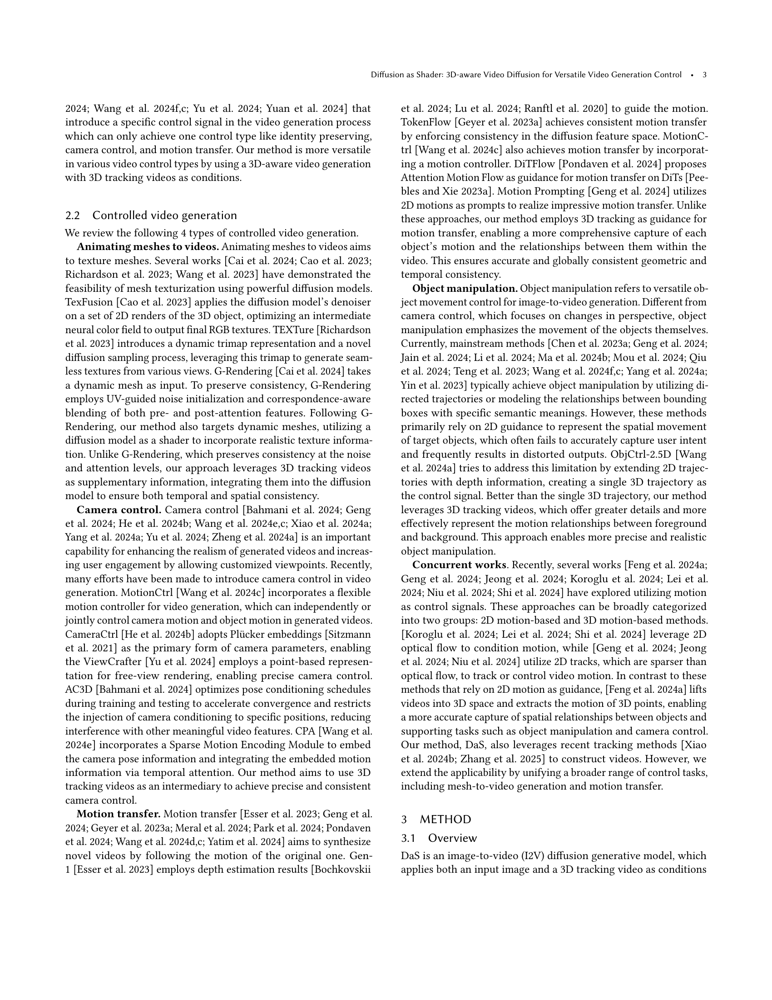
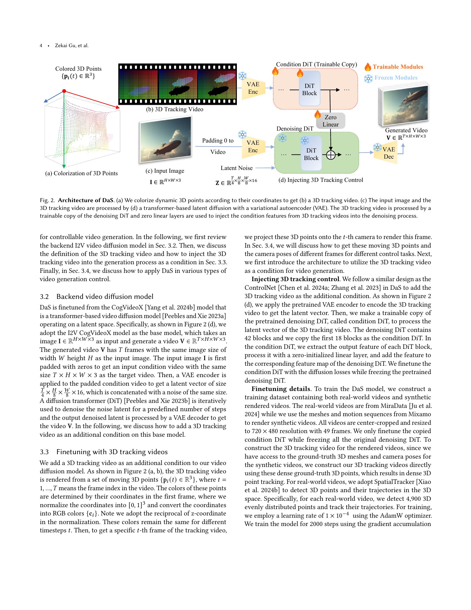
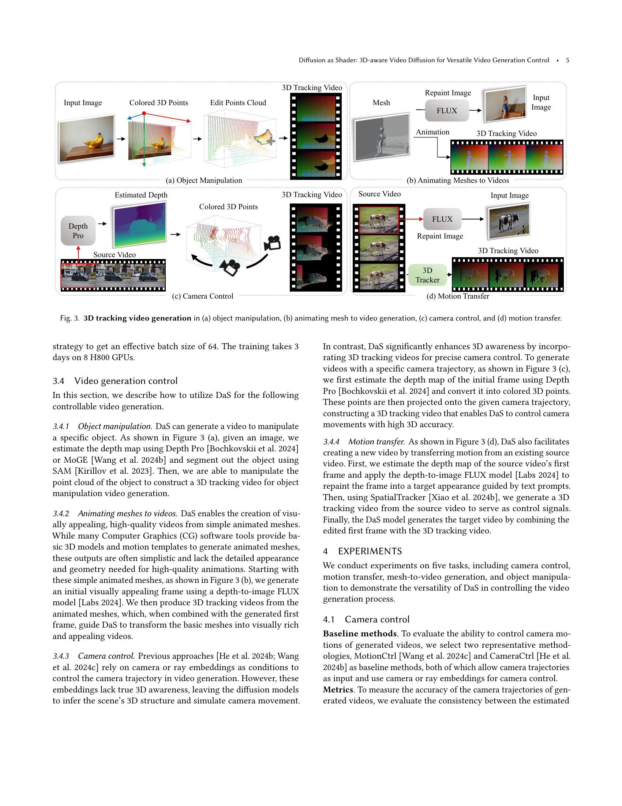
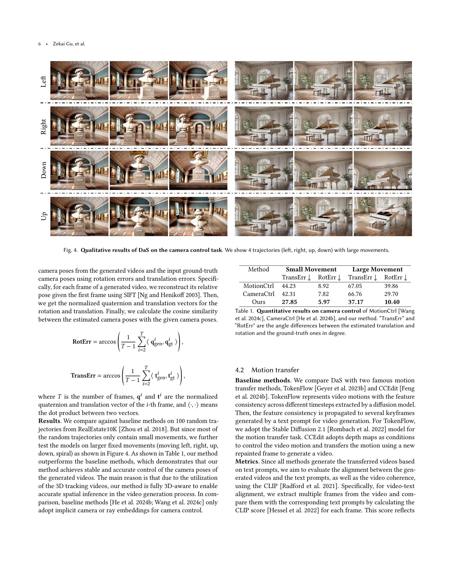
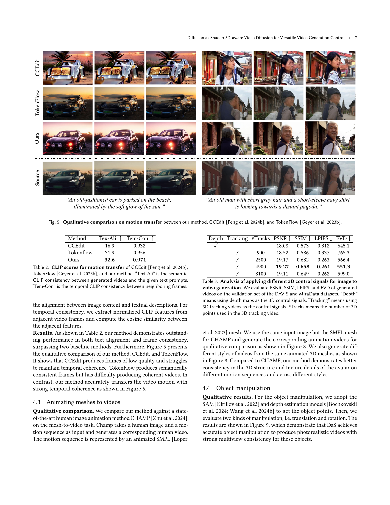
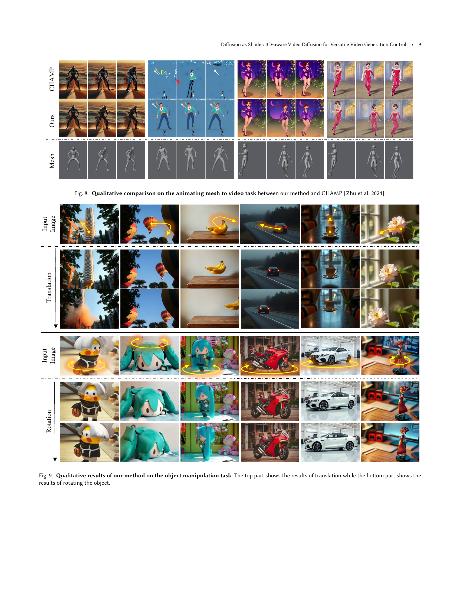
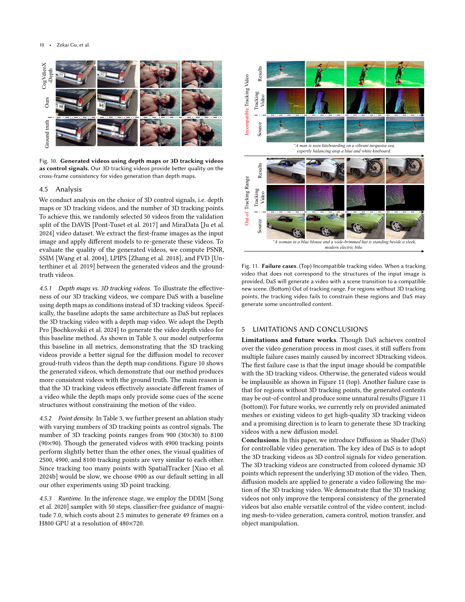
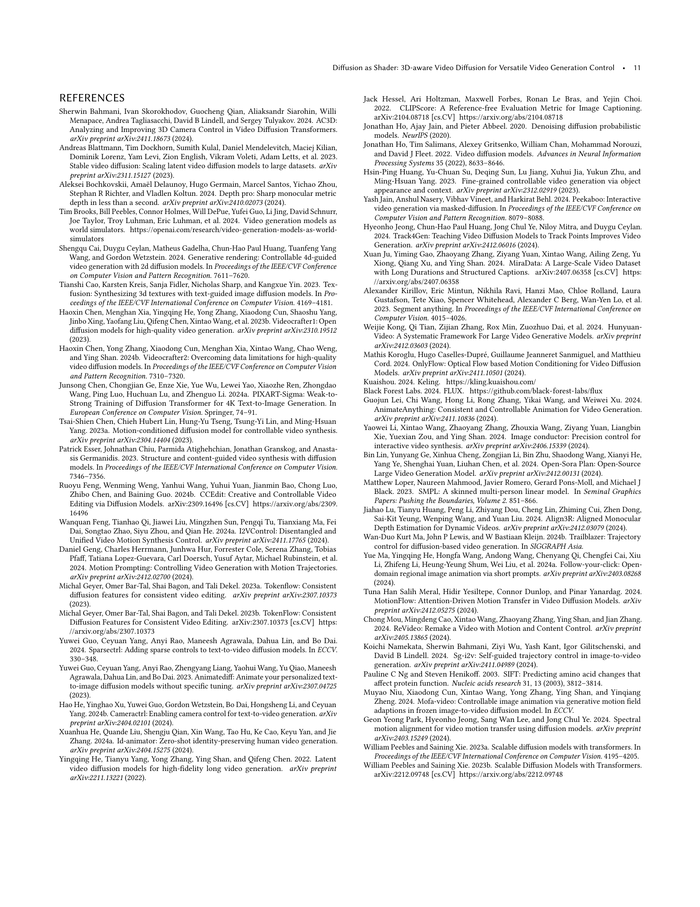
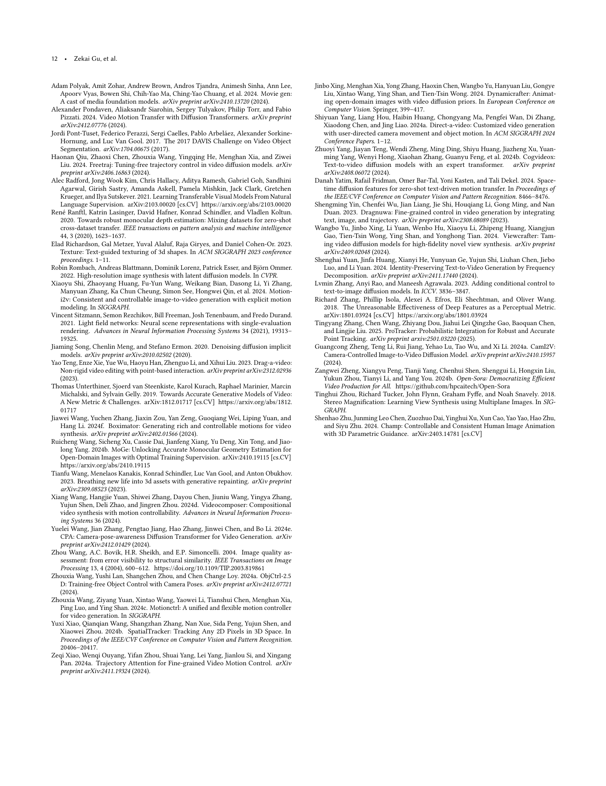

 


 2501.03847 
 Zekai Gu et el. 
 
 🤗 2025-01-08 
 



↗ arXiv


↗ Hugging Face


↗ Papers with Code


### TL;DR



기존의 제어 가능한 비디오 생성 방법들은 특정 제어 유형에 제한적이며, 다양한 제어 요구를 충족하는 데 어려움을 겪었습니다.  이 논문에서는 이러한 문제를 해결하기 위해 **3D 추적 비디오를 제어 신호로 활용하는 새로운 3D 인식 비디오 확산 방법인 Diffusion as Shader (DaS)**를 제안합니다.  DaS는 비디오를 동적인 3D 콘텐츠의 2D 렌더링으로 간주하여, **3D 제어 신호를 활용함으로써 메시 애니메이션, 모션 전송, 카메라 제어, 객체 조작과 같은 다양한 비디오 제어 작업을 통합된 아키텍처 내에서 지원**합니다.

DaS는 **3D 추적 비디오를 통해 프레임 간의 연관성을 효과적으로 연결하여 생성된 비디오의 시간적 일관성을 크게 향상**시킵니다.  소량의 비디오 데이터로 훈련된 DaS는 다양한 작업에서 강력한 제어 성능을 보여주며, **메시 애니메이션부터 카메라 제어, 모션 전송, 객체 조작까지 광범위한 비디오 제어 기능**을 제공합니다.  이는 기존의 제한적인 제어 방식을 뛰어넘는 획기적인 발전으로, 다양한 응용 분야에서 높은 활용 가치를 지닙니다.



#### Key Takeaways


 DaS는 3D 추적 비디오를 제어 신호로 사용하여 메시 애니메이션, 모션 전송, 카메라 제어, 객체 조작 등 다양한 비디오 제어 작업을 가능하게 합니다. 



 DaS는 기존 방법보다 우수한 데이터 효율성을 보이며, 소량의 데이터로도 강력한 제어 성능을 달성합니다. 



 DaS는 시간적 일관성을 향상시켜 고품질의 비디오를 생성합니다. 


#### Why does it matter?
본 논문은 **3D 추적 비디오를 제어 신호로 사용하여 다양한 비디오 제어 작업을 가능하게 하는 새로운 3D 인식 비디오 확산 방법인 Diffusion as Shader (DaS)**를 제시함으로써 연구자들에게 중요합니다. 이는 기존의 제한적인 제어 방식을 넘어 **다양한 비디오 제어를 위한 통합 아키텍처**를 제공하며, **메시 애니메이션, 모션 전송, 카메라 제어, 객체 조작과 같은 다양한 분야**에 적용 가능성을 시사합니다.  특히, **데이터 효율성**을 보여주는 실험 결과는 제한된 데이터로도 우수한 성능을 달성할 수 있음을 보여줍니다.  이러한 결과는 앞으로 **3D 인식 비디오 생성 모델링** 분야의 발전에 기여할 뿐만 아니라, 관련 연구 분야에 새로운 가능성을 제시할 것으로 예상됩니다.

------
#### Visual Insights

> 🔼 그림 1은 다양한 비디오 제어 작업을 가능하게 하는 3D 인식 비디오 확산 방법인 Diffusion as Shader (DaS)를 보여줍니다. (a)는 DaS의 개념적 구조를 나타내고, (b) 메쉬 애니메이션을 통한 비디오 생성, (c) 모션 전이, (d) 카메라 제어, (e) 객체 조작 등 다양한 제어 작업의 예시를 보여줍니다.  DaS는 3D 추적 비디오를 제어 신호로 사용하여, 기존의 2D 기반 방법보다 더욱 정확하고 다양한 비디오 제어를 가능하게 합니다. 3D 추적 비디오를 통해 각 프레임 간의 일관성을 유지하며, 메쉬 애니메이션, 모션 전이, 카메라 제어, 객체 조작 등의 작업을 원활하게 수행할 수 있습니다.
> 

> 
read the caption

> Figure 1. Diffusion as Shader (DaS) is (a) a 3D-aware video diffusion method enabling versatile video control tasks including (b) animating meshes to video generation, (c) motion transfer, (d) camera control, and (e) object manipulation.
> 


| Method | Small Movement |  | Large Movement |  | 
|---|---|---|---|---| 
|  | TransErr ↓ | RotErr ↓ | TransErr ↓ | RotErr ↓ | 
| MotionCtrl | 44.23 | 8.92 | 67.05 | 39.86 | 
| CameraCtrl | 42.31 | 7.82 | 66.76 | 29.70 | 
| Ours | **27.85** | **5.97** | **37.17** | **10.40** | 

> 🔼 표 1은 세 가지 방법, 즉 MotionCtrl (Wang et al., 2024c), CameraCtrl (He et al., 2024b), 그리고 본 논문에서 제안하는 방법에 대한 카메라 제어 성능을 정량적으로 비교한 결과를 보여줍니다.  'TransErr'는 추정된 병진(translation)과 실제값 사이의 각도 차이를, 'RotErr'는 추정된 회전(rotation)과 실제값 사이의 각도 차이를 나타냅니다.  두 값 모두 각도 단위(degree)로 표시됩니다.  즉, 이 표는 각 방법이 얼마나 정확하게 카메라의 움직임을 제어하는지를 정량적으로 평가한 결과를 보여주는 것입니다.
> 

> 
read the caption

> Table 1. Quantitative results on camera control of MotionCtrl (Wang et al., 2024c), CameraCtrl (He et al., 2024b), and our method. “TransErr” and “RotErr” are the angle differences between the estimated translation and rotation and the ground-truth ones in degree.
> 

### In-depth insights

#### 3D-Aware Diffusion
본 논문에서 제시된 3D-Aware Diffusion은 기존의 2D 이미지 기반 확산 모델의 한계를 극복하고 **비디오 생성의 정확성과 다양성을 향상**시키는 혁신적인 방법입니다.  핵심은 3D 공간 정보를 활용하여 **시간적 일관성을 유지**하면서 **다양한 제어 기능**을 제공하는 것입니다.  **3D 추적 비디오를 제어 신호**로 사용함으로써, 메쉬 애니메이션, 모션 전이, 카메라 제어, 객체 조작 등의 복잡한 작업을 단일 아키텍처 내에서 통합적으로 수행할 수 있습니다.  **3D 정보의 활용**은 단순히 깊이 정보를 활용하는 것보다 한 단계 더 나아가, **동적인 3D 시퀀스**를 이해하고 반영함으로써 보다 자연스럽고 현실적인 비디오를 생성하는 데 기여합니다.  이는 **데이터 효율성**을 높이고 **모델의 훈련 시간 단축**에도 효과적입니다.  하지만 **3D 추적 비디오의 정확도**에 대한 의존도가 높아, 추적 실패 시 생성 결과의 품질 저하가 발생할 수 있다는 점은 개선 과제로 남아 있습니다.

#### Shader-Based Control
셰이더 기반 제어는 **3D-Aware Video Diffusion** 모델에서 핵심적인 역할을 합니다.  **3D 트래킹 비디오를 셰이더처럼 활용하여** 다양한 비디오 제어 작업(애니메이션 메시 생성, 모션 전이, 카메라 제어, 객체 조작)을 통합적으로 수행합니다. 기존의 2D 신호 기반 제어 방식과 달리, 3D 트래킹 비디오는 **시간적 일관성을 유지하며 다양한 3D 신호**를 제공합니다. 이는 **영상의 3D 내용에 대한 정확한 제어**를 가능하게 하여, 보다 자연스럽고 정교한 비디오 생성을 가능하게 합니다.  **모델의 학습 과정에서 3D 트래킹 비디오를 추가적인 조건**으로 활용함으로써, 비디오 생성 과정의 정확도와 효율성을 높이고, 다양한 제어 요구사항에 대한 유연성을 확보합니다.  **데이터 효율성** 또한 높아져 적은 양의 데이터로도 우수한 성능을 보입니다. 결론적으로, 셰이더 기반 제어는 **비디오 생성의 정밀도와 다양성을 향상시키는 핵심 기술**로 볼 수 있습니다.

#### Versatile Video Control
본 논문에서 제시된 다양한 비디오 제어 방식은 **3D 추적 비디오**를 기반으로 하여 기존의 2D 기반 방식보다 훨씬 정교하고 다양한 제어 기능을 제공합니다. **메시 애니메이션, 모션 전이, 카메라 제어, 객체 조작** 등의 다양한 작업에 적용 가능하며, 3D 정보를 활용하여 시간적 일관성을 유지하면서도 세밀한 제어가 가능하다는 점이 특징입니다.  하지만, **3D 추적 비디오의 정확도에 따라 성능이 크게 좌우**될 수 있으며, 추적이 어려운 장면이나 객체에서는 제어의 정확성이 떨어질 수 있습니다.  **데이터 효율성**이 높다는 장점과 여러 제어 방식을 통합한 **통합된 아키텍처**를 갖춘 것이 강점입니다.  향후 연구에서는 3D 추적 비디오 생성의 정확도 향상 및 다양한 제어 방식에 대한 추가적인 연구가 필요하며, **실제 환경에 적용 가능하도록 더욱 발전**시켜야 할 것입니다.

#### 3D Tracking Videos
본 논문에서 제시된 3D 추적 비디오는 **3차원 공간상의 점들의 움직임을 시간에 따라 기록**하는 방식으로, 기존의 2차원 이미지 기반 접근 방식과 차별화됩니다. 이는 단순한 깊이 정보만 제공하는 기존 방법과 달리, **시간에 따른 일관성 있는 3차원 정보**를 제공함으로써 영상 생성 과정 전반에 걸쳐 **높은 시간적 일관성**을 유지하는 데 기여합니다. 특히 물체의 가리고 나타나는 현상에도 불구하고 일관적인 외형을 유지하는 데 효과적이며, **다양한 영상 제어 작업(애니메이션 생성, 모션 전이, 카메라 제어, 물체 조작 등)**에 적용 가능한 범용적인 솔루션입니다.  **데이터 효율성** 측면에서도 기존 방법들보다 우수한 성능을 보이며, 적은 양의 데이터로도 높은 정확도의 영상을 생성할 수 있다는 장점이 있습니다.  결론적으로, 3D 추적 비디오는 **다양한 영상 제어 작업에 유연하고 정밀한 제어**를 가능하게 하는 핵심 요소로 평가될 수 있습니다.

#### Limitations and Future
본 논문의 "Limitations and Future" 섹션에서 다룰 주요 제한점은 **3D 추적 비디오의 정확성에 대한 의존성**입니다. 부정확하거나 불완전한 3D 추적 데이터는 비디오 생성 결과의 품질과 일관성에 심각한 영향을 미칩니다.  미래 연구 방향으로는 **더욱 정확하고 로버스트한 3D 추적 기술 개발**과 **3D 추적 비디오 생성을 위한 새로운 diffusion 모델 개발**이 제시될 수 있습니다.  **데이터 효율성** 또한 중요한 고려 사항입니다.  현재 모델은 충분한 성능을 위해 상당한 양의 데이터를 필요로 하므로,  **데이터 증강 기법**이나 **소량의 데이터로 학습 가능한 모델 아키텍처** 개발이 필요합니다. 마지막으로, **다양한 유형의 제어 신호**를 통합하고 **세밀한 제어 기능**을 향상시키는 연구가 요구됩니다.

### More visual insights

More on figures

> 🔼 그림 2는 제안하는 방법인 DaS의 아키텍처를 보여줍니다. (a)는 3D 점들의 좌표에 따라 색상을 입히는 과정을, (b)는 이를 통해 생성된 3D 추적 비디오를 나타냅니다. (c)는 입력 이미지와 (b)에서 생성된 3D 추적 비디오를 보여주고, (d)는 변형 오토인코더(VAE)를 사용한 변압기 기반 잠재 확산 모델을 통해 이들을 처리하는 과정을 보여줍니다.  특히, 3D 추적 비디오는 잡음 제거 DiT의 학습 가능한 복사본을 통해 처리되고, 영(zero) 선형 계층을 사용하여 3D 추적 비디오의 조건부 특징을 잡음 제거 과정에 주입하는 방식입니다. 이 그림은 DaS가 입력 이미지와 3D 추적 비디오를 어떻게 활용하여 비디오를 생성하는지 자세하게 설명합니다.
> 

> 
read the caption

> Figure 2. Architecture of DaS. (a) We colorize dynamic 3D points according to their coordinates to get (b) a 3D tracking video. (c) The input image and the 3D tracking video are processed by (d) a transformer-based latent diffusion with a variational autoencoder (VAE). The 3D tracking video is processed by a trainable copy of the denoising DiT and zero linear layers are used to inject the condition features from 3D tracking videos into the denoising process.
> 

> 🔼 그림 3은 다양한 비디오 제어 작업에서 3D 추적 비디오를 생성하는 방법을 보여줍니다. (a)는 개체 조작을 위해 깊이 맵과 객체 분할을 사용하여 3D 점 구름을 생성하고 조작하는 과정을 보여줍니다. (b)는 애니메이션 메시를 비디오로 애니메이션하는 방법을 보여주는데, 애니메이션 메시에서 3D 추적 비디오를 생성하여 디퓨전 모델에 입력으로 사용합니다. (c)는 카메라 제어를 위해 깊이 맵을 사용하여 3D 점을 추출하고 특정 카메라 경로에 투영하여 3D 추적 비디오를 생성하는 과정을 보여줍니다. (d)는 모션 전이를 위해 입력 비디오에서 3D 추적 비디오를 생성하고, 깊이 정보를 활용해 첫 번째 프레임의 스타일이나 콘텐츠를 변경한 후, 업데이트된 첫 번째 프레임과 3D 추적 비디오를 사용하여 새로운 비디오를 생성하는 과정을 보여줍니다. 이 그림은 3D 추적 비디오가 다양한 비디오 제어 작업에 적용될 수 있음을 시각적으로 보여주는 역할을 합니다.
> 

> 
read the caption

> Figure 3. 3D tracking video generation in (a) object manipulation, (b) animating mesh to video generation, (c) camera control, and (d) motion transfer.
> 

> 🔼 그림 4는 논문에서 제시된 DaS 모델의 카메라 제어 기능에 대한 정성적 결과를 보여줍니다. 그림에는 큰 움직임을 가진 네 가지 궤적(왼쪽, 오른쪽, 위, 아래)이 시각적으로 제시되어 있습니다. 각 궤적에 대해 DaS 모델이 생성한 비디오 프레임들이 나열되어 있으며, 이를 통해 DaS 모델이 카메라 움직임을 얼마나 정확하고 자연스럽게 제어하는지를 보여줍니다.  DaS는 3D 추적 비디오를 사용하여 3D 인식 능력을 통해 카메라 움직임을 보다 정확하게 제어합니다. 그림은 다양한 시점에서의 카메라 움직임을 시각화하여 DaS의 카메라 제어 성능을 명확하게 보여줍니다.
> 

> 
read the caption

> Figure 4. Qualitative results of DaS on the camera control task. We show 4 trajectories (left, right, up, down) with large movements.
> 

> 🔼 그림 5는 제안된 방법, CCEdit (Feng et al., 2024b) 및 TokenFlow (Geyer et al., 2023b) 세 가지 방법을 사용하여 동작 전이 작업의 결과를 정성적으로 비교한 것입니다. 각 방법에 대해 동일한 텍스트 프롬프트를 사용하여 생성된 비디오의 일부 프레임을 보여줍니다. 이를 통해 세 가지 방법의 성능과 장단점을 시각적으로 비교하여 제안된 방법의 우수성을 보여줍니다.
> 

> 
read the caption

> Figure 5. Qualitative comparison on motion transfer between our method, CCEdit (Feng et al., 2024b), and TokenFlow (Geyer et al., 2023b).
> 

> 🔼 그림 6은 본 논문에서 제안하는 방법의 모션 전이에 대한 정성적 결과를 보여줍니다.  두 개의 예시 영상을 보여주는데, 각각의 영상은 원본 영상의 모션을 유지하면서 텍스트 프롬프트에 따라 시각적 스타일을 변경한 결과입니다.  왼쪽 예시는 텍스트 프롬프트에 따라 배경을 바꾸고 자동차의 색상을 변경했습니다. 오른쪽 예시는 텍스트 프롬프트에 따라 배경과 동물의 종류를 바꾸었습니다.  이를 통해 본 논문의 모션 전이 방법이 원본 영상의 시간적 일관성을 유지하면서도 다양한 스타일과 콘텐츠 변경을 효과적으로 지원함을 보여줍니다.
> 

> 
read the caption

> Figure 6. Qualitative results on motion transfer of our method.
> 

> 🔼 그림 7은 동일한 메시(mesh)를 사용하여 다양한 스타일의 비디오를 생성할 수 있는, 본 논문에서 제안하는 방법의 애니메이션 메시-비디오 생성 작업에 대한 추가 결과를 보여줍니다.  같은 3D 모델 기반으로 다양한 스타일을 생성하는 모델의 유연성을 강조합니다.  각 열은 동일한 메시의 다른 스타일 변형을 나타내고, 이는 모델의 스타일 제어 기능을 보여줍니다.
> 

> 
read the caption

> Figure 7. More results of the animating mesh to video generation task. Our method enables the generation of different styles from the same mesh.
> 

> 🔼 그림 8은 제안된 방법과 CHAMP (Zhu et al., 2024) 방법을 비교하여 메쉬 애니메이션을 비디오로 변환하는 작업의 질적 비교 결과를 보여줍니다.  다양한 메쉬 애니메이션과 스타일의 비디오 생성 결과를 보여주어 두 방법의 차이점을 시각적으로 비교 분석합니다.  특히, 다양한 동작과 스타일에서 제안된 방법이 3D 구조와 질감의 일관성을 더 잘 유지하는 것을 보여줍니다.
> 

> 
read the caption

> Figure 8. Qualitative comparison on the animating mesh to video task between our method and CHAMP (Zhu et al., 2024).
> 

> 🔼 그림 9는 제시된 논문의 객체 조작 작업에 대한 DaS(Diffusion as Shader) 방법의 정성적 결과를 보여줍니다. 그림의 상단 부분은 객체의 병진(translation) 결과를, 하단 부분은 객체의 회전(rotation) 결과를 보여줍니다.  다양한 객체들에 대해 병진 및 회전 조작이 적용되었고, 각 조작에 따른 시각적 결과를 보여주어 DaS 모델의 정확성과 효과를 보여주는 이미지입니다.  각 이미지는 다양한 조작의 성공적인 결과를 시각적으로 나타내고, 결과 비디오의 시각적 품질과 정확도를 강조합니다.
> 

> 
read the caption

> Figure 9. Qualitative results of our method on the object manipulation task. The top part shows the results of translation while the bottom part shows the results of rotating the object.
> 

> 🔼 그림 10은 깊이 맵 또는 3D 추적 비디오를 제어 신호로 사용하여 생성된 비디오를 보여줍니다. 이 그림은 3D 추적 비디오를 사용했을 때 프레임 간 일관성이 깊이 맵을 사용했을 때보다 더 우수함을 보여줍니다.  즉, 3D 추적 비디오 기반으로 생성된 비디오는 시간적 일관성이 더 높아 자연스러운 움직임을 보여주는 반면, 깊이 맵을 사용한 비디오는 시간적 일관성이 부족하여 어색한 움직임이 나타날 수 있음을 시각적으로 비교하여 보여줍니다.
> 

> 
read the caption

> Figure 10. Generated videos using depth maps or 3D tracking videos as control signals. Our 3D tracking videos provide better quality on the cross-frame consistency for video generation than depth maps.
> 

> 🔼 그림 11은 DaS 모델의 실패 사례를 보여줍니다. (위) 호환되지 않는 추적 비디오를 사용했을 때, DaS는 입력 이미지의 구조와 일치하지 않는 추적 비디오를 사용하면 새로운 호환 가능한 장면으로 전환하는 비디오를 생성합니다.  이 경우 DaS는 입력 이미지와 일치하는 새로운 장면으로 전환합니다. (아래) 추적 범위를 벗어난 경우, 3D 추적 점이 없는 영역에 대해서는 추적 비디오가 해당 영역을 제한하지 못하여 DaS가 제어되지 않은 콘텐츠를 생성할 수 있습니다.  즉, 입력 이미지의 일부분에 대한 3D 정보가 부족하면 DaS가 그 부분을 예측하거나 무작위로 생성하여 원본 영상과의 일관성을 깨뜨릴 수 있음을 의미합니다.
> 

> 
read the caption

> Figure 11. Failure cases. (Top) Incompatible tracking video. When a tracking video that does not correspond to the structures of the input image is provided, DaS will generate a video with a scene transition to a compatible new scene. (Bottom) Out of tracking range. For regions without 3D tracking points, the tracking video fails to constrain these regions and DaS may generate some uncontrolled content.
> 

More on tables


| Method | Tex-Ali ↑ | Tem-Con ↑ |
|---|---|---|
| CCEdit | 16.9 | 0.932 |
| Tokenflow | 31.9 | 0.956 |
| Ours | **32.6** | **0.971** |
> 🔼 표 2는 세 가지 방법, 즉 CCEdit (Feng et al., 2024b), TokenFlow (Geyer et al., 2023b), 그리고 본 논문에서 제안하는 방법을 사용한 모션 전이 작업에 대한 CLIP 점수를 보여줍니다. 'Text-Ali'는 생성된 비디오와 주어진 텍스트 프롬프트 간의 의미적 CLIP 일관성을 나타내고, 'Tem-Con'은 인접한 프레임 간의 시간적 CLIP 일관성을 나타냅니다.  본 표는 텍스트 일치도와 시간적 일관성이라는 두 가지 측면에서 세 가지 모션 전이 방법의 성능을 정량적으로 비교 분석한 결과를 제시합니다.
> 

> 
read the caption

> Table 2. CLIP scores for motion transfer of CCEdit (Feng et al., 2024b), TokenFlow (Geyer et al., 2023b), and our method. “Text-Ali” is the semantic CLIP consistency between generated videos and the given text prompts. “Tem-Con” is the temporal CLIP consistency between neighboring frames.
> 


| Depth | Tracking | #Tracks | PSNR ↑ | SSIM ↑ | LPIPS ↓ | FVD ↓ |
|---|---|---|---|---|---|---|
| ✓ |  | - | 18.08 | 0.573 | 0.312 | 645.1 |
|  | ✓ | 900 | 18.52 | 0.586 | 0.337 | 765.3 |
|  | ✓ | 2500 | 19.17 | 0.632 | 0.263 | 566.4 |
|  | ✓ | 4900 | **19.27** | **0.658** | **0.261** | **551.3** |
|  | ✓ | 8100 | 19.11 | 0.649 | 0.262 | 599.0 |
> 🔼 표 3은 이미지를 비디오로 생성하는 데 사용되는 다양한 3D 제어 신호의 분석 결과를 보여줍니다.  DAVIS 및 MiraData 데이터셋의 검증 세트에서 생성된 비디오의 PSNR, SSIM, LPIPS 및 FVD를 평가했습니다.  'Depth'는 3D 제어 신호로서 depth map을 사용한 경우를,  'Tracking'은 3D tracking video를 사용한 경우를 나타냅니다.  #Tracks는 3D tracking video에 사용된 3D 점의 개수를 의미합니다. 즉, 3D 제어 신호(depth map 또는 3D tracking video)의 종류와 3D 점의 개수에 따른 비디오 생성 성능의 차이를 정량적으로 비교 분석한 표입니다.
> 

> 
read the caption

> Table 3. Analysis of applying different 3D control signals for image to video generation. We evaluate PSNR, SSIM, LPIPS, and FVD of generated videos on the validation set of the DAVIS and MiraData datasets. “Depth” means using depth maps as the 3D control signals. “Tracking” means using 3D tracking videos as the control signals. #Tracks means the number of 3D points used in the 3D tracking video.
> 

### Full paper



