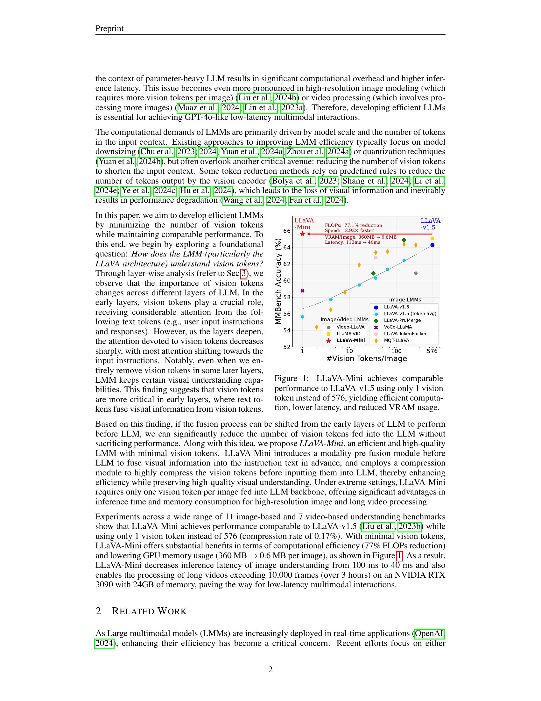
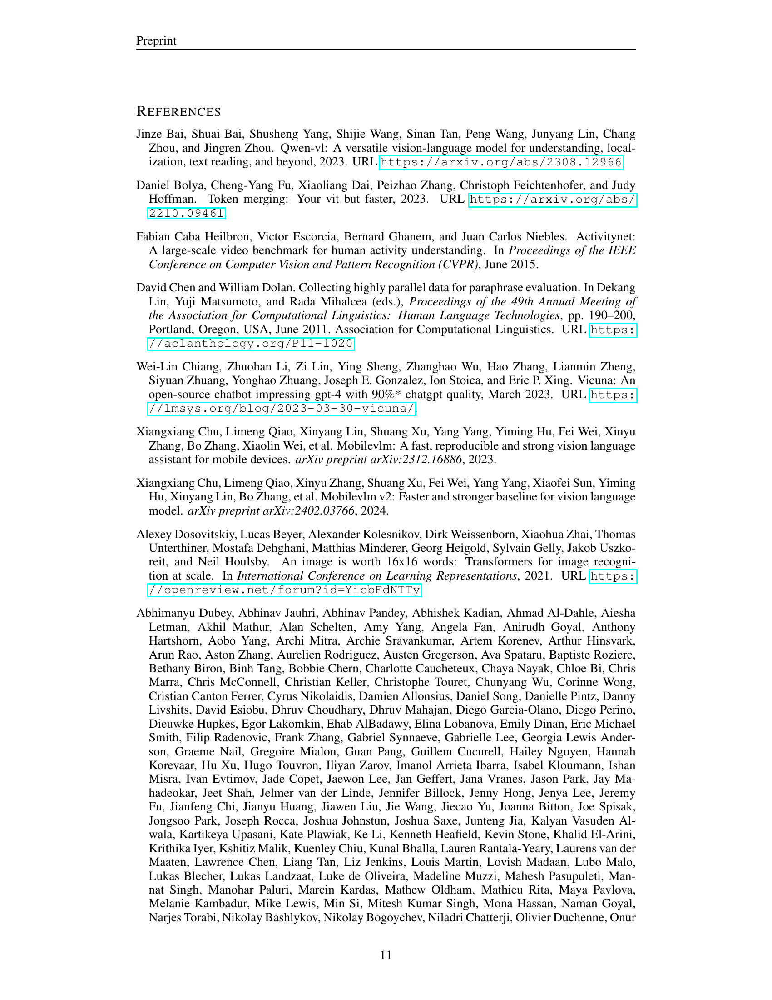

 


 2501.03895 
 Shaolei Zhang et el. 
 
 🤗 2025-01-08 
 



↗ arXiv


↗ Hugging Face


↗ Papers with Code


### TL;DR



최근 실시간으로 동작하는 대규모 다중 모달 모델(LMM)에 대한 관심이 높아지고 있지만, 많은 수의 비전 토큰으로 인한 높은 계산 비용과 지연 시간이 큰 문제였습니다. 기존 연구는 주로 LLM 백본을 작은 모델로 대체하는 데 초점을 맞추었지만, 토큰 수를 줄이는 문제는 간과했습니다.

본 논문에서는 **LLaVA-Mini** 라는 새로운 LMM을 제시합니다. LLaVA-Mini는 비전 토큰의 압축률을 높이면서 시각 정보를 유지하기 위해, **모달 사전 융합 기법**을 통해 시각 정보를 텍스트 토큰에 미리 융합하고, LLM 백본에 전달되는 비전 토큰의 수를 **단 하나의 토큰**으로 압축합니다.  실험 결과, LLaVA-Mini는 기존 모델과 유사한 성능을 유지하면서 계산 비용과 지연 시간을 크게 줄이는 효율성을 보여주었습니다.



#### Key Takeaways


 LLaVA-Mini는 **단일 비전 토큰만을 사용**하여 기존 모델과 유사한 성능을 달성했습니다. 



 **모달 사전 융합** 및 압축 모듈을 통해 비전 토큰 수를 최소화하여 **계산 비용을 77% 감소**시켰습니다. 



 **40밀리초 이내의 짧은 응답 시간**과 **고해상도 이미지 및 장시간 비디오 처리**에 대한 우수한 성능을 보여주었습니다. 


#### Why does it matter?
본 논문은 **실시간으로 대규모 다중 모달 모델을 효율적으로 구현**하는 데 중요한 의미를 지닙니다.  **계산 비용과 지연 시간을 줄이는 기술**은 실시간 상호 작용이 필수적인 다양한 응용 분야에서 혁신적인 발전을 가져올 수 있으며, 특히 **고해상도 이미지 및 비디오 처리** 분야에서 그 중요성이 더욱 커지고 있습니다.  향후 연구 방향을 제시하고 **더욱 효율적이고 실용적인 다중 모달 모델 개발**에 기여할 수 있다는 점에서 학계와 산업계 모두에게 시사하는 바가 큽니다.

------
#### Visual Insights

> 🔼 본 그림은 LLaVA-Mini 모델의 효율성을 보여줍니다. 기존의 LLaVA-v1.5 모델은 이미지당 576개의 비전 토큰을 사용하는 반면, LLaVA-Mini는 단 1개의 비전 토큰만을 사용하여 비슷한 성능을 달성합니다. 이는 계산 효율성을 높이고, 추론 지연 시간을 줄이며, VRAM 사용량을 감소시킨다는 것을 의미합니다.  그림은 다양한 이미지 및 비디오 기반 벤치마크에서 LLaVA-Mini의 성능을 LLaVA-v1.5와 비교하여 보여줍니다.  LLaVA-Mini가 훨씬 적은 비전 토큰으로도 우수한 성능을 유지함을 보여주는 그래프가 포함되어 있습니다.
> 

> 
read the caption

> Figure 1: LLaVA-Mini achieves comparable performance to LLaVA-v1.5 using only 1 vision token instead of 576, yielding efficient computation, lower latency, and reduced VRAM usage.
> 


Methods|LLM|Res.|#Vision|Tokens|VQAv2|GQA|VisWiz|SciQA|VQAT|POPE|MME|MMB|SEED|LLaVAW|MM-|Avg. (%)|
---|---|---|---|---|---|---|---|---|---|---|---|---|---|---|---|---|
**BLIP-2**|Vicuna-13B|224|32|65.0|41.0|19.6|61.0|42.5|85.3|1293.8|–|46.4|38.1|22.4|–|
**InstructBLIP**|Vicuna-7B|224|32|–|49.2|34.5|60.5|50.1|–|–|36.0|53.4|60.9|26.2|–|
**IDEFICS-9B**|LLaMA-7B|224|64|50.9|38.4|35.5|–|25.9|–|–|48.2|–|–|–|–|
**IDEFICS-80B**|LLaMA-65B|224|64|60.0|45.2|36.0|–|30.9|–|–|54.5|–|–|–|–|
**Qwen-VL**|Qwen-7B|448|256|78.8|59.3|35.2|67.1|63.8|–|–|38.2|56.3|–|–|–|
**Qwen-VL-Chat**|Qwen-7B|448|256|78.2|57.5|38.9|68.2|61.5|–|1487.5|60.6|58.2|–|–|–|
**SPHINX**|LLaMA-13B|224|289|78.1|62.6|39.9|69.3|51.6|80.7|1476.1|66.9|56.2|73.5|36.0|56.0|
**SPHINX-2k**|LLaMA-13B|762|2890|80.7|63.1|44.9|70.6|61.2|87.2|1470.6|65.9|57.9|76.9|40.2|59.0|
**mPLUG-Owl2**|LLaMA-7B|448|1024|79.4|56.1|54.5|68.7|54.3|–|1450.2|64.5|57.8|–|36.2|–|
**Video-LLaVA**|Vicuna-7B|224|256|74.7|60.3|48.1|66.4|51.8|84.4|–|60.9|–|73.1|32.0|–|
**LLaVA-v1.5**|Vicuna-7B|336|576|78.5|62.0|50.0|66.8|58.2|85.9|1510.7|64.3|58.6|63.4|30.5|56.3|
LMMs with fewer vision tokens|| || || || || || || || || || || || || ||
**MQT-LLaVA**|Vicuna-7B|336|2|61.0|50.8|48.5|65.0|–|74.5|1144.0|54.4|–|41.7|19.5|–|
**MQT-LLaVA**|Vicuna-7B|336|36|73.7|58.8|51.0|66.8|–|81.9|1416.3|63.4|–|59.6|27.8|–|
**MQT-LLaVA**|Vicuna-7B|336|256|76.8|61.6|53.1|67.6|–|84.4|1434.5|64.3|–|64.6|29.8|–|
**PruMerge**|Vicuna-7B|336|32|72.0|–|–|68.5|56.0|76.3|1350.3|60.9|–|–|–|–|
**PruMerge++**|Vicuna-7B|336|144|76.8|–|–|68.3|57.1|84.0|1462.4|64.9|–|–|–|–|
**LLaMA-VID**|Vicuna-7B|336|2|–|55.5|–|68.8|49.0|83.1|–|–|–|–|–|–|
**VoCo-LLaMA**|Vicuna-7B|336|1|72.3|57.0|–|65.4|–|81.4|1323.3|58.8|53.7|–|–|–|
**TokenPacker**|Vicuna-7B|336|36|75.0|59.6|50.2|–|–|86.2|–|62.8|–|–|29.6|–|
Ours|| || || || || || || || || || || || || ||
**LLaVA-Mini**|Vicuna-7B|336|1|77.6|60.9|56.2|70.4|57.0|84.4|1466.0|65.6|58.5|68.9|36.6|57.9|
Δ compare to LLaVA-v1.5| |0.17%|-0.9|-1.1|+6.1|+3.6|-1.3|-1.5|-44.7|+1.3|-0.1|+5.5|+6.1|+1.6|
**LLaVA-Mini-HD**|Vicuna-7B|672|64|78.9|61.8|58.5|69.7|59.1|85.3|1476.8|67.5|60.2|69.3|33.9|58.6|
Δ compare to LLaVA-v1.5|11.1%|+0.4|-0.2|+8.5|+2.9|+0.9|+0.6|+33.9|+3.2|+1.6|+5.9|+3.4|+2.4|
**LLaVA-Mini* (Image & Video)**|LLaMA-3.1-8B-Instruct|336|1|79.0|61.3|57.4|83.1|58.5|85.3|1522.7|71.6|63.0|70.2|37.2|60.7|

> 🔼 표 1은 논문에서 제시된 LLaVA-Mini 모델의 이미지 기반 벤치마크 성능을 보여줍니다. 11가지 이미지 벤치마크 작업에 대한 결과를 보여주며, 각 모델의 해상도(Res.), LLM 백본에 입력되는 비전 토큰 수(#Vision Tokens), 그리고 각 벤치마크에 대한 정확도를 제시합니다. 특히, 추가적인 훈련 데이터를 사용한 경우에는 '*' 표시가 되어 있습니다. 이 표는 LLaVA-Mini가 적은 비전 토큰만으로도 기존의 대규모 다중 모달 모델들과 비교하여 우수한 성능을 달성함을 보여주는 주요 결과 중 하나입니다.
> 

> 
read the caption

> Table 1: Performance on 11 image-based benchmarks. ‘Res.’ is resolution and ‘#Vision Tokens’ is the number of vision tokens fed to LLM backbone. ‘*’ indicates that involving extra training data.
> 

### In-depth insights

#### Vision Token Compression
본 논문에서 제시된 비전 토큰 압축(Vision Token Compression) 기법은 **LLM의 계산 비용을 줄이기 위한 핵심 전략**입니다.  기존의 LLM 기반 다중 모달 모델들은 이미지를 수많은 비전 토큰으로 변환하여 처리하는데, 이는 계산량 증가와 처리 속도 저하로 이어집니다.  이를 해결하기 위해, 논문은 **비전 토큰의 수를 최소화하면서도 시각 정보를 효과적으로 유지하는 압축 방법**을 제안합니다.  이는 단순히 토큰 수를 줄이는 것이 아니라, **LLM 백본의 초기 레이어에서 시각 정보가 주로 텍스트 토큰과 융합**된다는 점에 착안하여,  **모달 사전 융합(Modality Pre-fusion)** 과정을 통해 시각 정보를 미리 텍스트에 통합시켜 LLM 백본에 전달되는 비전 토큰의 양을 극적으로 줄입니다.  **쿼리 기반 압축(Query-based Compression)**은 중요한 시각 정보만 선택적으로 추출하여 압축률을 높이고,  **하나의 비전 토큰만을 사용**하는 극단적인 압축도 가능하게 합니다.  결과적으로,  계산량과 지연 시간을 크게 감소시키면서도 성능 저하 없이 고해상도 이미지 및 장시간 비디오 처리에 효율성을 높일 수 있습니다.  **이는 다중 모달 모델의 실시간 처리 및 효율성 향상에 큰 기여**를 할 것으로 기대됩니다.

#### Modality Pre-fusion
본 논문에서 제시된 모달리티 사전 융합(Modality Pre-fusion)은 **LLM 백본에 대한 비전 토큰의 수를 최소화**하기 위한 핵심 전략입니다.  이는 단순히 비전 토큰의 수를 줄이는 것이 아니라, **LLM의 초기 계층에서 주로 일어나는 시각 정보와 텍스트 정보의 융합 과정을 LLM 이전 단계로 옮김**으로써 효율성을 극대화하는 방식입니다.  **초기 계층에서 비전 토큰이 중요한 역할을 한다는 분석 결과**를 바탕으로,  LLaVA-Mini는 비전 토큰을 압축하기 전에 먼저 모달리티 사전 융합을 수행하여 LLM 백본에 전달되는 비전 토큰의 양을 최소화합니다.  **이를 통해 계산 비용을 크게 줄이고, 추론 속도를 높이며, 메모리 사용량을 감소**시킬 수 있습니다.  **단일 비전 토큰만 사용하더라도 성능 저하 없이 고품질의 시각적 이해 능력**을 유지할 수 있다는 실험 결과는 모달리티 사전 융합의 효과를 잘 보여줍니다.  **고해상도 이미지 및 장시간 비디오 처리**에도 효과적이며,  **다양한 실험 결과를 통해 LLaVA-Mini의 효율성과 우수성**을 확인할 수 있었습니다.  즉, 모달리티 사전 융합은 단순한 압축 기법이 아닌, **LLM의 작동 원리를 이해하고 효율성을 극대화**하는 설계 전략임을 보여주는 중요한 결과입니다.

#### High-Res, Video Ext.
논문의 "High-Res, Video Ext." 부분은 **고해상도 이미지 및 비디오 데이터 처리에 대한 확장성**을 다룹니다.  이는 단순히 고해상도 이미지나 장시간 비디오를 처리하는 것 이상의 의미를 지닙니다.  **기존의 토큰 기반 접근 방식의 한계를 극복**하고, 계산 비용 증가 없이 성능을 유지하면서 효율적으로 처리하는 방법을 제시하는 것이 핵심입니다.  **토큰 압축 및 모달리티 사전 융합 기법**을 통해 고해상도 이미지는 여러 부분으로 나누어 처리하고, 비디오는 프레임 단위로 처리하여 토큰 수를 최소화합니다.  **압축률을 극대화**하면서도 중요한 시각 정보를 유지하는 것이 중요한 과제이며,  이를 통해 연산량 감소와 처리 속도 향상을 동시에 달성할 수 있다는 점을 시사합니다.  본 논문에서는 이러한 기법들의 효과와 성능을 다양한 벤치마크를 통해 검증하고, **실시간 다중 모달 상호작용을 위한 효율적인 모델** 구축의 가능성을 보여줍니다.  **특히, 제한된 GPU 메모리 환경에서도 장시간 비디오 처리가 가능**하다는 점은 주목할 만한 성과입니다.

#### Efficiency Analysis
본 논문의 효율성 분석 부분은 **LLaVA-Mini 모델의 연산량 감소 및 속도 향상**에 초점을 맞춥니다. 기존의 LLaVA 모델 대비 77%의 FLOPs 감소와 2.9배의 속도 향상을 달성했으며, 고해상도 이미지 처리 시에도 82%의 FLOPs 감소와 3.76배의 속도 향상을 보였다는 점을 강조합니다. **메모리 사용량 측면**에서도 기존 모델 대비 훨씬 적은 메모리로 동일한 성능을 유지, 특히 장시간 비디오 처리에서 큰 이점을 제공한다는 것을 보여줍니다. **초당 1프레임**만 처리해도 1만 프레임 이상의 장시간 비디오 처리가 가능하다는 점은 LLaVA-Mini의 **실시간 응용 가능성**을 높게 평가할 수 있는 중요한 근거가 됩니다. 이러한 효율성 향상은 **모듈 전처리(modality pre-fusion) 및 토큰 압축(compression)** 기법 덕분이며,  이는 추후 연구에 있어서 효율적인 다중 모드 모델 개발에 중요한 시사점을 제공합니다.  **하드웨어 플랫폼에 대한 확장성**도 확인되어,  다양한 GPU에서 일관된 효율성 향상을 보여줍니다.  결론적으로, 본 논문의 효율성 분석은 LLaVA-Mini의 뛰어난 성능과 효율성을 뒷받침하는 핵심적인 요소로서,  **실시간 다중 모드 응용** 분야에 큰 가능성을 제시합니다.

#### Future Work
본 논문은 하나의 비전 토큰을 사용하여 효율적인 대규모 다중 모달 모델을 제시합니다. **미래 연구 방향**으로는, 첫째, **더욱 다양한 다중 모달 작업** (예: 이미지 캡셔닝, 질문응답, 텍스트 생성)에 대한 LLaVA-Mini의 성능을 평가하고 개선하는 것입니다. 둘째, **고해상도 이미지 및 장시간 비디오**에 대한 모델의 확장성을 높여 실제 환경에 더욱 적용 가능하도록 연구하는 것입니다. 셋째, **압축 모듈 및 모달 사전 융합 모듈**의 설계를 개선하여 더욱 높은 압축률과 성능을 달성하는 것입니다.  넷째, **다양한 크기의 언어 모델**과의 호환성을 높이고,  **다른 비전 인코더**와의 통합 가능성을 연구하여 모델의 유연성을 확보하는 것입니다. 마지막으로, **모델의 에너지 효율성을 개선**하고, 소형 기기에서의 구동 가능성을 탐색하는 연구도 중요할 것입니다. 이러한 미래 연구를 통해 LLaVA-Mini의 실용성과 적용 범위를 넓히고, 보다 효율적이고 강력한 다중 모달 모델 개발에 기여할 수 있을 것입니다.

### More visual insights

More on figures

> 🔼 그림 2는 다양한 LLM에서 토큰 유형별(지시어, 비전, 응답) 계층별 어텐션 가중치 변화를 보여줍니다.  LLaVA-v1.5-Vicuna-7B 모델을 예시로, 초기 계층에서는 비전 토큰이 많은 어텐션을 받지만, 깊어질수록 지시어 토큰에 대한 어텐션이 증가하고 비전 토큰에 대한 어텐션이 감소함을 보여줍니다. 이는 LLM이 초기 계층에서 비전 정보를 텍스트 토큰과 융합하고, 후기 계층에서는 주로 지시어 토큰에 의존하여 응답을 생성함을 시사합니다.
> 

> 
read the caption

> (a) LLaVA-v1.5-Vicuna-7B
> 

> 🔼 그림 (b)는 논문의 3장, 'LLaVA는 어떻게 비전 토큰을 이해하는가?' 섹션에 속해 있습니다. 이 그림은 서로 다른 유형의 토큰(instruction, vision, response)에 대한 레이어별 어텐션 가중치를 보여줍니다.  LLaVA-v1.5-Vicuna-13B 모델을 사용하여, 각 레이어에서 instruction, vision, response 토큰에 할당된 어텐션 가중치의 변화를 시각적으로 나타냅니다. 이를 통해, 모델의 각 레이어에서 비전 토큰의 중요도 변화와 텍스트 토큰과의 상호 작용을 분석할 수 있습니다. 초기 레이어에서는 비전 토큰이 더 많은 어텐션을 받지만, 레이어가 깊어질수록 어텐션 가중치가 감소하고 instruction 토큰의 가중치가 증가하는 것을 확인할 수 있습니다.
> 

> 
read the caption

> (b) LLaVA-v1.5-Vicuna-13B
> 

> 🔼 그림 3은 다양한 크기와 훈련 데이터 세트를 가진 여러 LMM(LLaVA-v1.5-Vicuna-7B, LLaVA-v1.5-Vicuna-13B, LLaVA-v1.6-Mistral-7B, LLaVA-NeXT-Vicuna-7B)에서 각 레이어에 할당된 토큰 유형(명령어, 비전, 응답 포함)별 관심 가중치의 레이어별 변화를 보여줍니다. 각 그래프는 다양한 토큰 유형(명령어, 비전, 응답) 간 관심 가중치를 각 레이어별로 시각화합니다. 명령어-비전, 비전-응답, 응답-명령어는 각각 명령어에서 비전, 비전에서 응답, 응답에서 명령어로의 가중치를 나타냅니다.
> 

> 
read the caption

> (c) LLaVA-v1.6-Mistral-7B
> 

> 🔼 그림 2는 다양한 LMM(Large Multimodal Model)에서 토큰 유형(instruction, vision, response)에 따라 각 계층별로 할당된 어텐션 가중치의 변화를 보여줍니다. 특히, LLaVA-NeXT-Vicuna-7B 모델의 경우, 초기 계층에서는 비전 토큰이 상당한 어텐션을 받지만, 계층이 깊어짐에 따라 어텐션 가중치가 감소하고, instruction 토큰이 더 많은 어텐션을 받는 것을 확인할 수 있습니다. 이는 비전 토큰이 초기 계층에서 주로 시각 정보를 텍스트 토큰에 융합하는 데 중요한 역할을 하고, 후기 계층에서는 시각 정보가 이미 텍스트 토큰에 융합되어 있기 때문입니다.
> 

> 
read the caption

> (d) LLaVA-NeXT-Vicuna-7B
> 

> 🔼 본 그림은 LMM(Large Multimodal Model)에서 instruction, vision, response 세 가지 토큰 유형에 할당된 어텐션 가중치의 계층별 변화를 보여줍니다. 각 계층에서 instruction, vision, response 토큰 간의 어텐션 가중치를 시각화하여, LMM이 각 토큰 유형을 어떻게 처리하는지 보여줍니다.  특히, 초기 계층에서는 vision 토큰이 중요한 역할을 하지만, 깊어지는 계층으로 갈수록 instruction 토큰의 중요성이 증가함을 확인할 수 있습니다. 'A→B'는 A 토큰에서 B 토큰으로의 어텐션 가중치를 나타냅니다.
> 

> 
read the caption

> Figure 2: Layer-wise variation of attention weights assigned to different types of tokens (including instruction, vision, and response) in LMMs. “A→→\rightarrow→B” means the attention weights from A to B.
> 

> 🔼 그림 2는 다양한 LLM에서 토큰 유형(지시어, 비전, 응답 포함)에 따라 각 계층별로 할당된 가중치의 계층별 변화를 보여줍니다.  'A→B'는 A에서 B로의 어텐션 가중치를 의미합니다. 이 그림은 LLaVA 아키텍처에서 비전 토큰의 중요성이 계층별로 어떻게 달라지는지 보여주는 시각적 자료입니다. 초기 계층에서는 비전 토큰이 상당한 어텐션을 받지만, 깊은 계층으로 갈수록 어텐션이 감소하고 지시어 토큰이 더 중요해지는 것을 알 수 있습니다. 이는 비전 토큰이 초기 계층에서 주로 시각 정보를 텍스트 토큰에 융합하는 역할을 하고, 깊은 계층에서는 이미 시각 정보가 융합된 텍스트 토큰을 주로 사용하기 때문입니다. 이러한 분석은 비전 토큰 압축 전략을 세우는 데 중요한 통찰력을 제공합니다.
> 

> 
read the caption

> (a) LLaVA-v1.5-Vicuna-7B
> 

> 🔼 그림 3은 다양한 크기의 LLM(Large Language Model)에서 토큰 유형별 주의 가중치의 계층별 변화를 보여줍니다.  (b)는 매개변수가 130억 개인 Vicuna LLM을 백본으로 사용하는 LLaVA-v1.5 모델에 대한 결과를 보여줍니다. 각 계층에서 지시어(instruction), 비전(vision), 응답(response) 토큰에 할당된 주의 가중치의 변화를 보여주는 그래프가 있습니다.  초기 계층에서는 비전 토큰이 주로 주의를 받고, 깊어지는 계층에서 지시어 토큰이 더 중요해짐을 알 수 있습니다. 이는 LLaVA가 비전 정보를 텍스트 토큰과 융합하는 데 초기 계층에서 비전 토큰이 중요한 역할을 하고, 후기 계층으로 갈수록 지시어 토큰이 주로 결과 생성에 기여함을 시사합니다.
> 

> 
read the caption

> (b) LLaVA-v1.5-Vicuna-13B
> 

> 🔼 그림은 논문의 3장 'LLaVA는 어떻게 비전 토큰을 이해하는가?' 섹션에 포함되어 있으며,  LLaVA 모델의 여러 계층에서 instruction, vision, response 세 가지 토큰 유형에 할당된 어텐션 가중치의 변화를 보여줍니다. 특히 LLaVA-v1.6-Mistral-7B 모델의 각 계층에서 instruction, vision, response 토큰이 서로 얼마나 주의를 기울이는지(어텐션 가중치)를 시각적으로 나타냅니다.  초기 계층에서는 vision 토큰이 instruction 토큰에 비해 상대적으로 높은 어텐션 가중치를 받는 반면, 깊은 계층으로 갈수록 그 중요성이 감소하고 instruction 토큰의 중요성이 증가하는 것을 보여줍니다. 이는 LLaVA 모델이 초기 계층에서 시각 정보를 텍스트 토큰과 융합하고, 후기 계층에서는 시각 정보가 이미 텍스트 토큰에 통합되었기 때문에 vision 토큰의 중요성이 감소함을 시사합니다. 이러한 분석 결과는 LLaVA-Mini 모델의 설계에 중요한 근거를 제공합니다.
> 

> 
read the caption

> (c) LLaVA-v1.6-Mistral-7B
> 

> 🔼 그림 2는 다양한 크기와 훈련 데이터셋을 가진 여러 LMM 모델에서 토큰의 유형(지시어, 비전, 응답)에 따라 각 계층별로 할당된 어텐션 가중치의 변화를 보여줍니다.  LLaVA-v1.5-Vicuna-7B, LLaVA-v1.5-Vicuna-13B, LLaVA-v1.6-Mistral-7B, LLaVA-NeXT-Vicuna-7B 네 가지 모델에 대한 계층별 어텐션 가중치를 보여주는 네 개의 서브그래프로 구성되어 있습니다. 각 서브그래프는 지시어 토큰, 비전 토큰, 응답 토큰에 할당된 어텐션 가중치를 계층별로 표시합니다. 이를 통해 모델의 각 계층에서 비전 토큰의 중요성이 어떻게 변하는지, 그리고 어텐션 메커니즘을 통해 지시어 토큰이 비전 토큰으로부터 관련된 시각 정보를 어떻게 찾는지를 보여줍니다. 특히, 초기 계층에서 비전 토큰이 중요한 역할을 하고, 깊은 계층으로 갈수록 지시어 토큰에 대한 어텐션이 증가하는 것을 확인할 수 있습니다.
> 

> 
read the caption

> (d) LLaVA-NeXT-Vicuna-7B
> 

> 🔼 그림 3은 LMM(대규모 다중 모드 모델)의 여러 계층에서 토큰 유형별(명령어, 비전, 응답) 어텐션 엔트로피 변화를 보여줍니다. 각 계층에서 비전 토큰에 할당된 어텐션 엔트로피는 초기 계층에서 매우 높고, 깊어지는 계층으로 갈수록 급격히 감소하는 것을 보여줍니다. 이는 초기 계층에서 비전 토큰이 중요한 역할을 하고, 깊어지는 계층으로 갈수록 명령어 토큰이 더 중요해짐을 시사합니다.
> 

> 
read the caption

> Figure 3: Attention entropy assigned to different types of tokens across different layers in LMMs.
> 

> 🔼 그림 4는 LLaVA-v1.5 모델의 다양한 레이어에서 어텐션 분포를 시각화한 것입니다. 색상 막대는 로그 스케일을 사용합니다. 이 그림은 각 레이어에서 비전 토큰이 얼마나 중요한 역할을 하는지 보여줍니다. 초기 레이어에서는 거의 모든 비전 토큰이 광범위하게 주목을 받지만, 레이어가 깊어짐에 따라 주목받는 비전 토큰의 수가 줄어듭니다. 이는 초기 레이어에서 비전 토큰이 시각적 정보를 텍스트 토큰과 융합하는 데 중요한 역할을 한다는 것을 시사합니다.
> 

> 
read the caption

> Figure 4: Attention visualization at different layers in LLaVA-v1.5 (color bar: logarithmic scale).
> 

> 🔼 본 그림은 LLaVA-v1.5 모델에서 다양한 레이어의 비전 토큰을 제거했을 때 모델 성능에 미치는 영향을 보여줍니다. 그래프는 비전 토큰을 제거한 레이어 구간(예: 1-4 레이어, 5-8 레이어 등)에 따라 GQA와 MMBench 두 가지 벤치마크 작업에서의 정확도 변화를 나타냅니다. 초기 레이어에서 비전 토큰을 제거하면 성능이 크게 저하되는 반면, 후반 레이어에서 제거하면 성능 저하가 미미함을 보여주어 비전 토큰의 중요성이 레이어에 따라 다르다는 것을 시각적으로 보여줍니다. 이는 특히 초기 레이어에서 텍스트 토큰이 비전 토큰으로부터 시각 정보를 융합하는 과정에서 비전 토큰의 역할이 중요함을 시사합니다.
> 

> 
read the caption

> Figure 5: Performance of LLaVA-v1.5 when removing all vision tokens in various layers of LMM.
> 

> 🔼 LLaVA-Mini는 이미지를 하나의 비전 토큰으로 표현하는 효율적인 대규모 다중 모달 모델입니다. 그림 왼쪽은 이러한 아키텍처를 개략적으로 보여줍니다. 그림 오른쪽은 제안된 쿼리 기반 압축 및 모달 사전 융합의 세부적인 내용을 보여줍니다.  쿼리 기반 압축 모듈은 학습 가능한 쿼리를 사용하여 원래의 많은 비전 토큰들을 압축하고, 모달 사전 융합 모듈은 비전 정보를 텍스트 토큰에 미리 융합하여 LLM 백본에 들어가는 비전 토큰의 수를 최소화합니다. 이를 통해 LLaVA-Mini는 이미지와 비디오를 효율적으로 처리하면서 성능을 유지할 수 있습니다.
> 

> 
read the caption

> Figure 6: Architecture of LLaVA-Mini. Left: LLaVA-Mini represents each image with one vision token. Right: Detailed view of the proposed query-based compression and modality pre-fusion.
> 

> 🔼 표 4는 장시간 비디오 이해에 대한 MLVU(정확도) 결과를 보여줍니다. 평가에는 주제 추론(TR), 이상 탐지(AR), Needle QA(NQA), 자아 추론(ER), 줄거리 QA(PQA), 행동 순서(AO) 및 행동 수(AC)가 포함됩니다. 즉, 장시간 비디오 이해 능력을 다양한 측면에서 평가한 결과표입니다.  각 지표는 비디오 이해의 특정 측면을 평가하며, 종합적인 점수는 모델의 전반적인 성능을 나타냅니다.
> 

> 
read the caption

> Table 4: Results on MLVU (accuracy) of long video understanding. Evaluation includes Topic Reasoning (TR), Anomaly Recognition (AR), Needle QA (NQA), Ego Reasoning (ER), Plot QA (PQA), Action Order (AO), and Action Count (AC).
> 

> 🔼 표 5는 EgoSchema의 정확도를 보여주는 표이며, 1인칭 시점의 시간적 추론을 위한 긴 형식의 비디오 벤치마크(약 3분)에 대한 결과를 보여줍니다.  다시 말해, 이 표는 제시된 비디오 클립의 내용을 이해하고 시간 순서대로 사건을 정확하게 파악하는 모델의 능력을 평가하는 벤치마크 결과를 나타냅니다.  각 모델이 얼마나 정확하게 비디오를 이해했는지 정량적으로 보여줍니다.
> 

> 
read the caption

> Table 5: Results on EgoSchema (accuracy), a long-form video benchmark (∼similar-to\sim∼ 3 minutes) for first-person view temporal reasoning.
> 

> 🔼 그림 7은 LLaVA-Mini의 연산량(FLOPs)과 추론 지연 시간을 보여줍니다.  LLaVA-Mini는 기존의 LLaVA-v1.5 모델보다 훨씬 적은 비전 토큰을 사용하여 이미지 이해 작업을 수행합니다. 이 그림은 LLaVA-Mini가 연산량을 크게 줄이고(77% 감소) 추론 속도를 높이는(2.9배 향상) 효율성을 보여줍니다. 또한, 40밀리초 이내의 짧은 응답 지연 시간을 달성하여 실시간 다중 모달 상호 작용에 적합함을 나타냅니다.
> 

> 
read the caption

> Figure 7: FLOPs and latency of LLaVA-Mini.
> 

> 🔼 그림 8은 LLaVA-Mini-HD의 FLOPs(연산량)와 지연 시간(latency)을 보여줍니다.  LLaVA-Mini-HD는 고해상도 이미지를 처리하기 위해 설계된 모델입니다. 이 그래프는 다양한 수의 비전 토큰을 사용했을 때의 성능을 비교하여 LLaVA-Mini-HD의 효율성을 보여줍니다.  고해상도 이미지 처리의 효율성을 강조하며,  비전 토큰의 수가 증가함에 따라 FLOPs와 지연 시간이 어떻게 변하는지 보여줍니다. 특히, LLaVA-Mini-HD가 기존의 LLaVA-v1.5 모델에 비해 얼마나 뛰어난 효율성을 제공하는지 명확하게 보여주는 데 초점을 맞추고 있습니다.
> 

> 
read the caption

> Figure 8: FLOPs and latency of LLaVA-Mini-HD.
> 

> 🔼 그림 9는 LLaVA-Mini가 3시간 분량의 비디오를 처리하는 동안 사용하는 VRAM 용량을 보여줍니다.  LLaVA-Mini는 기존의 비디오 처리 모델들에 비해 훨씬 적은 VRAM을 사용하여, 비디오 처리의 효율성을 크게 향상시켰음을 시각적으로 나타냅니다.  특히, 처리해야 하는 프레임 수가 증가함에 따라 LLaVA-Mini의 VRAM 사용량 증가폭이 다른 모델들에 비해 현저히 낮은 것을 확인할 수 있습니다. 이는 LLaVA-Mini의 뛰어난 메모리 효율성을 보여주는 중요한 지표입니다.
> 

> 
read the caption

> Figure 9: VRAM usage (3-hour video) of LLaVA-Mini.
> 

> 🔼 본 표는 LLaVA-Mini 모델의 성능에 대한 modality pre-fusion 레이어 수의 영향을 보여줍니다. modality pre-fusion 레이어는 시각 정보를 텍스트 토큰과 융합하는 데 사용되며, 레이어 수가 증가함에 따라 성능이 향상되는 것을 확인할 수 있습니다.  표에는 VQAv2, GQA, MMB 세 가지 벤치마크에 대한 결과가 각 레이어 수에 대해 제시되어 있으며, 레이어 수가 증가할수록 각 벤치마크의 성능이 어떻게 변화하는지 보여줍니다. 이를 통해 modality pre-fusion 레이어의 수가 LLaVA-Mini의 성능 향상에 중요한 역할을 한다는 것을 알 수 있습니다.
> 

> 
read the caption

> Table 6: Performance of LLaVA-Mini with different numbers of modality pre-fusion layers Nf⁢u⁢s⁢i⁢o⁢nsubscript𝑁𝑓𝑢𝑠𝑖𝑜𝑛N_{fusion}italic_N start_POSTSUBSCRIPT italic_f italic_u italic_s italic_i italic_o italic_n end_POSTSUBSCRIPT.
> 

> 🔼 표 7은 다양한 수의 비전 토큰을 사용한 LLaVA-Mini의 성능을 보여줍니다.  LLaVA-Mini는 이미지를 표현하는 데 사용되는 비전 토큰의 수를 최소화하도록 설계되었습니다. 이 표는 비전 토큰의 수를 1, 4, 16, 64, 144, 576개로 변화시키면서 VQAV2, GQA, MMB 세 가지 벤치마크에서의 LLaVA-Mini 성능을 비교 분석한 결과입니다. 비전 토큰의 수가 증가함에 따라 성능이 향상되는 것을 확인할 수 있으며, LLaVA-Mini는 비전 토큰의 수가 576개인 기존의 LLaVA-v1.5와 비슷한 성능을 보여줍니다.  이를 통해 LLaVA-Mini가 비전 토큰의 수를 최소화하면서도 높은 성능을 유지할 수 있음을 확인할 수 있습니다.
> 

> 
read the caption

> Table 7: Performance of LLaVA-Mini with various vision tokens.
> 

More on tables


| #Vision |
|---|---| 
| Tokens |
> 🔼 표 2는 비디오 기반 개방형 생성 벤치마크에 대한 성능을 보여줍니다. 질문 답변 정확도(%)와 질문 답변 및 생성 성능 점수(1~5점, 높을수록 좋음)를 제시합니다. 가장 우수한 결과와 두 번째로 우수한 결과는 굵은 밑줄로 표시되어 있습니다. 이 표는 다양한 비디오 이해 작업에 걸쳐 여러 모델의 성능을 비교 분석하여, 각 모델의 강점과 약점을 파악하고, 향후 연구 방향을 제시하는 데 도움을 줍니다. 특히, 질문 답변 정확도와 생성 성능 점수를 함께 제시함으로써, 모델의 종합적인 성능을 평가하고, 개방형 생성 벤치마크에서의 모델 성능을 더욱 정확하게 비교할 수 있도록 합니다.
> 

> 
read the caption

> Table 2: Performance on video-based open-ended generative benchmarks. We report accuracy (%) for question-answer, and scores (1-5, higher is better) for question-answer and generative performance. Results marked with bold and underlined indicate the best and second best, respectively.
> 


| Methods | #Frames | #Vision Tokens per Frame | Video-based Question-Answer |  |  |  | Video-based Generative Performance |  |  |  |  |  | 
|---|---|---|---|---|---|---|---|---|---|---|---|---|---|---|
|  |  |  | MSVD-QA |  | MSRVTT-QA |  | ActivityNet-QA | Correctness | Detail | Contextual | Temporal | Consistency | Avg. |
|  |  |  | Acc. | Score | Acc. | Score | Acc. | Score |  |  |  |  |  |
| **LLaMA Adapter** | 5 | 256 | 54.9 | 3.1 | 43.8 | 2.7 | 34.2 | 2.7 | 2.03 | 2.32 | 2.30 | 1.98 | 2.15 | 2.19 |
| **VideoChat** | 16 | 32 | 56.3 | 2.8 | 45.0 | 2.5 | 26.5 | 2.2 | 2.23 | 2.50 | 2.53 | 1.94 | 2.24 | 2.30 |
| **Video-LLaMA** | 16 | 64 | 51.6 | 2.5 | 29.6 | 1.8 | 12.4 | 1.1 | 1.96 | 2.18 | 2.16 | 1.82 | 1.79 | 1.99 |
| **Video-ChatGPT** | 100 | ~3.6 | 64.9 | 3.3 | 49.3 | 2.8 | 35.2 | 2.7 | 2.40 | 2.52 | 2.62 | 1.98 | 2.37 | 2.37 |
| **BT-Adapter** | 100 | ~2.6 | 67.5 | 3.7 | 57.0 | 3.2 | 45.7 | 3.2 | 2.68 | 2.69 | 3.27 | 2.34 | 2.46 | 2.69 |
| **MovieChat** | 2048 | 32 | **75.2** | 3.8 | 52.7 | 2.6 | 45.7 | **3.4** | 2.76 | 2.93 | 3.01 | 2.24 | 2.42 | 2.65 |
| **LLaMA-VID** | 1fps | 2 | 69.7 | 3.7 | 57.7 | 3.2 | **47.4** | 3.3 | **2.96** | **3.00** | **3.53** | **2.46** | **2.51** | **2.88** |
| **Video-LLaVA** | 8 | 256 | 70.7 | **3.9** | **59.2** | **3.5** | 45.3 | 3.3 | 2.87 | 2.94 | 3.44 | 2.45 | **2.51** | 2.84 |
| **LLaVA-Mini** | 1fps | **1** | **70.9** | 4.0 | 59.5 | 3.6 | 53.5 | 3.5 | 2.97 | **2.99** | **3.61** | 2.48 | 2.67 | **2.94** |
> 🔼 표 3은 MVBench 벤치마크에 대한 LLaVA-Mini의 정확도 결과를 보여줍니다. MVBench는 다양한 비디오 이해 작업을 포함하는 포괄적인 벤치마크입니다. 이 표는 각 하위 벤치마크(액션, 개체, 위치, 장면, 개수, 속성, 포즈, 문자, 인지)에 대한 LLaVA-Mini의 성능을 보여주는 세분화된 점수를 제공합니다. 자세한 점수는 부록 H에 나와 있습니다.
> 

> 
read the caption

> Table 3: Performance on MVBench (accuracy). Detailed scores are reported in Appendix H.
> 


| Methods | Action | Object | Position | Scene | Count | Attribute | Pose | Character | Cognition | Avg. | 
|---|---|---|---|---|---|---|---|---|---|---|
| **mPLUG-Owl** | 28.4 | 33.0 | 25.0 | 29.0 | 29.3 | 42.0 | 24.0 | 31.0 | 25.3 | 29.7 | 
| **Video-ChatGPT** | 32.1 | 40.7 | 21.5 | 31.0 | 28.0 | 44.0 | 29.0 | 33.0 | 30.3 | 32.7 | 
| **Video-LLaMA** | 34.4 | 42.2 | 22.5 | 43.0 | 28.3 | 39.0 | 32.5 | 40.0 | 29.3 | 34.1 | 
| **VideoChat** | 38.0 | 41.2 | 26.3 | 48.5 | 27.8 | 44.3 | 26.5 | 41.0 | 27.7 | 35.5 | 
| **LLaMA-VID** | 43.4 | 36.7 | 39.8 | 22.0 | 36.5 | 37.3 | 37.5 | 34.0 | 60.5 | 41.4 | 
| **Video-LLaVA** | 48.0 | 46.5 | 27.8 | 84.5 | 35.5 | 45.8 | 34.0 | 42.5 | 34.2 | 43.1 | 
| **LLaVA-Mini** | 52.1 | 43.2 | 31.8 | 85.5 | 37.5 | 44.5 | 29.5 | 52.0 | 35.0 | 44.5 |
> 🔼 표 8은 쿼리 기반 압축의 효과를 보여줍니다.  쿼리 기반 압축은 이미지의 중요한 특징을 선택적으로 추출하여 비전 토큰의 수를 줄이는 기법입니다. 이 표는 쿼리 기반 압축과 평균 풀링 방식을 비교하여, 쿼리 기반 압축이 비전 토큰의 수를 줄이면서도 성능 저하를 최소화함을 보여줍니다.  특히, 비전 토큰의 수가 적을 때 쿼리 기반 압축의 효과가 더욱 두드러지게 나타납니다. VQA, GQA, MMB 세 가지 벤치마크에 대한 결과가 제시되어 있습니다. FLOPs(연산량) 및 성능(정확도)을 함께 비교하여 효율성을 평가합니다.
> 

> 
read the caption

> Table 8: Effect of query-based compression.
> 


| Methods | #Frames | Holistic TR | Holistic AR | Single Detail NQA | Single Detail ER | Single Detail PQA | Multi Detail AO | Multi Detail AC | Avg. | Avg. Video Duration (minute) | 7 | 10 | 14 | 10 | 8 | 16 | 13 | 11 | Max Video Duration (minute) | 20 | 543 | 139 | 20 | 13 | 137 | 130 | 143 | Video-ChatGPT | 100 | 26.9 | 24.0 | 40.3 | 42.0 | 29.9 | 25.1 | 31.1 | 31.3 | MovieChat | 2048 | 29.5 | 25.0 | 24.2 | 24.7 | 25.8 | 28.6 | 22.8 | 25.8 | Movie-LLM | 1fps | 30.0 | 29.0 | 29.6 | 24.7 | 24.1 | 20.5 | 24.8 | 26.1 | TimeChat | 96 | 23.1 | 27.0 | 24.5 | 28.4 | 25.8 | 24.7 | 32.0 | 30.9 | LLaMA-VID | 1fps | 50.8 | 34.5 | 30.1 | 32.7 | 32.5 | 23.9 | 27.8 | 33.2 | MA-LMM | 1000 | 51.9 | 35.5 | 43.1 | 38.9 | 35.8 | 25.1 | 24.3 | 36.4 | LLaVA-Mini | 1fps | 76.0 | 50.0 | 44.5 | 37.5 | 49.0 | 24.3 | 18.4 | 42.8 |
> 🔼 본 표는 논문의 LLaVA-Mini 모델 학습 세부 정보를 보여줍니다.  Stage 1(Vision-Language Pretraining)과 Stage 2(Instruction Tuning) 두 단계로 나뉘어 각 단계별로 Vision Encoder, Projection, Compression, Modality Pre-fusion, Batch Size, Learning Rate, Optimizer, Epoch 등의 하이퍼파라미터 설정 값이 제시되어 있습니다.  각 모듈의 학습 여부(Trainable/Frozen)도 함께 표시되어 있어, LLaVA-Mini 모델 학습 과정에 대한 상세한 이해를 돕습니다.
> 

> 
read the caption

> Table 9: Training details of LLaVA-Mini.
> 


| Methods | #Frames | EgoSchema |
|---|---|---:|
| **Random** | - | 20 |
| **mPLUG-Owl** | 16 | 31.1 |
| **InternVideo** | 16 | 32.1 |
| **Video-ChatGPT** | 100 | 36.2 |
| **VideoChat** | 16 | **42.2** |
| **TimeChat** | 96 | 33.0 |
| **LLaMA-VID** | 1fps | 38.5 |
| **Video-LLaVA** | 8 | 38.4 |
| **LLaVA-Mini** | 1fps | **51.2** |
> 🔼 이 표는 LLaVA-Mini와 기존의 토큰 병합 방식들을 비교 분석한 결과를 보여줍니다.  LLaVA-Mini는 하나의 비전 토큰만을 사용하지만, 기존 방식들 (MQT-LLaVA, PruMerge, PruMerge++) 보다 VQA, GQA, MMB 세 가지 벤치마크 모두에서 더 높은 정확도를 달성했습니다.  이는 LLaVA-Mini가 비전 토큰을 효율적으로 압축하고 시각적 정보를 유지하는 데 효과적임을 시사합니다. 비전 토큰의 개수를 늘려가며 성능 변화를 보여주는 비교 실험 결과도 포함되어 있습니다.
> 

> 
read the caption

> Table 10: Comparison of LLaVA-Mini with previous token merging methods.
> 


| Methods | Pre-fusion#Layers | #VisionTokens | FLOPs(T) | VQAv2 | GQA | MMB |
|---|---|---|---|---|---|---|
| **LLaVA-v1.5** | - | 576 | 8.55 | 78.5 | 62.0 | 64.3 |
| **LLaVA-Mini (w/o pre-fusion)** | 0 | 1 | 0.96 | 72.4 | 54.2 | 57.7 |
|  | 0 | 16 | 1.16 | 74.1 | 55.4 | 59.2 |
|  | 0 | 64 | 1.79 | 75.3 | 56.7 | 62.1 |
|  | 0 | 144 | 2.85 | 76.9 | 58.9 | 64.9 |
| **LLaVA-Mini (w/ pre-fusion)** | 1 | 1 | 1.21 | 74.8 | 55.5 | 60.4 |
|  | 2 | 1 | 1.46 | 76.0 | 57.6 | 63.1 |
|  | 3 | 1 | 1.81 | 76.9 | 59.1 | 64.9 |
|  | 4 | 1 | 1.96 | 77.6 | 60.9 | 65.6 |
> 🔼 본 표는 압축 모듈 없이 전용 모드 퓨전 모듈만 사용했을 때 LLaVA-Mini의 성능을 보여줍니다.  LLaVA-Mini는 비전 토큰을 압축하지 않고도 LLaVA-v1.5와 비교하여 성능 향상을 보여주는 것을 확인할 수 있습니다.  이는 모드 전 퓨전 모듈이 비전 정보를 효과적으로 텍스트 토큰에 융합시키는 데 효과적임을 시사합니다.
> 

> 
read the caption

> Table 11: Performance of LLaVA-Mini when using only pre-fusion module without compression.
> 


| Methods | Res. | #Vision Tokens | VQAv2 | GQA | MMB |
|---|---|---|---|---|---| 
| **LLaVA-v1.5** | 336 | 576 | 78.5 | 62.0 | 64.3 |
| **LLaVA-Mini** | 336 | 1 | 77.6 | 60.9 | 65.6 |
|  | 336 | 4 | 77.7 | 60.9 | 66.7 |
|  | 336 | 16 | 78.1 | 61.3 | 66.6 |
|  | 336 | 64 | **78.5** | **61.6** | **67.5** |
|  | 672 | 16 | 78.5 | 61.5 | 67.4 |
|  | 672 | 64 | 78.9 | 61.8 | 67.5 |
|  | 672 | 144 | 79.3 | 62.3 | 67.9 |
|  | 672 | 576 | **80.0** | **62.9** | **68.1** |
> 🔼 본 표는 LLaVA-Mini 모델의 핵심 구성 요소인 압축 및 모달리티 사전 융합 과정을 LLM 백본 외부에서 수행하는 것과 내부에서 수행하는 것을 비교 분석한 결과를 보여줍니다.  LLM 백본 외부에서 압축과 모달리티 사전 융합을 수행했을 때의 성능(VQAv2, GQA, MMB)을 LLM 백본 내부에서 수행했을 때와 비교하여 효율성과 성능의 차이를 보여줍니다. 이를 통해 LLaVA-Mini의 설계 선택이 성능 향상에 미치는 영향을 정량적으로 분석합니다.
> 

> 
read the caption

> Table 12: Comparison of performing compression and pre-fusion outside or within LLM backbone.
> 


| Compression | #VisionTokens | FLOPs | VQAv2 | GQA | MMB |
|---|---|---|---|---|---| 
| **Average Pooling** | 1 | 1.96T | 76.1 | 59.8 | 64.0 |
| **Query-based** |  | +2.42G | **77.6** | **60.9** | **65.6** |
| **Average Pooling** | 4 | 2.01T | 76.9 | 60.3 | 65.1 |
| **Query-based** |  | +2.44G | **77.7** | **60.9** | **66.7** |
> 🔼 본 표는 다양한 하드웨어 플랫폼(RTX 3090, A100, A800)에서 LLaVA-Mini의 추론 지연 시간(밀리초)을 보여줍니다.  LLaVA-Mini는 비전 토큰의 수에 따라 성능이 달라지는데, 비전 토큰이 1개일 때 가장 빠른 속도를 보이며, 토큰 수가 증가할수록 지연 시간이 증가하는 것을 확인할 수 있습니다.  이는 LLaVA-Mini의 효율성과 확장성을 다양한 하드웨어 환경에서 평가한 결과입니다.
> 

> 
read the caption

> Table 13: Inference latency (millisecond) of LLaVA-Mini on various hardware platforms.
> 


| Settings | Stage1 | Stage2 |
|---|---|---|
| **Vision-Language Pretraining** | Vision-Language Pretraining | Instruction Turning |
| **Modules** |  |  |
| Vision Encoder | Frozen | Frozen |
| Projection | Trainable | Trainable |
| Large Language Model | Frozen | Trainable |
| Compression | N/A | Trainable |
| Modality Pre-fusion | N/A | Trainable |
| **Hyperparameters** |  |  |
| Batch Size | 256 | 256 |
| Learning Rate | - | 1e-4 |
| MM Learning Rate | 1e-3 | 1e-5 |
| Schedule | Cosine decay | Cosine decay |
| Warmup Ratio | 0.03 | 0.03 |
| Optimizer | AdamW | AdamW |
| Epoch | 1 | 2 |
> 🔼 이 표는 LLaVA-Mini의 각 구성 요소(비전 인코더, 프로젝션, 압축, 모달리티 사전 융합, LLM)의 계산 비용(FLOPs)을 보여줍니다.  LLaVA-Mini는 기존의 LLaVA-v1.5와 비교하여, 특히 LLM 백본의 계산 비용을 크게 줄여 전체적인 효율성을 높였음을 보여줍니다.  336x336 해상도와 672x672 해상도의 이미지에 대한 결과를 모두 포함하고 있습니다.
> 

> 
read the caption

> Table 14: Computational overhead (FLOPs) of each component in LLaVA-Mini.
> 


| Methods | #Vision Tokens | VQAv2 | GQA | MMB |
|---|---|---|---|---|
| **MQT-LLaVA** | 2 | 61.0 | 50.8 | 54.4 |
| **MQT-LLaVA** | 36 | 73.7 | 58.8 | 63.4 |
| **MQT-LLaVA** | 256 | 76.8 | 61.6 | 64.3 |
| **PruMerge** | 32 | 72.0 | - | 60.9 |
| **PruMerge++** | 144 | 76.8 | - | 64.9 |
| **LLaVA-Mini** | 1 | 72.4 | 54.2 | 57.7 |
| **LLaVA-Mini** | 16 | 74.1 | 55.4 | 59.2 |
| **LLaVA-Mini** | 64 | 75.3 | 56.7 | 62.1 |
| **LLaVA-Mini** | 144 | 76.9 | 58.9 | 64.9 |
> 🔼 표 15는 MVBench의 20개 하위 데이터셋에 대한 자세한 결과를 보여줍니다. MVBench는 다양한 비디오 이해 작업을 평가하기 위한 종합적인 벤치마크로, 행동, 객체, 위치, 장면, 개수, 속성, 자세, 문자, 인지 등 여러 측면을 다룹니다. 이 표는 각 하위 데이터셋에 대한 LLaVA-Mini와 다른 최첨단 비디오 LMM 모델(mPLUG-Owl, Video-ChatGPT, Video-LLaMA, VideoChat, LLaMA-VID, Video-LLaVA)의 성능을 비교 분석하여, LLaVA-Mini의 강점과 약점을 보다 자세히 파악하는 데 도움이 됩니다. 각 하위 데이터셋의 정확도 점수는 해당 작업의 난이도와 LMM 모델의 성능을 반영합니다. 특히, LLaVA-Mini는 여러 하위 데이터셋에서 다른 모델보다 우수한 성능을 보이는데, 이는 LLaVA-Mini의 효율성과 정확성을 보여주는 증거입니다.
> 

> 
read the caption

> Table 15: Detailed results on 20 subsets of MVBench.
> 

### Full paper



