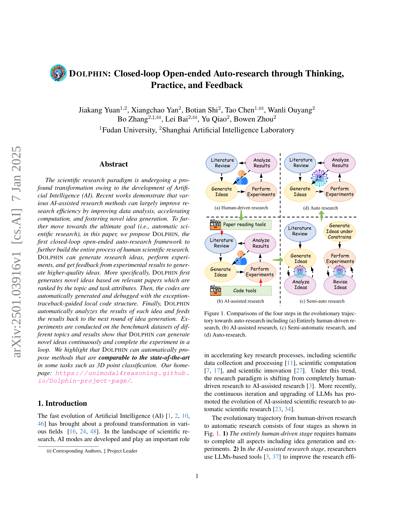

 


 2501.03916 
 Jiakang Yuan et el. 
 
 🤗 2025-01-08 
 



↗ arXiv


↗ Hugging Face


↗ Papers with Code


### TL;DR



현대 과학 연구는 인공지능(AI)의 발전으로 인해 급격한 변화를 겪고 있으며, 연구 효율 향상을 위한 AI 기반 방법들이 주목받고 있습니다.  하지만, 기존 연구는 AI가 생성한 아이디어의 효과성 평가에 어려움을 겪고 있으며, 실험 결과를 아이디어 생성에 재투입하는 폐쇄 루프 시스템이 부족했습니다. 이러한 한계를 극복하기 위해, 본 연구는  인간 과학자의 연구 과정을 모방한 혁신적인 자동 과학 연구 프레임워크인 DOLPHIN을 제시합니다. 

DOLPHIN은 주어진 연구 주제에 대한 관련 논문을 자동으로 검색하고, 작업 속성과 관련성을 고려하여 아이디어를 생성합니다. **자동 코드 생성 및 예외 추적 기반 디버깅**을 통해 실험을 수행하고, 실험 결과를 분석하여 다음 아이디어 생성에 재투입하는 폐쇄 루프 시스템을 구축했습니다.  **다양한 벤치마크 데이터셋**에서 수행한 실험 결과는 DOLPHIN이 기존 최고 성능과 유사한 수준의 새로운 아이디어를 생성하고 실험을 반복적으로 수행할 수 있음을 보여줍니다. 특히, 3D 점 분류 작업에서 최첨단 수준의 성능을 달성했습니다.



#### Key Takeaways


 돌핀(DOLPHIN)은 아이디어 생성, 실험, 피드백의 폐쇄 루프를 통해 완전 자동 과학 연구를 수행하는 최초의 프레임워크입니다. 



 작업 속성 기반 논문 순위 매기기 및 예외 추적 기반 디버깅으로 연구 효율성을 높였습니다. 



 돌핀(DOLPHIN)은 다양한 벤치마크 데이터셋에서 최첨단 성능과 비슷한 수준의 새로운 아이디어를 지속적으로 생성했습니다. 


#### Why does it matter?
본 논문은 **자동화된 과학 연구**의 새로운 지평을 열어 **연구 효율성을 획기적으로 높이고 혁신적인 발견을 촉진**할 수 있는 잠재력을 보여줍니다.  **폐쇄 루프 시스템**을 통해 지속적인 개선과 **다학제적 연구**의 가능성을 제시하며, 미래 과학 연구의 방향을 제시하는 중요한 의미를 가집니다.  특히, **자동 코드 디버깅 및 결과 분석**을 통한 실험 효율성 향상은 여러 연구 분야에 널리 적용될 수 있습니다.

------
#### Visual Insights

> 🔼 본 그림은 완전한 인간 주도 연구, AI 지원 연구, 반자동 연구, 자동 연구의 네 가지 단계를 보여주는 진화적 경로를 통해 자동 과학 연구로의 전환 과정을 비교한 그림입니다. 각 단계는 연구의 주요 4단계(문헌 검토, 결과 분석, 아이디어 생성, 실험 수행)를 어떻게 수행하는지 보여줍니다. (a) 완전한 인간 주도 연구는 모든 단계를 인간이 수행하는 반면, (b) AI 지원 연구는 AI가 데이터 분석이나 계산 가속화 등 특정 단계를 지원합니다. (c) 반자동 연구는 연구 프로세스의 특정 부분을 자동화하고, (d) 자동 연구는 전체 연구 프로세스를 자동화하는 최종 단계입니다.
> 

> 
read the caption

> Figure 1: Comparisons of the four steps in the evolutionary trajectory towards auto-research including (a) Entirely human-driven research, (b) AI-assisted research, (c) Semi-automatic research, and (d) Auto-research.
> 


| Tasks |  | CIFAR-100 |  | ModelNet40 |  | SST-2 |
|---|---|---|---|---|---|---|
|  |  | Top-1 Acc. (%) |  | OA (%) | mAcc. (%) | Acc. (%) |
| Baseline |  | 79.5 (WRN-28-10 [49]) |  | 89.2 (PointNet [28]) | 86.2 (PointNet [28]) |  | - |
| Baseline† |  | 81.2 (WRN-28-10) |  | 91.0 (PointNet [28]) | 87.6 (PointNet [28]) |  | 91.0 (BERT-base [8]) |
| Avg. Improvement |  | 81.8 (+0.6) |  | 92.0 (+1.0) | 88.7 (+1.1) |  | 91.8 (+0.8) |
| Max Improvement |  | 82.0 (+0.8) |  | 93.9 (+2.9) | 91.1 (+3.5) |  | 92.5 (+1.5) |
| Human designed |  | 82.2 (ResNeXt [22]) |  | 93.8 (GPSFormer [40]) | 91.8 (GPSFormer [40]) |  | 93.1 (BERT-large [8]) |
| Number ideas |  | 6 / 40 |  | 5 / 40 | 5 / 40 |  | 6 / 40 |

> 🔼 표 1은 2D 이미지 분류, 3D 점 분류 및 감성 분류 작업에 대한 DOLPHIN의 실험적 검증 결과를 보여줍니다.  'Number ideas' 열은 기준 성능을 능가하는 아이디어의 수를 나타내고, †는 본 논문에서 구현한 결과임을 의미합니다.  'Avg. Improvement'와 'Max Improvement' 열은 기준 성능을 개선한 모든 아이디어의 평균 및 최대 성능 향상을 보여줍니다.  각 작업에 대해 기준 모델의 성능과 DOLPHIN에 의해 생성된 아이디어 중 성능 향상을 가져온 아이디어의 평균 및 최대 성능 향상치가 제시되어 있습니다.  이를 통해 DOLPHIN이 다양한 과제에서 기존 방법에 비해 비교할 만한 성능을 달성할 수 있음을 보여줍니다.
> 

> 
read the caption

> Table 1: Experimental verifications on 2D image classification, 3D point classification, and sentiment classification tasks. Number ideas refers to the number of ideas that can achieve performance gains. ††\dagger† denotes the results of our implementation. Avg. Improvement and Max Improvement represent the average and maximum improvement of all ideas that can improve the baseline performance.
> 

### In-depth insights

#### Auto-Research Intro
자동 연구(Auto-Research) 소개 부분은 **인공지능(AI) 기반의 과학 연구 자동화**라는 혁신적인 패러다임 전환을 제시합니다.  기존의 인간 중심 연구 방식에서 AI를 활용하여 연구 아이디어 생성, 실험 설계 및 수행, 결과 분석 등 전 과정을 자동화하는 비전을 제시하며,  **연구 효율성을 극대화**하고 **새로운 과학적 발견**을 가속화할 수 있는 잠재력을 강조합니다.  이를 위해서는 **대규모 언어 모델(LLM)**과 같은 AI 기술의 발전이 필수적이며,  **자동화된 실험 검증 및 피드백 메커니즘** 구축을 통한 지속적인 개선이 중요함을 시사합니다.  **폐쇄 루프 시스템(closed-loop)**을 통한 반복적인 연구 과정을 통해 **AI가 스스로 학습하고 발전**하는 **지속가능한 자동 연구 시스템** 구축의 가능성을 탐구하는 것이 이 부분의 핵심입니다.  결론적으로, 자동 연구는 단순한 효율성 증대를 넘어 **과학 연구의 혁신적인 발전 방향**을 제시하는 중요한 개념이며,  앞으로 이 분야에 대한 심도 있는 연구가 더욱 필요함을 강조합니다.

#### DOLPHIN Framework
DOLPHIN 프레임워크는 **자율적 과학 연구의 새로운 패러다임**을 제시합니다.  인간의 과학 연구 과정을 모방하여 **아이디어 생성, 실험 검증, 결과 피드백**의 폐쇄 루프 시스템을 구축했습니다.  기존의 AI 기반 연구 방법론과 달리, DOLPHIN은 **전체 과학 연구 과정을 자동화**하려는 야심찬 목표를 가지고 있으며, **연구 아이디어의 독창성과 실험의 효율성**을 동시에 고려합니다.  **자동 코드 생성 및 디버깅**, 그리고 **실험 결과 분석** 기능은 연구의 효율성을 극대화하는 데 기여합니다.  **다양한 과학 분야**에서의 실험 결과는 DOLPHIN이 **최첨단 성능**에 필적하는 결과를 도출함을 보여주며,  **자동화된 과학 연구의 가능성**을 엿볼 수 있게 합니다.  그러나, **복잡한 과학적 문제에 대한 적용 가능성과 한계**에 대한 심도있는 연구가 추가적으로 필요합니다.  **윤리적 및 사회적 함의** 또한 고려되어야 할 중요한 부분입니다.  결론적으로, DOLPHIN은 흥미로운 가능성을 제시하지만, **지속적인 발전과 검증**을 통해 더욱 강력하고 신뢰할 수 있는 프레임워크로 진화해야 합니다.

#### Experiment Results
"실험 결과" 제목에 대한 심층적인 분석을 통해 얻을 수 있는 통찰력을 제시합니다. **데이터 시각화**는 결과의 명확성을 높이고, **통계적 유의성 검정**은 결과의 신뢰도를 높입니다. **다양한 지표**를 사용하여 실험의 성공 여부를 다각적으로 평가하고, **비교 분석**을 통해 기존 연구와의 차별성을 보여줍니다.  **한계점 및 개선 방향**을 제시하여 후속 연구의 발전 방향을 제시합니다.  **결론적으로**, 실험 결과는 연구의 핵심이며, 이를 명확하고 신뢰도 있게 제시하는 것이 중요합니다.  **실험 설계의 적절성**, **데이터 분석의 정확성**, **결과 해석의 타당성** 등을 꼼꼼하게 검토하여 연구의 신뢰성을 높여야 합니다. **논문의 목적 달성 여부**, **연구 가설 검증 결과**, **기존 연구와의 비교** 등을 종합적으로 고려하여 실험 결과의 의미를 파악해야 합니다.  또한, **발견된 현상의 이론적 배경**을 설명하고, **실제 응용 가능성**을 제시하는 것이 중요합니다.  **결과의 한계점**과 **추가 연구 방향**을 제시하여 연구의 지속적인 발전을 위한 초석을 마련합니다.  **특히**, **비교 대상 선정의 적절성**과 **결과 해석의 객관성**에 대한 고찰이 필요하며, **결과의 일반화 가능성**을 평가하여 연구 결과의 범용성을 높여야 합니다.  **결론적으로**,  실험 결과 부분은 연구의 성공 여부를 판단하는 핵심적인 요소이며, 정확하고 명확한 결과 제시와 더불어 깊이 있는 분석이 필수적입니다.

#### Feedback Loop
본 논문에서 제시된 '피드백 루프(Feedback Loop)'는 **자동화된 과학 연구의 핵심**입니다. 이 루프는 연구 아이디어 생성, 실험 검증, 결과 피드백의 세 단계로 구성되며, 각 단계가 유기적으로 연결되어 연구 과정을 지속적으로 개선합니다. **아이디어 생성 단계**에서는 관련 논문을 분석하여 새로운 아이디어를 생성하고, **실험 검증 단계**에서는 자동으로 코드를 생성하고 디버깅하여 실험을 수행합니다. 마지막으로 **결과 피드백 단계**에서는 실험 결과를 분석하여 다음 아이디어 생성에 활용, 이를 통해 **연구의 효율성을 높이고 품질을 개선**하는 선순환 구조를 형성합니다.  특히, 예외 추적(traceback)-기반의 로컬 코드 구조를 활용한 자동 디버깅은 성공적인 실험 수행률을 높이는 데 기여하며,  **과학 연구의 전 과정을 자동화**하려는 시도에서 **중요한 진전**을 보여줍니다.  **실험 결과**는 다양한 벤치마크 데이터셋에서의 성능 향상으로 검증되며,  특히 3D 점 분류 작업에서 최첨단 수준의 성능을 달성하여 **DOLPHIN의 효과성**을 입증합니다.  **개방형이고 지속적인 자동화 연구 프레임워크**인 DOLPHIN은 과학 연구 패러다임에 혁신적인 변화를 가져올 잠재력을 지닌 것으로 평가됩니다.

#### Future of AI
**AI의 미래는 현재 진행 중인 혁신적인 발전들에 의해 크게 좌우될 것입니다.**  자연어 처리, 컴퓨터 비전 및 기계 학습과 같은 분야에서의 급속한 발전은 AI 시스템이 인간 수준의 지능에 도달하거나 능가할 수 있도록 만들고 있습니다.  **특히, 강화 학습(Reinforcement Learning)과 생성적 적대 신경망(Generative Adversarial Networks)의 발전은 AI 시스템의 문제 해결 능력과 창의성을 획기적으로 향상시킬 것입니다.** 이러한 기술의 발전으로, AI는 의료, 금융, 제조 및 운송을 포함한 다양한 산업 분야에서 광범위하게 적용될 수 있게 될 것입니다. 그러나, **AI의 발전에는 윤리적 및 사회적 문제가 수반될 수 있습니다.**  **데이터 프라이버시, 알고리즘 편향, 일자리 감소 등의 문제에 대한 신중한 고려가 필요합니다.**  미래에는 AI 개발자와 정책 입안자들이 이러한 문제들을 해결하고 AI 기술의 윤리적인 사용을 보장하기 위해 긴밀하게 협력해야 할 것입니다.  **AI의 미래는 기술의 진보뿐만 아니라 사회적, 윤리적 책임에 대한 깊은 이해를 통해 형성될 것입니다.**  **인간과 AI의 공존과 협력을 위한 체계적인 접근법이 중요하며, AI가 인류에 이익을 가져다주는 방향으로 발전되도록 노력해야 합니다.**

### More visual insights

More on figures

> 🔼 그림 2는 DOLPHIN이라는 폐쇄 루프 방식의 개방형 자동 연구 프레임워크의 개요를 보여줍니다.  DOLPHIN은 먼저 검색된 논문들을 기반으로 아이디어들을 생성합니다. 아이디어들을 필터링한 후에는, 해당 아이디어들을 위한 실험 계획이 생성됩니다. 그런 다음, 제안된 예외 추적 기반 디버깅 프로세스를 사용하여 코드를 생성하고 디버깅합니다. 마지막으로, 성공적으로 실행된 실험의 결과는 자동으로 분석되어 다음 라운드의 아이디어 생성에 반영됩니다.  즉, 논문 검색 및 아이디어 생성, 아이디어 필터링 및 실험 계획 수립, 코드 생성 및 디버깅, 실험 결과 분석 및 다음 아이디어 생성으로 이어지는 반복적인 연구 과정을 보여줍니다.
> 

> 
read the caption

> Figure 2: The overview of Dolphin, an closed-loop open-ended auto-research framework. Dolphin first generates a set of ideas based on the retrieved papers. After filtering ideas, experimental plans will be generated for these filtered ideas. Then, codes can be generated and debugged using the proposed error-traceback-guided debugging process. Finally, the results of successfully executed experiments will be auto-analyzed and reflected into the next round of ideas generation.
> 

> 🔼 그림 3은 예외 추적(traceback) 기반의 지역 코드 구조를 사용한 디버깅 과정을 보여줍니다.  DOLPHIN은 LLMs(대규모 언어 모델)을 활용하여 오류 발생 시 자동으로 코드를 디버깅합니다.  구체적으로, 예외 추적 정보에서 오류와 관련된 함수 이름, 라인 번호, 코드를 추출하여 LLMs가 코드의 지역 구조(함수, 클래스, 변수 등의 관계)를 파악하도록 돕습니다. LLMs는 예외 추적과 지역 코드 구조를 분석하여 필요한 수정을 제안하고, 코드가 성공적으로 실행될 때까지 디버깅 과정을 반복합니다. 이를 통해 DOLPHIN은 자동화된 코드 디버깅을 가능하게 하고, 연구 효율을 높입니다.
> 

> 
read the caption

> Figure 3: Debugging with traceback-guided local code structure.
> 

> 🔼 그림 4는 DOLPHIN이 생성한 아이디어와 코드(왼쪽)와 인간 연구자(오른쪽)가 생성한 아이디어와 코드를 보여줍니다.  왼쪽에는 DOLPHIN이 생성한 3D 점 분류를 위한 새로운 아이디어와 구현 코드의 예시가, 오른쪽에는 인간 연구자가 제안한 유사한 아이디어와 코드가 제시되어 있습니다. 두 경우 모두 ModelNet40 데이터셋을 사용하여 3D 점 분류 작업을 수행합니다. DOLPHIN이 생성한 아이디어는 인간 연구자의 아이디어와 비교하여 유사한 성능을 보이지만, 구현 코드는 더 간결하고 효율적인 것을 알 수 있습니다. 이 그림은 DOLPHIN이 인간 연구자 수준의 아이디어를 생성하고 효과적으로 구현할 수 있음을 시각적으로 보여주는 사례입니다.
> 

> 
read the caption

> Figure 4: Case studies for the ideas and codes generated by Dolphin (Left) and human researcher (Right).
> 

> 🔼 그림 5는 논문의 아이디어 생성 과정에 사용된 프롬프트들을 보여줍니다.  세 가지 프롬프트는 각각 논문 검색, 논문 순위 매기기, 아이디어 생성 단계에 해당합니다.  먼저, '논문 검색' 프롬프트는 주어진 주제에 맞는 관련 논문들을 찾기 위한 키워드 질의를 생성하는 것을 목표로 합니다.  다음으로, '논문 순위 매기기' 프롬프트는 검색된 논문들의 관련성과 적절성을 평가하여 점수를 매기는 과정을 안내합니다. 마지막으로, '아이디어 생성' 프롬프트는 관련 논문들과 기존 아이디어들을 바탕으로 새로운 연구 아이디어를 생성하고 실험 계획 및 요약을 작성하도록 유도합니다. 각 프롬프트는 LLM(Large Language Model)을 이용하여 자동화된 연구 과정을 지원하기 위한 구체적인 지시사항들을 포함하고 있습니다.
> 

> 
read the caption

> Figure 5: Prompts of paper retrieval, paper ranking, and ideas generation.
> 

> 🔼 그림 6은 DOLPHIN의 아이디어 독립성 검사 과정의 예시를 보여줍니다.  DOLPHIN은 새로운 아이디어를 생성할 때 기존 아이디어와의 중복을 방지하기 위해 독립성 검사를 수행합니다.  이 그림에서는 두 개의 아이디어가 제시되는데, 제목과 요약 내용은 서로 다르지만, 사용된 기술과 접근 방식은 매우 유사합니다.  즉, 표면적으로는 다르게 보이지만 실제로는 유사한 아이디어임을 보여주는 예시입니다. DOLPHIN은 이러한 유사한 아이디어를 걸러내어 연구 효율성을 높입니다.  이 그림은 아이디어의 독창성과 독립성을 평가하는 DOLPHIN의 중요한 메커니즘을 시각적으로 보여줍니다.
> 

> 
read the caption

> Figure 6: An example of independence check.
> 

> 🔼 그림 7은 DOLPHIN 시스템의 코드 디버깅 과정에 사용되는 두 가지 프롬프트(명령어)를 보여줍니다. 첫 번째 프롬프트는 예외 추적 정보를 기반으로 코드의 구조를 분석하는 것이고, 두 번째 프롬프트는 오류 메시지와 코드 구조를 바탕으로 코드를 디버깅하는 것입니다.  즉, AI가 예외 발생 시 오류 원인을 파악하고, 관련 코드 부분을 분석하여 오류를 수정할 수 있도록 안내하는 명령어들을 보여줍니다.  이는 AI가 코드를 자동으로 생성하고 디버깅하는 과정을 효율적으로 수행하는 데 중요한 역할을 합니다.
> 

> 
read the caption

> Figure 7: Prompts of local code structure and debugging.
> 

> 🔼 그림 8은 예외 추적 정보 없이 코드 구조만을 보여줍니다.  본 논문의 3.2절 실험 검증 과정에서,  LLM이 코드 오류를 수정하는 과정을 보여주는 예시 그림입니다.  LLM이 예외 추적 정보를 활용하여 오류가 발생한 부분의 코드 구조를 이해하고 수정하는 것이 아니라,  오류가 발생한 코드의 구조만 제시하고 있습니다. 이는 LLM이 예외 추적 정보를 효과적으로 활용하지 못하여 코드 수정에 어려움을 겪는다는 것을 시각적으로 보여주는 예시입니다. 그림은 PointNetEncoder 클래스의 초기화와 전달 과정, Model 클래스의 전달 과정, 그리고 학습 루프의 일부를 보여줍니다. 각 코드 부분에 대한 자세한 설명은 논문 본문에 있습니다.
> 

> 
read the caption

> Figure 8: Code structure without extracted traceback information.
> 

> 🔼 그림 9는 DOLPHIN이 생성한 아이디어와 코드를 보여줍니다. 이 아이디어는 ModelNet40 데이터셋에서 92.34%의 전반적 정확도(OA)와 89.54%의 평균 클래스 정확도(mAcc)를 달성했습니다. 이는 기준 모델보다 OA는 1.34%p, mAcc는 1.94%p 향상된 결과입니다.  자동 인코더 프레임워크를 사용하여 잠재 공간 탐색 모듈을 PointNet 아키텍처에 추가하여 잠재 공간에서 의미있는 구조를 식별하고, 원래 포인트 클라우드 표현과 결합하여 특징 추출을 풍부하게 함으로써 분류 성능을 향상시키는 아이디어입니다.  자동 인코더의 인코더와 디코더 부분을 사용하여 잠재 공간을 생성하고, 이를 기반으로 추가적인 목적 함수(예: 클러스터링, 재구성)를 사용하여 잠재 공간 내에서 탐색을 수행합니다. 의미있는 잠재 구조를 식별하고 이를 원래 포인트 클라우드 표현과 결합하여 특징 추출을 개선합니다. 
> 

> 
read the caption

> Figure 9: Idea and codes generated by Dolphin which achieves 92.34% OA and 89.54% mAcc. on ModelNet40 (+1.34% OA and +1.94% mAcc. compared to our baseline).
> 

> 🔼 그림 10은 DOLPHIN이 생성한 아이디어와 코드를 보여줍니다. ModelNet40 데이터셋을 사용하여 실험한 결과, 전체 정확도(OA)는 92.30%, 평균 클래스 정확도(mAcc)는 88.96%를 달성했습니다. 이는 기준 모델(baseline)에 비해 OA는 1.30%, mAcc는 1.36% 향상된 결과입니다.  이 그림은 DOLPHIN이 생성한 Contrast Enhancement Module을 PointNetEncoder에 통합하여 특징 대비를 증폭하고, ModelNet40 데이터셋에서 분류 정확도와 강건성을 향상시킨 방법을 보여줍니다.  Contrast Enhancement Module은 포인트 클라우드 내 특징 간 대비 수준을 계산하고, 대비가 높은 영역을 강화하는 메커니즘을 구현합니다. 이를 통해 향상된 특징 대비를 기존 특징 추출 과정에 통합하여 ModelNet40 데이터셋에서 기준 모델보다 성능이 향상됨을 보여줍니다.
> 

> 
read the caption

> Figure 10: Idea and codes generated by Dolphin which achieves 92.30% OA and 88.96% mAcc. on ModelNet40 (+1.30% OA and +1.36% mAcc. compared to our baseline).
> 

> 🔼 그림 11은 DOLPHIN이 생성한 아이디어와 코드를 보여줍니다.  CIFAR-100 데이터셋을 사용한 이미지 분류 작업에서, DOLPHIN은 기준 모델보다 0.85% 향상된 82.05%의 정확도를 달성했습니다. 이는 DOLPHIN이 생성한 새로운 아이디어와 코드가 실제 성능 향상에 기여했음을 보여줍니다.  자세히는,  DOLPHIN은 생물학적 시각 시스템에서 영감을 받은 새로운 필터 모듈을 WideResNet 아키텍처에 통합하여 특징 추출을 향상시켰습니다. 이를 통해 기존 모델보다 더 나은 분류 성능을 얻었습니다.
> 

> 
read the caption

> Figure 11: Idea and codes generated by Dolphin which achieves 82.05% Acc. on CIFAR-100 (+0.85% Acc. compared to our baseline).
> 

More on tables


| Method | Novelty | Cost (Avg.) |
|---|---|---|
| Naive generation | 8 / 20 | $0.106 |
| Generation with naive retrieval | 13 / 20 | $0.187 |
| Ours (task attribute filtering) | 19 / 20 | $0.184 |
> 🔼 표 2는 아이디어 생성 프로세스의 결과를 보여줍니다.  GPT-4(2024-08-06)를 사용하여 새로운 아이디어의 참신성을 평가했습니다. 평균 비용은 논문 검색, 아이디어 생성 및 참신성 확인을 포함한 아이디어당 비용을 나타냅니다.  세 가지 방법(단순 생성, 단순 검색, 제안된 방법)의 아이디어 생성 결과를 비교하여 제안된 방법의 효율성을 보여줍니다.  특히, 과제 속성 필터링을 통해 생성된 아이디어의 참신성 비율이 크게 향상되었음을 확인할 수 있습니다.
> 

> 
read the caption

> Table 2: Results of ideas generation process. The novelty is evaluated by gpt-4o-2024-08-06. Cost (Avg.) is the cost per idea including paper retrieval, ideas generation, and novelty check.
> 


| Keywords | Classification | Detection | Segmentation | Completion |
|---|---|---|---|---|
| Naive | 82 | 17 | 38 | 16 |
| Filter (ours) | 109 | 4 | 43 | 0 |
> 🔼 표 3은 3D 분류 작업에 대한 키워드의 빈도를 보여줍니다.  키워드 빈도는 순위 매기기 과정에서 점수가 8점 이상인 논문의 초록 및 제목에만 나타나는 단어를 기준으로 합니다.  'Naive'는 단순 검색을 의미하며, 'Filter'는 속성 기반 필터링을 의미합니다.  즉, 이 표는 논문 검색 전략(단순 검색 vs. 속성 기반 필터링)에 따른 키워드 출현 빈도의 차이를 보여주어, 속성 기반 필터링이 특정 작업(3D 분류)에 더욱 관련성 높은 논문을 검색하는 데 효과적임을 시사합니다.
> 

> 
read the caption

> Table 3: For the 3D classification task, the frequency of each keyword is determined from the retrieved papers, focusing only on those words that appear in the abstracts and titles of papers scoring above 8 points in the ranking process. “Naive” and “Filter” refer to naive retrieval and filtering based on task attributes.
> 


| L.C.S. | Traceback | Successful execution |  |  |  |
|---|---|---|---|---|---|
| \usym2717 | \usym2717 | 4 / 15 | 5 / 13 | 5 / 14 |  |
| \usym2713 | \usym2717 | 3 / 15 | 5 / 13 | 6 / 14 |  |
| \usym2713 | \usym2713 | 7 / 15 | 6 / 13 | 8 / 14 |  |
> 🔼 표 4는 코드 자동 실행 성공률을 보여줍니다.  세 가지 방법을 비교합니다: 1) 예외 추적 정보를 LLM에 직접 제공, 2) 예외 추적 정보를 기반으로 지역 코드 구조를 추출한 후 LLM에 제공, 3) 예외 추적 정보에서 파생된 정보를 사용하여 지역 코드 구조를 추출하고 LLM에 제공하는 방식입니다.  각 방법에 대한 성공률과 함께, 지역 코드 구조(L.C.S.) 사용 여부와 예외 추적 정보 활용 여부가 명시되어 있습니다.  분모는 참신성 및 독립성 검사 후 남은 아이디어 수를 나타냅니다.
> 

> 
read the caption

> Table 4: Results of successful execution rate. L.C.S. represents local code structure. Traceback denotes using information extracted from exception traceback. The denominator is the number of ideas after the novelty and independence check.
> 


| Loop | Loop 1 | Loop 2 | Loop 3 | Total |
|---|---|---|---|---|
| Improvement rate | 2 / 7 | 3 / 6 | 4 / 8 | 9 / 21 |
| Cost (Avg.) | 0.184 | 0.203 | 0.218 | 0.201 |
> 🔼 이 표는 DOLPHIN 모델이 여러 반복(Loop)을 수행하면서 성공적으로 실행된 아이디어의 개수를 나타냅니다. 각 Loop에서 개선된 비율(Improvement rate)과 평균 비용(Cost (Avg.))을 보여줍니다. 성공적으로 실행된 아이디어 개수가 분모가 됩니다.  즉, 모델의 성능 향상 정도와 비용 효율성을 Loop별로 비교 분석한 결과를 보여줍니다.
> 

> 
read the caption

> Table 5: Performance in different loops. The denominator is the number of successfully executed ideas.
> 


| Method | Accuracy (Avg. class) | Overall accuracy |
|---|---|---|
| **Human designed methods** |  |  |
| PointNet [28] | 86.2 | 89.2 |
| PointNet++ [29] | - | 91.9 |
| DGCNN [43] | 90.2 | 92.9 |
| PointNeXt [30] | 90.8 | 93.2 |
| OctFormer [41] | - | 92.7 |
| GPSFormer [40] | **91.8** | 93.8 |
| **Methods obtained by Dolphin (auto-research)** |  |  |
| PointNet-CSR | 91.1 | **93.9** |
> 🔼 표 6은 ModelNet40 데이터셋을 사용하여 3D 점 분류 작업에 대한 실험 결과를 보여줍니다.  투표 없이 1024개의 점으로부터 얻어진 결과이며,  다양한 방법들과 DOLPHIN이 생성한 PointNet-CSR 방법의 성능을 비교하여 DOLPHIN의 우수성을 보여주고 있습니다.  각 방법의 평균 클래스 정확도와 전체 정확도가 제시되어 있습니다.
> 

> 
read the caption

> Table 6: Classification on ModelNet40 [45]. The results are obtained from 1024 points without voting.
> 


| Diff. | DGCNN | PointNet-CSR (Completed by Dolphin) |
|---|---|---|
| Idea | 1) Architecture-level 2) With learnable parameters 3) Repeated blocks | 1) Module-level 2) Without learnable parameters 3) Single module |
| Impl. | Multi-layer Edge with high complexity | Single contextual semantic reasoning module with low complexity |
| Results | 1) 90.2% mAcc., 92.9% OA 2) ∼ 20.86s per epoch | 1) 91.1% mAcc., 93.9% OA 2) ∼ 6.12s per epoch (> 3x faster) |
> 🔼 표 7은 사람이 제안한 DGCNN [43]과 돌고래를 사용하여 제안된 PointNet-CSR의 차이점을 보여줍니다.  두 모델의 아키텍처 수준, 학습 가능한 매개변수의 유무, 반복 블록의 사용 여부 등의 차이점과 각 모델의 ModelNet40 데이터셋에서의 정확도 및 에포크당 시간을 비교하여, PointNet-CSR이 더 효율적이고 성능이 뛰어남을 보여줍니다.
> 

> 
read the caption

> Table 7: The differences between DGCNN [43] proposed by human and PointNet-CSR proposed using Dolphin.
> 

### Full paper



