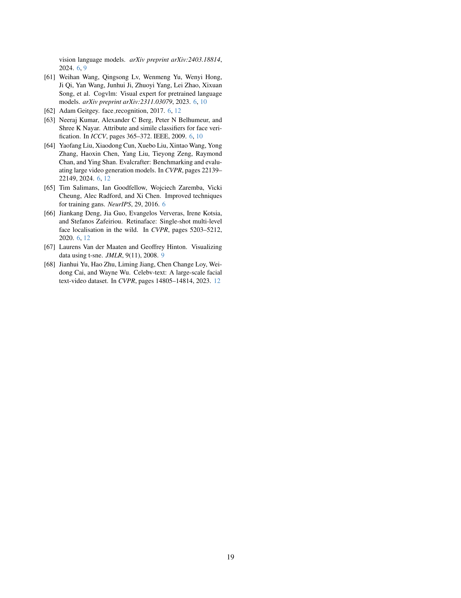

 


 2501.03931 
 Yuechen Zhang et el. 
 
 🤗 2025-01-08 
 



↗ arXiv


↗ Hugging Face


↗ Papers with Code


### TL;DR



최근 텍스트-비디오 생성 기술의 발전에도 불구하고, **개인 식별 정보(ID)를 유지하면서 자연스러운 움직임을 가진 고품질 영상을 생성**하는 것은 여전히 어려운 과제입니다. 기존 연구들은 개인별 미세 조정이 필요하거나, ID 보존과 동작 다양성 사이의 균형을 맞추는 데 어려움을 겪었습니다.  

본 논문에서는 Video Diffusion Transformer를 기반으로 하는 새로운 프레임워크인 MagicMirror를 제시합니다.  MagicMirror는 **이중 분기 얼굴 특징 추출기, 경량 크로스 모달 어댑터, 그리고 2단계 훈련 전략**을 통해 이 문제를 해결합니다.  이중 분기 얼굴 특징 추출기는 ID와 구조적 특징을 모두 포착하고, 경량 크로스 모달 어댑터는 효율적인 ID 통합을 가능하게 합니다.  2단계 훈련 전략은 합성 ID 쌍과 실제 비디오 데이터를 결합하여, ID 일관성과 자연스러운 동작 사이의 균형을 효과적으로 맞춥니다.  실험 결과, MagicMirror는 기존 방법보다 우수한 성능을 보였습니다.



#### Key Takeaways


 MagicMirror는 기존 방법의 한계를 극복하고, **개인 식별 정보를 유지하면서 동적인 얼굴 표정을 가진 고품질 비디오 생성**을 가능하게 합니다. 



 이중 분기 얼굴 특징 추출기와 경량 크로스 모달 어댑터를 통해, **효율적인 ID 통합**을 실현했습니다. 



 합성 데이터와 실제 데이터를 결합한 **2단계 훈련 전략**을 통해, 데이터 부족 문제를 해결하고 성능을 향상시켰습니다. 


#### Why does it matter?
이 논문은 **영상 생성 분야의 최신 동향**인 비디오 확산 변환기를 기반으로, **개인 식별 정보를 보존하는 고품질 영상 생성**이라는 어려운 문제를 해결하는 데 크게 기여합니다. **기존 방법의 한계를 뛰어넘는 새로운 접근 방식**을 제시하여, 연구자들이 더욱 발전된 개인 맞춤형 영상 생성 기술을 개발하는 데 중요한 발판을 마련합니다. 특히, 효율적인 ID 통합을 위한 경량화된 크로스 모달 어댑터와 합성 데이터를 활용한 훈련 전략은 **향후 연구의 중요한 참고 자료**가 될 것입니다. 또한, 이 연구는 인공지능 기반 콘텐츠 생성 분야의 윤리적 문제에 대한 고찰을 제기하여, **책임감 있는 기술 개발**의 중요성을 강조합니다.

------
#### Visual Insights

> 🔼 이 그림은 논문의 Magic Mirror 모델이 ID 참조 이미지를 기반으로 텍스트-비디오 결과를 생성하는 과정을 보여줍니다. 각 비디오 쌍은 총 49프레임 중 24프레임을 보여주며, 해당하는 얼굴 참조 이미지가 왼쪽 아래 모서리에 표시되어 있습니다. 최적의 시청 경험을 위해 Adobe Acrobat Reader를 사용하여 비디오를 재생하는 것이 좋으며, 전체 비디오는 프로젝트 페이지에서 확인할 수 있습니다.
> 

> 
read the caption

> Figure 1: Magic Mirror generates text-to-video results given the ID reference image. Each video pair shows 24 frames (from a total of 49) with its corresponding face reference displayed in the bottom-left corner. Please use Adobe Acrobat Reader for video playback to get optimal viewing experience. Complete videos are available on the project page.
> 


| Models | Dynamic Degree | Text Alignment | Inception Score | Average ID Similarity | Similarity Decay | Face Motion FMref | Face Motion FMinter | Overall Preference |
|---|---|---|---|---|---|---|---|---|
| DynamiCrafter [15] | 0.455 | 0.168 | 8.20 | 0.896 | **0.002** | 0.237 | 1.388 | 5.402 |
| EasyAnimate-I2V [16] | 0.155 | 0.177 | 9.55 | 0.903 | 0.022 | 0.262 | 2.875 | 5.935 |
| CogVideoX-I2V [14] | **0.660** | **0.213** | **9.85** | 0.901 | 0.029 | 0.413 | **2.930** | **6.404** |
| ID-Animator [11] | 0.140 | 0.211 | 7.57 | **0.923** | 0.005 | **0.652** | 2.111 | 5.693 |
| **Magic Mirror** | **0.705** | **0.240** | **10.59** | 0.911 | **0.002** | **0.704** | **3.040** | **7.315** |

> 🔼 표 1은 다양한 비디오 생성 모델들(이미지-비디오 변환 모델 및 ID 보존 모델)의 성능을 정량적으로 비교한 결과를 보여줍니다.  ID 유사도는 복잡한 프롬프트로 인해 얼굴이 누락되는 것을 방지하기 위해 얼굴이 강조된 프롬프트를 사용하여 평가되었습니다.  표에는 각 모델의 동작 자연스러움, 텍스트-동작 정합성, 얼굴 동작의 자연스러움 등 다양한 지표들이 포함되어 있으며, Magic Mirror 모델이 다른 모델들에 비해 우수한 성능을 보임을 보여줍니다.
> 

> 
read the caption

> Table 1: Quantitative comparisons. We report results with Image-to-Video and ID-preserved models. ID similarities are evaluated on the corresponding face-enhanced prompts to avoid face missing caused by complex prompts.
> 

### In-depth insights

#### ID-Preserved Video
본 논문은 **ID 보존 비디오 생성**이라는 매력적인 주제를 다룹니다.  이는 단순히 얼굴을 합성하는 것을 넘어, **동적인 표정과 움직임까지 유지**하면서 비디오를 생성하는 기술을 의미합니다. 기존의 방법들은 정체성 유지를 위해 개인별 미세조정을 필요로 하거나, 자연스러운 움직임과의 균형을 맞추지 못하는 한계를 가졌습니다. 하지만 이 연구는 **듀얼 브랜치 얼굴 특징 추출기**와 **조건부 적응적 정규화**를 통해 이러한 문제를 효과적으로 해결합니다. **경량 크로스-모달 어댑터**를 사용하여 효율적인 ID 통합을 달성하고, 합성 ID 쌍과 실제 비디오 데이터를 결합한 2단계 학습 전략을 통해 **자연스러운 움직임과 정체성 일관성**을 모두 확보합니다.  결과적으로, **매개변수 추가를 최소화**하면서도 기존 방법들을 능가하는 성능을 보여줍니다.  이는 특히 **인물 중심 콘텐츠 생성** 분야에서 큰 발전이며, 앞으로 다양한 응용 분야에서 활용될 가능성이 높습니다.

#### Dual-Branch Extraction
이 논문에서 제안하는 ‘이중 분기 추출(Dual-Branch Extraction)’ 방법은 얼굴 이미지에서 **신원 정보(identity)**와 **구조적 특징(structural features)**을 동시에 포착하기 위해 고안되었습니다.  **두 개의 분기(branch)**는 서로 다른 역할을 수행하여, 하나는 신원을 나타내는 고차원적 특징을 추출하고 다른 하나는 얼굴의 구조적 세부 사항을 담당합니다.  이를 통해, **신원 보존(identity preservation)**과 **자연스러운 움직임(natural motion)** 생성 사이의 균형을 유지하는 데 중요한 역할을 합니다.  **고차원 특징 추출 분기**는 개인의 고유한 얼굴 특징을 효율적으로 학습하고, **구조적 특징 추출 분기**는 얼굴의 형태, 표정, 움직임 등을 상세히 나타내는 정보를 제공합니다.  두 분기의 출력을 결합하여 생성 모델에 입력함으로써, 생성되는 비디오에서 신원 일관성과 동적인 표현력을 동시에 확보할 수 있도록 합니다.  이는 기존의 단일 분기 방식보다 더욱 정교하고 효과적인 얼굴 정보 처리를 가능하게 하여, **더욱 사실적이고 자연스러운 결과물**을 생성하는 데 기여합니다.

#### CAN for DiT
본 논문에서 제시된 'CAN for DiT'는 비디오 확산 트랜스포머(DiT) 기반의 ID 보존 비디오 생성 모델에서 **핵심적인 역할**을 수행합니다.  기존 DiT 아키텍처는 텍스트와 같은 단일 조건 입력에 최적화되어 있으므로, 얼굴 이미지처럼 다양한 모달리티의 조건을 효과적으로 통합하는 데 어려움이 있습니다. CAN은 이러한 문제를 해결하기 위해 **경량화된 크로스-모달 어댑터**를 사용하여 얼굴 특징을 DiT 백본에 효율적으로 통합합니다.  특히, **조건부 적응적 정규화(CAN)**를 통해 다양한 모달리티의 조건 정보를 효과적으로 통합하고,  **항등성 일관성과 자연스러운 동작**을 모두 유지합니다.  CAN의 도입은 단순한 크로스 어텐션 메커니즘을 넘어서,  **레이어별 분포 조절**을 통해 DiT의 공간-시간적 관계 모델링 능력을 유지하면서  ID 정보를 효율적으로 주입하는 **혁신적인 방법**입니다. 이는  **데이터 효율성**과 **모델 효율성**을 모두 고려한 설계이며,  **고품질 ID 보존 비디오 생성**이라는 목표 달성에 크게 기여합니다.

#### Progressive Training
본 논문에서 제안하는 **점진적 학습(Progressive Training)** 전략은 **영상 생성 모델의 성능 향상 및 안정성 확보**에 중요한 역할을 합니다.  먼저, **이미지 데이터를 이용한 전 단계 학습**을 통해 강건한 개인 식별 특징을 학습합니다. 이는 영상 데이터가 부족하거나 품질이 낮은 경우에도 모델의 개인 식별 능력을 유지하는 데 도움이 됩니다. 이후, **영상 데이터를 활용한 후속 단계 학습**을 통해 시간적 일관성을 갖는 자연스러운 얼굴 동작을 생성하는 능력을 향상시킵니다. 이러한 **두 단계 학습 전략**은 개인 식별 정보와 동적 동작 정보 사이의 균형을 유지하는 데 효과적이며, 단순히 정지된 이미지를 복사하여 붙여넣는 방식보다 자연스럽고 역동적인 영상을 생성할 수 있도록 합니다.  **합성 데이터**를 적절히 활용하여 데이터 부족 문제를 해결하고, **실제 데이터와 합성 데이터의 조합**을 통해 더욱 다양하고 고품질의 영상을 생성할 수 있습니다.  **전체적으로, 점진적 학습 전략은 효율적인 매개변수 사용과 뛰어난 성능을 동시에 달성하는 핵심 요소**로 작용합니다.

#### Future Directions
본 논문의 핵심 아이디어는 ID 보존 비디오 생성에 대한 새로운 접근 방식을 제시하는 것이므로, **미래 연구 방향은 크게 세 가지로 나눌 수 있습니다.** 첫째, **다양한 ID를 동시에 처리하는 시스템 구축**입니다. 현재 모델은 하나의 ID에 집중하지만, 실제 세상은 다양한 사람들이 함께 등장하는 비디오가 훨씬 많으므로, **여러 ID를 동시에 인식하고 생성하는 모델**이 필요합니다. 이를 위해서는 보다 정교한 ID 표현 학습 방법과, 효율적인 다중 ID 처리 아키텍처 개발이 중요합니다. 둘째, **의상, 배경 등 미세한 특징까지 보존하는 모델 개발**입니다. 현재 모델은 얼굴 특징에 집중하지만, 실제 비디오에는 다양한 다른 특징들이 ID를 구성하는 데 중요한 역할을 합니다. 따라서, 이러한 **미세한 특징들을 더욱 효과적으로 학습하고 생성**하는 기술이 필요합니다. 마지막으로, **데이터 효율성 및 확장성**을 개선해야 합니다. ID 보존 비디오 데이터는 확보하기 어려우므로, **데이터 증강 기법이나, 소량의 데이터로도 학습이 가능한 모델** 개발이 중요합니다. 또한, 모델의 계산 비용을 줄이기 위한 효율적인 아키텍처 설계도 중요한 과제입니다.

### More visual insights

More on figures

> 🔼 그림 2는 ID 보존 제약 조건으로 인해 동적 얼굴 움직임이 제한적인 ID-Animator[11] 및 비디오 오션[19]과 비교하여 Magic Mirror가 동적인 얼굴 표정을 생성하는 것을 보여줍니다. Magic Mirror는 참조 ID의 정체성을 유지하면서 보다 역동적인 얼굴 표현을 생성합니다. 이 그림은 세 가지 모델의 동적 얼굴 움직임을 비교하여 Magic Mirror의 우수성을 보여줍니다. ID-Animator와 Video Ocean은 얼굴 표정의 범위가 제한적인 반면, Magic Mirror는 자연스럽고 다양한 얼굴 표정을 생성하여 ID 일관성을 유지합니다.
> 

> 
read the caption

> Figure 2: Magic Mirror generates dynamic facial motion. ID-Animator [11] and Video Ocean [19] exhibit limited motion range due to a strong identity-preservation constraint. Magic Mirror achieves more dynamic facial expressions while maintaining reference identity fidelity.
> 

> 🔼 그림 3은 Magic Mirror의 개요를 보여줍니다. 이 프레임워크는 ID 및 얼굴 지각기를 사용하는 이중 분기 기능 추출 시스템을 사용하며, DiT 기반 비디오 생성을 위해 교차 모달 어댑터(그림 4 참조)를 사용합니다. 불꽃으로 표시된 학습 가능한 모듈을 최적화함으로써, 제안된 방법은 제어된 비디오 합성을 유지하면서 모델 효율성을 유지하면서 얼굴 특징을 효율적으로 통합합니다.
> 

> 
read the caption

> Figure 3: Overview of Magic Mirror. The framework employs a dual-branch feature extraction system with ID and face perceivers, followed by a cross-modal adapter (illustrated in Fig. 4) for DiT-based video generation. By optimizing trainable modules marked by the flame, our method efficiently integrates facial features for controlled video synthesis while maintaining model efficiency.
> 

> 🔼 그림 4는 논문의 3장, Magic Mirror에서 제안하는 방법의 핵심 구성 요소인 DiT(Diffusion Transformer) 블록 내의 Cross-modal adapter에 대한 상세 설명입니다.  이 그림은 ID(Identity) 정보와 얼굴 특징을 효율적으로 DiT에 통합하는 방법을 보여줍니다. 특히, Conditioned Adaptive Normalization (CAN)을 사용하여 각 모달리티(ID, 얼굴 특징, 텍스트, 비디오)에 특화된 특징 변조를 수행하고, decoupled attention integration 기법을 통해 모달리티 간의 정보 융합을 개선하는 것을 강조하고 있습니다.  그림을 통해 dual-branch facial feature extractor, lightweight cross-modal adapter with CAN, 그리고 two-stage training 전략 등의 세부적인 구현 방식을 이해할 수 있습니다.
> 

> 
read the caption

> Figure 4: Cross-modal adapter in DiT blocks, featuring Conditioned Adaptive Normalization (CAN) for modal-specific feature modulation and decoupled attention integration.
> 

> 🔼 본 논문의 그림 5는 ID-보존 비디오 생성을 위한 데이터셋 구성 과정을 보여줍니다.  이미지 전처리 단계(A-D)와 비디오 미세조정 단계(D)의 데이터셋이 포함됩니다.  자기 참조 데이터(A, B)와 동일한 신원을 가진 필터링된 합성 쌍(C, D)을 모두 사용합니다. 각 단계별 이미지와 합성 이미지의 수량이 제시되어 있습니다.  자기 참조 데이터는 실제 이미지를 사용하여 ID 특징을 학습하고, 합성 데이터는 ID 일관성을 유지하면서 데이터 부족 문제를 해결하는 데 사용됩니다.  필터링 과정을 통해 낮은 품질이나 일관성이 없는 데이터는 제거하고, 고품질 데이터만을 사용하여 모델의 성능을 향상시킵니다.
> 

> 
read the caption

> Figure 5: Overview of our training datasets. The pipeline includes image pre-training data (A-D) and video post-training data (D). We utilize both self-reference data (A, B) and filtered synthesized pairs with the same identity (C, D). Numbers of (images + synthesized images) are reported.
> 

> 🔼 그림 6은 제시된 텍스트 프롬프트에 따라 다양한 비디오 생성 모델이 생성한 결과물들을 정성적으로 비교 분석한 결과를 보여줍니다. 각각의 비디오 예시에 대해, 왼쪽 상단에는 해당 비디오의 캡션과 참조 이미지가 함께 제시되어 있습니다. 이를 통해 다양한 모델들의 결과물을 직관적으로 비교하고, 각 모델의 장단점과 특징을 보다 명확하게 파악할 수 있습니다. 특히, 본 논문에서 제안된 Magic Mirror 모델의 성능을 기존의 다른 모델들과 비교 분석하여, 그 우수성을 시각적으로 보여주는 데 초점을 맞추고 있습니다.
> 

> 
read the caption

> Figure 6: Qualitative comparisons. Captions and reference identity images are presented in the top-left corner for each case.
> 

> 🔼 그림 7은 Magic Mirror 모델의 성능에 대한 ablation study 결과를 보여줍니다. 왼쪽은 모델의 구성 요소(모듈)별 ablation study 결과이고, 오른쪽은 학습 전략(이미지 전처리, 비디오 미세 조정)별 ablation study 결과입니다. 각 ablation study는 특정 모듈이나 학습 전략을 제거하거나 변경했을 때 모델 성능이 어떻게 달라지는지 보여줍니다. 이를 통해 각 모듈과 학습 전략이 모델 성능에 미치는 영향을 정량적으로 분석하고, 모델의 설계 및 학습 과정을 개선하는 데 활용할 수 있습니다.
> 

> 
read the caption

> Figure 7: Examples for ablation studies. Left: Ablation on modules. Right: Ablation on and training strategies.
> 

> 🔼 그림 8은 제안된 방법의 핵심 구성 요소인 조건부 적응적 정규화(CAN)의 효과를 보여줍니다. CAN 없이 이미지 사전 훈련 단계에서 모델은 헤어스타일과 같은 가장 기본적인 외모 특징도 제대로 학습하지 못하는 반면, CAN을 사용하면 모델이 더 빠르게 수렴하고 더 나은 성능을 달성한다는 것을 보여줍니다.  이를 통해 CAN이 효율적인 ID 통합에 중요한 역할을 한다는 것을 시각적으로 확인할 수 있습니다.
> 

> 
read the caption

> Figure 8: CAN speeds up the convergence. Without the Conditioned Adaptive Normalization, the model cannot fit the simplest appearance features like hairstyle in the image pre-train stage.
> 

> 🔼 그림 9는 t-SNE를 사용하여 다양한 모드(얼굴, 텍스트, 비디오)의 스케일 분포를 시각적으로 보여줍니다. 각 점은 고유한 시간 단계와 레이어 인덱스를 갖는 스케일을 나타냅니다. 또한, 색상을 달리하여 텍스트와 비디오의 적응적 스케일 변화를 보여줍니다. 이 그림은 조건부 적응 정규화(CAN) 메커니즘의 효과를 시각적으로 확인하고, 각 모드의 스케일 분포가 시간에 따라 어떻게 변하는지를 보여주는 데 도움이 됩니다.  다양한 모드의 스케일 분포를 시각화하여 조건부 적응 정규화(CAN)의 효과를 보여주는 그림입니다.
> 

> 
read the caption

> Figure 9:  Different modalities’ scale distribution using t-SNE. Each point represents the scale with a unique timestep-layer index. We also illustrate a shift variant on text and video’s adaptive scale using different colors.
> 

> 🔼 그림 10은 논문의 데이터 전처리 파이프라인을 자세히 보여줍니다. 그림 5를 기반으로 하여, 포괄적인 필터링 기준, 프롬프트 예시 및 처리 과정을 보여줍니다. 데이터 흐름은 파란색 화살표로 표시되며, 데이터 제외 규칙은 빨간색 화살표로 표시됩니다.  이 그림은 LAION-Face, SFHQ, FFHQ, Pexels, Mixkit 등 다양한 데이터셋에서 수집한 이미지와 비디오 데이터를 어떻게 전처리하고 필터링하여 모델 학습에 사용했는지 보여주는 상세한 과정을 담고 있습니다.  각 단계에서 이미지 해상도, 얼굴 검출 결과, 프롬프트 적합성, 유사도 등 다양한 기준을 적용하여 품질이 낮거나 모델 학습에 부적합한 데이터를 제거하고 있습니다.  이는 최종적으로 고품질의 학습 데이터셋을 구축하여 모델 성능 향상에 기여합니다.
> 

> 
read the caption

> Figure 10: Detailed training data processing pipeline. Building upon Fig. 5, we illustrate comprehensive filtering criteria, prompt examples, and processing specifications. The data flow is indicated by blue arrows, while filtering rules leading to data exclusion are marked with red arrows.
> 

> 🔼 그림 11은 간결한 프롬프트와 풍부한 프롬프트를 사용했을 때 이미지-비디오 생성 모델의 성능 차이를 보여줍니다. 간결한 프롬프트는 모델이 이미지의 세부 정보를 충분히 포착하지 못하고, 결과적으로 비디오 생성 과정에서 오류가 발생할 가능성이 높습니다. 반면 풍부한 프롬프트는 모델이 이미지의 다양한 특징을 더욱 정확하게 이해하여 더욱 사실적이고 자연스러운 비디오를 생성할 수 있도록 돕습니다. 그림에서는 오류가 발생한 프레임을 붉은색으로 표시하여 쉽게 구분할 수 있도록 하였습니다. 첫 번째 프레임의 이미지는 풍부한 프롬프트를 사용하여 생성되었습니다.
> 

> 
read the caption

> Figure 11: Impact of prompt length on image-to-video generation. We demonstrate how image-to-video models perform differently with concise versus enhanced prompts. Frames with large artifacts are marked in red. First frame images are generated from enhanced prompts.
> 

> 🔼 그림 12는 얼굴 움직임(Face Motion, FM) 계산 방법을 보여줍니다.  FMref는 참조 이미지(reference image)와 생성된 비디오 프레임 간의 얼굴 움직임 차이를 측정합니다. 이미지의 종횡비를 정규화하여 위치 편향을 제거합니다.  FMinter는 연속된 비디오 프레임 간의 얼굴 움직임 차이를 측정합니다. 이때는 원본 프레임을 사용하여 이동 변화를 보존합니다.  두 지표 모두 RetinaFace를 사용하여 얼굴 랜드마크를 추출하고, 정규화된 좌표 간의 L2 거리를 계산하여 움직임을 정량화합니다.  즉, 얼굴의 움직임을 참조 이미지와의 차이와 프레임 간의 차이, 두 가지 관점에서 정량적으로 분석하는 방법을 설명하는 그림입니다.
> 

> 
read the caption

> Figure 12: Face Motion (FM) calculation. FMinterinter{}_{\text{inter}}start_FLOATSUBSCRIPT inter end_FLOATSUBSCRIPT follows a similar computation across consecutive video frames.
> 

> 🔼 그림 13은 조건부 적응적 정규화(Conditioned Adaptive Normalization, CAN)의 상세한 구현을 보여줍니다. 그림의 설명은  φcond(위 그림에서 마스크 처리되지 않은 영역)의 확장된 아키텍처를 보여주는 것으로, 각 변환 단계에서의 입력 및 출력 텐서 차원에 대한 포괄적인 주석을 포함하고 있습니다.  CAN은 텍스트와 비디오 특징들에 얼굴 특징들을 효율적으로 통합하여 ID 정보를 유지하면서 동적인 얼굴 표정을 생성하는 데 중요한 역할을 합니다.  이 그림은 CAN이 어떻게 작동하는지, 그리고 각 층에서의 텐서 크기가 어떻게 변하는지를 시각적으로 보여줌으로써, 논문의 핵심 기술에 대한 이해를 높이는 데 도움을 줍니다.
> 

> 
read the caption

> Figure 13: Detailed implementation of Conditioned Adaptive Normalization. We present the expanded architecture of φcondsubscript𝜑cond\varphi_{\text{cond}}italic_φ start_POSTSUBSCRIPT cond end_POSTSUBSCRIPT (illustrated in the unmasked region above) with comprehensive annotations of input-output tensor dimensions at each transformation.
> 

> 🔼 그림 14는 모델의 변조 계층(modulation layer)이 데이터 분포를 어떻게 반영하는지 보여줍니다. 변조 계층의 가중치만 미세 조정했을 때, 서로 다른 데이터 분포에 대한 적응력이 향상되어 공간적 정확도(spatial fidelity)와 시간적 동적 특성(temporal dynamics) 모두에 영향을 미치는 것을 보여줍니다.  즉, CelebV-Text와 Pexels 데이터셋으로 각각 미세 조정한 결과를 비교하여, 데이터셋의 특성에 따라 변조 계층이 다르게 반응하며, 이는 최종적으로 생성된 영상의 질에 영향을 준다는 것을 시각적으로 보여줍니다.
> 

> 
read the caption

> Figure 14: Modulation layers reflect data distribution. Fine-tuning solely the modulation layer weights demonstrates adaptation to distinct data distributions, affecting both spatial fidelity and temporal dynamics.
> 

> 🔼 그림 15는 Magic Mirror의 한계를 보여줍니다. (a)는 세세한 얼굴 특징과 액세서리의 보존 실패를 보여주는 반면, (b)는 시간적 일관성이 부족한 동영상에서의 움직임 인공물을 보여줍니다.  (a)에서는 모델이 얼굴의 섬세한 부분이나 액세서리와 같은 세부적인 특징들을 정확하게 재현하는 데 어려움을 겪는다는 것을 보여줍니다. 생성된 이미지에서 머리카락이나 안경테와 같은 디테일이 누락되거나 부정확하게 표현될 수 있습니다. (b)에서는 생성된 비디오에서 시간에 따라 일관되지 않은 움직임이 나타날 수 있음을 시각적으로 보여줍니다. 예를 들어, 얼굴 표정의 변화가 자연스럽지 않거나, 머리카락이나 의복의 움직임이 비현실적으로 보일 수 있습니다. 이러한 문제는 주로 모델의 학습 데이터 부족이나 모델 구조의 한계로 인해 발생할 수 있습니다. 
> 

> 
read the caption

> Figure 15: Limitations of Magic Mirror. (a) Fine-grained feature preservation failure in facial details and accessories. (b) Motion artifacts in generated videos showing temporal inconsistencies.
> 

> 🔼 그림 16은 Magic Mirror의 추가적인 활용 사례를 보여줍니다.  본 논문에서 제시된 기법을 사용하면, 다양한 예술적 스타일을 적용하여 신원이 보존된 비디오를 생성할 수 있습니다. 또한, 일관된 등장인물을 사용하여 여러 장면으로 구성된 비디오를 생성하는 것도 가능합니다.  자세한 결과는 프로젝트 페이지에서 확인할 수 있습니다.
> 

> 
read the caption

> Figure 16: Additional applications of Magic Mirror. We can generate identity-preserved videos across artistic styles and can generate multi-shot videos with consistent characters. More results are presented in the project page.
> 

> 🔼 그림 17은 Magic Mirror를 사용한 이미지 생성 결과를 보여줍니다. 이미지 전처리 단계의 모델은 참조 ID(Ref-ID)의 ID 임베딩을 포착하지만 이미지 품질, 스타일, 배경과 같은 저수준 분포에 과적합되는 것을 보여줍니다.  즉, 참조 이미지의 얼굴 특징은 잘 반영되지만, 이미지의 전반적인 품질, 스타일, 배경은 참조 이미지와 다를 수 있다는 것을 의미합니다.  모델이 개인의 얼굴 특징을 잘 학습했지만, 이미지의 다른 세부적인 요소는 충분히 학습하지 못했기 때문에 나타나는 현상으로 해석할 수 있습니다.
> 

> 
read the caption

> Figure 17: Image generation using Magic Mirror. Model in the image pre-train stage captures ID embeddings of the reference ID (Ref-ID), yet over-fits on some low-level distributions such as image quality, style, and background.
> 

> 🔼 그림 18은 기존의 이미지-비디오 변환(I2V) 방식에 비해 Magic Mirror의 장점을 보여줍니다. Magic Mirror는 부분적으로 가려진 초기 프레임을 포함한 다양한 어려운 상황에서도 성공적으로 작동하며, 복잡한 얼굴 동작을 통해 신원 일관성을 유지합니다. 이는 기존 I2V 방식의 한계를 해결하는 것입니다.  즉, Magic Mirror는 초기 프레임이 부분적으로 가려져 있거나 얼굴 표정이 복잡한 경우에도 안정적으로 작동하여, 동영상 전반에 걸쳐 일관된 신원을 유지하는 능력을 보여줍니다.
> 

> 
read the caption

> Figure 18: Advantages over I2V generation. Magic Mirror successfully handles challenging scenarios including partially occluded initial frames and maintains identity consistency through complex facial dynamics, addressing limitations of traditional I2V approaches.
> 

More on tables


| Models | Visual Quality | Text Alignment | Dynamic Degree | ID Similarity |
|---|---|---|---|---|
| DynamiCrafter [15] | 6.03 | 7.29 | 4.85 | 5.87 |
| EasyAnimate-I2V [16] | 6.62 | 8.21 | 5.57 | 6.01 |
| CogVideoX-I2V [14] | 6.86 | 8.31 | 6.55 | 6.22 |
| ID-Animator [11] | 5.63 | 6.37 | 4.06 | 6.70 |
| Magic Mirror | 6.97 | 8.88 | 7.02 | 6.39 |
> 🔼 표 2는 사용자 연구 결과를 보여줍니다.  다양한 지표(시각적 품질, 텍스트 정합도, 동적 수준, ID 유사도)에 대한 사용자 평가 점수를 포함하여 Magic Mirror 모델의 주관적 성능을 평가합니다.  각 지표는 1에서 10까지의 척도로 평가되었습니다. 이 표는 정량적 결과(표 1)를 보완하여, Magic Mirror 모델의 성능을 다각적으로 분석하고 주관적 사용자 경험을 제시합니다.
> 

> 
read the caption

> Table 2: User study results.
> 


| Model | Memory | Parameters | Time |
|---|---|---|---|
| CogVideoX-5B [14] | 24.9 GiB | 10.5B | 204s |
| Magic Mirror | 28.6 GiB | 12.8B | 209s |
> 🔼 표 3은 Magic Mirror 모델의 계산 오버헤드를 보여줍니다.  CogVideoX-5B 모델과 비교하여 Magic Mirror 모델의 메모리 사용량, 매개변수 수, 추론 시간을 비교 분석하여 모델의 효율성을 평가합니다. 특히, 49프레임의 480P 비디오 생성에 필요한 리소스를 중점적으로 제시합니다.
> 

> 
read the caption

> Table 3: Computation overhead of Magic Mirror.
> 

### Full paper



