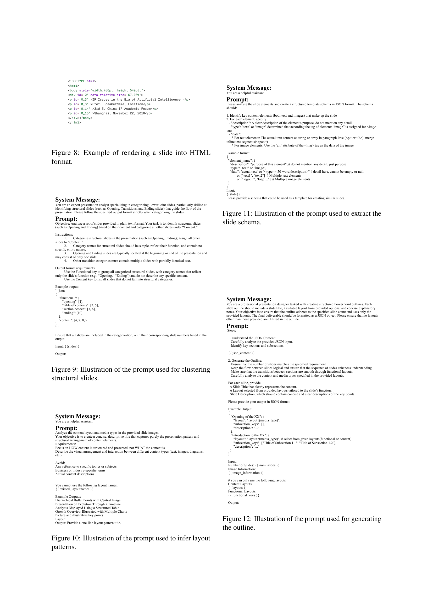

 


 2501.03936 
 Hao Zheng et el. 
 
 🤗 2025-01-08 
 



↗ arXiv


↗ Hugging Face


↗ Papers with Code


### TL;DR



기존의 자동 프레젠테이션 생성 연구는 콘텐츠 품질에만 초점을 맞춰 시각적 디자인과 구조적 일관성을 간과하는 한계가 있었습니다.  이로 인해 실제 적용에 어려움이 있었고, 효과적인 평가 기준도 부족했습니다. 

본 논문에서는 이러한 문제를 해결하기 위해, **인간의 작업 흐름을 모방한 2단계 편집 기반 접근법**을 사용하는 PPTAgent를 제안합니다.  PPTAgent는 참고 프레젠테이션을 분석하여 구조와 콘텐츠 스키마를 이해하고, 코드 조작을 통해 일관성을 유지하며 슬라이드를 생성합니다. 또한, 콘텐츠, 디자인, 일관성 세 가지 측면을 평가하는 **PPT Eval**을 제시하여 생성된 프레젠테이션의 품질을 종합적으로 평가합니다.  실험 결과, PPTAgent는 기존 방법보다 모든 측면에서 우수한 성능을 보였습니다.



#### Key Takeaways


 참고 프레젠테이션을 기반으로 프레젠테이션을 생성하는 새로운 편집 기반 접근법 제시 



 콘텐츠, 디자인, 일관성을 종합적으로 평가하는 PPTEval 프레임워크 제시 



 기존 방법보다 우수한 성능을 보이는 PPTAgent의 실험 결과 제시 


#### Why does it matter?
본 논문은 **자동 프레젠테이션 생성 분야의 난제를 해결**하기 위한 혁신적인 프레젠테이션 생성 및 평가 프레임워크를 제시합니다. 기존의 단순한 텍스트-슬라이드 변환 방식을 넘어, 참고 프레젠테이션을 편집하는 방식으로 **시각적 디자인과 구조적 일관성을 고려**하여 실용성을 높였습니다.  또한, **종합적인 평가 프레임워크**를 제시하여 생성된 프레젠테이션의 콘텐츠, 디자인, 일관성을 다차원적으로 평가함으로써 향후 연구에 중요한 기여를 합니다. 이는 프레젠테이션 생성 기술의 발전과 다양한 분야의 연구에 폭넓은 영향을 미칠 것으로 예상됩니다.

------
#### Visual Insights

> 🔼 그림 1은 제안하는 PPTAgent 방법(왼쪽)과 기존의 추상적 요약 방법(오른쪽)을 비교한 것입니다. PPTAgent는 참조 슬라이드를 편집하는 방식으로 시작하여 사람의 프레젠테이션 제작 과정과 더욱 밀접하게 일치합니다. 왼쪽의 PPTAgent 방법은 참조 슬라이드를 분석하고, 개요를 작성하고, 코드 작업을 통해 일관성과 정렬을 보장하며 슬라이드를 생성하는 단계를 보여줍니다. 반면 오른쪽의 기존 추상적 요약 방법은 문서로부터 바로 슬라이드를 생성하는 방식으로, 시각적 디자인이나 구조적 일관성을 고려하지 않아 실제 적용에는 한계가 있음을 보여줍니다.
> 

> 
read the caption

> Figure 1: Comparison between our PPTPPTAgent approach (left) and the conventional abstractive summarization method (right). Our method, which begins by editing a reference slide, aligns more closely with the human presentation creation process.
> 


| Domain | Document #Chars | Document #Figs | Presentation #Chars | Presentation #Figs | Presentation #Pages |
|---|---|---|---|---|---| 
| Culture | 12,708 | 2.9 | 6,585 | 12.8 | 14.3 |
| Education | 12,305 | 5.5 | 3,993 | 12.9 | 13.9 |
| Science | 16,661 | 4.8 | 5,334 | 24.0 | 18.4 |
| Society | 13,019 | 7.3 | 3,723 | 9.8 | 12.9 |
| Tech | 18,315 | 11.4 | 5,325 | 12.9 | 16.8 |

> 🔼 이 표는 논문의 실험에 사용된 데이터셋의 통계를 보여줍니다.  특히, 각 도메인(Culture, Education, Science, Society, Tech)별 문자 수('#Chars'), 그림 수('#Figs'), 페이지 수('#Pages')를 상세히 나타냅니다. 이 정보는 데이터셋의 규모와 다양성을 이해하는 데 도움이 됩니다.
> 

> 
read the caption

> Table 1: Statistics of the dataset used in our experiments, detailing the number of characters (‘#Chars’) and figures (‘#Figs’), as well as the number of pages (‘#Pages’).
> 

### In-depth insights

#### Edit-Based Gen
편집 기반 생성(Edit-Based Gen)은 기존 프레젠테이션을 활용하여 새로운 프레젠테이션을 생성하는 방식으로, **단순히 텍스트를 슬라이드로 변환하는 기존의 접근 방식과 차별화**됩니다.  기존 방식의 한계를 극복하기 위해, **참조 프레젠테이션의 구조와 내용을 분석하여 템플릿으로 활용**하고, 필요에 따라 **LLM(Large Language Model)을 통해 내용을 수정하거나 추가**하는 방식을 취합니다.  이러한 접근 방식은 단순히 텍스트를 생성하는 것보다 **시각적 디자인 및 구조적 일관성을 유지**하는 데 효과적이며, 사용자의 **직관적인 편집 과정을 모방**하여 실용성을 높입니다.  특히, **다양한 형식의 프레젠테이션 자료를 효율적으로 처리**할 수 있는 가능성을 제시하며, 기존 자동 프레젠테이션 생성 방식의 한계점인 **시각적 디자인 및 구조적 일관성 부족 문제를 해결**하는 데 기여할 것으로 기대됩니다.  하지만, **참조 프레젠테이션의 질**에 따라 결과물의 품질이 크게 영향을 받을 수 있으며, **복잡한 프레젠테이션 자료에 대한 처리 능력**을 높이는 것이 향후 연구 방향이 될 것입니다. 또한, **LLM의 성능 및 한계**에 대한 고려도 필요합니다.

#### PPT Agent
PPT Agent는 **두 단계의 편집 기반 접근 방식**을 통해 프레젠테이션 생성을 재정의하는 혁신적인 프레젠테이션 생성 프레임워크입니다.  기존의 단순한 텍스트-슬라이드 변환 방식에서 벗어나, **참조 프레젠테이션 분석을 통해 구조적 패턴과 콘텐츠 스키마를 이해**하고, 이를 바탕으로 개요를 작성하고 코드 작업을 통해 슬라이드를 생성합니다.  **LLM(대규모 언어 모델)의 일반화 능력**을 활용하여 참조 슬라이드를 편집하고 수정하는 반복적인 과정을 거치며, 일관성과 정렬을 유지합니다.  PPT Agent는 **내용, 디자인, 일관성 세 가지 측면**을 종합적으로 평가하는 PPT Eval 평가 프레임워크와 함께 사용되어, 생성된 프레젠테이션의 질을 다각적으로 평가합니다. **실험 결과는 PPT Agent가 기존 자동 프레젠테이션 생성 방법보다 모든 측면에서 성능이 뛰어남**을 보여줍니다.  **편집 기반 접근 방식**과 **다차원 평가 프레임워크**의 결합은 자동 프레젠테이션 생성 분야의 획기적인 발전으로 볼 수 있으며, 향후 연구에 귀중한 기여를 할 것으로 기대됩니다.

#### Multi-dim Eval
논문에서 "Multi-dim Eval"이라는 제목의 섹션은 다차원적 평가 방식을 제시하는 부분으로 추정됩니다. 이는 기존의 단순한 성능 지표(예: 정확도, 재현율)를 넘어, **다양한 측면** (예: 내용, 디자인, 일관성)을 종합적으로 고려하여 **더욱 포괄적이고 정교한 평가**를 수행하려는 시도로 해석됩니다.  **각 측면에 대한 세부적인 평가 기준**과 함께, **정량적 지표**와 **정성적 평가**를 병행하는 방식을 채택했을 가능성이 높습니다. 예를 들어, 내용 측면에서는 정보의 명확성, 충실도, 그리고 이미지 활용의 적절성 등을 평가하고, 디자인 측면에서는 시각적 요소의 조화, 가독성, 전반적인 미적 완성도 등을 고려했을 것입니다. 일관성 측면에서는 논리적 흐름의 매끄러움, 전개 방식의 적절성 등을 평가했을 것으로 보입니다. 이러한 다차원 평가를 통해, 단순한 성능 수치만으로는 드러나지 않는 **모델의 강점과 약점을 보다 명확히 파악**하고, **향후 연구 방향을 설정**하는 데 도움이 될 것으로 예상됩니다. 특히, **인간 전문가의 평가**와 **자동 평가 시스템**의 결과를 비교 분석하여 평가 방식의 신뢰도를 높였을 가능성도 고려해 볼 수 있습니다.

#### LLM Strengths
LLM(대규모 언어 모델)의 강점은 **방대한 데이터셋을 기반으로 한 높은 언어 이해 능력**에 있습니다.  이는 다양한 언어적 패턴과 문맥을 학습하여 **자연스럽고 정확한 텍스트 생성, 번역, 요약, 질의응답 등의 작업을 수행**할 수 있게 합니다. 또한, **적은 양의 데이터로도 높은 성능을 발휘**하는 **전이 학습(transfer learning)** 능력을 갖추어 다양한 하위 작업에 효과적으로 적용될 수 있습니다.  하지만, LLM은 **데이터 편향성에 취약**하며, **사실과 허구를 구분하지 못하는 한계**를 지닙니다.  **윤리적인 문제** 또한 중요하게 고려해야 할 부분으로, LLM이 생성하는 콘텐츠의 편향성이나 잠재적 악용 가능성을 면밀히 검토해야 합니다.  **설명 가능성(explainability)** 또한 개선되어야 할 부분으로, LLM의 의사결정 과정을 이해하고 신뢰도를 높이는 연구가 지속적으로 필요합니다. 따라서, LLM의 강점을 극대화하고 약점을 보완하기 위한 연구와 개발이 더욱 필요하며, **책임감 있는 LLM 활용**에 대한 사회적 논의 또한 중요합니다.

#### Future Work
본 논문에서 제시된 PPTAgent는 프레젠테이션 생성에 있어 괄목할 만한 성과를 보였지만, 여전히 개선의 여지가 있습니다. **미래 연구는 시각적 요소의 조화 및 일관성 향상에 초점을 맞춰야 합니다.**  특히, 복잡한 중첩 구조를 가진 슬라이드 파싱의 어려움을 해결하고, 시각적 단서를 보다 효과적으로 활용하여 스타일 일관성을 높이는 연구가 필요합니다.  **슬라이드 디자인의 시각적 조화를 향상시키기 위한 연구**는 디자인 결함, 예를 들어 요소 간 겹침 문제를 해결하는 데 집중해야 합니다.  **다양한 도메인의 프레젠테이션 데이터를 확장하여 PPTAgent의 일반화 성능을 높이는 연구**도 중요합니다.  **PPTEval 평가 프레임워크의 신뢰도와 효율성 향상**을 위한 연구 또한 필요합니다.  인간 평가자와의 상관관계를 더욱 높이고, 평가 과정을 더욱 효율적으로 만들 수 있는 방안을 모색해야 합니다.  **대규모 언어 모델(LLM)의 발전에 따라, 더욱 정교하고 효율적인 프레젠테이션 생성 방법을 연구**하는 것이 중요하며, 이는 더욱 향상된 사용자 경험과 생산성 향상으로 이어질 것입니다.  궁극적으로는 **PPTAgent를 더욱 직관적이고 사용자 친화적으로 만들고, 실제 업무 환경에 쉽게 적용될 수 있도록 하는 연구**가 필요합니다.

### More visual insights

More on figures

> 🔼  그림 2는 PPTAgent의 전체 작업 흐름을 보여줍니다. 1단계인 'Presentation Analysis'에서는 입력 프레젠테이션을 분석하여 슬라이드들을 그룹으로 클러스터링하고 각 슬라이드의 콘텐츠 스키마를 추출합니다. 2단계인 'Presentation Generation'에서는 앞서 생성된 개요를 바탕으로 새로운 프레젠테이션을 생성하며, 강건성을 확보하기 위해 피드백 메커니즘을 통합합니다.  즉, 기존 프레젠테이션의 구조와 내용을 분석하여 새로운 프레젠테이션을 효율적으로 생성하는 두 단계 과정을 시각적으로 나타낸 것입니다.
> 

> 
read the caption

> Figure 2: Overview of the PPTPPTAgent workflow. Stage I: Presentation Analysis involves analyzing the input presentation to cluster slides into groups and extract their content schemas. Stage II: Presentation Generation generates new presentations guided by the outline, incorporating feedback mechanisms to ensure robustness.
> 

> 🔼 그림 3은 논문에서 제시된 PPT Eval 평가 프레임워크의 평가 과정을 보여줍니다. PPT Eval은 콘텐츠, 디자인, 일관성이라는 세 가지 주요 측면을 평가합니다. 콘텐츠는 슬라이드 내 텍스트와 이미지의 질을 평가하고, 디자인은 시각적 일관성과 매력도를 평가하며, 일관성은 프레젠테이션의 논리적 흐름에 중점을 둡니다. 각 측면은 1~5점 척도로 평가되며, 개선을 위한 자세한 피드백이 제공됩니다.
> 

> 
read the caption

> Figure 3: This figure illustrates the evaluation process in PPTPPTEval, which assesses three key dimensions: content, design, and coherence. Content evaluates the quality of text and images within the slides. Design examines the visual consistency and appeal. Coherence focuses on the logical flow of the presentation. Each dimension is rated on a scale from 1 to 5, with detailed feedback provided for improvement.
> 

> 🔼 그림 4는 서로 다른 세 가지 모델(GPT-4, Qwen2.5, Qwen2-VL)을 사용하여 슬라이드 하나를 생성하는 데 필요한 반복적인 자기 수정 횟수를 보여줍니다. 각 모델의 반복 횟수별 실패율을 나타내는 막대 그래프를 통해 모델의 성능과 안정성을 비교 분석할 수 있습니다. GPT-4는 다른 두 모델에 비해 더 많은 반복 횟수를 필요로 하지만, 실패율이 가장 낮다는 것을 알 수 있습니다. 반면 Qwen2.5는 GPT-4보다 적은 반복 횟수로 슬라이드 생성을 완료하지만, 실패율이 다소 높습니다. Qwen2-VL은 다른 두 모델보다 실패율이 상당히 높고, 반복 횟수도 많이 필요로 합니다. 이는 다중 모드 사전 훈련으로 인해 언어 능력이 다소 부족하기 때문일 수 있습니다. 이 그림은 모델의 자기 수정 메커니즘의 효율성과 성능을 시각적으로 보여주는 중요한 지표를 제공합니다.
> 

> 
read the caption

> Figure 4: The number of iterative self-corrections required to generate a single slide under different models.
> 

> 🔼 그림 5는 기존의 자동 평가 지표들과 논문에서 제안하는 PPT Eval의 상관관계를 히트맵으로 보여줍니다.  기존 지표들은 PPL(Perplexity), FID(Fréchet Inception Distance) 등이며, PPT Eval은 Content, Design, Coherence 세 가지 차원으로 평가합니다. 히트맵은 각 지표들 간의 상관관계의 강도와 방향을 색깔로 나타내어, 어떤 지표들이 서로 강하게 연관되어 있는지, 또는 반대로 연관성이 약한지를 한눈에 보여줍니다.  이를 통해 PPT Eval이 기존 지표들과 어떻게 관련되어 있는지, 그리고 PPT Eval의 세 가지 평가 차원들이 서로 얼마나 상관있는지를 파악할 수 있습니다.
> 

> 
read the caption

> Figure 5: Correlation heatmap between existing automated evaluation metrics and PPTPPTEval.
> 

> 🔼 이 그림은 논문의 PPTEval 평가 프레임워크에서 사용되는 채점 기준을 보여주는 예시입니다.  각 슬라이드에 대한 내용, 디자인, 일관성 세 가지 측면에 대한 점수 (1~5점) 와 함께, 해당 점수를 받게 된 이유를 설명하는 주석이 포함되어 있습니다.  각 측면에 대한 구체적인 채점 기준이 제시되어 있으며,  다양한 슬라이드 디자인과 내용에 대한 채점 결과를 보여주어 PPTEval의 평가 방법을 명확히 이해하는 데 도움을 줍니다.
> 

> 
read the caption

> Figure 6: Scoring Examples of PPTPPTEval.
> 

> 🔼 그림 7은 논문의 PPTAgent 워크플로우의 첫 번째 단계인 슬라이드 클러스터링의 결과를 보여줍니다.  다양한 기능(예: 오프닝, 컨텐츠 전달, 결론)을 가진 슬라이드들을 유사성에 따라 그룹화하여,  PPTAgent가 참조 프레젠테이션을 분석하고 슬라이드 구조와 컨텐츠 스키마를 이해하는 방식을 시각적으로 보여줍니다.  각 클러스터는 특정한 슬라이드 유형 또는 기능을 나타냅니다. 이는 PPTAgent가 후속 슬라이드 생성 단계에서 적절한 슬라이드를 선택하고 편집하는 데 중요한 역할을 합니다.
> 

> 
read the caption

> Figure 7: Example of slide clusters.
> 

> 🔼 그림 8은 슬라이드를 HTML 형식으로 렌더링한 예시를 보여줍니다.  본 논문의 PPTAgent는 슬라이드 생성 과정에서 HTML 표현을 사용하여 LLMs(대규모 언어 모델)가 슬라이드 구조를 더 잘 이해하도록 돕습니다.  HTML 형식으로 변환된 슬라이드는 텍스트 및 이미지 요소, 그리고 각 요소의 상호 관계를 명확하게 나타내어 LLMs가 슬라이드를 효과적으로 수정하고 새로운 슬라이드를 생성하는 데 도움이 됩니다. 그림은 간단한 슬라이드 예시이며, 실제로는 더 복잡하고 다양한 요소를 포함하는 슬라이드도 HTML로 변환됩니다.
> 

> 
read the caption

> Figure 8: Example of rendering a slide into HTML format.
> 

> 🔼 그림 9는 구조적 슬라이드를 군집화하는 데 사용된 프롬프트를 보여줍니다.  이 프롬프트는  자연어 처리 모델(LLM)이 발표 자료의 슬라이드를 분석하여 '소개', '결론' 등의 구조적 슬라이드와 일반 콘텐츠 슬라이드를 구분하도록 안내합니다.  구조적 슬라이드는 발표의 흐름을 이끄는 역할을 하며, 프롬프트는 모델이 이러한 슬라이드를 정확하게 식별하고 분류할 수 있도록 명확한 지침과 예시 출력 형식을 제공합니다.  모델은 슬라이드의 내용과 구조를 분석하여 슬라이드의 기능적 역할(예: 소개, 목차, 섹션 헤더, 결론)을 파악하고,  각 범주에 해당하는 슬라이드 번호를 포함하여 구조적 슬라이드와 콘텐츠 슬라이드를 구분하여 출력합니다.  이를 통해,  LLM은 발표 자료의 구조를 효과적으로 이해하고,  후속 단계의 발표 생성 과정에 필요한 정보를 추출할 수 있습니다.
> 

> 
read the caption

> Figure 9: Illustration of the prompt used for clustering structural slides.
> 

> 🔼 그림 10은 레이아웃 패턴을 추론하는 데 사용된 프롬프트를 보여줍니다. 이 프롬프트는 제공된 슬라이드 이미지의 콘텐츠 레이아웃과 미디어 유형을 분석하여 콘텐츠 요소의 시각적 배열과 상호 작용을 설명하는 간결하고 설명적인 제목을 생성하는 것을 목표로 합니다.  프롬프트는 특정 주제나 주제에 대한 언급, 비즈니스 또는 업계 관련 용어, 실제 콘텐츠 설명을 피하도록 지시합니다.  대신, 콘텐츠가 어떻게 구성되고 제시되는지에 초점을 맞추고, 텍스트, 이미지, 다이어그램 등 다양한 콘텐츠 유형 간의 시각적 배열과 상호 작용을 설명하도록 합니다. 출력으로는 콘텐츠의 구조와 배열 방식을 포착하는 한 줄짜리 레이아웃 패턴 제목을 제공합니다.
> 

> 
read the caption

> Figure 10: Illustration of the prompt used to infer layout patterns.
> 

> 🔼 그림 11은 논문의 PPTAgent 워크플로우의 첫 번째 단계인 프레젠테이션 분석 단계에서 슬라이드 스키마를 추출하는 데 사용된 프롬프트를 보여줍니다.  이 프롬프트는 모델이 슬라이드의 핵심 요소(텍스트, 이미지)를 식별하고 각 요소의 목적, 유형, 실제 데이터(텍스트 또는 이미지 경로)를 포함하는 구조화된 JSON 스키마를 생성하도록 안내합니다.  이는 후속 슬라이드 생성 단계에서 일관성과 효율성을 보장하기 위해 슬라이드의 내용과 구조에 대한 정확하고 상세한 이해를 확보하는 데 중요한 역할을 합니다.  프롬프트는 예시 JSON 형식과 함께 제공되어 모델의 출력 형식을 명확히 제시합니다.
> 

> 
read the caption

> Figure 11: Illustration of the prompt used to extract the slide schema.
> 

> 🔼 그림 12는 제시된 슬라이드 개수와 레이아웃 옵션을 사용하여 구조화된 PowerPoint 개요를 생성하는 작업을 하는 전문 프레젠테이션 디자이너로서의 LLM(Large Language Model) 프롬프트를 보여줍니다.  LLM은 제공된 JSON 콘텐츠를 분석하고, 논리적인 흐름을 유지하며 슬라이드 간의 전환을 부드럽게 하면서, 지정된 슬라이드 수에 맞는 개요를 생성해야 합니다. 각 슬라이드에는 슬라이드 제목, 적절한 레이아웃, 간결한 설명이 포함되어야 합니다. 최종 출력물은 JSON 객체 형식으로 제공되어야 하며, 제공된 레이아웃만 사용해야 합니다.
> 

> 
read the caption

> Figure 12: Illustration of the prompt used for generating the outline.
> 

> 🔼 그림 13은 본 논문의 PPTAgent에서 제시하는 프롬프트의 예시를 보여줍니다. 이 프롬프트는 슬라이드 콘텐츠 생성을 위한 것으로,  제공된 스키마(schema), 프레젠테이션 개요(outline), 메타데이터(metadata), 참조 텍스트(text), 사용 가능한 이미지 정보(images_info)를 바탕으로 슬라이드 콘텐츠를 생성하도록 지시합니다. 프롬프트는 콘텐츠 생성 규칙, 핵심 요소, 보조 요소 등 세부적인 지침을 포함하고 있으며, 출력 형식까지 명시하여 생성된 콘텐츠의 정확성과 일관성을 확보하도록 합니다.  출력은 스키마의 키와 동일한 키를 가진 JSON 객체 형태여야 하며, 텍스트 요소의 경우 텍스트 내용의 배열을, 이미지 요소의 경우 이미지 경로의 배열을 포함해야 합니다.
> 

> 
read the caption

> Figure 13: Illustration of the prompt used for generating slide content.
> 

> 🔼 그림 14는 본 논문에서 제안하는 프레젠테이션 생성 프레임워크의 두 번째 단계인 프레젠테이션 생성 단계에서 사용되는 프롬프트의 예시를 보여줍니다. 이 프롬프트는 참조 슬라이드를 편집하기 위한 일련의 코드 명령어(API 호출)를 생성하는 데 사용됩니다. 프롬프트는 입력된 명령어를 HTML 구조를 기반으로 API 호출로 정확하게 변환하고, 태그를 구분하며, 부모-자식 관계를 유지하여 요소를 정확하게 타겟팅하는 데 중점을 둡니다.  특히, 양적 변화(quantity_change), 텍스트 내용 및 이미지 내용의 교체에 대한 자세한 지침이 포함되어 있습니다.
> 

> 
read the caption

> Figure 14: Illustration of the prompt used for generating editing actions.
> 

> 🔼 이 그림은 PPTEval에서 내용을 설명하는 데 사용된 프롬프트를 보여줍니다.  프롬프트는 평가자에게 슬라이드 이미지를 주고, 전달된 정보의 양, 내용의 명확성 및 언어의 질, 이미지와 관련성 등 세 가지 차원에서 슬라이드의 내용을 평가하도록 지시합니다. 각 점수 수준은 모든 평가 기준이 해당 수준의 표준을 충족해야 함을 나타냅니다.  프롬프트는 객관적이고 간결한 설명을 제공하도록 지시하며, 제시된 차원에만 집중하도록 합니다.
> 

> 
read the caption

> Figure 15: Illustration of the prompt used to describe content in PPTEval.
> 

> 🔼 그림 16은 PPTEval에서 슬라이드 스타일을 평가하기 위해 사용된 프롬프트를 보여줍니다.  이 프롬프트는 평가자가 슬라이드의 시각적 일관성, 색 구성표, 시각적 요소의 사용 등을 평가할 수 있도록 안내합니다.  5점 척도(1점: 낮음, 5점: 높음)를 사용하여 슬라이드의 스타일을 종합적으로 평가합니다. 각 점수 수준은 특정 스타일 기준을 충족해야 합니다.  프롬프트는 평가자가 슬라이드의 미적 요소를 객관적이고 간결하게 설명하도록 유도합니다.
> 

> 
read the caption

> Figure 16: Illustration of the prompt used to describe style in PPTEval.
> 

> 🔼 그림 17은 PPTEval에서 콘텐츠를 추출하는 데 사용된 프롬프트를 보여줍니다. 이 프롬프트는 제시된 프레젠테이션을 분석하고, 각 슬라이드의 주요 내용을 요약하는 슬라이드 설명과 발표자, 날짜 등의 배경 정보를 포함하는 프레젠테이션 메타데이터를 추출하도록 설계되었습니다.  추출된 정보는 JSON 형식으로 출력되며, 슬라이드 설명은 슬라이드의 주요 내용을 간결하게 요약하고, 메타데이터는 프레젠테이션의 배경 정보를 제공합니다.
> 

> 
read the caption

> Figure 17: Illustration of the prompt used to extract content in PPTEval.
> 

> 🔼 본 그림은 논문의 PPTEval 섹션에서 내용 평가를 위해 사용된 프롬프트를 보여줍니다. 그림은 프롬프트의 세부 내용과 다섯 가지 점수 기준(1점부터 5점까지)을 보여줍니다. 각 점수는 슬라이드의 내용 명확성, 언어 품질, 이미지의 적절성 등 다양한 측면에 대한 자세한 설명을 포함합니다. 이는 평가자들이 슬라이드 내용의 질을 객관적이고 일관되게 평가할 수 있도록 돕는 역할을 합니다.
> 

> 
read the caption

> Figure 18: Illustration of the prompt used to evaluate content in PPTEval.
> 

> 🔼 그림 19는 논문의 PPTEval 섹션에서 스타일을 평가하기 위해 사용된 프롬프트를 보여줍니다.  이 프롬프트는 평가자가 슬라이드의 시각적 매력도를 평가할 때 사용하는 기준(시각적 일관성, 색 구성표, 시각적 요소 사용)을 명확하게 제시합니다.  5점 척도로 평가하도록 안내하고 각 점수에 대한 자세한 설명을 제공하여 일관성 있는 평가를 유도합니다.  프롬프트는 슬라이드의 시각적 요소(색상, 이미지, 기하학적 모양 등)의 사용과 관련하여 시각적 일관성과 조화를 평가하는 방법을 제시합니다. 또한 색 구성표의 사용(단색 또는 다색)과 추가 시각적 요소(아이콘, 배경, 이미지 또는 기하학적 모양)의 사용 여부를 고려합니다.
> 

> 
read the caption

> Figure 19: Illustration of the prompt used to evaluate style in PPTEval.
> 

> 🔼 그림 20은 PPTEval에서 프레젠테이션의 일관성을 평가하는 데 사용된 프롬프트를 보여줍니다.  프롬프트는 평가 기준(5점 척도)과 각 점수 수준에 대한 자세한 설명을 제공합니다.  일관성은 용어의 일관성, 논리적 구조의 명확성, 전환의 매끄러움, 배경 정보의 포함 여부 등을 고려하여 평가됩니다.  평가자는 제시된 요약본을 바탕으로 프레젠테이션의 논리적 흐름과 문맥 정보를 평가하여 점수를 매기고 그 이유를 설명해야 합니다.  이 프롬프트는 평가자의 객관적인 판단을 유도하여 일관성에 대한 정확하고 일관된 평가를 보장하는 데 도움이 됩니다.
> 

> 
read the caption

> Figure 20: Illustration of the prompt used to evaluate coherence in PPTEval.
> 

More on tables


| Setting | Language Model | Vision Model | SR(%) ↑ | PPL ↓ | FID ↓ | Content ↑ | Design ↑ | Coherence ↑ | Avg. ↑ |
|---|---|---|---|---|---|---|---|---|---|---|
| **Baseline** |  |  |  | **110.6** |  | 2.98 | 2.33 | 3.24 | 2.85 |
| GPT-4oLM | – | – | – | **110.6** | – | 2.98 | 2.33 | 3.24 | 2.85 |
| Qwen2.5LM | – | – | – | **122.4** | – | 2.96 | 2.37 | 3.28 | 2.87 |
| **PPTAgent** |  |  |  |  |  |  |  |  |  |
| GPT-4oLM | GPT-4oVM | **97.8** | 459.7 | 7.48 | **3.25** | 3.24 | **4.39** | **3.62** |
| Qwen2-VLLM | Qwen2-VLVM | 43.0 | 322.3 | **7.32** | 3.13 | **3.34** | 4.07 | 3.51 |
| Qwen2.5LM | Qwen2-VLVM | **95.0** | 313.9 | **6.20** | **3.28** | **3.27** | **4.48** | **3.67** |
| **Ablation** |  |  |  |  |  |  |  |  |  |
| PPTAgent |  | **95.0** | 313.9 | **6.20** | **3.28** | 3.27 | **4.48** | **3.67** |
| _w/o Outline_ |  | 91.0 | 2304.3 | **6.94** | 3.24 | **3.30** | 3.36 | 3.30 |
| _w/o Schema_ |  | 78.8 | **164.8** | 7.12 | 3.08 | 3.23 | 4.04 | 3.45 |
| _w/o Structure_ |  | **92.2** | **189.9** | 7.66 | **3.28** | 3.25 | 3.45 | 3.32 |
| _w/o CodeRender_ |  | 74.6 | 231.0 | 7.03 | 3.27 | **3.34** | **4.38** | **3.66** |
> 🔼 표 2는 기존 방법, 제안된 PPTAgent 프레임워크 및 변형된 PPTAgent의 성능 비교 결과를 보여줍니다. 성공률(SR), 퍼플렉서티(PPL), FID(Heusel et al., 2017)와 같은 기존 지표와, 내용, 디자인, 일관성 및 평균 점수를 평가하는 제안된 PPT Eval 지표를 사용하여 결과를 보고합니다.
> 

> 
read the caption

> Table 2: Performance comparison of the baseline, our proposed PPTAgent framework, and its ablation variants. Results are reported using existing metrics—Success Rate (SR), Perplexity (PPL), and FID (Heusel et al., 2017)—as well as our proposed PPTPPTEval metrics, which assess Content, Design, Coherence, and their average score.
> 


| Corelation | Content | Design | Coherence | Avg. |
|---|---|---|---|---|
| **Pearson** | 0.70 | 0.90 | 0.55 | 0.71 |
| **Spearman** | 0.73 | 0.88 | 0.57 | 0.74 |
> 🔼 표 3은 다섯 가지 다른 도메인(문화, 교육, 과학, 사회, 기술)에서 Qwen2-VLLM_LM + Qwen2-VLVM_VM 구성을 사용한 평가 결과를 보여줍니다. 성공률(SR), 퍼플렉서티(PPL), FID(Fréchet Inception Distance), 그리고 세 가지 평가 차원(내용, 디자인, 일관성)에 대한 평균 PPTEval 점수를 사용하여 성능을 평가했습니다. 이 표는 제안된 방법의 도메인 적응력과 견고성을 보여주는 데 중점을 둡니다.
> 

> 
read the caption

> Table 3: Evaluation results under the configuration of Qwen2-VLLMLM{}_{\texttt{LM}}start_FLOATSUBSCRIPT LM end_FLOATSUBSCRIPT+Qwen2-VLVMVM{}_{\texttt{VM}}start_FLOATSUBSCRIPT VM end_FLOATSUBSCRIPT in different domains, using the success rate (SR), PPL, FID and the average PPTEval score across three evaluation dimensions.
> 


| Function Name | Description |
|---|---| 
| `del_span` | Deletes a specific span. |
| `del_image` | Deletes an image element. |
| `clone_paragraph` | Creates a duplicate of an existing paragraph. |
| `replace_span` | Replaces the content of a specific span. |
| `replace_image` | Replaces an image with a new image. |
> 🔼 본 표는 인간 평가자와 LLM 평가자의 평가 결과 간의 상관 관계를 보여줍니다. 세 가지 차원(일관성, 내용, 디자인)에서 인간 평가자와 LLM 평가자의 평점 간의 피어슨 상관 계수와 스피어만 상관 계수를 제시합니다. 모든 상관 관계는 p 값이 0.05 미만으로 통계적으로 유의미한 수준의 신뢰도를 나타냅니다.  즉, 인간 평가자와 LLM 평가자의 평가 결과가 높은 상관관계를 보이며, LLM을 사용한 자동화된 프레젠테이션 평가의 신뢰성을 뒷받침합니다.
> 

> 
read the caption

> Table 4: The correlation scores between human ratings and LLM ratings under different dimensions (Coherence, Content, Design). All presented data of similarity exhibit a p-value below 0.05, indicating a statistically significant level of confidence.
> 

### Full paper



