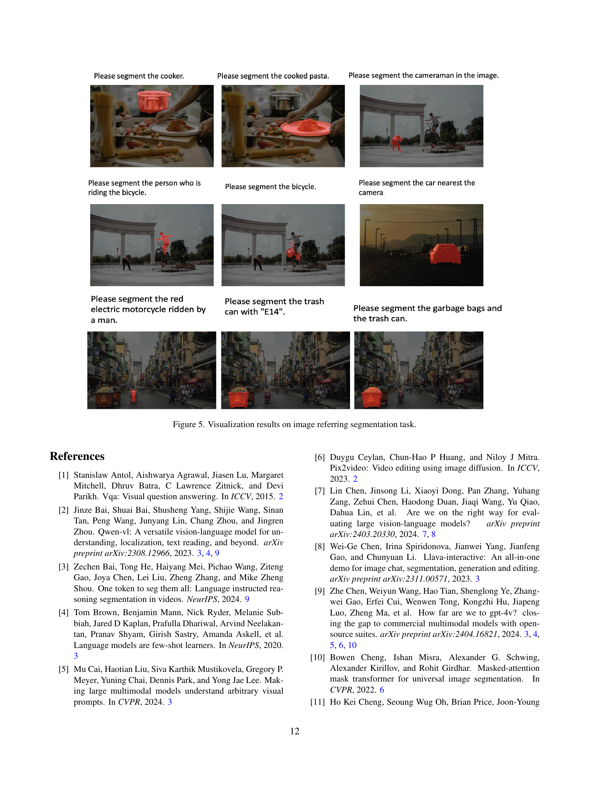
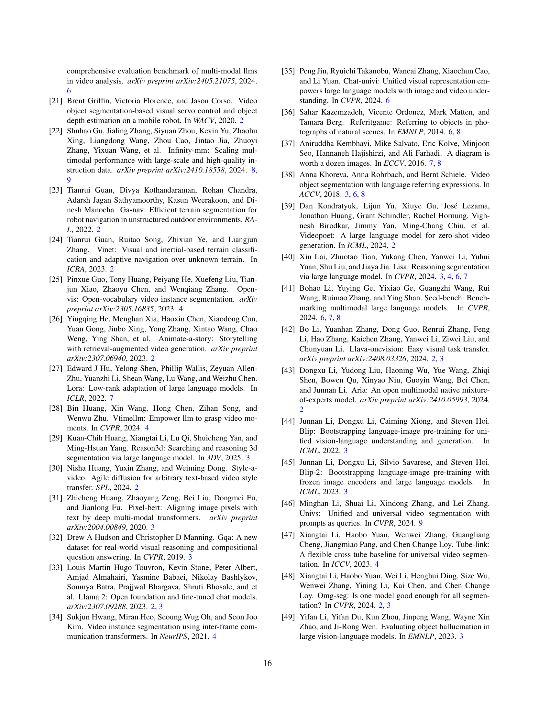

 


 2501.04001 
 Haobo Yuan et el. 
 
 🤗 2025-01-08 
 



↗ arXiv


↗ Hugging Face


↗ Papers with Code


### TL;DR



기존의 멀티모달 대규모 언어 모델(MLLM)은 특정 모드나 작업에 제한적이거나 지각 능력이 부족한 한계를 가지고 있습니다.  **이러한 문제를 해결하기 위해 이미지와 비디오의 정밀한 지상 이해를 위한 새로운 모델이 필요합니다.**

본 논문에서는 이미지와 비디오의 밀집 지상 이해를 위한 최초의 통합 모델인 Sa2VA를 제시합니다. **Sa2VA는 SAM-2(기초 비디오 분할 모델)와 LLaVA(고급 비전-언어 모델)을 결합하여 텍스트, 이미지 및 비디오를 공유 LLM 토큰 공간으로 통합합니다.**  **LLM을 사용하여 SAM-2를 안내하여 정밀한 마스크를 생성하여 정밀하고 다중 모드의 시각적 콘텐츠 이해를 가능하게 합니다.** 또한, Sa2VA는 다양한 작업(참조 분할, 대화, 기반 캡션 생성 등)에서 최첨단 성능을 달성합니다.



#### Key Takeaways


 Sa2VA는 이미지와 비디오에 대한 밀집 지상 이해를 위한 최초의 통합 모델입니다. 



 Sa2VA는 단일 샷 지시 조정을 통해 여러 작업(참조 분할, 대화, 기반 캡션 생성 등)을 통합합니다. 



 Sa2VA는 여러 이미지, 비디오 참조 분할 및 채팅 벤치마크에서 최첨단 결과를 달성합니다. 


#### Why does it matter?
**본 논문은 이미지와 비디오에 대한 밀집 지상 이해를 위한 최초의 통합 모델인 Sa2VA를 제시하여 다양한 멀티모달 작업에서 최첨단 성능을 달성합니다.** 이는 **영상 이해 분야의 연구 방향을 제시하고, 새로운 연구 가능성을 열어줍니다.** 특히, **단일 샷 지시 조정을 통해 여러 작업을 통합하는 접근 방식은 멀티모달 모델 개발에 중요한 영향을 미칠 것입니다.** Sa2VA의 코드, 데이터 세트 및 모델 공개는 향후 연구에 크게 기여할 것입니다.

------
#### Visual Insights

> 🔼 본 논문에서 제안하는 Sa2VA의 기능을 보여주는 그림입니다. (a)는 Sa2VA가 비디오에서 언급된 객체를 분할하고 전체 장면을 이해할 수 있음을 보여줍니다. (b)는 Sa2VA가 이미지 대화, 비디오 대화, 이미지 참조 분할, 비디오 참조 분할 및 단일 샷 지시어 미세 조정을 통한 기반 캡션 생성을 지원함을 보여줍니다. (c)는 GLaMM [66] 및 OMG-LLaVA [99]와 같은 기존 MLLM과 비교하여 Sa2VA가 여러 이미지, 비디오 참조 분할 및 채팅 벤치마크에서 강력한 결과를 달성함을 보여줍니다.
> 

> 
read the caption

> Figure 1: Illustration of capabilities of our proposed Sa2VA. (a). Given a video, Sa2VA is able to segment the referred object and understand the whole scene. (b).Sa2VA supports image conversation, video conversation, image referring segmentation, video referring segmentation, and grounded caption generation with single-shot instruction-tuning. (c).Sa2VA achieves strong results on multiple images, video referring segmentation, and chat benchmarks compared with existing MLLMs, such as GLaMM [66] and OMG-LLaVA [99].
> 


| Method | Image | Video | Visual Prompts | RES | Ref-VOS | Inter-VOS | GCG | Image-Chat | Video-Chat | Video Caption | Interactive Caption | End to End | 
|---|---|---|---|---|---|---|---|---|---|---|---|---|
| LLAVA [53] | 2713 | 2717 | 2717 | 2717 | 2717 | 2717 | 2717 | 2717 | 2713 | 2717 | 2717 | 2713 |
| LLaVA-OneVision [42] | 2713 | 2713 | 2717 | 2717 | 2717 | 2717 | 2717 | 2713 | 2713 | 2713 | 2717 | 2713 |
| InternVL 2.0 [9] | 2713 | 2713 | 2717 | 2717 | 2717 | 2717 | 2717 | 2713 | 2713 | 2713 | 2717 | 2713 |
| Osprey [92] | 2713 | 2717 | 2713 | 2717 | 2717 | 2717 | 2717 | 2713 | 2717 | 2717 | 2717 | 2713 |
| LISA [40] | 2713 | 2717 | 2713 | 2713 | 2717 | 2717 | 2717 | 2717 | 2717 | 2717 | 2717 | 2713 |
| GLAMM [66] | 2713 | 2717 | 2713 | 2713 | 2717 | 2717 | 2713 | 2717 | 2717 | 2717 | 2717 | 2713 |
| VIP-LLaVA [5] | 2713 | 2717 | 2713 | 2717 | 2717 | 2717 | 2717 | 2713 | 2717 | 2717 | 2717 | 2713 |
| VISA [85] | 2713 | 2713 | 2713 | 2713 | 2713 | 2717 | 2717 | 2717 | 2717 | 2717 | 2717 | 2717 |
| OMG-LLaVA [99] | 2713 | 2713 | 2713 | 2713 | 2713 | 2717 | 2717 | 2713 | 2713 | 2717 | 2717 | 2713 |
| PSALM [101] | 2713 | 2713 | 2717 | 2713 | 2717 | 2717 | 2717 | 2717 | 2717 | 2717 | 2717 | 2713 |
| GSVA [83] | 2713 | 2717 | 2717 | 2713 | 2717 | 2717 | 2717 | 2717 | 2717 | 2717 | 2717 | 2713 |
| LLaMA-VID [50] | 2713 | 2713 | 2717 | 2717 | 2717 | 2717 | 2717 | 2713 | 2713 | 2713 | 2717 | 2713 |
| ST-LLM [56] | 2713 | 2713 | 2717 | 2717 | 2717 | 2717 | 2717 | 2713 | 2713 | 2713 | 2717 | 2713 |
| F-LLM [82] | 2713 | 2717 | 2717 | 2713 | 2717 | 2717 | 2717 | 2713 | 2717 | 2717 | 2717 | 2717 |
| Sa2VA (Ours) | 2713 | 2713 | 2713 | 2713 | 2713 | 2713 | 2713 | 2713 | 2713 | 2713 | 2713 | 2713 |

> 🔼 표 1은 다양한 대표적인 모델들의 기능을 비교한 표입니다. Sa2VA는 다양한 작업과 모드를 지원하며, 특히 비디오의 상호작용 기능을 통해 그림 1(a)와 (b)에서처럼 여러 개의 프롬프트 가능한 작업을 수행할 수 있습니다. 이 표에서는 각 모델이 이미지, 비디오, 시각적 프롬프트, 참조 객체 분할(RES), 참조 비디오 객체 분할(Ref-VOS), 상호 작용 비디오 객체 분할(Inter-VOS), 기반 대화 생성(GCG), 이미지 채팅, 비디오 채팅, 비디오 캡션, 상호 작용 캡션 등의 기능을 지원하는지 여부를 보여줍니다.  Sa2VA의 주요 특징은 여러 가지 작업들을 하나의 모델로 통합하고, 비디오 상호 작용 기능을 통해 다양한 프롬프트 가능한 작업을 효율적으로 처리할 수 있다는 점입니다.
> 

> 
read the caption

> Table 1: Comparison of capabilities of different representative models. Our method supports various tasks and modalities. Benefiting from these interactive features on video, Sa2VA can perform multiple promptable tasks in the video, as shown in Fig. 1 (a) and (b).
> 

### In-depth insights

#### Unified Multimodal Model
통합 다중 모드 모델은 **단일 프레임워크 내에서 다양한 모드(텍스트, 이미지, 비디오)의 데이터를 처리하고 통합하는 능력**을 의미합니다. 이는 각 모드를 개별적으로 처리하는 기존의 접근 방식과 대조적입니다.  **모델의 주요 목표는 다양한 작업을 위한 일반적인 표현을 학습하는 것**이며, 여기에는 이미지 캡션 생성, 질의응답, 참조 분할 등이 포함될 수 있습니다. 이러한 모델은 **다중 모드 입력에 대한 풍부하고 정확한 이해를 얻기 위해 다양한 정보 소스를 효과적으로 결합**합니다.  **주요 과제는 다양한 모드의 데이터를 효율적이고 효과적으로 통합**하는 방법이며, 이를 통해 **모델의 성능을 저하시키지 않으면서 모델의 유연성과 일반화 능력을 향상시킬 수 있습니다.**  이러한 모델은 **비디오 이해, 로봇 공학, 증강 현실 등 여러 분야**에 혁신적인 가능성을 제시합니다.  **하지만, 계산 비용과 데이터 규모**가 큰 과제로 남아 있으며, 이에 대한 효과적인 해결책이 필요합니다.

#### Ref-SAV Dataset
본 논문에서 제시된 Ref-SAV 데이터셋은 **비디오 객체 참조 분할(referring video object segmentation)** 작업을 위한 새로운 기준 데이터셋으로, 기존 데이터셋의 한계를 극복하고자 **자동화된 주석 생성 파이프라인**을 통해 구축되었습니다. 기존 데이터셋의 부족한 부분인 복잡한 장면, 장기간 지속되는 비디오, 다양한 객체 표현 등을 해결하기 위해, **대규모의 비디오 데이터와 객체 표현**을 포함하고 있습니다. **자동화 파이프라인**을 통해 효율성을 높였지만, **2,000개의 비디오 객체에 대한 수동 검증**을 수행하여 정확도를 높였습니다.  **다양한 난이도의 객체 표현**을 포함하고 있어, 모델의 견고성과 일반화 능력을 평가하는 데 유용하며, 향후 **비디오 이해 연구의 발전**에 크게 기여할 것으로 예상됩니다.  특히, **장면 레벨과 비디오 레벨의 주석**을 추가하여 보다 풍부한 정보를 제공하고, **복잡한 객체와 장면**을 포함함으로써 모델의 실제 세계 적용 가능성을 높였습니다.  **다양한 모델과의 비교 실험**을 통해 Ref-SAV 데이터셋의 유용성을 확인하였으며, 이는 향후 연구 방향을 제시하는 데 도움이 될 것입니다.

#### Instruction Tuning
지시어 미세조정(Instruction Tuning)은 **대규모 언어 모델(LLM)**의 성능을 향상시키는 핵심 기술입니다.  본 논문에서 제시된 Sa2VA 모델은 **SAM-2와 같은 영상 분할 모델과 LLaVA와 같은 다중 모드 LLM을 통합**하여 설계되었습니다. 이러한 통합 모델은 단일 샷 지시어 미세조정을 통해 다양한 영상 및 비디오 작업을 수행할 수 있습니다.  **지시어를 통해 SAM-2의 분할 능력을 안내함으로써** 다중 모드 이해 능력을 향상시키는 것이 핵심입니다.  **Ref-SAV와 같은 고품질 데이터셋**을 활용한 학습 또한 모델 성능에 크게 기여합니다.  **다양한 과제(영상 분할, 대화, 캡션 생성 등)을 하나의 프레임워크로 통합**하는 접근 방식은 효율성과 유연성을 높여줍니다.  결론적으로, Sa2VA 모델은 지시어 미세조정을 통해 **다양한 작업에 대한 강력하고 일반화된 성능**을 달성하며,  **실세계 응용 프로그램에 대한 잠재력**을 보여줍니다.  **데이터셋의 질적 향상** 또한 미세조정의 효과를 극대화하는 중요한 요소로 작용합니다.

#### Ablation Studies
본 논문의 "절제 연구(Ablation Studies)" 부분은 **모델 성능에 대한 요인 분석**을 통해 Sa2VA의 설계 선택 및 성능에 기여하는 주요 구성 요소를 밝히는 데 중점을 둡니다.  특히, **다양한 데이터셋을 사용한 공동 학습(co-training)의 효과**와 **세분화 토큰 설계**의 영향을 심층적으로 분석하여 모델 성능에 미치는 영향을 정량적으로 제시합니다.  **절제 실험은 모델의 견고성과 일반화 능력**을 평가하는 데 도움이 되며, 향후 모델 개선 및 발전 방향을 제시하는 데 중요한 역할을 합니다. 이를 통해 연구자들은 모델의 강점과 약점을 파악하고, **더욱 효율적이고 성능이 뛰어난 다중 모드 모델 개발**에 대한 통찰력을 얻을 수 있습니다.  **결과적으로, 이러한 절제 연구는 Sa2VA 모델의 신뢰성을 높이고, 그 성능의 근거를 명확히 제시하며, 미래 연구를 위한 방향을 제시하는데 기여**할 것입니다.

#### Future Directions
본 논문은 영상과 이미지에 대한 밀집 지상 이해를 위한 통합 모델인 Sa2VA를 제시합니다.  **향후 연구 방향**으로는 첫째, **더욱 긴 비디오와 복잡한 참조 표현에 대한 Sa2VA의 성능을 개선**하는 것입니다.  현재 모델은 긴 비디오의 전체 내용을 파악하지 못하고, 복잡한 참조 표현에 대한 처리 능력이 제한적입니다.  둘째, **영상 질의응답(VQA) 작업에서의 성능 저하 없이 참조 분할 작업의 성능을 향상**시키는 연구가 필요합니다.  두 작업 간 균형을 맞추는 것이 중요합니다.  셋째, **다양한 데이터셋을 활용한 Sa2VA의 확장성 연구**를 통해 모델의 일반화 능력을 높여야 합니다.  마지막으로 **모델의 효율성을 높이는 경량화 및 최적화 연구**도 중요한 과제입니다. 이러한 연구를 통해 Sa2VA의 실세계 적용 가능성을 더욱 높일 수 있을 것입니다.

### More visual insights

More on figures

> 🔼 그림 2는 제안된 Sa2VA 모델의 구조를 보여줍니다.  Sa2VA 모델은 텍스트, 비주얼 프롬프트, 이미지, 비디오를 토큰 임베딩으로 인코딩하는 것으로 시작합니다. 이러한 토큰들은 대규모 언어 모델(LLM)을 통해 처리됩니다. 출력 텍스트 토큰은 [SEG] 토큰과 연관된 언어 출력을 생성하는 데 사용됩니다. SAM-2 디코더는 SAM-2 인코더로부터 이미지 및 비디오 기능과 [SEG] 토큰을 함께 받아 해당 이미지 및 비디오 마스크를 생성합니다.  즉, 다양한 유형의 입력 데이터(텍스트, 이미지, 비디오)를 토큰으로 변환하고, LLM을 통해 의미를 분석하여, 최종적으로 이미지와 비디오에 대한 세밀한 영역을 지정하는 마스크를 생성하는 모델입니다.
> 

> 
read the caption

> Figure 2: Our proposed Sa2VA model. The model first encodes the input texts, visual prompts, images, and videos into token embeddings. These tokens are then processed through a large language model (LLM). The output text tokens are used to generate the [SEG] token and associated language outputs. The SAM-2 decoder receives the image and video features from the SAM-2 encoder, along with the [SEG] token, to generate corresponding image and video masks.
> 

> 🔼 그림 3은 논문에서 제안하는 자동 데이터 주석 파이프라인을 보여줍니다. 이 파이프라인은 객체/부분 수준, 장면 수준, 비디오 수준의 세 가지 단계로 구성됩니다. 각 단계에서 생성된 텍스트 표현은 최종 표현에서 서로 다른 색상으로 강조 표시되어 각 단계에서 파생된 정보를 명확하게 보여줍니다.  객체/부분 수준 주석에서는 객체의 특징을 자세하게 설명합니다. 장면 수준 주석에서는 객체와 주변 환경과의 관계를 설명합니다. 마지막으로 비디오 수준 주석에서는 비디오 전체에 걸쳐 객체의 움직임과 동작을 포착하는 설명을 생성합니다.  결과적으로, 이러한 다단계 접근 방식은 복잡한 비디오 장면 내에서 객체를 더욱 정확하고 포괄적으로 설명하는 풍부한 텍스트 주석을 생성합니다.
> 

> 
read the caption

> Figure 3: Data annotation pipeline. Our proposed automatic data annotation pipeline consists of three stages: object/part-level, scene-level, and video-level text expression annotation. We use different colors in the final expression to highlight the information derived from each stage. Best view on screen and zoom out.
> 

> 🔼 그림 4는 논문에서 제안하는 Ref-SAV 벤치마크의 샘플들을 보여줍니다. Ref-SAV는 다양한 크기의 객체, 복잡한 폐색과 재출현, 그리고 짧고 긴 형식의 텍스트 설명을 특징으로 하는 새로운 벤치마크입니다. 이는 기존의 참조 비디오 객체 분할 데이터셋의 한계를 극복하고 더욱 현실적인 시나리오를 반영하기 위해 고안되었습니다. 그림은 Ref-SAV 벤치마크의 다양성과 어려움을 보여주는 여러가지 예시들을 제시합니다.
> 

> 
read the caption

> Figure 4: The samples of our Ref-SAV benchmark. Our proposed benchmark features multi-granularity, complex occlusion and reappearing, and both short and long-format text expressions.
> 

> 🔼 그림 5는 이미지 참조 분할 작업에 대한 시각화 결과를 보여줍니다.  다양한 언어 설명을 사용하여 Sa2VA 모델이 이미지에서 서로 다른 객체를 정확하게 분할하는 능력을 보여주는 여러 예시가 포함되어 있습니다. 각 이미지에는 입력으로 사용된 언어 설명과 모델이 생성한 분할 마스크가 함께 표시됩니다. 이 그림은 Sa2VA 모델의 정확성과 다양한 객체와 복잡한 시나리오를 처리하는 능력을 강조합니다.
> 

> 
read the caption

> Figure 5: Visualization results on image referring segmentation task.
> 

> 🔼 그림 6은 비디오 객체 분할에 대한 시각화 결과를 보여줍니다.  각 이미지는 사용자가 특정 객체를 언급하는 질문(예: “검은색 패치가 있는 흰색 강아지를 분할해 주세요.”)과 함께, 모델이 생성한 분할 마스크를 표시합니다.  이 그림은 다양한 시각적 조건(조명 변화, 움직임, 부분적 가림 등) 하에서 모델의 성능을 보여주는 여러 비디오 클립의 프레임을 포함합니다.  각 클립은 모델이 해당 객체를 정확하게 분할하는 능력을 보여줍니다.  이는 모델이 비디오 속 복잡하고 동적인 시각적 정보를 효과적으로 이해하고 처리할 수 있음을 시사합니다.
> 

> 
read the caption

> Figure 6: Visualization results on video referring segmentation.
> 

> 🔼 이 그림은 Sa2VA 모델이 GCG(Grounded Caption Generation) 작업에서 생성한 마스크를 시각적 프롬프트로 사용하여 시각적 프롬프트 이해 작업에 대한 결과를 보여줍니다. 각 마스크는 특정 영역을 나타내며, 해당 영역에 대한 지역 수준 설명을 생성합니다. 마스크와 해당 설명은 동일한 색상으로 강조 표시되어 시각적 이해도를 높였습니다. 즉, 모델이 이미지의 특정 영역을 정확하게 식별하고 그에 대한 자세한 설명을 생성하는 능력을 보여주는 예시입니다.
> 

> 
read the caption

> Figure 7: Visualization results on visual prompt understanding task. We use the masks predicted by our model under the GCG task as visual prompts, and generated region-level descriptions for these masks. The object masks and their captions for the corresponding region are highlighted in the same color.
> 

> 🔼 그림 8은 GCG(Grounded Caption Generation) 작업에 대한 시각화 결과를 보여줍니다. 상단은 본 논문에서 제안하는 방법의 결과이고, 하단은 이전 최고 성능 기준(baseline)이었던 OMG-LLaVA [99]의 결과입니다.  이 그림은 제안된 방법이 이전 최고 성능 기준보다 더 강력하고 세밀한 접지(grounding) 능력과 텍스트 정렬을 가지고 있음을 보여줍니다.  각각의 이미지에 대해, 생성된 캡션이 해당 객체 마스크와 얼마나 잘 정렬되어 있는지 시각적으로 비교하여 보여줍니다.  세밀한 접지 능력은 생성된 캡션이 객체의 특징을 보다 정확하고 자세하게 설명하는 것을 의미하고, 텍스트 정렬은 생성된 마스크와 캡션이 객체의 경계에 정확하게 일치하는 것을 의미합니다.
> 

> 
read the caption

> Figure 8: Visualization results on GCG tasks. Top: our method. Bottom: OMG-LLaVA [99]. Note that, our method has stronger and fined-grained grounding ability and text alignment than OMG-LLaVA [99], previous strong baseline.
> 

More on tables


| Method | Image Segmentation |  |  | Video Segmentation |  |  | Image Chat |  | Video Chat | GCG |
|---|---|---|---|---|---|---|---|---|---|---|---|
| RefCOCO [36] | RefCOCO+ [36] | RefCOCOg [90] | MeViS [13] | Ref-DAVIS17 [38] | ReVOS [85] |  | MME [19] | MMBench [59] | SEED-Bench [41] | Video-MME [20] | MMBench-Video [17] | GCG [66] |
| LLAVA-1.5-13B [54] | - | - | - | - | - | - | 1531 | 68.8 | 70.1 | - | - | - |
| Video-LLaVA-7B [51] | - | - | - | - | - | - | - | 60.9 | - | 39.9 | 1.03 | - |
| LLaMA-VID-7B [50] | - | - | - | - | - | - | 1521 | 65.1 | 59.9 | - | 1.08 | - |
| mPLUG-Owl3-8B [89] | - | - | - | - | - | - | - | 77.6 | - | 53.5 | 1.35 | - |
| InternVL2-8B [9] | - | - | - | - | - | - | - | 81.7 | 76.2 | 54.0 | 1.28 | - |
| PixelLM-7B [68] | 73.0 | 66.3 | 69.3 | - | - | - | 309/135 | 17.4 | - | - | - | - |
| LaSagnA [77] | 76.8 | 66.4 | 70.6 | - | - | - | 0/0 | 0.0 | - | - | - | - |
| LISA-7B [40] | 74.1 | 62.4 | 66.4 | - | - | - | 1/1 | 0.4 | - | - | - | - |
| GLaMM-7B [66] | 79.5 | 72.6 | 74.2 | - | - | - | 14/9 | 36.8 | - | - | - | 28.9 |
| LLaVA-G-7B [96] | 77.1 | 68.8 | 71.5 | - | - | - | - | - | - | - | - | - |
| GSVA-13B [83] | 79.2 | 70.3 | 75.7 | - | - | - | - | - | - | - | - | - |
| OMG-LLaVA-7B [99] | 78.0 | 69.1 | 72.9 | - | - | - | 1177/235 | 47.9 | 56.5 | - | - | 29.9 |
| VISA-13B [85] | 72.4 | 59.8 | 65.5 | 44.5 | 70.4 | 50.9 | - | - | - | - | - | - |
| Sa2VA-1B (Ours) | 77.4 | 69.9 | 72.3 | 50.8 | 72.3 | 47.6 | 1381/405 | 68.3 | 64.8 | 39.9 | 1.07 | 23.8 |
| Sa2VA-4B (Ours) | 78.9 | 71.7 | 74.1 | 52.1 | 73.8 | 53.2 | 1536/530 | 77.3 | 73.3 | 50.4 | 1.23 | 28.2 |
| Sa2VA-8B (Ours) | 81.6 | 76.2 | 78.7 | 57.0 | 75.2 | 57.6 | 1617/511 | 81.6 | 75.1 | 52.1 | 1.34 | 31.0 |
| Sa2VA-26B (Ours) | 82.5 | 78.8 | 79.7 | 57.3 | 77.0 | 58.4 | 1691/538 | 83.7 | 76.8 | 52.6 | 1.45 | 33.5 |
> 🔼 표 2는 이미지 및 비디오 참조 분할 벤치마크와 이미지 및 비디오 채팅 벤치마크에 대한 실험 결과를 보여줍니다.  이 표는 다양한 모델들의 이미지 및 비디오 참조 분할 성능, 그리고 이미지 및 비디오 채팅 능력을 정량적으로 비교 분석하여 Sa2VA 모델의 우수성을 보여줍니다.  구체적으로는 RefCOCO, RefCOCO+, RefCOCOg, MeViS, Ref-DAVIS17, ReVOS 등의 이미지 및 비디오 참조 분할 데이터셋과, MME, MMBench, SEED-Bench, Video-MME, MMBench-Video 등의 이미지 및 비디오 채팅 데이터셋에서의 성능을 정확도(accuracy)와 F-measure 등의 지표로 평가하여 제시합니다.  Sa2VA 모델은 여러 벤치마크에서 기존 최고 성능 모델들을 상회하는 결과를 달성하였음을 보여주는 중요한 표입니다.
> 

> 
read the caption

> Table 2: Experiment results on image/video referring segmentation benchmarks and image/video chat benchmarks.
> 


| Type | Datasets |
|---|---| 
| Image QA | LLaVA 1.5 (665K) |
| Image Segmentation | RefCOCO (17K), RefCOCO+ (17K), RefCOCOg (22K), Grand-f (214K) |
| Video QA | ChatUniVi (100K) |
| Video Segmentation | Ref-YTVOS (3.5K), MeVIS (0.6K), ReVOS (1.7K), Ref-SAV (37K) |
> 🔼 표 3은 논문의 실험에 사용된 데이터셋을 보여줍니다. 이미지 질의응답(Image QA), 이미지 분할(Image Segmentation), 비디오 질의응답(Video QA), 그리고 비디오 분할(Video Segmentation) 데이터셋이 포함되어 있습니다. 각 데이터셋의 종류와 크기(예: 데이터 수)가 나열되어 있어, 본 논문에서 사용된 데이터의 범위와 특징을 이해하는 데 도움이 됩니다.
> 

> 
read the caption

> Table 3: Datasets used for experiments.
> 


| Method | MME[19] | MMBench[59] | SEED-Bench[41] | AI2D[37] | MMStar[7] | MMMU[93] | SQAtest[60] | RefCOCO | RefCOCO+ | RefCOCOg |
|---|---|---|---|---|---|---|---|---|---|---|
| LISA-7B[40] | 1/1 | 0.4 | - | 0.0 | - | - | - | 74.1 | 62.4 | 66.4 |
| PixelLM-7B[68] | 309/135 | 17.4 | - | 0.0 | - | - | - | 73.0 | 66.3 | 69.3 |
| LaSagnA-7B[77] | 0/0 | 0.0 | - | 0.0 | - | - | - | 76.8 | 66.4 | 70.6 |
| GLaMM-7B[66] | 14/9 | 36.8 | - | 28.2 | - | - | - | 79.5 | 72.6 | 74.2 |
| OMG-LLaVA-7B[99] | 1177/235 | 47.9 | 56.5 | 42.9 | - | - | - | 78.0 | 69.1 | 72.9 |
| Sa2VA-4B (ours) | 1553/540 | 76.8 | 72.6 | 79.9 | 53.7 | 46.2 | 95.8 | 80.4 | 74.3 | 76.7 |
| Sa2VA-8B (ours) | 1651/578 | 82.4 | 75.5 | 82.1 | 60.3 | 44.7 | 96.8 | 81.9 | 76.5 | 78.9 |
> 🔼 표 4는 이미지 수준의 벤치마크에 대한 Sa2VA 모델의 성능을 보여줍니다.  Sa2VA는 이미지 채팅 및 참조 분할 작업 모두에서 최고의 정확도를 달성했습니다. 특히, 기존의 최첨단 모델들과 비교하여 이미지 채팅과 참조 분할 작업 간의 균형있는 성능을 보여주는 것을 강조하고 있습니다.  이 표는 Sa2VA가 이미지 이해 작업에서 뛰어난 성능을 보이는 다양한 측면을 보여주는 데 도움이 됩니다.
> 

> 
read the caption

> Table 4: Performance on image-level benchmarks. Our method achieves the best accuracy trade-off between image chat and referring segmentation datasets.
> 


| Method | Long J | Long F | Long J&F | Short J | Short F | Short J&F | Overall J | Overall F | Overall J&F |
|---|---|---|---|---|---|---|---|---|---| 
| UniRef++ [79](https://arxiv.org/html/2501.04001/79.png) (zs) | 14.1 | 10.8 | 12.5 | 9.0 | 8.2 | 8.6 | 11.6 | 9.5 | 10.5 |
| UNINEXT [84](https://arxiv.org/html/2501.04001/84.png) (zs) | 11.7 | 8.3 | 10.0 | 5.8 | 4.4 | 5.1 | 8.8 | 6.4 | 7.6 |
| MeVIS [13](https://arxiv.org/html/2501.04001/13.png) (zs) | 12.1 | 7.1 | 11.3 | 6.2 | 5.3 | 5.5 | 12.2 | 9.8 | 10.3 |
| VISA [85](https://arxiv.org/html/2501.04001/85.png) (zs) | 16.1 | 12.2 | 14.1 | 12.3 | 9.6 | 9.2 | 13.2 | 11.3 | 11.8 |
| Sa2VA-8b (zs) | 47.7 | 50.9 | 49.3 | 31.5 | 35.0 | 33.3 | 39.6 | 43.0 | 41.3 |
| Sa2VA-8b (ft ) | 57.0 | 60.4 | 58.7 | 39.5 | 42.9 | 41.2 | 48.3 | 51.7 | 50.0 |
> 🔼 표 5는 제안된 Ref-SAV 훈련 데이터셋으로 훈련된 모델과 그렇지 않은 모델의 Ref-SAV 검증 세트에 대한 zero-shot 테스트와 fine-tuned 테스트 결과를 보여줍니다.  'zs'는 zero-shot testing을, 'ft'는 제안된 Ref-SAV 훈련 데이터셋으로 fine-tuned 된 모델을 의미합니다.  이 표는 다양한 모델들의 Ref-SAV 데이터셋에 대한 성능을 비교하여 제안된 방법의 효과를 보여줍니다.
> 

> 
read the caption

> Table 5: Ref SAV validation sets. zs: zero-shot testing. ft: trained with our proposed Ref-SAV training dataset.
> 


| Model Type | RefCOCO | RefCOCO+ | RefCOCOg |
|---|---|---|---|
| LAVT [88] | 72.7 | 62.1 | 61.2 |
| GlaMM-7B [66] | 79.5 | 72.6 | 74.2 |
| OMG-LLaVA-7B [99] | 78.0 | 69.1 | 72.9 |
| F-LLM-7B [82] | 76.1 | 65.2 | 68.5 |
| Sa2VA-4B (ours) | 80.4 | 74.3 | 75.7 |
| Sa2VA-8B (ours) | 82.3 | 77.3 | 79.3 |
> 🔼 표 6은 미세 조정된 모델들과 Sa2VA의 성능을 비교한 표입니다.  RefCOCO, RefCOCO+, RefCOCOg 데이터셋에서 Sa2VA의 제로샷(zs) 및 미세 조정(ft) 성능을 보여주는 정밀도(Precision)과 재현율(Recall)을 보여줍니다.  기존의 UniRef++, GlaMM-7B, OMG-LLaVA-7B, 그리고 F-LLM-7B 모델과 비교하여 Sa2VA의 성능 우수성을 보여줍니다. 특히 Ref-SAV 데이터셋을 사용하여 미세 조정한 Sa2VA의 성능 향상을 강조합니다.
> 

> 
read the caption

> Table 6: Comparison with Fine-tuned Models.
> 


| Data | Image Segmentation |  |  | Video Segmentation |  | Image Chat |  |  | Video Chat |  |
|---|---|---|---|---|---|---|---|---|---|---|
|  | RefCOCO | RefCOCO+ | RefCOCOg | MeViS | Ref-DAVIS17 | MME | MMBench | SEED-Bench | Video-MME | MMBench-Video |
|---|---|---|---|---|---|---|---|---|---|---|
| All Data | 77.4 | 69.9 | 72.3 | 50.8 | 72.3 | 1381/405 | 68.3 | 64.8 | 39.9 | 1.07 |
| w/o Image QA | 78.0 | 70.1 | 72.2 | 48.3 | 73.0 | 1298/359 | 63.4 | 63.8 | 39.7 | 0.39 |
| w/o Image Segmentation | 20.2 | 20.6 | 23.2 | 38.0 | 48.8 | 1393/408 | 70.1 | 65.7 | 41.2 | 1.08 |
| w/o Video QA | 78.0 | 70.4 | 72.6 | 50.7 | 74.3 | 1370/402 | 69.1 | 65.0 | 41.3 | 0.71 |
| w/o Video Segmentation | 77.4 | 69.1 | 72.4 | 44.4 | 69.0 | 1403/398 | 67.8 | 64.9 | 40.4 | 1.04 |
> 🔼 표 7은 다양한 데이터셋을 활용한 공동 학습의 효과에 대한 추가 분석 결과를 보여줍니다.  각 열은 이미지 분할, 비디오 분할, 이미지 채팅, 비디오 채팅 작업에 대한 성능을 나타내며, 각 행은 특정 데이터셋(이미지 QA, 이미지 분할, 비디오 QA, 비디오 분할)을 제외하고 학습했을 때의 결과를 보여줍니다. 이를 통해 각 데이터셋이 전체 성능에 미치는 영향을 정량적으로 분석하고, 다양한 데이터셋을 함께 사용하는 공동 학습 전략의 중요성을 강조합니다.
> 

> 
read the caption

> Table 7: Ablation study on co-training effect on multiple datasets.
> 


| Base | Image Segmentation | Image Segmentation | Image Segmentation | Video Segmentation | Video Segmentation | Image Chat | Image Chat | Image Chat | Image Chat | Image Chat | Image Chat | Image Chat |
|---|---|---|---|---|---|---|---|---|---|---|---|---|
| MLLM | RefCOCO[36] | RefCOCO+[36] | RefCOCOg[90] | MeViS[13] | Ref-DAVIS17[38] | MME[19] | MMBench[59] | SEED-Bench[41] | AI2D[37] | MMStar[7] | SQAtest[60] |
| InternVL2.0-4B | 80.4 | 74.3 | 76.7 | 52.1 | 73.8 | 1553/540 | 76.8 | 72.6 | 79.9 | 53.7 | 95.8 |
| InternVL2.0-8B | 81.9 | 76.5 | 78.9 | 57.0 | 75.2 | 1651/578 | 82.4 | 75.5 | 82.1 | 60.3 | 96.8 |
| InternVL2.5-4B | 82.4 | 77.6 | 79.7 | 55.9 | 73.7 | 1691/610 | 81.8 | 74.9 | 81.4 | 57.9 | 96.8 |
| InternVL2.5-8B | 82.6 | 78.0 | 80.3 | 58.9 | 75.9 | 1690/610 | 84.4 | 76.5 | 82.7 | 62.4 | 97.4 |
> 🔼 표 8은 논문에서 제시된 Sa2VA 모델에 더 강력한 InternVL2.5 모델을 사용했을 때의 실험 결과를 보여줍니다. InternVL2.5 모델의 크기(4B, 8B)에 따른 이미지 및 비디오 분할, 이미지 채팅, 비디오 채팅 작업에서의 성능 향상을 보여주는 다양한 지표들을 제시합니다.  이를 통해 InternVL2.5를 사용했을 때 Sa2VA 모델의 성능이 향상되는 것을 확인할 수 있습니다.
> 

> 
read the caption

> Table 8: Experiment results using stronger InternVL2.5 in our Sa2VA.
> 


| Type | RefCOCO | RefCOCO+ | RefCOCOg | DAVIS | MeVIS |
|---|---|---|---|---|---| 
| Single | 77.4 | 69.9 | 72.3 | 72.3 | 50.8 |
| Repeat | 77.3 | 70.2 | 72.5 | 71.1 | 49.6 |
| Multiple | 77.6 | 70.3 | 72.4 | 68.6 | 46.3 |
> 🔼 표 9는 모델의 성능에 중요한 영향을 미치는 '[SEG]' 토큰 설계에 대한 ablation study 결과를 보여줍니다.  다양한 '[SEG]' 토큰 설계 방법(단일, 반복, 다중)을 비교하여 각 방법이 이미지 및 비디오 분할 작업의 정확도에 미치는 영향을 분석합니다. 이를 통해 최적의 '[SEG]' 토큰 설계 방식을 도출하고 모델 성능 향상에 기여하는 요소를 파악하는 데 도움이 됩니다.
> 

> 
read the caption

> Table 9: Ablation study on [SEG] token design.
> 


| Dataset | Size | RefCOCO | RefCOCOg | MMBench | MME | MeVIS |
|---|---|---|---|---|---|---|
| baseline | 1.2M | 77.4 | 72.3 | 68.3 | 1381/405 | 50.8 |
| Inifinity-MM [22] | 1.2M+3M | 77.1(-0.3) | 72.6(+0.3) | 70.4(+2.1) | 1396/346(-44) | 51.2(+0.4) |
| Ref-SAV | 1.2M+37K | 77.2(-0.2) | 72.6(+0.3) | 68.2(-0.1) | 1384/418(+16) | 52.5(+1.7) |
> 🔼 표 10은 더 많은 데이터셋을 사용했을 때 모델 성능에 미치는 영향을 보여주는 추가 실험 결과를 보여줍니다. 기본 모델(baseline)에 비해 다양한 데이터셋(Infinity-MM, Ref-SAV)을 추가로 학습시켰을 때, 각 지표(RefCOCO, RefCOCOg, MMBench, MME, MeVIS)에서 성능 변화를 정량적으로 비교 분석합니다.  각 데이터셋 추가에 따른 성능 향상 또는 저하를 통해 데이터셋의 중요도와 모델 성능 개선에 대한 시사점을 도출할 수 있습니다.
> 

> 
read the caption

> Table 10: Ablation study on using more datasets.
> 


| Model Type | MeViS | ReVOS | Ref-DAVIS17 |
|---|---|---|---|
| PG-Video-LLaVA [61] | 18.87 | - | - |
| GLaMM + SAM2 [62] | 38.7 | - | - |
| VideoGLaMM [62] | 45.2 | - | - |
| ViLLa [102] | - | - | 64.4 |
| VISA-13B [85] | 44.5 | 50.9 | 70.4 |
| VideoLISA-3.8B [3] | 44.4 | - | 68.8 |
| Sa2VA-4B (ours) | 52.1 | 53.2 | 73.8 |
> 🔼 표 11은 최근 발표된 비디오 다중 모달 대규모 언어 모델(MLLM)들과 제안된 Sa2VA 모델의 성능을 비교한 표입니다.  비교 대상 지표는 RefCOCO, RefCOCO+, RefCOCOg, Ref-DAVIS17, MeViS, ReVOS 데이터셋에서의 성능으로, Sa2VA가 기존 모델들보다 우수한 성능을 보임을 보여줍니다.
> 

> 
read the caption

> Table 11: Comparison with Recent Video MLLMs.
> 


| Model Type | RefCOCO | RefCOCO+ | RefCOCOg | MeVIS | Ref-DAVIS17 |
|---|---|---|---|---|---| 
| LAVT [88] | 72.7 | 62.1 | 61.2 | - | - |
| ReferFormer [78] | - | - | - | 31.0 | 61.1 |
| UniRef++-L [79] | 81.4 | 74.0 | 76.0 | - | 67.2 |
| EVF-SAM [100] | 82.4 | 76.5 | 78.2 | - | - |
| LMPM [13] | - | - | - | 37.2 | - |
| UniVS [46] | - | - | - | - | 59.4 |
| Sa2VA-26B (ours) | 82.5 | 78.8 | 79.7 | 57.3 | 77.0 |
> 🔼 표 12는 영상 전문가 모델들과 Sa2VA 모델의 성능을 비교 분석한 표입니다.  RefCOCO, RefCOCO+, RefCOCOg, DAVIS, MeViS 와 같은 다양한 이미지 및 영상 분할 데이터셋에서의 성능을 정밀도(J), 재현율(F), 그리고 J&F 점수를 사용하여 비교하고 있습니다.  각 모델의 강점과 약점을 비교하여 Sa2VA 모델의 경쟁력을 보여주는 표라 할 수 있습니다.
> 

> 
read the caption

> Table 12: Comparison with Vision Expert Models.
> 


| MLLM Type | RefCOCO | RefCOCO+ | RefCOCOg | Ref-DAVIS17 | MeVIS | ReVOS |
|---|---|---|---|---|---|---|
| Sa2VA: Qwen2-VL-2B [2] | 76.9 | 68.7 | 72.9 | 72.0 | 49.4 | 40.0 |
| Sa2VA: Intern-VL2-1B | 77.4 | 69.9 | 72.3 | 72.3 | 50.8 | 47.6 |
| Sa2VA: Intern-VL2-4B | 78.9 | 71.7 | 74.1 | 73.8 | 52.1 | 53.2 |
> 🔼 표 13은 Sa2VA 모델에 Qwen2-VL 언어 모델을 사용했을 때의 성능을 보여줍니다.  Ref-COCO, Ref-COCO+, RefCOCOg, Ref-DAVIS17, MeViS, 그리고 ReVOS 데이터셋에 대한 제로샷(zero-shot) 및 파인튜닝(fine-tuned) 결과를 보여줍니다.  각 데이터셋에 대한 J&F(Jaccard Index and F-measure) 점수가 제시되어 Sa2VA 모델의 다양한 비디오 분할 작업에 대한 성능을 비교 분석할 수 있도록 합니다.
> 

> 
read the caption

> Table 13: Sa2VA with Qwen2-VL model.
> 


| Method | Long J | Long F | Long J&F | Short J | Short F | Short J&F | Overall J | Overall F | Overall J&F |
|---|---|---|---|---|---|---|---|---|---| 
| UniRef++ (zs) | 14.1 | 10.8 | 12.5 | 9.0 | 8.2 | 8.6 | 11.6 | 9.5 | 10.5 |
| UniRef++ (ft) | 19.2 | 15.1 | 17.2 | 12.3 | 11.7 | 12.0 | 15.8 | 13.4 | 14.6 |
> 🔼 표 14는 제안된 Ref-SAV 훈련 데이터셋으로 훈련된 모델과 제로샷 테스트 결과를 보여줍니다.  'ft'는 Ref-SAV 데이터셋으로 fine-tuning된 모델, 'zs'는 zero-shot testing(사전 훈련된 모델을 추가 훈련 없이 바로 테스트)을 의미합니다.  이 표는 Ref-SAV 검증 세트에서 다양한 방법의 성능을 비교 분석하여 제안된 방법의 효과를 보여줍니다.
> 

> 
read the caption

> Table 14: Ref SAV validation sets. ft: trained with our proposed Ref-SAV training dataset. zs: zero-shot testing.
> 


| Method | Sa2VA-4B | OMG-LLaVA [99] | Osprey [92] | GLaMM [66] | GRIT [81] | Kosmos-2 [64] |
|---|---|---|---|---|---|---|
| METEOR | 17.3 | 15.3 | 16.6 | 16.2 | 15.2 | 14.1 |
> 🔼 표 15는 RefCOCOg 데이터셋에서 지역 캡션 성능을 보여줍니다.  다양한 모델들의  RefCOCOg 데이터셋의 영역 캡션 작업에 대한 정량적 평가 결과를 보여주는 표입니다.  METEOR 점수를 사용하여 각 모델의 성능을 비교합니다.  이는 이미지 내의 특정 영역에 대한 텍스트 설명 생성 능력을 평가하는 지표입니다.  표에서 Sa2VA-4B 모델이 다른 모델들에 비해 상대적으로 높은 성능을 보임을 확인할 수 있습니다.
> 

> 
read the caption

> Table 15: Region caption performance on RefCOCOg dataset.
> 


| Property | DAVIS17-RVOS | ReVOS | Ref-YT-VOS | MeVIS | Ours |
|---|---|---|---|---|---| 
| Short Text | ✓ | ✓ | ✓ | ✓ | ✓ |
| Long Text | ✗ | ✓ | ✗ | ✗ | ✓ |
| Large Object Motion | ✗ | ✗ | ✓ | ✗ | ✓ |
| Large Camera Motion | ✓ | ✓ | ✗ | ✗ | ✓ |
| Heavy Occlusion | ✗ | ✗ | ✗ | ✗ | ✓ |
> 🔼 표 16은 기존의 Ref-VOS (Referring Video Object Segmentation) 벤치마크들과 Sa2VA 모델의 성능을 비교한 표입니다.  단순히 캡션만으로는 알 수 없는 세부적인 비교 내용을 추가 설명하자면, 기존 벤치마크들이 짧은 텍스트 설명, 큰 물체의 움직임, 큰 카메라 움직임, 심한 폐색 등 다양한 어려운 상황들을 모두 포함하고 있지 않은 반면, Sa2VA는 이러한 다양한 어려운 상황들을 모두 포함하는 벤치마크를 사용하여 평가되었다는 것을 보여줍니다. 따라서 Sa2VA가 더욱 까다로운 조건에서도 성능이 우수함을 나타냅니다.
> 

> 
read the caption

> Table 16: Comparison with previous Ref-VOS benchmarks.
> 

### Full paper



