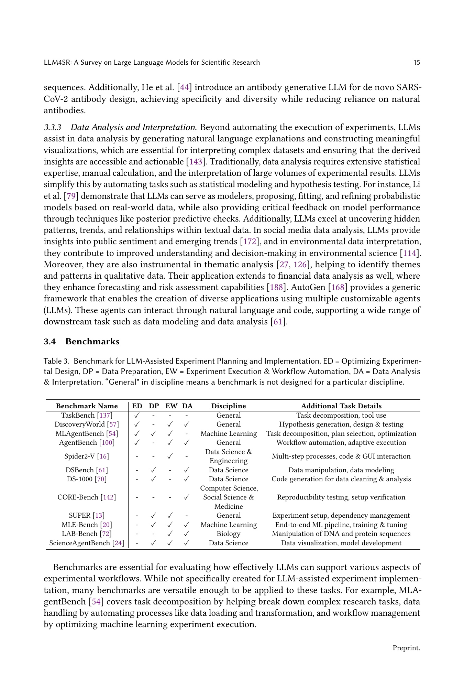

 


 2501.04306 
 Ziming Luo et el. 
 
 🤗 2025-01-09 
 



↗ arXiv


↗ Hugging Face


↗ Papers with Code


### TL;DR



본 논문은 **대규모 언어 모델(LLM)**이 과학 연구 전반에 미치는 영향을 종합적으로 분석한 최초의 체계적 조사입니다.  과학적 가설 발견, 실험 계획 및 실행, 과학적 논문 작성, 동료 검토 등 과학 연구의 네 가지 주요 단계에서 LLM의 역할을 분석하고, 각 단계별 방법론과 평가 기준을 제시합니다.  현재의 과제를 제시하고 미래 연구 방향을 제시함으로써, LLM의 혁신적 잠재력을 강조하고 과학 연구의 발전에 기여할 목표를 가지고 있습니다.

논문은 기존의 과학 연구 방법론을 자동화하여 과학적 발견의 속도와 효율성을 향상시킬 수 있음을 보여주는 다양한 사례 연구를 제시합니다.  또한, LLM을 사용함으로써 발생할 수 있는 **편향성, 환각, 윤리적 고려** 등의 과제를 밝히고, 이러한 문제를 해결하기 위한 구체적인 방안을 제시합니다.  **특히, 자동화된 실험 실행, 개선된 평가 지표, LLM과 인간의 협력적 상호 작용** 등을 통해 LLM 기반 과학 연구의 혁신적 잠재력을 실현하는 데 기여할 수 있습니다.



#### Key Takeaways


 LLM은 가설 발견, 실험 계획 및 실행, 과학적 글쓰기, 동료 검토 등 과학 연구의 모든 단계를 혁신할 잠재력을 가지고 있다. 



 LLM 기반 과학 연구는 효율성을 높이고 새로운 발견을 촉진하지만, 편향성, 환각, 윤리적 문제 등의 한계를 극복해야 한다. 



 미래 과학 연구는 LLM과의 협업을 통해 더욱 발전할 것이며, 이를 위해서는 자동화된 실험 실행, 개선된 평가 지표, 그리고 윤리적 고려가 필수적이다.  


#### Why does it matter?
본 논문은 **과학 연구 전반에 걸쳐 LLM의 잠재력과 한계를 포괄적으로 분석**하여 연구자들에게 귀중한 통찰력을 제공합니다.  LLM이 과학 연구의 다양한 단계에서 사용될 수 있는 방법을 보여주는 것은 물론, LLM을 활용한 과학 연구의 미래 방향을 제시합니다.  이러한 통찰력은 **연구 과정 효율화, 새로운 발견 촉진, 과학적 진보 가속화**를 위해 노력하는 모든 연구자에게 매우 중요합니다.

------
#### Visual Insights


| Methods | Inspiration Retrieval Strategy | NF | VF | CF | EA | LMI | R | AQC |
|---|---|---|---|---|---|---|---|---|
| SciMON (Wang et al., 2024a) | Semantic & Concept & Citation Neighbors | ✓ | - | - | - | - | - | - |
| MOOSE (Yang et al., 2024a) | LLM Selection | ✓ | ✓ | ✓ | - | - | - | ✓ |
| MCR (Sprueill et al., 2023) | - | - | ✓ | - | - | - | ✓ | - |
| Qi (Qi et al., 2023) | - | ✓ | ✓ | - | - | - | - | - |
| FunSearch (Romera-Paredes et al., 2024) | - | - | ✓ | - | ✓ | - | ✓ | - |
| ChemReasoner (Sprueill et al., 2024) | - | - | ✓ | - | - | - | ✓ | - |
| HypoGeniC (Zhou et al., 2024b) | - | - | ✓ | - | - | - | ✓ | - |
| ResearchAgent (Baek et al., 2024) | Concept Co-occurrence Neighbors | ✓ | ✓ | ✓ | - | - | - | - |
| LLM-SR (Shojaee et al., 2024) | - | - | ✓ | - | ✓ | - | ✓ | - |
| SGA (Ma et al., 2024) | - | - | ✓ | - | ✓ | - | - | - |
| AIScientist (Lu et al., 2024) | - | ✓ | ✓ | - | ✓ | - | ✓ | ✓ |
| MLR-Copilot (Li et al., 2024f) | - | - | - | - | - | - | - | ✓ |
| IGA (Si et al., 2024) | - | - | - | - | - | - | ✓ | - |
| SciAgents (Ghafarollahi and Buehler, 2024) | Random Selection | ✓ | ✓ | - | - | - | - | - |
| Scideator (Radensky et al., 2024a) | Semantic & Concept Matching | ✓ | - | - | - | - | - | - |
| MOOSE-Chem (Yang et al., 2024b) | LLM selection | ✓ | ✓ | ✓ | ✓ | ✓ | ✓ | - |
| VirSci (Su et al., 2024) | - | ✓ | ✓ | ✓ | - | - | - | ✓ |
| CoI (Li et al., 2024g) | - | ✓ | - | - | - | - | - | ✓ |
| Nova (Hu et al., 2024a) | LLM selection | - | - | - | - | ✓ | - | - |
| CycleResearcher (Weng et al., 2024) | - | - | - | - | - | - | ✓ | - |
| SciPIP (Wang et al., 2024b) | Semantic & Concept & Citation Neighbors | - | - | - | - | - | - | - |

> 🔼 표 1은 과학적 발견을 위한 다양한 방법들을 제시합니다. 각 방법은 참신성 피드백(NF), 타당성 피드백(VF), 명확성 피드백(CF), 진화 알고리즘(EA), 다중 영감 활용(LMI), 순위 매기기(R), 자동 연구 질문 생성(AQC) 여부를 나타냅니다.  각 방법에 사용된 주요 구성 요소와 방법의 발전 과정을 보여주는 표입니다.  각 열의 의미를 명확히 하여 표를 더 잘 이해할 수 있도록 상세한 설명을 제공합니다.  방법들은 처음 등장한 시점을 기준으로 정렬되어 있습니다.
> 

> 
read the caption

> Table 1. Discovery Methods. Here “NF” = Novelty Feedback, “VF” = Validity Feedback, and “CF” = Clarity Feedback, “EA” = Evolutionary Algorithm, “LMI” = Leveraging Multiple Inspirations, “R” = Ranking, “AQC” = Automatic Research Question Construction. The order of methods reflect their first appearance time.
> 

### In-depth insights

#### LLM-based Discovery
LLM 기반 발견(LLM-based Discovery)은 **대규모 언어 모델(LLM)**을 활용하여 과학적 연구의 가설 발견 단계를 혁신적으로 개선하는 접근 방식입니다.  LLM은 방대한 과학 문헌과 실험 데이터를 분석하여 기존 지식에 없는 새로운 통찰력을 도출하고, 이를 바탕으로 **새로운 가설**을 제안할 수 있습니다.  이 과정은 기존의 수작업 기반 가설 발견 방식보다 훨씬 효율적이고 생산적일 수 있으며, **다양한 분야**의 과학적 발견에 폭넓게 적용될 수 있다는 잠재력을 가지고 있습니다.  **주요 과제**는 LLM이 생성한 가설의 신뢰성과 타당성을 검증하는 것과, LLM이 생성한 가설이 실제로 새로운 과학적 발견으로 이어질 수 있도록 하는 것입니다.  **향후 연구 방향**은 LLM의 추론 능력 향상, 다양한 과학 분야에 특화된 LLM 개발, 가설 검증을 위한 자동화된 실험 시스템 개발 등이 있습니다.  **윤리적 문제** 또한 고려되어야 하며, LLM 기반 가설 발견 시스템이 과학 연구의 진정성과 무결성을 유지하는데 기여할 수 있도록 주의해야 합니다.

#### Experiment Automation
자동화된 실험은 과학 연구의 혁신적인 전환점을 제시하며, **시간 및 자원 소모를 줄이고 효율성을 높이는 데 크게 기여**합니다.  **LLM(대규모 언어 모델) 기반 자동화는 반복적인 실험 과정을 자동화**하여 연구원들이 보다 복잡하고 창의적인 작업에 집중할 수 있도록 지원합니다.  이는 데이터 전처리, 실험 설계 최적화, 실험 실행 및 워크플로 자동화, 데이터 분석 및 해석 등의 다양한 측면을 아우릅니다.  **LLM의 강력한 데이터 처리 및 패턴 인식 능력은 실험 디자인을 최적화하고, 오류를 줄이며, 예측 분석을 가능하게** 합니다. 하지만, LLM 기반 자동화는 아직 한계를 가지고 있습니다.  **도메인 특화 지식 부족, 예측 불가능성, 윤리적 고려 사항 등**이 주요 과제이며, 미래 연구는 이러한 문제들을 해결하기 위해 노력해야 합니다.  **LLM 기반 자동화의 성공적인 구현은 신뢰성 높은 알고리즘 개발, 도메인 전문 지식과의 통합, 그리고 엄격한 윤리적 기준 마련**에 달려 있습니다.  **인간 연구자와 AI의 효과적인 협업 시스템 구축**을 통해 과학 연구의 발전을 가속화해야 할 것입니다.

#### AI Paper Writing
**AI 논문 작성**은 인공지능이 과학 논문의 초고 작성부터 최종 교정까지 전 과정을 자동화하는 것을 목표로 합니다.  이 분야는 **자동화된 인용문 생성, 관련 연구 요약 생성, 초고 작성** 등의 하위 작업으로 나뉘며, 각 작업마다 특정한 방법론과 평가 기준이 존재합니다.  현재 기술은 **인용 정보의 정확성과 문맥의 일관성**, **기존 연구에 대한 포괄적인 이해와 정확한 요약 능력**, **학술 논문에 요구되는 논리적 전개와 과학적 엄격성** 등에서 어려움을 겪고 있습니다.  **표절 및 학술적 윤리 문제** 또한 중요한 과제이며, 향후 연구는 이러한 한계를 극복하고, 인간 전문가의 개입을 최소화하면서도 논문의 질을 유지할 수 있도록 초점을 맞춰야 합니다.  **LLM(대규모 언어 모델)의 발전**은 이 분야의 핵심이며, **더욱 정교하고 엄격한 평가 기준** 및 **인간과의 협업을 강화하는 방식**을 통해 AI 논문 작성 기술의 발전을 촉진할 것으로 예상됩니다.

#### Automated Reviews
자동화된 검토는 과학적 연구의 동료 검토 과정을 혁신할 잠재력을 지닌 매력적인 주제입니다. **LLM(대규모 언어 모델)의 발전으로 인해 이제는 컴퓨터가 논문을 독립적으로 분석하고 심층적인 피드백을 제공할 수 있게 되었습니다.** 이러한 시스템은 검토자의 편향성을 줄이고 일관성을 높이며 작업량을 줄이는 데 도움이 될 수 있습니다. 그러나 자동화된 검토 시스템은 여전히 몇 가지 한계점을 가지고 있습니다. **LLM은 종종 환각을 일으키고, 특히 복잡한 주제의 경우 잘못된 평가를 내릴 수 있습니다.** 또한, 특정 도메인에 대한 전문 지식이 부족하고, 상이한 분야 간의 과학적 엄격성과 뉘앙스를 완전히 이해하지 못할 수 있습니다. 따라서 자동화된 검토 시스템은 인간 검토자의 역할을 완전히 대체할 수 없으며, 보완적인 역할을 수행할 수 있습니다. **미래의 연구는 LLM이 생성한 검토의 정확성과 신뢰성을 높이는 데 중점을 두어야 합니다.** 또한, 인간 검토자와 LLM의 효율적인 협업을 가능하게 하는 시스템을 개발하는 데 주력해야 합니다. 자동화된 검토 시스템의 윤리적 함의 또한 주의 깊게 고려되어야 합니다. **LLM은 편향성과 투명성 문제를 일으킬 수 있으며, 학문적 부정행위의 위험을 증가시킬 수 있습니다.** 따라서 자동화된 검토 시스템을 설계하고 배포할 때는 윤리적 지침과 표준을 철저히 준수해야 합니다.

#### Future of LLMs
LLM의 미래는 **매우 밝지만, 동시에 도전과제로 가득 차 있습니다.**  현재 LLM은 과학 연구의 여러 단계에서 막대한 잠재력을 보여주고 있지만, 여전히 **한계와 개선의 여지**가 많습니다.  **자동화된 실험 실행 및 검증**, **더욱 정교한 추론 능력** 그리고 **도메인 특화된 지식**의 통합은 향상시켜야 할 중요한 영역입니다.  **윤리적 문제** 또한 주의 깊게 고려되어야 합니다.  **학문적 무결성**을 유지하면서 LLM을 활용하기 위한 명확한 지침과 윤리적 표준이 필요합니다.  **데이터 편향** 문제, **해석 가능성** 부족, **비용 및 접근성**과 같은 문제점 역시 해결해야 할 과제입니다. 하지만, 지속적인 연구개발을 통해 이러한 문제들을 극복하고 **학문적 발견과 협업의 속도를 가속화**할 수 있다면, **LLM은 과학 연구의 패러다임을 혁신적으로 바꿀** 수 있습니다.  더 나아가, **다양한 분야의 전문가들 간의 협력**을 통해 LLM의 잠재력을 최대한으로 활용하는 방법을 모색하는 것이 중요합니다.

### More visual insights

More on tables


| Name | Annotator | RQ | BS | I | H | Size | Discipline | Date |
|---|---|---|---|---|---|---|---|---|
| SciMON (Wang et al., 2024a) | IE models | ✓ | - | - | ✓ | 67,408 | NLP & Biomedical | from 1952 to June 2022 (NLP) |
| Tomato (Yang et al., 2024a) | PhD students | ✓ | - | ✓ | ✓ | 50 | Social Science | from January 2023 |
| Qi et al. (2023) | ChatGPT | - | ✓ | - | ✓ | 2900 | Biomedical | from August 2023 (test set) |
| Kumar et al. (2024) | PhD students | - | ✓ | - | ✓ | 100 | Five disciplines | from January 2022 |
| Tomato-Chem (Yang et al., 2024b) | PhD students | ✓ | ✓ | ✓ | ✓ | 51 | Chemistry & Material Science | from January 2024* |
> 🔼 표 2는 새로운 과학적 발견을 목표로 하는 발견 벤치마크를 보여줍니다. SciMON (Wang et al., 2024a)의 생물 의학 데이터는 2024년 1월까지 수집되었습니다. RQ는 연구 질문, BS는 배경 조사, I는 영감, H는 가설을 나타냅니다. Qi et al. (2023)의 데이터 세트에는 논문의 출판일이 2023년 1월 이전인 학습 세트가 포함되어 있습니다. 날짜 열의 *는 저자들이 논문이 해당 날짜 이후에 출판되었을 뿐만 아니라 해당 날짜 이전에 온라인으로 이용할 수 없었음을 확인했음을 나타냅니다(예: arXiv). Kumar et al. (2024)이 다루는 5가지 분야는 화학, 컴퓨터 과학, 경제학, 의학, 물리학입니다.
> 

> 
read the caption

> Table 2. Discovery benchmarks aiming for novel scientific findings. The Biomedical data SciMON (Wang et al., 2024a) collected is up to January 2024. RQ = Research Question; BS = Background Survey; I = Inspiration; H = Hypothesis. Qi et al. (2023)’s dataset contains a train set where the publication date of the papers is before January 2023. * in the date column represents the authors have checked the papers should not only be published after the date, but are also not available online before the date (e.g., through arXiv). The five disciplines Kumar et al. (2024) cover are Chemistry, Computer Science, Economics, Medical, and Physics.
> 


| Benchmark Name | ED | DP | EW | DA | Discipline | Additional Task Details |
|---|---|---|---|---|---|---|
| TaskBench [Shen et al., 2023b] | ✓ | - | - | - | General | Task decomposition, tool use |
| DiscoveryWorld [Jansen et al., 2024] | ✓ | - | ✓ | ✓ | General | Hypothesis generation, design & testing |
| MLAgentBench [Huang et al., 2024c] | ✓ | ✓ | ✓ | - | Machine Learning | Task decomposition, plan selection, optimization |
| AgentBench [Liu et al., 2024b] | ✓ | - | ✓ | ✓ | General | Workflow automation, adaptive execution |
| Spider2-V [Cao et al., 2024] | - | - | ✓ | - | Data Science & Engineering | Multi-step processes, code & GUI interaction |
| DSBench [Jing et al., 2024] | - | ✓ | - | ✓ | Data Science | Data manipulation, data modeling |
| DS-1000 [Lai et al., 2023] | - | ✓ | - | ✓ | Data Science | Code generation for data cleaning & analysis |
| CORE-Bench [Siegel et al., 2024] | - | - | - | ✓ | Computer Science, Social Science & Medicine | Reproducibility testing, setup verification |
| SUPER [Bogin et al., 2024] | - | ✓ | ✓ | - | General | Experiment setup, dependency management |
| MLE-Bench [Chan et al., 2024b] | - | ✓ | ✓ | ✓ | Machine Learning | End-to-end ML pipeline, training & tuning |
| LAB-Bench [Laurent et al., 2024] | - | - | ✓ | ✓ | Biology | Manipulation of DNA and protein sequences |
| ScienceAgentBench [Chen et al., 2024a] | - | ✓ | ✓ | ✓ | Data Science | Data visualization, model development |
> 🔼 표 3은 LLM 기반 실험 계획 및 실행을 위한 벤치마크를 보여줍니다. 각 약어는 다음을 의미합니다. ED(실험 설계 최적화), DP(데이터 준비), EW(실험 실행 및 워크플로 자동화), DA(데이터 분석 및 해석). '일반'이라고 분류된 벤치마크는 특정 분야를 위해 설계되지 않았음을 의미합니다. 이 표는 실험 계획 및 실행 단계에서 LLM이 사용되는 다양한 벤치마크를 제시하며, 각 벤치마크의 주요 특징과 적용 분야를 간략하게 설명합니다. 벤치마크의 세부 내용은 실험 설계 최적화, 데이터 준비, 실험 실행 및 워크플로 자동화, 데이터 분석 및 해석 등의 네 가지 측면으로 나뉘어져 있습니다. 또한 각 벤치마크가 어떤 분야에 초점을 맞추고 있는지(일반, 기계 학습, 소프트웨어 공학, 생물학 등)를 보여줍니다.
> 

> 
read the caption

> Table 3. Benchmark for LLM-Assisted Experiment Planning and Implementation. ED = Optimizing Experimental Design, DP = Data Preparation, EW = Experiment Execution & Workflow Automation, DA = Data Analysis & Interpretation. “General” in discipline means a benchmark is not designed for a particular discipline.
> 


| Task | Benchmark | Dataset | Metric |
|---|---|---|---| 
| Citation Text Generation | ALEC (Gao et al., 2023) | ASQA (Stelmakh et al., 2022), QAMPARI (Amouyal et al., 2022), ELI5 (Fan et al., 2019) | Fluency: MAUVE (Pillutla et al., 2021), Correctness: precision, recall. Citation quality: citation recall, citation precision (Gao et al., 2023) |
|  | CiteBench (Funkquist et al., 2023) | AbuRa’ed et al. (2020), Chen et al. (2021a), Lu et al. (2020), Xing et al. (2020) | Quantitative: ROUGE (Lin, 2004), BertScore (Zhang et al., 2020), Qualitative: citation intent labeling (Cohan et al., 2019), CORWA tagging (Li et al., 2022) |
| Related Work Generation | None | AAN (Radev et al., 2013), SciSummNet (Yasunaga et al., 2019), Delve (Akujuobi and Zhang, 2017), S2ORC (Lo et al., 2020), CORWA (Li et al., 2022) | ROUGE (Lin, 2004), BLEU (Papineni et al., 2002), Human evaluation: fluency, readability, coherence, relevance, informativeness |
| Drafting and Writing | SciGen (Moosavi et al., 2021) | SciGen (Moosavi et al., 2021) | BLEU (Papineni et al., 2002), METEOR (Banerjee and Lavie, 2005), MoverScore (Zhao et al., 2019), BertScore (Zhang et al., 2020), BLEURT (Sellam et al., 2020), Human evaluation: recall, precision, correctness, hallucination |
|  | SciXGen (Chen et al., 2021b) | SciXGen (Chen et al., 2021b) | BLEU (Papineni et al., 2002), METEOR (Banerjee and Lavie, 2005), MoverScore (Zhao et al., 2019), Human evaluation: fluency, faithfulness, entailment and overall |
> 🔼 표 4는 자동화된 과학 논문 작성을 위한 세 가지 하위 작업(인용문 생성, 관련 연구 생성, 초안 작성 및 작성)에 대한 평가 방법을 요약한 표입니다. 인용문 생성과 초안 작성 및 작성에는 널리 인정되는 벤치마크가 있지만, 관련 연구 생성에는 아직까지는 널리 인정되는 벤치마크가 없습니다. 표에는 각 하위 작업에 사용된 데이터셋, 평가 지표, 벤치마크를 포함하고 있습니다.
> 

> 
read the caption

> Table 4. Evaluation Methods for automated paper writing, which includes three subtasks: citation text generation, related work generation, and drafting and writing. For the related work generation, there is no universally recognized benchmark.
> 


| Dataset Name | PR | MR | Additional Task | S | C | D | H |
|---|---|---|---|---|---|---|---| 
| MOPRD [Lin et al., 2023b] | ✓ | ✓ | Editorial decision prediction, Scientometric analysis | ✓ | ✓ | ✓ | - |
| NLPEER [Dycke et al., 2023] | ✓ | ✓ | Score prediction, Guided skimming, Pragmatic labeling | ✓ | ✓ | - | - |
| MReD [Shen et al., 2022] | - | ✓ | Structured text summarization | ✓ | - | - | ✓ |
| PEERSUM [Li et al., 2023a] | - | ✓ | Opinion synthesis | ✓ | ✓ | - | - |
| ORSUM [Zeng et al., 2024] | - | ✓ | Opinion summarization, Factual consistency analysis | ✓ | ✓ | - | ✓ |
| ASAP-Review [Yuan et al., 2022] | ✓ | - | Aspect-level analysis, Acceptance prediction | ✓ | - | - | - |
| REVIEWER2 [Gao et al., 2024] | ✓ | - | Coverage & specificity enhancement | ✓ | - | ✓ | - |
| PeerRead [Kang et al., 2018] | ✓ | - | Acceptance prediction, Score prediction | ✓ | - | - | - |
| ReviewCritique [Du et al., 2024] | ✓ | - | Deficiency identification | ✓ | - | ✓ | ✓ |
> 🔼 표 5는 동료 검토 데이터셋과 평가 지표를 보여줍니다.  평가 지표 열에는 PR(동료 검토), MR(메타 검토), S(의미적 유사성), C(일관성 및 관련성), D(다양성 및 특이성), H(사람 평가) 등의 약어가 사용됩니다.  S, C, D, H 열은 연구에 사용된 평가 지표를 나타냅니다. 이 표는 다양한 동료 검토 시스템의 여러 측면을 평가하는 데 사용된 다양한 데이터셋과 지표들을 포괄적으로 보여줍니다. 각 데이터셋은 특정한 측면(예: 편집 결정, 채점, 실용적 분석)에 초점을 맞추고 있으며, 여러 평가 지표를 활용하여 시스템의 성능을 종합적으로 평가합니다.  표에서 제시된 정보는 LLM 기반 동료 검토 시스템을 효과적으로 평가하는 데 필요한 중요한 기준점을 제공합니다.
> 

> 
read the caption

> Table 5. Peer Review Datasets and Evaluation Metrics. The Evaluation Metrics columns use the following abbreviations: PR (Peer Review), MR (Meta-review), S (Semantic Similarity), C (Coherence & Relevance), D (Diversity & Specificity), and H (Human Evaluation). Columns S, C, D, and H represent the evaluation metrics used in the study.
> 

### Full paper



