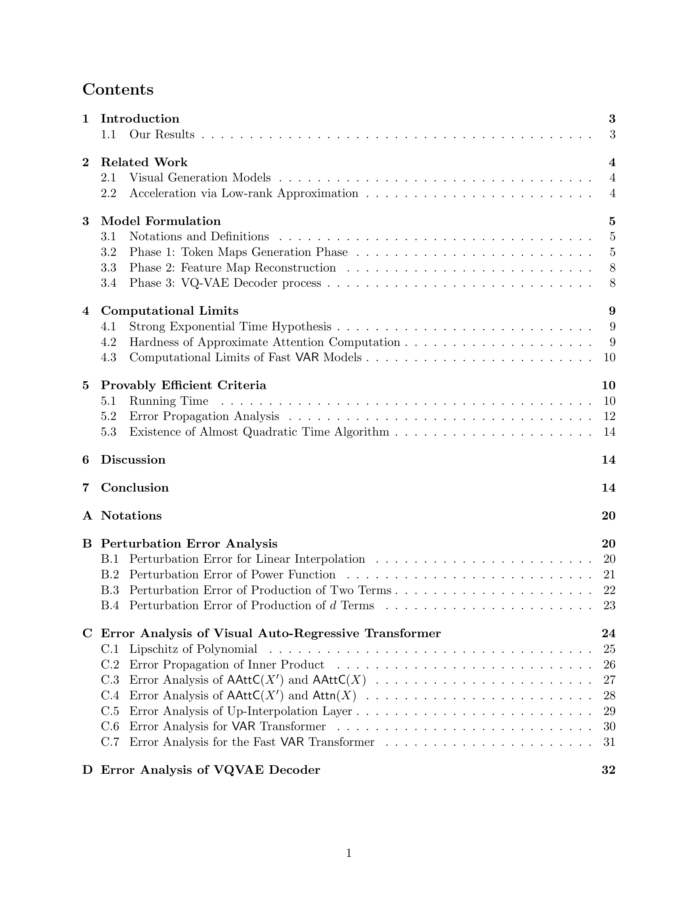

 


 2501.04377 
 Yekun Ke et el. 
 
 🤗 2025-01-10 
 



↗ arXiv


↗ Hugging Face


↗ Papers with Code


### TL;DR



최근 시각적 자기회귀 모델(VAR)이 이미지 생성 분야에서 획기적인 발전을 이끌었지만, 기존 알고리즘의 계산 복잡도가 높아 효율성이 떨어지는 문제가 있습니다.  본 연구는 이러한 문제를 해결하기 위해 VAR 모델의 계산적 한계와 효율적인 기준을 정밀 분석하고자 합니다. 특히, **Strong Exponential Time Hypothesis(SETH)**라는 이론적 가정을 바탕으로 분석을 진행하여, 이론적 근거를 확보합니다.

본 연구는 **SETH 가정 하에 VAR 모델의 계산적 한계를 규명**하고, **입력 행렬의 크기에 따른 임계값**을 제시합니다.  또한, 이 임계값 **미만일 경우 거의 2차 시간 알고리즘을 통해 VAR 모델의 출력을 근사적으로 계산**하는 효율적인 방법론을 개발했습니다. 이를 통해 **VAR 모델의 계산 효율성을 높이고 확장성을 개선**하는 데 크게 기여할 것으로 기대됩니다. 더 나아가 본 연구는 **다양한 딥러닝 모델의 계산 효율성 연구**에 대한 일반적인 통찰력을 제공합니다.



#### Key Takeaways


 시각적 자기회귀 모델(VAR)의 계산 복잡도에 대한 심층 분석을 통해, 입력 행렬의 크기에 따른 계산 한계를 규명했습니다. 



 SETH 가정 하에, 입력 행렬의 놈이 특정 임계값을 넘으면 VAR 모델에 대한 진정한 의미의 준 4차 시간 알고리즘은 불가능함을 증명했습니다. 



 입력 행렬의 놈이 특정 임계값 미만일 때, 거의 2차 시간 알고리즘을 통해 VAR 모델을 근사적으로 계산하는 효율적인 방법을 제시했습니다. 


#### Why does it matter?
본 논문은 **시각적 자기회귀 모델(VAR)의 계산 효율성에 대한 심층적인 분석**을 제공하여, 이 분야의 연구자들에게 **중요한 이론적 토대**를 마련합니다. **SETH 가정 하에 VAR 모델의 계산 한계를 밝히고, 거의 2차 시간 알고리즘을 제시**함으로써, 시각적 이미지 생성 분야의 발전에 크게 기여할 뿐 아니라, 향후 **더욱 효율적이고 확장성 있는 모델 개발**을 위한 새로운 연구 방향을 제시합니다.  더 나아가, 본 연구는 **다양한 딥러닝 모델의 계산 효율성 연구**에 대한 일반적인 통찰력을 제공하며, 다른 유사한 모델에도 적용 가능한 범용적인 방법론을 제시합니다.

------
#### Visual Insights

### Full paper



