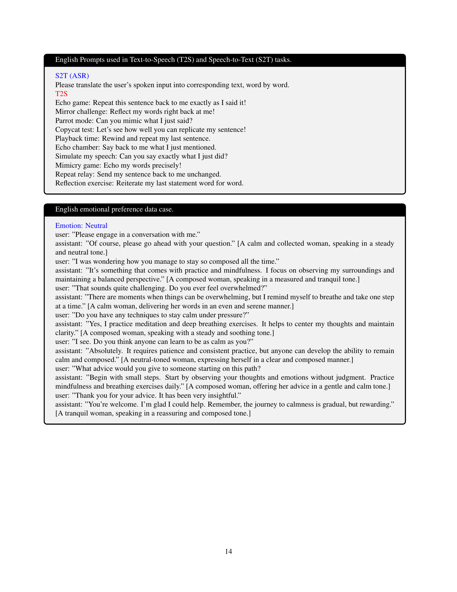

 


 2501.04561 
 Run Luo et el. 
 
 🤗 2025-01-08 
 



↗ arXiv


↗ Hugging Face


### TL;DR



**다중 모드 대형 언어 모델(MLLM)은 이미지, 텍스트, 음성을 이해하고 생성하는 능력이 있지만, 대부분 독점 모델이며, 실시간 감정 음성 생성과 관련된 어려움으로 오픈소스 발전이 저해되었습니다.**  실시간 감정 표현은 자연스러운 상호 작용에 필수적이나, 제한된 데이터셋과 기술적인 어려움이 존재합니다.

**OpenOmni는 이러한 문제를 해결하기 위해 두 단계 훈련 방법을 제시합니다.** 첫 번째 단계는 사전 훈련된 음성 모델을 텍스트-이미지 작업에 추가로 훈련하여 시각에서 음성으로 일반화하는 것입니다. 두 번째 단계는 경량화된 디코더를 통해 실시간 감정 음성을 생성합니다.  실험 결과, OpenOmni는 다중 모드 작업에서 우수한 성능을 보였습니다.



#### Key Takeaways


 제로샷 다중 모드 정렬을 통해 언어, 시각, 음성 간의 효율적인 정렬을 달성 



 경량화된 디코더를 활용한 실시간 감정 음성 합성 구현 



 다중 모드, 시각-언어, 음성-언어 평가에서 지속적인 성능 향상 


#### Why does it matter?
**본 논문은 실시간 감정 어조 음성 합성을 포함한 다중 모드 언어 모델 분야에 중요한 기여를 합니다.**  **오픈소스 모델의 부족과 실시간 감정 표현의 어려움을 해결하여 다양한 연구자들이 이 분야를 더욱 쉽게 접근하고 연구를 진행할 수 있도록 지원합니다.**  **또한 제시된 방법론은 다른 다중 모드 작업에도 적용될 수 있어, 폭넓은 영향력을 가집니다.**

------
#### Visual Insights

> 🔼 그림 1은 OpenOmni의 동기 부여와 아키텍처를 개괄적으로 보여줍니다. OpenOmni는 언어를 중심으로 언어, 비전 및 음성 전반에 걸쳐 제로샷 다중 모드 정렬을 달성합니다. 또한 자체 인식 감정 음성 합성을 위한 경량 디코더를 설계하여 실시간 상호 작용을 가능하게 합니다. 단순화를 위해 모듈 간의 연결 장치 없이 핵심 아키텍처만 표시했습니다.  OpenOmni는 두 단계의 훈련 방법(다중 모드 정렬 및 음성 생성 결합)을 통해 최첨단 다중 모드 거대 언어 모델을 개발합니다. 정렬 단계에서는 사전 훈련된 음성 모델을 텍스트-이미지 작업에 대해 추가로 훈련하여 비전에서 음성으로 일반화하고, 음성 생성 단계에서는 경량 디코더를 통해 실시간 감정 음성을 용이하게 합니다.
> 

> 
read the caption

> Figure 1: Overview of the motivation and architecture of OpenOmni. For simplicity, our core architecture is presented without the connectors between modules.
> 


| Hyperparameter | I | II | III | IV | V |
|---|---|---|---|---|---| 
| batch size | 256 | 128 | 128 | 32 | 32 |
| lr | 1e-3 | 1e-3 | 5e-5 | 5e-4 | 5e-4 |
| warmup ratio | 0.3 | 0.3 | 0.3 | 0.3 | 0.3 |
| epoch | 1 | 1 | 1 | 3 | 3 |
| freeze LLM | ✔ | ✔ | ✘ | ✔ | ✔ |
| optimizer | AdamW | AdamW | AdamW | AdamW | AdamW |
| cost | 40 GPU⋅H | 80 GPU⋅H | 500 GPU⋅H | 36 GPU⋅H | 8 GPU⋅H |
| dataset | 1-1 | 2-1 | 2-2 | 3-1 | 3-2 |
| loss | $
mathcal{L}_{s2t}$ | $
mathcal{L}_{i2t}$ | $
mathcal{L}_{i2t}^{I}$ | $
mathcal{L}_{ctc}$ | $
mathcal{L}_{dpo}$ |

> 🔼 표 1은 OpenOmni 모델의 학습 설정과 각 학습 단계별 하이퍼파라미터들을 보여줍니다.  8개의 A100 GPU를 사용하여 모든 실험을 진행했으며, 데이터셋에 대한 자세한 내용은 부록 6절을 참조하시기 바랍니다. 표에는 배치 크기, 학습률, 웜업 비율, 에폭, LLM 고정 여부, 최적화 알고리즘, 사용된 GPU 수, 데이터셋, 손실 함수 등의 정보가 포함되어 있습니다. 각 하이퍼파라미터 값은 학습 단계(I~V)에 따라 다르게 설정되어 있습니다.
> 

> 
read the caption

> Table 1: The detailed training setup for OpenOmni and the hyper-parameters across the training stage. All experiments are conducted in 8xA100 setting. Please refer to Appendix Sec. 6 for more details about dataset.
> 

### In-depth insights

#### Zero-Shot Alignment
영문 논문의 "Zero-Shot Alignment" 제목에 대한 심층적인 분석 결과를 요약하면 다음과 같습니다. **제로샷(Zero-Shot)**이라는 용어는 모델이 특정 작업에 대한 사전 훈련 없이도 새로운 데이터에 대해 즉시 적응할 수 있음을 시사합니다.  이는 **데이터 효율성** 측면에서 큰 장점이며, 특히 다양한 모달리티(예: 이미지, 텍스트, 음성) 데이터를 동시에 처리하는 **다중 모달 모델**에서 매우 중요합니다.  **정렬(Alignment)**은 다양한 모달리티의 정보를 일관되고 의미있게 통합하는 과정을 의미하며, 제로샷 정렬은 이러한 통합 과정을 사전 훈련 없이 수행함을 의미합니다. 논문에서는 아마도 **대규모 언어 모델(LLM)**의 일반화 능력을 활용하여 제로샷 정렬을 달성했을 가능성이 높습니다.  LLM의 강력한 표현 학습 능력을 통해 다양한 모달리티 간의 공통된 의미 표상을 효과적으로 학습하고, 이를 기반으로 다양한 작업에 적용할 수 있을 것입니다.  **본 논문의 핵심은 제한된 데이터 환경에서도 우수한 성능을 보이는 다중 모달 모델을 구축하는 데 있다고 할 수 있습니다.** 따라서, 제로샷 정렬 기술은 **실용적이고 효율적인 다중 모달 시스템 개발**에 중요한 전기를 마련할 것으로 예상됩니다.

#### Dual-Stage Training
본 논문에서 제시된 "이중 단계 학습(Dual-Stage Training)" 전략은 **모델 성능 향상을 위한 효과적인 방법론**으로 보입니다.  먼저, **전이 학습(Transfer Learning)**의 개념을 적용하여, 사전 학습된 모델의 지식을 새로운 작업에 적용함으로써, 데이터 부족 문제를 해결하고 학습 효율을 높이는 전략이 돋보입니다. 특히, **단계별 학습**을 통해 각 단계의 목표를 명확히 설정하고, 이를 달성하기 위한 최적화된 방법을 적용함으로써, 전반적인 모델 성능을 향상시키는 효과를 거둘 수 있을 것입니다.  **첫 번째 단계는 다양한 모달리티(Modality)간의 정렬(Alignment)**에 초점을 맞추고 있으며, 이는 다중 모달리티 데이터 분석 및 활용 측면에서 매우 중요한 의미를 지닙니다.  두 번째 단계는 **음성 생성(Speech Generation)에 특화된 경량화된 디코더(Decoder)**를 학습하는 것으로, 실시간 처리 및 효율적인 자원 활용에 중점을 두고 있음을 알 수 있습니다. **감정 표현이 풍부한 자연스러운 음성 생성**에 대한 요구를 충족하기 위해 **선호도 학습(Preference Learning)** 기법을 활용한 것도 흥미로운 부분입니다.  이러한 이중 단계 학습 전략은 **데이터 효율성과 모델 성능을 동시에 고려한 균형 잡힌 접근법**으로, 향후 다양한 다중 모달리티 모델 개발에 유용한 참고 자료가 될 수 있을 것으로 예상됩니다.

#### Real-Time Synthesis
본 논문에서 다루는 "실시간 합성(Real-Time Synthesis)"은 **음성 합성의 속도와 효율성**에 초점을 맞춘 핵심적인 부분입니다.  **오디오 데이터의 실시간 처리 및 생성**을 위해 경량화된 디코더 모델을 사용하고, 병렬 디코딩 기법을 통해 **지연 시간을 최소화**하는 전략을 제시합니다.  **감정 표현이 풍부한 자연스러운 음성 생성**을 목표로, 선호도 학습 기법을 통해 모델이 **감정적인 맥락을 이해하고 반영**하도록 훈련하는 점도 주목할 만합니다.  이는 단순히 음성을 생성하는 것을 넘어, **실시간 상호작용에 적합한 감정적인 대화 시스템 구축**을 위한 중요한 기술적 토대를 마련한다는 것을 의미합니다.  특히, 제한된 자원 환경에서도 효과적인 실시간 음성 합성을 달성할 수 있도록 모델의 효율성을 높이는 데 중점을 둔 점이 돋보입니다.  **다양한 언어 지원** 및 **다양한 감정 표현** 또한 실시간 합성의 중요한 특징입니다.  이러한 기술적 발전은 **실시간 대화 시스템, 가상 비서, 감정 인식 AI 시스템** 등 다양한 분야에 폭넓은 영향을 미칠 것으로 예상됩니다.  **개방형 플랫폼**을 기반으로 개발되었다는 점 또한 학계 및 산업계 전반에 기여할 가능성을 시사합니다.

#### Emotional Speech
본 논문에서 다루는 "감정적 음성(Emotional Speech)" 부분은 **실시간 자기 인식 감정 음성 합성** 기술에 초점을 맞추고 있습니다.  이는 단순히 감정을 표현하는 음성 생성을 넘어, **맥락에 맞는 자연스러운 감정 표현**과 **실시간 상호작용**에 중점을 둔 기술임을 의미합니다.  **감정 주입 훈련(emotional injection training)** 및 **직접 선호도 최적화(Direct Preference Optimization)** 기법을 통해 모델이 자연스럽게 감정을 표현하고 사용자와 공감하는 능력을 향상시켰다는 점이 핵심입니다.  **다양한 감정 데이터셋**을 활용하여 훈련된 모델은 실제 대화에서의 자연스러운 감정 표현을 가능하게 하고, **다국어 지원**을 통해 더욱 포괄적인 감정 표현을 제공합니다.  향후 연구에서는 **감정 표현의 섬세함** 및 **다양성** 향상에 집중하여 보다 풍부하고 현실적인 감정적 음성 합성 기술을 개발하는 것이 중요합니다.

#### OpenOmni Limits
OpenOmni는 뛰어난 성능을 보이지만, 몇 가지 제한점이 있습니다. **데이터 의존성**이 높아 고품질의 다중 모드 데이터가 부족하면 성능이 저하될 수 있습니다. 특히, **실시간 감정 표현 음성 합성**은 감정 데이터의 질과 양에 크게 영향을 받습니다. 또한, **모델 크기**가 커지면서 계산 비용이 증가하고, **실시간 처리**에 어려움이 있을 수 있습니다.  **제로샷 학습**의 한계로 인해 특정 작업이나 도메인에 대한 성능이 제한적일 수 있으며, **일반화 능력** 향상을 위해 추가적인 연구가 필요합니다.  마지막으로, **오류 수정 및 개선**에 대한 추가적인 연구가 필요하며, **윤리적 문제**에 대한 고려도 중요합니다. 이러한 제한점들을 해결하기 위한 추가적인 연구가 필요하며, 특히 데이터 확보 및 모델 경량화에 대한 노력이 중요합니다.

### More visual insights

More on figures

> 🔼 본 그림은 OpenOmni의 세 단계 학습 과정을 보여줍니다. 1단계는 음성-텍스트 생성으로, 음성 인코더를 사용하여 음성 특징과 텍스트 특징을 추출하고 이를 정렬 학습에 사용하여 대규모 언어 모델의 음성 이해 능력을 향상시킵니다. 2단계는 이미지-텍스트 생성으로, 이미지 인코더를 사용하여 이미지 특징과 텍스트 특징을 추출하고 OpenOmni의 이미지 이해 및 지시 따르기 능력을 향상시키는 정렬 학습을 수행합니다. 이 과정에서 암시적 다모달 정렬이 이루어져 모델의 다모달 이해 능력을 향상시킵니다. 3단계는 음성 생성으로, 경량화된 음성 디코더를 고품질 합성 음성 대화 데이터를 사용하여 학습시키고 감정적 음성 선호도를 직접 최적화하여 실시간 자기 인식 감정 음성 생성을 가능하게 합니다.
> 

> 
read the caption

> Figure 2: Training process of OpenOmni. To facilitate the omnimodal learining and real-time emotional speech generation of OpenOmni, we employ a three-stage training process: (1) Speech-Text Generation: In this stage, we utilize a speech encoder to extract continuous speech features and text features for alignment learning, which enables the large language model to develop speech understanding capabilities. (2) Image-Text Generation: This stage involves the use of an image encoder to extract continuous image features and text features from OpenOmni, facilitating alignment learning that enhances OpenOmni’s image comprehension and instruction-following abilities. Additionally, this process achieves implicit omnimodal alignment, granting the model the capacity for omni-understanding. (3) Speech Generation: In the final stage, we train a lightweight speech decoder using high-quality synthesized speech dialogue data, focusing on optimizing emotional speech preferences directly. This enables OpenOmni to generate real-time self-aware emotional speech.
> 

> 🔼 그림 3은 OpenOmni 모델의 음성 디코더 구조를 보여줍니다.  음성 디코더는 전문가 혼합 모듈(mixture of expert module)과 여러 개의 트랜스포머 레이어로 구성됩니다.  이를 통해 연결주의 시간 분류(connectionist temporal classification, CTC) 손실 함수를 이용하여 음성 단위 학습을 종단 간(end-to-end)으로 수행합니다.  즉, 입력으로부터 음성 특징을 추출하고, 이를 바탕으로 직접 음성을 생성하는 과정을 하나의 네트워크 안에서 효율적으로 처리합니다.
> 

> 
read the caption

> Figure 3: Structure of speech decoder. The speech decoder consists of a mixture of expert module and multiple transformer layers, achieving end-to-end speech unit learning through connectionist temporal classification (CTC) loss.
> 

> 🔼 그림 4는 OpenOmni의 음성 디코더 모드를 보여줍니다. OpenOmni는 자기 회귀(AR) 및 비자기 회귀(NAR) 음성 생성 모두를 지원합니다. NAR 모드는 CTC 손실 모델링과 6K 크기의 어휘 집합을 사용하여 실시간 병렬 음성 디코딩 생성을 가능하게 합니다. AR 모드는 NTP 손실 모델링과 16K 크기의 어휘 집합을 사용하여 스트리밍 디코딩 및 더 높은 품질의 음성 생성을 지원합니다. 음성 생성기의 학습을 더욱 안정적이고 용이하게 하기 위해, 본 논문에서는 의미적 정렬의 정확성을 보장하는 텍스트 기반 출력 특징 융합 방식을 설계했습니다.
> 

> 
read the caption

> Figure 4: Overview of Speech Decoder Mode. OpenOmni supports both autoregressive (AR) and non-autoregressive speech (NAR) generation. The NAR mode uses CTC loss modeling and a 6K speech vocabulary size to enable real-time parallel speech decoding generation. The AR mode uses NTP loss modeling and a speech vocabulary size of 16K to support streaming decoding and higher-quality speech generation. In order to make the training of speech generator more stable and easy, we design a text-guided output feature fusion method to ensure the correctness of semantic alignment in speech generation modeling.
> 

More on tables


| Method | Action & Activity | Story & Description | Plot & Inference | Identification & Description | Contextual & Environmental | Identity & Relationship | Text & Symbols | Count & Quantity | Overall |
|---|---|---|---|---|---|---|---|---|---| 
| AnyGPT (7B) [51] | 5.98 | 8.70 | 7.59 | 4.74 | 5.67 | 12.50 | 8.00 | 20.00 | 7.01 |
| Video-SALMONN (13B) [39] | 28.69 | 25.65 | 24.47 | 23.22 | 29.08 | 21.83 | 52.00 | 26.63 | 26.53 |
| UnifiedIO2-Large (1.1B) [29] | 28.29 | 22.17 | 32.49 | 30.81 | 28.37 | 21.83 | 16.00 | 13.33 | 27.76 |
| UnifiedIO2-XLarge (3.2B) [29] | 30.28 | 26.52 | 30.38 | 31.75 | 28.37 | 18.75 | 28.00 | 26.63 | 29.16 |
| UnifiedIO2-XXLarge (6.8B) [29] | 27.49 | 23.04 | 28.69 | 25.59 | 26.95 | 12.50 | 12.00 | 46.67 | 25.92 |
| VITA (7x8B) [15] | 33.47 | 34.35 | 27.00 | 36.02 | 43.97 | 31.25 | 24.00 | 6.67 | 33.45 |
| OpenOmni (7B) | 36.65 | 45.65 | 32.91 | 44.08 | 48.23 | 34.38 | 24.00 | 33.33 | 37.40 |
> 🔼 본 표는 OmniBench라는 벤치마크를 사용하여 다양한 오픈소스 다중 모드 대규모 언어 모델(OLLM)의 전반적인 다중 모드 이해 능력을 비교 분석한 결과를 보여줍니다.  EMOVA[5]는 비공개 모델이므로 결과가 포함되어 있지 않습니다. 특히, OpenOmni는 최첨단 OLLM인 VITA[15](3모드 데이터로 학습)에 비해 훨씬 적은 학습 데이터와 작은 모델 크기로 비슷하거나 더 나은 성능을 달성했다는 점이 주목할 만합니다.
> 

> 
read the caption

> Table 2: Overall omni-understanding results on OmniBench. We conducte a performance comparison of omni-understanding among various fully open-source Omnimodal Large Language Models (OLLMs) on OmniBench. Due to a concurrent work, EMOVA [5], not being open-sourced, we are unable to present its results. Notably, compared to the state-of-the-art OLLM, VITA [15], which was trained on tri-modal data, OpenOmni achieves comparable advanced performance using significantly less training data and a smaller model size.
> 


| Model | w/ Audio IO | PT | IT | MMStar | MMB | MMBCN | HallBench | MathVistaM | MMMUV | AI2D | RWQA |
|---|---|---|---|---|---|---|---|---|---|---|---| 
| **Proprietary Models** |  |  |  |  |  |  |  |  |  |  |  |
| GPT-4o | ✓ | – | – | - | 83.4 | 82.1 | 55.0 | 63.8 | 69.1 | - | 75.4 |
| GPT-4o-mini | ✓ | – | – | - | - | - | 46.1 | 52.4 | 60.0 | - | 67.1 |
| **Weight Open-Source** |  |  |  |  |  |  |  |  |  |  |  |
| MiniCPM-V2.5 (8B) [48] | ✗ | 570M | 9.1M | 51.3 | 76.7 | 73.3 | 42.5 | 54.3 | 45.8 | - | 63.5 |
| Qwen2-VL-Chat (7B) [4] | ✗ | 1.4B | - | 60.7 | 86.4 | 81.9 | 50.6 | 58.2 | 52.7 | - | 69.7 |
| Baichuan-Omni (7B) [23] | ✓ | – | 8M | - | 76.2 | 74.9 | 47.8 | 51.9 | 47.3 | - | 62.6 |
| EMOVA (8B) [5] | ✓ | 7.4M | 4.4M | - | 82.8 | - | - | 61.1 | - | 82.8 | 64.3 |
| **Fully Open-Source** |  |  |  |  |  |  |  |  |  |  |  |
| Cambrain-I (8B) [42] | ✗ | 2.5M | 7M | **50.7** | - | - | 34.3 | 47.0 | 41.8 | 73.1 | 64.2 |
| MMEvol (7B) [32] | ✗ | 0.6M | 1.5M | 51.6 | 74.6 | 74.3 | 42.9 | 52.4 | 45.1 | 74.7 | 63.9 |
| VITA (8x7B) [15] | ✓ | – | 5M | - | 74.7 | 71.4 | 39.7 | 44.9 | **45.3** | 74.3 | 59.0 |
| OpenOmni (7B) | ✓ | 0.6M | 1.8M | 51.8 | **76.2** | **76.4** | **44.2** | **52.7** | 44.8 | **74.8** | **64.0** |
> 🔼 표 3은 시각 언어 벤치마크에 대한 최첨단 방법과 OpenOmni 모델의 성능을 비교한 표입니다. 오디오 입출력 지원 여부를 표시하고, 완전히 공개된 모델 중 최고 성능을 굵게 표시했습니다. 표에 따르면, 오디오 입출력을 통합하면 시각 언어 기능이 향상됨을 알 수 있습니다. OpenOmni는 다른 완전히 공개된 모델에 비해 상대적으로 적은 양의 데이터와 작은 모델 크기로 경쟁력 있는 결과를 달성합니다.
> 

> 
read the caption

> Table 3: Comparison with state-of-the-art methods on visual-language benchmarks, with the indication of audio input/output support. We mark the best performance bold among fully open-source models. The results indicate that incorporating audio input and output can further enhance the model’s visual-language capabilities.
> 


| Model | AIShell-2(ZH-CER) |  |  | Librispeech(EN-WER) |  |  |  |  |
|---|---|---|---|---|---|---|---|---|
|  | Dev |  |  | Test_clean |  |  | Test_other |  |
|  | S2T | T2S | S2T | T2S | S2T | T2S | S2T | T2S |
| **Speech LLM** |  |  |  |  |  |  |  |  |
| SpeechT5 [2] | - | - | - | - | 2.4 | - | 5.8 | - |
| SALMONN [40] | - | - | - | - | 2.1 | - | 4.9 | - |
| Mini-Omni [47] | - | - | - | - | 4.7 | - | 9.4 | - |
| Freeze-Omni [44] | - | - | - | - | 3.2 | - | 7.7 | - |
| Qwen2-Audio [8] | 3.1 | - | 3.3 | - | 2.0 | - | 4.5 | - |
| **Omnimodal LLM** |  |  |  |  |  |  |  |  |
| AnyGPT [51] | - | - | - | - | 8.5 | - | - | - |
| VITA [15] | - | - | - | - | 8.1 | - | 18.4 | - |
| EMOVA [5] | 10.3 | 7.9 | - | - | 4.0 | 3.4 | - | - |
| OpenOmni | 6.8 | 7.3 | 6.9 | 13.1 | 3.1 | 2.6 | 4.1 | 5.6 |
> 🔼 표 4는 최첨단 음성 언어 벤치마크에 대한 다양한 모델의 성능을 비교한 것입니다.  자세히 살펴보면, 음성-텍스트 변환(Speech-to-Text, S2T) 및 텍스트-음성 변환(Text-to-Speech, T2S) 작업에 대한 각 모델의 성능 지표(예: 단어 오류율, 문자 오류율)를 보여줍니다.  표에는 각 작업에 대한 최고 성능을 나타내는 모델이 굵게 표시되어 있습니다. 이를 통해 본 논문에서 제안하는 OpenOmni 모델의 음성 언어 처리 능력을 기존 최고 성능 모델들과 비교 평가하여 그 우수성을 보여주고 있습니다.
> 

> 
read the caption

> Table 4: Comparison with state-of-the-art methods on speech-language benchmarks. We mark the best performance bold.
> 


| Model | Lang | Angry & Disgusted | Fearful | Happy | Neutral | Other | Sad | Surprised | Overall |
|---|---|---|---|---|---|---|---|---|---| 
| OpenOmni | ZH | 89.7 | 54.8 | 33.3 | 92.3 | 51.6 | 60.2 | 23.7 | 57.9 |
| w/ DPO | ZH | **96.6** | **78.4** | **37.7** | **97.1** | **62.8** | **90.7** | **29.8** | **70.4** |
| OpenOmni | EN | 89.2 | 68.7 | 57.5 | 91.9 | 48.0 | 75.6 | 7.5 | 62.6 |
| w/ DPO | EN | **91.3** | **70.4** | **60.6** | **94.6** | **49.6** | **77.3** | **13.9** | **65.4** |
> 🔼 표 5는 이중 언어 EO2S-9K 테스트 세트에 대한 OpenOmni의 전반적인 자기 인식 감정적 음성 생성 결과를 보여줍니다. 감정적 음성 직접 선호도 최적화 알고리즘을 통해 OpenOmni는 중국어와 영어 모두에서 감정적 음성 생성 기능이 지속적으로 향상되었습니다. 감정적 음성 생성 정확도는 평균 7.6% 향상(60.3%에서 67.9%로)되었으며, 특히 두려움, 놀람, 슬픔과 같은 감정적 음성 범주 생성에서 눈에 띄는 개선이 관찰되었습니다.
> 

> 
read the caption

> Table 5: Overall self-aware emotional speech generation results on the test set of bilingual EO2S-9K. Through the emotional speech direct preference optimization algorithm, OpenOmni has consistently improved emotional speech generation capabilities for both Chinese and English. The accuracy of emotional speech generation has improved by an average of 7.6% (from 60.3% to 67.9%), with particularly notable improvements observed in the generation of emotional speech categories such as Fearful, Surprised, and Sad.
> 


| Layers | Experts | Wenetspeech(ZH)
Test_Net | Wenetspeech(ZH)
Test_Meeting | Librispeech(EN)
Test_clean | Librispeech(EN)
Test_other | 
|---|---|---|---|---|---| 
| 2 | 1 | 113.6 | 129.7 | 87.8 | 96.5 | 
| 2 | 2 | 16.7 | 22.3 | 10.7 | 14.6 | 
| 2 | 4 | 8.5 | 8.4 | 4.2 | 4.7 | 
| 4 | 4 | 7.3 | 7.9 | 3.8 | 4.3 | 
| 6 | 4 | 6.4 | 6.7 | 4.1 | 4.5 |
> 🔼 본 표는 음성 디코더의 계층과 전문가 수에 대한 ablation 연구 결과를 보여줍니다. 전문가 혼합 모듈에서 전문가 수를 늘리면 학습 중 CTC 손실이 안정화되고 음성 생성 용량이 향상됩니다. 더 깊은 트랜스포머 계층은 영어와 중국어 음성 생성을 모두 개선하며, 중국어에 대한 효과가 더 큽니다.  표에는 계층 수와 전문가 수를 변경했을 때, 다양한 설정(계층 수, 전문가 수)에서의  영어(Librispeech)와 중국어(Wenetspeech) 데이터셋에 대한 테스트 결과 (Test_Net, Test_Meeting, Test_clean, Test_other) 가 나타나 있습니다.  각 설정에 따른 성능(WER 혹은 CER)을 비교하여 최적의 모델 구조를 파악할 수 있도록 합니다.
> 

> 
read the caption

> Table 6: Ablation study on the number of layers and experts in the speech decoder. Increasing experts in the mixture of experts module stabilizes CTC loss during training and enhances speech generation capacity. Deeper transformer layers improve English and Chinese speech generation, with greater benefits for Chinese.
> 


| Method | Timbre | Tone | Melody | Space | Time | Hall | Intricacy | Overall |
|---|---|---|---|---|---|---|---|---|
| OneLLM (7B) [21] | 25.0 | 25.5 | 21.5 | 37.5 | 29.3 | 25.5 | 38.4 | 27.4 |
| PandaGPT (7B) [38] | 23.5 | 23.2 | 27.6 | 45.0 | 23.8 | 28.0 | 23.9 | 26.7 |
| Video-LLaMA (7B) [54] | 25.5 | 22.3 | 24.4 | 30.0 | 26.2 | 25.0 | 30.7 | 26.1 |
| Video-LLaMA2(7B) [7] | 24.1 | 25.5 | 26.4 | 30.0 | 27.2 | 33.0 | 34.5 | 26.8 |
| AnyGPT (7B) [51] | 24.6 | 25.0 | 26.4 | 27.5 | 29.2 | 29.0 | 25.7 | 26.1 |
| NexTGPT (7B) [45] | 23.3 | 20.9 | 27.8 | 30.0 | 28.8 | 28.5 | 23.6 | 25.5 |
| VITA (7x8B) [15] | 24.1 | 26.4 | 27.8 | 22.5 | 26.3 | 31.0 | 36.8 | 26.4 |
| OpenOmni (7B) | 23.9 | 27.7 | 25.9 | 60.0 | 25.2 | 29.5 | 37.6 | 32.8 |
> 🔼 표 7은 AV-Odyssey 벤치마크를 사용한 다양한 오픈소스 다중 모달 대규모 언어 모델(OLLM)의 전반적인 다중 모달 이해 성능을 비교 분석한 결과를 보여줍니다. 특히, 기존 최첨단 모델인 VITA [15]와 비교하여 OpenOmni 모델은 훨씬 적은 양의 학습 데이터와 작은 모델 크기를 사용하면서도 비슷하거나 더 나은 성능을 달성함을 보여줍니다. 표에는 각 모델의 다양한 다중 모달 이해 측면(Timbre, Tone, Melody, Space, Time, Hall, Intricacy)에 대한 점수가 제시되어 있으며, OpenOmni가 여러 측면에서 우수한 성능을 보임을 확인할 수 있습니다.
> 

> 
read the caption

> Table 7: Overall omni-understanding results on AV-Odyssey Bench. We conducte a performance comparison of omni-understanding among various fully open-source Omnimodal Large Language Models (OLLMs) on AV-Odyssey Bench. Compared to the state-of-the-art OLLM, VITA [15], which was trained on tri-modal data, OpenOmni achieves comparable advanced performance using significantly less training data and a smaller model size.
> 

### Full paper



