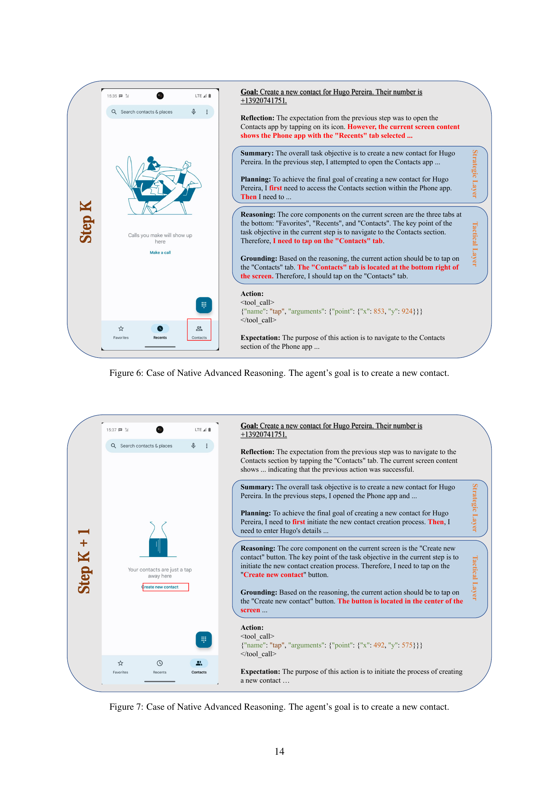

 


 2501.04575 
 Yuhang Liu et el. 
 
 🤗 2025-01-09 
 



↗ arXiv


↗ Hugging Face


↗ Papers with Code


### TL;DR



기존의 GUI 에이전트는 **단계적 추론 능력 부족**과 **텍스트 주석에 대한 과도한 의존**으로 인해 효율성이 떨어지는 문제가 있었습니다. 특히, 시각적 정보를 텍스트로 변환하는 과정에서 정보 손실이 발생하고, 플랫폼 간의 일관성 부족으로 실제 적용이 어려웠습니다.

본 논문에서는 이러한 문제를 해결하기 위해 **두 단계의 지도 학습 파이프라인**을 사용하여 InfiGUIAgent를 개발했습니다. 1단계에서는 GUI 이해 및 기본 기능을 강화하고, 2단계에서는 합성 데이터를 활용하여 계층적 추론 및 기대-반추 추론 기능을 통합했습니다. 그 결과, InfiGUIAgent는 다양한 GUI 벤치마크에서 우수한 성능을 보였으며, **GUI 자동화 분야의 발전에 크게 기여**할 것으로 기대됩니다.



#### Key Takeaways


 계층적 추론 및 기대-반추 추론 기능을 통합한 GUI 에이전트 InfiGUIAgent 제시 



 이중 단계 지도 학습 파이프라인을 통해 기본 기능 향상 및 고급 추론 기능 학습 



 다양한 GUI 벤치마크에서 경쟁력 있는 성능을 달성, 고급 추론 기술의 중요성을 강조 


#### Why does it matter?
본 논문은 **GUI 자동화를 위한 멀티모달 대규모 언어 모델 기반 에이전트의 새로운 가능성**을 제시합니다. 기존의 단순한 추론 능력을 넘어, 계층적 추론 및 기대-반추 추론을 통해 복잡한 작업을 수행할 수 있는 에이전트를 제시함으로써, **GUI 자동화 분야의 발전에 크게 기여**할 수 있습니다. 또한, 본 논문에서 제시된 이중 단계의 지도 학습 파이프라인은 향후 연구 방향에 대한 새로운 아이디어를 제공하며, **다양한 GUI 환경에서의 에이전트 성능 향상 및 실제 적용 가능성**을 높이는 데 기여할 수 있습니다.

------
#### Visual Insights

> 🔼 그림 1은 InfiGUIAgent의 두 단계 학습 과정을 보여줍니다. 1단계에서는 다양한 데이터셋을 사용하여 GUI 이해(요소 인식 및 레이아웃 이해), 질문 응답, 명령어 기반 학습, 일반 지식 및 도구 사용과 같은 기본적인 능력을 키웁니다. 2단계에서는 반복적인 과정을 통해 고급 추론 능력을 도입합니다. 각 단계는 반성, 계층적 추론(전략적 및 전술적 계층), 행동 및 기대의 네 가지 요소로 구성됩니다. 각 단계는 전체 작업, 이전 스크린샷 및 추론 기록, 그리고 현재 환경 정보를 입력으로 받습니다. 반성 단계에서는 이전 행동의 결과를 기대와 비교하고, 기대 단계에서는 현재 행동의 결과를 예측하여 다음 반성 단계에 사용합니다.
> 

> 
read the caption

> Figure 1:  InfiGUIAgent is trained in two stages. Stage 1 cultivates fundamental abilities using diverse datasets covering GUI understanding (element recognition and layout comprehension), question answering, instruction grounding, general knowledge, and tool usage. Stage 2 introduces native advanced reasoning, employed during both training and inference. This stage follows a cyclical process at each step, consisting of Reflection, Hierarchical Reasoning (strategic and tactical layers), Action, and Expectation. Each step receives the overall task, the history of previous screenshots and reasoning, and the current environment as input. Reflection assesses the previous action’s outcome against its expectation, while Expectation predicts the outcome of the current action for subsequent reflection.
> 


|  | **InfiGUIAgent: A Multimodal Generalist GUI Agent** | 
|  | **with Native Reasoning and Reflection** |

> 🔼 이 표는 논문의 첫 번째 단계 지도 학습 미세 조정에 사용된 데이터셋들을 보여줍니다. 각 데이터셋의 플랫폼(웹페이지, 모바일 등), 카테고리(GUI 이해, 그라운딩, 질의응답 등), 그리고 샘플 수를 포함합니다.  GUI 에이전트의 기본 기능 향상을 위해 다양한 유형의 데이터가 사용되었음을 보여줍니다.
> 

> 
read the caption

> Table 1: Training datasets used in stage 1 of supervised fine-tuning.
> 

### In-depth insights

#### GUI Agent Evolution
GUI 에이전트는 사용자 인터페이스와 상호 작용하여 작업을 자동화하는 강력한 도구로 떠올랐습니다. 초기에는 단순한 명령어를 처리하는 수준이었지만, **다중 모드 대규모 언어 모델(MLLM)**의 발전과 함께 급속도로 진화하고 있습니다.  MLLM은 시각적 정보를 이해하고 추론하는 능력을 갖춰, GUI 에이전트가 복잡한 작업을 수행할 수 있도록 지원합니다.  하지만 여전히 **다단계 추론**과 **텍스트 주석에 대한 의존도**가 한계로 남아있습니다.  최근 연구는 이러한 문제를 해결하기 위해 **계층적 추론** 및 **기대-반성 추론**과 같은 고급 추론 능력을 통합하는 방향으로 나아가고 있습니다. **합성 데이터**를 활용하여 에이전트의 자체 추론 능력을 향상시키는 연구도 주목할 만합니다. 이러한 발전을 통해 GUI 에이전트는 사용자 생산성 향상 및 자동화 가능 작업 범위 확장에 크게 기여할 것으로 기대됩니다.

#### Two-Stage SFT
본 논문에서 제시된 **두 단계 SFT(Supervised Fine-Tuning)**는 GUI 에이전트의 성능 향상을 위한 효과적인 전략으로 보입니다. 1단계에서는 GUI 이해 및 기본적인 상호작용 능력을 강화하는 데 초점을 맞추고, 다양한 데이터셋을 활용하여 **GUI 이해, 지시사항 기반 행동, 일반적인 지식 및 도구 사용** 능력을 향상시킵니다. 2단계에서는 **계층적 추론 및 기대-반추 추론**이라는 고급 추론 능력을 통합하여 복잡한 작업 수행 능력을 향상시키는 데 중점을 둡니다.  **합성 데이터**를 사용하여 에이전트의 자체 추론 능력을 향상시키는 방식은 특히 주목할 만합니다.  이는 단순히 기존 데이터에 의존하는 것이 아니라, 에이전트 스스로의 추론 능력을 길러내는 데 기여한다는 점에서 매우 중요한 차별점입니다.  **두 단계의 SFT 파이프라인은 상호 보완적으로 작용하여**, GUI 에이전트의 기본적인 능력과 고급 추론 능력을 모두 향상시키는 효과적인 방법론임을 시사합니다.  **다양한 벤치마크 테스트에서의 경쟁력 있는 성능**은 이러한 접근 방식의 유효성을 잘 보여주는 결과입니다.

#### Reasoning Enhanced
**추론 향상 (Reasoning Enhanced)** 섹션에서는 다양한 방식으로 에이전트의 추론 능력을 향상시키는 방법에 대해 논의할 것입니다.  이는 단순한 단일 단계 추론을 넘어 **다단계 추론(multi-step reasoning)**과 **계획 수립(planning)** 능력을 포함합니다.  **계층적 추론(hierarchical reasoning)**을 통해 복잡한 작업을 하위 작업으로 분해하고, **기대-반성(expectation-reflection)** 추론을 통해 이전 단계의 경험을 바탕으로 현재의 행동을 수정하고 개선하는 전략을 세울 수 있습니다.  **데이터 증강(data augmentation)**을 통해 다양한 시나리오에 대한 에이전트의 적응력을 높이고, **모델의 일반화 능력(generalization)**을 향상시킬 수 있습니다.  이러한 향상된 추론 능력은 GUI 에이전트가 더욱 복잡하고 다양한 작업을 수행할 수 있도록 도울 것이며, **인간-컴퓨터 상호작용(HCI)**의 효율성을 높이는 데 기여할 것입니다.  본 섹션에서는 특히 **시각적 정보(visual information)**를 효과적으로 처리하고 활용하여 추론의 정확성과 효율성을 높이는 전략에 집중할 것입니다.  또한, **합성 데이터(synthetic data)** 활용을 통한 훈련 데이터 확장 및 다양한 추론 방식의 성능 비교 분석을 통해 **최적의 추론 전략(optimal reasoning strategy)**을 제시할 것입니다.

#### Benchmark Results
본 논문의 벤치마크 결과는 **InfiGUIAgent의 성능을 다양한 측면에서 평가**하고, **기존 방법들과 비교**하여 우수성을 보여주는 데 초점을 맞춥니다.  **ScreenSpot 및 AndroidWorld 두 가지 벤치마크 데이터셋**에서의 실험 결과를 제시하며, 특히 **다양한 플랫폼(모바일, 데스크탑, 웹) 및 요소 유형(텍스트, 아이콘)에 대한 성능**을 비교 분석합니다.  **InfiGUIAgent가 다른 오픈소스 모델들보다 높은 정확도를 달성**했음을 보여주는 수치적 결과를 통해 모델의 우수성을 뒷받침합니다.  **단순한 정확도 뿐 아니라, 다양한 플랫폼 및 요소 유형에 대한 견고한 성능**을 강조하여, 실제 환경에서의 적용 가능성을 높입니다.  특히, **AndroidWorld에서 SOM(Set-of-Marks)에 의존하지 않고 raw 이미지를 직접 사용**하여 평가한 점은 주목할 만합니다. 이는 **실제 사용자의 경험에 더 가까운 평가 방식**을 채택했음을 의미하며, 모델의 **실용성 및 일반화 성능**을 더욱 신뢰할 수 있도록 합니다.  전반적으로, 벤치마크 결과는 InfiGUIAgent가 **기존의 GUI 에이전트 모델들에 비해 우수한 성능과 실용성**을 갖추고 있음을 보여주는 설득력 있는 근거를 제시합니다.

#### Future of GUI Agents
GUI 에이전트의 미래는 **다양한 모드를 지원하는 강력한 다중 모드 대규모 언어 모델(MLLM)**의 발전에 크게 좌우될 것입니다.  **더욱 정교한 추론 능력**을 갖춘 에이전트는 복잡한 여러 단계의 작업을 자동화하고, 사용자의 의도를 더욱 정확하게 파악하며, 예상치 못한 상황에도 유연하게 대처할 수 있을 것입니다.  **직관적인 GUI 상호 작용**을 위한 향상된 기술과 사용자 경험 개선은 필수적입니다.  **개인 맞춤형 경험** 제공과 **다양한 플랫폼 및 장치 호환성** 확보도 중요한 과제입니다.  마지막으로, **데이터 프라이버시와 보안**에 대한 고려는 GUI 에이전트 기술의 윤리적이고 책임감 있는 발전에 필수적입니다.  이러한 발전을 통해 GUI 에이전트는 사용자 생산성 향상과 업무 자동화에 혁신적인 변화를 가져올 것입니다.

### More visual insights

More on figures

> 🔼 그림 2는 GUI 이해 능력을 보여주는 사례입니다. 안드로이드 기기의 설정 메뉴 화면을 보여주는 스크린샷과 함께, 시각적 요소들(예: 뒤로가기 화살표, 설정 제목, 각 설정 범주에 대한 간략한 설명과 아이콘)을 설명하고 있습니다.  AI 에이전트는 화면의 구성요소와 위치를 정확하게 파악하고, 자연어로 설명할 수 있음을 보여줍니다.
> 

> 
read the caption

> Figure 2: Case of GUI Understanding.
> 

> 🔼 이 그림은 GUI 에이전트가 사용자의 질의에 따라 메시지를 보낼 수 있는 메시징 앱을 찾는 방법을 보여줍니다.  그림은 홈 화면에 있는 앱 아이콘들을 보여주며, 그중 메시징 앱 아이콘을 특정하여 메시지를 보내는 방법을 설명합니다.  이는 GUI 이해와 액션 그라운딩 능력을 보여주는 예시입니다.
> 

> 
read the caption

> Figure 3: Case of Grounding.
> 

> 🔼 그림 4는 질문 응답 기능을 보여주는 사례입니다. 안드로이드 기기의 화면 캡처 이미지와 함께 질문과 답변이 제시되어 있습니다. 질문은 '내일 무슨 요일이죠?' 이며, 모델은 화면 상단의 날짜를 참조하여 '오늘이 일요일이므로 내일은 월요일입니다.'라고 답변합니다. 이는 모델이 화면의 시각적 정보를 이해하고 질문에 대해 정확하게 답변할 수 있음을 보여줍니다.
> 

> 
read the caption

> Figure 4: Case of Question Answering.
> 

> 🔼 그림 5는 InfiGUIAgent의 고급 추론 능력을 보여주는 사례입니다. 에이전트의 목표는 특정 메시지에 답장하는 것입니다.  이 과정은 메시지 앱을 식별하고, '채팅 시작' 버튼을 찾아 탭하여 회신 과정을 시작하는 추론 과정을 포함합니다. 이 그림은 계층적 추론(전략 및 전술적 수준)과 기대-반성 추론의 두 가지 핵심 추론 기술을 보여줍니다.  단계별로, 에이전트는 이전 행동의 결과를 평가하고, 다음 단계의 결과를 예측하며, 계층적 계획(전략적, 전술적 수준)을 통해 행동합니다. 이러한 과정은 에이전트가 복잡한 GUI 작업을 수행할 수 있도록 하는 데 필수적입니다.
> 

> 
read the caption

> Figure 5: Case of Native Advanced Reasoning. The agent’s goal is to reply to a message
> 

> 🔼 그림 6은 InfiGUIAgent가 새로운 연락처를 생성하는 과정을 보여주는 고급 추론의 사례입니다. 이 그림은 에이전트가 작업을 수행하기 위해 여러 단계의 추론과 상호 작용을 거치는 과정을 보여줍니다.  에이전트는 먼저 연락처 앱으로 이동하고, 그 다음 새로운 연락처를 생성하는 옵션을 찾아서 탭하는 등의 단계를 거칩니다. 이 과정에서 계층적 추론과 접지 능력이 사용됩니다.
> 

> 
read the caption

> Figure 6: Case of Native Advanced Reasoning. The agent’s goal is to create a new contact.
> 

> 🔼 그림 7은 InfiGUIAgent가 새로운 연락처를 만드는 과정을 보여주는 고급 추론의 사례입니다. 이 그림은 단순히 캡션에 적힌 것보다 더 자세한 설명이 필요합니다. 그림은 에이전트가 새로운 연락처를 생성하기 위해 연속적인 단계를 수행하는 과정을 보여줍니다.  먼저, 에이전트는 추론과 접지 능력을 사용하여 '연락처' 탭으로 이동합니다. 그런 다음, '새 연락처 만들기' 버튼을 식별하고 탭하여 연락처 생성 프로세스를 시작합니다. 이러한 순차적인 단계는 에이전트의 계층적 추론 및 접지 능력을 강조합니다. 이는 계층적 추론과 기대-반성 추론을 통해 복잡한 작업을 효율적으로 수행하는 에이전트의 능력을 보여줍니다.
> 

> 
read the caption

> Figure 7: Case of Native Advanced Reasoning. The agent’s goal is to create a new contact.
> 

More on tables


| Dataset | Platform | Category | # of Samples |
|---|---|---|---| 
| _GUI-related Datasets_ |  |  |  |
| GUIEnv (Chen et al., 2024) | Webpage | Grounding | 150,000 |
| RICO Semantic Annotation (Sunkara et al., 2022) | Mobile | Grounding | 150,000 |
| SeeClick-Web (Cheng et al., 2024) | Webpage | Grounding | 100,000 |
| RICO SCA (Li et al., 2020a) | Mobile | Grounding | 100,000 |
| Widget Caption (Li et al., 2020b) | Mobile | Grounding | 70,000 |
| GUIChat (Chen et al., 2024) | Webpage | QA | 40,000 |
| ScreenQA (Hsiao et al., 2022) | Mobile | QA | 17,000 |
| UIBert Reference Expression (Bai et al., 2021) | Mobile & Mobile | Grounding | 16,000 |
| Screen2Words (Wang et al., 2021) | Mobile | Understanding | 12,000 |
| Complex QA (Yin et al., 2023) | Mobile | QA | 11,000 |
| Screen Annotation (Baechler et al., 2024) | Mobile | Understanding | 5,400 |
| OmniAct-Single Click (Kapoor et al., 2024) | Webpage & Desktop | Grounding | 4,800 |
| _Non-GUI Datasets_ |  |  |  |
| LLaVA-OneVision (Li et al., 2024a) | - | General | 250,000 |
| PixMo (MDeitke et al., 2024) | - | General | 68,800 |
| Glaive-function-calling (Glaive AI, 2024) | - | Tool Usage | 5,000 |
> 🔼 이 표는 논문의 3.2단계(Native Reasoning) 훈련 과정에 사용된 UI 액션 추론 데이터셋을 보여줍니다.  각 데이터셋의 플랫폼(웹페이지, 모바일 등)과 데이터셋에 포함된 샘플 수를 나타냅니다.  더 자세히는,  각 데이터셋이 어떤 종류의 UI 작업 (단일 지점 작업, 이중 지점 작업, 방향 작업, 텍스트 입력, 상태 설정 등)에 초점을 맞추는지 보여줍니다.
> 

> 
read the caption

> Table 2: UI action reasoning datasets used in the training process
> 


| Dataset | Platform | # of Samples |
|---|---|---:|
| GUIAct (Chen et al., 2024) | Webpage & Mobile | 10,000 |
| AMEX (Chai et al., 2024) | Mobile | 3,000 |
| Android in the Zoo (Zhang et al., 2024a) | Mobile | 2,000 |
| Composition: Stage 1-aligned | - | 30,000 |
> 🔼 표 3은 에이전트가 GUI와 상호 작용할 때 수행할 수 있는 모든 행동들을 범주화하여 보여줍니다.  단일 지점 조작, 이중 지점 조작, 방향 조작, 텍스트 입력, 매개변수 없는 조작, 상태 설정 등 여러 유형의 조작이 포함되어 있습니다. 각 범주는 GUI에서 에이전트가 수행할 수 있는 구체적인 작업 유형을 설명합니다. 이 표는 에이전트의 행동 공간에 대한 포괄적인 이해를 제공하며, 다양한 GUI 작업을 처리하기 위한 에이전트의 능력을 평가하는 데 도움이 됩니다.
> 

> 
read the caption

> Table 3: Categorization of actions in the action space.
> 


| Category | Operations |
|---|---| 
| **Single-point operations** | `tap`, `click`, `hover`, `select` |
| **Two-point operations** | `swipe`, `select_text` |
| **Directional operations** | `scroll` |
| **Text input** | `input`, `point_input` |
| **Parameterless operations** | `remember`, `enter`, `home`, `back` |
| **State settings** | `set_task_status` |
> 🔼 표 4는 Screenshot 데이터셋을 사용하여 모바일, 데스크톱, 웹 세 가지 플랫폼에서 다양한 모델들의 성능을 비교 분석한 결과를 보여줍니다. 모든 실험은 원본 스크린샷 이미지를 사용하여 진행되었으며, **굵은 글씨**는 최고 성능, 밑줄 친 결과는 두 번째로 높은 성능을 나타냅니다.  모델의 성능은 텍스트와 아이콘 두 가지 요소에 대한 정확도를 측정하여 평가하였습니다.  표는 각 플랫폼과 요소별 정확도와 평균 정확도를 제시합니다.
> 

> 
read the caption

> Table 4: Performances on various platforms (Mobile, Desktop, Web) on Screenshot. All experiments were conducted using raw screenshot information. Results marked in bold represent the best performance, and those underlined indicate the second-best performance.
> 


| Model | Mobile |  | Desktop |  | Web |  | Avg. |
|---|---|---|---|---|---|---|---|---|
|  | Text | Icon | Text | Icon | Text | Icon |  |
| *Proprietary Models* |  |  |  |  |  |  |  |
| GPT-4o1 (OpenAI, 2024) | 30.5 | 23.2 | 20.6 | 19.4 | 11.1 | 7.8 | 18.8 |
| Gemini-1.5-pro2 (Team et al., 2024) | 76.2 | 54.1 | 65.5 | 39.3 | 52.2 | 32.0 | 53.2 |
| *Open-source Models* |  |  |  |  |  |  |  |
| Qwen2-VL-2B (Wang et al., 2024) | 24.2 | 10.0 | 1.4 | 9.3 | 8.7 | 2.4 | 9.3 |
| Qwen2-VL-7B (Wang et al., 2024) | 61.3 | 39.3 | 52.0 | 45.0 | 33.0 | 21.8 | 42.9 |
| CogAgent (Hong et al., 2024) | 67.0 | 24.0 | 74.2 | 20.0 | 70.4 | 28.6 | 47.4 |
| SeeClick (Cheng et al., 2024) | 78.0 | 52.0 | 72.2 | 30.0 | 55.7 | 32.5 | 53.4 |
| UGround-7B (Gou et al., 2024) | 82.8 | 60.3 | 82.5 | 63.6 | 80.4 | 70.4 | 73.3 |
| ShowUI-2B (Lin et al., 2024) | 92.3 | 75.5 | 76.3 | 61.1 | 81.7 | 63.6 | 75.1 |
| *Ours* |  |  |  |  |  |  |  |
| **InfiGUIAgent-2B** | 88.6 | 74.7 | 85.6 | 65.0 | 79.1 | 64.6 | 76.3 |
> 🔼 표 5는 AndroidWorld 벤치마크에서 InfiGUIAgent를 포함한 여러 모델의 성공률을 보여줍니다.  성공률은 세 가지 난이도(쉬움, 중간, 어려움) 수준별로 측정되었으며, 각 모델의 전반적인 성공률과 함께 제시됩니다.  이는 InfiGUIAgent의 실제 환경에서의 성능을 평가하고 다른 오픈소스 모델과 비교하기 위한 것입니다.  AndroidWorld는 20개의 실제 Android 앱에서 116개의 프로그래밍 작업을 제공하여 더욱 현실적인 시나리오를 제공합니다.
> 

> 
read the caption

> Table 5: Performances on AndroidWorld.
> 

### Full paper



