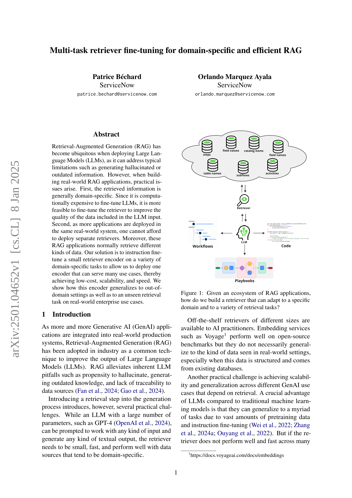
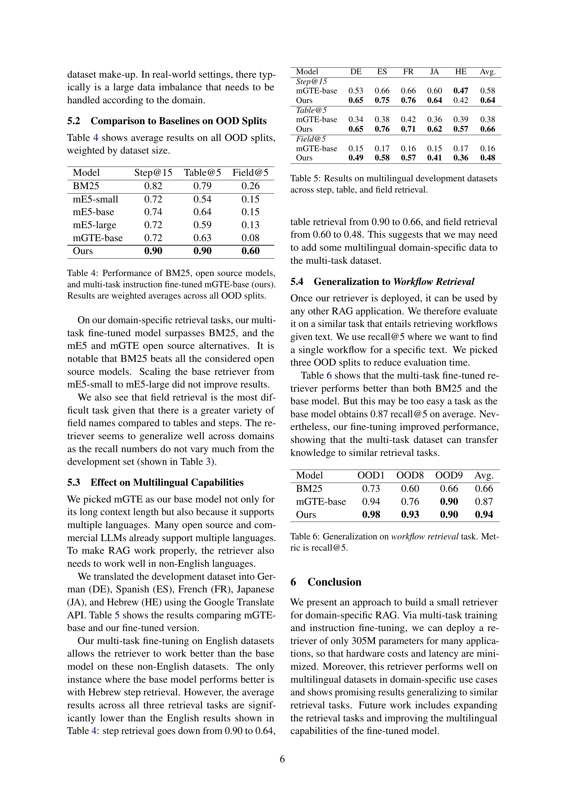

 


 2501.04652 
 Patrice Béchard et el. 
 
 🤗 2025-01-09 
 



↗ arXiv


↗ Hugging Face


↗ Papers with Code


### TL;DR



대규모 언어 모델(LLM)을 활용한 RAG(Retrieval-Augmented Generation)는 환각이나 오래된 정보 생성과 같은 문제를 해결하지만, 도메인 특정 데이터와 다양한 RAG 애플리케이션을 효율적으로 처리해야 하는 어려움이 있습니다. 기존의 별도 검색기 배포는 비용이 많이 들고 확장성이 떨어집니다. 

본 연구는 이러한 문제를 해결하기 위해 **소규모 검색 엔코더를 다양한 도메인 특정 작업에 대해 미세 조정**하는 새로운 접근 방식을 제시합니다.  이를 통해 단일 엔코더로 여러 작업을 처리하여 비용 효율성과 속도를 높이고, 도메인 외 설정 및 새로운 검색 작업에 대한 일반화 성능을 향상시켰습니다. 실제 기업 환경의 데이터를 사용하여 실험을 진행, 이 접근 방식의 효율성과 실용성을 입증하였습니다.



#### Key Takeaways


 다중 작업 미세 조정을 통해 하나의 검색 엔코더로 다양한 도메인 특정 작업을 처리 가능 



 비용 효율성과 속도 향상 및 다양한 도메인 및 작업에 대한 일반화 성능 향상 



 실제 기업 환경에서의 RAG 응용 프로그램에 대한 실용적인 솔루션 제공 


#### Why does it matter?
본 논문은 **다양한 도메인과 검색 작업에 적응하는 효율적이고 확장 가능한 RAG 시스템 구축**에 대한 중요한 통찰력을 제공합니다.  **소규모 검색 엔코더의 다중 작업 미세 조정**을 통해 비용 효율성과 속도를 높이는 동시에 다양한 도메인과 작업에 대한 일반화 성능을 향상시키는 방법을 제시합니다.  이는 **실제 기업 환경에서의 RAG 응용 프로그램 개발 및 배포**에 직접적인 영향을 미치며, 관련 분야 연구자들에게 귀중한 지침을 제공합니다.  또한, **다국어 지원 및 유사 검색 작업에의 일반화** 가능성을 보여줌으로써 향후 연구의 새로운 방향을 제시합니다.

------
#### Visual Insights

> 🔼 본 그림은 다양한 RAG 어플리케이션 생태계를 보여주는 개념도입니다. 특정 도메인과 다양한 검색 과제에 적응할 수 있는 검색기를 구축하는 방법에 대한 질문을 제기합니다.  RAG 어플리케이션들은 서로 다른 종류의 데이터(필드 값, 카탈로그 항목, 단계, 필드 이름, 테이블 이름, 활동, 서브플로우, 워크플로우, 플레이북 등)를 검색합니다. 이러한 다양한 데이터 유형과 도메인 특성을 고려하여 하나의 효율적이고 확장 가능한 검색기를 설계하는 방법을 시각적으로 보여줍니다.
> 

> 
read the caption

> Figure 1: Given an ecosystem of RAG applications, how do we build a retriever that can adapt to a specific domain and to a variety of retrieval tasks?
> 


| Train | Dev | Dev | Dev |
|---|---|---|---| 
| Pairs | Steps | Tables | Fields |
| 172,658 | 279 | 307 | 355 |

> 🔼 이 표는 논문의 실험에서 사용된 개발 데이터셋의 크기를 보여줍니다.  훈련 쌍의 수와 개발 데이터셋에서 단계, 테이블, 필드별 예제 수를 보여주는 상세한 정보를 담고 있습니다.  즉,  모델 훈련과 성능 평가에 사용된 데이터의 규모를 정확히 파악할 수 있도록 합니다.
> 

> 
read the caption

> Table 1: Number of training pairs and examples in the development dataset.
> 

### In-depth insights

#### Multi-task RAG
**다중 작업 RAG**는 하나의 검색기를 여러 도메인과 다양한 검색 작업에 적용하여 효율성과 확장성을 높이는 접근 방식입니다.  이러한 접근 방식은 각 애플리케이션마다 별도의 검색기를 배포할 필요가 없으므로 **비용 효율적**입니다. 또한, **다양한 유형의 데이터**를 검색할 수 있어 유연성이 뛰어납니다.  **사전 훈련된 다국어 임베딩 모델**을 활용하여 여러 언어를 지원하고 도메인 간 일반화 능력을 향상시킬 수 있습니다. 하지만 데이터 불균형 문제를 해결하고 **일반화 성능을 향상**시키기 위해서는 주의 깊은 데이터 구성과 하이퍼파라미터 조정이 필요합니다. **다양한 검색 작업에 대한 일반화 능력**은 실제 환경에서의 성능을 좌우하는 중요한 요소이며, 이를 위해 **다양한 평가 지표**를 활용해야 합니다.  본 연구에서는 다중 작업 미세 조정을 통해 이러한 과제를 해결하고 실제 기업 환경에서 **뛰어난 성능과 확장성**을 보이는 다중 작업 RAG 시스템을 구축하는 사례 연구를 제시했습니다.

#### Instruction Fine-tuning
본 논문에서 "Instruction Fine-tuning"은 **대규모 언어 모델(LLM)의 성능 향상**에 중점을 둡니다.  **다양한 도메인 특화 작업에 대한 지시사항을 포함하는 데이터셋**을 사용하여 모델을 미세 조정함으로써, 특정 도메인에 대한 이해도와 적응력을 높입니다. 이를 통해 기존의 제한적인 성능을 넘어 **다양한 유형의 질의와 요청에 대해 더욱 정확하고 효율적인 응답**을 생성할 수 있게 됩니다.  **소규모 리트리버 인코더에 대한 지시사항 미세 조정**은 특히 비용 효율적인 측면에서 중요하며, 다양한 애플리케이션에 걸쳐 확장성과 속도를 개선하는 데 기여합니다.  **다양한 도메인과 작업에 대한 일반화 능력**을 실제 엔터프라이즈 사례를 통해 검증함으로써, 실용적인 측면에서도 그 효과를 입증합니다.  결론적으로, Instruction Fine-tuning은 LLM 기반 RAG 시스템의 성능과 효율성을 크게 개선하는 핵심 전략으로 자리매김합니다.

#### OOD Generalization
본 논문에서 다룬 OOD(Out-of-Distribution) 일반화는 **도메인 특화된 검색엔진이 훈련 데이터셋과 다른 새로운 도메인의 데이터에 대해 얼마나 잘 작동하는지**를 평가하는 중요한 척도입니다.  **IT 도메인 데이터로 훈련된 모델이 HR이나 금융과 같은 다른 도메인의 데이터에 대해서도 성능을 유지하는지**를 실험적으로 검증했습니다.  이를 통해 개발된 다중 작업 검색 엔코더의 **범용성과 확장성**을 확인하고자 하였습니다.  실험 결과는 OOD 일반화 성능이 우수함을 보여주었으며, 이는 **단일 엔코더를 다양한 도메인 및 작업에 적용 가능**하게 함으로써 비용 효율성과 확장성을 동시에 달성할 수 있음을 시사합니다.  **다양한 도메인 데이터에 대한 일반화 능력**은 실제 기업 환경에서 RAG(Retrieval-Augmented Generation) 시스템의 실용성을 높이는 데 중요한 요소입니다.

#### Multilingual Abilities
본 논문에서 다국어 능력은 **mGTE 모델의 강점**으로 제시되며, 다양한 언어의 데이터셋으로 미세 조정 후에도 여전히 **우수한 성능**을 유지함을 보여줍니다. 영어 이외 언어 데이터에 대한 평가 결과는 다국어 기능이 **잘 보존**됨을 시사하지만, 다국어 데이터셋을 추가하여 성능을 더욱 향상시킬 수 있음을 보여줍니다. **다국어 지원의 중요성**은 실제 환경의 다양성을 고려할 때 매우 중요하며, 이는 향후 연구의 방향을 제시합니다.  **다국어 능력은 RAG 애플리케이션의 실용성 확장**에 큰 영향을 미치므로, 이에 대한 추가적인 연구가 필요합니다. 특히, 다양한 언어에 대한 데이터 균형 문제와 다국어 모델의 효율적인 학습 방법에 대한 연구가 중요합니다.

#### Workflow Retrieval
본 논문에서 '워크플로우 검색(Workflow Retrieval)'은 **다른 RAG 애플리케이션으로의 일반화 능력**을 평가하기 위한 추가적인 실험으로 제시되었습니다. 기존의 단계, 테이블, 필드 검색 과제와 달리, 워크플로우 검색은 YAML 형식의 전체 워크플로우를 텍스트 입력만으로 검색하는 작업입니다. 이는 모델이 다양한 유형의 구조화된 데이터 검색을 넘어, **더 복잡하고 통합적인 작업**에도 적용될 수 있음을 보여줍니다.  **실험 결과는 다중 작업 미세 조정된 검색기가 BM25 및 기본 mGTE 모델보다 더 나은 성능**을 보였음을 보여줍니다.  이는 다중 작업 학습을 통해 모델이 다양한 검색 과제에 대한 일반화 능력을 향상시킬 수 있음을 시사합니다.  **이를 통해 개발된 검색기의 실용성과 확장성을 더욱 강조**하며, 실제 환경의 다양한 RAG 애플리케이션에서 효율적으로 활용될 수 있음을 보여주는 중요한 지표입니다.

### More visual insights

More on tables


| Dataset ID | Flows | Steps | Tables | Fields |
|---|---|---|---|---|
|  |  | samples | samples | samples |
| OOD1 | 103 | 166 | 58 | 107 |
| OOD2 | 100 | 94 | 209 | 392 |
| OOD3 | 100 | 119 | 261 | 450 |
| OOD4 | 100 | 136 | 188 | 275 |
| OOD5 | 100 | 141 | 206 | 305 |
| OOD6 | 100 | 179 | 255 | 529 |
| OOD7 | 98 | 140 | 329 | 665 |
| OOD8 | 100 | 145 | 188 | 246 |
| OOD9 | 100 | 207 | 158 | 301 |
| OOD10 | 171 | 134 | 477 | 690 |
| **TOTAL** | **1,072** | **1,461** | **2,329** | **3,960** |
> 🔼 표 2는 테스트를 위해 사용된 데이터셋의 범위를 보여줍니다.  'OOD(Out-of-Distribution)'는 모델이 학습에 사용되지 않은 새로운 도메인(HR, 금융 등)의 데이터를 의미하며, 다양한 도메인의 데이터를 사용하여 모델의 일반화 성능을 평가하기 위해 사용되었습니다. 각 OOD 분할(OOD1~OOD10)에 대해서, 흐름(Flows), 단계(Steps), 테이블(Tables), 필드(Fields)의 개수가 제시되어 있습니다. 이는 모델이 실제 환경에서 다양한 종류의 데이터에 얼마나 잘 적응하는지 평가하는데 사용됩니다.
> 

> 
read the caption

> Table 2: Number of retrieval examples in OOD splits.
> 


| Setup | Step@15 | Table@5 | Field@5 |
|---|---|---|---|
| Single Task | 0.78 | 0.82 | 0.71 |
| Multi-Task | 0.77 | 0.86 | **0.73** |
| + Downsampled data | **0.86** | **0.88** | 0.71 |
> 🔼 표 3은 단일 작업 미세 조정과 다중 작업 미세 조정의 성능을 비교하고 데이터 불균형 문제 해결을 위한 균형 조정된 데이터셋의 효과를 보여줍니다. 개발 데이터셋을 사용하여 평가한 결과, 다중 작업 미세 조정은 단일 작업 미세 조정보다 우수한 성능을 보였으며, 특히 데이터 불균형 문제를 해결하기 위한 샘플링 기법을 적용했을 때 성능 향상이 더욱 두드러졌습니다.  Step@15, Table@5, Field@5 지표를 통해 각 작업의 정확도를 평가했습니다.
> 

> 
read the caption

> Table 3: Single task vs Multi-task and effect of balanced dataset. Evaluation on development split.
> 


| Model | Step@15 | Table@5 | Field@5 |
|---|---|---|---|
| BM25 | 0.82 | 0.79 | 0.26 |
| mE5-small | 0.72 | 0.54 | 0.15 |
| mE5-base | 0.74 | 0.64 | 0.15 |
| mE5-large | 0.72 | 0.59 | 0.13 |
| mGTE-base | 0.72 | 0.63 | 0.08 |
| Ours | **0.90** | **0.90** | **0.60** |
> 🔼 표 4는 BM25, 오픈소스 모델 및 다중 작업 지시 미세 조정 mGTE-base(본 연구)의 성능을 보여줍니다.  결과는 모든 OOD 분할에 대한 가중 평균입니다.  즉,  본 연구에서 제안하는 다중 작업 미세 조정 기법을 적용한 mGTE-base 모델의 성능을 BM25와 다른 오픈소스 모델들과 비교하여 도메인 외(OOD) 데이터셋에서의 성능을 평가한 결과를 보여주는 표입니다.  다양한 척도(Step@15, Table@5, Field@5)에 대한 성능이 제시되어 있으며, 각 척도는  특정 검색 작업의 정확도를 나타냅니다.  가중 평균을 사용하여 OOD 데이터셋에서의 전반적인 성능을 평가했습니다.
> 

> 
read the caption

> Table 4: Performance of BM25, open source models, and multi-task instruction fine-tuned mGTE-base (ours). Results are weighted averages across all OOD splits.
> 


| Model | DE | ES | FR | JA | HE | Avg. |
|---|---|---|---|---|---|---|
| _Step@15_ |  |  |  |  |  |  |
| mGTE-base | 0.53 | 0.66 | 0.66 | 0.60 | **0.47** | 0.58 |
| Ours | **0.65** | **0.75** | **0.76** | **0.64** | 0.42 | **0.64** |
| _Table@5_ |  |  |  |  |  |  |
| mGTE-base | 0.34 | 0.38 | 0.42 | 0.36 | 0.39 | 0.38 |
| Ours | **0.65** | **0.76** | **0.71** | **0.62** | **0.57** | **0.66** |
| _Field@5_ |  |  |  |  |  |  |
| mGTE-base | 0.15 | 0.17 | 0.16 | 0.15 | 0.17 | 0.16 |
| Ours | **0.49** | **0.58** | **0.57** | **0.41** | **0.36** | **0.48** |
> 🔼 표 5는 다국어 개발 데이터셋에서 단계, 테이블 및 필드 검색에 대한 결과를 보여줍니다.  다양한 언어(독일어, 스페인어, 프랑스어, 일본어, 히브리어)로 번역된 개발 데이터셋을 사용하여, 다국어 기능이 유지되는지 평가합니다.  각 언어와 작업 유형(단계, 테이블, 필드)별로 재현율을 측정하여 모델의 성능을 비교 분석합니다.
> 

> 
read the caption

> Table 5: Results on multilingual development datasets across step, table, and field retrieval.
> 


| Model | OOD1 | OOD8 | OOD9 | Avg. |
|---|---|---|---|---|
| BM25 | 0.73 | 0.60 | 0.66 | 0.66 |
| mGTE-base | 0.94 | 0.76 | 0.90 | 0.87 |
| Ours | **0.98** | **0.93** | **0.90** | **0.94** |
> 🔼 표 6은 워크플로 검색 작업에 대한 일반화 성능을 보여줍니다.  여기서 평가 지표는 recall@5입니다.  즉, 상위 5개의 검색 결과 중 실제 관련 워크플로가 포함되어 있는 비율을 나타냅니다. 이 표는 다양한 도메인(OOD1, OOD8, OOD9)에 걸쳐, 다중 작업 미세 조정된 검색기가 얼마나 잘 일반화되는지를 보여주는 실험 결과를 제시합니다.  BM25와 기본 mGTE 모델과의 비교를 통해 다중 작업 미세 조정의 효과를 확인할 수 있습니다.
> 

> 
read the caption

> Table 6: Generalization on workflow retrieval task. Metric is recall@5.
> 

### Full paper



