 


 2501.04689 
 Zixuan Huang et el. 
 
 🤗 2025-01-09 
 



↗ arXiv


↗ Hugging Face


↗ Papers with Code


### TL;DR



단일 이미지를 이용한 3D 객체 재구축은 컴퓨터 비전 분야의 오랜 과제입니다. 기존의 회귀 기반 방법은 가려진 영역을 잘 처리하지 못하고, 생성 기반 방법은 계산 비용이 많이 드는 단점이 있습니다. 이러한 문제를 해결하기 위해, 본 논문에서는 새로운 두 단계 접근 방식을 제안합니다.  

본 논문에서 제안하는 SPAR3D는 **가벼운 포인트 확산 모델**을 이용하여 먼저 희소 3D 포인트 클라우드를 생성한 후, **입력 이미지와 생성된 포인트 클라우드**를 결합하여 상세한 3D 메쉬를 생성하는 2단계 방식입니다. 이를 통해, **빠른 속도와 높은 정확도**를 동시에 달성하며, 사용자 편집 기능까지 제공하여 실용성을 높였습니다. 다양한 데이터셋에서 기존 최첨단 방법보다 우수한 성능을 보였으며, 추론 속도는 0.7초에 불과합니다.



#### Key Takeaways


 단일 이미지로부터 0.7초 이내에 고품질 3D 메쉬를 생성합니다. 



 기존 방법보다 우수한 성능을 보이며, 사용자 편집 기능까지 지원합니다. 



 두 단계 접근 방식(포인트 클라우드 생성 및 메쉬 생성)을 통해 속도와 정확성을 동시에 향상시켰습니다. 


#### Why does it matter?
이 논문은 **단일 이미지에서 고품질 3D 객체 재구축**이라는 어려운 문제에 대한 효율적이고 정확한 해결책을 제시하여 **컴퓨터 비전 및 증강현실 분야의 연구**에 중요한 영향을 미칩니다. 제안된 방법은 속도와 정확성 측면에서 기존 방법을 능가하며, 사용자 편집 기능까지 제공하여 실용성을 더욱 높였습니다. 또한, 본 연구는 **새로운 2단계 접근 방식**을 제시함으로써, 향후 연구 방향을 제시하고 관련 분야의 발전에 기여할 것으로 예상됩니다. 이는 특히 **실시간 3D 콘텐츠 생성 및 편집**이 중요한 응용 분야에 혁신적인 발전을 가져올 수 있음을 시사합니다.

------
#### Visual Insights

> 🔼 그림 1은 본 논문에서 제시하는 최첨단 3D 복원 모델인 SPAR3D를 보여줍니다. SPAR3D는 단일 이미지에서 고품질 3D 메시를 생성하며, 0.7초라는 빠른 속도로 복원을 수행하고 사용자의 직접적인 편집도 지원합니다. 그림에는 입력 이미지, 생성된 점 구름, 최종 메시 출력물이 각각 표시되어 있어 SPAR3D의 처리 과정을 한눈에 이해하는 데 도움을 줍니다.
> 

> 
read the caption

> Figure 1: We present SPAR3D, a state-of-the-art 3D reconstructor that reconstructs high-quality 3D meshes from single-view images. SPAR3D enjoys a fast reconstruction speed at 0.7 seconds and supports interactive user edits.
> 


| Method | CD ↓ | FS@0.1 ↑ | FS@0.2 ↑ | FS@0.5 ↑ | PSNR ↑ | SSIM ↑ | LPIPS ↓ | Time (s) ↓ |
|---|---|---|---|---|---|---|---|---|
| Shap-E [29] | 0.204 | 0.359 | 0.638 | 0.922 | 15.3 | 0.802 | 0.205 | 3.1 |
| LN3Diff [31] | 0.174 | 0.422 | 0.703 | 0.949 | 17.1 | 0.819 | 0.169 | 5.1 |
| LGM [53] | 0.196 | 0.356 | 0.635 | 0.936 | 17.0 | 0.818 | 0.184 | 41.0 |
| CRM [60] | 0.161 | 0.437 | 0.735 | 0.961 | 17.5 | 0.830 | 0.169 | 7.4 |
| TripoSR [54] | 0.145 | 0.501 | 0.784 | 0.968 | 18.5 | 0.837 | 0.151 | 0.2 |
| InstantMesh [65] | 0.135 | 0.545 | 0.812 | 0.971 | 18.1 | 0.838 | 0.146 | 36.1 |
| SF3D [2] | 0.137 | 0.540 | 0.806 | 0.970 | 18.0 | 0.839 | 0.145 | 0.3 |
| SPAR3D (ours) | 0.120 | 0.584 | 0.850 | 0.983 | 18.6 | 0.836 | 0.139 | 0.7 |

> 🔼 표 1은 GSO 데이터셋 [15]을 사용하여 SPAR3D의 성능을 평가한 결과를 다른 최첨단 방법들과 비교한 표입니다.  단순히 캡션에서 언급된 것보다 자세히 살펴보면,  다양한 지표(CD, FS@0.1, FS@0.2, FS@0.5, PSNR, SSIM, LPIPS, 처리 시간)를 통해 정량적인 비교를 수행하였음을 알 수 있습니다. CD와 FS는 기하학적 정확도를 나타내고, PSNR, SSIM, LPIPS는 질감 품질을 나타냅니다.  처리 시간은 모델의 효율성을 나타내는 지표입니다.  결과적으로 SPAR3D가 다른 방법들에 비해 대부분의 지표에서 우수한 성능을 보임을 확인할 수 있습니다.
> 

> 
read the caption

> Table 1: Quantitative Comparisons on GSO [15]. SPAR3D performs favorably to other state-of-the-art methods.
> 

### In-depth insights

#### Single-Image 3D
단일 이미지 3D 복원은 컴퓨터 비전 분야의 오랜 과제이며, 가시적인 표면은 추론할 수 있지만, **폐색 영역은 어려움**을 겪습니다.  기존 연구는 회귀 기반 모델과 생성 기반 모델로 나뉘는데, 회귀 모델은 효율적이나 폐색 영역 처리에 어려움이 있고, 생성 모델은 계산 비용이 높다는 단점이 있습니다.  **SPAR3D는 이러한 문제점을 해결하기 위해 두 단계 접근 방식**을 제시합니다.  먼저, 경량 포인트 확산 모델을 사용하여 **희소 3D 점 구름 생성**, 다음으로 생성된 점 구름과 입력 이미지를 활용하여 **세부적인 메쉬 생성**합니다. 이를 통해 계산 효율성을 유지하면서 확률적 모델링을 가능하게 하여, 단일 이미지 3D 작업의 불확실성을 처리하고 높은 정확도를 달성합니다.  **점 구름 중간 표현 방식**은 사용자 편집도 지원하여 상호 작용적인 편집 기능을 제공합니다.  **다양한 데이터셋에서 우수한 성능**을 보이며, **0.7초의 빠른 추론 속도**를 달성했습니다.

#### Two-Stage Approach
본 논문에서 제안하는 **두 단계 접근 방식**은 단일 이미지 3D 객체 재구성 문제에 대한 새로운 해결책을 제시합니다. 첫 번째 단계는 경량의 포인트 확산 모델을 사용하여 **희소 3D 점 구름**을 생성하는 것입니다. 이는 빠른 속도로 고품질 3D 메시를 생성하는 데 기여합니다. 두 번째 단계에서는 생성된 점 구름과 입력 이미지를 활용하여 **고품질 메시**를 생성합니다. 이러한 두 단계의 설계를 통해 단일 이미지 3D 작업의 어려움을 해결하고, 계산 효율성을 유지하면서 높은 출력 충실도를 달성할 수 있습니다. 또한 점 구름을 중간 표현으로 사용함으로써 **사용자의 상호 작용 편집**을 가능하게 합니다.  **두 단계 접근 방식**은 기존의 회귀 기반 모델과 생성 모델의 장점을 결합하여 단점을 극복하는 효과적인 전략임을 보여줍니다.

#### Point Cloud Diffusion
포인트 클라우드 확산(Point Cloud Diffusion)은 3D 객체의 표현과 생성에 있어서 혁신적인 접근 방식입니다. 기존의 방법들과 달리, **확산 모델을 활용하여 3D 포인트 클라우드를 직접 생성**함으로써, 고해상도의 복잡한 형태를 효율적으로 표현할 수 있습니다. 특히, **저해상도의 희소 포인트 클라우드에서 고해상도의 상세한 메시로의 변환**을 가능하게 하여, 연산 비용을 절감하면서 높은 정확도를 유지하는 데 기여합니다. 또한, 이러한 방법은 **불확실성을 모델링**하고, **결측 데이터를 효과적으로 처리**하는 데 유용합니다. 하지만, **고품질의 3D 데이터셋이 필요**하다는 점과, **모델의 복잡성으로 인한 훈련 및 추론 과정의 어려움**은 여전히 해결해야 할 과제입니다.  결론적으로, 포인트 클라우드 확산은 3D 객체 생성 및 복원 분야에서 **새로운 가능성을 제시**하지만, **데이터 및 연산 효율성 측면에서의 개선**이 필요합니다.

#### Meshing Refinement
메싱 개선은 3D 객체 재구성에서 중요한 단계입니다. **정확하고 디테일한 메시를 생성**하기 위해서는 입력 데이터의 품질과 알고리즘의 성능이 모두 중요합니다.  **입력으로 사용되는 포인트 클라우드의 품질**은 최종 메시의 질에 직접적인 영향을 미칩니다.  따라서 노이즈 제거, 샘플링 전략, 포인트 클라우드의 밀도 등을 신중히 고려해야 합니다. 또한 **메싱 알고리즘 자체의 성능**도 중요한데, 메싱 알고리즘은 포인트 클라우드를 기반으로 삼차원 메시를 생성하는 과정에서 다양한 최적화 기법을 활용합니다. **메시의 정확도와 효율성을 높이기 위해**서는 알고리즘의 매개변수를 최적화하고, 계산 복잡도를 줄이는 등의 노력이 필요합니다.  **실시간 처리 및 상호작용**을 고려한다면, 메싱 알고리즘의 계산 속도 또한 중요한 요소가 됩니다.  **최종 결과물의 질적 평가**는 시각적 평가와 정량적 지표를 통해 이루어져야 합니다. 이를 통해 메싱 개선 과정의 성능을 객관적으로 평가하고, 향상된 메싱 기법을 개발하는 데 활용할 수 있습니다.  따라서 메싱 개선은 **데이터 전처리, 알고리즘 설계, 성능 최적화, 결과 평가** 등 다양한 측면을 종합적으로 고려해야 하는 복잡한 과정임을 알 수 있습니다.

#### Interactive Editing
본 논문에서 제시된 2단계 접근 방식의 핵심적인 장점 중 하나는 **상호작용적인 편집 기능**입니다. 기존의 단일 이미지 3D 재구성 방법들은 생성된 메시를 수정하는 데 어려움이 있었지만, 본 논문의 방법은 **저해상도의 점 구름을 중간 표현으로 사용**하여 사용자가 메시의 보이지 않는 부분을 쉽게 수정할 수 있도록 합니다. 점 구름은 연결 정보가 없기 때문에, 토폴로지에 대한 걱정 없이 자유롭게 점을 추가, 삭제, 이동 또는 재색칠할 수 있습니다. 이러한 편집 작업은 효율적인 메시 생성 모델 덕분에 0.3초 만에 반영되어 **실시간에 가까운 상호작용**을 제공합니다. 이는 특히 사용자가 기대하는 결과와 다르게 생성된 부분을 수정하는 데 매우 유용하며, **사용자 친화적인 인터페이스를 제공**한다는 점에서 큰 의미가 있습니다. 특히 3D 자산 제작의 다양한 분야에 폭넓게 적용될 수 있을 것으로 예상되며,  **생성된 3D 모델의 정확성과 실용성을 향상시키는 데 기여**할 것으로 기대됩니다.  **점 구름 기반 상호작용 편집 기능**은 사용자의 직관적인 편집을 가능하게 하여 3D 모델링 과정의 효율성과 편의성을 높였으며, 앞으로 3D 재구성 기술의 발전에 중요한 기여를 할 것으로 예상됩니다.  **시간 효율성과 편집의 용이성**이 결합되어 사용자 중심의 워크플로우 구축에 크게 기여할 수 있다는 점에서 큰 가치가 있습니다.

### More visual insights

More on figures

> 🔼 그림 2는 SPAR3D의 전체적인 개요를 보여줍니다. 입력 이미지를 조건으로 하여, SPAR3D는 먼저 point diffusion model을 활용하여 sparse point cloud를 생성합니다. 그 후, triplane transformer가 샘플링된 point cloud와 이미지 특징을 사용하여 고해상도의 triplane 특징을 생성합니다. 마지막으로, 이 triplane 특징을 질의하여 이미지 내 물체의 기하학적 구조, 질감 및 조명을 재구성합니다.
> 

> 
read the caption

> Figure 2: SPAR3D Overview. Conditioned on the input image, SPAR3D first leverages a point diffusion model to generate a sparse point cloud. The triplane transformer then uses the sampled point cloud and image features to produce high-resolution triplane features. The triplane features are then queried to reconstruct the geometry, texture, and illumination of the object in the image.
> 

> 🔼 그림 3은 SPAR3D의 미분 가능한 렌더러의 구조를 보여줍니다. 트라이플레인과 이미지의 금속/거칠기 값으로부터 기하학, 반사율, 조명, 그리고 노말 맵을 추정합니다. 간략화를 위해 셰이더는 생략되었지만, 추정된 값들을 래스터화 및 보간하여 셰이더에 입력으로 사용합니다. 셰이더는 Disney BRDF [3]를 사용하며 몬테카를로 적분을 수행합니다. 그림자 모델링을 개선하기 위해 가시성 테스트를 추가로 수행합니다. 최종적으로, 렌더링된 이미지와 GT 이미지를 비교하여 렌더링 손실을 최소화합니다. 즉, 이미지의 특징과 트라이플레인으로부터 3D 물체의 표면 정보를 추출하고 이를 이용해 실제 이미지처럼 보이는 이미지를 생성하여, 실제 이미지와 비교하여 손실을 최소화함으로써 모델을 학습시키는 과정을 보여줍니다.
> 

> 
read the caption

> Figure 3: Our Differentiable Renderer. We estimate geometry, albedo, lighting, and normal maps from the triplane and metallic/roughness values from the image. We rasterize and interpolate these values as input to our shader (omitted here for simplicity). Our shader uses the Disney BRDF [3] and performs Monte Carlo integration. We further perform visibility testing to improve shadow modeling. Finally, we compare the rendered image with the GT image and minimize the rendering loss.
> 

> 🔼  그림 4는 그림자 모델링 과정을 보여줍니다.  간단히 말해, 화면 공간(screen-space)에서 광선 추적(ray marching)을 통해 픽셀이 그림자에 가려져 있는지 판단하는 방법을 나타냅니다.  샘플링된 광선을 따라 이동하면서, 광선의 깊이(ray depth)가 깊이 맵(depth map)의 값보다 더 멀리 있다면, 그 광선은 그림자에 가려진 것으로 간주합니다. 이는 간단하면서도 효과적인 그림자 처리 기법으로, 실시간 렌더링에 적합합니다.  본 그림은 깊이 맵과 샘플링된 광선을 시각적으로 보여주어, 그림자 판단 로직을 명확히 이해하도록 돕습니다.
> 

> 
read the caption

> Figure 4: Shadow Modeling. We perform visibility testing in screen-space by marching along sampled rays. If any point along the ray has a ray depth which is farther away than the depth map, we consider the entire ray as shadowed.
> 

> 🔼 그림 5는 다양한 최첨단 방법들과 SPAR3D의 시각적 비교 결과를 보여줍니다.  단순히 이미지의 보이는 표면에만 잘 맞는 것이 아니라, SPAR3D는 보이지 않는 표면까지 더욱 고품질의 기하학적 구조와 질감을 생성합니다.  다른 방법들은 보이는 부분은 잘 재현하지만, 숨겨진 부분은 부정확하거나 뭉개져 보이는 반면, SPAR3D는 전체적인 3D 모델의 완성도가 훨씬 높습니다. 이는 SPAR3D의 강점을 잘 보여주는 부분입니다.
> 

> 
read the caption

> Figure 5: Qualitative Comparison. We compare SPAR3D to other state-of-the-art methods visually. SPAR3D not only aligns better with the visible surfaces from images, but also generates higher-quality geometries and textures for the occluded surfaces.
> 

> 🔼 그림 6은 SPAR3D의 일반화 성능을 보여줍니다. 상위 두 행은 2D 생성 모델에서 가져온 실제 이미지를, 하위 두 행은 ImageNet에서 가져온 이미지를 보여줍니다. 재구성된 메시는 정확한 기하학적 구조와 우수한 질감을 보여주어 SPAR3D의 강력한 일반화 성능을 입증합니다.  다양한 스타일과 형태의 물체들을 정확하게 3D 모델로 복원하는 SPAR3D의 능력을 보여주는 여러 예시가 포함되어 있습니다.
> 

> 
read the caption

> Figure 6: Generalization Results. We show qualitative results of SPAR3D on in-the-wild images from 2D generative models (top 2 rows) and ImageNet (bottom 2 rows). The reconstructed meshes exhibit accurate geometric structures with great textures, demonstrating a strong generalization performance of SPAR3D.
> 

> 🔼 그림 7은 SPAR3D를 사용한 대화형 편집의 정성적 예시를 보여줍니다. 왼쪽 두 예시에서는 기존 점을 복제하여 머그컵에 손잡이를 추가하고 코끼리 인형에 꼬리를 추가하는 방법을 보여줍니다. 오른쪽 두 예시에서는 점을 이동하거나 삭제하여 메시의 불완전한 부분을 수정하고 세부적인 부분을 개선하는 방법을 보여줍니다. 모든 편집은 Blender에서 1분 이내에 수행되었습니다. 간략하게 말하면, 사용자가 점 구름을 직접 조작하여 3D 모델의 부족한 부분을 보완하거나 개선할 수 있음을 보여주는 그림입니다.
> 

> 
read the caption

> Figure 7: Editing Results. We show qualitative examples of interactive editing with SPAR3D. On the left two examples, we add a handle to the mug and a tail to the elephant doll by duplicating existing points. On the right two examples, we move or delete points to fix imperfections and to improve local details on the mesh. All the edits are performed in Blender within a minute.
> 

> 🔼 이 그림은 이미지와 포인트 클라우드 간의 상충되는 단서가 있을 때, 모델이 이미지를 기반으로 보이는 표면을 재구성하고 포인트 클라우드를 기반으로 뒷면을 생성하는 과정을 보여줍니다.  즉, 모델이 상반되는 정보를 받더라도 보이는 부분은 이미지 정보를 우선시하고 숨겨진 부분은 포인트 클라우드 정보를 활용하여 3D 모델을 생성하는 것을 시각적으로 보여주는 실험 결과입니다. 다람쥐 이미지와 말의 포인트 클라우드를 입력으로 사용하여 다람쥐의 앞면은 다람쥐 이미지에 맞추고 뒷면은 말의 포인트 클라우드 특징을 반영한 3D 모델이 생성되는 것을 확인할 수 있습니다.
> 

> 
read the caption

> Figure 8: Generated Mesh with Conflicting Cues. Under conflicting cues from images and point clouds, our model reconstructs the visible surface based on the image, while generating the backside surface based on the point cloud.
> 

> 🔼 그림 9는 SPAR3D와 SF3D의 분해된 알베도와 재조명 결과를 비교하여 보여줍니다.  SPAR3D는 SF3D에 비해 베이크된 조명이 적은 알베도를 추정하며, 이는 더 나은 재조명 결과로 이어집니다.  구체적으로, SPAR3D는 물체의 표면 반사율을 더욱 정확하게 반영하는 알베도를 생성하며,  다양한 조명 환경에서도 더 사실적인 재구성 결과를 보여줍니다. 이를 통해, 그림자와 반사광 등의 조명 효과가 더욱 자연스럽고 정교하게 표현됩니다.  이는 SPAR3D의 이점 중 하나이며, 단일 이미지 3D 객체 재구성에서 더욱 현실적인 결과를 얻는 데 기여합니다.
> 

> 
read the caption

> Figure 9: Decomposition and Relighting Results. We show decomposed albedo and relighting results of SPAR3D in comparison with SF3D. The albedo estimated by SPAR3D has less baked-in lighting compared with SF3D and results in better relighting outcomes.
> 

More on tables


| Method | CD ↓ | FS@0.1 ↑ | FS@0.2 ↑ | FS@0.5 ↑ | PSNR ↑ | SSIM ↑ | LPIPS ↓ | Time (s) ↓ |
|---|---|---|---|---|---|---|---|---|
| Shap-E [29] | 0.212 | 0.349 | 0.624 | 0.909 | 14.8 | 0.8006 | 0.205 | 3.1 |
| LN3Diff [31] | 0.160 | 0.480 | 0.744 | 0.957 | 16.7 | 0.819 | 0.161 | 5.0 |
| LGM [53] | 0.200 | 0.366 | 0.638 | 0.924 | 16.1 | 0.810 | 0.188 | 42.0 |
| CRM [60] | 0.155 | 0.482 | 0.765 | 0.962 | 17.0 | 0.828 | 0.162 | 7.0 |
| TripoSR [54] | 0.144 | 0.537 | 0.785 | 0.963 | **18.0** | **0.835** | 0.147 | **0.2** |
| InstantMesh [65] | 0.145 | 0.546 | 0.790 | 0.962 | 17.2 | 0.832 | 0.150 | 34.7 |
| SF3D [2] | **0.138** | **0.554** | **0.800** | **0.967** | 17.4 | **0.836** | **0.145** | **0.3** |
| SPAR3D (ours) | **0.122** | **0.587** | **0.845** | **0.978** | 17.9 | 0.832 | **0.140** | **0.7** |
> 🔼 표 2는 OmniObject3D 데이터셋 [63]을 사용하여 여러 최첨단 방법들과 비교한 SPAR3D의 정량적 성능을 보여줍니다.  정확도와 완전성을 측정하는 샴퍼 거리(CD), F-점수(FS@0.1, FS@0.2, FS@0.5),  그리고 텍스처 품질을 평가하는 PSNR, SSIM, LPIPS 지표가 포함되어 있습니다.  SPAR3D는 다른 방법들에 비해 우수한 성능을 보이며, 특히 메쉬 정확도와 텍스처 품질에서 두각을 나타냅니다. 또한, 추론 시간이 매우 짧다는 것을 보여줍니다.
> 

> 
read the caption

> Table 2: Quantitative Comparisons on OmniObject3D [63]. SPAR3D performs favorably to other state-of-the-art methods.
> 


| Method | CD ↓ | FS@0.1 ↑ | PSNR ↑ | LPIPS ↓ |
|---|---|---|---|---|
| SPAR3D w/o Point | 0.136 | 0.506 | 18.5 | 0.146 |
| SPAR3D | **0.120** | **0.584** | **18.6** | **0.139** |
| SPAR3D w/o Point | 0.140 | 0.509 | 17.8 | 0.146 |
| SPAR3D | **0.122** | **0.587** | **17.9** | **0.140** |
> 🔼 표 3은 GSO 및 Omniobject3D 데이터셋에서 점 샘플링 단계를 제거했을 때의 성능 저하를 보여주는 실험 결과를 보여줍니다.  상위 두 행은 GSO 데이터셋, 하위 두 행은 Omniobject3D 데이터셋에 대한 결과입니다. 점 샘플링 단계를 제거하면 (SPAR3D w/o Point) CD, FS@0.1, PSNR 지표에서 성능이 저하되는 것을 확인할 수 있습니다. 이는 점 샘플링 단계가 3D 객체 재구성의 정확도와 완전성에 중요한 역할을 한다는 것을 의미합니다.
> 

> 
read the caption

> Table 3: Ablation Study on GSO (top 2 rows) and Omniobject3D (bottom 2 rows). Removing the point sampling stage leads to significant performance drop.
> 

### Full paper


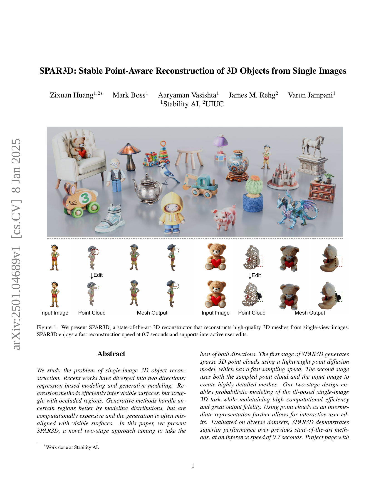
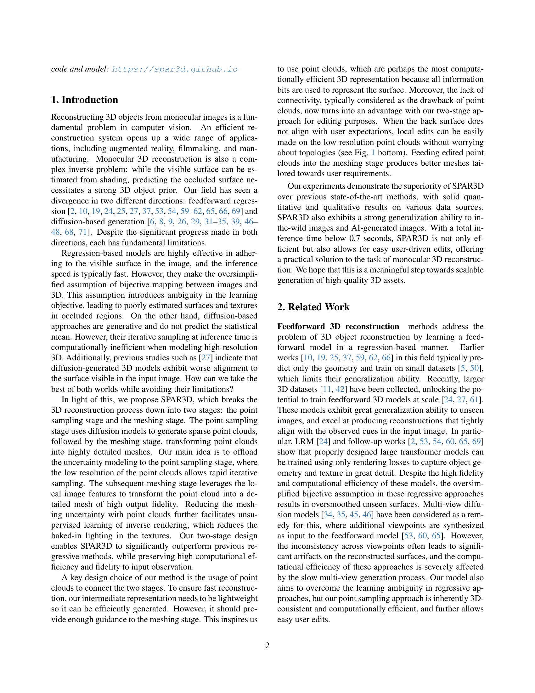
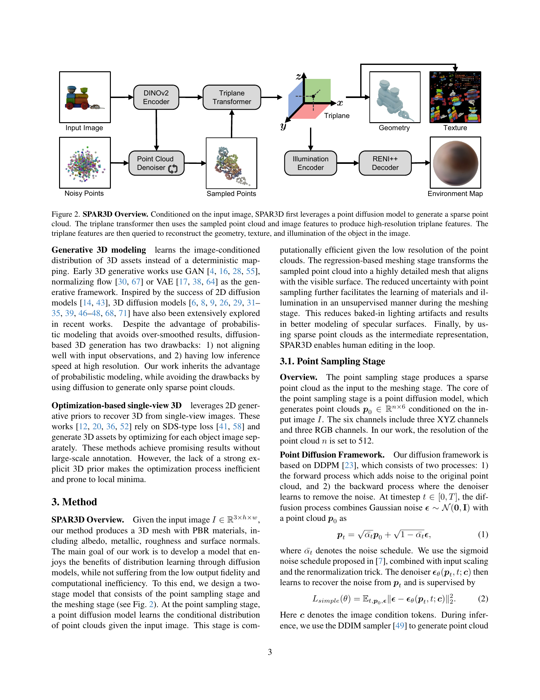
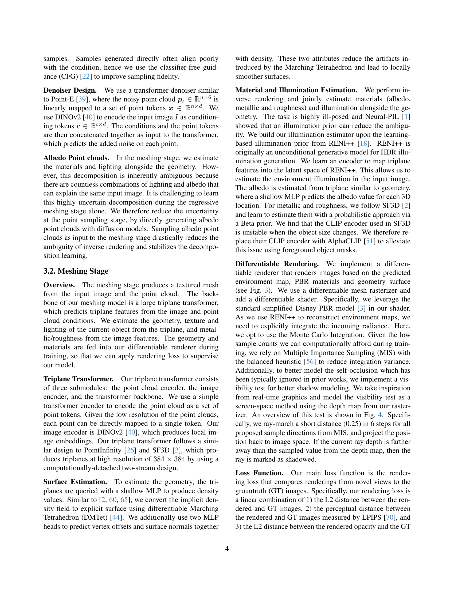
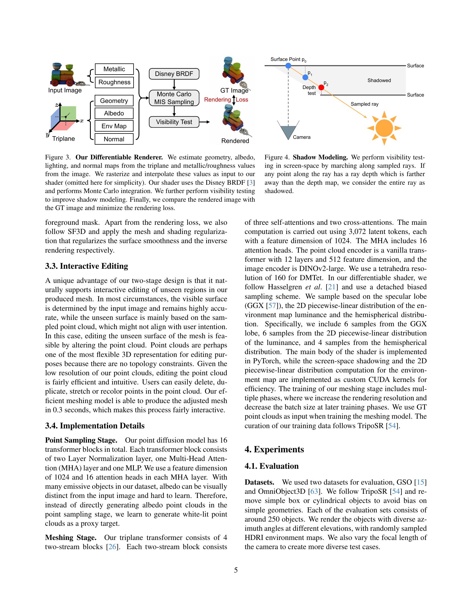
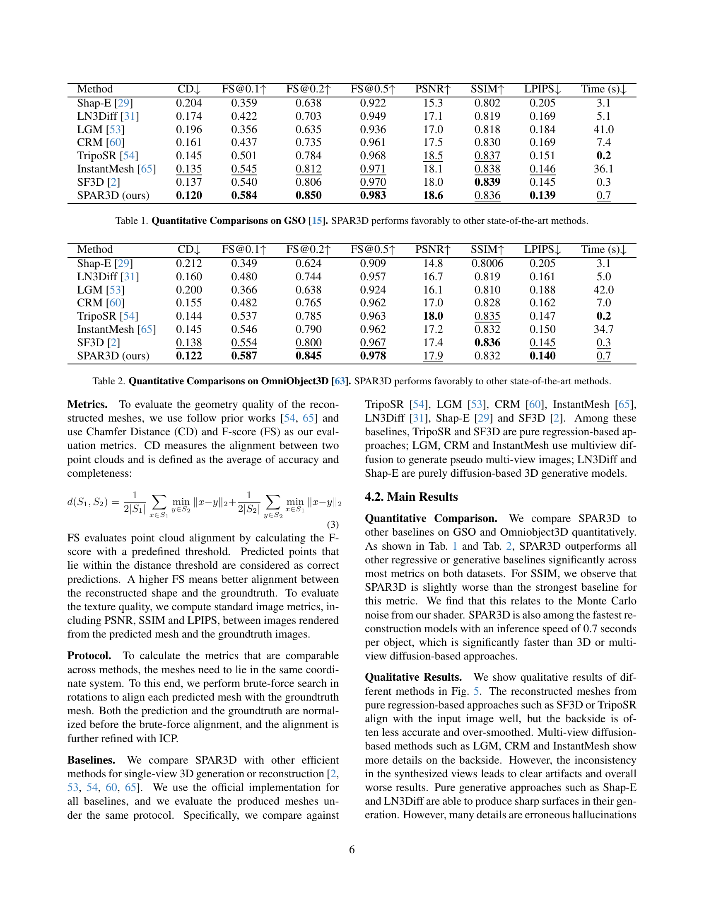
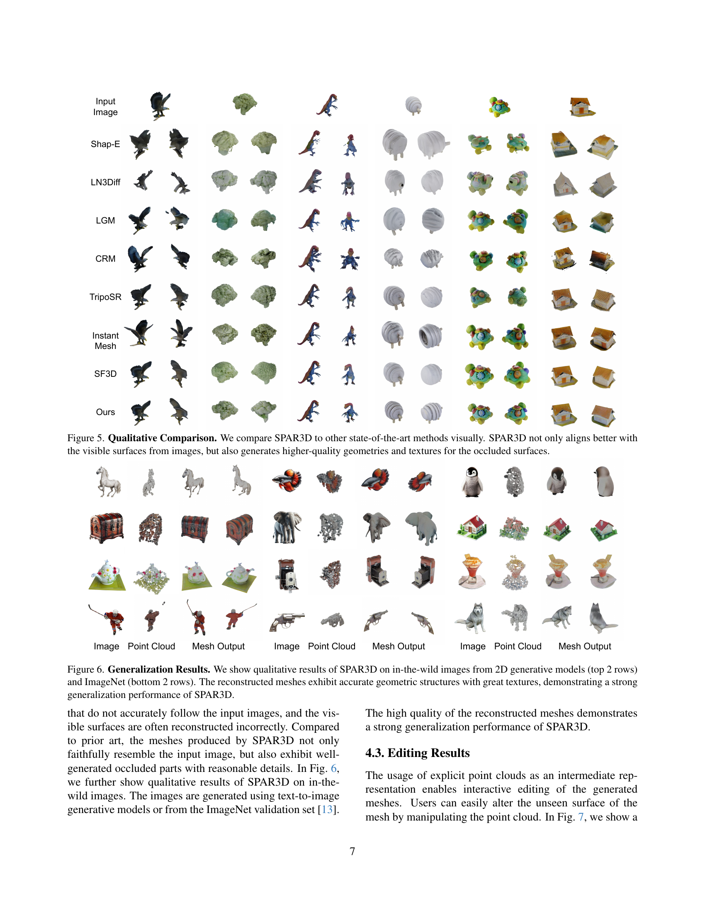
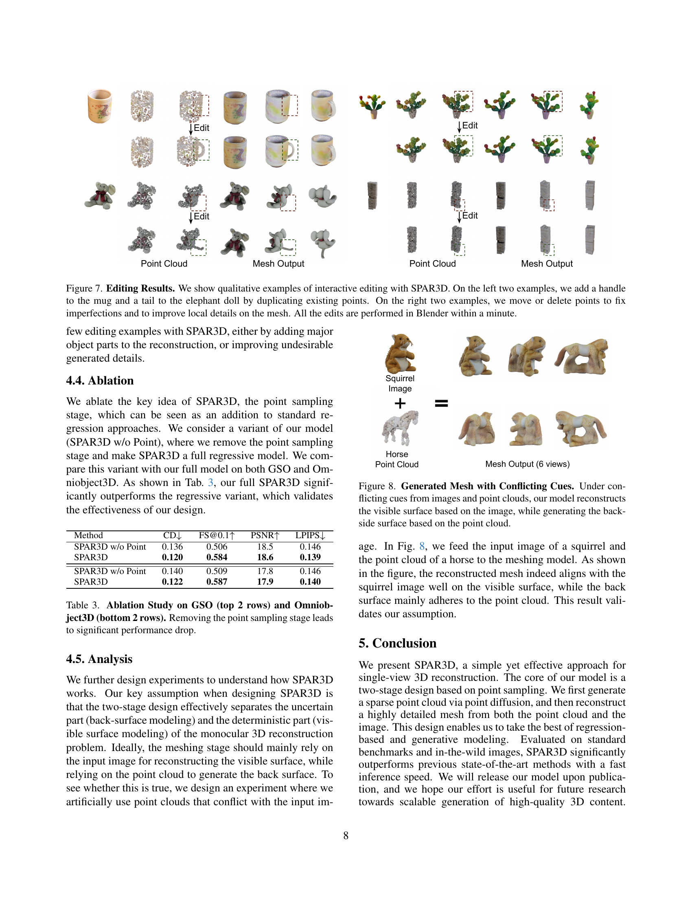
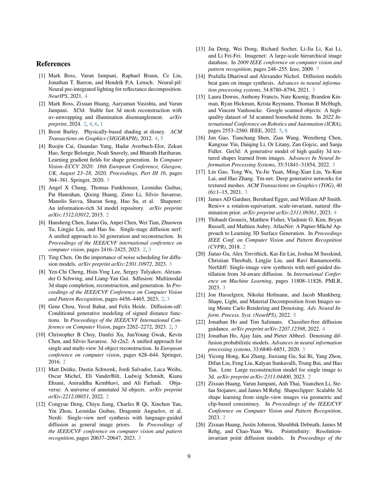
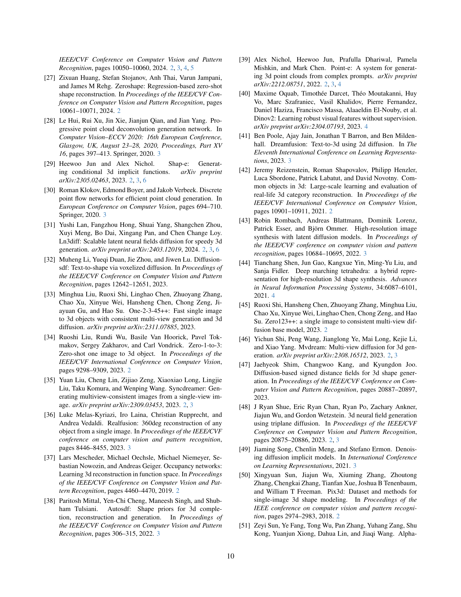
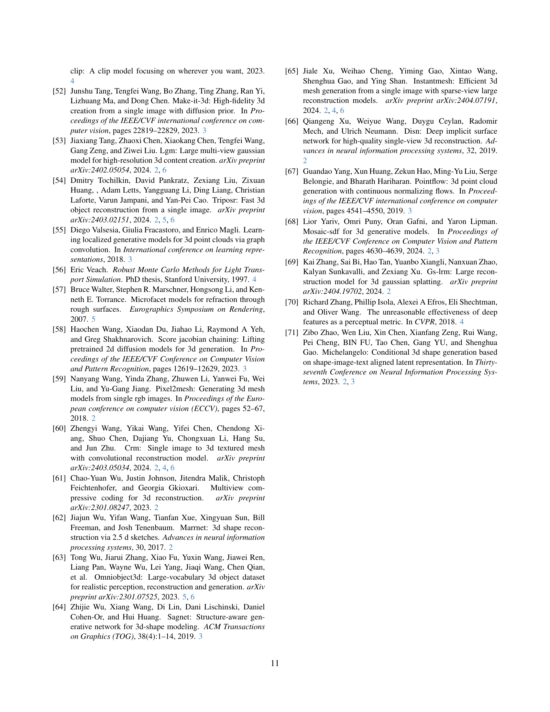
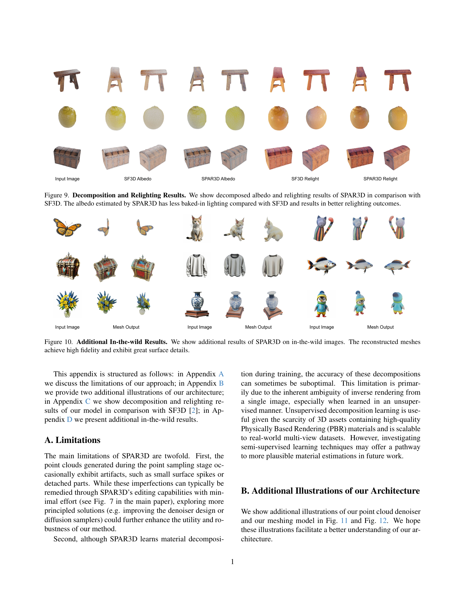
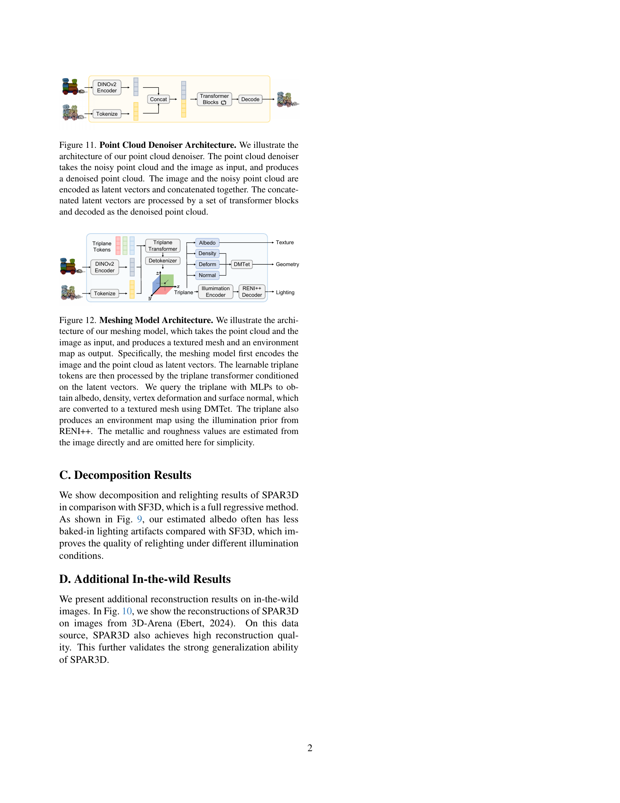
