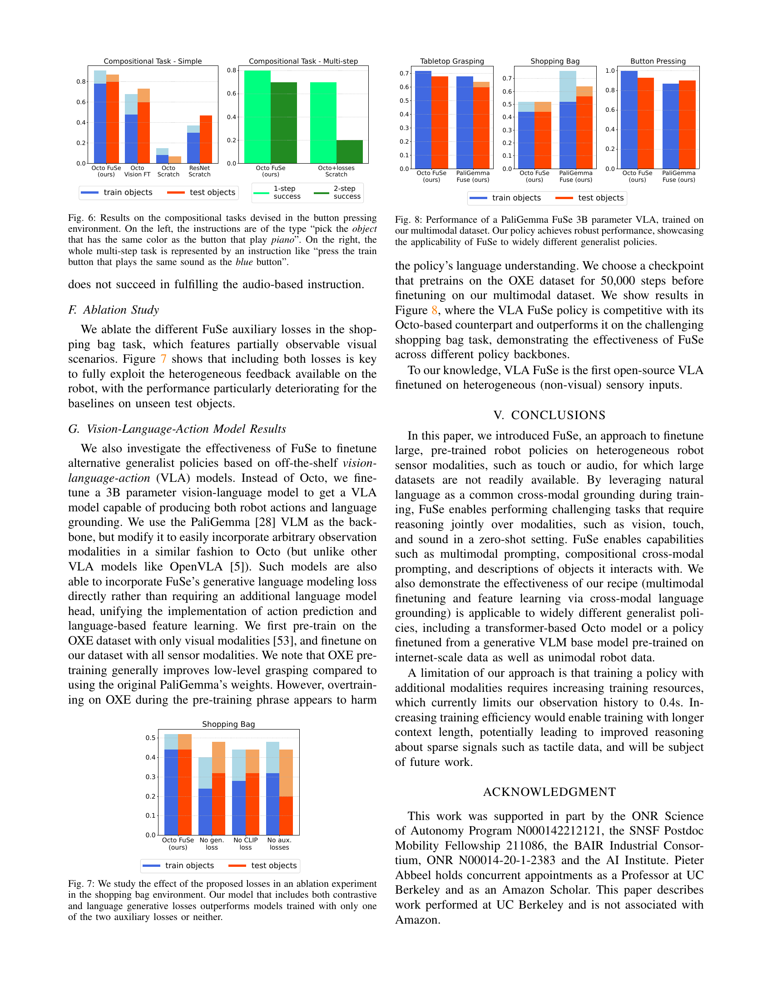

 


 2501.04693 
 Joshua Jones et el. 
 
 🤗 2025-01-16 
 



↗ arXiv


↗ Hugging Face


↗ Papers with Code


### TL;DR



기존의 로봇 정책들은 주로 시각 정보에만 의존하여 부분적으로 관찰 가능한 환경이나 다양한 센서 정보가 필요한 작업 수행에 어려움을 겪었습니다.  **특히, 촉각이나 청각과 같은 비주얼 데이터가 부족한 센서 모달리티에 대한 대규모 데이터셋이 없어서**  로봇의 다양한 센서 정보를 활용한 지능적인 상호작용이 제한적이었습니다.  이러한 문제는 로봇의 일반화 능력과 다양한 작업 수행 능력을 저해하는 요인이 되었습니다.

본 연구에서는 **자연어를 공통적인 접지(grounding)로 활용하여** 시각, 촉각, 청각 등 다양한 센서 모달리티를 갖는 로봇 정책을 미세 조정하는 새로운 방법인 FuSe를 제안합니다. FuSe는 **다중 모달 대조 손실과 감각 기반 언어 생성 손실**을 결합하여 고차원적인 의미를 인코딩합니다. 실험 결과, FuSe는 다양한 작업(다중 모달 프롬프팅, 구성형 교차 모달 프롬프팅, 상호작용 대상에 대한 설명 생성)에서 기존 방법보다 20% 이상의 성능 향상을 보였습니다.  이는 **부분적으로 관찰 가능한 환경에서도 로봇의 성공률을 크게 높였다는 점**에서 큰 의의가 있습니다.



#### Key Takeaways


 자연어를 활용한 다양한 센서 모달리티의 융합을 통한 로봇 정책 미세 조정 기법 제시 



 부분 관찰 환경에서 복잡한 다중 모달 및 교차 모달 프롬프팅 작업 성공적으로 수행 



 다양한 로봇 정책 아키텍처(Octo, PaliGemma VLA)에 적용 가능성 입증 


#### Why does it matter?
이 논문은 **다양한 센서 모달리티를 활용한 로봇 정책의 미세 조정**에 대한 새로운 접근 방식을 제시하여, 부분적으로 관찰 가능한 환경에서 복잡한 작업을 수행하는 로봇의 능력을 향상시킵니다.  **자연어를 사용한 교차 모달 접지**는 데이터 부족 문제를 해결하고, 로봇 제어 분야의 새로운 연구 방향을 제시합니다. 이러한 기술은 **로봇의 지능과 일반화 능력을 향상**시키는데 중요한 의미를 지니며, 다양한 로봇 응용 분야에 널리 적용될 수 있습니다.

------
#### Visual Insights

> 🔼 그림 2는 제시된 논문의 FuSe(Fuse) 모델의 아키텍처를 보여줍니다.  FuSe는 다양한 센서 모드(시각, 촉각, 청각 등)의 정보를 토큰화하여 사전 훈련된 트랜스포머 백본에 입력합니다.  기존의 일반적인 로봇 정책에 새로운 이종 센서 모드(예: 촉각, 청각)의 의미 정보를 연결하기 위해 두 가지 보조 손실 함수를 사용합니다.  첫째, 대조 손실(Contrastive Loss)은 동일한 장면에 대한 서로 다른 관점과 의미 사이의 상호 정보를 극대화하여 다양한 모드의 정보 간 일관성을 유지합니다.  둘째, 언어 생성 손실(Language Generation Loss)은 각 모드 조합에 대한 고차원 의미를 예측합니다.  전체적으로, 그림은 다양한 센서 입력을 통합하고 의미적으로 연결하여 복잡한 작업을 수행하는 FuSe 모델의 구조를 시각적으로 보여줍니다.
> 

> 
read the caption

> Figure 2: Architecture: We finetune pre-trained generalist robot policies by tokenizing all heteregoneous sensing modalities and passing them though a pre-trained transformer backbone. Crucially, we apply two auxiliary losses that help connect the semantic knowledge of pre-trained generalist policies with new heterogeneous modalities, such as touch and audio. Concretely, we apply both a contrastive loss that aims to maximize mutual information between different views and semantics of the same scene, and a language generation loss that predicts high-level semantics for each modality combination.
> 


|               | Visual                | Visual, Tactile           |
| :------------- | :--------------------- | :------------------------ |
|               | Reach | Grasp | Reach | Grasp |
| Tabletop      | 0.43 | 0.43 | 0.5  | 0.43 |
| Bag           | 0.3  | 0.25 | 0.55 | 0.3  |
| Average       | 0.37 | 0.34 | 0.53 | 0.37 |

> 🔼 표 I은 FuSe 정책을 사용하여 얻은 다중 모드 프롬프팅 결과를 보여줍니다. 시각적 특징(a) 또는 촉각적 특징(b)이 같은 객체가 있는 시나리오에서, FuSe 정책은 다중 모드 지시어를 통합하여 모호한 설명보다 향상된 성능을 보여줍니다. 즉, 시각 또는 촉각 정보만으로는 구분하기 어려운 객체들을 시각 및 촉각 정보를 함께 활용하여 성공적으로 구분하는 능력을 보여줍니다.
> 

> 
read the caption

> TABLE I: Multimodal prompting results obtained with the FuSe policy on scenarios that present objects sharing the same visual (a) or tactile (b) features. Our policy incorporate multimodal instructions and improves over ambiguous descriptions.
> 

### In-depth insights

#### Multimodal Fusion
본 논문은 **다양한 센서 모드(시각, 촉각, 청각)**로부터 수집된 데이터를 활용하여 로봇 정책을 개선하는 방법을 제시합니다. 특히, 대규모 데이터셋이 부족한 촉각 및 청각 데이터를 효과적으로 활용하기 위해 **자연어를 중심으로 한 교차 모드 접지(cross-modal grounding)** 기법을 제안합니다. 이는 다양한 센서 모드의 정보를 자연어로 표현하고, 이를 바탕으로 로봇의 행동을 제어하는 방식입니다.  **다중 모드 대조 손실(multimodal contrastive loss)** 및 **센서 기반 언어 생성 손실(sensory-grounded language generation loss)**을 결합하여 고차원 의미 정보를 인코딩하고, 시각, 촉각, 청각 정보를 통합적으로 활용하여 복잡한 작업을 수행할 수 있도록 합니다.  **제로샷(zero-shot)** 설정에서 다중 모달 프롬프팅 및 교차 모달 프롬프팅 과제를 성공적으로 수행하는 결과를 보여주며, 다양한 일반화 로봇 정책에 적용 가능성을 입증합니다.

#### Language Grounding
본 논문에서 언급된 "Language Grounding" 개념은 **로봇이 다양한 센서 모달리티(시각, 촉각, 청각 등)로부터 얻은 정보를 자연어와 연결하여 의미를 이해하고, 이를 바탕으로 작업을 수행하는 능력**을 의미합니다.  **자연어를 공통된 인터페이스로 활용하여 서로 다른 모달리티의 정보를 통합**하는 것이 핵심입니다.  이를 통해 로봇은 부분적으로 관찰 가능한 환경에서도, 시각 정보만으로는 해결하기 어려운 작업을 수행할 수 있게 됩니다.  예를 들어, 시각 정보가 부족한 상황에서 촉각과 청각 정보를 자연어 명령과 결합하여 물체를 인식하고 조작하는 것이 가능해집니다.  **다양한 센서 데이터의 제한된 양을 극복**하고, **로봇의 지능적인 의사결정 능력을 향상**시키는 데 중요한 역할을 합니다.

#### Cross-modal Prompting
본 논문에서 제시된 핵심 개념 중 하나인 "크로스-모달 프롬프팅"은 **다양한 감각 모달리티(시각, 촉각, 청각 등)의 정보를 통합하여 로봇에게 작업을 지시하는 방식**입니다.  단일 모달리티만으로는 모호하거나 불가능한 작업들을, 여러 감각 정보를 종합적으로 활용함으로써 성공적으로 수행할 수 있게 해줍니다. 예를 들어, "말랑말랑하고 빨간색인 물체를 집어라" 와 같은 다중 감각 기반의 지시를 이해하고 수행하는 능력이 크로스-모달 프롬프팅의 핵심입니다.  **이를 통해 부분적으로 관찰 가능한 환경에서도 로봇이 효과적으로 작업을 수행**할 수 있으며, 이는 기존의 시각 정보에만 의존하는 로봇 제어 방식의 한계를 극복하는 중요한 발전입니다.  **자연어를 중심으로 다양한 감각 정보를 연결하는 기술**은 로봇의 인지 능력 향상과 인간-로봇 상호작용 개선에 크게 기여할 것으로 예상됩니다.  특히, **제한된 데이터셋으로 다양한 감각 정보를 학습시키는 방법론**을 제시함으로써 실제 로봇 시스템 적용 가능성을 높였다는 점이 중요한 의의를 가집니다.  **제로-샷(zero-shot) 설정에서의 성능** 또한, 해당 기술의 실용성을 보여주는 강력한 증거가 됩니다.

#### Finetuning Recipe
본 논문에서 제시된 파인튜닝 레시피는 **이종 감각 데이터 (vision, touch, audio)를 활용하여 로봇 정책을 개선하는 방법**을 제시합니다.  기존의 대규모 시각 데이터 기반의 일반화된 로봇 정책을 **자연어를 기반으로 다양한 감각 모달리티에 대한 세밀한 조정**을 가능하게 합니다. 특히, 대규모 데이터셋 확보가 어려운 촉각이나 청각 데이터를 효과적으로 활용하여 로봇의 감각 능력을 향상시키는 데 중점을 둡니다.  **다중 모달리티 대조 손실 (multimodal contrastive loss)과 감각 기반 언어 생성 손실 (sensory-grounded language generation loss)**을 결합하여 고차원적인 의미 정보를 효과적으로 인코딩하는 것이 핵심입니다. 이를 통해 **제로샷 설정에서 다중 모달리티 프롬프팅, 구성적 교차 모달 프롬프팅, 그리고 로봇이 상호 작용하는 객체에 대한 설명 생성**과 같은 복잡한 작업 수행이 가능해집니다.

#### Zero-shot Abilities
본 논문은 **제로샷 능력(Zero-shot Abilities)**에 대해 심도있게 다루고 있으며, 특히 다양한 센서 모달리티(시각, 촉각, 청각)를 활용하여 사전에 학습된 로봇 정책을 미세 조정하는 방법을 제시합니다.  **제로샷 설정**에서 로봇이 다양한 센서 정보를 통합하여 복잡한 작업을 수행할 수 있도록 하는 것이 핵심입니다.  **다중 모달 컨트라스트 손실 및 감각 기반 언어 생성 손실**을 결합하여 고차원 의미를 인코딩하고, 시각, 촉각, 청각 등의 모달리티 간의 상호 작용을 가능하게 합니다.  이는 제한된 데이터로 새로운 센서 모달리티에 대한 로봇 정책의 적응력을 높이는 핵심 기술입니다.  **다양한 일반적인 로봇 정책**에 적용 가능하며 실제 로봇 실험을 통해 성능 향상을 입증합니다.  결론적으로, 이 연구는 **제로샷 능력 향상**에 크게 기여하며, **로봇 인지 및 제어 분야의 발전**에 중요한 의미를 갖습니다.

### More visual insights

More on figures

> 🔼 그림 3은 연구에서 사용된 WidowX 로봇에 장착된 다양한 센서 모듈들을 보여줍니다. 로봇 팔에는 3D 카메라, 손목에 부착된 카메라, 손가락에 장착된 두 개의 DIGIT 촉각 센서, 마이크로폰, 9축 관성 측정 장치(IMU) 등 여러 센서가 설치되어 있습니다. 이 그림은 로봇 시스템에 어떤 종류의 센서들이 사용되었는지, 그리고 각 센서의 위치를 시각적으로 보여줍니다. 이를 통해 로봇이 다양한 감각 정보를 수집하고 통합하여 작업을 수행한다는 것을 이해하는데 도움이 됩니다.
> 

> 
read the caption

> Figure 3: Visualization of the various sensor modalities on our WidowX robot.
> 

> 🔼 그림은 평가 목적으로 사용된 물체들을 보여줍니다.  논문의 실험에서 사용된 다양한 모양, 재질, 색상, 크기의 물체들을 보여주는 사진입니다. 이 그림을 통해, 로봇이 다양한 물체를 다루는 능력을 평가하기 위해 사용된 물체들의 다양성을 확인할 수 있습니다.
> 

> 
read the caption

> (a) Objects used for evaluation purposes.
> 

> 🔼 그림 (b)는 본 논문의 실험에 사용된 훈련 데이터에 포함된 물체들을 보여줍니다. 다양한 모양, 재질, 색상, 경도 및 표면 특성을 가진 여러 물체들이 포함되어 있어, 로봇이 다양한 상황에서 물체를 다루는 능력을 평가하는 데 사용됩니다.  각 물체는 로봇의 시각, 촉각 및 청각 센서를 통해 다양한 특징을 포착할 수 있도록 선택되었습니다. 이러한 다양한 물체 데이터는 로봇 정책이 다양한 환경에서 일반화될 수 있도록 돕습니다.
> 

> 
read the caption

> (b) Objects included in the training data.
> 

### Full paper



