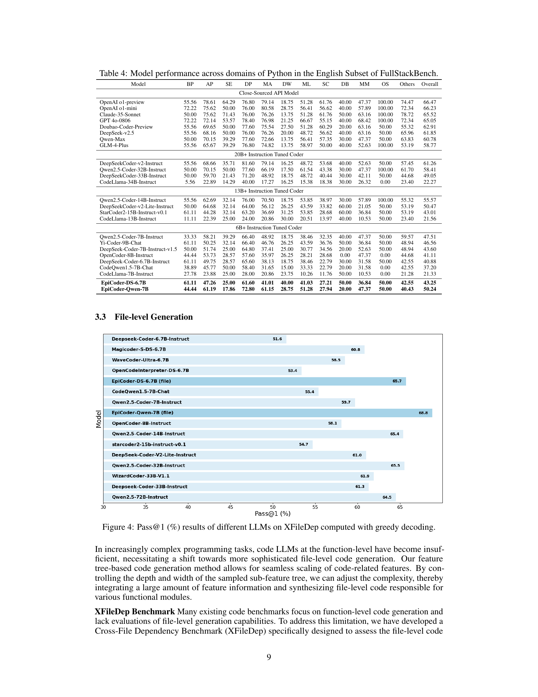
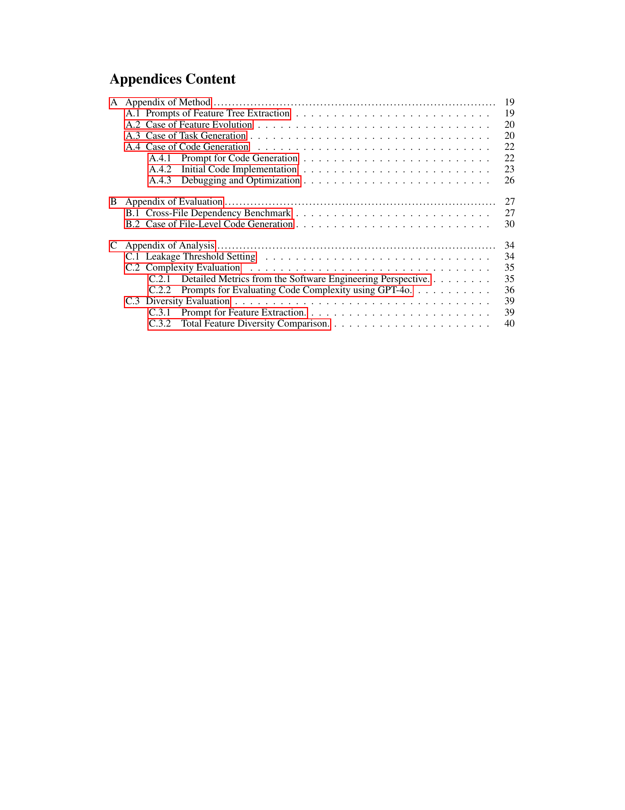
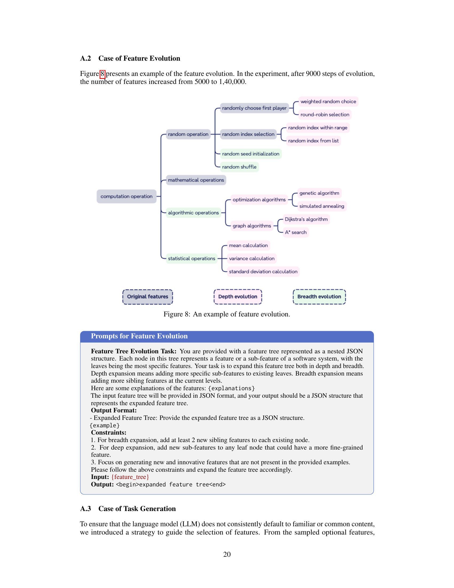

 


 2501.04694 
 Yaoxiang Wang et el. 
 
 🤗 2025-01-09 
 



↗ arXiv


↗ Hugging Face


↗ Papers with Code


### TL;DR



본 논문은 기존 코드 생성 모델의 한계를 극복하기 위한 새로운 접근 방식을 제시합니다. 기존 방법들은 단순 코드 스니펫에 의존하여 코드의 다양성과 복잡성을 제한하는 문제가 있었습니다. 이러한 문제점을 해결하기 위해, 본 논문에서는 **추상 구문 트리(AST)에서 영감을 얻은 새로운 기능 트리 기반의 데이터 합성 프레임워크**를 제안합니다. 이 프레임워크는 코드 요소 간의 의미론적 관계를 모델링하여 더욱 미묘하고 다양한 데이터 생성을 가능하게 합니다.  

본 논문에서 제안하는 방법은 **기능 트리를 반복적으로 개선**하여 코드의 복잡성을 제어하고 다양한 작업을 지원할 수 있습니다. 연구진은 이 프레임워크를 사용하여 EpiCoder 시리즈 모델을 만들었고, 이 모델은 여러 벤치마크에서 최첨단 성능을 달성했습니다. 특히, **파일 수준 코드 생성**에서 뛰어난 성능을 보였고, 복잡한 저장소 수준 코드 데이터 합성에서도 상당한 잠재력을 보였습니다. 또한, 소프트웨어 엔지니어링 원칙과 LLM 평가 방법론을 통해 데이터의 복잡성과 다양성을 철저히 평가하여, 본 연구의 장점을 뒷받침했습니다.



#### Key Takeaways


 새로운 기능 트리 기반 데이터 합성 프레임워크를 통해 다양하고 복잡한 코드 데이터를 생성했습니다. 



 EpiCoder 모델은 여러 코드 생성 벤치마크에서 최첨단 성능을 달성했습니다. 



 소프트웨어 엔지니어링 원칙 ë° LLM 평가 방법론을 사용하여 데이터의 복잡성과 다양성을 엄격히 평가했습니다. 


#### Why does it matter?
본 논문은 **다양하고 복잡한 코드 생성을 위한 새로운 데이터 합성 프레임워크**를 제시하여 코드 생성 모델의 성능 향상에 크게 기여합니다. 기존의 코드 스니펫 기반 방법론의 한계를 극복하고, **더욱 복잡하고 다양한 코드 데이터**를 생성하여 최첨단 성능을 달성한 EpiCoder 모델 개발에 성공했습니다. 이는 코드 생성 분야의 연구 동향에 중요한 영향을 미치고, 향후 연구 방향을 제시하는 의미를 가집니다.  **소프트웨어 엔지니어링 원칙 및 LLM 평가 방법론**을 활용한 엄격한 분석을 통해 데이터의 복잡성과 다양성을 평가하였으며, 이는 코드 생성 모델 개발 및 평가에 대한 새로운 관점을 제공합니다.

------
#### Visual Insights

> 🔼 그림 1은 EpiCoder-Qwen-7B 모델(Qwen2.5-Coder-7B-Base 모델을 fine-tuning하여 학습)과 다른 유사 모델들의 성능을 벤치마크한 결과를 보여줍니다. XFileDep는 파일 단위 코드 생성 벤치마크이고, 나머지는 함수 단위 코드 생성 벤치마크입니다.  각 모델의 HumanEval, MBPP, XFileDep, EvoEval, FullStackBench, BigCodeBench 벤치마크 결과를 정확도(%)로 나타내어 비교 분석합니다.  EpiCoder-Qwen-7B 모델은 다른 모델들에 비해 대부분의 벤치마크에서 높은 정확도를 보이는 것을 확인할 수 있습니다.
> 

> 
read the caption

> Figure 1: Benchmark performance of  EpiCoder-Qwen-7B (fine-tuned on Qwen2.5-Coder-7B-Base) and its counterparts. XFileDep is file-level code generation benchmark, all others are function-level.
> 


| Model | Base Model | HumanEval Base | HumanEval Plus | MBPP Base | MBPP Plus | Average |
|---|---|---|---|---|---|---|
| **Closed-source Model** |
| GPT-4-Turbo (April 2024) | - | 90.2 | 86.6 | 85.7 | 73.3 | 84.0 |
| GPT-4 (May 2023) | - | 88.4 | 79.3 | - | - | - |
| GPT-3.5-Turbo (Nov 2023) | - | 76.8 | 70.7 | 82.5 | 69.7 | 75.0 |
| claude-3-opus (Mar 2024) | - | 82.9 | 77.4 | 89.4 | 73.3 | 80.8 |
| claude-3-sonnet (Mar 2024) | - | 70.7 | 64.0 | 83.6 | 69.3 | 71.9 |
| claude-3-haiku (Mar 2024) | - | 76.8 | 68.9 | 80.2 | 68.8 | 73.7 |
| **7B+ Scale** |
| Qwen2.5-Coder-32B-Instruct | - | 92.1 | 87.2 | 90.5 | 77.0 | 86.7 |
| DeepSeek-Coder-V2-Instruct | - | 85.4 | 82.3 | 89.4 | 75.1 | 83.1 |
| OpenCoder-8B-Instruct | - | 81.7 | 77.4 | 82.0 | 71.4 | 78.1 |
| DeepSeek-Coder-33B-instruct | - | 81.1 | 75.0 | 80.4 | 70.1 | 76.7 |
| Codestral-22B-v0.1 | - | 79.9 | 73.8 | 72.5 | 61.9 | 72.0 |
| **~7B Scale** |
|  DSCoder-6.7B-Base | - | 47.6 | 39.6 | 72.0 | 58.7 | 54.5 |
| DeepSeekCoder-6.7b-Instruct |  | 74.4 | 71.3 | 74.9 | 65.6 | 71.6 |
| Magicoder-S-DS |  | 76.8 | 71.3 | 79.4 | 69.0 | 74.1 |
| WaveCoder-Ultra-6.7B |  | 75.0 | 69.5 | 74.9 | 63.5 | 70.7 |
| OpenCodeInterpreter-DS-6.7B |  | 77.4 | 72.0 | 76.5 | 66.4 | 73.1 |
| **EpiCoder-DS-6.7B** |  | 80.5 | 76.8 | 81.5 | 68.3 | 76.8 |
|  Qwen2.5-Coder-7B-Base | - | 61.6 | 53.0 | 76.9 | 62.9 | 63.6 |
| Qwen2.5-Coder-7B-Instruct |  | 88.4 | 84.1 | 83.5 | 71.7 | 81.9 |
| **EpiCoder-Qwen-7B** |  | 89.0 | 82.3 | 84.1 | 71.4 | 81.7 |

> 🔼 이 표는 HumanEval과 MBPP 코드 생성 벤치마크에서 다양한 대규모 언어 모델(LLM)의 성능을 보여줍니다.  greedy decoding 방식을 사용하여 평가되었으며, EvalPlus 리더보드의 결과를 통일적으로 제시합니다.  HumanEval(+) 및 MBPP(+)는 각 벤치마크의 확장 버전을 나타냅니다. 각 모델의 Pass@1 비율을 보여주어, 모델이 정답을 첫 번째 시도에서 제시했는지 여부를 나타냅니다.  모델은 기본 모델과 추가적인 미세조정 여부에 따라 나뉘어 비교됩니다. 이 표는 모델의 코드 생성 능력과 벤치마크에 대한 일반화 능력을 비교하는 데 도움이 됩니다.
> 

> 
read the caption

> Table 1: Pass@1 (%) results of different LLMs on HumanEval (+) and MBPP (+) computed with greedy decoding. We report the results uniformly from the EvalPlus Leaderboard 444https://evalplus.github.io/leaderboard.html.
> 

### In-depth insights

#### Feature-Tree Synthesis
**특징 트리 합성(Feature-Tree Synthesis)**은 본 논문에서 제시하는 핵심적인 방법론으로, 코드의 다양성과 복잡성을 포괄하는 데 중요한 역할을 합니다. 이는 추상적 구문 트리(AST)에서 영감을 얻었지만, **단순한 구문적 구조를 넘어 코드 요소 간의 의미적 관계를 모델링**함으로써 더욱 미묘하고 다양한 데이터 생성을 가능하게 합니다.  **기존의 코드 조각 기반 방법론의 한계를 극복**하기 위해,  **계층적 특징 트리를 사용**하여 코드 요소 간의 관계를 표현하고,  **트리의 깊이와 너비를 제어**하여 생성되는 코드의 복잡성을 조절합니다.  **반복적인 트리 진화 과정**을 통해 특징의 양과 다양성을 증가시키고, **다양한 복잡도의 코드 생성**을 지원합니다. 이러한 특징 트리 기반 합성 프레임워크는 **소프트웨어 엔지니어링 원칙과 LLM 평가 기법**을 통해 엄격하게 평가되었으며,  **데이터의 복잡성과 다양성을 향상**시키는 효과를 보였습니다.  결론적으로, **특징 트리 합성**은 효과적인 코드 생성을 위한 새로운 패러다임을 제시하며, 향후 연구에 귀중한 통찰력을 제공합니다.

#### EpiCoder: SOTA Results
EpiCoder는 여러 코드 생성 벤치마크에서 최첨단(SOTA) 성능을 달성한 새로운 코드 생성 모델입니다. **기능 수준** 벤치마크에서는 평균적으로 동일한 크기의 다른 모델들을 상당히 능가하는 성능을 보였습니다. 특히 **파일 수준** 벤치마크인 XFileDep에서 뛰어난 성과를 거두어 복잡한 다중 파일 시나리오를 효과적으로 처리하는 능력을 입증했습니다. 이러한 결과는 EpiCoder의 기반 모델을 **특별히 설계된 기능 트리 기반 합성 데이터**로 미세 조정한 덕분입니다. 이 데이터는 코드 요소 간의 의미 관계를 모델링하여 기존의 코드 스니펫 기반 데이터보다 **다양성과 복잡성이 훨씬 높습니다**.  EpiCoder의 SOTA 결과는 **대규모 코드 생성 모델의 잠재력**을 보여주는 동시에, **더욱 다양하고 복잡한 데이터 합성**의 중요성을 강조합니다.  향후 연구를 통해 더욱 복잡한 저장소 수준의 코드 데이터 합성에도 적용될 가능성이 시사되고 있습니다.

#### Complexity Metrics
논문에서 제시된 복잡도 측정 방법은 소프트웨어 엔지니어링 원칙과 LLM 기반 평가라는 **두 가지 관점**을 통해 다각적으로 접근합니다. 소프트웨어 엔지니어링 관점에서는 Halstead 복잡도, Strictness 복잡도, Cyclomatic 복잡도 등의 **기존 정량적 지표**를 사용하여 생성된 코드의 복잡도를 측정하고, 기존 데이터셋과 비교 분석합니다. 이를 통해 생성된 코드가 기존 코드보다 훨씬 높은 복잡도를 가지는 것을 확인하고, 특히 **파일 단위 코드에서는 복잡도가 훨씬 더 높게 나타남**을 보여줍니다.  **LLM 기반 평가**에서는 GPT-4를 활용하여 오류 처리, 모듈화, 데이터 구조, 외부 라이브러리 의존성 등 여러 측면에서 코드의 복잡성을 평가합니다.  **다양한 측면의 복잡도를 종합적으로 고려**함으로써, 단순한 정량적 지표만으로는 알 수 없는 코드의 복잡성에 대한 심층적인 이해를 제공합니다. 이러한 다차원적 분석을 통해, 본 연구에서 제시하는 코드 생성 방법의 효과성과 생성된 코드의 실용성을 뒷받침합니다. 특히, 높은 복잡도에도 불구하고 **실제 소프트웨어 개발 환경을 잘 반영**하는 고품질 데이터 생성을 가능하게 한다는 것을 시사합니다.

#### Diversity Analysis
다양성 분석은 코드 생성 모델의 성능을 평가하는 데 있어 매우 중요한 측면입니다.  **단순히 정확성만을 평가하는 것이 아니라, 생성된 코드의 다양성과 창의성을 측정하는 것**이 중요합니다. 본 논문에서는 다양한 코드 생성 방법론들을 비교 분석하여 각 방법론이 생성하는 코드의 다양성을 정량적으로 평가합니다. 특히, **기존 방법론들이 특정 기능이나 구조에 치우친 코드만 생성하는 반면, 본 논문의 방법론은 다양한 기능과 구조를 가진 코드를 생성**할 수 있음을 보여줍니다.  이는 **새로운 기능이나 구조를 학습하는 데 유리**하며, 결과적으로 **더욱 강력하고 유연한 코드 생성 모델을 개발**하는 데 기여할 수 있습니다. **다양한 벤치마크 데이터셋을 활용하여 실험적으로 검증**함으로써, 본 논문의 방법론이 코드의 다양성을 향상시키는 데 효과적임을 입증합니다.  **다양성 분석은 코드 생성 모델의 실제 활용 가능성을 평가**하는 데 중요한 지표가 되며, 본 논문의 결과는 코드 생성 분야의 발전에 큰 기여를 할 것으로 예상됩니다.

#### Repo-Level Potential
본 논문에서 제시된 특징 트리 기반 코드 합성 프레임워크는 **레포지토리 수준의 코드 생성**이라는 흥미로운 잠재력을 보여줍니다.  이는 단순히 함수 또는 파일 수준을 넘어, 실제 소프트웨어 프로젝트의 복잡성을 반영하는 다수의 상호 의존적인 파일로 구성된 레포지토리를 생성할 수 있는 가능성을 시사합니다.  **특징 트리의 계층적 구조**는 다양한 복잡도의 코드를 생성하는 데 유연성을 제공하며, 이를 통해 대규모 레포지토리 합성의 **확장성** 문제를 해결하는 데 도움이 될 수 있습니다.  **LLaMA-Factory 레포지토리**를 예시로 제시하여 50개 이상의 파일을 생성하는 데 성공함으로써, 이러한 잠재력을 실증적으로 보여주고 있습니다.  향후 연구는 **레포지토리 수준의 코드 생성**에 대한 심층적인 분석 및 개선을 통해, 보다 현실적이고 실용적인 대규모 소프트웨어 개발을 지원하는 데 기여할 수 있을 것으로 기대됩니다.  **다만, 레포지토리 수준의 코드 생성은 엄청난 계산 비용과 데이터 품질 관리의 어려움**을 수반할 수 있으므로, 효율적인 합성 방법과 엄격한 평가 기준을 마련하는 것이 중요할 것입니다.  **데이터 누수 문제** 또한 신중하게 고려해야 할 부분입니다.

### More visual insights

More on figures

> 🔼 그림 2는 본 논문에서 제안하는 feature tree 기반 코드 생성 프레임워크의 개요를 보여줍니다.  이 프레임워크는 크게 세 단계로 구성됩니다. 첫 번째 단계인 (a) Feature Tree Extraction에서는 먼저 feature set을 추출하여 tree 구조의 demonstration을 구성한 후, feature tree를 추출합니다. 두 번째 단계인 (b) Feature Tree Evolution에서는 feature tree를 반복적으로 깊이(depth)와 너비(breadth)로 확장하여 다양성을 높입니다. 마지막 단계인 (c) Feature Tree-Based Code Generation에서는 확장된 feature tree를 사용하여 다양한 코드 instruction 데이터를 생성합니다.  부록 A에는 feature evolution과 code generation의 자세한 예시가 나와있습니다.
> 

> 
read the caption

> Figure 2: Overview of our feature tree-based code generation framework, which consists of three steps: (a) Feature Tree Extraction, where we first extract the feature set to construct the tree structure demonstration and then extract the feature trees; (b) Feature Tree Evolution, where the feature tree is iteratively expanded in depth and breadth; and (c) Feature Tree-Based Code Generation, where the evolved feature tree is used to generate diverse code instruction data. A detailed example of feature evolution and code generation is shown in Appendix A.
> 

> 🔼 그림 3은 파일 단위 코드 생성의 한 예시를 보여줍니다. 테스트 코드 파일을 포함하여 서로 다른 파일들이 서로 다른 기능 모듈을 포함하고 있으며, 파일 간에 의존성이 존재함을 보여줍니다.  각 파일은 독립적인 기능을 수행하지만, 전체 시스템은 여러 파일 간의 상호작용을 통해 구현됩니다. 이는 실제 소프트웨어 개발에서 자주 볼 수 있는 복잡한 파일 구조와 의존성을 반영합니다.
> 

> 
read the caption

> Figure 3: An example of file-level code generation (including test code file). Different files contain different functional modules, with dependencies existing across files.
> 

> 🔼 그림 4는 XFileDep 벤치마크에서 다양한 LLMs의 성능을 보여줍니다. XFileDep는 여러 파일에 걸쳐 복잡하게 의존성이 있는 코드 생성을 평가하기 위해 특별히 고안된 벤치마크입니다. 그림은 각 모델이 그리디 디코딩(Greedy Decoding)을 사용하여 XFileDep 벤치마크에서 Pass@1 지표를 얼마나 달성했는지 보여줍니다. Pass@1은 모델이 생성한 코드가 테스트를 통과했는지 여부를 나타내는 지표입니다. 이 그림을 통해 파일 단위의 코드 생성 작업에서 각 모델의 성능을 비교 분석할 수 있습니다.
> 

> 
read the caption

> Figure 4: Pass@1 (%) results of different LLMs on XFileDep computed with greedy decoding.
> 

> 🔼 그림 5는 본 논문에서 제안하는 레포지토리 수준 코드 생성의 예시를 보여줍니다. 왼쪽은 원본 LLaMA-Factory 레포지토리의 구조를, 가운데는 추출된 특징 트리 기반으로 생성된 LLMTune의 구조를, 그리고 오른쪽은 생성된 레포지토리의 예시 파일을 보여줍니다.  본 그림은 단순히 코드 생성이 아닌, 실제 소프트웨어 프로젝트와 같은 복잡한 레포지토리 구조를 생성할 수 있음을 시각적으로 보여줍니다.  여러 파일 간의 상호 의존성과 프로젝트 구조의 복잡성을 효과적으로 나타내어, 본 논문에서 제안하는 방법론의 강점을 잘 드러냅니다.
> 

> 
read the caption

> Figure 5: An example of our repo-level code generation. The left part shows the original LLaMA-Factory repository structure, the middle part presents the structure of LLMTune, which we generated based on the extracted feature tree, and the right part illustrates an example file from the generated repository.
> 

> 🔼 그림 6은 다양한 데이터셋과 HumanEval, MBPP, BigCodeBench 세 가지 벤치마크 데이터셋 간의 코사인 유사도 분포를 보여줍니다.  각 데이터셋의 코드 조각들을 임베딩 벡터로 변환한 후, 코사인 유사도를 계산하여 데이터셋 간의 유사성 정도를 정량적으로 비교 분석합니다.  이를 통해 각 데이터셋의 고유 특징과 벤치마크 데이터셋과의 관계를 파악하고, 데이터 누수 가능성 및 데이터셋의 다양성을 평가할 수 있습니다.
> 

> 
read the caption

> Figure 6: The distribution of cosine similarity scores between different various datasets and the benchmark datasets HumanEval, MBPP, and BigCodeBench.
> 

> 🔼 그림 7은 코드 명령어 데이터의 스케일링 법칙을 보여줍니다. HumanEval, MBPP, BigCodeBench 세 가지 벤치마크에서 무작위로 추출한 380,000개 데이터 포인트의 하위 집합으로부터 얻은 결과를 보여줍니다.  이 그래프는 학습 데이터의 양이 증가함에 따라 세 가지 벤치마크 모두에서 모델 성능이 향상됨을 보여주는 스케일링 법칙을 시각적으로 나타냅니다. 특히 380,000개의 데이터 포인트에 도달해도 여전히 상승 추세가 나타나므로, 과적합을 효과적으로 방지할 만큼 충분한 다양성을 갖춘 데이터셋임을 시사합니다.
> 

> 
read the caption

> Figure 7: The scaling law of code instruction data. The results obtained from randomly sampled subsets of 380k data points across the HumanEval, MBPP, and BigCodeBench benchmarks.
> 

> 🔼 그림 8은 특징 진화의 예시를 보여줍니다. 이 그림은 9,000단계의 진화 후 특징의 수가 5,000개에서 140,000개로 증가한 것을 보여줍니다.  각 노드는 소프트웨어 시스템의 특징 또는 하위 특징을 나타내며, 잎 노드는 가장 구체적인 특징을 나타냅니다.  깊이 진화는 기존 잎 노드에 더 구체적인 하위 특징을 추가하는 것이고, 너비 진화는 기존 수준에 더 많은 형제 특징을 추가하는 것입니다. 그림은 깊이 진화와 너비 진화 모두를 보여줍니다.
> 

> 
read the caption

> Figure 8: An example of feature evolution.
> 

> 🔼 그림 9는 XFileDep 벤치마크 생성 과정을 보여주는 샌키 다이어그램입니다. 각 단계별 데이터 샘플 수를 숫자로 표시하여 데이터셋 구성 과정을 시각적으로 보여줍니다. 데이터 선택, 의존성 파일 선택, 필터링, 테스트 케이스 증강, 반복적인 테스트 코드 개선 등의 단계를 거쳐 최종적으로 930개의 테스트 케이스가 생성됩니다.
> 

> 
read the caption

> Figure 9: The Sankey diagram for the creation of the XFileDep benchmark, with numbers indicating the quantity of data samples.
> 

> 🔼 그림 10은 XFileDep 벤치마크 데이터셋 생성 과정에서 각 데이터 샘플의 파일 개수 분포와 평균 파일 길이를 보여줍니다.  왼쪽 그래프는 각 데이터 샘플에 포함된 파일의 개수 분포를 나타내며, 오른쪽 그래프는 각 데이터 샘플의 평균 파일 길이 분포를 보여줍니다. 이는 데이터 샘플의 복잡성과 크기의 다양성을 시각적으로 보여주는 지표입니다. 파일 개수와 평균 길이의 분포를 통해 XFileDep 데이터셋의 다양성과 복잡성을 파악할 수 있습니다.
> 

> 
read the caption

> Figure 10: the distribution of file quantities and the average file length for each data sample.
> 

> 🔼 그림 11은 HumanEval 벤치마크 데이터셋(왼쪽)과 evol-codealpaca-v1 데이터셋(오른쪽)의 다양한 유사도를 보여줍니다. 임베딩은 학습 데이터셋의 '출력' 부분과 HumanEval 벤치마크 데이터의 '프롬프트 + 정답'을 기반으로 계산됩니다.  이 그림은 서로 다른 유사도를 가진 HumanEval 벤치마크 데이터셋의 코드 예시와 evol-codealpaca-v1 데이터셋의 코드 예시를 보여줍니다.  높은 유사도는 데이터 유출 가능성을 시사하며, 유사도 점수가 높을 수록 데이터 유출 위험이 커집니다. 그림은 다양한 유사도 점수를 가진 여러 코드 예시를 보여주어 데이터 유출 여부를 판단하는 데 도움을 줍니다.
> 

> 
read the caption

> Figure 11: Cases from the HumanEval benchmark dataset (left) and the evol-codealpaca-v1 dataset (right) with varying similarity. The embeddings are computed based on the 'output' portions of the training dataset and the 'prompt + canonical_solution' of the HumanEval benchmark data.
> 

More on tables


| Model | Base | BigCodeBench-Full Complete | BigCodeBench-Full Instruct | BigCodeBench-Hard Complete | BigCodeBench-Hard Instruct | Avg |
|---|---|---|---|---|---|---|
| **Closed-source Model** |
| GPT-4o (May 2024) | - | 61.1 | 51.1 | 29.1 | 25.0 | 41.6 |
| DeepSeek-V2-Chat (June 2024) | - | 59.4 | 48.9 | 32.4 | 25.0 | 41.4 |
| Claude-3.5-Sonnet (June 2024) | - | 58.6 | 46.8 | 33.1 | 25.7 | 41.1 |
| **7B+ Scale** |
| Qwen2.5-Coder-32B-Instruct | - | 58.0 | 49.0 | 33.8 | 27.7 | 42.1 |
| DeepSeek-Coder-V2-Instruct | - | 59.7 | 48.2 | 29.7 | 24.3 | 40.5 |
| Llama-3.3-70B-Instruct | - | 57.5 | 46.9 | 28.4 | 28.4 | 40.3 |
| Codestral-22B-v0.1 | - | 52.5 | 41.8 | 24.3 | 16.9 | 33.9 |
| DeepSeek-Coder-33B-Instruct | - | 51.1 | 42.0 | 20.9 | 17.6 | 32.9 |
| OpenCoder-8B-Instruct | - | 50.9 | 43.2 | 18.9 | 18.2 | 32.8 |
| **∼ 7B Scale** |
|  DSCoder-6.7B-Base | - | 41.8 | - | 13.5 | - | - |
| DeepSeekCoder-6.7b-Instruct |  | 43.8 | 35.5 | 15.5 | 10.1 | 26.2 |
| Magicoder-S-DS |  | 47.6 | 36.2 | 12.8 | 13.5 | 27.5 |
| WaveCoder-Ultra-6.7B |  | 43.7 | 33.9 | 16.9 | 12.8 | 26.8 |
| OpenCodeInterpreter-DS-6.7B |  | 44.6 | 37.1 | 16.9 | 13.5 | 28.0 |
| **EpiCoder-DS-6.7B** |  | 50.6 | 37.9 | 19.6 | 12.8 | 30.2 |
|  |  |  |  |  |  |  |
|  Qwen2.5-Coder-7B-Base | - | 45.8 | - | 16.2 | - | - |
| Qwen2.5-Coder-7B-Instruct |  | 48.8 | 40.4 | 20.3 | 20.9 | 32.6 |
| **EpiCoder-Qwen-7B** |  | 51.9 | 43.8 | 27.7 | 22.3 | 36.4 |
> 🔼 이 표는 BigCodeBench 벤치마크에서 다양한 LLMs의 성능을 보여줍니다.  greedy decoding을 사용하여 평가되었으며,  Full 및 Hard 하위 벤치마크(Complete 및 Instruct 작업 포함)에서의 결과를 보여줍니다.  밑줄 친 결과는 해당 논문에서 가져온 것이고, 나머지는 BigCodeBench 리더보드에서 가져온 것입니다.  BigCodeBench는 다양한 프로그래밍 언어와 컴퓨터 과학 도메인을 포함하는 광범위한 벤치마크로, 코드 LLMs의 기능을 종합적으로 평가하는 데 사용됩니다.
> 

> 
read the caption

> Table 2: Pass@1 (%) results of different LLMs on BigCodeBench computed with greedy decoding. We conducted the evaluation on the Full and Hard subsets of this benchmark, including the Complete and Instruct tasks. Except for the results underlined, which are sourced from their respective papers, all other results are obtained from the BigCodeBench-Leaderboard666https://huggingface.co/spaces/bigcode/bigcodebench-leaderboard.
> 


| Model | Difficult | Creative | Subtle | Combine | Tool Use | Avg |
|---|---|---|---|---|---|---|
| **Closed-source Model** |  |  |  |  |  |  |
| GPT-4-Turbo | 50.0 | 61.0 | 82.0 | 45.0 | 69.0 | 61.4 |
| GPT-4 | 52.0 | 66.0 | 76.0 | 53.0 | 68.0 | 63.0 |
| Claude-3 | 50.0 | 53.0 | 81.0 | 42.0 | 69.0 | 59.0 |
| ChatGPT | 33.0 | 42.0 | 70.0 | 33.0 | 64.0 | 48.4 |
| Claude-3-haiku | 40.0 | 47.0 | 65.0 | 17.0 | 56.0 | 45.0 |
| **7B+ Scale** |  |  |  |  |  |  |
| DeepSeekCoder-33b-Instruct | 47.0 | 47.0 | 67.0 | 31.0 | 66.0 | 51.6 |
| WizardCoder-33b-1.1 | 48.0 | 48.0 | 66.0 | 20.0 | 64.0 | 49.2 |
| CodeLlama-70b-Instruct | 31.0 | 41.0 | 65.0 | 18.0 | 65.0 | 44.0 |
| OpenCoder-8B-Instruct | 45.0 | 50.0 | 73.0 | 28.0 | 50.0 | 49.2 |
| ~ **7B Scale** |  |  |  |  |  |  |
| DeepSeek-Coder-6.7B-base | 21.0 | 24.0 | 47.0 | 5.0 | 55.0 | 30.4 |
| DeepSeekCoder-6.7b-Instruct | 40.0 | 37.0 | 61.0 | 18.0 | 51.0 | 41.4 |
| Magicoder-S-DS-6.7B | 40.0 | 34.0 | 67.0 | 21.0 | 61.0 | 44.6 |
| WaveCoder-Ultra-6.7B | 38.0 | 42.0 | 71.0 | 24.0 | 35.0 | 42.0 |
| OpenCodeInterpreter-DS-6.7B | 43.0 | 37.0 | 65.0 | 25.0 | 51.0 | 44.2 |
| **EpiCoder-DS-6.7B** | 40.0 | 45.0 | 70.0 | 30.0 | 65.0 | 50.0 |
| Qwen2.5-Coder-7B-Base | 35.0 | 20.0 | 55.0 | 27.0 | 41.0 | 35.6 |
| Qwen2.5-Coder-7B-Instruct | 48.0 | 49.0 | 77.0 | 37.0 | 65.0 | 55.2 |
| **EpiCoder-Qwen-7B** | 53.0 | 48.0 | 78.0 | 47.0 | 68.0 | 58.8 |
> 🔼 본 표는 EvoEval 벤치마크에서 다양한 LLMs의 성능을 비교한 결과를 보여줍니다. EvoEval은 HumanEval을 여러 하위 도메인(Difficult, Creative, Subtle, Combine, Tool Use)으로 확장한 벤치마크이며, 각 도메인별 문제 해결 능력을 평가합니다. 표에는 각 모델의 Pass@1 (greedy decoding 사용) 결과가 도메인별, 그리고 평균 점수로 나타나 있습니다. Pass@1은 모델이 첫 번째 예측으로 정답을 맞힌 비율을 의미합니다.
> 

> 
read the caption

> Table 3: Pass@1 (%) results of different LLMs on EvoEval computed with greedy decoding.
> 


| Model | BP | AP | SE | DP | MA | DW | ML | SC | DB | MM | OS | Others | Overall |
|---|---|---|---|---|---|---|---|---|---|---|---|---|---|---|
| Close-Sourced API Model |  |  |  |  |  |  |  |  |  |  |  |  |  |
| OpenAI o1-preview | 55.56 | 78.61 | 64.29 | 76.80 | 79.14 | 18.75 | 51.28 | 61.76 | 40.00 | 47.37 | 100.00 | 74.47 | 66.47 |
| OpenAI o1-mini | 72.22 | 75.62 | 50.00 | 76.00 | 80.58 | 28.75 | 56.41 | 56.62 | 40.00 | 57.89 | 100.00 | 72.34 | 66.23 |
| Claude-35-Sonnet | 50.00 | 75.62 | 71.43 | 76.00 | 76.26 | 13.75 | 51.28 | 61.76 | 50.00 | 63.16 | 100.00 | 78.72 | 65.52 |
| GPT 4o-0806 | 72.22 | 72.14 | 53.57 | 78.40 | 76.98 | 21.25 | 66.67 | 55.15 | 40.00 | 68.42 | 100.00 | 72.34 | 65.05 |
| Doubao-Coder-Preview | 55.56 | 69.65 | 50.00 | 77.60 | 75.54 | 27.50 | 51.28 | 60.29 | 20.00 | 63.16 | 50.00 | 55.32 | 62.91 |
| DeepSeek-v2.5 | 55.56 | 68.16 | 50.00 | 76.00 | 76.26 | 20.00 | 48.72 | 56.62 | 40.00 | 63.16 | 50.00 | 65.96 | 61.85 |
| Qwen-Max | 50.00 | 70.15 | 39.29 | 77.60 | 72.66 | 13.75 | 56.41 | 57.35 | 30.00 | 47.37 | 50.00 | 63.83 | 60.78 |
| GLM-4-Plus | 55.56 | 65.67 | 39.29 | 76.80 | 74.82 | 13.75 | 58.97 | 50.00 | 40.00 | 52.63 | 100.00 | 53.19 | 58.77 |
| 20B+ Instruction Tuned Coder |  |  |  |  |  |  |  |  |  |  |  |  |  |
| DeepSeekCoder-v2-Instruct | 55.56 | 68.66 | 35.71 | 81.60 | 79.14 | 16.25 | 48.72 | 53.68 | 40.00 | 52.63 | 50.00 | 57.45 | 61.26 |
| Qwen2.5-Coder-32B-Instruct | 50.00 | 70.15 | 50.00 | 77.60 | 66.19 | 17.50 | 61.54 | 43.38 | 30.00 | 47.37 | 100.00 | 61.70 | 58.41 |
| DeepSeekCoder-33B-Instruct | 50.00 | 59.70 | 21.43 | 71.20 | 48.92 | 18.75 | 48.72 | 40.44 | 30.00 | 42.11 | 50.00 | 44.68 | 49.05 |
| CodeLlama-34B-Instruct | 5.56 | 22.89 | 14.29 | 40.00 | 17.27 | 16.25 | 15.38 | 18.38 | 30.00 | 26.32 | 0.00 | 23.40 | 22.27 |
| 13B+ Instruction Tuned Coder |  |  |  |  |  |  |  |  |  |  |  |  |  |
| Qwen2.5-Coder-14B-Instruct | 55.56 | 62.69 | 32.14 | 76.00 | 70.50 | 18.75 | 53.85 | 38.97 | 30.00 | 57.89 | 100.00 | 55.32 | 55.57 |
| DeepSeekCoder-v2-Lite-Instruct | 50.00 | 64.68 | 32.14 | 64.00 | 56.12 | 26.25 | 43.59 | 33.82 | 60.00 | 21.05 | 50.00 | 53.19 | 50.47 |
| StarCoder2-15B-Instruct-v0.1 | 61.11 | 44.28 | 32.14 | 63.20 | 36.69 | 31.25 | 53.85 | 28.68 | 60.00 | 36.84 | 50.00 | 53.19 | 43.01 |
| CodeLlama-13B-Instruct | 11.11 | 22.39 | 25.00 | 24.00 | 20.86 | 30.00 | 20.51 | 13.97 | 40.00 | 10.53 | 50.00 | 23.40 | 21.56 |
| 6B+ Instruction Tuned Coder |  |  |  |  |  |  |  |  |  |  |  |  |  |
| Qwen2.5-Coder-7B-Instruct | 33.33 | 58.21 | 39.29 | 66.40 | 48.92 | 18.75 | 38.46 | 32.35 | 40.00 | 47.37 | 50.00 | 59.57 | 47.51 |
| Yi-Coder-9B-Chat | 61.11 | 50.25 | 32.14 | 66.40 | 46.76 | 26.25 | 43.59 | 36.76 | 50.00 | 36.84 | 50.00 | 48.94 | 46.56 |
| DeepSeek-Coder-7B-Instruct-v1.5 | 50.00 | 51.74 | 25.00 | 64.80 | 37.41 | 25.00 | 30.77 | 34.56 | 20.00 | 52.63 | 50.00 | 48.94 | 43.60 |
| OpenCoder-8B-Instruct | 44.44 | 53.73 | 28.57 | 57.60 | 35.97 | 26.25 | 28.21 | 28.68 | 0.00 | 47.37 | 0.00 | 44.68 | 41.11 |
| DeepSeek-Coder-6.7B-Instruct | 61.11 | 49.75 | 28.57 | 65.60 | 38.13 | 18.75 | 38.46 | 22.79 | 30.00 | 31.58 | 50.00 | 42.55 | 40.88 |
| CodeQwen1.5-7B-Chat | 38.89 | 45.77 | 50.00 | 58.40 | 31.65 | 15.00 | 33.33 | 22.79 | 20.00 | 31.58 | 0.00 | 42.55 | 37.20 |
| CodeLlama-7B-Instruct | 27.78 | 23.88 | 25.00 | 28.00 | 20.86 | 23.75 | 10.26 | 11.76 | 50.00 | 10.53 | 0.00 | 21.28 | 21.33 |
| **EpiCoder-DS-6.7B** | **61.11** | **47.26** | **25.00** | **61.60** | **41.01** | **40.00** | **41.03** | **27.21** | **50.00** | **36.84** | **50.00** | **42.55** | **43.25** |
| **EpiCoder-Qwen-7B** | **44.44** | **61.19** | **17.86** | **72.80** | **61.15** | **28.75** | **51.28** | **27.94** | **20.00** | **47.37** | **50.00** | **40.43** | **50.24** |
> 🔼 표 4는 FullStackBench의 영어 하위 집합 내 파이썬 도메인 전반에 걸친 여러 모델의 성능을 보여줍니다.  다양한 프로그래밍 언어와 컴퓨터 과학 도메인을 포괄하는 FullStackBench의 포괄적인 특성을 감안할 때, 이 표는 다양한 실제 상황의 코딩 문제에 대한 모델의 일반화 능력을 평가하는 데 도움이 됩니다. 각 모델의 성능은 다양한 하위 도메인(예: 백엔드, API, 데이터 과학 등)에서 평가되며, 모델의 전반적인 코딩 능력을 포괄적으로 평가합니다.
> 

> 
read the caption

> Table 4: Model performance across domains of Python in the English Subset of FullStackBench.
> 


| Dataset | Unique Operators | Unique Operands | Total Operators | Total Operands |
|---|---|---|---|---|
| Code Alpaca [Chaudhary (2023)] | 4.83 | 8.22 | 10.66 | 15.89 |
| Evol CodeAlpaca [Luo et al. (2023)] | 7.94 | 18.97 | 29.91 | 46.70 |
| CodeFeedBack [Zheng et al. (2024b)] | 8.11 | 20.42 | 30.98 | 50.05 |
| OSS Instruct [Wei et al. (2024b)] | 7.44 | 20.99 | 28.05 | 47.55 |
| Ours (func-level) | 10.66 | 44.32 | 56.98 | 100.36 |
| Ours (file-level) | 11.64 | 72.87 | 100.24 | 179.98 |
> 🔼 본 표는 제안된 방법으로 생성된 코드와 기존 코드베이스 간의 Halstead 복잡도를 비교 분석한 결과를 보여줍니다. Halstead 복잡도는 소프트웨어의 복잡도를 측정하는 지표 중 하나로, 유일한 연산자 수, 유일한 피연산자 수, 총 연산자 수, 총 피연산자 수 등을 고려하여 계산됩니다. 표에는 제안된 방법(함수 수준 및 파일 수준)과 기존 코드베이스(Code Alpaca, Evol Code Alpaca, CodeFeedBack, OSS Instruct)의 유일한 연산자 수, 유일한 피연산자 수, 총 연산자 수, 총 피연산자 수를 비교하여 제안된 방법의 복잡도 특성을 보여줍니다.
> 

> 
read the caption

> Table 5: Comparison of Halstead complexity between ours and existing codebase.
> 


| Dataset | Mean | Median | Std |
|---|---|---|---| 
| Code Alpaca | 0.18 | 0.00 | 0.52 |
| Evol CodeAlpaca | 0.82 | 0.00 | 1.63 |
| CodeFeedBack | 0.97 | 0.00 | 2.09 |
| OSS Instruct | 1.50 | 1.00 | 2.19 |
| Ours (func-level) | 4.95 | 4.00 | 3.77 |
| Ours (file-level) | 5.41 | 4.00 | 3.85 |
> 🔼 표 6은 소프트웨어 공학 관점에서 본 코드 복잡도 분석 결과를 보여줍니다. 왼쪽은 엄격성 복잡도(Strictness Complexity), 오른쪽은 순환 복잡도(Cyclomatic Complexity)를 나타냅니다. 각 지표는 데이터셋별 평균, 중간값, 표준편차를 제시하여 코드의 구조적 복잡성과 제어 흐름 복잡성을 비교 분석합니다. 이를 통해 EpiCoder 데이터셋의 복잡성이 기존 데이터셋보다 훨씬 높음을 확인할 수 있습니다.
> 

> 
read the caption

> Table 6: Comparison of Strictness complexity (left) and Cyclomatic complexity (right).
> 


| Dataset | Mean | Median | Std |
|---|---|---|---| 
| Code Alpaca | 2.10 | 1.00 | 1.66 |
| Evol CodeAlpaca | 3.76 | 3.00 | 3.48 |
| CodeFeedBack | 3.96 | 3.00 | 3.33 |
| OSS Instruct | 3.45 | 3.00 | 2.98 |
| Ours (func-level) | 5.14 | 5.00 | 3.01 |
| Ours (file-level) | 14.93 | 14.00 | 6.73 |
> 🔼 GPT-4o를 사용하여 코드 복잡성을 평가한 결과를 보여주는 표입니다. 오류 처리, 모듈성, 데이터 구조 복잡성, 타사 종속성의 네 가지 측면에서 코드 복잡성을 평가하고 각 차원에 대한 점수를 부여하여 코드의 전반적인 복잡성을 평가합니다. 함수 수준과 파일 수준의 코드에 대한 평가 결과를 비교하여 각 수준에서의 복잡성을 분석합니다.
> 

> 
read the caption

> Table 7: Comparison of code complexity across four dimensions using GPT-4o.
> 


| Dataset | Error Handling | Modularity | Dependency | Data Structure | Avg. |
|---|---|---|---|---|---| 
| Code Alpaca | 2.04 | 2.10 | 2.09 | 2.38 | 2.15 |
| Evol CodeAlpaca | 2.53 | 3.32 | 2.66 | 3.58 | 3.02 |
| CodeFeedBack | 2.71 | 3.47 | 2.23 | 3.75 | 3.04 |
| OSS Instruct | 2.74 | 3.79 | 2.78 | 3.92 | 3.31 |
| Ours (func-level) | 4.11 | 4.71 | 3.83 | 4.90 | 4.39 |
| Ours (file-level) | 4.23 | 5.94 | 4.62 | 5.41 | 5.05 |
> 🔼 표 8은 다양한 코드 데이터셋에서 추출된 고유한 특징들의 분포를 보여줍니다.  각 데이터셋(Alpaca, CodeFeedback, Evol-Alpaca, OSS-Instruct, 그리고 본 논문의 함수 레벨 및 파일 레벨 데이터)에 대해 각 특징 유형(워크플로우, 구현 스타일, 기능, 자원 사용, 연산, 보안, 사용자 상호작용, 데이터 처리, 파일 조작, 오류 처리, 로깅, 종속성 관계, 알고리즘, 데이터 구조, 구현 로직, 고급 기법)별 고유 특징의 개수를 나타냅니다. 이를 통해 각 데이터셋의 특징 다양성을 비교 분석하고, 본 논문의 데이터셋이 다른 데이터셋보다 훨씬 더 다양한 특징을 포함하고 있음을 보여줍니다.
> 

> 
read the caption

> Table 8: Distribution of unique features.
> 


| Datasets | Workflow | Implementation | Style | Functionality | Resource | Usage | Computation | Operation | Security | User | Interaction | Data | Processing | Avg. |
|---|---|---|---|---|---|---|---|---|---|---|---|---|---|---|
| Alpaca | 994 | 6 | 393 | 7 | 282 | 8 | 82 | 221 |  | 11 | 54 | 1 | 43 | 2.48 |
| CodeFeedback | 2079 | 6 | 535 | 18 | 689 | 48 | 143 | 895 |  | 39 | 229 | 10 | 121 | 5.45 |
| Evol-Alpaca | 2163 | 11 | 591 | 21 | 783 | 60 | 134 | 1401 |  | 55 | 212 | 15 | 226 | 6.38 |
| OSS-Instruct | 2254 | 5 | 669 | 39 | 413 | 49 | 192 | 903 |  | 102 | 211 | 62 | 238 | 5.54 |
| Ours (func-level) | 2422 | 6 | 657 | 37 | 819 | 156 | 363 | 2533 |  | 203 | 357 | 96 | 305 | 8.53 |
| Ours (file-level) | 2475 | 11 | 812 | 43 | 536 | 103 | 800 | 2196 |  | 387 | 311 | 218 | 447 | 8.95 |
> 🔼 표 9는 930개의 데이터 샘플에 대해 테스트 함수와 테스트 케이스를 증강하기 전과 후의 비교를 보여줍니다.  증강 전에는 샘플당 평균 4.13개의 테스트 함수와 6.46개의 테스트 케이스가 있었지만, 증강 후에는 각각 8.53개와 15.38개로 증가했습니다.  테스트 함수의 최대 개수는 12에서 23으로, 테스트 케이스의 최대 개수는 20에서 44로 증가했습니다. 이는 테스트 범위를 크게 확장하여 코드의 견고성과 신뢰성을 향상시켰음을 나타냅니다.
> 

> 
read the caption

> Table 9: Comparison of Test Functions and Test Cases before and after augmentation for 930 data samples.
> 


| Implementation | Style |
|---|---|
> 🔼 표 10은 본 연구의 사례 연구에서 제시된 데이터 샘플의 인덱스를 보여줍니다. HumanEval 데이터셋과 evol-codealpaca-v1 데이터셋에서 유사도 점수가 99%, 95%, 90%, 85%인 데이터 샘플의 인덱스를 각각 제시하여 데이터 유출 가능성 여부를 분석하기 위한 자료로 활용되었습니다.  각 유사도 수준에 따라 HumanEval 데이터셋과 evol-codealpaca-v1 데이터셋에서 매칭되는 샘플의 인덱스가 다르다는 것을 보여줍니다.
> 

> 
read the caption

> Table 10: The index of the data samples presented in the case study.
> 


| Resource | Usage |
|---|---|
> 🔼 표 11은 Halstead 메트릭을 보여줍니다. 고유 연산자(n₁), 고유 피연산자(n₂), 총 연산자(N₁), 총 피연산자(N₂)를 기반으로 유도된 메트릭입니다. 이 표는 각 데이터셋에 대한 프로그램 길이, 어휘 크기, 볼륨, 난이도, 프로그래밍 노력, 예상 시간, 예측 버그 수를 보여줍니다. 이러한 메트릭을 통해 각 데이터셋의 복잡도를 정량적으로 비교할 수 있습니다.
> 

> 
read the caption

> Table 11: Derived Halstead metrics. These metrics are derived from unique operators (n1subscript𝑛1n_{1}italic_n start_POSTSUBSCRIPT 1 end_POSTSUBSCRIPT), unique operands (n2subscript𝑛2n_{2}italic_n start_POSTSUBSCRIPT 2 end_POSTSUBSCRIPT), total operators (N1subscript𝑁1N_{1}italic_N start_POSTSUBSCRIPT 1 end_POSTSUBSCRIPT), and total operands (N2subscript𝑁2N_{2}italic_N start_POSTSUBSCRIPT 2 end_POSTSUBSCRIPT).
> 


| Computation | Operation |
|---|---|
> 🔼 표 12는 다양한 제어 흐름 및 논리 연산의 빈도를 비교한 표입니다.  while, for, 예외 처리, return 등의 제어 구조와 논리 연산자(bool_op) 사용 빈도를 데이터셋별로 비교하여, 각 데이터셋의 코드 복잡도와 특징을 보여줍니다.  높은 빈도의 if, for, except, return 문은 더욱 복잡하고 다양한 예외 처리 시나리오를 처리하는 프로그램을 나타냅니다.
> 

> 
read the caption

> Table 12: Comparison of different control flow and logical operation frequencies.
> 


| User | Interaction |
|---|---|
> 🔼 표 13은 코드 엄격성 복잡도에 대한 자세한 지표를 보여줍니다. 코드의 엄격성은 코드 스타일, 예외 처리, 리턴 값 유효성 검사, 타입 힌트 등 여러 측면을 고려하여 평가됩니다. 이 표에서는 다양한 코드 데이터셋(Code Alpaca, Evol Code Alpaca, CodeFeedBack, OSS Instruct, 그리고 본 논문에서 제시하는 함수 및 파일 수준 데이터셋)에 대해 각 지표(Type Hints, Exception Handling, Doc Strings, Return Value Validation 등)의 평균 값을 비교 분석하여, 본 논문에서 제안하는 데이터셋이 코드 엄격성 측면에서 우수함을 보여줍니다.
> 

> 
read the caption

> Table 13: Detailed metrics of code strictness complexity
> 


| Data | Processing |
|---|---|
> 🔼 표 14는 1,000개의 코드 샘플에 걸쳐 추출된 총 기능의 분포를 보여줍니다.  각 샘플에서 GPT-40을 사용하여 다양한 범주(워크플로우, 구현 스타일, 기능성, 리소스 사용, 계산 연산, 보안, 사용자 상호 작용, 데이터 처리, 파일 조작, 오류 처리, 로깅, 종속성 관계, 알고리즘, 데이터 구조, 구현 논리, 고급 기술 등)에 걸쳐 기능을 추출했습니다. 이 표는 각 범주별 기능의 개수를 나타내어, 데이터셋의 다양성과 복잡성을 정량적으로 비교 분석하는 데 사용됩니다.  특히,  다양한 기능들의 분포를 통해 각 데이터셋의 강점과 약점을 파악할 수 있습니다.  예를 들어, 특정 범주에서 기능의 수가 많을수록 해당 데이터셋이 그 범주에 해당하는 지식을 더 많이 포함하고 있음을 시사합니다.
> 

> 
read the caption

> Table 14: Distribution of total features across 1k samples.
> 

### Full paper



