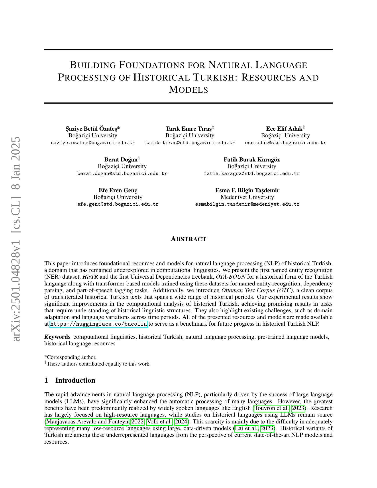
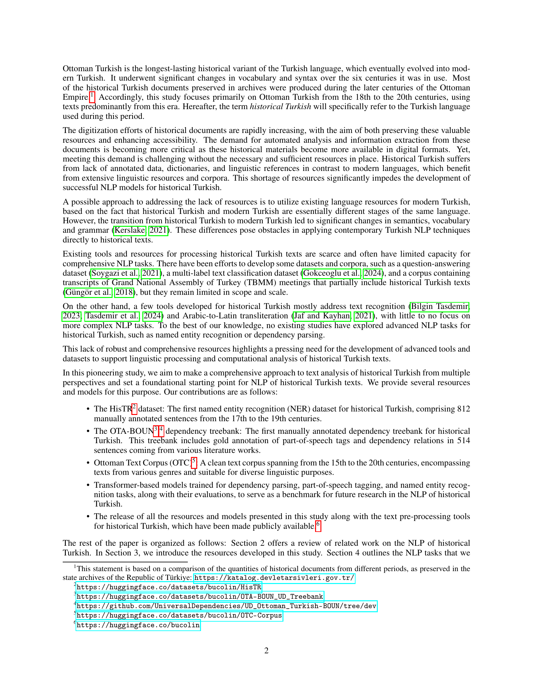

 


 2501.04828 
 Şaziye Betül Özateş et el. 
 
 🤗 2025-01-10 
 



↗ arXiv


↗ Hugging Face


↗ Papers with Code


### TL;DR



역사적 터키어는 컴퓨터 언어학에서 거의 연구되지 않은 분야입니다. 이는 **주석이 달린 데이터가 부족하고, 언어적 구조가 현대 터키어와 상당히 다르기 때문**입니다.  본 논문에서는 이러한 문제를 해결하기 위해 **역사적 터키어 NLP를 위한 기초적인 자원과 모델들을 제시**합니다.  기존 연구는 주로 OCR과 HTR에 초점을 맞추었지만, 이 논문은 NER, 의존성 분석, 형태소 분석 등의 고급 NLP 작업에 중점을 둡니다.

본 연구는 **최초의 NER 데이터 세트인 HisTR과 의존성 트리뱅크인 OTA-BOUN을 제시**합니다.  **HisTR은 812개의 수동으로 주석이 달린 문장으로 구성**되며, **OTA-BOUN은 514개의 문장을 포함한 의존성 트리뱅크**입니다.  또한, **15세기부터 20세기에 이르는 넓은 기간을 아우르는 청결한 역사적 터키어 말뭉치인 OTC도 함께 제시**합니다.  **이러한 자원을 바탕으로 사전 훈련된 변환기 기반 모델을 훈련하여, NER, 의존성 분석, 형태소 분석 과제에 대해 유망한 결과를 얻었습니다.**  이 연구는 역사적 터키어 NLP 분야에 대한 중요한 기여를 하며, 향후 연구의 기준을 제시합니다.



#### Key Takeaways


 최초의 역사적 터키어 NER 데이터셋(HisTR)과 의존성 트리뱅크(OTA-BOUN)를 구축 



 역사적 터키어에 대한 사전 훈련된 언어 모델을 활용하여 NER, 의존성 분석, 형태소 분석 등의 NLP 과제 수행 및 성능 평가 



 구축된 데이터셋과 모델들을 공개하여 향후 연구의 기준 마련 및 역사적 터키어 NLP 분야 발전에 기여 


#### Why does it matter?
**본 논문은 역사적 터키어 자연어 처리(NLP) 분야에 대한 중요한 기여를 합니다.**  **부족한 자원 문제를 해결하기 위해 새로운 NER 데이터 세트와 의존성 트리뱅크를 제공하며, 역사적 텍스트 분석을 위한 기반을 마련합니다.**  **또한, 기존의 사전 훈련된 언어 모델을 활용하여 다양한 NLP 과제에 대한 벤치마크를 설정함으로써, 해당 분야의 미래 연구를 위한 기준을 제시합니다.** 이는 **역사적 언어 연구와 NLP 기술 발전에 모두 중요한 영향을 미칩니다.**

------
#### Visual Insights

> 🔼 이 그림은 1896년부터 1901년까지 발행된 잡지인 'Servet-i Funun'의 원본 페이지와 그 일부를 현대 터키어 알파벳으로 옮겨 적은 내용을 보여줍니다. 원본 문서는 페르시아-아랍 문자로 작성되었으며, 그림은 원본 문서의 이미지와 현대 터키어로 된 해당 부분의 필사본을 함께 보여줌으로써 당시 사용되었던 언어의 형태와 현대 터키어와의 차이를 이해하는 데 도움을 줍니다. 이는 시각적인 자료를 통해 역사적 맥락에서의 언어 변화를 보여주는 예시입니다.
> 

> 
read the caption

> Figure 1:  Transcription of an excerpt from the original document which is written with the Perso-Arabic script.
> 


| Partition | # of Sentences | PERSON Counts | LOCATION Counts |
|---|---|---|---|
| Training set | 462 | 264 | 584 |
| Development set | 200 | 122 | 210 |
| *Ruznamçe* test set | 150 | 265 | 216 |
| **Total** | 812 | 651 | 1,010 |

> 🔼 HisTR 데이터셋의 분할 정보를 보여주는 표입니다. 학습 데이터, 개발 데이터, 그리고 Ruznamçe 테스트 데이터셋으로 나뉘어 각 데이터셋의 문장 수와 PERSON, LOCATION 개체의 수를 보여줍니다. Ruznamçe 테스트 데이터셋은 다른 데이터셋보다 어휘 및 표현에 있어 다양성을 보이므로 모델 평가에 도움이 됩니다.
> 

> 
read the caption

> Table 1:  Partitions in the HisTR dataset
> 

### In-depth insights

#### HisTR NER Dataset
HisTR NER 데이터셋은 **역사적 터키어에 대한 최초의 명명된 개체 인식(NER) 데이터셋**으로서, 컴퓨터 언어학 분야에서 상대적으로 덜 연구되었던 영역에 대한 중요한 기여를 합니다. 이 데이터셋은 **17세기부터 19세기까지의 서브트 푸눈(Servet-i Funun) 저널의 문장들을 수동으로 주석 처리**하여 제작되었으며, **인물 및 장소와 같은 명명된 개체들을 식별**하는 데 도움이 됩니다. **다양한 어휘 및 문법 구조**를 포함하여 역사적 터키어의 언어적 다양성을 보여주는 것이 특징입니다. HisTR은 다양한 시대의 문서를 포괄하여 **시대에 따른 언어 변화**를 고려한 모델 개발 및 평가에 사용할 수 있는 유용한 자원입니다.  또한, 이 데이터셋은 **모델 성능 평가를 위한 기준점**을 제공하고 역사적 터키어 NLP의 미래 발전에 기여할 것입니다.  **데이터셋의 제한점**으로는 상대적으로 적은 크기와 특정 기간의 문서에 대한 편향 등이 있습니다. 그럼에도 불구하고, HisTR은 역사적 터키어 NLP 연구 발전에 있어 중요한 이정표가 될 것으로 기대됩니다.

#### OTA-BOUN Treebank
본 논문에서 제시된 OTA-BOUN 트리뱅크는 **역사적인 터키어에 대한 최초의 유니버설 의존성 트리뱅크**로서, 컴퓨터 언어학 분야에서 상당히 중요한 의미를 가집니다.  **1880년에서 1928년 사이의 다양한 문학 작품에서 수집된 514개의 문장**을 수동으로 주석 처리하여, 역사적인 터키어의 구문 구조를 면밀히 분석하고, 형태소 분석 및 의존성 파싱에 대한 중요한 자료를 제공합니다.  **라틴 알파벳과 페르시아-아랍 알파벳 두 가지 표기법**으로 작성되어 있으며, 이는 역사적인 터키어의 다양한 측면을 포괄적으로 이해하는 데 도움이 될 것입니다.  **어휘 및 문법적 변화**를 고려하여 주석을 달았다는 점 또한 주목할 만합니다.  OTA-BOUN 트리뱅크는 향후 컴퓨터 언어학 연구에 기여할 뿐만 아니라, **역사적인 터키어 자원의 부족 문제를 해결**하는 데 크게 기여할 것으로 예상됩니다. 특히, 역사적 언어 처리 모델 개발에 있어서 **기준점 역할**을 할 것으로 보입니다.

#### Model Experimentation
모델 실험 부분은 본 논문에서 **역사적 터키어 자연어 처리를 위한 다양한 사전 훈련된 언어 모델의 성능을 비교 분석**하는 데 중점을 둡니다.  **BERTurk, mBERT, TURNA와 같은 여러 모델을 사용하여 NER, 의존성 구문 분석 및 품사 태깅 작업에 대한 실험 결과**를 제시합니다.  **각 모델의 성능은 정밀도, 재현율, F1 점수로 측정**되며, 이를 통해 역사적 터키어의 특성을 고려한 모델 선택 및 최적화 전략을 제시합니다. 특히, **역사적 텍스트의 특수성으로 인한 도전 과제와 제한 사항**에 대한 심도 있는 논의를 포함하고 있습니다.  **대규모 현대 터키어 데이터셋을 활용한 파인튜닝**이 역사적 터키어 모델 성능 향상에 미치는 영향과 함께, **소규모 역사적 터키어 데이터셋만을 이용한 훈련**의 결과도 제시되어, 데이터셋 크기의 영향을 분석합니다.  결론적으로, 본 논문의 모델 실험 부분은 **역사적 터키어 자연어 처리 분야의 발전에 기여하는 중요한 실험적 결과**와 함께, 향후 연구 방향에 대한 시사점을 제공합니다.

#### Historical Turkish NLP
역사적 터키어 자연어 처리(Historical Turkish NLP)는 **희소 언어** 및 **역사적 언어 변이**로 인해 난관에 직면하는 분야입니다. 이 논문은 **역사적 터키어 말뭉치 구축** 및 **명명된 개체 인식(NER)**, **의존성 분석**, **품사 태깅**을 위한 모델 개발이라는 **중요한 기여**를 보여줍니다.  **HisTR**과 같은 NER 데이터셋과 **OTA-BOUN**과 같은 의존성 트리뱅크는 이러한 노력의 중심에 있습니다.  이러한 자원들은 **기계 번역 및 정보 추출** 등 다양한 NLP 작업에 필수적입니다.  하지만, **역사적 언어의 특수성** 때문에 이 연구는 **전처리 과정의 어려움**, **전문가 수동 주석의 필요성**, **최신 모델의 도메인 적응 문제** 등의 과제도 함께 제시합니다.  **다양한 시대의 문헌 포괄**을 위한 말뭉치 확장은 향후 과제이며, **다양한 시대의 언어적 특징을 포착**하는 강력한 모델 개발을 위한 지속적인 연구가 필요합니다.  **BERTurk, mBERT, TURNA**와 같은 사전 훈련된 모델의 활용은 **제한된 데이터 문제**를 해결하는 데 도움이 되지만, **역사적 터키어의 고유한 언어적 구조**를 완벽히 포착하지 못하는 한계를 보입니다. 따라서 **역사적 터키어의 특징을 반영한 새로운 모델** 개발을 위한 지속적인 연구가 필요합니다. 결론적으로, 이 연구는 역사적 터키어 NLP 분야에 대한 중요한 토대를 마련하지만, 더욱 심도있는 연구가 필요하다는 점을 시사합니다.

#### Future Research
본 논문은 역사적 터키어 자연어 처리를 위한 기초 연구로서, **역사적 터키어 말뭉치 구축 및 주석 작업의 중요성**을 강조합니다.  향후 연구는 **다양한 시대의 방대한 말뭉치 확보**를 통해 시대에 따른 언어 변화를 더욱 정교하게 분석하고 모델 성능을 향상시켜야 합니다.  **저자들은 다양한 시대의 문서를 포함하는 확장된 말뭉치를 구축하고, 다양한 어휘 및 구문 구조를 포괄하는 새로운 자원을 개발**할 것을 제안합니다.  또한, **OCR 및 HTR 기술 개선을 통한 데이터 전처리 과정 개선** 및 **다양한 NLP 작업에 대한 새로운 모델 및 도구 개발**도 중요한 미래 연구 과제입니다. 특히, **역사적 터키어의 독특한 언어적 특징을 고려한 새로운 어노테이션 방식 개발**은 정확성을 높이는 데 기여할 것입니다. **다양한 NLP 기술과 기계 학습 기법을 결합한 통합적 접근 방식**을 통해 보다 효율적인 자연어 처리 시스템 개발을 위한 연구가 필요합니다.  **저자들이 공개한 자료들을 활용한 후속 연구**와 **다양한 외부 연구자들과의 협력을 통한 연구 확장** 역시 중요한 부분입니다.

### More visual insights

More on figures

> 🔼 그림 2는 본 논문의 OTA-BOUN 역사 튀르키예어 트리뱅크의 예시 문장에 대한 CoNLL-U 표현 방식을 보여줍니다. CoNLL-U는 의존성 구문 분석 결과를 나타내는 표준 형식으로, 각 단어의 형태소 정보, 어근,품사 태그, 그리고 다른 단어와의 의존 관계를 보여줍니다. 그림에서는 각 단어의 형태소 정보, 어근, 품사 태그, 의존 관계, 그리고 라틴 알파벳과 아랍 알파벳 표기가 함께 제시되어 있습니다. 이를 통해 역사 튀르키예어 문장의 구조적 특징과 형태소 분석 결과를 명확하게 이해할 수 있도록 도와줍니다.
> 

> 
read the caption

> Figure 2: CoNLL-U Representation of an example sentence from our OTA-BOUN historical Turkish treebank.
> 

> 🔼 그림 3은 오스만 텍스트 말뭉치의 문서들을 t-SNE 기법을 사용하여 시각화한 것입니다. 각 점은 하나의 문서를 나타내며, 색상은 문서의 주제를 나타냅니다. 이 시각화는 말뭉치 내의 주제적 클러스터를 강조하고, 어휘 다양성과 주제를 보여주는 지도를 보완하여 주제가 시간에 따라 어떻게 분포하는지를 보여줍니다.
> 

> 
read the caption

> Figure 3: t-SNE visualization of documents in the Ottoman Text Corpus: Each point represents a document, color-coded by topic. This visualization highlights thematic clusters within the corpus and shows how topics are distributed periodically, complementing the map’s representation of vocabulary diversity and topic.
> 

More on tables


| Features | The OTA-BOUN Treebank |
|---|---| 
| Num. of Sentences | 514 |
| Num. of Tokens | 8,794 |
| Avg. Token Count Per Sentence | 17.10 |
| Num. of Unique POS Tags | 16 |
| Num. of Unique Morphological Features | 52 |
| Num. of Unique Dependencies | 40 |
> 🔼 표 2는 본 논문에서 제작한 OTA-BOUN 역사 터키어 트리뱅크의 통계 정보를 보여줍니다.  표에는 문장 수, 토큰 수, 문장 당 평균 토큰 수, 고유 형태소 태그 수, 고유 형태소 특징 수, 고유 의존성 수 등 트리뱅크의 주요 특징이 포함되어 있습니다. 이러한 통계는 역사 터키어의 언어적 특징을 이해하는 데 도움을 줍니다.  평균 문장 길이, 특정 관계의 빈도 등을 보여주는 통계는 트리뱅크의 특징을 요약하여 보여주는 역할을 합니다.
> 

> 
read the caption

> Table 2: Some statistics of the OTA-BOUN historical Turkish treebank
> 


| Relation Type | Count | % | Relation Type | Count | % |
|---|---|---|---|---|---| 
| acl | 348 | 3.95 | dislocated | 5 | 0.06 |
| advcl | 197 | 2.24 | fixed | 6 | 0.07 |
| advmod | 396 | 4.49 | flat | 87 | 0.99 |
| advmod:emph | 87 | 0.99 | goeswith | 5 | 0.06 |
| amod | 620 | 7.04 | iobj | 26 | 0.30 |
| appos | 2 | 0.02 | mark | 27 | 0.31 |
| aux | 39 | 0.44 | nmod | 137 | 1.55 |
| case | 257 | 2.92 | nmod:poss | 746 | 8.47 |
| cc | 228 | 2.59 | nsubj | 507 | 5.75 |
| cc:preconj | 12 | 0.14 | nsubj:pass | 22 | 0.25 |
| ccomp | 120 | 1.36 | nummod | 57 | 0.65 |
| compound | 76 | 0.86 | obj | 557 | 6.32 |
| compound:lvc | 246 | 2.79 | obl | 873 | 9.91 |
| compound:redup | 33 | 0.37 | obl:agent | 4 | 0.05 |
| conj | 607 | 6.89 | orphan | 4 | 0.05 |
| cop | 48 | 0.54 | parataxis | 10 | 0.11 |
| csubj | 42 | 0.48 | punct | 1207 | 13.70 |
| dep | 14 | 0.16 | root | 514 | 5.83 |
| det | 508 | 5.76 | vocative | 7 | 0.08 |
| discourse | 82 | 0.93 | xcomp | 49 | 0.56 |
> 🔼 OTA-BOUN 트리뱅크의 의존 관계 유형에 대한 개수와 백분율을 보여주는 표입니다. 각 의존 관계 유형의 개수와 전체 트리뱅크에서 차지하는 비율을 보여줍니다. 이 표는 역사적 터키어 트리뱅크의 구문 구조를 분석하는 데 유용한 정보를 제공합니다.
> 

> 
read the caption

> Table 3: Counts and percentages of dependency relation types in the OTA-BOUN treebank
> 


|             | **TR-BOUN** | **IMST-UD** | **OTA-BOUN** |
|-------------|-------------|-------------|-------------|
| Avg. token count per sentence | 12.41        | 10.01        | 17.10        |
| conj (%)     | 5.66         | 4.96         | 6.89         |
| compound:lvc (%) | 1.0          | 0.90         | 2.79         |
| acl (%)      | 2.78         | 2.64         | 3.95         |
> 🔼 표 4는 토큰 및 의존성 메트릭 측면에서 가장 많이 사용되는 두 개의 현대 터키어 트리뱅크와 역사적 터키어 트리뱅크를 비교한 표입니다.  평균 토큰 수, 접속사 비율, 가벼운 동사 복합 비율, 그리고 관형절 비율 등의 메트릭을 통해 역사적 터키어와 현대 터키어의 구문 구조 차이를 보여줍니다.  특히, 역사적 터키어는 현대 터키어보다 문장이 훨씬 길고, 접속사와 관형절의 사용 빈도가 높다는 것을 보여줍니다.
> 

> 
read the caption

> Table 4: Comparison of historical Turkish treebank with the two most frequently used modern Turkish treebanks in terms of token and dependency metrics
> 


| Expected Text | Extracted Text | Error Analysis |
|---|---|---|
| Dilberün her handesi bin can bağışlar e aşuya | Dil-beruñ her òandesi biñ cÀn baàışlar èÀşıúa | Diacritical Encoding Error: Unicode normalization failure in historical Turkish diacritics and characters. The system incorrectly encodes special characters ’ñ’ and ’À’, resulting in ambiguity. Technical cause: Non-standardized Unicode point mapping for Ottoman-specific diacritics. |
| Bu mutabakatla beraber, keşf edilen eski yazıldığı veçhile Türkçe karşılığı lafzıdır. | Bu mutabakatle beraber, keşf edilen eski ya WU J. ıS i J e Ha Tı Ye Kef Lam Mim Nun te de yazıldığı veçhile Türkçe karşılığı lafzıdır. | Script Conversion Error: Critical failure in Arabic-Latin script conversion pipeline. OCR system’s inability to properly map Arabic script ligatures to Latin characters due to contextual shape variations. Root cause: Inadequate handling of Unicode ranges U+0600-U+06FF. |
| GÜRİZ yahut GÜRİZGAH: | G Ü R ÎZ : , yâhut G Ü R İZ G Â H : | Word Segmentation Error: Tokenization algorithm failure in word recognition. Improper word boundary detection caused by missing morphological analysis support. Technical impact: Loss of semantic unity in words. |
| HİSÂB-ı CÜMEL: Ebced hisâbının diğer adıdır | HtSÂB-t C Ü M EL: Ebced hi-sâbının diğer adıdır | Character Substitution Error: Systematic misclassification of Turkish ’İ’ character as ’t’. Error stems from inadequate training data representation of Turkish-specific uppercase dotted ’İ’. Technical cause: Unicode point confusion between U+0130 and U+0074. |
| İran şâirlerinden: Şevket Ferâhî’nin | İran şâirlerinden:  J i j Z j S ’ C j | Mixed Script Error: Complete text fragmentation due to script detection failure. System’s inability to maintain consistent character encoding across different writing systems. Root cause: Inadequate handling of bi-directional text rendering. |
> 🔼 표 5는 디지털 변환 과정에서 발생하는 오류의 유형과 원인을 분석한 예시를 보여줍니다.  역사적 터키어 문서의 디지털화 과정에서 발생하는 다양한 기술적 문제점(예: 문자 인코딩 오류, 스크립트 변환 오류, 단어 분절 오류, 문자 치환 오류, 혼합 스크립트 오류)을 보여주고, 각 오류의 기술적 원인과 영향을 분석하여 문제 해결을 위한 방향을 제시합니다.  각 오류 유형에 대한 예시 문장과 함께 오류의 발생 원인과 결과를 구체적으로 설명합니다.
> 

> 
read the caption

> Table 5: Analysis of sample text extraction errors in digital conversion of historical Turkish documents
> 


| Model Descriptions |  |  |  |  |  |  |
|---|---|---|---|---|---|---|
| **BERTurk+MilliyetNER** | BERTurk fine-tuned only using MilliyetNER, a large NER dataset for modern Turkish. |  |  |  |  |  |
| **BERTurk+MilliyetNER+HisTR** | BERTurk+MilliyetNER further fine-tuned using HisTR, the small dataset for historical Turkish. |  |  |  |  |  |
| **BERTurk+HisTR** | BERTurk fine-tuned only using HisTR. |  |  |  |  |  |
| **mBERT+WikiANN+HisTR** | mBERT fine-tuned on WikiANN, a large multilingual NER dataset, and further fine-tuned using HisTR. |  |  |  |  |  |
| **mBERT+HisTR** | mBERT fine-tuned only using HisTR. |  |  |  |  |  |
| **TURNA+MilliyetNER+HisTR** | TURNA fine-tuned on MilliyetNER and further fine-tuned using HisTR. |  |  |  |  |  |
| **Model Performance** |  |  |  |  |  |  |
|---|---|---|---|---|---|---|
|  | HisTR Development Set |  |  | _Ruznamçe_ Test Set |  |  |
| **Name** | **Prec.** | **Recall** | **F1** | **Prec.** | **Recall** | **F1** |
|---|---|---|---|---|---|---|
| **BERTurk+MilliyetNER** | 75.39 | 71.99 | 73.65 | 53.84 | 61.95 | 57.58 |
| **BERTurk+MilliyetNER+HisTR** | **90.26** | **92.17** | **91.21** | **59.92** | **64.03** | **61.91** |
| **BERTurk+HisTR** | 88.63 | 91.57 | 90.07 | 54.49 | 61.75 | 57.89 |
| **mBERT+WikiANN+HisTR** | 80.73 | 87.05 | 83.77 | 41.17 | 41.93 | 41.49 |
| **mBERT+HisTR** | 83.95 | 88.25 | 86.05 | 43.19 | 42.20 | 42.69 |
| **TURNA+MilliyetNER+HisTR** | 77.62 | 80.26 | 78.92 | 57.61 | 41.58 | 48.30 |
> 🔼 표 6은 HisTR 데이터셋의 도메인 내 개발 및 도메인 외 테스트 세트에서 BERTurk, mBERT 및 TURNA NER 모델의 전반적인 성능을 보여줍니다.  여러 가지 미세 조정 세트 조합을 사용한 결과를 보여줍니다.  즉, 각 모델이 여러 가지 조합의 학습 데이터로 학습되었을 때의 성능을 비교 분석한 표입니다.  이는 단일 모델(단일 학습 데이터)의 성능만 보여주는 것이 아니라,  다양한 학습 전략을 사용했을 때의 성능 차이를 보여주어,  어떤 조합의 학습 데이터가 가장 효과적인지 판단하는 데 도움을 줍니다.
> 

> 
read the caption

> Table 6:  The overall performance of BERTurk, mBERT, and TURNA NER models on the in-domain development and out-of-domain test sets of the HisTR dataset when using different combinations of fine-tuning sets
> 


| Model Descriptions |  | OTA-BOUN Test Set (Historical Turkish) |  TR-BOUN Test Set (Modern Turkish) | 
|---|---|---|---|---:
| STEPSBERTurk+TR_BOUN | STEPS parser with BERTurk, fine-tuned only using TR_BOUN, a large dependency treebank for modern Turkish. |  |  | 
| STEPSBERTurk+TR_BOUN+OTA_BOUN | STEPSBERTurk+TR_BOUN further fine-tuned using OTA_BOUN, a small treebank for historical Turkish. |  |  | 
| STEPSBERTurk+OTA_BOUN | STEPS parser with BERTurk, fine-tuned only using OTA_BOUN |  |  | 
| STEPSmBERT+TR_BOUN | STEPS parser with BERTurk, fine-tuned only using TR_BOUN. |  |  | 
| STEPSmBERT+TR_BOUN+OTA_BOUN | STEPSmBERT+TR_BOUN further fine-tuned using OTA_BOUN. |  |  | 
| STEPSmBERT+OTA_BOUN | STEPS parser with mBERT, fine-tuned only using OTA_BOUN. |  |  | 
| Model Performance |  |  |  | 
|---|---|---|---|---:
| Name | Tra. Size | UAS | LAS | UPOS F1 | UAS | LAS | UPOS F1 | 
| STEPSBERTurk+TR_BOUN | 7,803 | 79.92 | 71.29 | 94.76 | 83.11 | 76.55 | 93.00 |
| STEPSBERTurk+TR_BOUN+OTA_BOUN | 7,917 | 81.51 | 73.79 | 94.98 | 83.15 | 76.58 | 93.07 |
| STEPSBERTurk+OTA_BOUN | 114 | 68.87 | 59.70 | 91.56 | 68.66 | 59.16 | 87.21 |
| STEPSmBERT+TR_BOUN | 7,803 | 72.96 | 64.32 | 92.26 | 79.61 | 72.05 | 92.75 |
| STEPSmBERT+TR_BOUN+OTA_BOUN | 7,917 | 75.86 | 67.87 | 93.12 | 79.60 | 72.18 | 92.78 |
| STEPSmBERT+OTA_BOUN | 114 | 61.43 | 49.62 | 88.68 | 59.55 | 46.56 | 84.54 |
> 🔼 표 7은 BERTurk 및 mBERT 기반 모델의 성능을 OTA-BOUN 및 TR-BOUN 트리뱅크의 테스트 세트에서 보여줍니다.  여러 미세 조정 설정의 조합에 따른 결과를 보여줍니다. UAS(Unlabeled Attachment Score)와 LAS(Labeled Attachment Score)는 의존성 관계를 구성하는 모델의 성능을 평가하는 데 사용되는 지표이며, 각각 레이블이 없는 부착 점수와 레이블이 있는 부착 점수를 나타냅니다. UPOS F1은 유니버설 POS 태그를 예측하는 시퀀스 태거 모델의 F1 점수를 나타냅니다.
> 

> 
read the caption

> Table 7:  The overall performance of BERTurk- and mBERT-based models on the test sets of the OTA-BOUN and TR-BOUN treebanks, presented for different combinations of fine-tuning sets. UAS and LAS represent unlabeled and labeled attachment scores, respectively, which are used to evaluate the models’ performance in constructing dependency relations. UPOS F1 refers to the F1 score of the sequence tagger models in predicting the universal POS tags of words in the corresponding test sets.
> 

### Full paper



