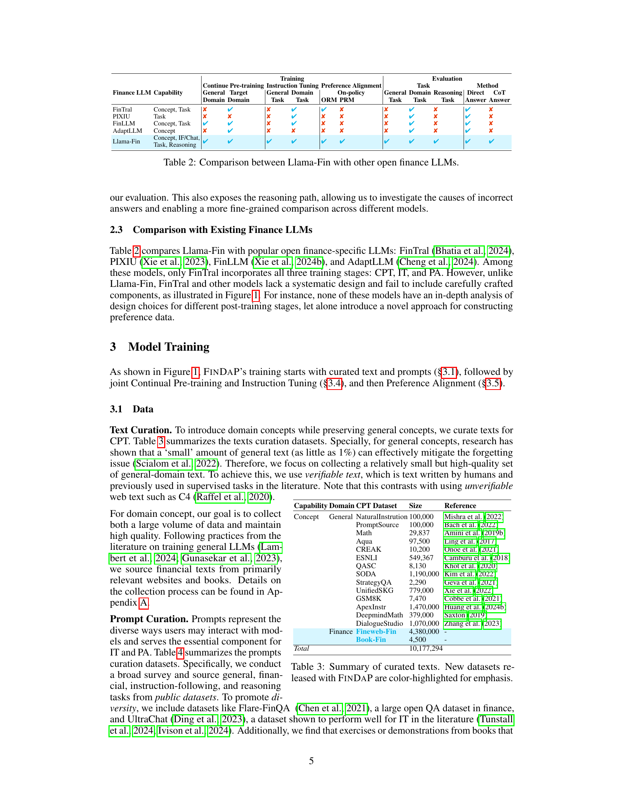

 


 2501.04961 
 Zixuan Ke et el. 
 
 🤗 2025-01-13 
 



↗ arXiv


↗ Hugging Face


↗ Papers with Code


### TL;DR



대규모 언어 모델(LLM)은 다양한 작업에서 강력한 일반화 능력을 보이지만, 금융과 같이 특수한 도메인에서는 어려움을 겪습니다. 이러한 문제를 해결하기 위해, 많은 연구에서 도메인 적응형 사후 훈련 기법이 제시되었지만, 최적의 적응 기준과 훈련 전략을 찾는 데 어려움이 있습니다.  본 논문에서는 이러한 문제점을 해결하고자 금융 도메인에 특화된 LLM을 위한 체계적이고 세분화된 연구를 진행했습니다. 

본 연구는 금융 도메인 전문가 LLM에 필요한 핵심 기능을 규명하고, 이를 바탕으로 포괄적인 평가 기준을 개발했습니다. 지속적인 사전 훈련, 지시 조정, 선호도 정렬 등 주요 사후 훈련 단계의 효과를 분석하고, 생성형 보상 모델의 프로세스 신호를 활용한 새로운 선호도 데이터 증류 기법을 제안했습니다. 제안된 방법을 통해 개발된 Llama-Fin 모델은 다양한 금융 과제에서 최첨단 성능을 달성하였으며, 각 사후 훈련 단계의 기여도를 분석하여 도메인 적응 LLM 개발에 대한 귀중한 통찰력을 제공합니다.



#### Key Takeaways


 FINDAP: 금융 도메인에 특화된 LLM을 위한 체계적이고 세분화된 사후 훈련 프레임워크 



 Llama-Fin: 다양한 금융 과제에서 최첨단 성능을 달성한 8B 매개변수 모델 



 새로운 선호도 데이터 증류 방법: 생성형 보상 모델의 프로세스 신호 활용 


#### Why does it matter?
본 논문은 **도메인 적응형 사후 훈련을 통해 금융 특화 LLM을 개발하는 체계적인 프레임워크**인 FINDAP를 제시하여, **금융 분야의 다양한 과제에 대한 최첨단 성능**을 달성하고 도메인 적응 LLM 연구에 귀중한 통찰력을 제공합니다.  **다양한 사후 훈련 단계의 효과를 분석**하고, **새로운 선호도 데이터 증류 방법**을 제안하여 연구의 실용성과 영향력을 높였습니다.  이는 금융뿐 아니라 다른 특수 도메인에서도 LLM 개발에 중요한 시사점을 제공합니다.

------
#### Visual Insights

> 🔼 그림 1은 FINDAP의 개요를 보여줍니다. 왼쪽 부분은 목표 도메인에 대해 기대되는 핵심 기능을 먼저 파악하고, 그런 다음 교육 및 평가를 위해 텍스트와 프롬프트를 엄선하는 과정을 나타냅니다. 오른쪽 부분은 상단에 교육 전략을 보여주는 데, 각 교육 단계에서 개발 세트를 사용하여 최적의 모델을 선택하고, 교육 후에는 보이지 않는 세트를 사용하여 Llama-Fin의 효과를 보여줍니다.
> 

> 
read the caption

> Figure 1: An overview of FinDaP. Left: we first identify the core expected capabilities for the target domain and then curate texts and prompts for training and evaluation. Right: the top shows our training strategies. For each training stage, we use development set to select the best model. After training, we use unseen set to demonstrate the effectiveness of Llama-Fin.
> 


| Capability | Domain | Task | Evaluation Dataset | Size | Reference |
|---|---|---|---|---|---| 
| **Unseen - Similar** |  |  |  |  |  |
| Tasks | Finance | Sentiment Analysis | FPB | 970 | Malo et al. (2014) | 
|  |  |  | FiQA SA | 235 | Maia et al. (2018) | 
|  |  | Monetary policy Stance | FOMC | 496 | Shah et al. (2023) | 
|  |  | Named entity recognition | NER | 98 | Alvarado et al. (2015) | 
|  |  | Abstractive Summarization | EDTSUM | 2,000 | Zhou et al. (2021) | 
| *Total* |  |  |  | 3,799 |  | 
| **Unseen - Novel** |  |  |  |  |  |
| Concept | General | Knowledge Recall | MMLU | 14,042 | (Hendrycks et al., 2021) | 
|  |  |  | AI2-ARC | 3,548 | Clark et al. (2018) | 
|  |  |  | Nq-open | 7,842 | Kwiatkowski et al. (2019) | 
|  | Finance |  | **MMLU-Finance** | 1,460 | - | 
| Tasks | Finance | Extractive Summarization | Flare-ECTSUM | 495 | Mukherjee et al. (2022) | 
|  |  | ESG Issue Classification | MLESG | 300 | Chen et al. (2023b) | 
|  |  | Rumour Detection | MA | 500 | Yang et al. (2020) | 
|  |  | Stock Movement Prediction | SM-Bigdata | 1,470 | Soun et al. (2022) | 
|  |  |  | SM-ACL | 3,720 | Xu and Cohen (2018) | 
|  |  |  | SM-CIKM | 1,140 | Wu et al. (2018) | 
|  |  | Fraud Detection | CRA-CCF | 2,280 | Feng et al. (2024) | 
|  |  |  | CRA-CCFraud | 2,100 | Feng et al. (2024) | 
|  |  | Credit Scoring | Flare-German | 200 | Hofmann (1994) | 
|  |  |  | Flare-Astralian | 139 | Quinlan (1987) | 
|  |  |  | CRA-LendingClub | 2,690 | Feng et al. (2024) | 
|  |  | Distress Identification | CRA-Polish | 1,740 | Feng et al. (2024) | 
|  |  |  | CRA-Taiwan | 1,370 | Feng et al. (2024) | 
|  |  | Claim Analysis | CRA-ProroSeguro | 2,380 | Feng et al. (2024) | 
|  |  |  | CRA-TravelInsurance | 2,530 | Feng et al. (2024) | 
|  |  | Tabular QA | Flare-TATQA | 1,670 | Zhu et al. (2021) | 
|  |  | Open QA | Finance Bench | 150 | Islam et al. (2023) | 
| IF/Chat | General | Precise IF | MT-bench | 80 | Zheng et al. (2023) | 
| Reasoning | Math | Reasoning | MathQA | 2,985 | Amini et al. (2019a) | 
|  | General | Social Reasoning | Social-IQA | 2,636 | Welbl et al. (2017) | 
|  |  | Common Reasoning | Open-book-qa | 500 | Mihaylov et al. (2018) | 
|  |  |  | Hellaswag | 10,003 | Zellers et al. (2019) | 
|  |  |  | Winogrande | 1,767 | Sakaguchi et al. (2019) | 
|  |  |  | PIQA | 3,000 | Bisk et al. (2020) | 
|  | Finance | Exam | CFA-Easy | 1,030 | Link | 
|  |  |  | **CFA-Challenge** | 90 | - | 
| *Total* |  |  |  | 91,872 |  |

> 🔼 표 1은 본 논문에서 사용된 평가 데이터셋의 요약본입니다.  FinDaP와 함께 새롭게 공개된 데이터셋은 강조를 위해 색상으로 표시되어 있습니다. 표에는 각 평가 작업에 대한 도메인 특정 작업, 평가 데이터셋의 크기, 참고 문헌 정보가 포함되어 있습니다.  데이터셋은 유사한 작업과 새로운 작업으로 나뉘어져 있으며, 각각에 대한 여러 하위 작업이 세분화되어 있습니다.  본 표는 모델의 성능을 다양한 측면에서 종합적으로 평가하기 위한 데이터셋의 구성을 보여줍니다.
> 

> 
read the caption

> Table 1: Summary of our evaluation dataset. New datasets released with FinDaP are color-highlighted for emphasis.
> 

### In-depth insights

#### Financial LLM Tuning
**금융 LLM 튜닝**은 기존의 대규모 언어 모델(LLM)을 금융 분야에 특화시키는 과정으로, **정확성, 효율성, 그리고 도메인 특화 지식의 통합**이라는 세 가지 주요 목표를 갖습니다.  이는 단순히 기존 모델에 금융 데이터를 추가하는 것을 넘어, **모델의 아키텍처, 학습 전략, 그리고 평가 지표**에 대한 심도있는 이해와 전략적인 접근을 필요로 합니다.  **데이터 품질**은 매우 중요한 요소이며, 양질의 금융 데이터를 확보하고 전처리하는 과정은 성공적인 튜닝의 핵심입니다.  **지속적인 학습(CPT)과 지시어 튜닝(IT)**은 모델의 기본적인 금융 지식과 특정 과제 수행 능력을 향상시키는 데 중요한 역할을 합니다.  **선호도 정렬(PA)**은 모델의 추론 능력을 개선하고, 더욱 정교한 응답을 생성하는 데 기여합니다.  **효과적인 튜닝 전략**은 CPT, IT, 그리고 PA 단계를 효율적으로 결합하고, 각 단계의 장점을 최대한 활용하는 것을 포함합니다.  **다양한 평가 지표**를 사용하여 모델의 성능을 종합적으로 평가하는 것 또한 중요합니다.  궁극적으로, **금융 LLM 튜닝**은 금융 서비스, 투자 분석, 위험 관리 등 다양한 금융 분야에 혁신적인 발전을 가져올 수 있는 잠재력을 지닙니다.

#### FINDAP Framework
FINDAP 프레임워크는 금융 특화 LLM 개발을 위한 체계적인 접근 방식을 제시합니다. **핵심 역량 식별**을 통해 목표 도메인에 필요한 능력을 명확히 하고, 이에 맞는 **종합적인 평가 프레임워크**를 구축하여 모델 성능을 객관적으로 측정합니다.  **지속적인 사전 학습, 지시 조정, 선호도 정렬** 등 주요 단계별 분석을 통해 효과적인 훈련 전략을 제시하며, 특히 **생성형 보상 모델의 프로세스 신호를 활용한 새로운 선호도 데이터 증류 기법**을 제안합니다. 이를 통해 Llama-Fin 모델은 다양한 금융 과제에서 최첨단 성능을 달성하며, 각 훈련 단계의 기여도를 명확히 밝혀 도메인 적응 과정에 대한 귀중한 통찰력을 제공합니다.  **개방형 리더보드, 검증 데이터, 모델 구조 공개**를 통해 연구의 재현성과 투명성을 확보하는 것도 중요한 특징입니다.

#### CPT & IT Effects
본 논문에서 다룬 'CPT & IT 효과'에 대한 심층적인 분석 결과를 요약하면 다음과 같습니다. **지속적 사전 훈련(CPT)**은 도메인 특정 개념을 도입하는 데 효과적이지만, 일반적인 개념과 지시사항 따르기 능력을 망각하는 문제가 있습니다. 반면, **지시 조정(IT)**은 도메인 특정 작업을 도입하는 데 효과적이며, 일반적인 작업에 대한 망각은 미미합니다.  **CPT와 IT를 결합**하면 각각의 강점을 활용하여 시너지 효과를 창출할 수 있으나, CPT 과정에서의 망각 문제 해결이 중요합니다.  **CPT와 IT의 결합 방식**에 따라 효과가 달라지는데, 특히 CPT 데이터를 IT 데이터 크기에 맞춰 하위 샘플링하는 전략이 효과적임을 확인했습니다.  **전체적으로 CPT와 IT는 상호 보완적인 관계**를 가지며, 각 단계의 목표와 접근 방식을 명확히 함으로써 도메인 적응형 LLM 성능을 향상시킬 수 있습니다.  **LoRA와 같은 매개변수 효율적인 미세 조정 기법**은 작업 적응에는 효과적이지만, 일반화에는 한계가 있으며, CPT와 IT의 상호 작용을 위한 전체 모델 미세 조정이 중요합니다.

#### Preference Learning
선호도 학습은 **대규모 언어 모델(LLM)**의 추론 능력 향상에 중요한 역할을 합니다.  본 논문에서 제시된 바와 같이, **선호도 학습은 생성된 결과물들에 대한 선호도를 학습하여 모델의 성능을 개선**합니다.  단순히 정답/오답만을 판단하는 것이 아니라, 생성 과정의 중간 단계까지 고려하여 **더욱 세밀한 피드백**을 제공합니다.  이를 통해 LLM은 단순한 암기가 아닌, **진정한 의미의 이해와 추론 능력**을 발휘할 수 있게 됩니다.  특히, **생성 과정의 중간 단계에 대한 정보를 활용하는 방법**은 기존의 단순한 정답/오답 피드백 방식보다 더욱 효과적인 학습을 가능하게 합니다.  **다양한 유형의 데이터를 활용하는 전략**은 모델의 일반화 능력 향상에 기여하고,  **도메인 특화된 LLM**의 성능 향상에도 중요한 요소입니다.  **선호도 학습과 다른 기법(예: 지속적 사전 훈련, 지시 조정)의 조합**은 각 기법의 강점을 활용하여 시너지 효과를 창출하고, 최종적으로 **더욱 강력하고 효율적인 LLM**을 구축하는 데 기여합니다.  하지만 선호도 데이터 생성 및 관리의 어려움 등 **여전히 해결해야 할 과제**도 존재합니다.

#### Future Work
본 논문은 금융 분야에 특화된 대규모 언어 모델(LLM)을 위한 도메인 적응형 사후 훈련에 대한 심층적인 연구를 제시합니다.  **향후 연구 방향**으로는, 첫째, **다양한 금융 도메인 및 하위 도메인에 대한 적용성 확장**을 고려해야 합니다.  현재 연구는 특정 금융 데이터셋에 국한되어 있으므로, 더욱 광범위한 데이터셋을 활용하여 모델의 일반화 성능을 향상시켜야 합니다. 둘째, **다양한 모델 아키텍처 및 크기에 대한 적용 가능성**을 검증해야 합니다.  본 연구에서 사용된 LLM은 특정 크기와 아키텍처에 국한되어 있으므로, 다른 모델들에 대한 실험을 통해 도메인 적응형 사후 훈련 기법의 범용성을 높일 수 있습니다. 셋째, **설명 가능성 및 신뢰성 향상** 연구가 필요합니다.  현재 모델의 의사결정 과정이 블랙박스 형태이므로,  **결정 과정의 투명성을 높이고 모델의 예측 결과에 대한 신뢰성을 향상**시키는 연구가 중요합니다. 마지막으로, **실제 금융 응용 환경에서의 성능 평가**가 중요합니다.  실험실 환경에서의 성능 평가는 실제 응용 환경과의 차이가 있을 수 있으므로, 실제 금융 시스템에 모델을 통합하여 성능을 검증해야 합니다.

### More visual insights

More on figures

> 🔼 그림 2는 LLaMA3-8b-instruct 모델을 CPT-In, CPT-Gen 및 CPT-Mix 데이터셋으로 미세 조정했을 때 여러 데이터셋에서의 평균 성능을 보여줍니다. 선택된 데이터셋은 일반적인 추세를 보여주는 데 도움이 되도록 선택되었습니다. CPT-In은 도메인 특정 텍스트만 사용하는 반면 CPT-Gen은 일반 도메인 텍스트만 사용하고, CPT-Mix는 두 가지 유형의 텍스트를 모두 사용합니다. 이 그림은 다양한 텍스트 전략이 모델 성능에 미치는 영향을 보여줍니다.
> 

> 
read the caption

> Figure 2: Average performance on selected datasets for training Llama3-8b-instruct on our CPT-In, CPT-Gen and CPT-Mix. The selected datasets are chosen for illustration purpose based on their ability to illustrate the general trend.
> 

> 🔼 그림 3은 Llama3-8b-instruct 모델을 IT-In, IT-Gen, IT-Mix 데이터셋으로 학습시켰을 때, 여러 데이터셋에서의 평균 성능을 보여줍니다. IT-In은 도메인 특정 작업만 포함하고, IT-Gen은 일반 작업만 포함하고, IT-Mix는 두 가지 유형의 작업을 모두 포함합니다. 이 그림은 각 데이터셋이 모델의 성능에 미치는 영향을 비교 분석하여 도메인 적응형 사후 훈련의 효과를 보여줍니다.  특히, 도메인 특정 작업과 일반 작업을 혼합하여 학습시킨 IT-Mix가 다른 두 가지 방법보다 더 나은 성능을 보이는지 확인할 수 있습니다.
> 

> 
read the caption

> Figure 3: Average performance on selected datasets for training Llama3-8b-instruct on our IT-In, IT-Gen and IT-Mix.
> 

> 🔼 그림 4는 Llama3-8b-instruct 모델을 IT-Mix 데이터셋으로 학습시킬 때, 전체 모델 파인튜닝(IT-Mix)과 LoRA 파인튜닝(IT-Mix (LoRA))을 각각 적용했을 때의 성능을 여러 데이터셋에서 비교한 결과를 보여줍니다. LoRA는 전체 모델 파인튜닝보다 매개변수가 적어 효율적이지만, 성능 면에서는 큰 차이가 없음을 보여줍니다. 특히 새로운 유형의 작업에서는 LoRA의 성능 향상이 제한적임을 시사합니다.
> 

> 
read the caption

> Figure 4: Average performance on selected datasets for training Llama3-8b-instruct on IT-Mix with full-model finetuning (IT-Mix) and LoRA finetuning (IT-Mix (LoRA)).
> 

> 🔼 그림 5는 Llama3-8b-instruct 모델을 CPT-Mix와 IT-Mix를 결합하여 학습시킨 결과를 보여줍니다.  'CPT-Mix + IT-Mix'는 CPT-Mix와 IT-Mix를 동시에 학습시킨 경우이고, 'CPT-Mix → IT-Mix'는 CPT-Mix를 먼저 학습시킨 후 IT-Mix를 학습시킨 경우입니다.  선택된 여러 데이터셋에 대한 평균 성능을 비교하여, 두 가지 학습 방식의 효과를 비교 분석합니다. 각 그래프는 특정 유형의 과업(예: 금융 관련 과업 또는 일반 과업)과 과업의 유사성/참신성에 따라 나뉩니다. 이를 통해 CPT와 IT를 결합하여 학습시키는 다양한 방법의 장단점을 이해하는 데 도움이 됩니다.
> 

> 
read the caption

> Figure 5: Average performance on selected datasets for training Llama3-8b-instruct on CPT-Mix and IT-Mix jointly (CPT-Mix + IT-Mix) and sequentially (CPT-Mix →→\rightarrow→ IT-Mix).
> 

> 🔼 그림 6은 CPT(Continual Pre-training)와 IT(Instruction Tuning)에 대한 PEFT(Parameter-Efficient Fine-Tuning)와 전체 모델 미세 조정의 성능을 여러 데이터 세트에서 비교한 것입니다.  전체 모델 미세 조정은 모델의 모든 매개변수를 조정하는 반면, PEFT는 일부 매개변수만 조정하여 계산 비용을 줄입니다. 이 그림은 PEFT가 특정 작업에 대한 적응에는 효과적일 수 있지만, 새로운 작업에 대한 일반화에는 전체 모델 미세 조정만큼 효과적이지 않을 수 있음을 보여줍니다.  특히, 새로운 작업에 대한 성능 향상은 제한적입니다. 이는 PEFT가 모델의 기존 지식을 충분히 활용하지 못하기 때문일 수 있습니다.
> 

> 
read the caption

> Figure 6: Average performance on selected datasets for PEFT or full model fine-tuning for CPT and IT.
> 

> 🔼 그림 7은 'CPT+IT' 체크포인트에서 PA-Mix와 PA-In에 대한 PA 훈련에 대한 선택된 데이터셋의 평균 성능을 보여줍니다.  PA-Mix는 일반적인 작업과 도메인별 작업의 조합을 사용한 반면, PA-In은 도메인별 작업만 사용했습니다. 이 그림은 선호도 정렬(PA) 단계에서 다양한 데이터 전략의 효과를 비교 분석하여, 도메인 특화된 작업에 대한 PA의 일반화 능력과 도메인 일반 작업의 유지에 대한 영향을 보여줍니다.  구체적으로는, 도메인 특화된 데이터만 사용한 PA-In이 일반적인 데이터와 도메인 특화된 데이터를 혼합하여 사용한 PA-Mix와 비슷한 성능을 보임으로써, PA 단계에서 도메인 일반화를 위해 일반적인 작업이 반드시 필요하지 않음을 시사합니다.
> 

> 
read the caption

> Figure 7: Average performance on selected datasets for PA training from the ‘CPT+IT’ checkpoint on PA-Mix and PA-In.
> 

> 🔼 그림 8은 제안된 Trajectory-GenORM과 Trajectory-GenPRM의 개요를 보여줍니다. Trajectory-GenORM에서는 GenORM으로부터 전체 솔루션을 평가하여(중간 단계의 물음표 참조)궤적을 수집합니다. Trajectory-GenPRM에서는 GenPRM으로부터 첫 번째 잘못된 단계를 식별하고 수정하여 궤적을 수집합니다.  좀 더 자세히 설명하면, Trajectory-GenORM은 생성된 답변의 정확성을 평가하기 위해 전체적인 과정을 평가하는 반면, Trajectory-GenPRM은 생성 과정에서 첫 번째 오류가 발생한 지점을 찾고 수정하는 과정을 통해 궤적 데이터를 생성합니다.  두 방법 모두 생성형 보상 모델(GenRM)을 사용하지만, 솔루션 평가 방식에 차이가 있습니다.  이를 통해 다양한 관점에서의 강화 학습 데이터를 확보하고 모델의 추론 능력 향상을 도모합니다.
> 

> 
read the caption

> Figure 8: An overview of the proposed Trajectory-GenORM and Trajectory-GenPRM. In Trajectory-GenORM, we collect trajectories from GenORM by evaluating the entire solution (thus question marks in the intermediate steps). In Trajectory-GenPRM, we collect trajectories from GenPRM, by identifing and correcting the first erroneous step.
> 

> 🔼 그림 9는 CPT+IT 단계를 거친 후 PA(Preference Alignment) 단계에서 Trajectory-GenORM(GenORM 기반의궤적)만을 사용한 경우와 Trajectory-GenORM과 Trajectory-GenPRM(GenPRM 기반의 궤적)을 함께 사용한 경우의 성능을 여러 데이터셋에서 비교한 결과를 보여줍니다. Trajectory-GenORM은 전체 솔루션을 평가하여 궤적을 수집하고, Trajectory-GenPRM은 첫 번째 오류 단계를 식별하고 수정하여 궤적을 수집하는 방법을 사용합니다. 두 가지 방법을 모두 사용했을 때 추론 작업의 성능이 향상되는 것을 확인할 수 있습니다.
> 

> 
read the caption

> Figure 9: Average performance on selected datasets for training from ‘CPT+IT’ on PA using Trajectory-GenORM, noted as PA (GenORM) and Trajectory-GenORM + Trajectory-GenPRM, noted as PA (GenORM+GenPRM).
> 

> 🔼 그림 A.1은 본 논문의 텍스트 정제 과정에서 사용된 프롬프트를 보여줍니다.  이 프롬프트는 주어진 텍스트가 금융 교육에 적합한지 평가하고 점수를 매기도록 설계되었습니다.  프롬프트는 5점 척도의 추가 점수 시스템을 사용하여 텍스트의 교육적 가치, 금융 관련성, 일관성, 그리고 전체적인 유용성을 평가합니다.  높은 점수를 받은 텍스트만 금융 관련 데이터로 사용됩니다. 이는  LLM이 비금융 관련 내용을 걸러내고 금융 교육에 적합한 고품질 텍스트를 선택하는 데 도움이 됩니다.  프롬프트는 '정당성'과 '점수'라는 두 가지 필드를 가진 JSON 객체를 출력하도록 설계되었습니다.
> 

> 
read the caption

> Figure A.1: Prompt for filtering the text
> 

More on tables


| Finance LLM | Capability | Continue Pre-training | Instruction Tuning | Preference Alignment | Task | Method | Reasoning Task | Direct Answer | CoT Answer |
|---|---|---|---|---|---|---|---|---|---|---|
| FinTral | Concept, Task | ✘ | ✔ | ✘ | ✔ | ✔ | ✘ | ✘ | ✔ | ✘ |
| PIXIU | Task | ✘ | ✘ | ✘ | ✔ | ✘ | ✘ | ✘ | ✔ | ✘ |
| FinLLM | Concept, Task | ✔ | ✔ | ✘ | ✔ | ✘ | ✘ | ✘ | ✔ | ✘ |
| AdaptLLM | Concept | ✘ | ✔ | ✘ | ✘ | ✘ | ✘ | ✘ | ✔ | ✘ |
| Llama-Fin | Concept, IF/Chat, Task, Reasoning | ✔ | ✔ | ✔ | ✔ | ✔ | ✔ | ✔ | ✔ | ✔ |
> 🔼 표 2는 Llama-Fin과 다른 공개 금융 LLM들을 비교한 표입니다.  Llama-Fin의 기능(개념, 과제, 추론, 지시 따르기, 채팅 등)과 다른 모델들(FinTral, PIXIU, FinLLM, AdaptLLM)의 기능을 비교하여 Llama-Fin의 강점과 차별점을 보여줍니다. 각 모델이 지닌 기능과 사용된 학습 방법(지속적 사전 훈련, 지시 조정, 선호도 정렬)을 나열하여, Llama-Fin이 체계적인 설계와 포괄적인 평가를 통해 다른 모델들보다 우수함을 강조합니다.
> 

> 
read the caption

> Table 2: Comparison between Llama-Fin with other open finance LLMs.
> 


| Concept, IF/Chat | Task, Reasoning |
|---|---|
> 🔼 표 3은 본 논문에서 사용된 텍스트 데이터의 요약본입니다.  FinDaP에서 새롭게 공개된 데이터셋은 강조를 위해 색상이 다르게 표시되어 있습니다.  표에는 데이터셋 이름, 데이터 유형(일반 도메인 텍스트, 도메인 특정 텍스트), 그리고 각 데이터셋의 크기(토큰 수)가 포함되어 있습니다. 이 정보는 모델 학습에 사용된 데이터의 구성을 이해하는 데 도움을 줍니다.
> 

> 
read the caption

> Table 3: Summary of curated texts. New datasets released with FinDaP are color-highlighted for emphasis.
> 


| Capability | Domain | CPT Dataset | Size | Reference |
|---|---|---|---|---|
| Concept | General | NaturalInstrution | 100,000 | Mishra et al. (2022) |
|  |  | PromptSource | 100,000 | Bach et al. (2022) |
|  |  | Math | 29,837 | Amini et al. (2019b) |
|  |  | Aqua | 97,500 | Ling et al. (2017) |
|  |  | CREAK | 10,200 | Onoe et al. (2021) |
|  |  | ESNLI | 549,367 | Camburu et al. (2018) |
|  |  | QASC | 8,130 | Khot et al. (2020) |
|  |  | SODA | 1,190,000 | Kim et al. (2022) |
|  |  | StrategyQA | 2,290 | Geva et al. (2021) |
|  |  | UnifiedSKG | 779,000 | Xie et al. (2022) |
|  |  | GSM8K | 7,470 | Cobbe et al. (2021) |
|  |  | ApexInstr | 1,470,000 | Huang et al. (2024b) |
|  |  | DeepmindMath | 379,000 | Saxton (2019) |
|  |  | DialogueStudio | 1,070,000 | Zhang et al. (2023) |
|  | Finance | Fineweb-Fin | 4,380,000 | - |
|  |  | Book-Fin | 4,500 | - |
| Total |  |  | 10,177,294 |  |
> 🔼 표 4는 본 논문에서 사용된 프롬프트 데이터셋을 요약한 표입니다. FinDaP를 통해 새롭게 공개된 데이터셋은 강조 표시되어 있습니다.  일부 데이터셋은 공식적인 참고 문헌이 없고 URL만 제공되는 경우도 있는데, 이 표에서는 해당 URL을 함께 제공합니다.  즉, 이 표는 모델 학습에 사용된 다양한 프롬프트들의 출처와 크기를 보여주어, 모델 학습 과정에 대한 이해를 돕고 재현성을 높이는 데 기여합니다. 특히, 도메인 특화된 프롬프트와 일반적인 프롬프트의 비율을 파악하는데 유용합니다.
> 

> 
read the caption

> Table 4: Summary of our curated prompts. New datasets released with FinDaP are color-highlighted for emphasis. For datasets without formal references but only a URL, we provide their links.
> 


| Capability | Domain | Task | IT Dataset | Size | Reference |
|---|---|---|---|---|---| 
| Tasks | Finance | Relation Cls. | FingptFinred | 27,600 | Sharma et al. (2022) |
|  |  | NER | FingptNERCls | 13,500 | Yang et al. (2023) |
|  |  |  | FingptNER | 511 | Alvarado et al. (2015) |
|  |  | Headline Cls. | FingptHeadline | 82,200 | Sinha et al. (2020) |
|  |  | Sentiment Cls. | SentimentCls | 47,600 | Yang et al. (2023) |
|  |  |  | SentimentTra | 76,800 | Yang et al. (2023) |
|  |  | Summariz. | TradeTheEvent | 258,000 | Zhou et al. (2021) |
| IF/Chat | General | IF/Chat | SelfInstruct | 82,000 | Wang et al. (2022) |
|  |  |  | SlimOrca | 518,000 | Lian et al. (2023) |
|  |  |  | UltraChat | 774,000 | Ding et al. (2023) |
|  |  |  | ShareGPT | 100,000 | Link |
|  | Finance | QA | FinanceInstruct | 178,000 | Link |
|  |  |  | FingptConvfinqa | 8,890 | Chen et al. (2022) |
|  |  |  | FlareFinqa | 6,250 | Chen et al. (2021) |
|  |  |  | FlareFiqa | 17,100 | Yang et al. (2023) |
| Reasoning | Math | QA | OrcaMath | 200,000 | Mitra et al. (2024) |
|  |  |  | MetaMathQA | 395000 | Yu et al. (2023) |
|  |  |  | MathInstruct | 262,000 | Xiang Yue (2023) |
|  | Code | QA | MagicodeInstruct | 111,000 | Luo et al. (2023) |
|  | Finance | CFA Exam | Exercise | 2,950 | - |
| Total |  |  |  | 3,161,401 |  |
> 🔼 표 5는 Llama-Fin의 최종 학습 레시피를 보여줍니다. CPT와 IT의 결합 학습은 두 그룹으로 나뉘어 순차적으로 진행되며, 두 번째 그룹은 Gao et al.(2024)의 커리큘럼 학습 방식에 따라 책에서 얻은 고품질 데이터를 사용합니다. PA의 경우 Pang et al.(2024)과 유사하게 수정된 DPO 손실 함수에 추가적인 음의 로그 우도 항을 사용하는데, 이는 기존 DPO 손실만 사용하는 것보다 더 효과적임을 보였습니다.
> 

> 
read the caption

> Table 5: Final recipe of Llama-Fin. The joint training of CPT and IT is structured into two groups, with each group undergoing joint training sequentially. The second group utilizes higher-quality data (sourced from books), following the typical curriculum training practice (Gao et al., 2024). For PA, we employ a modified DPO loss with an additional negative log-likelihood term, similar to Pang et al. (2024), as it has shown to be more effective than relying solely on the original DPO loss.
> 


| Continual Pre-training (CPT) and Instruction Tuning (IT) |
|---|---|---|
| **Data** | 50% CPT, 50% IT |  |
| **Curriculum** | **Group 1** | CPT: 50% Domain-specific Text (Web and book), 50% General text (verfiable text) |
|  |  | IT: 20% Domain-specific tasks, 80% General tasks |
|  | **Group 2** | CPT: Group 1 data + domain-specific books |
|  |  | IT: Group1 + Exercises extracted from books |
| **Steps** |  | Group 1: 3.84B tokens; Group 2: 1.66B tokens |
|  |  | (8,000 context length, 16 A100) |
| **Model** | **Intialization** | Llama3-8b-instruct |
|  | **Attention** | CPT: full attention with cross-docuemnt attention masking |
|  |  | IT: full attention with instruction mask-out and cross-docuemnt attention masking |
| **Optim.** |  | AdamW (weight decay = 0.1, β₁=0.9, β₂=0.95) |
|  | **LR** | Group 1: 5e-6 with 10% warmup; Group 2: 5e-6 with 50% warmup |
|  | **Batch size** | 128K tokens |
| **Stop Cri.** | Loss of development set stops decreasing (≈ 1 epoch) |  |
| Continual Pre-training (CPT) and Instruction Tuning (IT) |
|---|---|---|
| **Data** | Trajectory-GenORM and Trajectory-GenPRM |  |
| **Steps** | 24.58 M tokens |  |
| **Model** | **Initialization** | CPT+IT |
|  | **Loss** | DPO with an additional negative log-likelihood term |
| **Optim.** | **LR** | 5e-7 with 10% warmup |
|  | **Batch size** | 32K tokens |
| **Stop Cri.** | Loss of development set stops decreasing |  |
> 🔼 표 6은 제시된 평가 데이터셋에서 관찰된 결과를 보여줍니다. Llama-Fin 및 CPT+IT 변형 모델은 파란색으로 강조 표시되어 있습니다. 각 벤치마크에서 8B 모델 중 가장 성능이 좋은 모델은 굵게 표시되어 있으며, 모든 모델 중 최고 성능은 밑줄이 그어져 있습니다. GPT-4가 판정자로 사용된 경우에는 '*' 표시가 되어있습니다. '+ ' 표시는 Llama-Fin이 기준 Llama3-8B-instruct 모델보다 성능이 우수함을 나타냅니다. 이 표는 다양한 모델의 성능을 비교 분석하여 Llama-Fin 모델의 우수성을 보여주고, 각 벤치마크별 최고 성능 모델을 명확히 제시합니다.  또한,  GPT-4o를 사용한 평가 결과도 포함되어 있어, 모델의 일반화 성능을 더욱 객관적으로 평가할 수 있습니다.
> 

> 
read the caption

> Table 6: Overview of the results on unseen evaluation set. ‘*’ indicates that ‘GPT4o’ is used as the judge. Llama-Fin and its variant (‘CPT+IT’) are highlighted in blue. The best performing model for 8b on each benchmark is bolded. The overall best performance across all models is underlined. + indicates that Llama-Fin outperforms the base Llama3-8B-instruct.
> 

### Full paper



