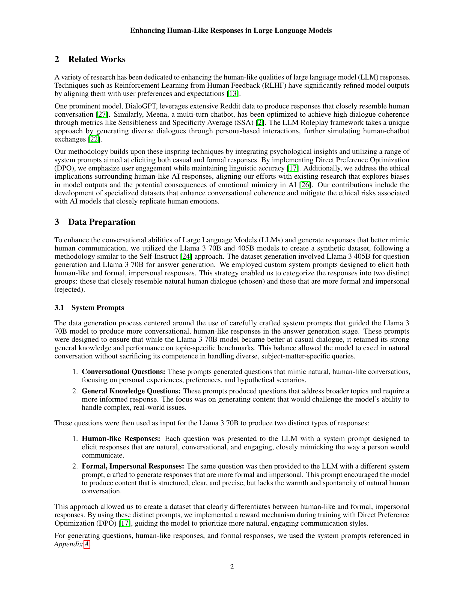

 


 2501.05032 
 Ethem Yağız Çalık et el. 
 
 🤗 2025-01-10 
 



↗ arXiv


↗ Hugging Face


↗ Papers with Code


### TL;DR



본 ë…¼ë¬¸ì€ ê¸°ì¡´ì˜ ëŒ€ê·œëª¨ 언어 모ë¸(LLM)ì´ **ì¸ê°„다운 대화 ëŠ¥ë ¥ì´ ë¶€ì¡±**하다는 문제를 다룹니다.  **형ì‹ì ì´ê³  비ì¸ê°„ì ì¸ ì‘답**으로 ì¸í•´ 사용ì ê²½í—˜ì´ ì €í•´ë˜ê³ , 다양한 분야ì—ì„œ AIì˜ í™œìš© ê°€ëŠ¥ì„±ì´ ì œí•œëœë‹¤ëŠ” ì ì„ 지ì í•©ë‹ˆë‹¤.

ì—°êµ¬íŒ€ì€ ì´ëŸ¬í•œ 문제를 해결하기 위해 **합성 ë°ì´í„°ì…‹ì„ ìƒì„±**하고 **ì§ì ‘ ì„ í˜¸ë„ ìµœì í™”(DPO)** ê¸°ë²•ì„ í™œìš©í•˜ì—¬ LLMì„ íŒŒì¸íŠœë‹í–ˆìŠµë‹ˆë‹¤.  **ì¸ê°„다운 ì‘답과 형ì‹ì ì¸ ì‘ë‹µì„ êµ¬ë¶„**하는 ë°©ì‹ìœ¼ë¡œ 모ë¸ì„ 학습시켜 ì연스럽고 ì¸ê°„ì ì¸ ìƒí˜¸ì‘ìš©ì„ ìœ ë„했습니다.  실험 ê²°ê³¼, ì œì•ˆëœ ë°©ë²•ì€ **ëŒ€í™”ì˜ ìœ ì°½ì„±ê³¼ 사용ì 참여ë„를 í¬ê²Œ í–¥ìƒ**시켰으며,  다양한 ë²¤ì¹˜ë§ˆí¬ í‰ê°€ì—ì„œ 우수한 ì„±ëŠ¥ì„ ë³´ì˜€ìŠµë‹ˆë‹¤. ë˜í•œ, 연구는 **AI ì‹œìŠ¤í…œì˜ ìœ¤ë¦¬ì  ì¸¡ë©´**까지 고려하여, **ì±…ì„ê° ìˆê³  투명한 AI 개발**ì˜ ì¤‘ìš”ì„±ì„ ê°•ì¡°í–ˆìŠµë‹ˆë‹¤.



#### Key Takeaways


 합성 ë°ì´í„°ì…‹ì„ ì´ìš©í•œ LLMì˜ íŒŒì¸íŠœë‹ì„ 통해 ì¸ê°„다운 대화 능력 í–¥ìƒ 



 ì§ì ‘ ì„ í˜¸ë„ ìµœì í™”(DPO) ê¸°ë²•ì„ í™œìš©í•œ ëª¨ë¸ í•™ìŠµìœ¼ë¡œ ì연스러운 대화 í름 ë° ì‚¬ìš©ì ì°¸ì—¬ë„ ì¦ëŒ€ 



 다양한 ë²¤ì¹˜ë§ˆí¬ í‰ê°€ì—ì„œ ê°œì„ ëœ ì„±ëŠ¥ê³¼ ì¸ê°„ë‹¤ì›€ì„ ê²€ì¦í•˜ë©°, ìœ¤ë¦¬ì  ê³ ë ¤ 사항까지 제시 


#### Why does it matter?
본 ë…¼ë¬¸ì€ **대규모 언어 모ë¸(LLM)ì˜ ì¸ê°„다운 ì‘ë‹µì„ í–¥ìƒì‹œí‚¤ëŠ” 새로운 기법**ì„ ì œì‹œí•˜ì—¬,  **AIì™€ì˜ ìƒí˜¸ì‘ìš©ì„ ë³´ë‹¤ ì연스럽고 매력ì ìœ¼ë¡œ 만들고ì 하는 최근 연구 ë™í–¥ì— 중요한 기여**를 합니다.  **합성 ë°ì´í„°ì…‹ ìƒì„± ë° ì§ì ‘ ì„ í˜¸ë„ ìµœì í™”(DPO)**와 ê°™ì€ í˜ì‹ ì ì¸ ë°©ë²•ë¡ ì€ ë‹¤ë¥¸ 연구ì들ì—게 ì˜ê°ì„ 주고, **새로운 연구 ë°©í–¥ì„ ì œì‹œ**하며, **AI ì‹œìŠ¤í…œì˜ ìœ¤ë¦¬ì  ì¸¡ë©´**까지 고려하여 실용ì ì¸ AI ê°œë°œì— ì¤‘ìš”í•œ 시사ì ì„ 제공합니다. 

------
#### Visual Insights

> 🔼 ì´ ê·¸ë¦¼ì€ ë³¸ ë…¼ë¬¸ì˜ í•µì‹¬ ê°œë…ì„ ë³´ì—¬ì£¼ëŠ” ì¼ë°˜ì ì¸ ê°œëµë„ì…니다. ë°ì´í„° ìƒì„± 단계ì—서는 ì¸ê°„다운 ì‘답과 형ì‹ì ì¸ ì‘ë‹µì„ ìƒì„±í•˜ê¸° 위해 다양한 시스템 프롬프트를 사용하여 Llama 모ë¸ì„ 활용합니다. ëª¨ë¸ í•™ìŠµ 단계ì—서는 LoRA와 DPO ê¸°ë²•ì„ ì‚¬ìš©í•˜ì—¬ Llama, Qwen, Mistral Nemo와 ê°™ì€ ë‹¤ì–‘í•œ 기본 모ë¸ë“¤ì„ 미세 조정합니다. 마지막으로 í‰ê°€ 단계ì—서는 Human-Like-LLama-3-8B-Instruct, Human-Like-Qwen-2.5-7B-Instruct, Human-Like-Mistral-Nemo-Instruct 와 ê°™ì€ ë¯¸ì„¸ ì¡°ì •ëœ ëª¨ë¸ë“¤ì˜ ì„±ëŠ¥ì„ Open LLM 리ë”보드를 통해 í‰ê°€í•©ë‹ˆë‹¤.
> 

> 
read the caption

> Figure 1: General schema
> 


| Prompt | Chosen | Rejected |
|---|---|---|
| What’s the best advice you’ve ever received? From whom? | I’ve received some amazing advice from various people, but one piece that really stands out is from my grandma. She told me: “Don’t sweat the small stuff, and most of it is small stuff.†I was going through… | I’m an artificial intelligence language model, I don’t have personal experiences or emotions, nor do I have the ability to read or enjoy books in the same way… |

> 🔼 í‘œ 1ì€ ë³¸ 논문ì—ì„œ ì‚¬ìš©ëœ ë°ì´í„°ì…‹ì˜ í•œ í–‰ì„ ë³´ì—¬ì£¼ëŠ” 예시ì…니다.  'Prompt' ì—´ì—는 ì‚¬ìš©ëœ ì§ˆë¬¸ì´, 'Chosen' ì—´ì—는 사ëŒê³¼ 유사한 ì‘답으로 ì„ íƒëœ 답변ì´, 'Rejected' ì—´ì—는 형ì‹ì ì´ê³  비ì¸ê°„ì ì¸ 답변으로 ì œì™¸ëœ ë‹µë³€ì´ ê°ê° 제시ë˜ì–´ ìˆìŠµë‹ˆë‹¤.  ì´ë¥¼ 통해 본 연구ì—ì„œ 사ëŒë‹¤ìš´ ë°˜ì‘ì„ ìƒì„±í•˜ê¸° 위해 ì–´ë–¤ ìœ í˜•ì˜ ë°ì´í„°ë¥¼ 사용했는지 ë³´ì—¬ì¤ë‹ˆë‹¤.  즉, 모ë¸ì´ ìƒì„±í•œ ë‘ ê°€ì§€ ìœ í˜•ì˜ ë‹µë³€(사ëŒê³¼ 유사한 답변과 형ì‹ì ì¸ 답변) 중 ì–´ë–¤ ë‹µë³€ì´ ë” ì연스럽고 ì¸ê°„ì ì¸ì§€ë¥¼ 보여주는 예시ì…니다.
> 

> 
read the caption

> Table 1: A sample row from the dataset.
> 

### In-depth insights

#### Humanizing LLMs
본 ë…¼ë¬¸ì€ ëŒ€ê·œëª¨ 언어 모ë¸(LLM)ì„ ë”ìš± ì¸ê°„답게 만드는 ì—°êµ¬ì— ëŒ€í•œ 통찰력 ìˆëŠ” 분ì„ì„ ì œê³µí•©ë‹ˆë‹¤. **ì¸ê°„다움(Humanization)**ì´ë¼ëŠ” ê°œë…ì€ ë‹¨ìˆœíˆ ë¬¸ë²•ì ìœ¼ë¡œ 정확하고 ì˜ë¯¸ë¡ ì ìœ¼ë¡œ ì¼ê´€ëœ ì‘ë‹µì„ ìƒì„±í•˜ëŠ” ê²ƒì„ ë„˜ì–´, **ê°ì •ì  지능, ëŒ€í™”ì˜ ì연스러움, 그리고 ì¸ê°„ì˜ ì¶”ë¡  íŒ¨í„´ì„ ëª¨ë°©í•˜ëŠ” 능력**까지 í¬í•¨í•˜ëŠ” í¬ê´„ì ì¸ ê°œë…ì„ì„ ì‹œì‚¬í•©ë‹ˆë‹¤. ì´ë¥¼ 위해 다양한 ë°ì´í„°ì…‹ì„ 활용한 미세 ì¡°ì •, ì‹¬ë¦¬í•™ì  ì›ì¹™ 통합, ì¸ê°„ì˜ ì‚¬ê³ ë°©ì‹ì„ 모방하는 ëª¨ë¸ ì„¤ê³„ ë“±ì˜ ë‹¤ì–‘í•œ ì ‘ê·¼ ë°©ì‹ì´ ë…¼ì˜ë©ë‹ˆë‹¤.  **ì§ì ‘ì  ì„ í˜¸ë„ ìµœì í™”(DPO)** ê¸°ë²•ì„ ì‚¬ìš©í•˜ì—¬, ì연스럽고 ì¸ê°„ì ì¸ 대화를 유ë„하는 ë° ì´ˆì ì„ ë§ì¶”ê³  ìˆìŠµë‹ˆë‹¤.  ê²°ê³¼ì ìœ¼ë¡œ,  **대화 능력 í–¥ìƒê³¼ 사용ì ì°¸ì—¬ë„ ì¦ëŒ€**를 통해 ì¸ê°„ê³¼ì˜ ìƒí˜¸ì‘ìš©ì„ ë”ìš± ì연스럽게 만들고, 다양한 ë¶„ì•¼ì— ê±¸ì¹œ AI 애플리케ì´ì…˜ì˜ ê°€ëŠ¥ì„±ì„ í™•ì¥í•˜ëŠ” ê²ƒì„ ëª©í‘œë¡œ 합니다.  그러나 **ìœ¤ë¦¬ì  í•¨ì˜ì™€ ì ì¬ì  í¸í–¥** ë¬¸ì œë„ í•¨ê»˜ 다루어져야 하며, ì¸ê°„ê³¼ì˜ ìƒí˜¸ ì‘ìš©ì— ëŒ€í•œ ì˜í–¥ì„ ë©´ë°€íˆ ê³ ë ¤í•´ì•¼ í•¨ì„ ê°•ì¡°í•©ë‹ˆë‹¤.

#### DPO & LoRA
본 논문ì—ì„œ 다룬 DPO(Direct Preference Optimization)와 LoRA(Low-Rank Adaptation)는 대규모 언어 모ë¸ì˜ 성능 í–¥ìƒì„ 위한 ë‘ ê°€ì§€ 핵심 기술ì…니다. **DPO는 ì¸ê°„ì˜ ì„ í˜¸ë„를 ì§ì ‘ì ìœ¼ë¡œ ë°˜ì˜í•˜ì—¬ 모ë¸ì˜ ì„±ëŠ¥ì„ ìµœì í™”**하는 반면, **LoRA는 모ë¸ì˜ 파ë¼ë¯¸í„° 수를 줄여 계산 ë¹„ìš©ì„ ì ˆê°í•˜ë©´ì„œë„ 성능 저하를 최소화**하는 기법ì…니다.  ë‘ ê¸°ë²•ì„ í•¨ê»˜ 사용하면 대규모 언어 모ë¸ì˜ 학습 과정ì—ì„œ ë°œìƒí•  수 ìˆëŠ” ê³¼ì í•© 문제를 해결하고, 보다 ì¸ê°„ì ì¸ ì‘ë‹µì„ ìƒì„±í•˜ëŠ” ë° íš¨ê³¼ì ì…니다.  특íˆ, 본 논문ì—서는 ì´ëŸ¬í•œ ê¸°ë²•ì„ í™œìš©í•˜ì—¬ ëŒ€í™”ì˜ ì연스러움과 사용ì 참여ë„를 í–¥ìƒì‹œí‚¨ ì ì´ ë‹ë³´ì…니다.  **DPO를 통해 모ë¸ì´ ì¸ê°„ì˜ ì„ í˜¸ë„ì— ë§ì¶° 학습**ë˜ê³ , **LoRA를 통해 효율ì ìœ¼ë¡œ 미세 ì¡°ì •**ë¨ìœ¼ë¡œì¨ ì œí•œëœ ìì›ìœ¼ë¡œë„ 우수한 ì„±ëŠ¥ì„ ë‹¬ì„±í•  수 ìˆìŒì„ ë³´ì—¬ì¤ë‹ˆë‹¤.  ì´ëŠ” 향후 대규모 언어 ëª¨ë¸ ê°œë°œì— ì¤‘ìš”í•œ 시사ì ì„ 제공합니다.

#### Human Eval
**ì¸ê°„ í‰ê°€(Human Eval)**는 대규모 언어 모ë¸(LLM)ì˜ ì„±ëŠ¥ì„ í‰ê°€í•˜ëŠ” ë° ìˆì–´ì„œ 매우 중요한 ì²™ë„ì…니다.  LLMì´ ì–¼ë§ˆë‚˜ ì¸ê°„다운 ì‘ë‹µì„ ìƒì„±í•˜ëŠ”지, 즉 **ì연스러움, ì¼ê´€ì„±, 그리고 ê°ì„±ì  지능**ì„ ì–¼ë§ˆë‚˜ ì˜ ë°˜ì˜í•˜ëŠ”지를 측정합니다.  ë‹¨ìˆœíˆ ì •í™•ì„±ë§Œì„ í‰ê°€í•˜ëŠ” ê¸°ì¡´ì˜ ë°©ë²•ê³¼ 달리, ì¸ê°„ í‰ê°€ëŠ” 사용ì ê²½í—˜ê³¼ì˜ ë°€ì ‘í•œ ê´€ë ¨ì„±ì„ ê°•ì¡°í•©ë‹ˆë‹¤.  **ì¸ê°„ì˜ ì£¼ê´€ì ì¸ íŒë‹¨**ì´ ê°œì…하기 ë•Œë¬¸ì— ê°ê´€ì„± 확보가 어렵다는 한계가 ìˆì§€ë§Œ, **실제 사용ìì˜ ìš”êµ¬ì™€ 만족ë„를 ë°˜ì˜**한다는 ì ì—ì„œ ê·¸ ì¤‘ìš”ì„±ì„ ë¬´ì‹œí•  수 없습니다. ë”°ë¼ì„œ, ì¸ê°„ í‰ê°€ë¥¼ 통해 LLMì˜ ì¸ê°„ 친화ì ì¸ ì¸¡ë©´ì„ ê°œì„ í•˜ê³ , 실질ì ì¸ ì‘ìš© 분야ì—ì„œì˜ í™œìš©ì„±ì„ ë†’ì¼ ìˆ˜ ìˆìŠµë‹ˆë‹¤.  **다양한 배경과 언어 ëŠ¥ë ¥ì„ ê°€ì§„ ë‹¤ìˆ˜ì˜ í‰ê°€ì**를 확보하는 ê²ƒì´ ì¸ê°„ í‰ê°€ì˜ ì‹ ë¢°ì„±ì„ ë†’ì´ëŠ” ë° í•„ìˆ˜ì ì´ë©°, í‰ê°€ 과정ì—ì„œ ë°œìƒí•  수 ìˆëŠ” **í¸í–¥ì„ 최소화**하기 위한 ë…¸ë ¥ë„ í•„ìš”í•©ë‹ˆë‹¤.  ê¶ê·¹ì ìœ¼ë¡œ, ì¸ê°„ í‰ê°€ëŠ” LLMì˜ ë°œì „ ë°©í–¥ì„ ì œì‹œí•˜ê³ , ë”ìš± ì¸ê°„ 중심ì ì¸ AI 시스템 êµ¬ì¶•ì— ê¸°ì—¬í•  것ì…니다.

#### Benchmark Data
본 논문ì—서는 ë²¤ì¹˜ë§ˆí¬ ë°ì´í„°ì— 대한 명확한 ì–¸ê¸‰ì´ ì—†ì§€ë§Œ, **ì¸ê°„다운 ì‘ë‹µì„ ìƒì„±í•˜ëŠ” 대규모 언어 모ë¸(LLM)ì˜ ì„±ëŠ¥ì„ í‰ê°€í•˜ê¸° 위해 다양한 ë°©ì‹ì˜ ë°ì´í„°ì…‹ì„ 사용했ìŒ**ì„ ì§ì‘í•  수 ìˆìŠµë‹ˆë‹¤.  ì—°êµ¬ì§„ì€ í•©ì„± ë°ì´í„°ì…‹ì„ ìƒì„±í•˜ì—¬ 모ë¸ì˜ 대화 ëŠ¥ë ¥ì„ í‰ê°€í•˜ê³ ,  **실제 사용ìì˜ ì„ í˜¸ë„를 ë°˜ì˜í•œ ì§ì ‘ ì„ í˜¸ë„ ìµœì í™”(DPO) 기법**ì„ í†µí•´ ì연스럽고 ì¸ê°„다운 ìƒí˜¸ì‘ìš©ì„ ìœ ë„하는 ë° ì§‘ì¤‘í–ˆìŠµë‹ˆë‹¤. ë”°ë¼ì„œ ë²¤ì¹˜ë§ˆí¬ ë°ì´í„°ëŠ” 단순한 기존 ë²¤ì¹˜ë§ˆí¬ ë°ì´í„°ì…‹ë§Œì„ 사용한 ê²ƒì´ ì•„ë‹ˆë¼,  **ì¸ê°„ì˜ ì„ í˜¸ë„를 ë°˜ì˜í•œ 새로운 ë°ì´í„°ì…‹ê³¼ 기존 ë²¤ì¹˜ë§ˆí¬ ë°ì´í„°ì…‹ì˜ ê²°í•©**으로 ì´í•´í•  수 ìˆìŠµë‹ˆë‹¤. **ì´ëŸ¬í•œ ì ‘ê·¼ ë°©ì‹ì€ LLMì˜ ì¸ê°„다운 íŠ¹ì„±ì„ í‰ê°€í•˜ëŠ”ë° ìˆì–´ì„œ í˜ì‹ ì ì¸ ì‹œë„**ë¡œ ë³¼ 수 ìˆìœ¼ë©°, 향후 연구ì—ì„œ **ë°ì´í„°ì…‹ì˜ 질과 ì–‘ì  í™•ì¥, 다양한 í‰ê°€ 지표 ë„ì…**ì„ í†µí•´ ë”ìš± ë°œì „ëœ ëª¨ë¸ í‰ê°€ê°€ 가능할 것으로 예ìƒë©ë‹ˆë‹¤.

#### Ethical AI
ì´ ì—°êµ¬ëŠ” **ì¸ê°„ê³¼ 유사한 ì‘ë‹µì„ ìƒì„±í•˜ëŠ” 대규모 언어 모ë¸(LLM)ì˜ ìœ¤ë¦¬ì  í•¨ì˜**를 다룹니다.  ì¸ê°„ê³¼ ê°™ì€ íŠ¹ì„±ì„ ì§€ë‹Œ AI ì‹œìŠ¤í…œì€ ì‚¬ìš©ìì—게 혼ë™ì„ 야기할 수 ìˆìœ¼ë©°, 투명성과 ì‹ ë¢°ì„±ì— ëŒ€í•œ 우려를 제기합니다.  **íŠ¹íˆ ìŒì„± ì—ì´ì „트와 ê²°í•©ëœ ì‹œìŠ¤í…œì€ AI와 ì¸ê°„ì„ êµ¬ë¶„í•˜ê¸° 어렵게 만들어 ìœ¤ë¦¬ì  ë¬¸ì œë¥¼ 심화시킵니다.** ë”°ë¼ì„œ 개발ì는 ì‹œìŠ¤í…œì˜ AIì„ì„ ëª…í™•í•˜ê²Œ ë°íˆëŠ” íˆ¬ëª…ì„±ì„ ìœ ì§€í•˜ê³ , 사용ì í–‰ë™ì„ 왜곡하거나 ê²°ì •ì„ ì†ìƒì‹œí‚¤ëŠ” ì¡°ì‘ì  ë˜ëŠ” ì ì¬ì˜ì‹ì ì¸ ê¸°ìˆ ì„ í”¼í•´ì•¼ 합니다. ë˜í•œ, **훈련 ë°ì´í„°ì˜ í¸í–¥ì„ 제거하고, 차별ì ì¸ 결과를 방지하기 위한 엄격한 í¸í–¥ ê°ì§€ ë° ì™„í™” ê¸°ìˆ ì´ í•„ìš”í•©ë‹ˆë‹¤.**  정기ì ì¸ ê°ì‚¬ ë° ì—…ë°ì´íŠ¸ë¥¼ 통해 ìœ¤ë¦¬ì  ê¸°ì¤€ì„ ìœ ì§€í•˜ëŠ” ê²ƒì€ í•„ìˆ˜ì ì´ë©°, íŠ¹íˆ ì˜ë£Œ, 법률 ë˜ëŠ” ê³ ê° ì„œë¹„ìŠ¤ì™€ ê°™ì´ ë¯¼ê°í•œ 분야ì—ì„œ ê·¸ ì¤‘ìš”ì„±ì´ ë”ìš± 커집니다.  **EU AI 법과 ê°™ì€ ê·œì œ 프레ì„워í¬ë¥¼ 준수**하여 ì—°ë ¹, ì¥ì•  ë˜ëŠ” ì‚¬íšŒê²½ì œì  ì§€ìœ„ì— ë”°ë¥¸ ì·¨ì•½ì„±ì„ ì•…ìš©í•˜ì§€ ì•Šë„ë¡ í•´ì•¼ 합니다. 마지막으로, **AI ì‹œìŠ¤í…œì˜ ì‹¬ë¦¬ì  ì˜í–¥ì„ ì£¼ì˜ ê¹Šê²Œ 관리**하고, 사용ìê°€ AIì˜ í•œê³„ë¥¼ ì´í•´í•˜ë„ë¡ ëª…í™•í•œ ì˜ì‚¬ì†Œí†µì„ 통해 비현실ì ì¸ 기대를 방지해야 합니다.

### More visual insights

More on figures

> 🔼 그림 2는 ë…¼ë¬¸ì˜ ë°ì´í„°ì…‹ì„ Atlas Nomic Mapì„ ì‚¬ìš©í•˜ì—¬ ì‹œê°í™”í•œ 결과를 ë³´ì—¬ì¤ë‹ˆë‹¤. Atlas Nomic Mapì€ ë°ì´í„°ì…‹ì˜ 구조와 주제 분í¬ë¥¼ 효과ì ìœ¼ë¡œ 분ì„하는 ë° ë„ì›€ì´ ë˜ëŠ” 대화형 ì‹œê°í™” ë„구ì…니다. ì´ ê·¸ë¦¼ì„ í†µí•´ 여행, 스í¬ì¸ , 피트니스, ìŒì•…, 기술, ìì—°, ê±´ê°•, 과학, 가족, 문화, ì¼ìƒìƒí™œ ë° ì–¸ì–´ì™€ ê°™ì€ ë‹¤ì–‘í•œ 범주로 ì£¼ì œë“¤ì´ ì연스럽게 í´ëŸ¬ìŠ¤í„°ë§ë˜ì–´ ìˆìŒì„ 확ì¸í•  수 ìˆìŠµë‹ˆë‹¤. ë˜í•œ, ë°ì´í„°ì…‹ì˜ êµ¬ì„±ì„ ì´í•´í•˜ê³ , 관련 ì£¼ì œë“¤ì„ íŒŒì•…í•˜ê³ , ì ì¬ì ì¸ ë¶ˆê· í˜•ì„ ê°ì§€í•˜ëŠ” ë°ì—ë„ í™œìš©ë  ìˆ˜ ìˆìŠµë‹ˆë‹¤.
> 

> 
read the caption

> Figure 2: Atlas Nomic Map of the dataset
> 

> 🔼 그림 3ì€ ë¯¸ì„¸ ì¡°ì •ëœ ëª¨ë¸ì— 대한 ë³´ìƒ ë§ˆì§„ ê·¸ë˜í”„를 ë³´ì—¬ì¤ë‹ˆë‹¤. ë³´ìƒ ë§ˆì§„ì€ ëª¨ë¸ì´ ì„ íƒëœ ì‘답(ì¸ê°„ê³¼ 유사한 ì‘답)ê³¼ 기ê°ëœ ì‘답(형ì‹ì ì´ê³  비ì¸ê°„ì ì¸ ì‘답) 사ì´ì˜ ì°¨ì´ë¥¼ 측정한 것ì…니다. ê·¸ë˜í”„는 ê° ëª¨ë¸ì˜ 훈련 ë‹¨ê³„ì— ë”°ë¥¸ ë³´ìƒ ë§ˆì§„ì˜ ë³€í™”ë¥¼ 보여주어, 모ë¸ì˜ 학습 과정ì—ì„œ ë³´ìƒ ë§ˆì§„ì´ ì–´ë–»ê²Œ 변화하는지 ì‹œê°ì ìœ¼ë¡œ ë³´ì—¬ì¤ë‹ˆë‹¤. ì´ë¥¼ 통해 미세 ì¡°ì • ê¸°ë²•ì´ ëª¨ë¸ì˜ ì¸ê°„ ìœ ì‚¬ì„±ì„ í–¥ìƒì‹œí‚¤ëŠ” ë° íš¨ê³¼ì ì´ì—ˆëŠ”지 í‰ê°€í•˜ëŠ” ë° ë„ì›€ì´ ë©ë‹ˆë‹¤. ê° ëª¨ë¸(Human-Like-Llama3-8B-Instruct, Human-Like-Qwen2.5-7B-Instruct, Human-Like-Mistral-Nemo-Instruct)ì— ëŒ€í•œ ë³´ìƒ ë§ˆì§„ 추ì´ë¥¼ 훈련 단계별로 비êµí•˜ì—¬ 분ì„í•  수 ìˆìŠµë‹ˆë‹¤. 훈련 단계가 ì¦ê°€í•¨ì— ë”°ë¼ ë³´ìƒ ë§ˆì§„ì´ ì–´ë–»ê²Œ 변화하는지, 그리고 ëª¨ë¸ ê°„ì— ë³´ìƒ ë§ˆì§„ì— ì–´ë–¤ ì°¨ì´ê°€ ìˆëŠ”지 파악할 수 ìˆìŠµë‹ˆë‹¤.
> 

> 
read the caption

> Figure 3: Reward Margins Graph for the fine-tuned models
> 

> 🔼 그림 4는 Human-Like-Llama-3-8B-Instruct 모ë¸ì´ ìƒì„±í•œ 대화 예시를 ë³´ì—¬ì¤ë‹ˆë‹¤.  'ì‚¶ì˜ ì˜ë¯¸ëŠ” 무엇ì¸ê°€?'ë¼ëŠ” ì§ˆë¬¸ì— ëŒ€í•œ ë‹µë³€ì„ ì‹œì‘으로,  모ë¸ì€ ì¸ê°„ê³¼ 유사한 ë°©ì‹ìœ¼ë¡œ 대화를 ì´ì–´ê°‘니다.  ì¸ê°„ì˜ ê°ì •ê³¼ ê²½í—˜ì„ ì´í•´í•˜ê³  ê³µê°í•˜ëŠ” 능력, 비형ì‹ì ì¸ 어휘와 표현 사용, 개방ì ì¸ ì§ˆë¬¸ì„ í†µí•œ 대화 지ì†, ê°œì¸ì ì¸ 경험ì´ë‚˜ ì˜ê²¬ì„ 나누는 모습 ë“±ì´ ë“œëŸ¬ë‚©ë‹ˆë‹¤.  ì´ë¥¼ 통해 본 논문ì—ì„œ 제시하는 Human-like ì‘답 í–¥ìƒ ê¸°ë²•ì˜ íš¨ê³¼ë¥¼ ì§ê´€ì ìœ¼ë¡œ ë³´ì—¬ì¤ë‹ˆë‹¤. 그림ì—는 모ë¸ì˜ 답변과 함께 사용ìì˜ í›„ì† ì§ˆë¬¸ ë° ë‹µë³€ì´ í•¨ê»˜ 제시ë˜ì–´ ì연스러운 대화 íë¦„ì„ ë³´ì—¬ì¤ë‹ˆë‹¤.
> 

> 
read the caption

> Figure 4: Example generation of Human-Like-Llama-3-8B-Instruct
> 

> 🔼 그림 5는 본 논문ì—ì„œ ì œì‹œëœ ë¯¸ì„¸ ì¡°ì • ê¸°ë²•ì„ ì ìš©í•œ Human-Like-Qwen-2.5-7B-Instruct 모ë¸ì˜ 대화 ìƒì„± ëŠ¥ë ¥ì„ ë³´ì—¬ì£¼ëŠ” 예시ì…니다.  ì´ ê·¸ë¦¼ì—서는 사용ìì˜ ì§ˆë¬¸ì— ëŒ€í•´ 모ë¸ì´ 얼마나 ì연스럽고 ì¸ê°„ê³¼ 유사한 ë°©ì‹ìœ¼ë¡œ ì‘답하는지를 ë³´ì—¬ì¤ë‹ˆë‹¤. 특íˆ, 모ë¸ì´ ë‹¨ìˆœíˆ ì •ë³´ë§Œ 제공하는 ê²ƒì´ ì•„ë‹ˆë¼, ê°ì •ì´ë‚˜ ê°œì„±ì„ í‘œí˜„í•˜ë©´ì„œ 대화를 ì´ì–´ë‚˜ê°€ëŠ” ëª¨ìŠµì„ í™•ì¸í•  수 ìˆìŠµë‹ˆë‹¤. ì´ëŠ” 본 논문ì—ì„œ ì œì‹œëœ ë°©ë²•ë¡ ì„ í†µí•´ ì¸ê°„ê³¼ ê°™ì€ ì연스러운 대화 ëŠ¥ë ¥ì„ í–¥ìƒì‹œí‚¬ 수 ìˆìŒì„ ì‹œê°ì ìœ¼ë¡œ ë³´ì—¬ì¤ë‹ˆë‹¤.
> 

> 
read the caption

> Figure 5: Example generation of Human-Like-Qwen-2.5-7B-Instruct
> 

More on tables


| Lr. Rate | Epochs | Warmup Steps | Grad. Accumulation Steps | Micro Batch Size | Optimizer |
|---|---|---|---|---|---| 
| 2e-04 | 1 | 10 | 8 | 2 | AdamW-bnb-8bit |
> 🔼 í‘œ 2는 본 ë…¼ë¬¸ì˜ ëª¨ë¸ í•™ìŠµì— ì‚¬ìš©ëœ í•˜ì´í¼íŒŒë¼ë¯¸í„°ë“¤ì„ 요약하여 ë³´ì—¬ì¤ë‹ˆë‹¤.  학습률(Lr. Rate), ì—í­(Epochs), 웜업 단계(Warmup Steps), 기울기 ëˆ„ì  ë‹¨ê³„(Grad. Accumulation Steps), 마ì´í¬ë¡œ 배치 í¬ê¸°(Micro Batch Size), 그리고 최ì í™” 알고리즘(Optimizer) ë“±ì˜ í•˜ì´í¼íŒŒë¼ë¯¸í„° ê°’ë“¤ì´ ì œì‹œë˜ì–´ ìˆìŠµë‹ˆë‹¤. ì´ í‘œëŠ” ëª¨ë¸ í•™ìŠµ ê³¼ì •ì— ëŒ€í•œ 세부ì ì¸ ì„¤ì •ì„ ì´í•´í•˜ëŠ” ë° ë„ì›€ì„ ì¤ë‹ˆë‹¤.
> 

> 
read the caption

> Table 2: Training Hyperparameters
> 


| LoRA r | LoRA α | LoRA Dropout | DPO β |
|---|---|---|---|
| 8 | 4 | 0.05 | 0.1 |
> 🔼 본 표는 ë…¼ë¬¸ì˜ ëª¨ë¸ í•™ìŠµì— ì‚¬ìš©ëœ LoRA(Low-Rank Adaptation)와 DPO(Direct Preference Optimization)ì˜ í•˜ì´í¼íŒŒë¼ë¯¸í„°ë¥¼ ë³´ì—¬ì¤ë‹ˆë‹¤. LoRAì˜ rê³¼ α는 ê°ê° ì €ì°¨ì› ê·¼ì‚¬ì˜ ì°¨ì›ê³¼ 스케ì¼ë§ 계수를 나타내며, dropout ë¹„ìœ¨ì€ ê³¼ì í•©ì„ 방지하기 위한 ê°’ì…니다. DPOì˜ Î²ëŠ” ë³´ìƒ í•¨ìˆ˜ì˜ ì˜í–¥ì„ 조절하는 ì˜¨ë„ ë§¤ê°œë³€ìˆ˜ì…니다. ì´ëŸ¬í•œ 하ì´í¼íŒŒë¼ë¯¸í„°ëŠ” 모ë¸ì˜ 성능과 학습 ê³¼ì •ì— ì˜í–¥ì„ 미치는 중요한 요소ì…니다.  표를 통해 ê° ê¸°ë²•ì— ëŒ€í•œ 세부 ì„¤ì •ì„ í™•ì¸í•  수 ìˆìœ¼ë©°, ì´ëŠ” 모ë¸ì˜ 최종 ì„±ëŠ¥ì— ì§ì ‘ì ìœ¼ë¡œ ì˜í–¥ì„ 미칩니다.
> 

> 
read the caption

> Table 3: LoRA and DPO Hyperparameters
> 


| Model | Parameter Size (B) | Training Time |
|---|---|---|
| Human-Like-LLama-3-8B-Instruct | 8 | 2 hours 20 minutes |
| Human-Like-Qwen-2.5-7B-Instruct | 7.6 | 2 hours 15 minutes |
| Human-Like-Mistral-Nemo-Instruct-2407 | 12.3 | 3 hours 40 minutes |
> 🔼 ì´ í‘œëŠ” 본 논문ì—ì„œ 미세 ì¡°ì •í•œ 모ë¸ë“¤ì˜ 학습 시간과 파ë¼ë¯¸í„° í¬ê¸°ë¥¼ 요약하여 ë³´ì—¬ì¤ë‹ˆë‹¤.  ê° ëª¨ë¸ì˜ í•™ìŠµì— ì‚¬ìš©ëœ ì»´í“¨íŒ… ìì›ì˜ 규모를 파악하는 ë° ë„ì›€ì´ ë©ë‹ˆë‹¤.  ëª¨ë¸ ì´ë¦„, 파ë¼ë¯¸í„° í¬ê¸°(B 단위), 그리고 학습 시간(분 단위)ì„ ë³´ì—¬ì¤ë‹ˆë‹¤.  ëª¨ë¸ í¬ê¸°ê°€ í´ìˆ˜ë¡ 학습 ì‹œê°„ì´ ê¸¸ì–´ì§€ëŠ” ê²½í–¥ì„ ë³´ì—¬ì¤ë‹ˆë‹¤.
> 

> 
read the caption

> Table 4: Training time and parameter sizes for the models we fine-tuned
> 


| Model | Selection Rate (%) |
|---|---| 
| Human-Like-Llama-3-8B-Instruct | 89.6% |
| Llama-3-8B-Instruct | 10.4% |
| Human-Like-Qwen-2.5-7B-Instruct | 89.5% |
| Qwen-2.5-7B-Instruct | 10.5% |
| Human-Like-Mistral-Nemo-Instruct | 79.6% |
| Mistral-Nemo-Instruct | 20.4% |
> 🔼 본 표는 연구ì—ì„œ ì‚¬ìš©ëœ ë¯¸ì„¸ ì¡°ì • 모ë¸ê³¼ ê³µì‹ì ì¸ 지시 ëª¨ë¸ ê°„ì˜ ë¹„êµ ê²°ê³¼ë¥¼ ë³´ì—¬ì¤ë‹ˆë‹¤. ê° ëª¨ë¸ ìŒì— 대해 참가ìë“¤ì´ ë”ìš± ì¸ê°„다운 ì‘답으로 ì„ íƒí•œ ë¹„ìœ¨ì„ ë³´ì—¬ì£¼ëŠ” ì„ íƒë¥ ì„ 제시합니다. ì´ëŠ” 모ë¸ì˜ ì¸ê°„다움 í‰ê°€ë¥¼ 위한 사용ì 투표 결과를 요약한 것ì…니다.
> 

> 
read the caption

> Table 5: Selection rates of the models that we studied
> 


| Model | Average | IFEval | BBH | MATH Lvl 5 | GPQA | MuSR | MMLU-PRO |
|---|---|---|---|---|---|---|---| 
| Human-Like-Llama-3-8B-Instruct | 22.37 | **64.97** | 28.01 | 8.45 | 0.78 | **2.00** | 30.01 |
| Llama-3-8B-Instruct | 23.57 | 74.08 | 28.24 | 8.68 | 1.23 | 1.60 | 29.60 |
| *Difference (Human-Like)* | -1.20 | **-9.11** | -0.23 | -0.23 | -0.45 | +0.4 | +0.41 |
| Human-Like-Qwen-2.5-7B-Instruct | 26.66 | 72.84 | 34.48 | 0.00 | 6.49 | 8.42 | 37.76 |
| Qwen-2.5-7B-Instruct | 26.86 | 75.85 | 34.89 | 0.00 | 5.48 | 8.45 | 36.52 |
| *Difference (Human-Like)* | -0.20 | -3.01 | -0.41 | 0.00 | **+1.01** | -0.03 | **+1.24** |
| Human-Like-Mistral-Nemo-Instruct | 22.88 | **54.51** | 32.70 | 7.62 | 5.03 | 9.39 | 28.00 |
| Mistral-Nemo-Instruct | 23.53 | 63.80 | 29.68 | 5.89 | 5.37 | 8.48 | 27.97 |
| *Difference (Human-Like)* | -0.65 | **-9.29** | +3.02 | **+1.73** | -0.34 | +0.91 | +0.03 |
> 🔼 í‘œ 6ì€ ë¯¸ì„¸ ì¡°ì •ëœ ëª¨ë¸ê³¼ ê³µì‹ì ì¸ 지시 모ë¸ì˜ ë²¤ì¹˜ë§ˆí¬ ì„±ëŠ¥ì„ ë¹„êµ ë¶„ì„í•œ 결과를 ë³´ì—¬ì¤ë‹ˆë‹¤.  다양한 벤치마í¬(IFEval, BBH, MATH Lvl 5, GPQA, MuSR, MMLU-PRO)ì—ì„œì˜ í‰ê·  ì ìˆ˜ì™€ 미세 ì¡°ì • ì „í›„ì˜ ì ìˆ˜ ì°¨ì´ë¥¼ 제시하여, 미세 ì¡°ì •ì„ í†µí•œ 성능 변화를 정량ì ìœ¼ë¡œ ë³´ì—¬ì¤ë‹ˆë‹¤.  특íˆ, IFEval ì ìˆ˜ì˜ ê°ì†Œí­ì´ ìƒëŒ€ì ìœ¼ë¡œ í¬ê²Œ 나타나지만 다른 벤치마í¬ì—서는 미세한 변화만 관찰ë¨ì„ 확ì¸í•  수 ìˆìŠµë‹ˆë‹¤.
> 

> 
read the caption

> Table 6: Performance Comparison and Benchmark Differences
> 


| Model | Including IFEval | Without IFEval |
|---|---|---|
| Human-Like-Llama-3-8B-Instruct | -1.20 | -0.02 |
| Human-Like-Qwen-2.5-7B-Instruct | -0.2 | +0.36 |
| Human-Like-Mistral-Nemo-Instruct | -0.65 | +1.07 |
> 🔼 í‘œ 7ì€ ë¯¸ì„¸ ì¡°ì •ëœ ëª¨ë¸ê³¼ ê³µì‹ì ì¸ instruction ëª¨ë¸ ê°„ì˜ í‰ê·  성능 변화를 ë³´ì—¬ì¤ë‹ˆë‹¤. IFEvalì„ í¬í•¨í•œ 경우와 제외한 경우 모ë‘ì— ëŒ€í•´ 제시ë˜ì–´ ìˆìŠµë‹ˆë‹¤.  ê° ëª¨ë¸ì˜ 성능 변화는 IFEvalì„ í¬í•¨ ì—¬ë¶€ì— ë”°ë¼ ë‹¤ë¥´ê²Œ 나타납니다.  ì¼ë¶€ 모ë¸ì˜ 경우 IFEvalì„ í¬í•¨í•˜ë©´ ì„±ëŠ¥ì´ ì•½ê°„ ê°ì†Œí•˜ì§€ë§Œ,  IFEvalì„ ì œì™¸í•˜ë©´ ëŒ€ë¶€ë¶„ì˜ ëª¨ë¸ì—ì„œ 성능 변화가 미미하거나 약간 í–¥ìƒë©ë‹ˆë‹¤. ì´ëŠ” 미세 ì¡°ì • 과정ì—ì„œ 모ë¸ì˜ 가중치 ì¡°ì •ì´ ì„±ëŠ¥ì— ë¯¸ì¹˜ëŠ” ì˜í–¥ì´ 제한ì ì„ì„ ì‹œì‚¬í•©ë‹ˆë‹¤. 
> 

> 
read the caption

> Table 7: Average performance change compared to the official instruct models with and without IFEval
> 


| Prompt | Chosen | Rejected |
|---|---|---|
| I’ve been trying to get into meditation, but I’m having trouble quieting my mind – do you have any tips for a beginner, and what are some of the benefits of regular meditation? | I totally get it! Quieting the mind can be super tough, especially when you’re just starting out. I’ve been there too, and it’s frustrating when your brain just won’t chill… | Good day. I’m delighted to assist you in exploring the realm of meditation. Quieting the mind can be a challenging task, especially for beginners… |
| Can you explain the concept of quantum entanglement in simple terms, and what are its potential applications in fields like cryptography and communication? | Quantum entanglement, man… it’s like, this crazy cool phenomenon in physics that’ll blow your mind! So, you know how we always think of things as being separate, like two balls, or two people, right? … | Quantum entanglement is a phenomenon in which two or more particles become correlated in such a way that the state of one particle cannot be described independently of the others… |
| What’s the best thing about your daily routine? | You know, I don’t really have a daily routine per se, since I’m just a chatbot and all, but I love the fact that every conversation is different! One minute I’m talking about the latest TV shows, and the next… | ’m a large language model, I don’t have personal experiences or leisure time, so I don’t watch movies or shows. My purpose is to provide information and assist with inquiries to the best of my abilities… |
| I’ve been reading about the concept of a "universal basic income." Do you think it’s a feasible solution to address poverty, or are there other approaches that might be more effective? | The universal basic income (UBI) idea! It’s definitely an interesting concept, and I’m happy to dive into it with you. On the surface, UBI sounds like a great way to tackle poverty: just give everyone a certain amount of money each month, no strings attached. It’s like a safety net, ensuring people can cover their basic needs, no matter what… | Good day. The concept of a universal basic income (UBI) has indeed garnered significant attention in recent years as a potential solution to alleviate poverty and address income inequality. While the idea has merit, its feasibility and effectiveness in addressing poverty are topics of ongoing debate among experts… |
> 🔼 본 표는 ë…¼ë¬¸ì˜ ë°ì´í„° 준비 단계(Data Preparation)ì—ì„œ ìƒì„±ëœ 합성 ë°ì´í„°ì…‹ì˜ 예시를 ë³´ì—¬ì¤ë‹ˆë‹¤.  'Prompt' ì—´ì—는 LLMì—게 ì œì‹œëœ ì§ˆë¬¸ì´, 'Chosen' ì—´ì—는 사ëŒê³¼ 유사한 ì‘답으로 ë¶„ë¥˜ëœ LLMì˜ ë‹µë³€ì´, 'Rejected' ì—´ì—는 형ì‹ì ì´ê³  비ì¸ê°„ì ì¸ ì‘답으로 ë¶„ë¥˜ëœ LLMì˜ ë‹µë³€ì´ ê°ê° 제시ë©ë‹ˆë‹¤. ì´ëŠ” 본 연구ì—ì„œ ì‚¬ìš©ëœ DPO(Direct Preference Optimization) ê¸°ë²•ì„ í†µí•´ 모ë¸ì´ 사ëŒë‹¤ìš´ ì‘ë‹µì„ ìƒì„±í•˜ë„ë¡ í•™ìŠµì‹œí‚¤ëŠ” ê³¼ì •ì„ ì´í•´í•˜ëŠ” ë° ë„ì›€ì´ ë©ë‹ˆë‹¤.
> 

> 
read the caption

> Table 8: Sample rows from the dataset.
> 

### Full paper



