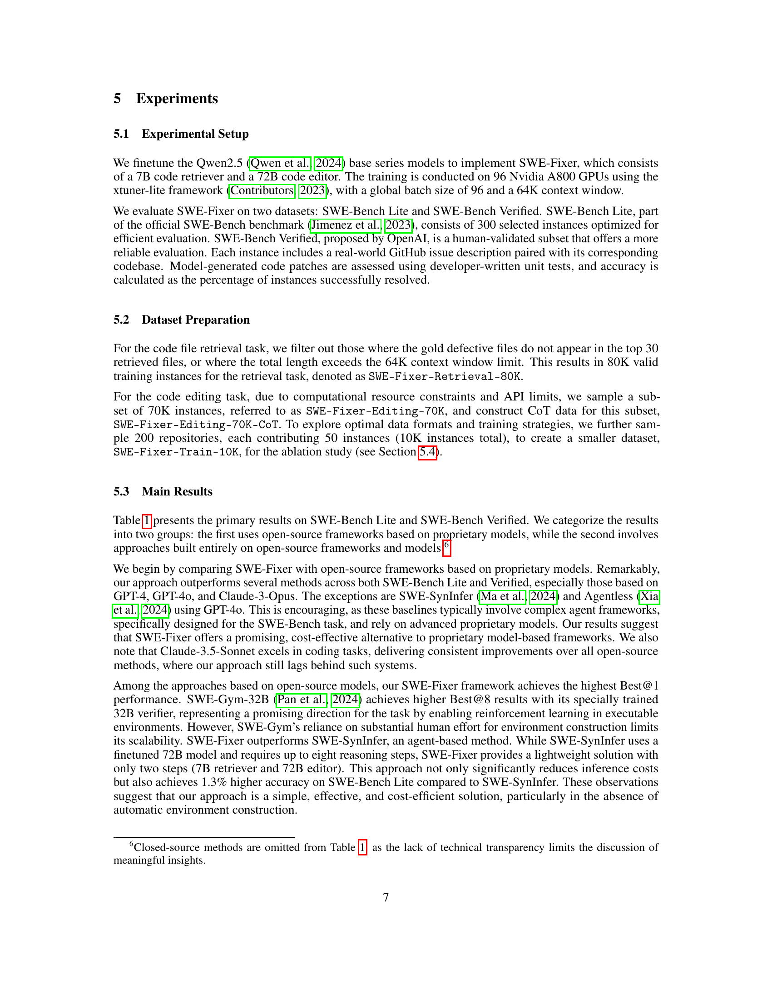

 


 2501.05040 
 Chengxing Xie et el. 
 
 🤗 2025-01-10 
 



↗ arXiv


↗ Hugging Face


↗ Papers with Code


### TL;DR



소프트웨어 엔지니어링 분야에서 **GitHub 이슈 해결**은 중요한 과제이며, 기존의 접근 방식들은 주로 **독점적인 LLM**에 의존하여 **재현성과 접근성**이 떨어지는 문제가 있었습니다.  본 연구는 이러한 문제를 해결하기 위해 **오픈소스 LLM 기반의 새로운 프레임워크인 SWE-Fixer**를 제시합니다. 

SWE-Fixer는 **코드 파일 검색 모듈과 코드 수정 모듈**로 구성되며, BM25와 경량 LLM을 활용하여 효율적인 파일 검색을 수행합니다.  **11만개의 GitHub 이슈 데이터셋**을 구축하여 두 모듈을 개별적으로 훈련시켰으며, SWE-Bench Lite와 Verified 벤치마크에서 **최첨단 성능**을 달성했습니다.  본 연구는 오픈소스 LLM을 활용한 소프트웨어 엔지니어링 문제 해결에 대한 새로운 가능성을 제시하며, **향후 연구의 방향**을 제시하는데 중요한 의미를 가집니다.



#### Key Takeaways


 오픈소스 LLM 기반의 효율적인 GitHub 이슈 해결 프레임워크인 SWE-Fixer 제시 



 11만개의 GitHub 이슈 데이터셋을 활용한 훈련 및 최첨단 성능 달성 



 코드 파일 검색 및 코드 수정 모듈을 포함한 효율적인 파이프라인 방식 채택 


#### Why does it matter?
본 논문은 **오픈소스 LLM을 사용한 GitHub 이슈 해결의 효율성 및 효과성을 높이는 새로운 방법론**을 제시하여, 연구자들에게 **재현성 높은 연구 결과**를 제공하고 **소프트웨어 엔지니어링 분야의 발전**에 기여합니다. 또한,  **대규모 데이터셋 구축 및 체계적인 실험 분석**을 통해 오픈소스 모델의 성능 향상에 대한 통찰력을 제공하며, **향후 연구 방향**을 제시합니다. 특히,  **비용 효율적인 접근 방식**을 제시하여, 자원이 부족한 연구자들에게도 큰 도움을 줄 수 있습니다.

------
#### Visual Insights

### Full paper



