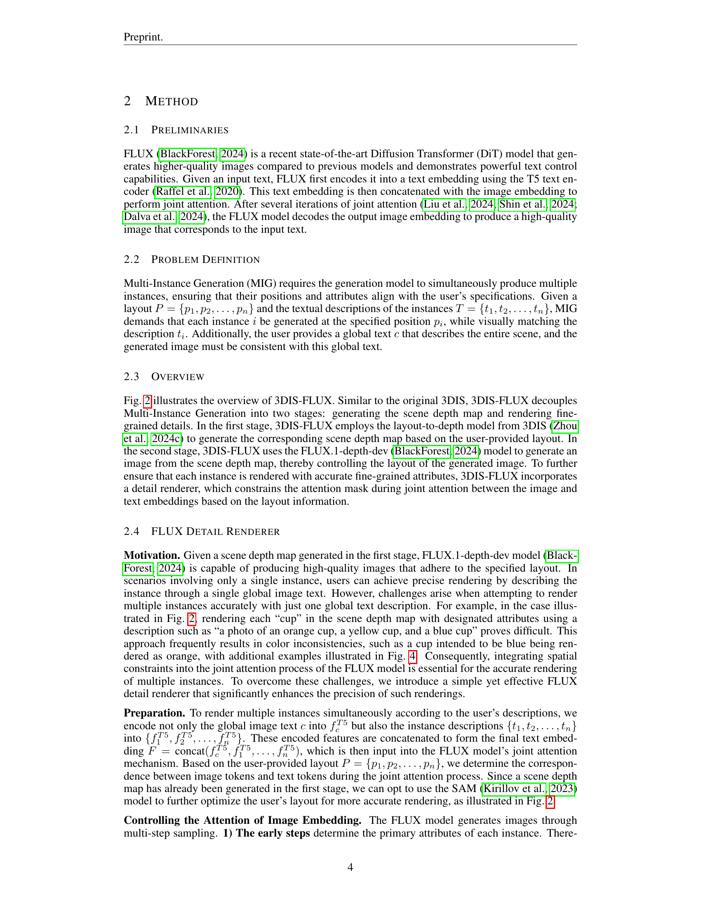
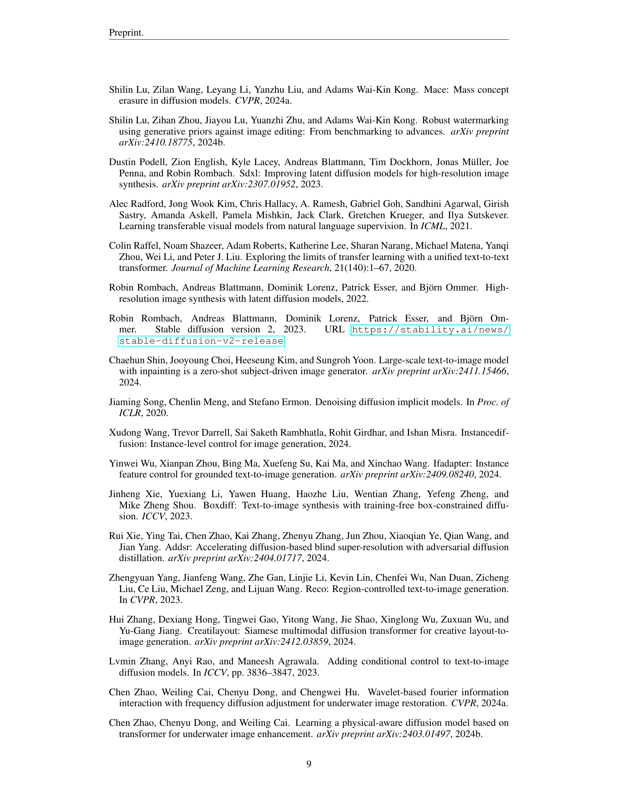

 


 2501.05131 
 Dewei Zhou et el. 
 
 🤗 2025-01-15 
 



↗ arXiv


↗ Hugging Face


↗ Papers with Code


### TL;DR



기존의 다중 인스턴스 생성 (MIG) 방법들은 어댑터 기반 방식을 주로 사용하여, 새로운 고급 모델이 출시될 때마다 어댑터를 재훈련해야 하는 문제점이 있었습니다. 이는 상당한 자원 낭비를 초래하고, 연구 효율성을 저하시키는 요인이 되었습니다.  또한, 기존 방법들은 이미지 품질과 제어 기능 측면에서 한계를 보였습니다.

본 논문에서는 이러한 문제점을 해결하기 위해 3DIS-FLUX라는 새로운 프레임워크를 제안합니다.  3DIS-FLUX는 **최신 DiT(Diffusion Transformer) 기반의 FLUX 모델을 통합**하여, **고품질 이미지 생성과 향상된 제어 기능**을 제공합니다.  **깊이 정보 기반의 장면 생성과 훈련이 필요 없는 세부 렌더링을 분리**하여, 다양한 모델에 대한 적응성을 높이고, 훈련 비용을 절감합니다. 실험 결과, 3DIS-FLUX는 기존의 최첨단 방법들을 능가하는 성능을 보였습니다.



#### Key Takeaways


 3DIS-FLUX는 기존 어댑터 기반 방법의 한계를 극복하고, **다양한 최신 모델에 대한 적응성을 높인 효율적인 다중 인스턴스 생성 프레임워크**입니다. 



 **FLUX 모델을 활용하여 고품질 이미지 생성 및 향상된 제어 기능을 제공**하며, 기존 3DIS보다 성능이 우수합니다. 



 **훈련이 필요 없는 렌더링 과정을 통해 자원 소모를 최소화**하고, 다양한 기반 모델을 활용할 수 있는 유연성을 제공합니다. 


#### Why does it matter?
**본 논문은 효율적이고 간편한 다중 인스턴스 이미지 생성 프레임워크인 3DIS-FLUX를 제시하여 다양한 최신 기반 모델에 대한 적응성을 높였습니다.**  이는 **기존 어댑터 기반 방법의 한계를 극복하고, 고품질 이미지 생성을 위한 새로운 가능성을 제시**합니다.  **자원 소모가 많은 재훈련 과정 없이 다양한 모델을 활용**할 수 있다는 점에서, 연구자들에게 중요한 의미를 지닙니다. 특히 **최신 DiT 기반 모델을 활용하여 이미지 품질을 향상시킨 점은 주목할 만하며, 앞으로 다양한 연구 분야에 적용될 가능성**을 시사합니다.

------
#### Visual Insights

> 🔼 그림 1은 본 논문에서 제안하는 3DIS-FLUX를 사용하여 생성된 이미지들을 보여줍니다. 사용자가 제공한 레이아웃을 기반으로, 3DIS (Zhou et al., 2024c)는 각 인스턴스의 위치를 정확하게 지정하고 미세한 속성들을 렌더링하는 심도 맵을 생성합니다.  추가적인 훈련 없이 다양한 기본 모델들을 사용합니다. 특히, 3DIS-FLUX는 최첨단 FLUX 모델을 렌더링에 사용하며, 이를 통해 우수한 이미지 품질과 향상된 제어 기능을 제공합니다.  (a)는 3DIS-FLUX와 3DIS의 비교, (b)는 3DIS-FLUX의 추가 결과들을 보여줍니다.
> 

> 
read the caption

> Figure 1:  Images generated using our 3DIS-FLUX. Based on the user-provided layout, 3DIS (Zhou et al., 2024c) generates a scene depth map that precisely positions each instance and renders their fine-grained attributes without the need for additional training, using a variety of foundational models. Specifically, 3DIS-FLUX employs the state-of-the-art FLUX model for rendering, which is capable of producing superior image quality and offering enhanced control.
> 


| Method | \mathcal{L}2 | \mathcal{L}3 | \mathcal{L}4 | \mathcal{L}5 | \mathcal{L}6 | \mathcal{AVG} | \mathcal{L}2 | \mathcal{L}3 | \mathcal{L}4 | \mathcal{L}5 | \mathcal{L}6 | \mathcal{AVG} |
|---|---|---|---|---|---|---|---|---|---|---|---|---|
| Instance Success Ratio ↑ |  |  |  |  |  |  |  |  |  |  |  |  |
| Mean Intersection over Union ↑ |  |  |  |  |  |  |  |  |  |  |  |  |
| *Adapter rendering methods* |  |  |  |  |  |  |  |  |  |  |  |  |
| GLIGEN [CVPR23] | 41.3 | 33.8 | 31.8 | 27.0 | 29.5 | 31.3 | 33.7 | 27.6 | 25.5 | 21.9 | 23.6 | 25.2 |
| InstanceDiff [CVPR24] | 61.0 | 52.8 | 52.4 | 45.2 | 48.7 | 50.5 | 53.8 | 45.8 | 44.9 | 37.7 | 40.6 | 43.0 |
| MIGC [CVPR24] | 74.8 | 66.2 | 67.4 | 65.3 | 66.1 | 67.1 | 63.0 | 54.7 | 55.3 | 52.4 | 53.2 | 54.7 |
| *training-free rendering* |  |  |  |  |  |  |  |  |  |  |  |  |
| TFLCG [WACV24] | 17.2 | 13.5 | 7.9 | 6.1 | 4.5 | 8.3 | 10.9 | 8.7 | 5.1 | 3.9 | 2.8 | 5.3 |
| BoxDiff [ICCV23] | 28.4 | 21.4 | 14.0 | 11.9 | 12.8 | 15.7 | 19.1 | 14.6 | 9.4 | 7.9 | 8.5 | 10.6 |
| MultiDiff [ICML23] | 30.6 | 25.3 | 24.5 | 18.3 | 19.8 | 22.3 | 21.9 | 18.1 | 17.3 | 12.9 | 13.9 | 15.8 |
| 3DIS (SD1.5) | 65.9 | 56.1 | 55.3 | 45.3 | 47.6 | 53.0 | 56.8 | 48.4 | 49.4 | 40.2 | 41.7 | 44.7 |
| 3DIS (SD2.1) | 66.1 | 57.5 | 55.1 | 51.7 | 52.9 | 54.7 | 57.1 | 48.6 | 46.8 | 42.9 | 43.4 | 45.7 |
| 3DIS (SDXL) | 66.1 | 59.3 | 56.2 | 51.7 | 54.1 | 56.0 | 57.0 | 50.0 | 47.8 | 43.1 | 44.6 | 47.0 |
| 3DIS-FLUX (FLUX) | 76.4 | 68.4 | 63.3 | 58.1 | 58.9 | 62.9 | 67.3 | 61.2 | 56.4 | 52.3 | 52.7 | 56.2 |
| vs. MultiDiff | +46 | +43 | +39 | +40 | +39 | +41 | +45 | +43 | +39 | +39 | +39 | +40 |
| *rendering w/ off-the-shelf adapters* |  |  |  |  |  |  |  |  |  |  |  |  |
| 3DIS+GLIGEN | 49.4 | 39.7 | 34.5 | 29.6 | 29.9 | 34.1 | 43.0 | 33.8 | 29.2 | 24.6 | 24.5 | 28.8 |
| vs. GLIGEN | +8.1 | +5.9 | +2.7 | +2.6 | +0.4 | +2.8 | +9.3 | +6.2 | +3.7 | +2.7 | +0.9 | +3.6 |
| 3DIS+MIGC | 76.8 | 70.2 | 72.3 | 66.4 | 68.0 | 69.7 | 68.0 | 60.7 | 62.0 | 55.8 | 57.3 | 59.5 |
| vs. MIGC | +2.0 | +4.0 | +4.9 | +1.1 | +1.9 | +2.6 | +5.0 | +6.0 | +6.7 | +3.4 | +4.1 | +4.8 |

> 🔼 표 1은 논문의 3.3절에서 제안된 COCO-MIG-BOX 데이터셋에 대한 정량적 결과를 보여줍니다.  ℒ𝑖 mathcal{L}_{i}는 이미지에서 생성해야 하는 인스턴스의 개수를 나타냅니다. 표에는 다양한 방법(어댑터 기반 렌더링 방법과 학습 없는 렌더링 방법)을 사용하여 평가한 평균 교차 유니온(mIoU)과 인스턴스 성공률(ISR)이  ℒ𝑖 = 2, 3, 4, 5, 6 인 경우에 대해 각각 제시되어 있습니다.  각 방법의 성능을 비교하여 제안된 방법의 우수성을 보여줍니다.  특히 제안된 방법이 기존 최첨단 방법보다 mIoU와 ISR 모두에서 상당히 향상된 성능을 보임을 확인할 수 있습니다.
> 

> 
read the caption

> Table 1: Quantitative results on proposed COCO-MIG-BOX (§3.3). ℒisubscriptℒ𝑖\mathcal{L}_{i}caligraphic_L start_POSTSUBSCRIPT italic_i end_POSTSUBSCRIPT means that the count of instances needed to generate in the image is i.
> 

### In-depth insights

#### Depth-Driven MIG
깊이 기반 다중 인스턴스 생성(Depth-Driven MIG)은 **깊이 맵(depth map)을 중심으로 다중 인스턴스를 생성하는 새로운 접근 방식**입니다. 기존의 어댑터 기반 방법과 달리, 깊이 맵을 먼저 생성하여 인스턴스의 위치를 정확하게 제어하고, 이후 다양한 사전 훈련된 모델을 사용하여 인스턴스의 세부적인 속성을 렌더링합니다. 이는 **어댑터 재훈련 없이 새로운 기반 모델을 적용할 수 있다는 장점**을 가지고 있습니다. 또한, **깊이 맵 생성 단계에서만 어댑터 훈련이 필요**하기 때문에, 자원 소모를 줄이고 다양한 모델을 활용할 수 있습니다. 즉, **높은 효율성과 유연성을 제공하는 방법론**이라 할 수 있습니다.  **고품질 이미지 생성과 정확한 인스턴스 정렬**에 도움을 주는 깊이 맵 기반 생성 과정은 향후 다중 인스턴스 생성 분야의 발전에 큰 영향을 미칠 것으로 예상됩니다.

#### FLUX for Rendering
본 논문에서 제시된 3DIS-FLUX는 기존의 3DIS 프레임워크를 확장하여 **FLUX 모델을 렌더링에 통합**한 것입니다.  FLUX는 기존 U-Net 기반 모델보다 우수한 이미지 품질과 향상된 제어 기능을 제공하는 DiT(Diffusion Transformer) 기반 모델입니다.  3DIS-FLUX는 FLUX의 depth map 제어 이미지 생성 기능을 활용하고, **FLUX의 Joint Attention 메커니즘 내 Attention Mask를 조작**하여 각 인스턴스의 세부 속성을 정확하게 렌더링합니다. 이를 통해 기존 3DIS보다 향상된 이미지 품질과 정밀도를 달성하고, 기존 어댑터 기반 방법론보다 성능이 뛰어납니다.  **학습이 필요없는 렌더링** 과정은 다양한 사전 학습된 모델 활용의 유연성을 제공하며, 자원 소모가 적다는 장점도 있습니다.  **레이아웃 정보를 이용한 정밀한 인스턴스 렌더링**은 FLUX 모델의 강점을 극대화하며, 3DIS-FLUX의 핵심적인 성능 향상 요인입니다.  결론적으로 FLUX의 통합은 3DIS-FLUX의 효율성과 성능을 크게 개선하는 핵심 요소이며, 다양한 응용 분야에 적용 가능성을 높입니다.

#### Adapter-Free MIG
어댑터 없는 MIG(Multi-Instance Generation)는 기존 어댑터 기반 방법들의 한계를 극복하기 위한 새로운 접근 방식입니다. **기존 방법들은 새로운 모델이 나올 때마다 어댑터를 재훈련해야 하는 비효율성과 높은 자원 소모** 문제를 가지고 있었습니다. 반면, 어댑터 없는 MIG는 **기존 모델의 재훈련 없이도 다양한 모델과의 호환성을 확보**하며, **계산 비용을 크게 절감**할 수 있습니다.  이는 새로운 기반 모델이 등장해도 어댑터 재훈련 없이 바로 사용 가능하다는 점에서 큰 장점입니다.  **Depth-Driven Decoupled Instance Synthesis (3DIS)** 와 같이, 깊이 정보를 활용하여 장면 구성과 세부 묘사를 분리하는 방식은 어댑터 없는 MIG의 핵심 전략입니다.  이러한 전략은 **모델의 유연성과 확장성을 높이고, 이미지 품질 향상**에도 기여할 수 있습니다.  하지만, 어댑터 없는 MIG는 아직 초기 단계이며, **성능 및 안정성 면에서 개선**이 필요할 수 있습니다.  **추가적인 연구를 통해 더욱 효율적이고 강력한 어댑터 없는 MIG 기법**이 개발될 것으로 예상됩니다.

#### Attention Control
본 논문에서 제시된 3DIS-FLUX 모델은 **어텐션 메커니즘 제어**를 통해 다중 인스턴스 생성의 정확성과 이미지 품질을 크게 향상시켰습니다. 특히, FLUX 모델의 Joint Attention 메커니즘에서 **어텐션 마스크 제약**을 통해 각 인스턴스의 특징이 정확하게 반영되도록 했습니다.  이는 단순히 공간적 위치 정보만 고려하는 것이 아니라, 각 인스턴스의 텍스트 설명과의 연관성을 고려하여 어텐션을 제어함으로써 인스턴스 간의 특징 혼용을 방지하고, **세밀한 속성 표현**에 성공적으로 기여했습니다.  **이러한 어텐션 제어 전략**은 기존의 어댑터 기반 방법이나 단순한 텍스트-이미지 생성 방식과 비교하여 **훨씬 정교한 다중 인스턴스 제어**를 가능하게 합니다.  이는 3DIS-FLUX가 다양한 기초 모델에 적용될 수 있는 유연성을 제공하며, 더욱 향상된 이미지 생성 성능을 기대하게 합니다.

#### Future of 3DIS
3DIS의 미래는 **다양한 기반 모델과의 호환성 확장**에 있습니다.  본 논문에서 제시된 3DIS-FLUX는 FLUX 모델을 통합하여 성능을 향상시켰지만, 이는 시작에 불과합니다.  향후 연구는 Stable Diffusion v3, DALL-E 3 등 최신 모델들과의 통합을 통해 더욱 고품질의 이미지 생성 및 정밀한 제어를 가능하게 할 것입니다.  또한, **데이터 효율성 개선**을 위한 연구도 중요합니다.  현재 3DIS는 레이아웃 정보만을 사용하지만,  추가적인 시각적 정보를 활용하여 더욱 적은 데이터로 높은 성능을 달성할 수 있는 방안을 모색해야 합니다.  더 나아가, **실시간 응용**을 위한 최적화 연구도 필수적입니다.  3DIS의 효율적인 계산을 통해 실시간 이미지 생성 및 편집이 가능해진다면, 다양한 분야에서 활용 가치가 더욱 높아질 것입니다.  **다중 모드 생성** 역시 중요한 발전 방향입니다.  텍스트뿐 아니라 음성, 영상 등 다양한 모드의 입력을 처리하고 이를 바탕으로 통합적인 이미지 생성을 지원하는 연구가 필요합니다.  **에러 처리 및 안정성 확보**도 중요한 과제입니다.  모델의 안정성을 높이고 예측 불가능한 에러 발생을 최소화하여 사용자 경험을 향상시키는 연구가 필요합니다.  마지막으로, **윤리적 고려**를 바탕으로 개발되어야 합니다.  편향된 데이터로 인한 편향된 이미지 생성을 방지하고, 개인정보 보호 및 저작권 문제에 대한 고려가 중요합니다.

### More visual insights

More on figures

> 🔼 그림 2는 3DIS-FLUX의 개요를 보여줍니다. 3DIS와 마찬가지로 3DIS-FLUX는 이미지 생성을 두 단계로 분리합니다. 첫 번째 단계는 장면 깊이 맵을 생성하는 것이고, 두 번째 단계는 다양한 생성 모델을 사용하여 고품질 RGB 이미지를 학습 없이 렌더링하는 것입니다. 3DIS-FLUX는 3DIS의 레이아웃-투-깊이 모델을 사용하여 장면 깊이 맵을 생성하고, 그 후 FLUX-깊이 모델을 사용하여 깊이 맵을 기반으로 이미지를 렌더링합니다. 이 과정에서 3DIS-FLUX는 어텐션 컨트롤러를 통합하여 각 인스턴스의 정확한 세부 속성을 보장합니다.
> 

> 
read the caption

> Figure 2: The overview of 3DIS-FLUX. In line with 3DIS, the 3DIS-FLUX approach decouples image generation into two distinct stages: the creation of a scene depth map and the training-free rendering of high-quality RGB images using various generative models. 3DIS-FLUX utilizes the Layout-to-Depth model from 3DIS to generate the scene depth map, and subsequently employs the FLUX-depth model to render images based on the depth map. During this process, 3DIS-FLUX incorporates an Attention Controller to ensure the accurate fine-grained attributes of each instance.
> 

> 🔼 그림 3은 본 논문의 3.3절에서 제시된 COCO-MIG 벤치마크에 대한 정성적 결과를 보여줍니다. 다양한 방법(GLIGEN, Instance Diffusion, MultiDiffusion 등)과 제안된 3DIS 방법의 비교 결과를 시각적으로 보여주는 여러 이미지들이 포함되어 있습니다. 각 이미지는 사용자 제공 레이아웃과 텍스트 설명에 따라 여러 인스턴스를 생성하는 모델의 능력을 보여줍니다. 그림은 제안된 방법이 인스턴스 위치 정확도 및 세부 묘사 정확도 측면에서 다른 방법들보다 우수한 성능을 보임을 시각적으로 확인하는 데 도움을 줍니다.
> 

> 
read the caption

> Figure 3: Qualitative results on the COCO-MIG (§3.3).
> 

> 🔼 그림 4는 FLUX 상세 렌더러에 대한 ablation study 결과를 보여줍니다.  왼쪽 열은 상세 렌더러를 사용한 결과를, 오른쪽 열은 상세 렌더러 없이 생성한 결과를 보여줍니다. 각 행은 다른 레이아웃과 인스턴스 설명을 사용한 결과를 나타냅니다. 이 그림을 통해 상세 렌더러가 다중 인스턴스 생성에서 각 인스턴스의 속성을 정확하게 렌더링하는 데 얼마나 중요한지 보여줍니다. 상세 렌더러가 없으면 인스턴스의 속성이 제대로 표현되지 않거나 색상 불일치 등의 문제가 발생하는 것을 확인할 수 있습니다.
> 

> 
read the caption

> Figure 4:  Ablation Study on the FLUX Detail Renderer.
> 

> 🔼 그림 5는 FLUX Detail Renderer에서 텍스트 간 어텐션을 제어하는 것에 대한 에이블레이션 연구 결과를 보여줍니다.  두 개의 예시가 있는데, 각각은 사용자 제공 레이아웃을 기반으로 여러 인스턴스(예: 자동차, 주차 미터)를 생성하는 것입니다. 왼쪽 열은 텍스트 간 어텐션에 제약 조건을 적용한 결과를, 오른쪽 열은 제약 조건 없이 생성된 결과를 보여줍니다.  제약 조건을 적용했을 때, 각 인스턴스의 텍스트 토큰이 다른 인스턴스의 텍스트 토큰에 집중하는 것을 방지하여, 보다 정확하고 일관된 인스턴스 렌더링 결과를 얻을 수 있음을 시각적으로 보여줍니다.  이는 특히 T5 텍스트 인코더(FLUX 모델에 사용됨)가 시각적 정보 없이 텍스트 데이터로만 사전 훈련되었기 때문에 중요합니다.
> 

> 
read the caption

> Figure 5: Ablation Study on Controlling Text-to-Text Attention in the FLUX Detail Renderer.
> 

### Full paper



