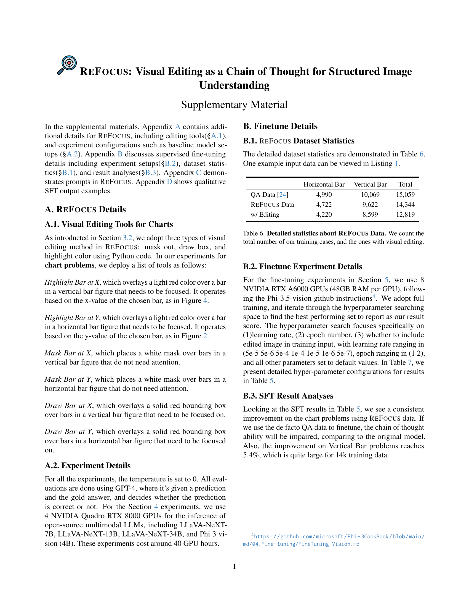
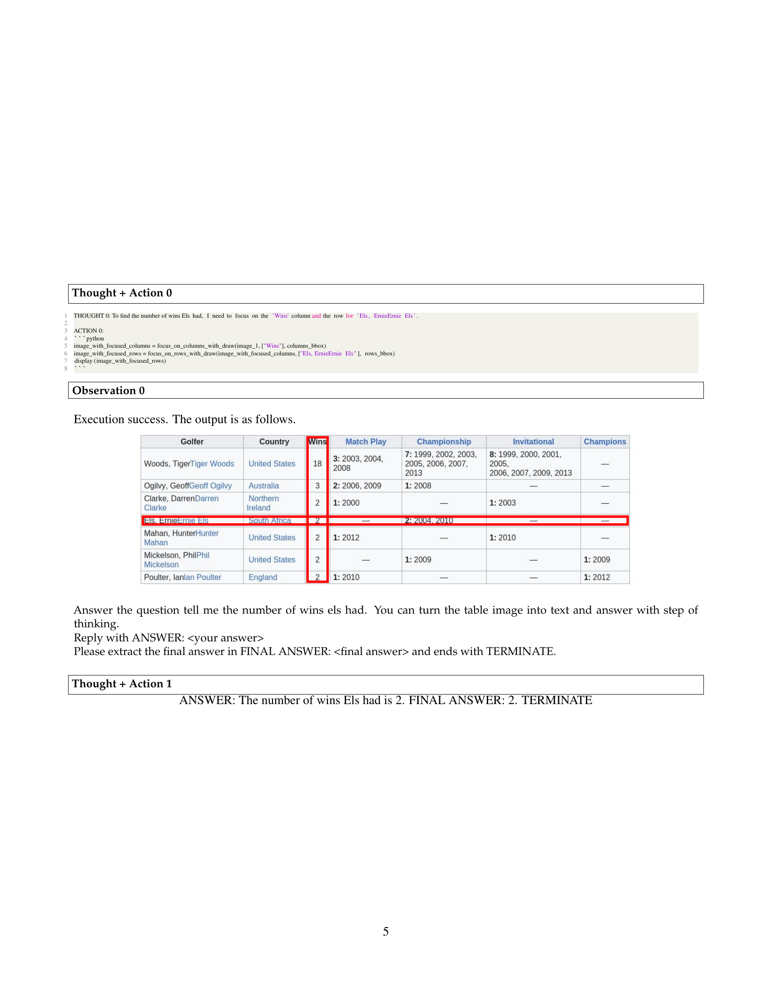

 


 2501.05452 
 Xingyu Fu et el. 
 
 🤗 2025-01-13 
 



↗ arXiv


↗ Hugging Face


↗ Papers with Code


### TL;DR



많은 멀티모달 대규모 언어 모델(LLM)은 표나 차트와 같은 구조화된 이미지를 해석하는 데 어려움을 겪습니다.  이러한 이미지는 여러 구조와 텍스트에 걸쳐 전략적으로 초점을 재조정하여 추론 과정을 거쳐야 하기 때문입니다.  기존 모델은 이러한 다단계 선택적 주의 집중 기능이 부족합니다. 

REFOCUS는 이러한 문제를 해결하기 위해 시각적 편집을 통해 멀티모달 LLM이 ‘시각적 사고’를 생성할 수 있도록 하는 프레임워크입니다.  REFOCUS는 LLM이 파이썬 코드를 생성하여 이미지를 수정함으로써 시각적 초점을 이동하고 개선합니다.  실험 결과, REFOCUS는 다양한 구조화된 이미지 이해 작업에서 GPT-4보다 성능이 크게 향상되었으며, 새롭게 수집된 REFOCUS 학습 데이터셋은 기존 VQA 데이터보다 더 효과적인 지도 학습을 제공함을 확인했습니다.



#### Key Takeaways


 REFOCUS는 시각적 편집을 통해 멀티모달 LLM의 시각적 추론 능력을 향상시키는 새로운 프레임워크입니다. 



 REFOCUS는 다양한 구조화된 이미지 이해 작업에서 GPT-4보다 우수한 성능을 보였습니다. 



 REFOCUS 데이터셋은 기존 VQA 데이터보다 더 나은 지도 학습을 제공합니다. 


#### Why does it matter?
본 논문은 **구조화된 이미지 이해를 위한 시각적 추론 능력을 향상시키는 새로운 프레임워크인 REFOCUS**를 제시하여, 멀티모달 LLM의 성능을 크게 향상시켰다는 점에서 중요합니다.  **시각적 편집을 통해 멀티모달 LLM이 '시각적 사고'를 생성하고, 선택적 주의 집중을 통해 시각적 추론 과정을 개선**할 수 있음을 보여줍니다. 또한, **새로운 REFOCUS 데이터셋을 통해 기존 VQA 데이터보다 더 나은 지도 학습을 제공**함으로써, 멀티모달 LLM의 학습 및 성능 향상에 기여할 수 있는 새로운 방향을 제시합니다.  이러한 연구 결과는 향후 멀티모달 LLM의 발전과 다양한 시각적 추론 문제 해결에 큰 영향을 미칠 것으로 예상됩니다.

------
#### Visual Insights

> 🔼 이 그림은 ReFocus의 작동 방식을 보여주는 예시입니다. TableVQA 데이터셋의 표 이미지와 질문이 주어지면, ReFocus는 GPT-4에 이미지 편집 도구들을 제공합니다. GPT-4는 필요에 따라  pseudo code를 생성하고, ReFocus는 이 코드를 실행하여 이미지를 편집합니다.  편집된 이미지는 다시 GPT-4에 입력되고, 이 과정을 반복하여 최종 답변에 도달합니다. 그림에서는 mask_column과 draw_row라는 두 가지 편집 작업이 수행된 예시를 보여줍니다.  즉, 불필요한 열을 가리고 관련 행을 강조하는 방식으로 시각적 추론 과정을 개선하는 것을 보여줍니다.
> 

> 
read the caption

> Figure 1: Overview of ReFocus. ReFocus performs visual chain of thought via input-image editing on an example data from TableVQA [16]. Given an image and question pair, ReFocus equips GPT-4 with editing tools (details in §3), and GPT-4 generates pseudo code if an edit action is needed. ReFocus then executes the editing actions, and feeds GPT-4 with the new image until an answer is reached. In the above example, mask_column and draw_row are performed.
> 


| Model | VWTQ | VWTQ_syn | VTabFact | CharXiv | Horizontal Bar | Vertical Bar |
|---|---|---|---|---|---|---|
| **Table** |  |  |  |  |  |  |
| **Chart** |  |  |  |  |  |  |
| Prior Multimodal LMs |  |  |  |  |  |  |
| LLaVA-NeXT-34B [20] | 36.4 | 38.0 | 71.2 | 18.9 | 23.4 | 12.6 |
| Phi 3 vision [1] | 44.7 | 53.2 | 74.4 | 16.2 | 60.8 | 66.5 |
| Gemini-Pro 1.5 [33] | 38.5 | 43.2 | 75.6 | 38.3 | 57.2 | 66.0 |
| VisProg [10] | 53.2 | 62.0 | 76.4 | 46.8 | 69.8 | 68.6 |
| Latest multimodal LLMs + ReFocus |  |  |  |  |  |  |
| gpt-4o-2024-05-13 [26] | 66.5 | 73.2 | 89.6 | 49.0 | 78.2 | 76.2 |
| + ReFocus | 76.9 | 79.6 | 89.6 | **57.3** | **85.4** | 81.0 |
|  | +10.4 | +3.4 | +0.0 | +8.3 | +7.2 | +4.8 |
| gpt-4o-2024-08-06 [26] | 66.4 | 70.4 | 90.0 | 48.9 | 75.2 | 74.9 |
| + ReFocus | **77.2** | **82.8** | **90.8** | 46.2 | 82.0 | **81.2** |
|  | +9.8 | +12.4 | +0.8 | -2.7 | +5.0 | +4.2 |

> 🔼 표 1은 다양한 구조화된 이미지 이해 작업에서 ReFocus가 일관된 성능 향상을 제공하며 모든 기준 모델을 능가함을 보여줍니다. GPT 기준 모델은 대화형 형식이지만 편집 기능이 없다는 점에 유의해야 합니다. 공정한 비교를 위해 기존 Visprog [10] 프레임워크의 LM 및 VQA 구성 요소를 최신 GPT-4o 모델로 교체하여 수정했습니다.
> 

> 
read the caption

> Table 1: ReFocus yields consistent performance gains across all tasks and outperforms all baselines. Notice that the GPT baselines here are also in a conversational format but without editing abilities. For fair comparison, we modify the original Visprog [10] framework by replacing the LM and VQA components with the latest GPT-4o model.
> 

### In-depth insights

#### Visual Chain of Thought
시각적 사고 연쇄(Visual Chain of Thought)는 **이미지 기반 추론 과정에서 시각적 정보를 단계적으로 처리하고, 각 단계의 결과를 다음 단계의 입력으로 활용하는 방식**을 의미합니다. 이는 기존의 텍스트 기반 사고 연쇄 방식을 확장하여 시각 정보의 복잡성을 효과적으로 다루는 접근법입니다. **이미지 편집 도구를 활용하여 이미지의 특정 영역을 강조, 제거, 또는 변형**함으로써 모델이 이미지 내에서 중요한 정보에 집중하고, 다단계 추론을 수행할 수 있도록 지원합니다. 이러한 접근법은 **다양한 시각 자료(표, 차트 등)를 이해**하는 데 있어 **기존의 다중 모달 모델의 한계를 극복**하고, **성능 향상**에 기여합니다.  **중간 단계에서 생성되는 시각적 정보는 모델의 추론 과정을 투명하게 만들어** 해석 가능성을 높이고, **데이터셋 생성 과정에 새로운 지도 방식**을 제공하여 모델 학습에 도움을 줍니다.  따라서 시각적 사고 연쇄는 다중 모달 모델의 시각적 추론 능력을 향상시키고, 복잡한 시각 자료 분석의 새로운 패러다임을 제시하는 중요한 연구 방향입니다.

#### Visual Editing Effects
본 논문에서 제시된 시각적 편집 효과는 **구조화된 이미지 이해 작업에서 멀티모달 LLM의 성능을 향상시키는 데 중요한 역할**을 합니다.  **선택적 주의 집중 메커니즘**을 통해 모델이 이미지의 관련 부분에 집중하고 불필요한 정보를 제거함으로써, **정확도 향상과 환각(hallucination) 감소**에 기여합니다. 다양한 시각적 편집 기법(마스크, 박스, 하이라이트 등)의 효과를 분석하여, 각 기법이 특정 유형의 구조화된 이미지(표, 차트 등)에 미치는 영향을 심층적으로 이해할 수 있습니다. 이러한 분석은 **멀티모달 모델의 시각적 추론 능력 향상**을 위한 새로운 방향을 제시하며, 향후 연구의 초점을 맞출 수 있는 **중요한 통찰력**을 제공합니다.  특히, 시각적 편집을 통한 중간 정보 생성이 표준 VQA 데이터보다 더 나은 지도 학습 데이터를 제공한다는 점은 **향후 멀티모달 모델 학습 방식 개선**에 대한 중요한 시사점을 줍니다.

#### REFOCUS Dataset
REFOCUS 데이터셋에 대한 심층적인 고찰은 **데이터셋의 규모, 구성, 그리고 품질**에 대한 분석에서 시작되어야 합니다.  본 논문에서 제시된 REFOCUS는 시각적 추론 능력 향상을 위해 시각적 편집을 수행하는 다중 모달 LLM을 위한 프레임워크이므로, **수집된 데이터의 양과 다양성**은 모델의 성능에 직접적인 영향을 미칩니다.  또한, **데이터 샘플의 균형** (예: 다양한 유형의 차트와 표에 대한 균등한 분포) 여부와 **주석의 정확성과 신뢰성**은 모델 학습의 효율성 및 최종 성능을 결정짓는 중요한 요소입니다.  **데이터 수집 과정의 투명성과 재현성**에 대한 논의 역시 중요한데,  REFOCUS 데이터셋이 어떻게 구축되었는지, 그리고 다른 연구자들이 동일한 방법으로 데이터를 생성할 수 있는지 여부가 데이터셋의 신뢰성을 판단하는 데 중요한 지표가 됩니다.  마지막으로, **데이터셋의 활용 가능성**을 고려해야 합니다.  REFOCUS 데이터셋이 다른 시각적 추론 과제에도 적용 가능한지, 혹은 특정한 유형의 이미지에만 국한되는지 여부가 데이터셋의 실용성을 평가하는 데 중요한 요소입니다.  결론적으로, REFOCUS 데이터셋에 대한 포괄적인 이해는 데이터셋의 규모와 질, 데이터 수집 과정, 그리고 데이터의 활용 가능성 등 여러 측면에 대한 정확한 분석을 통해서만 가능합니다.

#### Multimodal LLM Gains
본 논문에서 다루는 "멀티모달 LLM 성능 향상"에 대한 심층적인 분석은 **다양한 멀티모달 모델의 성능 비교**를 통해 **REFOCUS 프레임워크의 효과**를 명확히 제시합니다.  REFOCUS는 기존 멀티모달 LLM의 한계를 극복하고 **시각적 추론 능력**을 향상시키는 데 중점을 둡니다.  특히, 이미지 편집을 통한 시각적 사고 과정을 도입하여 **선택적 주의 집중** 및 **다단계 추론**을 가능하게 합니다.  **표와 차트 이해**와 같은 구조화된 이미지 이해 작업에서 REFOCUS를 적용한 모델은 **GPT-4를 능가하는 성능**을 보였으며,  이는 추가 정보 없이도 **시각적 편집을 통한 효과적인 추론**이 가능함을 보여줍니다.  **REFOCUS 데이터셋을 활용한 미세 조정**은 기존 VQA 데이터보다 우수한 성능 향상을 달성했는데, 이는 **시각적 사고 과정을 포함한 중간 정보가 보다 나은 지도 학습을 제공**함을 시사합니다.  이는 단순한 질의응답 쌍보다 **훨씬 풍부한 지도 신호**를 제공하여 모델 학습에 도움이 됨을 의미합니다. 결론적으로, REFOCUS는 멀티모달 LLM의 시각적 추론 능력 향상에 기여하며,  **새로운 훈련 데이터셋을 통한 미세 조정**은 성능 향상에 중요한 역할을 합니다.

#### Future Work
본 논문에서 제시된 REFOCUS 프레임워크는 구조화된 이미지 이해를 위한 **시각적 추론 능력**을 향상시키는 데 효과적임을 보여주었습니다. 하지만, **향후 연구**를 통해 더욱 개선될 여지가 있습니다.  **다양한 유형의 시각적 편집 도구**를 추가하여 모델의 유연성을 높이고, **더욱 복잡한 시각적 추론 과제**에 대한 적용성을 확장할 수 있습니다.  또한, **다양한 multimodal LLM**과의 호환성을 높여,  REFOCUS의 일반화 능력을 강화하는 연구가 필요합니다.  **대규모 데이터셋**을 구축하여 모델의 성능을 더욱 향상시키는 것 또한 중요한 과제입니다. 특히, 다양한 유형의 시각적 편집 및 추론 과정을 포함하는 데이터를 수집하여, 모델의 **일반화 성능**을 개선할 수 있습니다.  마지막으로, **REFOCUS의 효율성**을 개선하기 위한 연구가 필요합니다. 현재 REFOCUS는 시각적 편집 과정에서 다소 많은 연산 시간이 필요하므로, 효율적인 시각적 편집 기법을 개발하여 **실시간 처리**가 가능하도록 하는 연구가 중요합니다.  **다양한 응용 분야**에 대한 REFOCUS의 적용 가능성을 탐색하는 것 또한 중요한 후속 연구 과제입니다.  예를 들어, 의료 영상 분석, 지도 및 항공 사진 분석 등 다양한 분야에 적용하여 그 효용성을 검증할 수 있습니다.

### More visual insights

More on figures

> 🔼 이 그림은 ReFocus가 ChartQA 데이터셋의 기존 방식으로는 풀 수 없었던 문제를 개선된 시각적 기반으로 해결하는 과정을 보여줍니다. 왼쪽의 원본 가로 막대 그래프에서 GPT-4는 잘못된 막대를 지목하여 잘못된 답을 제시합니다. 반면 ReFocus는 이미지 편집을 통해 모델이 올바른 막대에 집중하도록 유도하여 정답을 도출해냅니다. ReFocus는 중간 과정에서 시각적 정보를 활용하여 다단계 추론을 가능하게 합니다.
> 

> 
read the caption

> Figure 2: Example of how ReFocus + GPT-4o solves previously unsolvable problem in ChartQA dataset [24] through improved visual grounding. Given the original horizontal bar image (left), GPT-4o grounds to the wrong bars and thus gets the wrong answer. ReFocus eliminates such possibility through editing, guiding the model to the correct answer (right).
> 

> 🔼 그림 3은 REFOCUS가 GPT-4에 선택적 주의 집중 기능을 부여하는 방식을 보여줍니다. 이 그림은 REFOCUS와 GPT-4를 사용하여 ChartXiv 데이터셋 [34]에서 이전에는 풀 수 없었던 문제를 해결하는 예시입니다. 구체적으로 REFOCUS는 다른 세 개의 서브플롯(산만하게 작용할 수 있는 요소)을 마스킹하여 원본 이미지에서 관련 없는 정보를 제거함으로써 이미지 편집을 수행합니다. 그 결과, GPT-4는 편집된 이미지를 사용하여 더 나은 추론을 수행하고 정답에 도달할 수 있습니다.
> 

> 
read the caption

> Figure 3: ReFocus equips GPT-4 with selective attention. Above is an example of how ReFocus + GPT-4o solves previously unsolvable problem in ChartXiv dataset [34]. Specifically, ReFocus edits upon the original image by masking out all irrelevant information – the other three subplots that could be distracting. As a result, GPT-4o is able to conduct better reasoning with the edited image, and reach the correct answer.
> 

> 🔼 그림 4는 ChartQA 데이터셋의 수직 막대 그래프 문제에서 ReFocus가 GPT-4의 시각적 기반을 강화하고 개수를 세는 능력을 향상시키는 모습을 보여줍니다.  ReFocus를 사용하지 않은 GPT-4는 그래프의 막대를 잘못 해석하여 정확한 답을 얻지 못하는 반면, ReFocus는 시각적 편집을 통해 모델이 관련 정보에 집중하도록 유도하여 정확한 답을 도출할 수 있도록 합니다.  이를 통해 ReFocus가 시각적 추론 과정을 개선하고 모델의 정확도를 높이는 데 효과적임을 보여줍니다.
> 

> 
read the caption

> Figure 4: ReFocus unleashes better visual grounding and counting abilities for GPT-4 as in ChartQA [24] Vertical Bar problems.
> 

> 🔼 TableVQA 데이터셋 [16]의 한 예시에서, ReFocus는 GPT-4가 'highlight_column' 편집 작업을 수행하도록 유도합니다.  이 간단한 작업을 통해 GPT-4는 중요한 영역에 더 집중하여 문자를 더 정확하게 인식할 수 있습니다.  기존 GPT-4는 이미지 전체를 고려하여 텍스트를 인식하는데 어려움을 겪지만, ReFocus를 통해 특정 열을 강조함으로써 모델의 시각적 집중력을 향상시키고 OCR 성능을 개선합니다.  결과적으로,  더 정확한 데이터 추출과 분석을 가능하게 합니다.
> 

> 
read the caption

> Figure 5: ReFocus unleashes better OCR for GPT-4. In this example from TableVQA [16], ReFocus + GPT-4 conducts the edit action highlight_column. With this simple action, GPT-4 can focus more on the important subarea, and recognize the characters better.
> 

> 🔼 이 그림은 ChartQA 데이터셋을 사용하여 ReFocus를 통해 학습 데이터를 수집하는 과정을 보여줍니다.  ChartQA 데이터셋의 이미지와 질문에 대해 ReFocus 프레임워크가  GPT-4와 같은 다중 모달 LLM을 활용하여 시각적 편집(visual editing)을 수행합니다.  편집된 이미지,  편집에 사용된 코드,  그리고 초점 영역의 경계 상자(bounding box) 정보를 포함하는 중간 과정의 시각적 추론(visual chain of thought) 과정을 기록하여 새로운 학습 데이터셋을 생성합니다.  그림은 이러한 데이터 수집 파이프라인의 개략적인 흐름을 시각적으로 나타냅니다.
> 

> 
read the caption

> Figure 6: Training set collection using ReFocus on ChartQA dataset.
> 

> 🔼 이 그림은 REFOCUS가 구조화된 이미지 이해 작업에서 얼마나 자주 시각적 편집을 수행하는지 보여줍니다.  GPT-4는 다양한 유형의 구조화된 이미지 데이터셋(VWTQ, VWTQ_syn, VTabFact, CharXiv, 수평 막대 차트, 수직 막대 차트)에 대해 시각적 편집을 결정합니다. 각 데이터셋에 대한 시각적 편집 빈도를 막대 그래프로 나타내어, 모델이 특정 유형의 이미지에서 시각적 편집을 더 자주 사용하는지 또는 덜 사용하는지를 보여줍니다. 이는 REFOCUS의 효율성과 적용 가능성을 이해하는 데 도움이 됩니다.
> 

> 
read the caption

> Figure 7: Statistics of how often visual editing are performed.
> 

> 🔼 그림 8은 ReFocus의 시각적 사고 과정 데이터로 미세 조정된 Phi-3.5-vision 모델이 초점을 맞춰야 할 영역을 출력하는 것을 보여줍니다. 설명을 위해 해당 영역을 빨간색 상자로 표시하고 ReFocus + GPT-4o 프롬프팅 출력 결과와 비교했습니다.  Phi-3.5-vision 모델은 시각적 사고 과정 데이터를 통해 초점 영역을 텍스트 형식(좌표 포함)으로 출력합니다. 그림은 수평 막대형 차트와 수직 막대형 차트에서 각각 예시를 보여줍니다.
> 

> 
read the caption

> Figure 8: Phi-3.5-vision finetuned with ReFocus visual chain of thought data outputs the areas to focus on. For illustration purposes, we draw these areas in red boxes, and compare with the ReFocus + GPT-4o prompting output.
> 

More on tables


| Model | VWTQ | VWTQ_syn | VTabFact | CharXiv | Horizontal Bar | Vertical Bar |
|---|---|---|---|---|---|---|
| Multimodal LLMs with original visual inputs |
| LLaVA-NeXT-7B [20] | 21.7 | 24.0 | 56.8 | 16.1 | 8.1 | 7.3 |
| LLaVA-NeXT-13B [20] | 25.6 | 30.4 | 62.4 | 18.9 | 13.5 | 13.1 |
| LLaVA-NeXT-34B [20] | 36.4 | 38.0 | 71.2 | 18.9 | 23.4 | 12.6 |
| Phi 3 vision [1] | 44.7 | 53.2 | **74.4** | 16.2 | **60.8** | **66.5** |
| Multimodal LLMs with ReFocus edited visual inputs |
| LLaVA-NeXT-7B + Oracle ReFocus | 25.7 | 26.8 | 55.2 | 15.4 | 6.8 | 8.4 |
| LLaVA-NeXT-13B + Oracle ReFocus | 30.3 | 31.6 | 61.2 | 17.5 | 15.5 | 13.1 |
| LLaVA-NeXT-34B + Oracle ReFocus | 39.1 | 41.2 | 68.0 | **21.0** | 26.1 | 15.2 |
| Phi 3 vision + Oracle ReFocus | **48.3** | **56.4** | 72.8 | 17.6 | 60.4 | **66.5** |
> 🔼 표 2는 오픈소스 모델이 원본 시각적 입력에 대해 수행하는 성능과 GPT-4o 및 ReFocus 편집 이미지를 시각적 입력으로 사용했을 때의 성능을 비교한 결과를 보여줍니다.  '+ oracle ReFocus'는 GPT-4o + ReFocus의 마지막 작업에서 생성된 시각적 결과물을 입력으로 사용한 경우를 나타냅니다.  즉, GPT-4o 모델이 ReFocus 프레임워크를 사용하여 이미지를 편집한 후, 그 최종 결과 이미지를 다른 오픈소스 모델에 입력으로 제공하여 성능을 측정한 것입니다. 이를 통해 ReFocus 프레임워크가 이미지 편집을 통해 모델의 성능 향상에 기여하는 정도를 다양한 모델에서 비교 분석합니다.
> 

> 
read the caption

> Table 2: Open-source models’ performance upon the original visual input versus GPT-4o + ReFocus edited images as visual input (referred by + oracle ReFocus). Notice that + oracle ReFocus uses the visual artifact generated in the last action of GPT-4o + ReFocus as inputs.
> 


| Model | VWTQ | VWTQ_syn | VTabFact | CharXiv | Horizontal Bar | Vertical Bar |
|---|---|---|---|---|---|---|
| **Table** |  |  |  |  |  |  |
| GPT-4o Model |  |  |  |  |  |  |
| Text input | 68.1 | 69.6 | 80.0 | \ | 66.2 | 74.9 |
| Figure Input | 61.0 | 68.4 | 88.4 | 47.9 | 75.2 | 74.9 |
| Text + Figure Input | 67.5 | 72.8 | 91.6 | \ | 75.7 | 81.7 |
| GPT-4o + ReFocus |  |  |  |  |  |  |
| Figure Input | 77.2 | 82.8 | 90.8 | 57.3 | 85.4 | 81.2 |
|  | +16.2 | +14.4 | +2.4 | +10.6 | +9.7 | +0.5 |
> 🔼 표 3은 ReFocus가 시각적 편집 없이 대화형 방식으로 평가한 GPT-4o의 성능과 비교하여,  골드 텍스트 입력을 받은 것처럼 GPT-4o의 성능을 향상시키는 것을 보여줍니다. 입력 텍스트는 주로 3.1절에 자세히 설명된 CSV 테이블입니다. 표 1은 시각적 편집 없이 대화형 방식으로 측정한 성능을 보여주는 반면, 표 3은 직접적인 질문 응답을 기반으로 하기 때문에 약간의 차이가 있을 수 있습니다.
> 

> 
read the caption

> Table 3: ReFocus empowers GPT-4o to achieve the performance as if given gold text input. The text input are mainly csv tables, as detailed in Section 3.1. Notice that Table 1 reports the conversational performance without visual editing, whereas the performance discussed here is based on direct question answering, leading to minor differences.
> 


| Dataset | Original | Mask out | Draw Box | Highlight |
|---|---|---|---|---|
| VWTQ | 66.4 | 77.2 | **77.6** | 74.8 |
| VWTQ_syn | 70.4 | **82.4** | 78.8 | 80.8 |
> 🔼 본 표는 ReFocus에서 제공하는 세 가지 시각적 편집 도구(마스크, 박스 그리기, 강조 색상)가 모델 성능에 미치는 영향을 분석한 결과입니다. VWTQ 및 VWTQ_syn 데이터셋에서 ReFocus가 제공하는 도구 유형을 제어하여 실험을 수행했습니다. 각 도구의 효과를 비교하여 어떤 도구가 모델 성능 향상에 가장 효과적인지 파악하는 데 도움이 됩니다.
> 

> 
read the caption

> Table 4: Analysis on how different editing tool can affect model performance. We control the tool type provided by ReFocus and experiment on the VWTQ and VWTQ_syn datasets.
> 


|             | Horizontal Bar | Vertical Bar | Avg. |
|-------------|-----------------|---------------|------|
| **QA Prompting** |                 |               |      |
| Phi-3.5-vision [12] | 60.1            | 63.1          | 61.5 |
| SFT w/ QA Data      | 60.1            | 65.5          | 62.6 |
| **Visual CoT Prompting** |                 |               |      |
| Phi-3.5-vision [12] | 69.4            | 66.8          | 68.2 |
| SFT w/ QA Data      | 60.6            | 66.8          | 63.4 |
| SFT w/ ReFocus CoT   | 67.1            | 70.7          | 68.8 |
| SFT w/ ReFocus VCoT  | **71.0**         | **72.2**       | **71.4** |
> 🔼 표 5는 지도학습 미세조정(SFT) 정확도 결과를 보여줍니다. ReFocus VCoT 데이터와 CoT 데이터의 차이점은 VCoT에는 재초점 영역의 경계 상자 좌표가 포함되어 있는 반면 CoT에는 포함되어 있지 않다는 것입니다. 모든 학습은 동일한 학습 데이터 세트에서 가장 성능이 좋은 하이퍼 매개변수를 선택합니다.
> 

> 
read the caption

> Table 5: SFT accuracy results. The difference between ReFocus VCoT data and CoT data is that VCoT contains refocus area bounding box coordinates whereas CoT does not. All trainings select the best performing hyper-parameters on the same set of training data.
> 


|                     | Horizontal Bar | Vertical Bar | Total |
|---------------------|-----------------|----------------|-------|
| QA Data [24]        | 4,990           | 10,069          | 15,059 |
| ReFocus Data        | 4,722           | 9,622           | 14,344 |
| w/ Editing          | 4,220           | 8,599           | 12,819 |
> 🔼 표 6은 ReFocus 데이터셋에 대한 상세 통계를 보여줍니다. 전체 훈련 케이스의 수와 시각적 편집이 포함된 케이스의 수를 나타냅니다.  `QA Data` 열은 원본 ChartQA 데이터셋의 훈련 데이터 크기를 보여주고, `ReFocus Data` 열은 ReFocus 기법을 적용하여 생성된 새로운 훈련 데이터셋의 크기를 나타냅니다.  `w/ Editing` 열은 ReFocus에서 실제로 시각적 편집이 수행된 데이터의 개수를 의미합니다. 이 표는 ReFocus 데이터셋의 규모와 시각적 편집의 활용 빈도를 파악하는 데 도움을 줍니다.
> 

> 
read the caption

> Table 6: Detailed statistics about ReFocus Data. We count the total number of our training cases, and the ones with visual editing.
> 


|               | w/ default QA Data | w/ ReFocus VCoT | w/ ReFocus CoT |
| :------------ | :------------------ | :--------------- | :--------------- |
| data type     | bf16                | bf16              | bf16              |
| batch size    | 64                  | 64                | 64                |
| learning rate | 5 × 10⁻⁷             | 1 × 10⁻⁶           | 5 × 10⁻⁶           |
| epoch number  | 2                   | 2                 | 2                 |
| include edited image in input | No                  | No                | Yes               |
> 🔼 표 7은 논문에서 제시된 최적의 미세 조정 모델에 대한 초매개변수 설정을 보여줍니다.  각 모델의 데이터 유형, 배치 크기, 학습률, 에폭 수, 미세 조정 과정에서 편집된 이미지를 포함할지 여부 등의 세부 정보를 포함하여 더 자세한 설명을 제공합니다.
> 

> 
read the caption

> Table 7: Hyper-parameter settings for our best fine-tuned models.
> 

### Full paper



