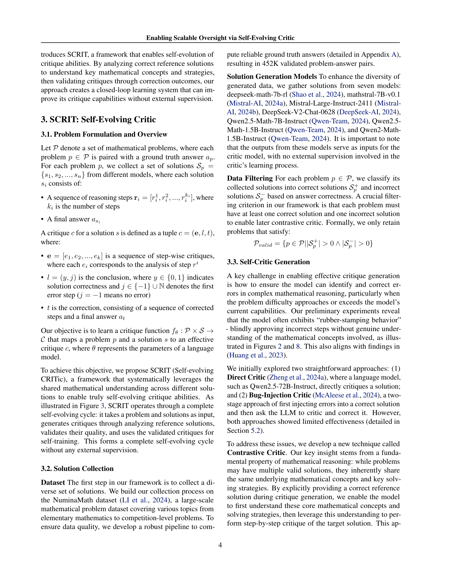

 


 2501.05727 
 Zhengyang Tang et el. 
 
 🤗 2025-01-13 
 



↗ arXiv


↗ Hugging Face


↗ Papers with Code


### TL;DR



대규모 언어 모델(LLM)의 놀라운 성능에도 불구하고, **확장 가능한 감독(Scalable oversight)**은 여전히 어려운 과제입니다.  이는 특히 인간의 평가가 어렵거나 LLM이 인간을 능가하는 작업에서 효과적인 피드백을 제공하는 데 어려움을 겪기 때문입니다. 기존의 LLM 비판 접근법은 인간의 주석이나 더 강력한 모델에 의존하는 한계를 가지고 있어, 외부 감독 없이 비판 능력을 향상시키는 방법은 여전히 해결되지 않은 문제였습니다.

본 논문에서는 이 문제를 해결하기 위해 **자기 진화적 비판(SCRIT)** 프레임워크를 제시합니다. SCRIT은 합성 데이터를 사용하여 LLM의 비판 능력을 자체적으로 향상시키는 방법을 제시합니다.  **대조 기반 자기 비판(Contrastive-based self-critic)**은 참조 솔루션을 사용하여 단계별 비판을 생성하고, **자기 검증(Self-validation)** 메커니즘은 결과 수정을 통해 비판의 질을 보장합니다.  실험 결과, SCRIT은 기존 방법보다 우수한 성능을 보이며, 데이터와 모델 크기가 증가함에 따라 성능이 향상되는 것을 확인했습니다.



#### Key Takeaways


 SCRIT은 **외부 감독 없이** LLM의 비판 능력을 자체적으로 향상시키는 프레임워크입니다. 



 대조 기반 자기 비판(Contrastive-based self-critic) 및 자기 검증(Self-validation) 메커니즘을 통해 **고품질 비판 데이터**를 생성합니다. 



 데이터 및 모델 크기가 증가함에 따라 성능이 향상되는 **확장성**을 보이며, 기존 방법보다 우수한 성능을 보입니다. 


#### Why does it matter?
이 논문은 **확장 가능한 감독(Scalable oversight)** 문제에 대한 혁신적인 해결책을 제시하여, 연구자들이 **LLM의 비판적 능력을 향상**시키는 데 도움을 줍니다.  이는 인간의 개입을 최소화하면서 LLM의 성능을 향상시키는 데 중요한 의미를 지닙니다.  **자기 진화적 비판(Self-evolving critic)**이라는 새로운 접근 방식은 향후 연구에 새로운 가능성을 열어줄 뿐만 아니라, 현재의 연구 동향과도 밀접하게 관련되어 있습니다.  특히, 인간의 개입을 줄이면서 LLM을 발전시키는 방법에 대한 연구는 현재 AI 분야의 주요 관심사 중 하나입니다.

------
#### Visual Insights

> 🔼 그림 1은 Qwen2.5-72B-Instruct 기본 모델과 SCRIT(Self-evolving CRITic)으로 발전된 모델의 성능을 두 가지 상호 보완적인 평가 프로토콜을 통해 비교 분석한 결과를 보여줍니다. 두 가지 프로토콜은 비판 능력의 다양한 측면을 평가하도록 설계되었습니다.  구체적으로는, 의도적으로 잘못된 답변, 균형 잡힌 답변, 그리고 기본 모델이 생성한 답변에 대한 비판 능력을 평가합니다. 이를 통해 SCRIT이 기본 모델에 비해 비판 및 수정 능력이 얼마나 향상되었는지, 그리고 비판 능력의 다양한 측면에서 어떤 성능 향상을 보이는지 확인할 수 있습니다.
> 

> 
read the caption

> Figure 1: Performance comparison between Qwen2.5-72B-Instruct (base model), +SCRIT (self-evolved model) across two complementary evaluation protocols to assess different aspects of critique capabilities.
> 


| Model | ARC-C | College Math | GPQA | GSM8K | MATH | Minerva Math | MMLU STEM | Olympiad Bench | Avg. |
|---|---|---|---|---|---|---|---|---|---|
| *Critic on deliberately incorrect solutions* |  |  |  |  |  |  |  |  |  |
| Qwen2.5-72B-Instruct | 80.6 | 27.6 | 16.3 | 79.5 | 51.1 | 15.7 | 27.4 | 19.5 | 39.7 |
| + SCRIT | **86.7** | **32.6** | **25.3** | **88.3** | **66.0** | **23.4** | **50.7** | **27.0** | **50.0** |
| o1-mini | 74.9 | 34.8 | 26.3 | 88.6 | 78.0 | 23.8 | 45.5 | 40.8 | 51.6 |
| *Critic on balanced solutions* |  |  |  |  |  |  |  |  |  |
| Qwen2.5-72B-Instruct | 85.2 | **50.9** | **31.1** | 88.3 | 72.0 | **47.1** | 42.1 | 44.6 | 57.7 |
| + SCRIT | **90.1** | 50.5 | 29.5 | **94.1** | **75.7** | 45.6 | **64.7** | **46.4** | **62.1** |
| o1-mini | 83.7 | 52.7 | 45.3 | 93.0 | 85.8 | 49.8 | 57.9 | 57.3 | 65.7 |
| *Critic on Qwen2.5-72B-Instruct’s own solution* |  |  |  |  |  |  |  |  |  |
| Qwen2.5-72B-Instruct | **93.5** | 45.9 | 32.6 | 96.7 | **83.6** | 38.3 | 59.6 | 43.4 | 61.7 |
| + SCRIT | 91.3 | 45.9 | **35.3** | 96.7 | 82.5 | **38.7** | **67.5** | **45.3** | **62.9** |
| o1-mini | 93.9 | 47.0 | 36.8 | 96.7 | 89.9 | 40.2 | 68.5 | 53.6 | 65.8 |

> 🔼 표 1은 기본 모델(Qwen2.5-72B-Instruct)과 SCRIT(Self-evolving CRITic)의 성능을 비교한 표입니다.  Critic and Correct 프로토콜을 사용하여 평가하였으며, 다양한 어려움의 수학 문제(deliberately incorrect solutions, balanced solutions, Qwen2.5-72B-Instruct의 자체 솔루션)에 대한 평가 결과를 보여줍니다. 굵은 숫자는 SCRIT이 기본 모델보다 성능이 우수함을 나타냅니다.  각 문제 유형에 대해 기본 모델과 SCRIT 모델의 정확도를 비교하여 어떤 모델이 더 나은 성능을 보이는지 명확하게 보여줍니다. 
> 

> 
read the caption

> Table 1: Performance comparison on Critic and Correct protocol. Numbers in bold indicate better performance between base model and SCRIT.
> 

### In-depth insights

#### Self-Evolving Critique
자기 진화적 비평(Self-Evolving Critique)은 **대규모 언어 모델(LLM)**의 한계를 극복하기 위한 혁신적인 접근 방식입니다. 기존의 LLM들은 인간의 개입이나 더 강력한 모델에 의존하여 비평 능력을 향상시켰지만, 자기 진화적 비평은 **외부 감독 없이도 스스로 비평 능력을 향상**시킵니다. 이는 **대조적 자기 비평(Contrastive Self-Critic)**과 **자기 검증(Self-Validation)**이라는 두 가지 핵심 기술을 통해 가능합니다. 대조적 자기 비평은 참조 솔루션을 사용하여 단계별 비평을 생성하고, 자기 검증은 수정 결과를 통해 비평의 질을 보장합니다. **합성 데이터**를 활용하여 자가 학습함으로써, 외부 감독 없이도 LLM의 비평 능력을 향상시키고 확장성 있는 감독을 가능하게 합니다.  **데이터 크기와 모델 크기가 커짐에 따라 성능이 향상**되는 것을 실험적으로 확인하였으며, 다른 접근 방식보다 우수한 성능을 보여줍니다. 특히 자기 검증 구성 요소는 성능 향상에 중요한 역할을 합니다.

#### Contrastive Learning
대조 학습은 **두 개 이상의 데이터 포인트 간의 유사성 또는 상이성을 학습**하는 기계 학습 방법입니다.  자연어 처리 분야에서, 이는 두 문장이 의미적으로 얼마나 유사한지 또는 다른지를 모델이 학습하도록 하는 데 사용될 수 있습니다.  **긍정적 예시와 부정적 예시를 비교**하여 모델이 차이점을 학습하도록 함으로써, 더 정확하고 의미 있는 표현을 생성하고, 문맥 이해를 향상시키며, **오류를 감지하고 수정하는 능력**을 개선할 수 있습니다. 이러한 **비교 분석을 통해 모델은 더욱 세련된 언어 능력을 습득**하고, 모호성을 줄이며, 논리적인 추론을 개선할 수 있습니다.  결과적으로, 대조 학습은 **LLM(대규모 언어 모델)의 성능과 신뢰도 향상**에 크게 기여할 수 있습니다.  특히,  **자기 비판 및 수정 능력 강화**에 효과적이며,  **외부 감독 없이도 모델의 자체 발전을 가능하게** 합니다.

#### Critique Validation
논문에서 ‘비판 검증(Critique Validation)’이라는 제목의 섹션은 생성된 비판의 질을 확보하는 데 중추적인 역할을 합니다. **자체 검증 메커니즘**을 통해 모델이 생성한 비판의 정확성과 타당성을 평가하고, 낮은 질의 비판은 제거함으로써, **모델의 자기 학습 과정의 질적 향상**을 도모합니다.  이는 단순히 정답 여부만 확인하는 것이 아니라, 비판에 따른 수정이 논리적이고 수학적으로 타당한지까지 검증하는 고차원적인 과정입니다.  **참조 솔루션과의 대조**를 통해 비판의 근거를 마련하고, 수정된 답변의 정확성을 검증하는 이중적인 접근 방식을 통해, **외부 감독 없이도 모델 스스로 비판 능력을 향상**시킬 수 있는 토대를 마련합니다.  이는 확장 가능한 감독 시스템 구축에 있어서 매우 중요한 부분이며, **인간의 개입 없이도 LLMs의 비판 능력을 향상**시키는 핵심 전략으로 볼 수 있습니다.  **자기 발전적인 비판 능력**의 핵심 요소로서,  효과적인 자기 학습과 신뢰할 수 있는 결과 도출에 기여하는 핵심적인 부분입니다. 

#### Scalability & Limits
본 논문은 대규모 언어 모델(LLM)의 **확장성 한계**와 관련된 심도있는 논의를 제시합니다.  특히,  인간의 평가가 어렵거나 LLM이 인간을 능가하는 작업에 대한 효과적인 피드백 제공의 어려움을 지적합니다.  **확장 가능한 감독(Scalable Oversight)**의 중요성을 강조하며, 기존의 인간 주석이나 강력한 모델에 의존하는 접근 방식의 한계를 짚습니다.  이는 **비용 및 효율성** 측면에서 문제가 될 수 있으며, **모델 자체의 능력 향상**이라는 근본적인 질문에 대한 답을 제공하지 못한다는 점을 지적합니다.  **자기 진화적 비평(Self-evolving Critic)** 개념을 통해 이러한 한계를 극복할 수 있는 가능성을 제시합니다.  이는 외부 감독 없이도 모델의 비평 능력을 향상시킬 수 있는 혁신적인 방법론입니다.  하지만, 이러한 접근 방식 또한 완벽하지 않으며,  **데이터 품질** 및 **모델의 크기**와 같은 요소에 의존적일 수 있다는 점을 유념해야 합니다.  **자기 평가(Self-validation)** 메커니즘을 통해 이러한 문제를 어느 정도 해결할 수 있지만,  완전한 해결책은 아니며 추가적인 연구가 필요함을 시사합니다.  궁극적으로, LLM의 확장성을 위한 지속적인 연구와 발전이 필수적임을 강조하는 내용입니다.

#### Future Directions
본 논문은 **자기 진화적 비평(SCRIT)** 프레임워크를 통해 LLM의 비평 능력 향상에 대한 새로운 접근 방식을 제시합니다.  미래 방향으로는, **다양한 도메인으로의 확장**과 **강화 학습(RLHF)과의 시너지 효과 탐구**, 그리고 **더욱 정교한 커리큘럼 학습 방식** 개발 등을 고려할 수 있습니다. 특히, 주관적 판단이 필요한 도메인에서의 **윤리적 고려**는 매우 중요하며,  **다양한 사회 집단에 대한 공정성**을 확보하는 방안 마련이 필수적입니다. 또한, **모델의 자기 개선 과정에 대한 투명성 확보**는 신뢰도 향상에 중요한 요소가 될 것입니다.  **비평 능력의 객관적인 평가 지표 개발** 또한, SCRIT의 발전과 널리 활용을 위해 필요한 중요한 과제입니다.  **모델 크기 및 데이터 크기의 스케일링 효과**에 대한 추가적인 연구는 SCRIT의 성능 향상을 위한 중요한 단서를 제공할 것입니다.  마지막으로, **비평 능력을 넘어 더욱 고차원적인 추론 능력**으로 확장하는 연구가 향후 LLM 발전에 크게 기여할 것으로 예상됩니다.

### More visual insights

More on figures

> 🔼 그림 2는 직접 비평가(Direct Critic)와 대조 비평가(Contrastive Critic)의 차이점을 보여줍니다. 직접 비평가는 잘못된 답을 무비판적으로 수용하고 잘못된 수정을 제공하는 반면, 대조 비평가는 참조 솔루션(Reference Solution)을 분석하여 핵심 개념과 문제 해결 전략을 이해함으로써 오류를 식별하고 효과적인 수정을 가능하게 합니다.  직접 비평가는 학생의 답을 검토하고, 참조 솔루션이 없는 상태에서 단계별로 비평을 합니다. 반면에 대조 비평가는 먼저 참조 솔루션을 분석하고, 그 이해를 바탕으로 학생의 솔루션을 단계별로 비평합니다.  이러한 차이점은 대조 비평가가 더 정확하고 효과적인 비평을 생성할 수 있음을 시사합니다.
> 

> 
read the caption

> Figure 2: Comparison between Direct Critic and Contrastive Critic. Direct Critic exhibits rubber-stamping behavior by blindly approving the incorrect solution and providing misled correction. Contrastive Critic analyzes the reference solution to understand key concepts and solving strategies, enabling error identification and effective correction.
> 

> 🔼 그림 3은 논문에서 제안하는 SCRIT 프레임워크의 개요를 보여줍니다.  SCRIT은 문제와 여러 솔루션을 입력받아 참조 솔루션을 분석하여 비판적 평가를 생성하고, 이 평가의 질을 검증한 후 검증된 평가를 이용해 자기 학습을 수행하는 완전한 자기 진화 주기를 통해 작동합니다. 이러한 과정을 통해 외부 감독 없이도 비판 능력을 향상시키는 것입니다. 그림에서는 문제와 학생 솔루션이 자기 비판(Self-Critic) 모듈에 입력되는 과정과, 참조 솔루션 분석(Reference Analysis), 학생 솔루션에 대한 단계별 비판(Step-wise Critique), 결론 도출(Conclusion), 수정(Correction) 등의 단계를 거쳐 자기 검증(Self-Validation)을 통해 유효한 비판을 걸러내고, 이를 다시 자기 학습(Self-Training)에 사용하여 모델 매개변수를 업데이트하는 과정을 시각적으로 보여줍니다.
> 

> 
read the caption

> Figure 3: Overview of SCRIT framework.
> 

> 🔼 그림 4는 세 가지 차원(문제 영역의 복잡성, 문제 난이도, 솔루션 생성 모델)에서 자기 비판 및 자기 검증 필터링을 거치기 전후의 데이터 흐름 통계와 검증률을 보여줍니다. 데이터는 문제 영역의 복잡성에 따라 세 가지 범주(초등, 중등, 고등)로 나뉘며, 각 범주 내에서 문제의 난이도는 고유한 정답의 개수로 측정됩니다. 솔루션 생성 모델은 다양한 크기와 성능을 가진 여러 언어 모델을 포함합니다. 그림은 각 단계에서 데이터의 양과 검증률을 시각적으로 보여주어, 자기 비판과 자기 검증이 데이터 품질을 향상시키는 데 어떻게 기여하는지 보여줍니다.
> 

> 
read the caption

> Figure 4: Data flow statistics and validation rates before and after self-critic and self-validation filtering across three dimensions: domain complexity, problem difficulty, and solution generation models.
> 

> 🔼 그림 5는 데이터 크기 변화에 따른 SCRIT의 성능 변화와 세 가지 비평 메커니즘(대조적 비평, 직접 비평, 버그 주입 비평)의 성능 비교를 보여줍니다. 세 가지 비평 메커니즘은 모두 동일한 문제와 해결책 집합을 사용하여 엄격하게 제어된 실험 환경에서 비교되었습니다.  x축은 훈련 데이터 크기를 나타내고, y축은 두 가지 지표(CC-Acc, EI-F1)를 나타냅니다. CC-Acc는 비평 및 수정 프로토콜 전반에 걸쳐 평균화된 비평 수정 정확도이며, EI-F1은 오류 식별 프로토콜의 오류 식별 F1 점수입니다. 이 그림을 통해 대조적 비평이 다른 두 메커니즘에 비해 초기 단계부터 우수한 성능을 보이며, 훈련 데이터 크기가 증가함에 따라 성능 향상이 지속적으로 나타나는 것을 확인할 수 있습니다.
> 

> 
read the caption

> Figure 5: Scaling behavior of SCRIT across data size and comparison of critic mechanisms. We compare three critic mechanisms: Contrastive Critic, Direct Critic, and Bug-Injection Critic.
> 

> 🔼 그림 6은 Qwen2.5 1.5B, 7B, 72B 매개변수를 가진 모델 크기에 따른 SCRIT의 성능 변화를 보여줍니다.  x축은 모델 크기(10억 매개변수)를 나타내고, y축은 두 가지 지표인 CC-Acc(Critic and Correct 정확도)와 EI-F1(Error Identification F1 점수)의 값을 나타냅니다. 그래프는 모델 크기가 커질수록 CC-Acc와 EI-F1 점수가 모두 증가함을 보여줍니다. 이는 SCRIT의 성능이 모델 크기에 따라 비례적으로 향상됨을 시사합니다.  각 지표에 대한 세부적인 수치는 그래프에 직접적으로 표시되어 있습니다.
> 

> 
read the caption

> Figure 6: Scaling behavior of SCRIT across model sizes from Qwen2.5 1.5B to 72B parameters.
> 

> 🔼 그림 7은 논문에서 제시된 세 가지 비평 메커니즘(Direct Critic, Bug-Injection Critic, Contrastive Critic)에 사용된 시스템 프롬프트를 보여줍니다. 왼쪽 상단에는 추가적인 맥락 없이 직접적으로 솔루션의 정확성을 분석하는 Direct Critic의 프롬프트가 있습니다. 왼쪽 하단에는 먼저 버그를 주입한 후(1단계), 버그가 주입된 솔루션에 대해 Direct Critic을 적용하는(2단계) Bug-Injection Critic의 프롬프트가 나옵니다. 오른쪽에는 먼저 참조 솔루션을 분석하여 주요 수학적 개념을 이해한 후 단계별 비평을 수행하는 Contrastive Critic의 프롬프트가 있습니다.
> 

> 
read the caption

> Figure 7: System prompts used for different critic mechanisms. Top Left: Direct Critic directly analyzes solution correctness without any additional context. Bottom Left: Bug-Injection Critic first injects bugs (Step 1) then direct critic on bug-injected solution (Step 2). Right: Contrastive Critic first analyzes a reference solution to understand key mathematical concepts before conducting step-wise critique.
> 

More on tables


| Model | PRM800K | GSM8K | MATH | Olympiad Bench | OmniMath | Avg. |
|---|---|---|---|---|---|---|
| Qwen2.5-72B-Instruct | 23.7 | 68.9 | 50.9 | 25.5 | 20.0 | 37.8 |
| + SCRIT | 24.6 | 80.2 | 60.0 | 32.5 | 27.8 | 45.0 |
| o1-mini | 34.0 | 88.0 | 81.1 | 53.0 | 38.6 | 58.9 |
> 🔼 표 2는 모델의 오류 수정 및 오류 식별 기능을 평가하기 위한 '비평 및 수정' 프로토콜의 성능 비교 결과를 보여줍니다. 기준 모델(Qwen2.5-72B-Instruct)과 SCRIT 모델의 성능을 비교하여 각 데이터셋(PRM800K, ProcessBench, OlympiadBench, GSM8K, MATH, OmniMath)에서의 F1 점수를 제시합니다. 굵게 표시된 숫자는 SCRIT 모델이 기준 모델보다 성능이 우수함을 나타냅니다. 이 표는 SCRIT 모델의 오류 식별 및 수정 능력이 기준 모델에 비해 우수함을 보여주는 실험 결과를 요약하여 제시합니다.
> 

> 
read the caption

> Table 2: Performance comparison on Critic and Correct with Error Identification protocol. Numbers in bold indicate better performance between base model and SCRIT.
> 


| Setting | CC-Acc | EI-F1 |
|---|---|---|
| Baseline | 56.8 | 40.2 |
| *Self-Validation* |  |  |
| Without Self-Validation | 56.0 (-0.8) | 37.2 (-3.0) |
| *Problem Domain* |  |  |
| Limited to GSM8K + MATH | 55.4 (-1.4) | 38.8 (-1.4) |
| *Problem Difficulty* |  |  |
| More Unique Answers First | 55.8 (-1.0) | 38.1 (-2.1) |
| Less Unique Answers First | 56.2 (-0.6) | 42.3 (+2.1) |
| *Single Solution Model* |  |  |
| deepseek-math-7b-rl | 56.5 (-0.3) | 39.8 (-0.4) |
| mathstral-7B-v0.1 | 56.0 (-0.8) | 39.2 (-1.0) |
| Mistral-Large-Instruct | 56.3 (-0.5) | 40.3 (+0.1) |
| DeepSeek-V2-Chat | 56.3 (-0.5) | 40.0 (-0.2) |
| Qwen2.5-Math-7B | 56.2 (-0.6) | 40.7 (+0.5) |
| Qwen2.5-Math-1.5B | 56.2 (-0.6) | 40.9 (+0.7) |
| Qwen2-Math-1.5B | 55.9 (-0.9) | 40.9 (+0.7) |
| *Good:Bad Solution Ratio* |  |  |
| 0.75:0.25 | 55.1 (-1.7) | 38.1 (-2.1) |
| 0.25:0.75 | 56.6 (-0.2) | 41.0 (+0.8) |
> 🔼 표 3은 SCRIT에 대한 제어된 절제 연구 결과를 보여줍니다. 각 실험은 기준 설정(대조적 비평가와 자기 검증을 사용한 10,000개의 훈련 예시, 다양한 도메인, 모든 솔루션 모델 및 균형 잡힌 솔루션 비율)을 유지하면서 대상 구성 요소만 변경합니다. 빨간색/녹색 숫자는 기준선 대비 성능 감소/증가를 나타냅니다.  즉, 이 표는 SCRIT 모델의 성능에 영향을 미치는 요소들을 하나씩 제거해 가며 실험한 결과를 보여줍니다.  각 요소(자기 검증, 문제 도메인, 문제 난이도, 솔루션 모델, 양성/음성 솔루션 비율)들을 제거하거나 변경했을 때 모델 성능이 어떻게 변화하는지 보여주는 것입니다.
> 

> 
read the caption

> Table 3: Controlled ablation studies on SCRIT. Each experiment varies only the target component while keeping all other settings fixed at baseline: 10K training examples with contrastive critic and self-validation, diverse domains, all solution models, and balanced solution ratio. Red/green numbers indicate performance decrease/increase from baseline.
> 

### Full paper



