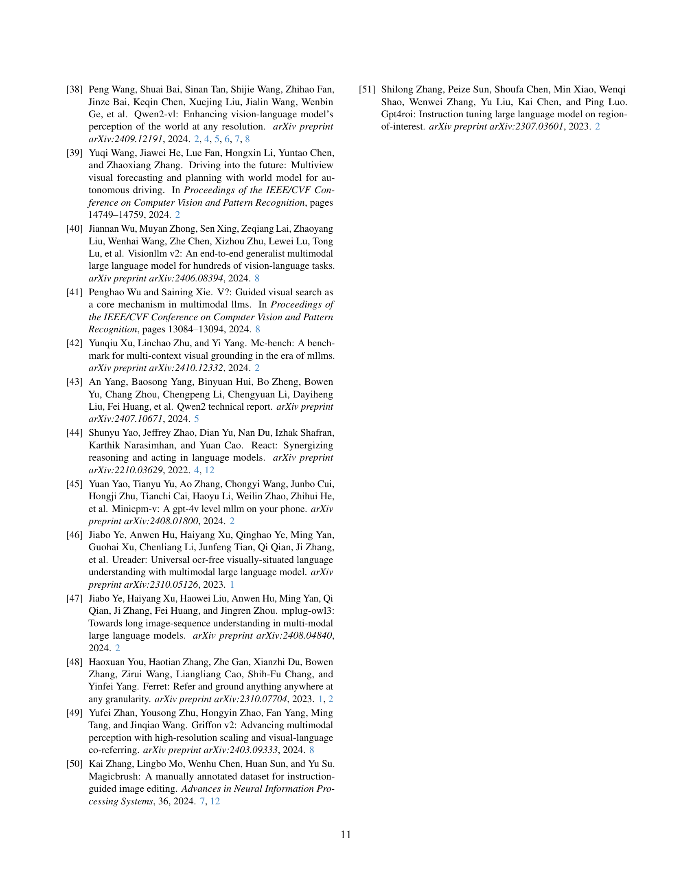

 


 2501.05767 
 You Li et el. 
 
 🤗 2025-01-13 
 



↗ arXiv


↗ Hugging Face


↗ Papers with Code


### TL;DR



기존의 멀티모달 대규모 언어 모델(MLLM)은 단일 이미지에 대한 세분화된 인식은 뛰어나지만, 복잡한 다중 이미지 시나리오에서 정확한 접지를 달성하는 데 어려움을 겪고 있습니다. 특히, **자유 형식 쿼리**를 사용한 다중 이미지 접지(MIG)는 모델이 다양한 형태의 질문과 이미지 컨텍스트를 처리해야 하므로 더욱 어렵습니다.

본 논문에서는 이러한 문제를 해결하기 위해 **Migician**이라는 새로운 MLLM을 제시합니다. Migician은 **end-to-end 방식**으로 설계되어 단일 이미지 접지와 다중 이미지 이해 능력을 통합하고, **MGrounding-630k**라는 대규모 데이터셋과 **MIG-Bench**라는 새로운 벤치마크를 통해 성능을 평가합니다. 실험 결과, Migician은 기존 MLLM을 상당히 능가하는 성능을 보이며, 다중 이미지 접지 분야에 중요한 발전을 가져왔음을 보여줍니다.



#### Key Takeaways


 Migician은 자유 형식 쿼리를 사용한 다중 이미지 접지 문제를 해결하기 위한 최초의 end-to-end 멀티모달 대규모 언어 모델 



 MGrounding-630k라는 대규모 데이터셋과 MIG-Bench라는 포괄적인 벤치마크를 통해 객관적인 평가 및 비교 가능 



 다양한 다중 이미지 접지 작업에서 기존 최고 성능 모델들을 상당히 능가하는 성능을 입증 


#### Why does it matter?
본 논문은 **다중 이미지 접지(MIG)**라는 새로운 문제를 제기하고, 이를 해결하기 위한 최초의 다중 모드 대규모 언어 모델인 **Migician**을 제시함으로써 **멀티모달 AI 연구**에 중요한 기여를 합니다.  **자유 형식 쿼리**를 사용한 정확한 접지 능력을 통해 자율 주행, 감시 시스템, 로봇 공학 등 다양한 분야에 적용될 수 있는 잠재력을 가지고 있으며, **새로운 벤치마크와 데이터셋**을 공개하여 후속 연구를 위한 기반을 마련했습니다.  이는 **멀티모달 AI의 발전**에 크게 기여하고, 향후 연구 방향을 제시하는 중요한 연구입니다.

------
#### Visual Insights

> 🔼  그림 1은 두 부분으로 나뉩니다. 왼쪽은 자유 형식 다중 이미지 접지의 예시를 보여줍니다. 이 작업은 자유 형식 쿼리에 따라 여러 이미지에서 관련 시각적 영역을 식별하고 찾는 것을 목표로 합니다. 오른쪽은 본 논문에서 제안된 모델인 Migician이 다양한 다중 이미지 접지 작업에서 다른 MLLM보다 성능이 훨씬 뛰어남을 보여줍니다. Migician은 자유 형식 질문에 대한 응답으로 여러 이미지에서 관련 시각적 영역을 정확하게 식별하고 위치를 지정할 수 있습니다.
> 

> 
read the caption

> Figure 1: Left: Examples of free-form multi-image grounding. The task is to identify and localize relevant visual regions across multiple images based on a free-form query. Right: Our proposed model, Migician, significantly outperforms other MLLMs on various multi-image grounding tasks.
> 


| Models | Spontaneous Grounding |  | Referential Grounding |  | AVE |
|---|---|---|---|---|---|---|
| | Difference | Similarity | Visual Reference | Textual | Visual+Textual |  |
| | Static | Robust | Common | OT | MV | Region | Refer | GG | Reason | Co-Re |  |
|---|---|---|---|---|---|---|---|---|---|---|---|
| Human Performance |  |  |  |  |  |  |  |  |  |  |  |
| Human | 99.50* | 97.87 | 98.00* | 100.00 | 96.88 | 100.00* | 98.99 | 91.06* | 92.08 | 97.44 | 97.18 |
| 70B-Scale MLLMs |  |  |  |  |  |  |  |  |  |  |  |
| LLaVA-OV-72B | 13.26 | 5.34 | 26.84 | 12.91 | 7.64 | 2.14 | 17.83 | 21.60 | 11.88 | 8.55 | 13.65 |
| InternVL2-76B | 15.91 | 10.64 | 36.40 | 30.73 | 20.83 | 5.74 | 46.46 | 41.28 | 32.67 | 26.50 | 26.72 |
| Qwen2-VL-72B | 46.12 | 46.81 | 64.46 | 26.73 | 22.57 | 18.62 | 33.33 | 62.53 | 50.50 | 17.09 | 38.88 |
| 7B-Scale MLLMs |  |  |  |  |  |  |  |  |  |  |  |
| Mantis | 1.52 | 0.00 | 3.31 | 12.18 | 2.08 | 1.00 | 1.01 | 10.02 | 0.00 | 0.85 | 3.20 |
| LLaVA-OV-7B | 6.06 | 3.19 | 3.43 | 0.18 | 1.04 | 1.08 | 9.09 | 15.43 | 6.93 | 0.85 | 4.73 |
| Minicpm2.6 | 14.58 | 2.13 | 14.34 | 9.82 | 6.25 | 1.75 | 11.11 | 10.02 | 2.97 | 2.56 | 7.55 |
| mPLUG-Owl3 | 18.56 | 6.38 | 34.93 | 8.55 | 7.64 | 2.41 | 7.07 | 22.85 | 9.09 | 5.98 | 12.35 |
| InternVL2-8B | 6.92 | 7.45 | 25.49 | 20.73 | 9.72 | 3.49 | 28.28 | 30.26 | 17.82 | 9.40 | 15.96 |
| Qwen2-VL-7B | 27.84 | 38.30 | 19.36 | 20.73 | 11.81 | 25.95 | 23.23 | 58.52 | 48.51 | 11.97 | 28.62 |
| mPLUG-Owl3+CoT | 16.29 | 8.51 | 55.39 | 44.36 | 25.35 | 19.04 | 36.36 | 30.86 | 18.81 | 10.26 | 26.52 |
| InternVL2-8B+CoT | 14.58 | 7.45 | 72.54 | 40.91 | 27.78 | 28.60 | 67.68 | 44.49 | 41.58 | 11.97 | 35.76 |
| Qwen2-VL-7B+CoT | 23.48 | 40.43 | 63.85 | 62.73 | 42.71 | 24.85 | 54.55 | 43.29 | 51.49 | 30.77 | 43.82 |
| Migician | **65.15** | **46.81** | **84.19** | **70.73** | **60.07** | **74.31** | **76.77** | **66.53** | **59.41** | **34.19** | **63.82** |

> 🔼 표 1은 논문에서 제시된 MIG-Bench(다중 이미지 접지 벤치마크)에 대한 다양한 모델들의 성능 비교 결과를 보여줍니다.  각 모델은 다양한 다중 이미지 접지 작업(Object Tracking, Multi-view Grounding, Group Grounding, Correspondence)에서의 성능을 평가받았습니다.  표에는 각 작업에 대한 정확도가 수치로 제시되어 있으며, * 표시는 해당 작업에 대한 인간 평가를 위해 무작위로 샘플링된 20%의 테스트 사례를 나타냅니다. 이 표는 Migician 모델이 다른 대규모 다중 모드 언어 모델에 비해 우수한 성능을 보여줌을 시각적으로 보여주는 역할을 합니다.
> 

> 
read the caption

> Table 1: Performance comparison of different models on MIG-Bench. OT, MV, GG and Co-Re respectively means object tracking, multi-view grounding, group grounding and correspondence. For values marked with *, we randomly sample 20% testing examples for human evaluation on the corresponding task.
> 

### In-depth insights

#### Free-form MIG
자유 형식 다중 이미지 접지(Free-form MIG)는 **단일 이미지 맥락을 넘어서는 다중 이미지 시나리오에서의 시각적 접지의 한계를 극복**하기 위한 중요한 연구 분야입니다. 기존의 접지 방법들은 고정된 입력 형식에 의존하는 반면, 자유 형식 MIG는 텍스트와 이미지의 임의 조합을 통해 유연하고 역동적인 상호 작용을 가능하게 합니다. 이는 **모델이 다양한 형태의 질의와 이미지 맥락을 처리**할 수 있도록 함으로써, 자율 주행, 감시 시스템, 로봇 공학 등 다양한 실제 응용 분야에 폭넓게 활용될 수 있습니다.  **자유 형식 MIG의 핵심 과제는 이미지 간의 관계를 이해하고 추상적인 시각적 의미를 포착**하는 것입니다. 이를 위해서는 강력한 다중 이미지 이해 능력과 정확한 시각적 접지 능력을 동시에 갖춘 모델이 필요합니다. 따라서, 자유 형식 MIG는 **다중 모드 대규모 언어 모델(MLLM)의 성능을 평가하고 발전시키기 위한 핵심적인 벤치마크** 역할을 합니다.

#### Migician Model
Migician 모델은 **다중 이미지 접지(Multi-image grounding)** 문제를 해결하기 위해 제안된 최첨단 다중 모달 대규모 언어 모델입니다. 기존 모델들이 단일 이미지에 대한 이해에는 뛰어나지만, 다수의 이미지에 걸쳐 정확한 접지를 수행하는 데 어려움을 겪는다는 점을 해결하고자 고안되었습니다.  **자유 형식 질의(Free-form query)**를 처리하여 유연하고 역동적인 상호 작용을 가능하게 합니다.  특히 **Chain-of-Thought(CoT) 프레임워크**를 통해 단일 이미지 접지와 다중 이미지 이해 기능을 통합하고, 이를 바탕으로 **MGrounding-630k**라는 대규모 데이터셋을 활용하여 **End-to-end 학습**을 진행합니다.  **MIG-Bench**라는 종합적인 벤치마크를 통해 기존 최고 성능 모델들을 상당히 능가하는 성능을 보여주었으며, 특히 추상적인 시각 정보를 효과적으로 처리하는 능력이 뛰어납니다.  **두 단계의 교육 과정**을 통해 모델의 유연성과 성능을 동시에 향상시켰다는 점도 주목할 만합니다.

#### Two-Stage Training
본 논문에서 제시된 두 단계 학습 방식은 **다단계 접근 방식**을 통해 **강력한 다중 이미지 접지 능력**을 갖춘 모델을 개발하는 데 중점을 둡니다. 1단계에서는 다양한 다중 이미지 접지 작업에 대한 훈련을 통해 모델의 기본적인 다중 이미지 이해 및 단일 이미지 접지 능력을 향상시킵니다. 이는 모델이 복잡한 시나리오에서도 정확하게 대상을 식별하고 위치를 파악하는 데 필요한 기본적인 능력을 갖추도록 합니다. 2단계에서는 **자유 형식 다중 이미지 접지**에 대한 고품질 지시 데이터를 사용하여 미세 조정을 수행합니다. 이를 통해 모델은 다양하고 유연한 질의에 효과적으로 대응하고 다양한 시나리오에서 정확한 접지를 수행하는 능력을 향상시킵니다. 이러한 두 단계 접근 방식은 모델의 유연성과 성능 간의 균형을 맞추는 데 중요한 역할을 하며, 최종적으로 **자유 형식 다중 이미지 접지 작업**에서 뛰어난 성능을 달성하는 데 기여합니다.  **모델 병합 기법**을 추가적으로 활용하여 두 단계 학습의 장점을 결합하고 성능 저하를 최소화하는 전략 또한 눈여겨 볼 만합니다.

#### MIG-Bench
MIG-Bench는 **다양한 유형의 다중 이미지 접지(MIG) 작업에 대한 포괄적인 벤치마크**입니다. 기존 벤치마크의 한계를 극복하고 자유 형식 질의를 지원하며, **다양한 이미지 형식과 질의 유형을 포함**합니다. 이를 통해 다중 이미지 이해 능력을 좀 더 정확하게 평가할 수 있게 되었습니다. 특히, **자유 형식 질의를 처리하는 모델의 능력을 평가**하는 데 초점을 맞추고 있으며, 이는 기존의 제한적인 형식의 벤치마크에서는 어려웠던 부분입니다.  **정적 차이, 공통 객체, 강건한 차이 식별 등 다양한 MIG 과제를 포함**하여 모델의 다양한 능력을 평가하고, **실제 응용 시나리오와 더욱 가까운 평가를 제공**합니다.  MIG-Bench는 **다중 이미지 접지 모델의 성능을 객관적이고 포괄적으로 평가**할 수 있는 중요한 기준을 제시하여, 향후 연구 개발에 기여할 것으로 예상됩니다.  **개방형으로 공개**되어 연구자들이 자유롭게 활용할 수 있다는 점 또한 큰 장점입니다.

#### Future of MIG
미래의 다중 이미지 접지(MIG)는 **더욱 정교하고 포괄적인 시각적 이해 능력**을 필요로 할 것입니다.  이는 단순히 이미지 내의 객체를 식별하는 것을 넘어, 여러 이미지 간의 복잡한 관계를 파악하고 추론하는 능력을 포함합니다. **대규모 언어 모델(LLM)**의 발전은 복잡한 시각적 정보를 처리하고 이해하는 능력을 향상시킬 것이며, 이는 자연어 처리와 시각적 정보 처리를 통합하는 새로운 MIG 모델의 등장으로 이어질 것입니다.  **자연어 질의의 유연성**이 증가함에 따라, 모델은 더욱 다양하고 복잡한 질문을 이해하고 처리해야 하며, 이는 **강화된 추론 및 상황 인식 능력**을 필요로 합니다. 또한, **더욱 광범위하고 다양한 데이터셋**을 활용한 학습이 중요해질 것이며, 이를 통해 모델의 일반화 능력과 다양한 시각적 상황에 대한 적응력을 높일 수 있습니다.  **비디오와 같은 시계열 데이터**를 처리하는 MIG 기술도 발전할 것으로 예상되며, 이는 동적 환경에서의 객체 추적 및 이해를 가능하게 할 것입니다.  결론적으로, 미래의 MIG는 **멀티모달 LLM 기반의 강력한 추론 능력과 더욱 광범위한 데이터셋을 활용한 고도화된 학습 방식**을 기반으로 더욱 정확하고 효율적인 시각적 정보 처리를 가능하게 할 것입니다.

### More visual insights

More on figures

> 🔼 MIG-Bench에 포함된 다중 이미지 접지 작업의 예시입니다. 이러한 작업들은 명시적인 참조 요구 사항이 있는지 여부에 따라 자발적 접지와 참조 접지의 두 가지 범주로 나뉩니다. 자발적 접지는 여러 이미지 간의 관계를 문맥적 단서로 사용하여 자율적으로 객체를 식별하고 위치를 파악하는 반면, 참조 접지는 대상 객체에 대한 명시적인 참조가 필요합니다. 이러한 참조는 이미지와 텍스트 설명의 임의 조합으로 표현될 수 있습니다. 그림에는 다양한 유형의 다중 이미지 접지 작업이 자세하게 설명되어 있습니다.
> 

> 
read the caption

> Figure 2:  An illustration of the multi-image grounding tasks included in MIG-Bench. These tasks are divided into two categories: spontaneous grounding and referential grounding, depending on the whether there are explicit referential requirements.
> 

> 🔼 그림 3은 Chain-of-Thought(CoT) 프레임워크와 그 실패 사례를 보여줍니다. (a) 직접 추론과 달리, (b) CoT 방식은 작업을 두 개의 하위 작업으로 분해하여 모델의 기존 기능을 활용하여 각 하위 작업을 해결합니다. (c)는 추상적인 시각 정보를 처리하는 데 어려움을 겪는 CoT의 실패 사례를 보여줍니다. 녹색과 빨간색 배경은 각각 정답과 오답을 나타냅니다.  CoT는 먼저 다중 이미지 이해를 통해 텍스트 참조 질의를 생성한 다음, 단일 이미지 접지 기능을 사용하여 해당 질의를 기반으로 객체를 찾습니다. 하지만 추상적인 시각적 의미를 설명하는 데 어려움을 겪고, 두 단계 과정으로 인해 추론 시간이 두 배로 늘어납니다.
> 

> 
read the caption

> Figure 3: Illustration of the CoT framework and its failure case. Different from (a) direct inference, the (b) CoT method decomposes the task into two subtasks, solving each task deploying the model’s existing capabilities. A failure case of CoT is shown in (c) where the model struggles at handling abstract visual information. Green and red background colors indicate correct and incorrect answers, respectively.
> 

> 🔼 그림 4는 논문의 데이터셋 및 벤치마크에 대한 통계를 보여줍니다. MGrounding-630k 데이터셋은 다양한 멀티 이미지 접지 작업을 위한 63만 개 이상의 데이터로 구성됩니다. MIG-Bench는 10가지 멀티 이미지 접지 작업, 5,900개 이상의 이미지, 4,200개 이상의 테스트 인스턴스를 포함하는 종합적인 벤치마크입니다. 이 그림은 각 작업의 데이터셋 크기, 이미지 개수, 데이터 분포 등을 시각적으로 보여주어 데이터셋과 벤치마크의 규모와 다양성을 한눈에 이해하도록 도와줍니다.
> 

> 
read the caption

> Figure 4: Statistics of the MGrounding-630k dataset and MIG-Bench.
> 

> 🔼 그림 5는 단일 이미지 기반 Chain-of-Thought(CoT) 추론 과정에서 발생하는 네 가지 전형적인 오류 유형을 보여줍니다. (a)는 특수한 다중 이미지 형식, (b)는 추상적인 시각 정보, (c)는 CoT 오류 전파, (d)는 2단계 추론 오류를 각각 나타냅니다.  (a)의 경우, 다중 이미지가 특정 형식으로 구성되어 모든 시각 정보를 통합해야만 MIG 작업을 수행할 수 있는 경우에 해당합니다. (b)는 시각 정보가 텍스트로 충분히 표현되지 못하여 정확한 추론이 어려운 경우이고, (c)는 CoT의 다단계 과정에서 오류가 전파되어 추론의 정확도가 저하되는 상황입니다. (d)는 추론 과정의 두 번째 단계에서 오류가 발생하여 최종 결과가 잘못되는 경우입니다.  이러한 오류 유형들을 분석하여 Migician 모델의 한계점을 파악하고 개선 방향을 제시합니다.
> 

> 
read the caption

> Figure 5: Above are the four representative failure patterns of the single-image CoT. From left to right, top to bottom, they are (a) special multi-image format, (b) abstract visual information, (c) CoT error propagation, (d) step-2 inference error.
> 

> 🔼 표 2는 다양한 다중 이미지 이해 벤치마크에 대한 여러 모델의 성능을 비교한 표입니다.  표에는 각 모델의 성능 점수가 여러 벤치마크별로 제시되어 있으며, 오픈 소스 모델의 경우 최고 점수는 굵게 표시되고, 두 번째로 높은 점수는 밑줄이 그어져 있습니다. 이를 통해 다양한 벤치마크에서의 모델 성능을 한눈에 비교하고, 특히 오픈 소스 모델들 간의 상대적 성능을 명확하게 파악할 수 있습니다.  각 벤치마크는 다중 이미지 이해 능력의 다양한 측면을 평가하도록 설계되었을 것입니다.
> 

> 
read the caption

> Table 2: Performance comparison on various multi-image understanding benchmarks. The highest score is highlighted in bold and the second highest score is underlined for all open-source models.
> 

> 🔼 표 3은 Migician 모델이 초고해상도 이미지에 대해 제로샷 방식으로 얼마나 잘 일반화되는지를 보여줍니다.  기존의 벤치마크 데이터셋으로 학습된 모델이,  본래 학습 데이터셋에 없던 초고해상도 이미지에서도 높은 성능을 유지하는 것을 의미합니다.  이는 Migician 모델의 강인성과 일반화 능력을 시사합니다.
> 

> 
read the caption

> Table 3: On V* Bench, Migician generalizes well to the hyper-resolution single image in a zero-shot manner.
> 

More on tables


| Model | MuirBench | BLINK val | MIBench | Mantis_eval | MMIU | AVE |
|---|---|---|---|---|---|---|
| **Closed-Source Model** |  |  |  |  |  |  |
| GPT-4o | 62.31 | 60.04 | 71.88 | 62.67 | 55.7 | 62.52 |
| Gemini-Pro | 49.35 | 45.16 | — | — | 53.4 | 49.30 |
| **Open-Source Model** |  |  |  |  |  |  |
| LLaVA-1.5 | 23.46 | 37.13 | 26.83 | 31.34 | 19.20 | 27.59 |
| CogVLM | 20.85 | 41.54 | — | 45.16 | 23.57 | 32.78 |
| Idefics2-8B | 26.08 | — | 46.39 | 48.85 | 27.80 | 37.28 |
| mPLUG-Owl3 | 39.67 | 50.30 | 56.66 | 63.10 | 21.72 | 46.29 |
| InternVL2-8B | 48.70 | 50.57 | 52.91 | 60.37 | 42.00 | 50.05 |
| Mantis | _44.50_ | 49.05 | 45.09 | 57.14 | 45.60 | 48.28 |
| LLaVA-OV-7B | 41.80 | 48.20 | _71.29_ | 64.20 | 44.46 | 53.99 |
| Minicpm2.6 | 42.65 | 51.45 | 71.09 | _69.12_ | 50.19 | 56.90 |
| Qwen2-VL-7B | 42.04 | **52.35** | 68.06 | **70.97** | _54.36_ | _57.56_ |
| **Migician** | **53.69** | _51.53_ | **71.42** | _69.12_ | **60.32** | **61.51** |
> 🔼 표 6은 다양한 데이터 하위 집합의 기여도에 대한 추가 연구 결과를 보여줍니다.  이 표는 다양한 데이터 소스를 사용하여 훈련된 모델의 성능을 비교 분석하여, 각 데이터 유형(멀티 이미지 그라운딩, 일반적인 멀티 이미지 이해 데이터 등)이 최종 모델 성능에 미치는 영향을 정량적으로 보여줍니다.  특히, 각 데이터 유형을 제거했을 때의 성능 변화를 통해 각 데이터의 중요성을 파악할 수 있습니다.
> 

> 
read the caption

> Table 6: The ablation study about the contribution of different data subsets.
> 


| V* Bench | Attribute | Spatial | Overall |
|---|---|---|---| 
| Human Level | 98.26 | 100.00 | 98.95 |
| Random Guess | 26.73 | 50.00 | 35.99 |
| **Tool-using Pipeline** |  |  |  |
| MM-React | 34.78 | 51.31 | 41.36 |
| Visprog | 31.30 | 56.57 | 41.36 |
| SEAL | 74.78 | 76.31 | 75.39 |
| **End-to-end MLLMs** |  |  |  |
| InternVL2-8B | 29.56 | 56.57 | 43.07 |
| Gemini Pro | 40.86 | 59.21 | 48.16 |
| LLaVA-1.5 | 43.47 | 56.57 | 48.68 |
| Minicpm2.6 | 40.86 | 64.47 | 52.67 |
| GPT-4V | 51.30 | 60.53 | 54.97 |
| Migicianzero_shot | 59.16 | 60.53 | 59.85 |
| Migicianslice | 77.49 | 67.11 | 72.30 |
> 🔼 표 7은 다양한 학습 방법을 비교 분석한 표입니다. 다중 작업 학습, 개별 작업 학습 및 작업별 전문 모델 병합 세 가지 방법의 학습 효율성을 비교하여, 어떤 방법이 M-Grounding 데이터셋의 특징을 가장 잘 반영하는지 보여줍니다. 표에는 참조, 객체 추적, 그룹 지정, 영역 지정, 정적 차이 및 공통 객체 등 여러 작업에 대한 결과가 포함되어 있습니다.
> 

> 
read the caption

> Table 7: Comparison between different training methods. We compare the learning efficiency between multi-task learning, separate learning and merging all these task-specialized modes. We mainly focus on the in-domain tasks that M-Grounding dataset covers.
> 


| Model | RefCOCO val | RefCOCO testA | RefCOCO testB | RefCOCO+ val | RefCOCO+ testA | RefCOCO+ testB | RefCOCOg val | RefCOCOg test | AVE |
|---|---|---|---|---|---|---|---|---|---|---| 
| VisionLLM v2 [40] | 79.20 | 82.30 | 77.00 | 68.90 | 75.80 | 61.80 | 73.30 | 74.80 | 74.14 |
| Shikra [5] | 87.00 | 90.60 | 80.20 | 81.60 | 87.40 | 72.10 | 82.30 | 82.20 | 82.97 |
| InternVL2-8B [3] | 87.10 | 91.10 | 80.70 | 79.80 | 87.90 | 71.40 | 82.70 | 82.70 | 82.94 |
| GroundingGPT [25] | 88.02 | 91.55 | 82.47 | 81.61 | 87.18 | 73.18 | 81.67 | 81.99 | 83.57 |
| Griffon v2 [49] | 89.6 | 91.80 | 86.50 | 81.90 | 85.50 | 76.20 | 85.00 | 86.00 | 85.30 |
| InternVL2-8B [3] | 87.10 | 91.10 | 80.70 | 79.80 | 87.90 | 71.40 | 82.70 | 82.70 | 82.94 |
| Qwen2-VL-7B [38] | 91.70 | 93.60 | 87.30 | 85.80 | 90.50 | 79.50 | 87.30 | 87.80 | 87.96 |
| Migician | 91.62 | 93.49 | 87.22 | 86.13 | 91.06 | 79.93 | 88.06 | 87.80 | 88.16 |
> 🔼 표 8은 다양한 응답 형식(전체 경계 상자 좌표 직접 생성 vs. 각 이미지에 대한 개별 경계 상자 좌표 생성)에 따른 성능 비교를 보여줍니다. 무작위 추측의 경우, 기본 응답으로 (0,0),(999,999)를 설정했습니다. 이 표는 다양한 모델의 다중 이미지 접지 성능을 평가하기 위해 사용된 여러 가지 접근 방식의 효과를 보여주는 데 도움이 됩니다. 각 모델은 여러 질의 유형에 대해 평가되며, 전체 경계 상자를 직접 생성하는 것보다 각 이미지에 대해 개별적으로 경계 상자를 생성하는 것이 더 나은 성능을 보여줍니다.
> 

> 
read the caption

> Table 8: Comparison of different answering forms. For random guess, we set the default answer as (0,0),(999,999).
> 


| Models | Spontaneous | Referential | AVE |
|---|---|---|---| 
| mPLUG-Owl3 | 19.96 | 9.08 | 13.04 |
| mPLUG-Owl3+mCoT | 23.78 | 14.10 | 17.62 |
| mPLUG-Owl3+CoT | 26.73 | 26.43 | 26.54 |
| InternVL2-8B | 13.29 | 17.10 | 15.71 |
| InternVL2-8B+mCoT | 23.78 | 21.99 | 22.64 |
| InternVL2-8B+CoT | 31.52 | 37.57 | 35.37 |
| Qwen2-VL-7B | 19.96 | 28.67 | 28.61 |
| Qwen2-VL-7B+mCoT | 41.83 | 26.23 | 31.90 |
| Qwen2-VL-7B+CoT | 42.59 | 44.34 | 43.70 |
> 🔼 표 9는 70B 크기의 다중 모드 언어 모델(MLLM)에 사고 과정(Chain-of-Thought, CoT) 프레임워크를 적용했을 때의 성능을 비교한 표입니다.  다양한 다중 이미지 접지(grounding) 작업에 대한 여러 모델의 정확도를 보여줍니다.  각 모델의 성능은 다중 이미지 접지의 여러 측면(예: 차이점, 유사성, 정적 차이, 강력한 차이, 공통 객체)을 평가하여 종합적으로 비교됩니다.  이는 단일 이미지 접지 성능뿐 아니라 다중 이미지 이해 능력을 종합적으로 평가하는 지표입니다.
> 

> 
read the caption

> Table 9: Performance Comparison of 70B scale models equipped with CoT.
> 


| Setting | MuirBench | BLINK | MIBench | Mantis | MMIU | MIG |
|---|---|---|---|---|---|---|
| **Base** | 42.04 | 52.35 | 68.06 | 70.97 | 54.36 | 28.62 |
| **Full data (Stage-1)** | 53.77 | 51.27 | 71.76 | 66.36 | 53.31 | 62.79 |
| **-w/o grounding** | 44.54(-9.23) | 51.32(+0.42) | 71.68(-0.08) | 67.74(+1.38) | 52.12(-1.19) | 22.43(-40.36) |
| **-w/o general** | 53.62(-0.15) | 49.25(-2.02) | 65.22(-6.54) | 64.52(-1.84) | 48.61(-4.70) | 62.21(-0.58) |
> 🔼 이 표는 논문의 두 번째 섹션인 데이터 구성(Data Construction)에서 설명하는 MGrounding-630k 데이터셋의 두 가지 학습 단계(Stage)에 대한 데이터 비율을 보여줍니다.  Stage 1은 다양한 단일 이미지 및 다중 이미지 작업을 포함하여 모델의 일반적인 이해와 기초적인 그라운딩 능력을 향상시키는 데 중점을 둡니다. Stage 2는 자유 형식의 다중 이미지 그라운딩 작업에 집중하여 모델의 유연성과 적응력을 높입니다. 표에는 각 단계의 데이터셋 구성 방식과 비율이 자세히 설명되어 있습니다.  각 데이터셋의 출처와 사용 비율을 명시하여 데이터 구성 방식을 투명하게 보여줍니다.
> 

> 
read the caption

> Table 10: Training data proportion for two stages.
> 

### Full paper



