 


 2501.05874 
 Soyeong Jeong et el. 
 
 🤗 2025-01-13 
 



↗ arXiv


↗ Hugging Face


↗ Papers with Code


### TL;DR



기존의 정보 검색 시스템은 주로 텍스트 정보에 의존해왔으며, 사실과 다른 정보를 생성하는 등의 한계를 보여왔습니다. 특히, **비디오와 같이 풍부한 멀티모달 정보를 효과적으로 활용하지 못하는 점**은 풀어야 할 과제였습니다. 최근 대규모 비디오 언어 모델(LLVM)의 등장은 이러한 문제 해결에 도움이 될 수 있지만, 아직까지 이를 활용한 효율적인 RAG 프레임워크는 부족한 상황입니다.

본 논문에서는 **VideoRAG라는 새로운 프레임워크**를 제시하여 이러한 문제를 해결합니다. VideoRAG는 **비디오의 시각 및 텍스트 정보를 동적으로 검색 및 통합**하여, 질문에 대한 더욱 정확하고 풍부한 답변을 생성합니다. LLVM을 활용하여 비디오 콘텐츠를 효과적으로 처리하고, 텍스트와 시각 정보를 결합하여 더욱 효과적으로 질문에 답하는 것이 핵심입니다. 실험 결과는 VideoRAG가 기존의 텍스트 기반 RAG 방식에 비해 **성능이 우수함**을 보여주며,  비디오 정보를 활용한 새로운 RAG 방식의 가능성을 제시합니다.



#### Key Takeaways


 VideoRAG는 **비디오 데이터의 시각 및 텍스트 정보를 동적으로 활용**하여 질문에 대한 답변 생성의 정확성을 높였습니다. 



 대규모 비디오 언어 모델(LLVM)을 활용하여 **비디오 콘텐츠를 효율적으로 처리**하고 텍스트 정보와의 통합을 이루었습니다. 



 실험 결과를 통해 기존의 텍스트 기반 RAG 방식보다 VideoRAG의 **성능 우수성을 검증**했습니다. 


#### Why does it matter?
본 논문은 **비디오 데이터를 활용한 RAG(Retrieval-Augmented Generation)의 새로운 프레임워크인 VideoRAG**을 제시하여 기존의 텍스트 중심 RAG의 한계를 극복하고 **멀티모달 정보를 효과적으로 활용**하는 방안을 제시합니다. **대규모 비디오 언어 모델(LLVM)의 발전**과 함께, 비디오 검색 및 생성 과정에서 시각 및 텍스트 정보를 통합함으로써, 정보 검색의 정확성과 완성도를 향상시키는 데 크게 기여할 수 있습니다.  **향후 연구를 위한 새로운 가능성을 제시**하고 있으며,  다양한 분야에서의 **멀티모달 정보처리 기술 발전**에 중요한 의미를 지닙니다.

------
#### Visual Insights

> 🔼 본 그림은 기존 RAG 방식과 제안하는 VideoRAG 방식을 개념적으로 비교 설명합니다. (A)는 기존의 텍스트 기반 RAG로, 질문과 관련된 문서를 텍스트 데이터베이스에서 검색하여 답변 생성에 활용하는 방식입니다. (B)는 이미지 데이터를 추가로 활용하는 다중 모달 RAG 방식으로, 텍스트뿐만 아니라 이미지도 검색하여 답변 생성에 활용합니다. (C)는 본 논문에서 제안하는 VideoRAG 방식으로, 텍스트와 이미지에 더하여 비디오 데이터까지 검색하여 답변 생성에 활용하는 방식입니다.  비디오의 시각 및 청각 정보를 활용하여 더욱 풍부하고 정확한 답변을 생성할 수 있다는 점을 보여줍니다.
> 

> 
read the caption

> Figure 1: A conceptual illustration of existing and the proposed RAG scenarios. (A) Textual RAG retrieves documents (relevant to queries) from a text corpus and incorporates them when generating answers. (B) Conventional multimodal RAG extends retrieval to include static images. (C) VideoRAG (ours) further extends the external knowledge source to videos.
> 


| Methods | ROUGE-L | BLEU-4 | BERTScore | G-Eval |
|---|---|---|---|---|
| **Baselines** |  |  |  |  |
| Naïve | 0.141 | 0.014 | 0.834 | 1.579 |
| TextRAG(BM25) | 0.172 | 0.032 | 0.847 | 1.633 |
| TextRAG(DPR) | 0.166 | 0.022 | 0.846 | 1.591 |
| TextVideoRAG | 0.228 | 0.044 | 0.870 | 1.979 |
| **Ours** |  |  |  |  |
| VideoRAG-T | 0.224 | 0.043 | 0.868 | 2.001 |
| VideoRAG-V | 0.254 | 0.054 | 0.881 | 2.161 |
| VideoRAG-VT | 0.252 | 0.054 | 0.880 | 2.104 |
| **Oracle** |  |  |  |  |
| VideoRAG-V | 0.262 | 0.055 | 0.884 | 2.225 |

> 🔼 표 1은 네 가지 평가 지표(ROUGE-L, BLEU-4, BERTScore, G-Eval)에 대한 전반적인 RAG 결과를 보여줍니다. 가장 좋은 결과는 굵게 표시하고, 두 번째로 좋은 결과는 밑줄로 표시했습니다. 참고로, 이상적인 검색 결과를 사용하는 Oracle 설정은 다른 설정과 비교할 수 없습니다. 이 표는 다양한 RAG 모델(기준 모델과 제안된 VideoRAG의 여러 변형)의 성능을 비교하여 VideoRAG의 효과를 보여주는 데 사용됩니다.  기준 모델은 NAÏVE(외부 지식 없이 직접 답변 생성), TEXTRAG(BM25, DPR 기반 텍스트 기반 RAG), 그리고 TEXT-VIDEORAG(비디오를 텍스트로 변환하여 텍스트 기반 RAG 사용)를 포함합니다. VideoRAG는 텍스트와 비디오 정보를 결합하여 사용하는 방식으로 다양한 변형이 존재합니다.  Oracle은 비교를 위한 이상적인 성능을 보여주는 역할을 합니다.
> 

> 
read the caption

> Table 1: Overall RAG results across four metrics. The best results are highlighted in bold, and the second-best results are highlighted with underline. Note that the Oracle setting (that uses ideal retrieval results) is not comparable to others.
> 

### In-depth insights

#### VideoRAG Overview
VideoRAG은 기존의 Retrieval-Augmented Generation (RAG) 방식을 비디오 데이터에 적용하여 **멀티모달 정보**를 활용한 질의응답 시스템을 구축하는 새로운 프레임워크입니다.  기존의 RAG는 주로 텍스트 데이터에 집중했으나, VideoRAG는 **비디오의 시각적 및 텍스트적 정보**를 모두 활용하여 더욱 풍부하고 정확한 답변을 생성합니다.  **대규모 비디오 언어 모델(LLM)**을 활용하여 비디오 내용을 직접 처리하고, 효율적인 비디오 검색 및 멀티모달 정보 통합을 가능하게 합니다.  특히, 자막이 없는 비디오에 대해서는 자동 음성 인식 기술을 활용하여 텍스트 정보를 생성, **모든 비디오에 대한 멀티모달 정보 활용**을 보장합니다.  VideoRAG의 핵심은 **동적인 비디오 검색**과 **시각 및 텍스트 정보의 통합**을 통해 기존 RAG의 한계를 극복하고, 더욱 정확하고 포괄적인 답변을 생성하는 데 있습니다.  실험 결과는 VideoRAG가 기존 방법들보다 우수한 성능을 보임을 보여줍니다.

#### LVLM Integration
본 논문에서 제시된 VideoRAG는 **대규모 비디오 언어 모델(LVLM)**을 효과적으로 통합하여 비디오 콘텐츠를 질의응답 과정에 활용하는 새로운 접근 방식을 보여줍니다. 기존의 RAG 방식이 주로 텍스트 데이터에 집중한 것과 달리, VideoRAG는 비디오의 시각적, 언어적 정보를 모두 활용하여 보다 풍부하고 정확한 답변을 생성합니다. 특히, LVLM의 다중 모드 처리 능력을 활용하여 비디오 프레임과 텍스트 정보를 통합적으로 처리하는 과정은 VideoRAG의 핵심적인 강점입니다. **비디오 검색 단계에서도 LVLM을 사용하여 쿼리와 관련성이 높은 비디오를 효율적으로 검색**하고, 이를 답변 생성 단계에 통합하여 답변의 정확성을 향상시키는 전략은 기존 RAG 방식의 한계를 뛰어넘는 혁신적인 시도입니다.  **자막이 없는 비디오에 대해서는 자동 음성 인식 기술을 활용하여 보조 텍스트를 생성**함으로써, 모든 비디오 데이터를 효과적으로 활용할 수 있도록 하는 점도 주목할 만합니다. 이는 실제 응용 환경에서 비디오 데이터 활용의 실용성을 높이는 데 기여할 것으로 보입니다.

#### Multimodal Retrieval
본 논문에서 다루는 핵심 개념인 "다중 모드 검색(Multimodal Retrieval)"은 **텍스트, 이미지, 오디오, 비디오와 같은 여러 모드의 데이터를 통합하여 검색하는 기술**입니다.  단순히 텍스트 기반 검색을 넘어서, **다양한 모달리티의 정보를 종합적으로 활용함으로써 검색 정확도와 효율성을 향상**시킬 수 있습니다. 특히 비디오 데이터의 경우, 시각적 및 청각적 정보를 동시에 활용하는 것이 중요한데, 이는 단순히 비디오를 텍스트로 변환하여 검색하는 것보다 훨씬 풍부한 정보를 제공하기 때문입니다. 따라서 **다양한 모드의 데이터를 효과적으로 표현하고, 서로 다른 모달리티 간의 상호 작용을 고려하여 검색하는 알고리즘**의 개발이 중요한 연구 과제입니다.  **대규모 비디오 데이터셋을 효율적으로 처리하고, 검색 속도를 개선하기 위한 기술 개발**도 필수적입니다.  **비디오 검색의 경우, 시계열 정보와 공간적 정보를 모두 고려하여 검색하는 것이 중요**하며, 관련 기술 개발을 통해 사용자 경험을 개선할 수 있습니다.  결론적으로, 다중 모드 검색 기술은 다양한 분야에서 활용 가능성이 매우 높으며,  **지속적인 연구 개발을 통해 검색 성능을 더욱 향상시킬 것으로 기대**됩니다.

#### VideoRAG Analysis
본 논문의 "VideoRAG 분석" 부분은 VideoRAG 프레임워크의 성능과 효율성을 다각적으로 평가하고 분석한 내용을 담고 있을 것으로 예상됩니다. **다양한 기준(ROUGE-L, BLEU-4, BERTScore, G-Eval 등)을 사용한 정량적 분석 결과**를 통해 VideoRAG가 기존의 방법들에 비해 얼마나 우수한 성능을 보이는지, 그리고 어떤 요소들이 성능 향상에 기여했는지 자세히 제시할 것입니다. 특히, **비디오 검색의 중요성, 텍스트와 비주얼 정보의 결합 효과, 그리고 다양한 비디오 유형에 대한 성능 차이** 등에 대한 심층적인 분석이 포함될 것으로 예상됩니다. 또한, **오류 분석(error analysis)을 통해 VideoRAG의 한계점과 개선 방향**에 대해서 논의하고, **추후 연구를 위한 방향**을 제시하는 부분도 포함될 것으로 예상됩니다.  **실험 설계의 적절성, 분석 방법의 타당성, 그리고 결과 해석의 명확성** 등을 고려하여 비판적인 시각으로 분석 결과를 평가하고, 연구의 한계점을 명확하게 제시하는 것이 중요합니다.  이러한 종합적인 분석을 통해 VideoRAG의 실용성과 잠재력을 더욱 명확히 이해할 수 있을 것입니다.

#### Future of VideoRAG
VideoRAG의 미래는 **비디오 데이터의 폭발적인 증가와 LLM의 발전**에 크게 좌우될 것입니다. 더욱 정교한 비디오 검색 알고리즘과 다양한 비디오 형식 및 언어 지원을 통해 VideoRAG는 더욱 광범위한 분야에 적용될 수 있을 것입니다. **실시간 비디오 분석 및 응답 생성** 기능이 향상되면, 실시간 소통 및 정보 검색에 활용될 수 있는 가능성도 열립니다.  **멀티모달 정보 통합**이 더욱 발전되어, 텍스트, 이미지, 음성 등 다양한 정보를 결합한 풍부한 응답을 제공하는 것이 가능해질 것입니다.  **윤리적 문제 및 프라이버시 보호**에 대한 고려 또한 중요한데, 편향된 데이터 사용 및 개인정보 유출 가능성을 최소화하는 방안 마련이 필수적입니다.  VideoRAG의 발전은 **사용자 경험 개선**으로 이어질 것이며, 다양한 분야에서 효율적인 정보 접근과 활용을 가능하게 할 것입니다.  **비디오 데이터의 질적 향상** 또한 중요한 요소입니다. 고품질의 비디오 데이터가 풍부하게 확보될수록 VideoRAG의 성능 또한 향상될 것이기 때문입니다.  **비디오 생성 모델과의 결합**을 통해 VideoRAG는 정보 검색 뿐 아니라 새로운 비디오 콘텐츠 생성까지 가능하게 하는 혁신적인 도구로 발전할 가능성이 있습니다.

### More visual insights

More on figures

> 🔼 이 그림은 텍스트와 비주얼 특징 간의 보간 비율을 다르게 적용했을 때 검색 성능에 미치는 영향을 보여줍니다. 보간 비율이란, 텍스트 기반 특징과 이미지 기반 특징을 결합하여 최종 비디오 표현을 생성할 때 두 특징의 가중치 비율을 의미합니다. 그림은 R@1, R@5, R@10 세 가지 지표를 사용하여 보간 비율 변화에 따른 검색 정확도 변화를 나타냅니다.  R@K는 상위 K개의 검색 결과에 실제 관련 비디오가 포함될 확률을 나타내는 지표입니다.  그림을 통해 텍스트와 비주얼 특징의 적절한 조합이 검색 성능 향상에 중요한 역할을 한다는 점을 알 수 있습니다.
> 

> 
read the caption

> Figure 2: Impact of varying the interpolation ratio between textual and visual features on retrieval performance.
> 

> 🔼 그림 3은 주성분 분석(PCA)을 사용하여 여러 모드(시각적, 텍스트)의 특징들의 잠재 공간 시각화를 보여줍니다.  PCA는 고차원 데이터를 저차원으로 축소하여 데이터의 주요 변동성을 나타내는 주성분을 찾는 기법입니다. 이 그림을 통해 시각적 특징과 텍스트 특징이 잠재 공간에서 어떻게 분포되어 있는지, 그리고 서로 얼마나 유사한지를 파악할 수 있습니다.  두 모드의 특징들이 얼마나 가까이 위치해있는지(유사도)를 확인함으로써,  비디오 검색 및 답변 생성 과정에서 시각 및 텍스트 정보의 효과적인 조합에 대한 통찰력을 제공합니다.  예를 들어, 텍스트 질문 임베딩과 텍스트 비디오 임베딩이 시각 비디오 임베딩보다 서로 더 가까이 위치해 있다면, 텍스트 정보가 비디오 검색에 더 중요한 역할을 한다는 것을 시사합니다.
> 

> 
read the caption

> Figure 3: Visualization of latent space of features across modalities with Principal Component Analysis (PCA).
> 

> 🔼 그림 4는 10가지 서로 다른 범주(카테고리)에서 여러 모델의 성능을 비교 분석한 결과를 보여줍니다.  각 범주는 다양한 종류의 질문 유형과 관련된 비디오를 포함하고 있으며,  NAÏVE, TEXTRAG (BM25), TEXTRAG (DPR), TEXT-VIDEORAG, VIDEORAG-T, VIDEORAG-V, VIDEORAG-VT 모델들의 성능을 ROUGE-L, BLEU-4, BERTScore, G-Eval 지표를 사용하여 비교합니다. 이를 통해 각 모델의 강점과 약점을 범주별로 분석하여, 어떤 모델이 특정 유형의 질문에 더 적합한지 파악하고, VideoRAG 모델의 효과를 다양한 맥락에서 평가할 수 있습니다.
> 

> 
read the caption

> Figure 4: Breakdown performance of different models across 10 different categories.
> 

More on tables


| Video Set | ROUGE-L | BLEU-4 | BERTScore |
|---|---|---|---|
| **Random** | 0.243 | 0.050 | 0.878 |
| **Retrieved** | 0.254 | 0.054 | 0.881 |
| **Oracle** | 0.262 | 0.055 | 0.884 |
> 🔼 표 2는 세 가지 다른 유형의 비디오를 사용하여 생성된 결과를 보여줍니다. 첫 번째는 무작위로 비디오를 선택하는 Random, 두 번째는 질의와의 관련성에 따라 비디오를 선택하는 Retrieved, 마지막으로 데이터에 주석이 달린 실제 비디오를 사용하는 Oracle입니다. 이 표는 비디오 검색의 질이 RAG(Retrieval-Augmented Generation)의 성능에 미치는 영향을 평가하기 위해 비디오 검색 방법의 차이에 따른 생성 결과의 차이를 보여줍니다.  Random은 기준선 역할을 하고, Retrieved는 실제 시스템에서 사용되는 방법을 나타내며, Oracle은 이상적인 시나리오에서의 성능을 보여줍니다. 세 가지 방법 모두 ROUGE-L, BLEU-4, BERTScore 세 가지 지표로 평가하여 정량적인 비교를 제공합니다.
> 

> 
read the caption

> Table 2: Generation results using a different set of videos, such as Random that randomly samples videos, Retrieved that selects videos according to their relevance with queries, and Oracle that uses the ground truth videos annotated in data.
> 


| Features | R@1 | R@5 | R@10 |
|---|---|---|---|
| Visual | 0.054 | 0.193 | 0.288 |
| Textual | 0.088 | 0.302 | 0.388 |
| Ensemble | 0.103 | 0.311 | 0.442 |
> 🔼 표 3은 시각적 특징만, 텍스트 특징만 또는 두 특징을 조합하여 사용했을 때의 검색 결과를 보여줍니다. 시각적 특징만 사용했을 때, 텍스트 특징만 사용했을 때 그리고 두 가지 특징을 결합하여 사용했을 때 각각 R@1, R@5, R@10 지표를 사용하여 검색 성능을 평가한 결과를 나타냅니다. 이를 통해 단일 모달리티(시각 또는 텍스트) 사용과 멀티 모달리티(시각 및 텍스트 결합) 사용의 성능 차이를 비교 분석하여 어떤 방식이 검색 성능 향상에 더 효과적인지 확인할 수 있습니다.
> 

> 
read the caption

> Table 3: Retrieval results, where we use visual features alone, textual features alone, or an ensemble of their features.
> 


| Naïve |  | 
|---|---| 
| **Question** | Explain how to bake cookies on your car dashboard. | 
| **Generated Answer** | I’m sorry, but it’s not possible to bake cookies on your car dashboard. The dashboard is not designed for cooking and it’s not safe to use it as a heat source. Additionally, the fumes from baking could be harmful to you and the car’s interior.    Baking requires a controlled environment with a consistent temperature, which is difficult to achieve in a car. Moreover, the dashboard is made of materials that can easily catch fire or release toxic fumes when exposed to high temperatures.    If you want to bake cookies, it’s best to do so in a safe and controlled environment, such as a kitchen or an outdoor grill. Just remember to always follow proper safety precautions and guidelines when cooking.  | 
| **VideoRAG-V** |  | 
| **Question** | Explain how to bake cookies on your car dashboard. | 
| **Retrieved Video** | https://arxiv.org/html/2501.05874/x5.png | 
| **Generated Answer** | To bake cookies on your car dashboard, you’ll need a nonstick cooking spray, a cookie sheet, cookie dough, a spatula, and a thermometer. First, spray the cookie sheet with nonstick cooking spray. Then, place the cookie dough onto the sprayed sheet. Cover it with plastic wrap and let it rest. Next, place the cookie sheet in the car’s dashboard, ensuring it’s at least 95 degrees Fahrenheit. Set the car in a sunny spot to bake the cookies. After baking, use a spatula to remove the cookies from the dashboard. | 
| **Ground Truth** | To bake cookies on your car dashboard, you’ll need to be parked in a sunny spot on a day when it’s at least 95 degrees Fahrenheit out. First, spread cookie dough out on a baking sheet lined with parchment paper. Then, set the baking sheet on your car dashboard, and shut all of the doors. Finally, check on the cookies every 15-30 minutes until the edges of the cookies are firm and you’re able to slide them off the parchment paper. | 
> 🔼 본 표는 단순히 기본 모델만을 사용하는 Naïve 방식과 비디오 정보를 활용하는 VideoRAG-V 방식의 성능을 질의응답 예시를 통해 비교 분석한 표입니다.  각 질문에 대한 Naïve 방식과 VideoRAG-V 방식의 응답 결과와 실제 정답을 보여줌으로써, 비디오 정보 활용이 질의응답 정확도 향상에 미치는 영향을 보다 직관적으로 이해할 수 있도록 합니다. 특히, 비디오를 활용한 VideoRAG-V 방식이 모호하거나 복잡한 질문에 대해서도 더욱 정확하고 상세한 답변을 생성하는 것을 보여줍니다.
> 

> 
read the caption

> Table 4: Case study comparing Naïve and VideoRAG-V approaches.
> 


| Methods | Wikipedia | Video | Subtitle | ROUGE-L | G-Eval |
|---|---|---|---|---|---| 
| **Naïve** | × | × | × | 0.141 | 1.579 |
| **TextRAG** | ○ | × | × | 0.172 | 1.633 |
| **VideoRAG-VT** | × | ○ | ○ | **0.252** | **2.161** |
| **VideoRAG-VT + TextRAG** | ○ | ○ | ○ | 0.243 | 2.048 |
> 🔼 표 5는 다양한 모달리티(텍스트, 비디오, 둘 다 사용)를 사용한 실험 결과를 보여줍니다.  TextRAG의 경우 BM25를 이용하여 텍스트 문서를 검색합니다.  각 모달리티를 사용했을 때의 성능을 비교 분석하여, 어떤 조합이 가장 효과적인지 보여주는 실험 결과입니다.  특히, 비디오와 텍스트 정보를 함께 사용했을 때의 시너지 효과를 확인할 수 있습니다.
> 

> 
read the caption

> Table 5: Ablation studies with different modalities. For TextRAG, we use BM25 to retrieve textual documents.
> 


| TextRAG (BM25) |  | 
|---|---| 
| **Question** | Explain how to make a clay rose. | 
| **Retrieved Document** | Vally Wiselthier, an art deco ceramicist who was making pieces for General Ceramics in Keasbey, New Jersey. After seeing her preliminary pieces, Erni gave Rose a membership at Greenwich House, where she learned how to use a potter’s wheel. Shortly after their first son George was born, he was found to have intractable asthma. The Cabat’s decided to move to Arizona around 1942 in order to alleviate his condition. During World War II Rose worked as a riveter at the Davis-Monthan Army Air Field repairing war-damaged aircraft. Rose was able to make primitive ceramics from the extra clay that Erni | 
| **Generated Answer** | The document does not provide a step-by-step guide on how to make a clay rose. However, based on the information provided, we can infer that Rose learned how to use a potter’s wheel at Greenwich House after seeing Vally Wiselthier’s preliminary pieces. This suggests that she may have received some training or instruction in pottery from Vally Wiselthier or other instructors at Greenwich House. To make a clay rose, you would need to follow these general steps: 1. Gather materials: You will need clay, a potter’s wheel, a wire cutter, a sponge, and any additional materials you want to use for decoration (such as glaze, paint, or glitter). 2. Prepare the clay: Cut a piece of clay to the desired size and shape for your rose. Use a wire cutter to trim any excess clay and smooth out any rough edges. 3. Shape the clay: Use your hands or tools to shape the clay into a rose. You can start by creating a small ball of clay for the center of the rose, then add petals around it. Use a sponge to smooth out any rough areas and refine the shape of the rose. 4. Add details: Use a tool or your fingers to add details to the petals, such as veins or shading. You can also use additional materials like glaze, paint, or glitter to decorate the rose. 5. Allow the clay to dry: Let the clay dry completely before firing it in a kiln. This will help prevent any cracking or breaking during the firing process. 6. Fire the clay: Place the dried clay rose in a kiln and fire it according to the manufacturer’s instructions. This will harden the clay and create a durable piece of pottery. 7. Glaze or finish: Once the clay is fired, you can apply a glaze or finish to give the rose a glossy or matte appearance. Allow the glaze to dry and cure before handling the finished piece. It’s important to note that this is a general guide and the specific steps may vary depending on the type of clay you are using and the techniques you are employing. It’s also important to follow safety guidelines when working with clay and kilns. | 
| VideoRAG-V |  | 
|---|---| 
| **Question** | Explain how to make a clay rose. | 
| **Retrieved Video** |  | 
| **Generated Answer** | To make a clay rose, start by rolling out a piece of clay into a flat sheet. Use a rolling pin to flatten the clay further. Then, use a knife or sculpting tool to cut the clay into petal shapes. Roll the petals into a spiral shape to form the rose. Use a small tool to create indentations in the petals for texture. Assemble the petals around a central stem, shaping them to resemble a rose. Add leaves and other details as desired. Finally, use a mold to imprint patterns onto the petals, adding depth and realism to the rose. | 
| **Ground Truth** | To make a clay rose, start by rolling a chunk of clay into a ball, dividing the ball into seven similarly-sized pieces, and rolling those pieces into balls. Take the smallest ball and press it into a guitar-pick-shaped “petal” with the pointy part thicker than the rounded part, then fold the sides gently inward. Repeat with a slightly bigger ball of clay, then fold this second petal around the first. Continue attaching slightly larger petals in a spiral, then pinch the bottom of your rose to connect all the petals. | 
> 🔼 표 6은 두 가지 다른 접근 방식, 즉 TextRAG(BM25)와 VideoRAG-V를 비교 분석한 사례 연구 결과를 보여줍니다. TextRAG(BM25)는 기존의 텍스트 기반 RAG 방식으로, BM25 알고리즘을 사용하여 관련 문서를 검색하고 그 내용을 바탕으로 답변을 생성합니다. 반면 VideoRAG-V는 비디오 데이터를 활용하는 새로운 RAG 방식으로, 관련 비디오 클립을 검색하고 그 시각적 및 텍스트 정보를 활용하여 답변을 생성합니다. 표는 질문, TextRAG(BM25)에서 검색된 문서, TextRAG(BM25)에 의해 생성된 답변, VideoRAG-V에서 검색된 비디오, VideoRAG-V에 의해 생성된 답변, 그리고 실제 정답을 각각 보여주어 두 가지 접근 방식의 성능 차이를 비교 분석합니다.  특히, '점토 장미를 만드는 방법'을 묻는 질문에 대해 두 가지 모델이 어떻게 다른 답변을 생성하는지 자세하게 보여줍니다.
> 

> 
read the caption

> Table 6: Case study comparing TextRAG (BM25) and VideoRAG-V approaches.
> 

### Full paper


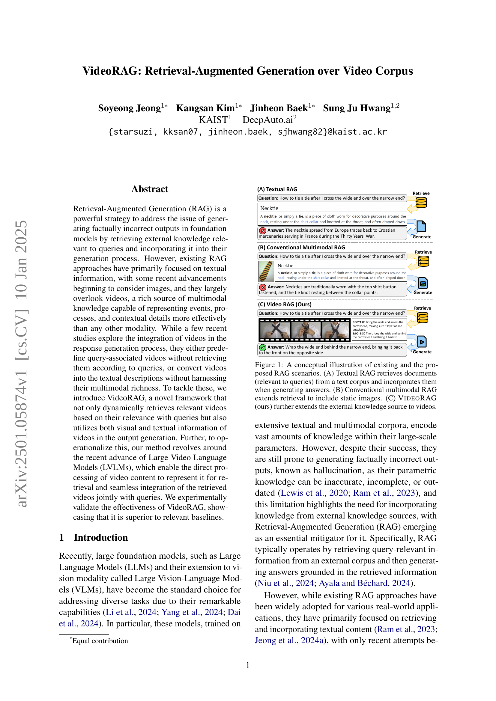
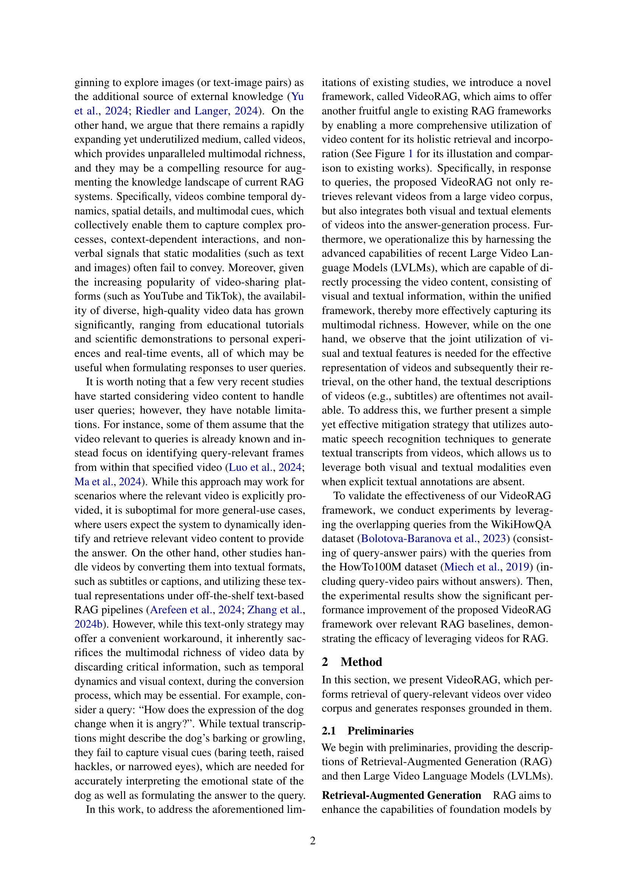
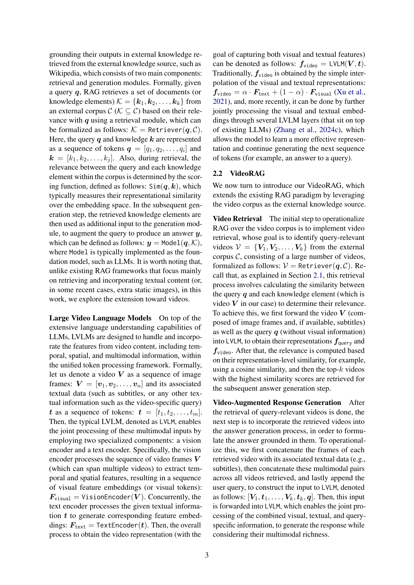
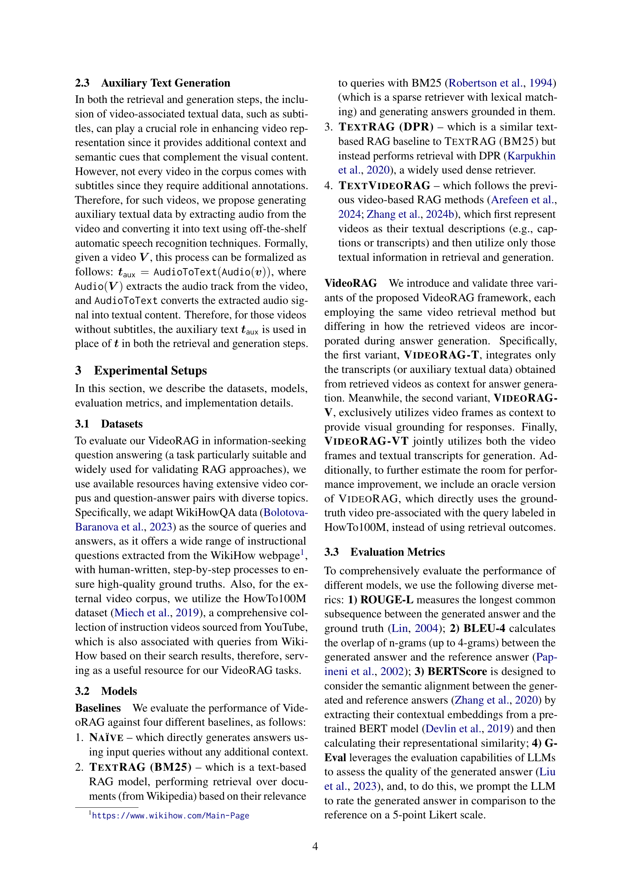
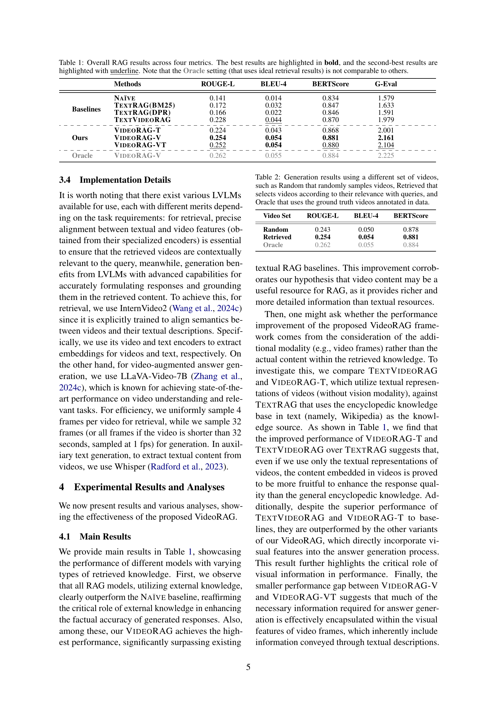
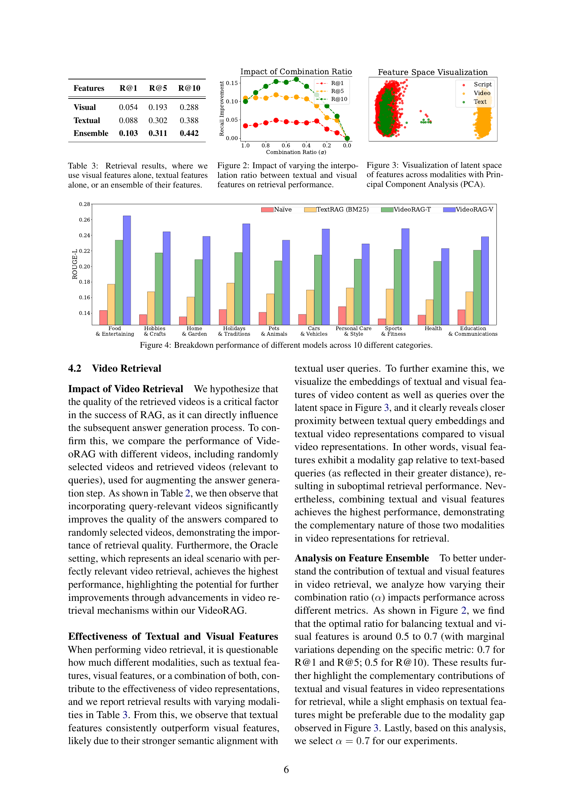
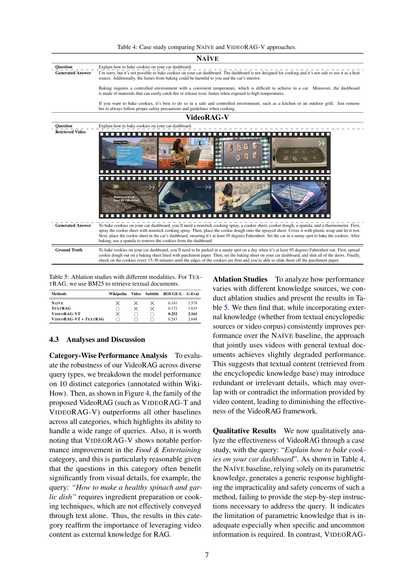
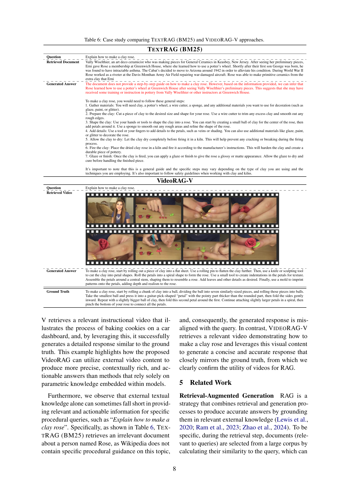
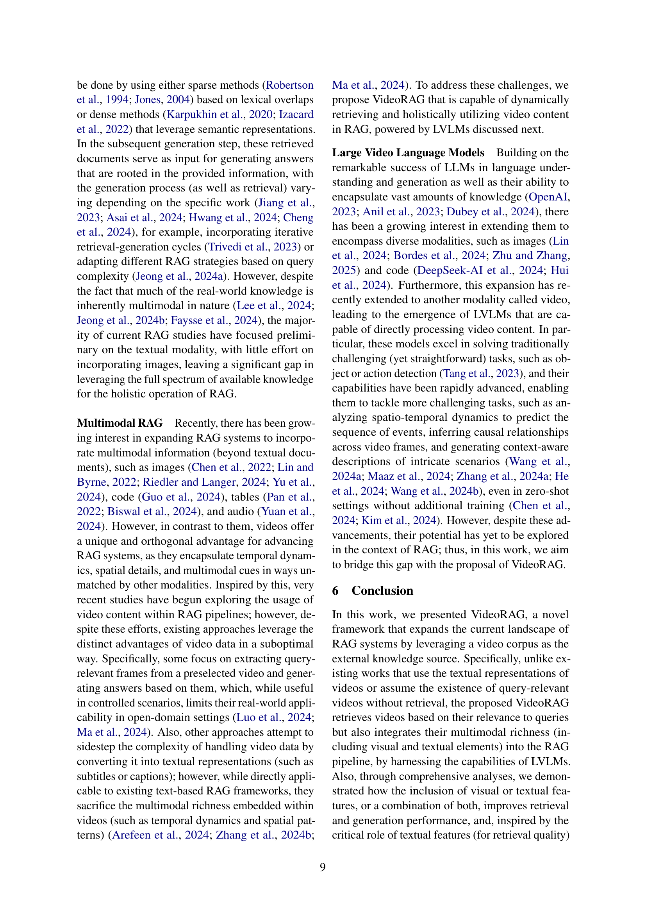
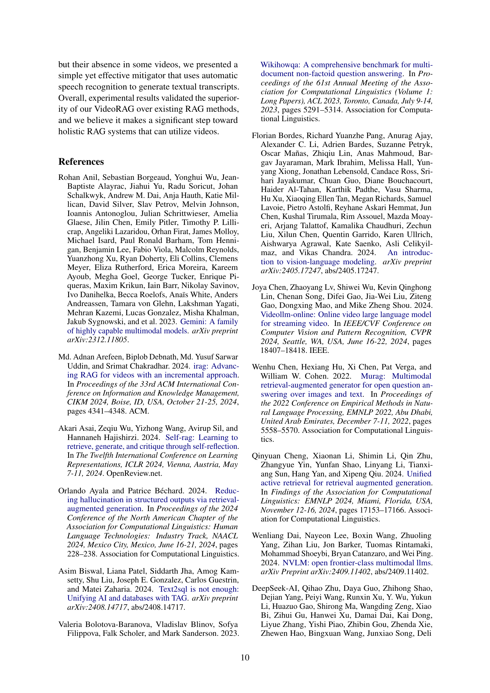
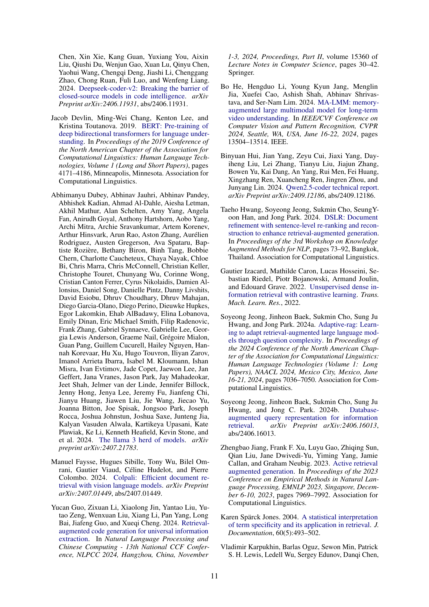
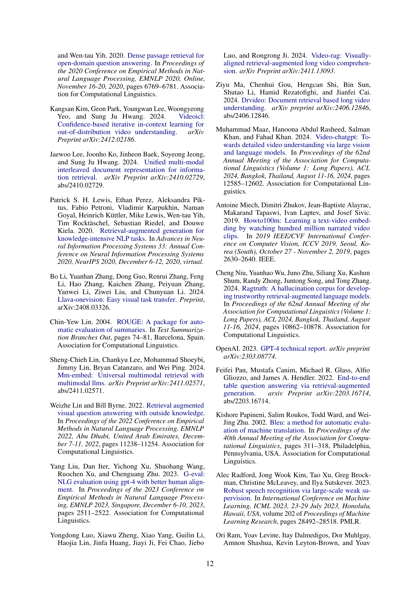
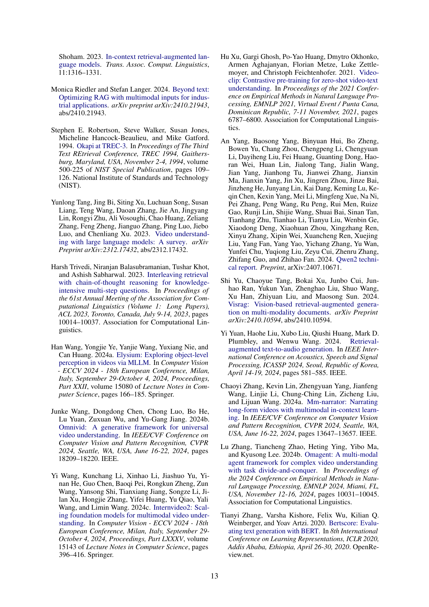
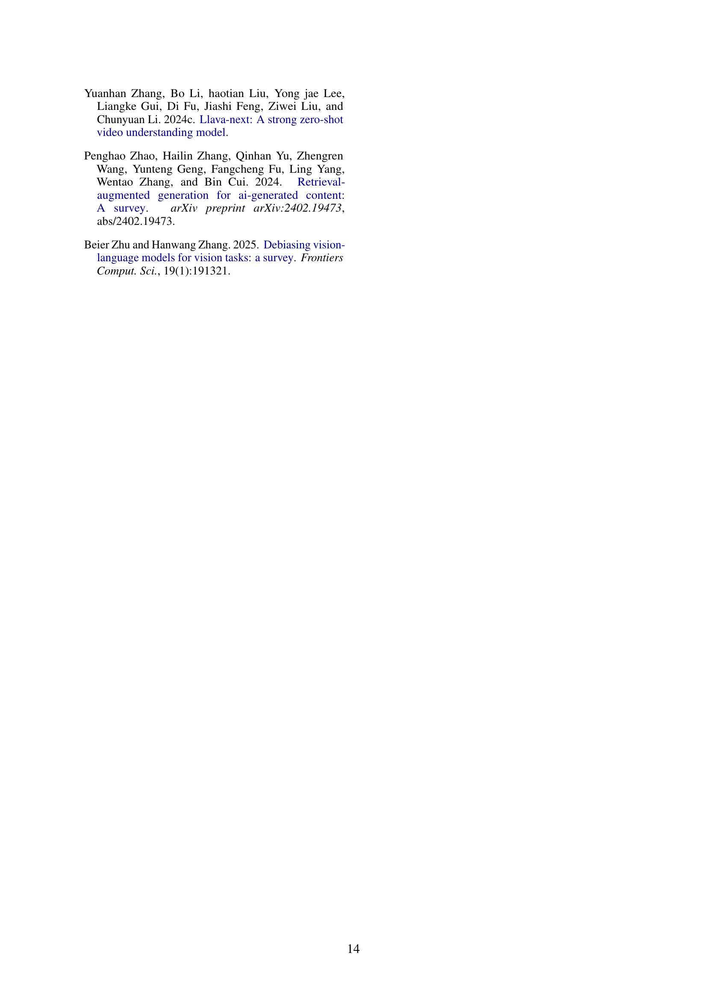
