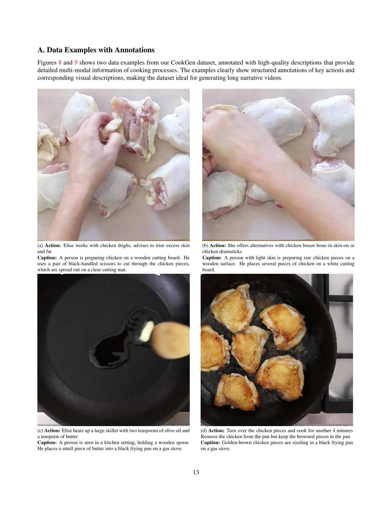

 


 2501.06173 
 Junfei Xiao et el. 
 
 🤗 2025-01-14 
 



↗ arXiv


↗ Hugging Face


↗ Papers with Code


### TL;DR



**장편 서술 영상 생성은 최근 급부상하는 연구 분야이나, 긴 시퀀스 생성 및 정보 전달의 어려움, 일관된 서술 유지의 어려움 등의 문제점**이 존재합니다. 기존 모델들은 짧은 영상 생성에는 성공적이었지만, 장편 서술 영상 생성에는 어려움을 겪었습니다.  특히, **시각적 디테일과 의미적 일관성 유지**에 어려움이 많았습니다.

본 논문에서는 **요리 영상 데이터셋 CookGen**을 구축하고, 이를 기반으로 **장편 서술 영상 생성 모델 VideoAuteur**를 제안합니다. VideoAuteur는 **행위, 자막, 주요 프레임을 순차적으로 생성**하는 자동 회귀 모델로, **시각적 임베딩을 정렬하여 시각적 및 의미적 일관성을 향상**시키는 데 중점을 두었습니다.  실험 결과, VideoAuteur는 기존 모델보다 **시각적 디테일과 의미적 정합성이 훨씬 향상**되었음을 보여주었습니다.  **CookGen 데이터셋과 VideoAuteur 모델은 장편 서술 영상 생성 연구에 중요한 기여**를 할 것으로 기대됩니다.



#### Key Takeaways


 대규모 요리 영상 데이터셋 CookGen을 통해 장편 서술 영상 생성 연구를 위한 기반 마련 



 VideoAuteur 모델을 통해 시각적 및 의미적 일관성을 갖춘 장편 영상 생성 성공 



 제안된 방법론이 기존 모델 대비 향상된 성능을 보임을 실험적으로 입증 


#### Why does it matter?
**본 논문은 장편 서술 영상 생성 분야의 중요한 진전을 이루어냈습니다.**  요리 영상 데이터셋을 활용한 **장편 서술 영상 생성 모델**인 VideoAuteur 제안과, **시각적 일관성 및 의미적 정합성을 개선**하는 방법을 제시하여,  해당 분야 연구에 큰 영향을 미칠 것으로 예상됩니다. **새로운 데이터셋과 방법론은 차세대 서술 영상 생성 모델 개발을 위한 중요한 기반**이 될 것입니다.

------
#### Visual Insights

> 🔼 이 그림은 논문의 주요 아이디어를 보여주는 그림입니다.  요약하자면, 연구팀은 장편 서사 영상 생성을 위한 큰 규모의 요리 영상 데이터 세트를 만들고, 이를 바탕으로 ‘VideoAuteur’라는 새로운 모델을 개발했습니다. VideoAuteur는 서사의 감독 역할을 하며, 순차적으로 동작, 자막, 주요 프레임을 생성합니다. 생성된 요소들은 장편 서사 영상을 만드는 영상 생성 모델에 대한 조건이 됩니다. 그림에는 이 과정의 두 가지 예시가 나와 있습니다.
> 

> 
read the caption

> Figure 1: Long Narrative Video Generation. We curate a large-scale cooking video dataset to develop an interleaved auto-regressive model – VideoAuteur, which acts as a narrative director, sequentially generating actions, captions, and keyframes (two generated examples here). These elements condition a video generation model to create long narrative videos.
> 


| Datasets | Modality | Type | # Images | Text Length |
|---|---|---|---|---|
| Flintstones | Image | Comic | 122k | 86 |
| Pororo | Image | Comic | 74k | 74 |
| StorySalon | Image | Comic | 160k | 106 |
| StoryStream | Image | Comic | 258k | 146 |
| VIST | Image | Real world | 210K | ~70 |
| CookGen | Video | Real world | 39M | 763.8 |

> 🔼 표 1은 기존의 다중 모드 내러티브 데이터셋과 제안된 CookGen 데이터셋을 비교한 표입니다. 기존 데이터셋들은 주로 이미지 기반의 만화 스토리 생성에 초점을 맞춘 반면, CookGen 데이터셋은 긴 서사적 비디오를 포함하며, 이전 최대 데이터셋인 StoryStream에 비해 프레임 수는 150배, 텍스트 주석의 밀도는 5배 더 높습니다.  이는 긴 서사적 비디오 생성을 위한 고품질 데이터의 부족이라는 기존 연구의 어려움을 해결하기 위해 CookGen 데이터셋이 제안되었음을 보여줍니다.
> 

> 
read the caption

> Table 1: Comparison with multi-modal narrative datasets. Most existing datasets focus on image-based comic story generation. In contrast, our dataset consists of long narrative videos, containing 150×\times× the number of frames and 5×\times× the dense text annotations compared to the previous largest dataset, StoryStream.
> 

### In-depth insights

#### Long Video Data
본 논문에서 '장시간 비디오 데이터'는 **장편 서사 비디오 생성을 위한 핵심 요소**로 제시됩니다.  기존의 짧은 영상 데이터셋의 한계를 극복하고, **일관성 있는 장편 스토리텔링**에 필요한 풍부한 정보를 담기 위해, 요리 과정을 담은 대규모 데이터셋을 구축한 것이 핵심입니다.  **요리 과정의 단계적이고 명확한 특징**은 서사적 일관성을 유지하는 데 유리하며, 정확한 캡션 및 액션 레이블링을 통해 모델 학습의 효율성을 높입니다.  데이터셋의 규모(약 20만 개의 비디오 클립)와 밀도 높은 주석(평균 9.5초 분량의 클립당 763.8단어)은 **모델 성능 향상에 크게 기여**할 것으로 예상됩니다.  이러한 고품질 데이터를 통해 장편 서사 비디오 생성 모델의 성능 평가 및 향후 연구 개발에 중요한 기여를 할 것으로 기대됩니다.  **비디오의 시각적 충실도 및 텍스트 캡션 정확도**에 대한 검증 또한, 데이터셋의 질을 평가하는 중요한 지표가 될 것입니다.

#### Narrative Director
논문에서 제시된 "나레이티브 디렉터" 개념은 **장편 서사 영상 생성**이라는 복잡한 과제를 해결하기 위한 핵심 요소로 보입니다. 단순히 이미지나 비디오 프레임을 생성하는 것을 넘어, 일관된 스토리텔링을 위해 **시각적 요소(키프레임, 비디오 임베딩)와 언어적 요소(캡션, 액션)**를 순차적으로 생성하고 통합하는 역할을 수행합니다.  **자동 회귀 모델**을 기반으로 하여 이전 단계의 정보를 바탕으로 다음 단계의 요소를 예측하는 방식으로,  **일관성 있고 의미있는 서사 구조**를 만들어냅니다.  나레이티브 디렉터는 단순한 프레임 생성기가 아닌, 전체 영상의 **내러티브 흐름을 지휘하는 역할**을 함으로써 고품질 장편 영상 생성에 크게 기여할 것으로 예상됩니다.  **요약하자면, 나레이티브 디렉터는 시각-언어적 요소의 통합 및 순차적 생성을 통해 장편 서사 영상의 일관성과 의미를 확보하는 핵심 기술**입니다.

#### Visual Condition
본 논문에서 'Visual Condition'은 비디오 생성 모델에 시각적 정보를 제공하는 방식을 의미합니다.  **핵심은 텍스트 기반의 어떤 설명(caption)만으로는 고품질의 장편 비디오 생성이 어렵다는 점을 인지하고, 시각 정보를 추가적으로 활용하여 생성 과정의 정확성과 일관성을 높이는 데 있습니다.** 이를 위해, **본 논문에서는 단순한 키프레임(Keyframe)을 넘어, 텍스트와 의미적으로 정렬된 시각적 임베딩(Visual Embedding)**을 사용합니다. 이러한 임베딩은 단순한 이미지 정보가 아니라, 비디오의 서사적 흐름을 반영하는 시각적 상태(Visual State)를 나타내는 고차원 정보입니다.  **이 방법을 통해, 모델은 시각적 맥락을 보다 잘 이해하고, 시간에 따른 시각적 변화를 일관되게 생성할 수 있습니다.**  결과적으로, **더욱 세밀하고, 의미적으로 풍부하며, 시각적으로 자연스러운 장편 비디오 생성이 가능해집니다.**  하지만, **이 방식은 생성된 시각적 임베딩이 불완전할 수 있다는 한계점**을 가지고 있으며, 이에 대한 보완책 또한 논문에서 제시됩니다.

#### Noisy Action Data
본 논문에서 다루는 ‘잡음이 많은 액션 데이터’는 음성 인식(ASR) 기술에 기반한 자동 생성 액션 데이터의 한계를 보여줍니다. **ASR 기술의 부정확성으로 인해 액션 설명이 불완전하거나 모호하며, 요리 과정의 핵심 단계를 제대로 포착하지 못하는 경우가 많습니다.**  이는 장편 서사 영상 생성 모델의 정확성과 효율성에 직접적인 영향을 미칩니다. **특히 요리 과정의 단계별 설명이 정확해야 하는 요리 영상 분야에서는 ASR의 잡음이 더욱 심각한 문제**가 될 수 있습니다. 따라서 **정확한 액션 데이터 확보를 위한 추가적인 데이터 정제 및 보정 작업이 필수적이며**, 향후 연구에서는 **더욱 신뢰도 높은 액션 데이터 생성 및 활용 방안을 모색**해야 할 것입니다.  이는 고품질의 장편 요리 영상 생성에 직결되는 문제이므로, **데이터 전처리 및 품질 관리에 대한 심도 있는 고찰**이 필요합니다.  나아가, 본 연구에서 제시된 문제는 단순히 요리 영상 분야에 국한되지 않고, **ASR 기술을 활용한 다양한 영상 데이터 생성 분야의 공통적인 과제**임을 시사합니다. 

#### Future of NVG
NVG(장편 서사 영상 생성)의 미래는 **데이터, 모델, 그리고 응용 분야** 세 가지 측면에서 고려될 수 있습니다.  먼저, **대규모 고품질 데이터셋** 구축이 필수적입니다. 다양한 장르와 스타일의 영상 데이터 확보와 정교한 주석 작업을 통해 모델 학습의 정확도와 효율성을 높여야 합니다.  다음으로, **모델의 발전**이 중요합니다.  현재의 제한된 길이와 일관성 문제를 해결하기 위해, 더욱 정교한 순차적 생성 모델, 혹은 이미지와 텍스트를 통합적으로 처리하는 다중 모달 모델의 개발이 필요합니다.  마지막으로, **실제 응용 분야** 확장이 중요합니다.  단순한 텍스트-영상 변환을 넘어, 사용자의 의도를 더욱 정확하게 반영하는 인터랙티브한 생성 시스템, 그리고 교육, 엔터테인먼트, 광고 등 다양한 분야에 적용 가능한 실용적인 NVG 기술 개발이 중요합니다.  **윤리적 문제** 또한 중요하게 고려되어야 합니다.  저작권, 프라이버시, 그리고 편향된 콘텐츠 생성 방지 등의 문제를 해결하기 위한 노력이 필요합니다.

### More visual insights

More on figures

> 🔼 그림 2는 요리 과정을 보여주는 장편 비디오 데이터셋인 CookGen을 보여줍니다. 각 소스 비디오는 여러 클립으로 분할되고, 각 클립에는 'action' 레이블이 부여됩니다. HowTo100M 비디오의 경우 ASR(Automatic Speech Recognition)을 이용하여 얻은 가공된 의사 레이블을 사용하고, YouCook2 비디오는 수동으로 주석을 달았습니다. 최첨단 VLMs(Vision-Language Models), 즉 GPT-4와 미세 조정된 비디오 캡셔닝 모델을 사용하여 모든 비디오 클립에 대한 고품질 캡션을 제공합니다.
> 

> 
read the caption

> Figure 2: CookGen contains long narrative videos annotated with actions and captions. Each source video is cut into clips and matched with the labeled “actions”. We use refined pseudo labels from ASR for Howto100M videos and use manual annotations for Youcook2 videos. We use state-of-the-art VLMs (i.e. GPT-4o and a finetuned video captioner) to provide high-quality captions for all video clips.
> 

> 🔼 본 그림은 논문의 4.1절 'Long Narrative Video Director'에서 제시된 장면으로, 비디오 감독 역할을 하는 시각 언어 모델(VLM)의 동작 과정을 보여줍니다. 사용자의 질의(예: 참치 샌드위치 요리 방법)와 초기 이미지-텍스트 쌍을 입력받아 VLM은 캡션, 행동, 시각적 상태를 단계별로 생성합니다. 각 비디오 클립은 시각적 임베딩 또는 이러한 임베딩에서 파생된 키프레임을 사용하여 생성됩니다. 이 연구에서는 시각적 잠재 공간, 시각적 임베딩에 대한 회귀 손실, 회귀 작업과 같은 주요 설계 선택에 중점을 둡니다.
> 

> 
read the caption

> Figure 3: Long Narrative Video Director. The video director, a Visual Language Model (VLM), takes a user query (e.g., “How to cook a tuna sandwich?”) and an initial image-text pair as input. It then generates captions, actions, and visual states step-by-step. Each video clip is created using either visual embeddings or a keyframe derived from these embeddings. This study focuses on key design choices, such as the visual latent space, regression loss for visual embeddings, and the regression task.
> 

> 🔼 이 그림은 본 논문의 4.2절 'Visual-Conditioned Video Generation'에서 제시된 비디오 생성 모델의 구조를 보여줍니다.  본 논문에서 제안하는 방법은, 텍스트와 시각적 정보를 모두 생성하는 interleaved auto-regressive director를 사용하여 비디오 생성 과정을 제어합니다.  이 디렉터는 keyframes (VAE embeddings) 또는 interleaved director가 회귀한 CLIP latents를 조건으로 사용하여 비디오 생성을 가능하게 합니다.  또한, 비디오 생성 과정의 견고성을 높이기 위해 Gaussian noise, random masking, random shuffling과 같은 regularization 기법을 적용합니다. 이는 불완전한 시각적 임베딩으로 인한 문제를 완화하는 데 도움을 줍니다.  결론적으로, 본 그림은 텍스트와 시각적 정보의 결합을 통한 비디오 생성의 핵심 아이디어를 보여줍니다.
> 

> 
read the caption

> Figure 4: Visual-Conditioned video generation. Our interleaved auto-regressive director generates both text and visual conditions, enabling the video generation process to be conditioned either on keyframes (VAE embeddings) or on CLIP latents regressed by the interleaved director. We apply Gaussain noise, random masking and random shuffling as regularization during the training process to improve robustness with the imperfect visual embeddings.
> 

> 🔼 그림 5는 서로 다른 잠재 공간을 사용하여 자동 인코딩된 결과를 보여줍니다. SEED-X와 EMU-2는 모두 CLIP 비전 인코더와 확산 모델(미세 조정된 SDXL)을 자동 인코딩된 시각적 잠재 변수를 위한 디코더로 사용하지만, SEED-X는 의미론적으로 치우쳐져 있고 EMU-2는 시각적 세부 정보를 훨씬 더 많이 유지합니다. SDXL-VAE는 최상의 이미지 재구성 성능을 보여주지만, CLIP과 같은 이미지-텍스트 쌍에 대한 사전 훈련 없이는 잠재 공간이 언어와 정렬되지 않습니다.
> 

> 
read the caption

> Figure 5: Auto-encoded results with different latent spaces. While SEED-X and EMU-2 both use a CLIP vision encoder and a diffusion model (i.e. finetuned SDXL) as decoder for autoencoding visual latents, SEED-X is semantic-biased and EMU-2 keeps much more visual details. SDXL-VAE shows the best image reconstruction ability, however, the latent space is not aligned with language (i.e. without pretraining on image-text pairs like CLIP).
> 

> 🔼 이 그림은 잠재적 회귀 오류를 시뮬레이션하여 생성된 시각적 잠재 공간의 크기와 방향이 정확한 잠재적 회귀에 얼마나 중요한지 보여줍니다. 가우시안 노이즈와 크기 조정 인자를 사용하여 잠재 벡터의 크기와 방향을 변경하는 실험을 수행했습니다. 재구성 결과를 통해 크기와 방향을 모두 유지하는 것이 정확한 잠재적 회귀에 필수적임을 확인했습니다. 크기만 조정하면 객체의 모양에 영향을 주지만 주요 의미 정보는 유지하는 반면, 노이즈를 추가하면 재구성 품질에 심각한 영향을 미치는 것을 알 수 있습니다.
> 

> 
read the caption

> Figure 6: Both Scale and Direction Matters. We experiment with pseudo regression errors by altering latent direction and scale using Gaussian noise and scaling factors. The reconstruction results confirm that preserving both scale and direction is essential for accurate latent regression.
> 

> 🔼 그림 7은 요리 과정을 설명하는 긴 설명을 생성하는 모델의 성능을 비교한 예시입니다.  '마파 두부 요리 단계별 가이드'라는 전체적인 지시와 첫 번째 단계의 액션, 캡션, 이미지 임베딩을 바탕으로, 제안된 모델이 액션, 캡션, 이미지 임베딩을 순차적으로 생성하여 요리 과정을 단계별로 구성하는 과정을 보여줍니다.  EMU-2와 SEED-X라는 두 가지 다른 방법으로 생성된 키프레임(이미지 잠재 공간에서 디코딩된)을 상단 두 줄에 보여주는데, 생성된 이미지들은 현실적이고 시각적 일관성이 높지만 최첨단 텍스트-이미지 모델인 SDXL과 FLUX.1-s에 비해 미적으로는 다소 부족합니다.
> 

> 
read the caption

> Figure 7: Quality Comparison Example. Given a global system prompt—“Step-by-step guide to cooking mapo tofu:”—along with the action, caption, and image embeddings of the first step keyframe, our interleaved director sequentially generates ”actions,” ”captions,” and image embeddings to construct a narrative on how to cook the dish step by step. The first two rows display the directly generated keyframes (decoded from the image latents) using the EMU-2 and SEED-X latent spaces. The generated images are realistic with strong visual consistency but are less aesthetically refined than those produced by state-of-the-art text-to-image models, i.e. SDXL and FLUX.1-s.
> 

> 🔼 이 그림은 논문의 CookGen 데이터셋에서 발췌한 예시로, 고품질 설명과 함께 요리 과정의 세부적인 다중 모드 정보를 제공합니다. 그림에는 닭고기 허벅지에서 과도한 지방과 껍질을 제거하는 행위와 함께, 나무 도마 위에서 닭고기를 손질하는 사람의 모습이 자세히 묘사되어 있습니다. 검은색 손잡이가 달린 가위를 사용하여 닭고기 조각을 자르고, 투명한 매트 위에 닭고기 조각을 펼쳐놓은 모습이 보입니다. 이러한 상세한 묘사는 장편 서술 영상 생성에 이상적인 데이터셋임을 보여줍니다.
> 

> 
read the caption

> a Action: Elise works with chicken thighs, advises to trim excess skin and fat  Caption: A person is preparing chicken on a wooden cutting board. He uses a pair of black-handled scissors to cut through the chicken pieces, which are spread out on a clear cutting mat.
> 

> 🔼 이 그림은 닭고기 요리법을 보여주는 요리 비디오의 한 장면입니다. 밝은 피부색의 사람이 나무 도마 위에 닭고기 조각을 준비하는 모습을 보여줍니다. 그는 닭고기 여러 조각을 흰 도마 위에 놓습니다. 이 장면은 뼈가 있는 닭가슴살이나 닭다리 등의 다른 닭고기 부위를 사용할 수 있는 옵션을 제시합니다.
> 

> 
read the caption

> b Action: She offers alternatives with chicken breast bone-in skin-on or chicken drumsticks  Caption: A person with light skin is preparing raw chicken pieces on a wooden surface. He places several pieces of chicken on a white cutting board.
> 

> 🔼 이 그림은 논문의 3장 '장편 서술 영상 데이터' 섹션에 속하며, 요리 과정을 보여주는 비디오 클립의 한 장면을 캡처한 것입니다. 짧은 캡션 'Elise는 올리브 오일 두 스푼과 버터 한 스푼을 넣어 큰 프라이팬을 데웁니다.' 외에 추가 설명을 제공합니다. 그림에는 나무 주걱을 들고 주방에 서 있는 사람이 검은색 프라이팬에 작은 버터 조각을 넣는 장면이 자세히 묘사되어 있습니다. 이 그림은 장편 서술 비디오 생성을 위한 데이터셋의 질을 보여주는 예시로 사용됩니다.
> 

> 
read the caption

> c Action: Elise heats up a large skillet with two teaspoons of olive oil and a teaspoon of butter  Caption: A person is seen in a kitchen setting, holding a wooden spoon. He places a small piece of butter into a black frying pan on a gas stove.
> 

> 🔼 이 그림은 닭고기 조리 과정을 보여줍니다. 먼저 닭고기 조각을 뒤집어 4분 더 요리한 후, 팬에서 닭고기를 꺼내지만 갈색으로 된 조각들은 팬에 남겨둡니다.  이미지는 검은색 프라이팬에서 노릇노릇하게 익은 닭고기 조각들이 가스레인지 위에서 지글지글 끓고 있는 장면을 보여줍니다. 즉, 닭고기의 양면을 바삭하게 굽는 과정을 상세하게 보여주는 그림입니다.
> 

> 
read the caption

> d Action: Turn over the chicken pieces and cook for another 4 minutes Remove the chicken from the pan but keep the browned pieces in the pan  Caption: Golden-brown chicken pieces are sizzling in a black frying pan on a gas stove.
> 

> 🔼 이 그림은 요리 과정을 보여주는 비디오의 한 장면을 캡처한 것입니다. 짧은 설명은 '남은 기름에 오르조를 볶고, 전통적인 쌀 필라프처럼 같은 방법으로 요리합니다.' 입니다. 더 자세한 설명을 추가하면 다음과 같습니다. 검은색 프라이팬에서 쌀을 요리하는 사람의 모습을 보여줍니다. 사람은 유리 그릇에서 프라이팬에 쌀을 붓고, 나무 주걱을 사용하여 쌀을 펴고 저어줍니다. 이 그림은 요리 과정을 단계적으로 보여주는 비디오 데이터셋의 일부이며, 각 단계는 행동(Action)과 캡션(Caption)으로 자세히 설명되어 있습니다. 
> 

> 
read the caption

> a Action: Use the remaining oil in the pan to brown the orzo Cook the orzo like a traditional rice pilaf, using the same method as before  Caption: A person is cooking rice in a black frying pan on a gas stove. He pours the rice from a glass bowl into the pan, then uses a wooden spatula to spread and stir the rice.
> 

> 🔼 이 그림은 논문의 데이터셋 부분에서 요리 과정을 보여주는 장면의 한 예시입니다. 파란색 셔츠를 입은 사람이 검은색 프라이팬에서 밥을 볶고 있는데, 나무 주걱을 사용하여 밥이 골고루 익도록 저어주고 있습니다.  실제 자막은 간단하지만, 더 자세한 설명을 덧붙여 이해도를 높였습니다.
> 

> 
read the caption

> b Action: Add 2 cups of gordo’s to a hot pan  Caption: A person wearing a blue shirt is cooking rice in a black frying pan on a stovetop. Using a wooden spatula, he stirs the rice, ensuring it is evenly cooked.
> 

> 🔼 이 그림은 여성이 냄비에 다진 양파와 밥을 넣고 빵가루를 입힌 닭고기를 추가하여 요리하는 모습을 보여줍니다. 소스가 걸쭉해질 때까지 몇 분간 익힙니다. 사진은 요리 과정의 한 단계를 자세히 보여주는 여러 장면을 담고 있습니다.
> 

> 
read the caption

> c Action: Combine the mixture with the orzo and cook for a few minutes until the sauce thickens  Caption: A woman is cooking on a stovetop, adding pieces of breaded chicken to a pan filled with chopped onions and rice.
> 

> 🔼 이 그림은 완성된 요리의 모습을 보여줍니다. 검은색 프라이팬에 구운 치킨 조각이 여러 가지 채소와 곡물과 함께 담겨져 있습니다. 오르조가 국물을 완전히 흡수하고 치킨이 완전히 익을 때까지 10-12분간 조리한 후 불에서 내려 5분간 그대로 두었다가 알 수 없는 양념을 뿌린 상태입니다.
> 

> 
read the caption

> d Action: Stock is cooked until orzo has fully absorbed liquid and chicken is cooked through, about 10-12 minutes Dish is removed from heat and left to sit for five minutes Dish is sprinkled with unspecified seasoning  Caption: A delicious dish of roasted chicken pieces is presented in a black skillet, surrounded by a colorful mix of diced vegetables and grains.
> 

> 🔼 그림 9는 논문의 CookGen 데이터셋에서 가져온 두 가지 데이터 예시를 보여줍니다. 각 예시는 요리 과정에 대한 자세한 다중 모드 정보를 제공하는 고품질 설명으로 주석이 달려 있습니다. 이러한 설명에는 주요 동작과 해당 시각적 설명이 구조적으로 주석이 달려 있어 장편 내러티브 비디오 생성에 이상적인 데이터셋임을 보여줍니다. 그림은 '원 팟 치킨 앤 오르조' 레시피의 요리 과정을 보여줍니다.
> 

> 
read the caption

> Figure 9: Data examples with annotated “actions” and “captions”. A video of cooking recipe of “One Pot Chicken and Orzo”.
> 

> 🔼 이 그림은 레인보우 브로큰 글래스 젤리를 만드는 과정을 보여줍니다. 다양한 색깔의 젤리 조각들이 기하학적 패턴으로 배열되어 검은색 배경 위에 놓여 있습니다. 젤리는 빨간색, 녹색, 파란색, 보라색 등 여러 가지 색상으로 구성되어 있으며, 마치 깨진 유리처럼 보이는 독특한 시각적 효과를 만들어냅니다.
> 

> 
read the caption

> a Action: Hi everyone, this one’s called rainbow broken glass jello  Caption: A colorful, multi-layered dessert is displayed on a black surface. The dessert features vibrant red, green, blue, and purple segments, arranged in a geometric pattern.
> 

> 🔼 이 그림은 냉장고 문쪽 선반의 내부를 보여줍니다. 용기에는 진한 파란색, 주황색, 빨간색 액체가 채워져 있습니다.  짧은 설명은 젤리를 만들 때 일반적으로 두 컵의 끓는 물을 사용하지만, 이 경우에는 젤리를 더 단단하게 만들기 위해 한 컵만 사용한다는 내용입니다.
> 

> 
read the caption

> b Action: Now normally when you make jello you use two cups of boiling water, but in this case we’re only using one cup because we want the jello to be extra firm  Caption: The video shows the interior of a refrigerator, focusing on the door shelf. The containers are filled with dark, blue, orange, and red liquids.
> 

> 🔼 사진은 밝은 피부색을 가진 사람이 투명한 플라스틱 용기에 담긴 노란색 액체를 들고 내용물을 검사하는 모습을 보여줍니다. 이 이미지는 요리 과정 중 작은 용기를 더 큰 뜨거운 물이 담긴 용기에 넣는 것이 가장 쉬운 방법임을 설명하는 캡션과 함께 제공됩니다.
> 

> 
read the caption

> c Action: I find the easiest way to do this is to put the small container into a larger container of hot water  Caption: A person with light skin is holding a clear plastic container filled with a yellow liquid, inspecting its contents.
> 

> 🔼 이 그림은 젤리 조각을 자르는 사람의 모습을 보여줍니다.  더 자세히 설명하자면, 사람이 나무 도마 위에 놓인 노란색 젤리 블록의 가장자리를 푸는 모습부터 시작합니다.  젤리 블록을 꺼낸 후, 똑같은 크기의 정사각형 조각으로 자릅니다.  마지막으로, 각 조각을 반으로 잘라 균일한 크기의 조각들을 만듭니다. 이러한 단계들은 젤리를 다듬고 준비하는 과정을 보여줍니다.
> 

> 
read the caption

> d Action: Loosen the edges of the Jello piece Slide the Jello piece out and cut it into cubes Cut the Jello cubes into half-inch pieces  Caption: A person is slicing a block of yellow gelatin on a wooden cutting board, cutting it into uniform strips.
> 

> 🔼 이 그림은 다양한 색깔의 젤리 조각들을 9x13인치 유리 구이용기에 배열하는 과정을 보여줍니다. 녹색, 주황색, 보라색, 검은색 젤리 조각들의 위치를 조정하며 정돈하는 사람의 모습을 자세하게 보여줍니다.  이는 장황한 서술 방식의 비디오 생성에 적합한 데이터셋의 예시입니다.
> 

> 
read the caption

> a Action: Spread out the different colored Jello pieces in a 9 by 13 inch baking dish  Caption: A person is arranging colorful gelatin cubes in a glass baking dish, adjusting the placement of green, orange, purple, and black cubes.
> 

> 🔼 이 그림은 요리 과정을 보여주는 캡션과 이미지로 구성된 데이터셋의 예시입니다. 캡션 '두 컵의 물을 끓이고 젤라틴 두 봉지를 넣어 별도의 젤라틴 혼합물을 만드세요.'는 물이 담긴 투명한 유리 컵을 조리대에 올려놓고 사람이 흰 가루를 붓는 장면을 보여주는 이미지를 설명합니다. 더 자세한 설명은 물을 끓이고, 젤라틴 가루를 넣고, 잘 저어 섞는 과정까지 포함하여 요리 과정을 더욱 자세히 보여줍니다.
> 

> 
read the caption

> b Action: Make a separate gelatin mixture by boiling two cups of water and adding two envelopes of gelatin  Caption: A clear glass measuring cup is placed on a countertop, containing water. A person pours a white powder into it.
> 

> 🔼 사진은 투명한 유리컵에 담긴 크리미한 혼합물을 사람이 열심히 휘젓는 모습을 보여줍니다. 이는 달콤한 연유를 젤라틴과 물 혼합물에 저어 넣는 과정을 보여주는 장면의 캡션입니다. 캡션은 이미지에 대한 자세한 설명을 제공하여, 행동, 도구, 그리고 재료에 대한 명확하고 간결한 묘사를 보여줍니다.
> 

> 
read the caption

> c Action: Stir the sweetened condensed milk into the gelatin and water mixture  Caption: A person is vigorously whisking a creamy mixture in a clear glass measuring cup.
> 

> 🔼 사진은 크림색 액체로 채워진 유리 베이킹 접시를 보여줍니다. 여러 가지 색깔의 삼각형 유리 조각들이 위에 얹혀져 있습니다. 이 이미지는 젤리를 만들고 자르고 제공하는 과정의 한 단계를 보여주는 캡션과 함께 제공됩니다.
> 

> 
read the caption

> d Action: Let it set for several hours, then cut it into squares and serve  Caption: A glass baking dish is filled with a creamy white liquid, topped with colorful, triangular-shaped glass pieces.
> 

> 🔼 이 그림은 논문의 CookGen 데이터셋에서 가져온 예시로, 무지개 깨진 유리 젤리를 만드는 과정을 보여줍니다. 그림에는 젤리 만들기의 주요 단계들을 보여주는 여러 개의 이미지 프레임이 나와 있으며, 각 프레임마다 해당 동작(Action)과 캡션(Caption)이 자세하게 주석으로 달려 있습니다.  이는 장문의 내러티브 비디오 생성을 위한 데이터셋의 다양한 모드(시각적, 언어적) 정보가 풍부하게 담겨 있음을 보여주는 예시입니다. 각 이미지는 젤리 재료 준비, 젤리 섞기, 젤리 틀에 붓기, 냉장 보관 등 젤리를 만드는 과정의 단계들을 시각적으로 보여주고, 해당 동작에 대한 설명과 캡션을 함께 제공합니다. 이를 통해 요리 과정을 자세하고 일관되게 묘사하는 데 데이터셋이 얼마나 효과적인지를 시각적으로 보여줍니다.
> 

> 
read the caption

> Figure 11: Data examples with annotated “actions” and “captions”. A video of preparing “Rainbow Broken Glass Jello”.
> 

> 🔼 이 그림은 논문의 비디오 데이터 통계를 보여줍니다. 전체 비디오 길이, 장면 분할된 비디오 클립의 길이, 그리고 각 비디오에서 선택된 클립 수에 대한 통계를 나타냅니다.  히스토그램은 각 범주에 해당하는 비디오 또는 클립의 개수를 보여줍니다. 이를 통해 연구에 사용된 비디오 데이터의 길이와 구성에 대한 전반적인 이해를 제공합니다.
> 

> 
read the caption

> Figure 12: Statistics on the video data. We do statistics on the video lengths of the collected whole videos, the clip lengths of the scene-cut video clips, and the number of clips selected for each video.
> 

> 🔼 이 그림은 논문의 3장, 'Long Narrative Video Data' 섹션에 포함되어 있으며, 비디오 데이터에 대한 텍스트 주석(annotation)의 통계를 보여줍니다. 구체적으로, 주석으로 달린 'actions'와 'captions'의 단어 수와 토큰 수(Llama [46] 토크나이저 사용)에 대한 분포를 보여주는 히스토그램을 제시합니다. 이를 통해 연구에서 사용된 데이터셋의 텍스트 정보의 질과 양에 대한 이해를 돕고,  narrative video generation 모델 학습에 적합한지 평가하는 데 도움이 되는 정보를 제공합니다.
> 

> 
read the caption

> Figure 13: Statistics on the text annotations. We do statistics on the number of words and tokens (Llama [46] tokenized) of annotated “actions” and “captions,” respectively.
> 

> 🔼 그림 14는 지상 진실 영상과 GT 키프레임을 사용한 역방향 생성 영상을 보여줍니다. 어두운 색의 느린 밥솥에서 고기 조각들이 끓고 있습니다. 한 손이 걸쭉한 액체를 냄비에 붓고, 액체가 고기와 국물과 섞이게 합니다. 액체가 추가되면서 혼합물이 거품이 일고 걸쭉해집니다. 그 사람은 검은 숟가락으로 내용물을 저어 재료가 잘 섞이도록 합니다. 느린 밥솥은 고기를 계속 익히고, 고기는 부드럽고 잘 익은 것처럼 보입니다.
> 

> 
read the caption

> Figure 14: Left: Ground truth, Right: Inverse generation with GT keyframe. Caption: Chunks of meat are simmering in a dark-colored slow cooker. A hand pours a creamy liquid into the pot, causing the liquid to mix with the meat and broth. The mixture bubbles and thickens as the liquid is added. The person stirs the contents with a black spoon, ensuring the ingredients are well combined. The slow cooker continues to cook the meat, which appears tender and well-cooked.
> 

> 🔼 그림은 원본 영상과, 기준 키프레임과 자막을 사용한 역추적 생성 영상을 보여줍니다. 검은색 소매를 입은 사람이 투명한 유리 그릇에 크림 같은 혼합물을 거품기로 저어 섞는 모습을 보여줍니다. 혼합물은 반죽이나 도우처럼 보이며 점차 부드럽고 고르게 변합니다. 사람의 왼손이 밝은색 조리대 위에 그릇을 고정시키고 있으며, 저는 동작이 일관되고 철저하여 혼합물이 잘 섞이도록 합니다. 배경은 단순하며 혼합 과정에 집중할 수 있도록 합니다. 즉,  왼쪽은 원본 영상, 오른쪽은 생성 영상입니다. 생성 영상은 원본 영상의 주요 특징을 잘 반영하고 있지만, 미묘한 차이가 있습니다.
> 

> 
read the caption

> Figure 15: Left: Ground truth, Right: Inverse generation with GT keyframe. Caption: A person wearing a black sleeve is whisking a creamy mixture in a clear glass bowl. The mixture appears to be a batter or dough, gradually becoming smoother and more uniform. The person’s left hand holds the bowl steady on a light-colored countertop. The whisking motion is consistent and thorough, ensuring the mixture is well-blended. The background is plain, focusing attention on the mixing process.
> 

> 🔼 이 그림은 요리 과정의 역방향 생성 결과를 보여줍니다.  왼쪽은 실제 영상의 장면이고, 오른쪽은 기준 키프레임과 자막을 사용하여 역으로 생성한 장면입니다.  붉은색 그릇에 걸쭉한 주황색 액체가 담겨 있고, 여성의 손이 흰 숟가락을 들고 액체 표면에 그림을 그리는 모습입니다.  흰 크림으로 얼굴을 만들고 눈과 입을 자세히 묘사합니다.  배경에는 붉은 토마토와 흰 냄비가 놓인 화강암 조리대가 있습니다. 여성은 계속해서 얼굴에 마무리 작업을 합니다.  역으로 생성한 장면은 실제 장면과 비슷하지만 세부적인 부분에서 약간의 차이가 있습니다.
> 

> 
read the caption

> Figure 16: Left: Ground truth, Right: Inverse generation with GT keyframe. Caption: A red bowl filled with a thick, orange liquid is placed on a stovetop. A woman’s hand, holding a white spoon, appears and begins to draw on the surface of the liquid. She creates a face with white cream, adding details to the eyes and mouth. The background shows a granite countertop with a bunch of red tomatoes and a white pot. The woman continues to add finishing touches to the face.
> 

> 🔼 이 그림은 닭고기를 튀기는 과정을 보여주는 그림의 일부분입니다.  그림에서는 밀가루가 담긴 그릇에 날것의 닭고기 조각과 양념을 넣는 장면이 묘사되어 있습니다.  닭고기 튀김 요리의 첫 단계를 보여주는 시각적 설명으로,  요리 과정의 단계별 설명에 도움을 줍니다.
> 

> 
read the caption

> a Action: Add raw chicken pieces and seasoning to a bowl of flour.
> 

> 🔼 이 그림은 요구르트 또는 버터밀크에 양념을 넣고 그릇에 버무리는 모습을 보여줍니다.  요리 과정의 한 단계로, 재료들을 섞어서 풍미를 더하고 맛을 균일하게 하기 위한 준비 과정입니다.  그릇 안에는 요구르트 또는 버터밀크와 다양한 양념들이 보이며, 누군가가 이 재료들을 숟가락이나 다른 도구를 사용하여 섞고 있는 모습을 볼 수 있습니다.
> 

> 
read the caption

> b Action: Mix yogurt or buttermilk with seasoning in a bowl.
> 

> 🔼 이 그림은 튀김옷을 입힌 닭고기 조각을 고르게 튀김 반죽에 담그는 과정을 보여줍니다. 닭고기가 완전히 튀김옷으로 코팅되도록 하는 방법을 보여주는 단계별 설명입니다. 튀김옷을 입히는 동안 닭고기의 모양과 위치가 어떻게 변하는지 자세히 보여줍니다.
> 

> 
read the caption

> c Action: Dip chicken pieces into the batter to coat evenly.
> 

> 🔼 이 그림은 튀김옷을 입힌 닭고기를 밀가루 반죽에 다시 한번 코팅하는 과정을 보여줍니다. 닭고기가 튀김옷을 골고루 묻도록 조심스럽게 밀가루 반죽에 담그는 모습을 자세히 보여줍니다. 닭고기 표면에 밀가루가 고르게 묻어 바삭한 식감을 더해줄 것으로 예상됩니다. 이는 닭고기 요리 과정의 중요한 단계이며, 최종 결과물의 맛과 질감에 영향을 미치는 요소입니다.
> 

> 
read the caption

> d Action: Coat the battered chicken in the flour mixture.
> 

> 🔼 이 그림은 튀김옷을 입힌 닭고기를 뜨거운 기름에 튀겨 바삭하고 노릇노릇하게 익히는 과정을 보여줍니다.  닭고기가 골고루 익도록 뒤집는 모습과 완성된 튀김의 모습이 담겨져 있으며, 요리 과정을 시각적으로 보여주는 상세한 설명이 추가되어 이해도를 높였습니다.
> 

> 
read the caption

> e Action: Fry the coated chicken in hot oil until crispy and golden.
> 

> 🔼 이 그림은 튀긴 닭고기에 양념을 뿌리고 제공하는 모습을 보여줍니다. 튀긴 후 닭고기에 양념을 고르게 뿌리는 과정과 완성된 요리를 담아냅니다. 이는 조리 과정의 마지막 단계이자 완성된 요리를 보여주는 시각적인 요소로서, 레시피의 완성도를 높이는 데 기여합니다.
> 

> 
read the caption

> f Action: Sprinkle seasoning on the fried chicken and serve.
> 

> 🔼 그림 15는 제안된 모델이 '프라이드 치킨' 조리 과정을 여섯 개의 주요 단계(즉, 비디오 클립)로 효과적으로 보여주는 긴 서술형 비디오 생성의 예시입니다. 이 모델은 명확하고, 구조적이며, 단계별로 조리 과정을 설명하는 일관되고 포괄적인 비디오를 생성할 수 있는 능력을 보여줍니다. 각 단계는 조리 과정의 시각적 표현과 함께 자세한 캡션으로 주석이 달려 있습니다. 이러한 세부적인 단계는 모델이 일관되고 포괄적인 긴 서술형 비디오를 생성할 수 있음을 보여줍니다.
> 

> 
read the caption

> Figure 17: Video generation example. Our pipeline effectively accomplishes long narrative video generation by producing six essential steps (i.e., video clips) for cooking ”Fried Chicken.” It delivers a clear, structured, and instructional step-by-step narrative, showcasing the model’s capability to generate coherent and comprehensive videos.
> 

> 🔼 유리 그릇에 다진 채소를 섞는 동작을 보여주는 그림입니다.  더 자세히 설명하자면, 요리 과정 중 채소를 다듬고 다진 후 유리 그릇에 담아 섞는 모습을 묘사하고 있습니다. 채소의 종류나 양념 여부 등 추가적인 정보는 그림만으로는 알 수 없습니다. 그림에는 요리사의 손이나 요리 도구 등도 함께 나타나 있을 수 있습니다.
> 

> 
read the caption

> a Action: Mix chopped vegetables in a glass bowl.
> 

> 🔼 이미지는 다진 채소에 양념을 추가하는 과정을 보여줍니다.  더 자세히 설명하자면, 요리사나 요리하는 사람이 유리 또는 도자기 그릇에 다진 채소를 담고, 거기에 다양한 양념 (소금, 후추, 마늘, 생강 등)을 넣어 간을 맞추는 모습을 보여줍니다.  양념은 채소와 잘 섞이도록 저어주는 모습도 함께 보여질 수 있습니다.  전체적인 장면은 깨끗하고 정돈된 주방 환경에서 이루어지며, 요리의 준비 과정을 자세히 보여줍니다.
> 

> 
read the caption

> b Action: Add seasoning to the mixture of chopped vegetables.
> 

> 🔼 이 그림은 양념된 채소를 완전히 섞는 과정을 보여줍니다.  요리사가 손으로 또는 주걱과 같은 도구를 사용하여 양념과 채소를 균일하게 섞는 모습이 자세히 묘사되어 있습니다.  이 과정은 재료들이 고르게 익고, 풍미가 잘 어우러지도록 하는 데 중요한 단계입니다. 사진은 여러 각도에서 촬영하여 요리 과정의 상세한 정보를 전달합니다.
> 

> 
read the caption

> c Action: Thoroughly mix the seasoned vegetable mixture.
> 

> 🔼 이 그림은 닭고기와 채소를 섞는 과정을 보여줍니다.  더 자세히 설명하자면, 이미 잘게 썰어진 채소가 담긴 그릇에 닭고기 조각들을 넣고 잘 섞는 모습입니다. 이는 꼬치 요리를 만들기 위한 재료 준비 단계로 보이며, 닭고기와 채소가 골고루 섞여 양념이 잘 배도록 하는 중요한 과정입니다.
> 

> 
read the caption

> d Action: Add chicken pieces to vegetable and chicken mixture.
> 

> 🔼 이 그림은 꼬치에 꽂힌 닭고기와 야채에 기름을 바르는 과정을 보여줍니다.  더 자세히 설명하자면, 그림은 꼬치에 꽂힌 재료들을 준비하고 있는 모습을 보여주며, 이는 요리 과정의 한 단계를 시각적으로 나타냅니다.  손으로 꼬치에 기름을 바르는 행위가 중점적으로 보여지고 있으며, 요리의 다음 단계로 넘어가기 위한 준비 과정임을 암시합니다. 이는 전체 요리 과정을 보여주는 일련의 이미지들 중 하나이며, 각 이미지는 요리의 단계별 과정을 보여주는 캡션과 함께 제공됩니다.
> 

> 
read the caption

> e Action: Brush oil onto the skewered chicken and vegetable kebabs.
> 

> 🔼 이 그림은 닭고기와 채소 케밥을 준비하는 과정을 보여줍니다. 꼬치에 꿰어진 닭고기와 채소를 그릴 위에 놓는 장면입니다. 사진은 그릴 위에 꼬치가 가지런히 놓여있는 모습과 굽는 과정을 보여주는 여러 장면을 담고 있습니다. 더 자세히 설명하자면, 미리 양념된 닭고기와 채소를 꼬치에 꽂아 그릴 위에 올려놓고 굽는 모습을 보여주는 연속 사진입니다. 이는 긴 서술적 비디오 생성 파이프라인의 한 단계를 보여주는 예시이며, 이후에는 굽는 과정의 다른 단계들이 이어집니다.
> 

> 
read the caption

> f Action: Place the prepared chicken and vegetable kebabs onto a grill.
> 

> 🔼 이 그림은 꼬치에 꽂힌 닭고기와 채소에 올리브 오일을 뿌리는 장면을 보여줍니다.  더 자세히 설명하자면, 이미 불에 구워지고 있는 꼬치에 올리브 오일을 추가하여, 음식의 풍미와 윤기를 더하고 더욱 먹음직스럽게 만들고자 하는 과정을 보여줍니다. 이는 요리 과정의 한 단계로, 전체 요리 과정에서 닭고기와 채소의 맛과 향을 더욱 증진시키는 중요한 부분입니다.
> 

> 
read the caption

> g Action: Drizzle olive oil over the chicken and vegetable kebabs.
> 

> 🔼 이 그림은 꼬치에 꿰어진 닭고기와 채소를 굽는 과정을 보여줍니다.  화자는 꼬치들이 제대로 익고 있는지 확인하기 위해 그릴을 살펴봅니다. 그림에는 그릴 위에 놓인 여러 개의 꼬치와, 꼬치를 확인하는 사람의 손이 부분적으로 보입니다. 이는 요리 과정의 한 단계를 시각적으로 보여주는 정적인 이미지입니다.
> 

> 
read the caption

> h Action: Check on the grilling skewered chicken and vegetable kebabs.
> 

> 🔼 그림 16은 '쉬시 카밥' 요리를 준비하는 과정의 8가지 중요 단계(즉, 비디오 클립)를 성공적으로 생성한 비디오 생성 예시입니다. 이는 비디오의 각 단계를 명확하고 구조적이며 단계별 설명을 제공하는 일관성 있고 포괄적인 비디오 콘텐츠를 생성하는 모델의 기능을 보여줍니다. 각 단계는 요리 과정의 연속성을 유지하는 동시에, 시각적 일관성과 정확성을 유지하면서 각 단계를 명확하고 자세하게 보여줍니다.
> 

> 
read the caption

> Figure 18: Video generation example. Our pipeline successfully generates eight crucial steps (i.e., video clips) to prepare the dish ”Shish Kabob.” This showcases a clear, structured, and instructional step-by-step narrative, demonstrating the model’s capability to produce coherent and comprehensive video content.
> 

> 🔼 이 그림은 연어 필레에서 등뼈를 제거하는 동작을 보여줍니다.  더 자세히 설명하자면, 손이 연어 필레를 잡고 뼈를 제거하기 위해 칼을 사용하는 모습을 보여주는 여러 단계의 이미지 프레임이 포함되어 있습니다. 각 프레임은 이 동작의 연속적인 부분을 보여주는 시각적 정보를 제공합니다. 이는 요리 과정을 단계별로 시각적으로 보여주는 것이며, 논문에서 설명하는 장면의 일부입니다.
> 

> 
read the caption

> a Action: Cutting away the salmon fillet from the backbone
> 

> 🔼 이 그림은 연어 필레를 고르게 여러 조각으로 자르는 과정을 보여줍니다.  더 자세히 설명하자면, 그림은 손질된 연어 필레가 작업대 위에 놓여 있는 모습부터 보여줍니다.  칼을 사용하여 연어 필레를 일정한 크기의 조각으로 나누는 과정이 시각적으로 보여지는데, 이는 요리 과정에서 연어를 일정한 크기로 자르는 것이 얼마나 중요한지를 강조합니다.  이러한 절단 과정은 조리가 더욱 효율적이고 균일하게 이루어지도록 돕습니다.  따라서 그림은 단순히 자르는 행위만 보여주는 것이 아니라, 요리 과정 전반에 걸친 효율성과 정확성을 시각적으로 보여주는 역할을 합니다.
> 

> 
read the caption

> b Action: Slicing the salmon fillet into even pieces
> 

More on tables


| Data Source | # Vid. (train/val) | # Clips | Clip Len. | # Clips / Vid. |
|---|---|---|---|---|
| YouCook2 | 1333 / 457 | ~10K | 19.6s | 7.7 |
| HowTo100M (subset) | 30039 / 933 | ~183K | 9.5s | 5.9 |
> 🔼 표 2는 논문에서 사용된 요리 관련 비디오 데이터셋의 출처와 구성을 보여줍니다.  본 논문의 데이터셋은 YouCook2와 HowTo100M의 요리 관련 부분집합을 기반으로 제작되었습니다.  표에는 각 데이터셋의 비디오 수, 학습 및 검증에 사용된 비디오 수, 클립 수, 클립 길이, 비디오당 클립 수 등의 정보가 포함되어 있습니다. 이 표는 데이터셋의 규모와 특징을 간략하게 요약하여, 후속 실험의 기반이 되는 데이터셋에 대한 이해를 돕는 역할을 합니다.
> 

> 
read the caption

> Table 2: Long narrative dataset sources. Our dataset is built upon Youcook2 and a cooking subset of Howto100M.
> 


| Validation Set | w/. GT keyframe | W/o. GT keyframe |
|---|---|---|
| # Clips | FVD | FVD |
| 5504 | **116.3** | 561.1 |
> 🔼 이 표는 역방향 비디오 생성을 통해 비디오 캡션의 질을 평가한 결과를 보여줍니다.  키프레임을 사용한 경우와 사용하지 않은 경우 두 가지 상황에서 역방향 비디오 생성을 수행하여 원본 비디오를 재구성하는 품질을 평가하였습니다. FVD (Fréchet Video Distance) 점수를 사용하여 재구성된 비디오의 품질을 정량적으로 측정하였습니다. 낮은 FVD 점수는 높은 품질의 재구성을 의미합니다.  표는 키프레임을 사용했을 때와 사용하지 않았을 때의 FVD 점수를 비교하여 캡션의 질과 키프레임의 중요성을 보여줍니다.
> 

> 
read the caption

> Table 3: Inverse video generation. Evaluation of caption quality through inverse video generation with and without keyframes. FVD scores reflect reasonable video reconstruction quality.
> 


| Score (0-100) | GPT-4o Evaluation |  | Human Evaluation |  | 
|---|---|---|---|---| 
|  | Qwen2-VL-72B | Ours | Qwen2-VL-72B | Ours | 
| 98.0 | 95.2 | **98.0** | 79.3 | **82.0** | 
> 🔼 표 4는 제안된 captioner와 Qwen2-VL-72B 모델의 caption 품질을 GPT-4와 사람 평가자의 두 가지 관점에서 비교 분석한 표입니다.  모델 크기가 훨씬 작음에도 불구하고, 제안된 captioner가 Qwen2-VL-72B 모델과 비슷한 성능을 보여줌을 보여줍니다.  GPT-4와 사람 평가자 모두에게서 경쟁력 있는 결과를 얻었다는 것을 의미합니다.  구체적으로는 caption의 완성도와 hallucination 여부를 평가 지표로 사용했습니다.
> 

> 
read the caption

> Table 4: Caption Quality Evaluation. We compare the caption quality between our captioner and the Qwen2-VL-72B model by both GPT-4o and human annotators. Our model achieves competitive results despite a much smaller model size.
> 


| Method | Autoencoder Style | VL Aligned. | Recon. Ability | CLIP-T | FID |
|---|---|---|---|---|---| 
| SDXL-VAE | Variational U-Net | ✗ | High | 13.2 | 286.6 |
| EMU-2 | CLIP-Diffusion | ✓ | Medium | **25.4** | 76.7 |
| SEED-X | CLIP-Diffusion | ✓ | Low | 25.1 | **30.1** |
> 🔼 표 5는 시각적 회귀를 위한 시각적 잠재 공간을 보여줍니다. 언어와의 상관관계가 제한적이기 때문에 VAE 잠재 공간은 단일 단계에서 자기 회귀 모델이 회귀하기 어렵습니다. 반면에 EMU-2 및 SEED-X와 같은 언어 정렬 잠재 공간은 상호 작용 방식으로 더 쉽고 효과적인 회귀를 허용합니다.  즉, VAE는 이미지 재구성 성능은 우수하지만 언어와의 연관성이 떨어져 시각적 생성 모델에 적용하기 어렵다는 것을 보여줍니다. 반면 CLIP 기반의 EMU-2 와 SEED-X는 시각-언어 통합이 잘 되어 있어 자기 회귀 모델에 적용이 용이합니다. 이 표는 다양한 잠재 공간에서의 회귀 성능 차이를 비교 분석하여, 어떤 방식의 잠재 공간이 자기 회귀 시각적 생성 모델에 적합한지 보여주는 실험 결과를 제시합니다.
> 

> 
read the caption

> Table 5: Visual latent spaces for visual regression. The VAE latent space is challenging for auto-regressive models to regress in a single step due to its limited correlation with language. In contrast, the language-aligned latent spaces (EMU-2 and SEED-X) allow for easier and effective regression in an interleaved manner.
> 


| Loss Type |  | SEED-X Latent |  |  |  | EMU-2 Latent |  |  |  |
|---|---|---|---|---|---|---|---|---|---|---|
|  |  | Training |  | Validation |  | Training |  | Validation |  |
| MSE | Cos. | L2 Dist. | Cosine. | CLIP | FID | L2 Dist. | Cosine. | CLIP | FID |
| ✓ | ✗ | 0.41 | 0.82 | 23.6 | 31.9 | **1.3** | 0.78 | 25.1 | 80.1 |
| ✗ | ✓ | 1.1 | 0.82 | 24.1 | 32.1 | 2.5 | 0.79 | 23.5 | 115.3 |
| ✓ | ✓ | **0.41** | **0.83** | **25.1** | **30.1** | 1.4 | **0.79** | **25.4** | **76.7** |
> 🔼 표 6은 크기와 방향을 고려한 회귀 손실에 대한 실험 결과를 보여줍니다.  훈련 과정의 수렴 추세를 추적하고, 검증 세트에서 CLIP-T 및 FID 지표를 사용하여 모델을 평가했습니다. Seed-X 및 EMU-2 잠재 공간 모두 MSE 손실과 코사인 유사도 손실을 함께 사용하여 크기와 방향을 모두 고려했을 때 최상의 성능을 보였습니다. Seed-X와 EMU-2의 원래 회귀 손실 설정은 회색으로 표시되어 있습니다.
> 

> 
read the caption

> Table 6: Regression loss with scale and direction. We track the training convergence and evaluate models with the CLIP-T and FID metrics on the validation set. Both Seed-X and EMU-2 latent space show that a combination of both MSE loss and Cosine Similarity loss considering both scale and direction performs best. SEED-X and EMU-2 original regression loss setting is grayed.
> 


| Regression Task |  | Training |  | Validation |  |
|---|---|---|---|---|---|---|
| Action → Vis. Embed. |  | L2 Dist. | Cosine Sim. | CLIP-T | FID |  |
|  |  | 0.43 | 0.82 | 22.7 | 27.9 |  |
| Caption → Vis. Embed. |  | 0.41 | 0.82 | 25.7 | 26.1 |  |
| Action → Caption → Vis. Embed. |  | **0.41** | **0.83** | **26.1** | **25.3** |  |
> 🔼 표 7은 '행동(Actions)'에서 '시각적 상태(Visual States)'로의 전이 과정을 보여줍니다.  훈련 과정의 수렴을 추적하기 위해 L2 거리와 코사인 유사도 점수를 보고하며, 생성된 이미지는 CLIP 점수와 FID 점수로 평가합니다. 모델은 수집된 HowTo100M 하위 데이터셋을 사용하여 훈련 및 평가되었고, 시각적 회귀에는 SEED-X 잠재 벡터가 사용되었습니다.
> 

> 
read the caption

> Table 7: From “Actions” to “Visual States”. We report the L2 distance and cosine similarity scores for tracking the training convergence and evaluate the generation images with CLIP score and FID score. Models are trained and evaluated on the collected Howto100M subset. SEED-X latent is used for visual regression.
> 


| Latent condition | Gen. strategy | Aesthetic | Realistic | Visual consist. | Narrative |
|---|---|---|---|---|---|---|
| EMU-2 Latent | Interleaved | 0.7 | 1.2 | 2.9 | 2.2 |
| SEED-X Latent | Interleaved | 2.1 | 4.3 | 4.5 | 4.4 |
| Text (SDXL) | Language-centric | 4.0 | 2.9 | 3.3 | 4.0 |
| Text (FLUX.1-s) | Language-centric | 4.8 | 3.1 | 3.4 | 4.4 |
> 🔼 표 8은 다양한 잠재적 조건화 및 생성 전략을 의미적 정렬, 미적 품질, 시각적 일관성 및 서사적 일관성을 기준으로 비교한 표입니다. 각 측면은 1점(비슷함)에서 5점(매우 좋음)까지 5단계로 평가됩니다. 점수가 높을수록 좋습니다.
> 

> 
read the caption

> Table 8: Human Evaluation – Interleaved vs. Language-centric. This table compares different latent conditioning and generation strategies based on semantic alignment, aesthetic quality, visual consistency, and narrative coherence. Each aspect is scored with five tiers: 1∼similar-to\sim∼5, score higher is better.
> 


| Visual Condition | YouCook2 CLIP-T | YouCook2 FVD | HowTo100M CLIP-T | HowTo100M FVD |
|---|---|---|---|---|
| Keyframe | 25.9 | 557.7 | 26.6 | 541.1 |
| Embedding | **26.4** | **512.6** | **27.3** | **520.7** |
> 🔼 표 9는 핵심 프레임과 비교하여, 제안된 인터리브 디렉터가 생성한 시각적 임베딩을 조건으로 생성된 비디오에 대한 CLIP-T 및 FVD 점수를 평가한 결과를 보여줍니다.  핵심 프레임을 조건으로 사용한 경우와 제안된 인터리브 디렉터가 생성한 시각적 임베딩을 조건으로 사용한 경우의 비디오 생성 성능을 비교 분석하여, 각 조건에 따른 비디오 품질 차이를 정량적으로 제시합니다. CLIP-T 점수는 비디오의 의미적 일관성을, FVD 점수는 비디오의 시각적 충실도를 나타냅니다.
> 

> 
read the caption

> Table 9: Keyframes vs. Visual Embeddings. Evaluate CLIP-T and FVD scores for video generation conditioned on keyframes versus visual embeddings generated by our interleaved director.
> 


| Matching Tier | Action (Important Info.) | Object (Important Info.) | Score |
|---|---|---|---|
| Very Match | Good Coverage, No Hallucination | Good Coverage, No Hallucination | **100** |
| Good Match | Good Coverage, Limited Hallucination | Good Coverage, Limited Hallucination | **85** |
| Somehow Match | Fair Coverage, Some Hallucination | Fair Coverage, Some Hallucination | **70** |
| Not Match | Little Coverage or High Hallucination | Little Coverage or High Hallucination | **0** |
> 🔼 표 10은 사람 평가자들이 비디오 자막의 품질을 평가하는 데 사용한 규칙을 보여줍니다.  자막은 네 가지 매칭 등급(매우 일치, 양호 일치, 어느 정도 일치, 불일치)으로 평가되며, 각 등급은 비디오 요소의 적용 범위와 환각 수준에 따라 결정됩니다.  적용 범위는 자막이 비디오의 내용을 얼마나 잘 포괄하는지를 나타내고, 환각 수준은 자막에 비디오에 없는 내용이 얼마나 포함되어 있는지를 나타냅니다.  이 표는 각 매칭 등급에 대한 설명과 점수를 제공합니다.
> 

> 
read the caption

> Table 10: Human Evaluation Matching Rules. Captions are rated based on coverage and hallucination levels, using four matching tiers.
> 


| Configuration | Setting |
|---|---| 
| Image resolution | 448 × 448 |
| Optimizer | AdamW |
| Optimizer hyperparameters | β₁ = 0.9, β₂ = 0.98, ϵ = 10⁻⁶ |
| Peak learning rate | 2 × 10⁻⁴ |
| Learning rate schedule | Linear warm-up, cosine decay |
| Gradient clip | 1.0 |
| Total training steps | 2,500 |
| Warm-up steps | 200 |
| Batch size | 512 |
| Numerical precision | bfloat16 |
| Training context pairs | [2, 8] |
| Inference context pairs | 8 |
> 🔼 표 11은 논문의 4.1.1절 'Interleaved Image-Text Director'에서 제시된, 이미지와 텍스트가 교차적으로 생성되는 모델의 구현 세부 정보를 보여줍니다.  구체적으로, 이미지 해상도, 최적화 알고리즘(AdamW), 학습률, 학습률 조정 방식(선형 워밍업, 코사인 감쇠), 그래디언트 클리핑 값, 총 학습 단계, 워밍업 단계, 배치 크기, 수치 정밀도, 학습 시 사용하는 컨텍스트 쌍 개수, 추론 시 사용하는 컨텍스트 쌍 개수 등 모델 학습 및 추론 과정에 대한 세부적인 설정 값들을 포함합니다. 이러한 정보는 모델의 재현성을 확보하고 다른 연구자들이 동일한 실험을 재현하는 데 도움을 줍니다.
> 

> 
read the caption

> Table 11: Implementation details of the interleaved auto-regressive model.
> 


| Configuration | Setting |
|---|---| 
| Image/Video resolution | 448x448xT |
| Optimizer | AdamW |
| Optimizer hyperparameters | β₁=0.9,β₂=0.95,ϵ=10⁻⁸ |
| Peak learning rate | 1x10⁻⁵ |
| Learning rate schedule | Linear warm-up, constant |
| Gradient clip | 1.0 |
| Total training steps | 20,000 |
| Warm-up steps | 1,000 |
| Batch size | 64 |
| Numerical precision | bfloat16 |
> 🔼 표 12는 본 논문의 4.2절 'Visual-Conditioned Video Generation' 섹션에 포함된 표로, 시각적 조건화 비디오 생성 모델의 구현 세부 정보를 보여줍니다.  구체적으로, 이미지/비디오 해상도, 최적화 알고리즘, 최적화 하이퍼파라미터, 최대 학습률, 학습률 스케줄, 그래디언트 클리핑, 총 학습 단계, 웜업 단계, 배치 크기, 그리고 수치적 정밀도 등의 세부 정보가 포함되어 있습니다.  이러한 정보는 모델의 학습 및 추론 과정을 이해하는 데 도움을 줍니다.
> 

> 
read the caption

> Table 12: Implementation details of the visual-conditioned video generation model.
> 

### Full paper



