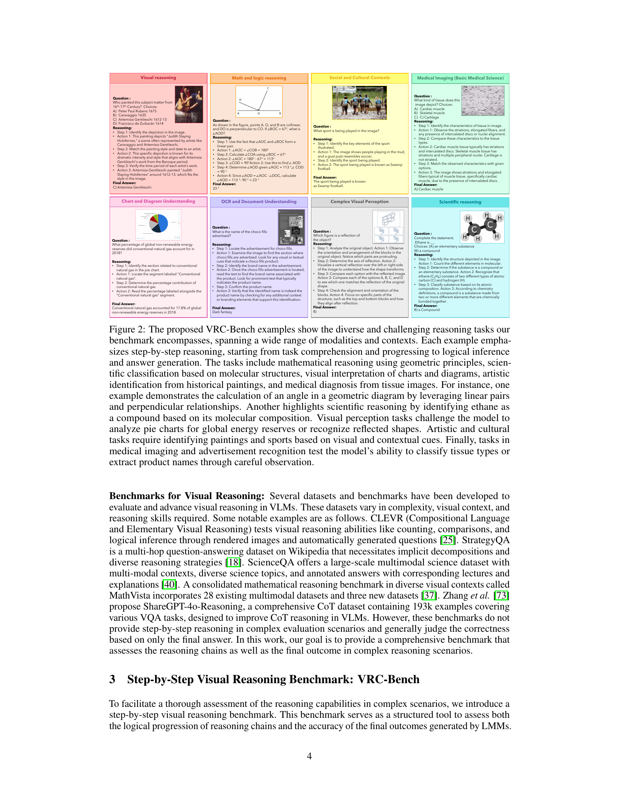
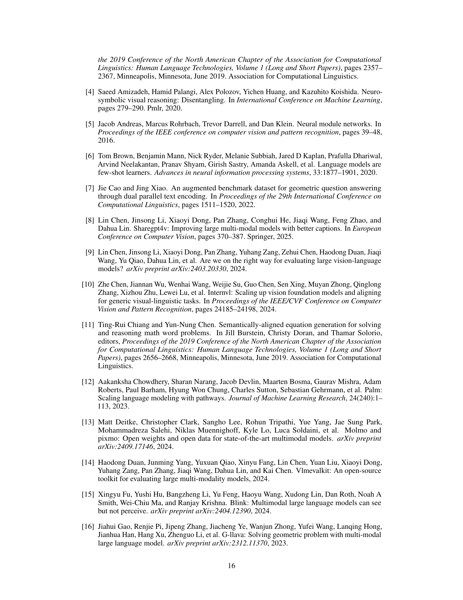
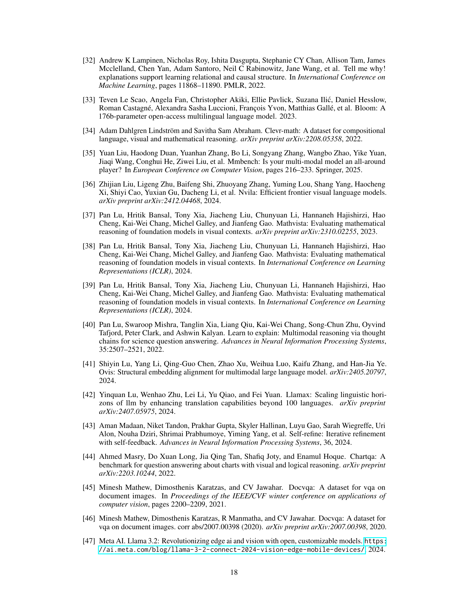

 


 2501.06186 
 Omkar Thawakar et el. 
 
 🤗 2025-01-13 
 



↗ arXiv


↗ Hugging Face


↗ Papers with Code


### TL;DR



기존의 대규모 언어 모델(LLM)은 복잡한 다단계 문제 해결에 어려움을 겪고 있으며, 특히 시각적 정보를 포함하는 문제에서는 단계별 이해가 부족했습니다.  또한 기존의 시각적 추론 평가 방법은 단계별 추론 과정을 충분히 고려하지 못했습니다. 

본 논문에서는 이러한 문제점을 해결하기 위해 **세 가지 주요한 기여**를 합니다. 첫째, 다양한 유형의 시각적 추론 과제를 포함하는 새로운 벤치마크(VRC-Bench)를 제시하여, LLM의 단계별 시각적 추론 능력을 종합적으로 평가할 수 있는 기반을 마련했습니다. 둘째, 단계별 추론의 정확성과 논리적 일관성을 모두 평가하는 새로운 측정 지표를 제시했습니다. 셋째, 커리큘럼 학습과 빔 서치 기법을 활용하여 단계별 시각적 추론 능력을 향상시킨 새로운 다중 모달 모델 LlamaV-01을 개발했습니다.



#### Key Takeaways


 단계별 시각적 추론을 위한 새로운 벤치마크(VRC-Bench) 제시 



 단계별 추론 과정의 질을 평가하는 새로운 측정 지표 제시 



 커리큘럼 학습 및 빔 서치를 활용한 새로운 다중 모달 시각적 추론 모델(LlamaV-01) 제시 


#### Why does it matter?
본 논문은 **단계별 시각적 추론을 위한 새로운 벤치마크, 측정 지표 및 다중 모달 모델을 제시**하여 시각적 추론 분야의 발전에 크게 기여합니다. 특히 **단계별 추론 과정 평가에 초점**을 맞춰 기존 연구의 한계를 극복하고, **다양한 분야의 과제를 포괄하는 벤치마크**를 제공하여 향후 연구의 기준을 제시합니다.  또한 **커리큘럼 학습 및 빔 서치 기법을 활용**한 효율적인 추론 모델을 제시하여 실제 응용 가능성을 높였습니다. 이는 **시각적 추론 모델의 성능 향상과 해석성 향상**에 직접적인 영향을 미치며, 다양한 응용 분야에 폭넓게 활용될 수 있습니다.

------
#### Visual Insights

> 🔼 그림 1은 제안된 VRC-Bench의 패턴 인식 과제에서 LlamaV-01 모델과 클로즈소스 Gemini-1.5-Flash 및 Claude-3.5-Sonnet 모델의 추론 능력을 비교한 것입니다. Claude-3.5-Sonnet은 '옵션 없음'이라는 결론을 내렸지만, 그 추론 단계는 관찰된 논리와 완전히 일치하지 않습니다 (빨간색으로 강조 표시). Gemini-1.5-Flash는 논리적 일관성이 부족한 추론을 보여줍니다 (빨간색으로 강조 표시). 반면 LlamaV-01은 옵션 D가 확립된 패턴을 따른다는 점을 밝혀냄으로써 더 나은 체계적인 추론을 제공하여 논리적 추론 능력을 보여줍니다. 그림 5에 추가 결과가 제시되어 있습니다.
> 

> 
read the caption

> Figure 1:  Comparison of the reasoning abilities of our model (LlamaV-o1) with closed-source Gemini-1.5-Flash and Claude-3.5-Sonnet on an example in pattern recognition task from our proposed VRC-Bench. While Claude-3.5-Sonnet concludes 'none of the options,' its reasoning steps lack full alignment with the observed logic (highlighted in red). Gemini-1.5-Flash demonstrates weaker reasoning with less logical coherence details (highlighted in red). Our LlamaV-o1 provides better and more systematic reasoning, identifying that option D follows the established pattern, thereby showcasing its logical reasoning capability. Additional results are presented in Fig. 5.
> 


|  | **LlamaV-o1 Project:** | [https://mbzuai-oryx.github.io/LlamaV-o1/](https://mbzuai-oryx.github.io/LlamaV-o1/) |
|  | **LlamaV-o1 Model:** | [https://huggingface.co/omkarthawakar/LlamaV-o1](https://huggingface.co/omkarthawakar/LlamaV-o1) |
|  | **LlamaV-o1 Code:** | [https://github.com/mbzuai-oryx/LlamaV-o1](https://github.com/mbzuai-oryx/LlamaV-o1) |
|  | **VRC-Bench** | [https://huggingface.co/datasets/omkarthawakar/VRC-Bench](https://huggingface.co/datasets/omkarthawakar/VRC-Bench) |

> 🔼 이 표는 대규모 다중 모드 언어 모델(LMM)의 추론 품질을 평가하기 위해 고려된 포괄적인 속성들을 개괄적으로 보여줍니다. 이러한 속성들은 충실성, 정보성, 논리적 일관성과 같은 중요한 측면에 중점을 둡니다. 주요 측정 지표에는 원본과 추론 단계의 정렬 확인(충실성-단계 및 토큰), 정보의 완전성(정보성-단계), 환각, 반복 또는 누락된 단계와 같은 문제 식별이 포함됩니다. 의미 범위 및 추론 정렬과 같은 추가적인 지표는 응답의 논리적 및 의미적 무결성을 평가합니다. 종합적으로, 이러한 지표들은 LLM이 생성한 추론의 정확성, 완전성 및 신뢰성을 평가하기 위한 강력한 프레임워크를 제공합니다.
> 

> 
read the caption

> Table 1:  An overview of comprehensive set of attributes considered in our evaluation to assess the quality of reasoning in LMMs. These attributes focus on critical aspects such as faithfulness, informativeness, and logical coherence of reasoning steps. Key measures include ensuring alignment of reasoning steps with the source (Faithfulness-Step and Token), completeness of information (Informativeness-Step), and identifying issues like hallucinations, redundancy, or missing steps. Additional metrics, such as Semantic Coverage and Reasoning Alignment, evaluate the logical and semantic integrity of the response. Together, these metrics provide a robust framework for evaluating the accuracy, completeness, and reliability of LLM-generated reasoning.
> 

### In-depth insights

#### Step-wise Reasoning
단계적 추론은 복잡한 문제를 작은 단계로 나누어 해결하는 인간의 인지 과정을 모방한 접근 방식입니다. 이는 각 단계의 논리적 일관성을 유지하여 더 정확하고 해석 가능한 결론에 도달할 수 있도록 합니다. **LLM(대규모 언어 모델)에서 단계적 추론을 향상시키는 것은 복잡한 다단계 문제 해결 능력을 향상시키는 데 중요합니다.** 기존의 단순 정확도 중심 평가 방식에서 벗어나, 개별 단계의 정확성과 논리적 일관성을 모두 평가하는 **종합적인 평가 프레임워크**가 필요합니다.  **단계적 추론을 위한 새로운 벤치마크**는 다양한 도메인에 걸쳐 다양한 유형의 과제를 제공하여 LLM의 다단계 추론 능력을 포괄적으로 평가해야 합니다.  **커리큘럼 학습**은 단순한 과제에서부터 점진적으로 복잡한 과제로 모델을 학습시켜 모델의 해석력과 일반화 능력을 향상시키는 데 도움이 될 수 있습니다.  빔 서치와 같은 효율적인 추론 기법을 통합하여 복잡한 문제 해결에 필요한 계산 비용을 최소화하는 동시에 높은 수준의 정확도를 유지해야 합니다.

#### VRC-Bench
논문에서 제시된 VRC-Bench는 **다양한 시각적 추론 과제를 포괄하는 종합적인 벤치마크**로, **단계별 시각적 추론 능력 평가에 중점**을 둡니다. 기존 벤치마크들이 주로 최종 결과의 정확도에만 초점을 맞춘 것과 달리, VRC-Bench는 **문제 해결 과정의 각 단계별 정확성과 논리적 일관성을 평가하는 새로운 지표**를 제시합니다. 이를 통해 모델의 추론 과정에 대한 깊이 있는 분석 및 이해가 가능해집니다.  **8가지 다양한 범주**를 포함하여 시각적 인지에서 과학적 추론에 이르기까지 다양한 어려움을 제시하며, **4천 개 이상의 추론 단계**를 포함하는 방대한 데이터셋으로 구성됩니다.  이는 **LLM의 다중 모달 추론 능력 향상**에 기여하는 중요한 벤치마크로,  **모델 개발 및 성능 비교**에 유용한 도구가 될 것으로 예상됩니다.  **공개적으로 이용 가능한 벤치마크**라는 점에서 학계 및 산업계에 널리 활용될 것으로 기대됩니다.

#### LlamaV-01 Model
LlamaV-01 모델은 **단계별 시각적 추론(step-by-step visual reasoning)**에 초점을 맞춘 다중 모드(multimodal) 모델입니다. 기존의 접근 방식과 달리, LlamaV-01은 문제를 단계적으로 해결하는 데 중점을 두며, 각 단계의 정확성과 논리적 일관성을 평가하는 새로운 지표를 제시합니다. **커리큘럼 학습(curriculum learning)**을 통해 단순한 작업부터 점진적으로 복잡한 작업까지 학습하여 모델의 **해석력(interpretability)**과 **일반화 능력(generalization)**을 향상시킵니다.  **빔 서치(beam search)** 기법을 활용하여 추론 효율성을 높이고 계산 비용을 최소화하는 것 또한 특징입니다.  기존 오픈소스 모델보다 우수한 성능을 보이며, 여러 벤치마크에서 **상당한 성능 향상**을 기록했습니다.  이는 LlamaV-01이 복잡한 시각적 추론 문제를 해결하는 데 효과적임을 보여주는 결과입니다.  **공개적으로 벤치마크, 모델, 코드를 제공**하여 연구의 재현성과 투명성을 확보했습니다.

#### Curriculum Learning
본 논문에서 제시된 커리큘럼 학습 방법은 **단계적이고 점진적인 학습 방식**을 통해 모델의 성능을 향상시키는 데 중점을 둡니다. 간단한 작업부터 시작하여 점차 복잡한 작업으로 난이도를 높여가는 방식으로, 모델이 기초적인 개념을 먼저 습득하고 이를 바탕으로 더욱 복잡한 문제에 대한 이해와 해결 능력을 발전시킬 수 있도록 합니다.  이는 **모델의 일반화 능력 향상**과 **과적합 방지**에 효과적인 전략으로 평가됩니다.  특히 다양한 모달리티(텍스트, 이미지 등)를 처리하는 다중 모달 모델의 경우, 커리큘럼 학습은 각 모달리티 간의 상호작용을 이해하고 통합하는 능력을 향상시키는 데 중요한 역할을 합니다. **단계적인 학습 과정은 각 단계에서 모델의 성능을 평가하고 개선 방향을 모색**할 수 있는 기회를 제공하며, 이를 통해 더욱 효율적이고 효과적인 학습이 가능해집니다.  **빔 서치(Beam Search) 기법과의 결합**을 통해 추론 과정의 효율성을 높이는 동시에 정확성을 유지하는 전략도 함께 제시됩니다.  궁극적으로, 커리큘럼 학습은 단계적 추론 능력을 갖춘 강력한 다중 모달 모델을 구축하는 핵심 요소로 작용합니다.

#### Future Work
본 논문은 시각적 추론 분야에서 **단계별 추론(step-by-step reasoning)**의 중요성을 강조하며, 이를 향상시키기 위한 여러 방향을 제시합니다.  미래 연구 방향으로는 **다양한 시각적 모달리티(예: 비디오)**를 포함한 더욱 복잡한 문제에 대한 단계별 추론 모델 개발이 중요합니다. 또한, **현재 벤치마크의 한계를 극복**하여 더욱 포괄적이고 엄격한 평가 기준을 마련하는 것이 필요합니다.  **단계별 추론 과정의 해석성(interpretability)을 높이는 연구**도 중요한데, 이를 통해 모델의 의사결정 과정을 이해하고 신뢰도를 높일 수 있습니다.  마지막으로, **실제 응용 분야(예: 의료 영상 분석)**에 대한 단계별 추론 모델의 적용 및 성능 평가를 통해 실용성을 검증하는 연구가 필요합니다.  이러한 미래 연구는 시각적 추론의 발전에 크게 기여할 뿐 아니라, 다양한 분야에서 인공지능 기술의 활용 범위를 확장하는 데 중요한 역할을 할 것입니다.

### More visual insights

More on figures

> 🔼 그림 2는 제안된 VRC-Bench(Visual Reasoning Chain Benchmark)의 다양한 예시들을 보여줍니다.  각 예시는 다양한 모달리티(텍스트, 이미지, 차트 등)와 맥락을 사용하는 다단계 추론 과제를 보여줍니다. 각 문제는 과제 이해부터 논리적 추론, 최종 답변 생성까지 단계별 추론 과정을 강조합니다.  과제의 유형은 기하학적 원리를 이용한 수학적 추론, 분자 구조를 기반으로 한 과학적 분류, 차트와 다이어그램의 시각적 해석, 역사적 그림의 예술적 식별, 조직 이미지를 통한 의학적 진단 등 다양합니다. 예를 들어, 기하학적 다이어그램에서 선형 쌍과 수직 관계를 이용하여 각도를 계산하는 문제, 분자 구성을 바탕으로 에탄을 화합물로 식별하는 문제, 전 세계 비재생 에너지 매장량에 대한 원형 차트 분석 또는 반사된 모양 인식 문제 등이 포함됩니다.  또한, 시각적 단서와 맥락적 단서를 기반으로 그림과 스포츠를 식별하는 예술 및 문화적 과제와 조직 유형을 분류하거나 광고에서 제품 이름을 추출하는 의료 이미징 및 광고 인식 과제도 포함되어 있습니다.  전반적으로, 이 그림은 VRC-Bench의 광범위한 난이도와 다양성을 보여주는 대표적인 예시들을 제시합니다.
> 

> 
read the caption

> Figure 2:  The proposed VRC-Bench examples show the diverse and challenging reasoning tasks our benchmark encompasses, spanning a wide range of modalities and contexts. Each example emphasizes step-by-step reasoning, starting from task comprehension and progressing to logical inference and answer generation. The tasks include mathematical reasoning using geometric principles, scientific classification based on molecular structures, visual interpretation of charts and diagrams, artistic identification from historical paintings, and medical diagnosis from tissue images. For instance, one example demonstrates the calculation of an angle in a geometric diagram by leveraging linear pairs and perpendicular relationships. Another highlights scientific reasoning by identifying ethane as a compound based on its molecular composition. Visual perception tasks challenge the model to analyze pie charts for global energy reserves or recognize reflected shapes. Artistic and cultural tasks require identifying paintings and sports based on visual and contextual cues. Finally, tasks in medical imaging and advertisement recognition test the model’s ability to classify tissue types or extract product names through careful observation.
> 

> 🔼 그림 3은 논문에서 제안된 ReasoningChain-Bench에 대한 LMM(대규모 다중 모드 모델)의 종합적인 벤치마크 구조와 비교 성능을 보여줍니다. 왼쪽 그림은 수학 및 논리 추론(MathVista[38] 231개 샘플, LogicVista 158개 샘플), 과학적 추론(Science-QA[40] 83개 샘플), 시각적 인지(Blink-IQ-Test[15] 35개 샘플) 등 다양한 영역의 샘플을 포함하는 데이터셋을 보여줍니다. 또한 의료 이미징(MMMU-Medical[72] 29개 샘플), 문화 및 사회적 이해(ALM-Bench[57] 104개 샘플), OCR을 통한 문서 이해(Doc-VQA[46] 61개 샘플)와 같은 특수 분야도 포함합니다. 차트 및 다이어그램 이해(Chart-VQA[44] 107개 샘플)와 같은 작업을 통합하여 데이터셋은 광범위한 실제 응용 프로그램을 다룰 뿐만 아니라 LMM의 추론, 인지 및 복합 다중 모드 정보 해석 능력을 향상시킵니다. 오른쪽 막대 그래프는 VRC-Bench에서 다양한 최첨단 추론 모델의 비교를 보여주며, 최종 답변 정확도와 단계별 추론 점수를 모두 강조합니다. 복잡한 추론 작업에 대해 평가된 모델에는 GPT-4o, Gemini-2.0-Flash, Claude-3.5-Sonnet 및 Llava-CoT가 포함됩니다. 제안된 벤치마크는 정확한 최종 답변 생성 능력뿐만 아니라 추론 단계의 일관성과 논리적 흐름도 평가합니다. 제안된 방법인 LlamaV-o1은 VRC-Bench에서 GPT-4o-mini, Gemini-1.5-Flash 및 Llava-CoT를 능가하며 복잡한 다중 모드 추론 작업에서 우수한 최종 답변 정확도를 달성합니다.
> 

> 
read the caption

> Figure 3:  The figure illustrates our comprehensive benchmark structure and comparative performance of LMMs on the proposed ReasoningChain-Bench. (Left) The dataset spans multiple domains, including carefully selected samples for mathematical and logical reasoning (e.g., MathVista [38] with 231 samples and LogicVista with 158 samples), scientific reasoning (e.g., Science-QA [40] with 83 samples), and visual perception (e.g., Blink-IQ-Test [15] with 35 samples). Additionally, it includes specialized areas such as medical imaging (e.g., MMMU-Medical [72] with 29 samples), cultural and social understanding (e.g., ALM-Bench [57] with 104 samples), and document understanding through OCR (e.g., Doc-VQA [46] with 61 samples). By integrating tasks like chart and diagram comprehension (e.g., Chart-VQA [44] with 107 samples), our dataset not only covers a broad spectrum of real-world applications but also expand LMM’s ability to reason, perceive, and interpret complex multimodal information. (Right) The bar chart compares various SoTA reasoning models on the VRC-Bench, highlighting both final answer accuracy and step-by-step reasoning scores. The models evaluated for complex reasoning tasks include GPT-4o, Gemini-2.0-Flash, Claude-3.5-Sonnet, and Llava-CoT. Our benchmark evaluates models not only on their ability to generate accurate final answers but also on the coherence and logical flow of their reasoning steps. Our approach, LlamaV-o1, outperforms GPT-4o-mini, Gemini-1.5-Flash and Llava-CoT in the VRC-Bench, achieving superior results in final answer accuracy across complex multimodal reasoning tasks.
> 

> 🔼 그림 4는 다양한 추론 과제에서 여러 모델의 범주별 및 전반적 성능 점수를 종합적으로 비교한 것입니다. 평가는 수학 및 논리 추론, 과학적 추론, 복잡한 시각적 인식, 차트 및 다이어그램 이해, 의료 영상, 사회 및 문화적 맥락, 시각적 추론 및 OCR 및 문서 이해를 포함한 여러 도메인에 걸쳐 있습니다. 평가된 모델에는 GPT-4o, Claude-3.5-Sonnet, Gemini 변형, LLAVA-CoT 및 제안된 모델이 포함됩니다. 제안된 모델은 수학 및 논리 추론, 차트 및 다이어그램 이해, 의료 영상과 같은 중요한 범주에서 일관되게 우수한 성능을 보이며 단계별 추론(단계 점수)과 최종 답변 정확도(최종 답변 점수) 모두에서 균형 잡힌 개선을 달성합니다. LLAVA-CoT와 비교하여 제안된 방법은 과제 전반에 걸쳐 높은 정확도를 유지하면서 다단계 추론 과제에서 견고성과 해석 가능성을 보여줍니다.
> 

> 
read the caption

> Figure 4:  The comprehensive comparison of category-wise and overall performance scores achieved by various models on diverse reasoning tasks. The evaluation spans multiple domains, including Math & Logic Reasoning, Scientific Reasoning, Complex Visual Perception, Chart & Diagram Understanding, Medical Imaging, Social & Cultural Context, Visual Reasoning, and OCR & Document Understanding. The models assessed include GPT-4o, Claude-3.5-Sonnet, Gemini variants, LLAVA-CoT, and our proposed model. Our model demonstrates consistently superior performance in critical categories such as Math & Logic Reasoning, Chart & Diagram Understanding, and Medical Imaging, achieving a balanced improvement across both step-by-step reasoning (Step Scores) and final answer accuracy (Final Answer Scores). Compared to LLAVA-CoT, our approach excels in maintaining high accuracy across tasks while showcasing robustness and interpretability in multi-step reasoning challenges.
> 

> 🔼 그림 5는 제안된 VRC-Bench의 예시를 사용하여 Llava-CoT와 제안된 LlamaV-01의 성능을 정성적으로 비교한 것입니다. 첫 번째 줄은 차트를 이용한 시각적 추론 능력을 보여줍니다. Llava-CoT는 중간 단계와 최종 답변 모두에서 실수를 저지르는 반면, LlamaV-01은 정확한 단계 설명과 최종 답변을 제공합니다. 두 번째 줄은 실제 시각적 질의응답(VQA) 예시를 보여줍니다. 두 모델 모두 정확한 단계적 설명을 제공하지만, Llava-CoT는 최종 답변을 유추하는 데 실패합니다. 마지막 줄은 계산 문제를 보여줍니다. Llava-CoT는 정확한 답을 제시하지 못하고 중간 단계도 누락한 반면, LlamaV-01은 중간 단계에서 더 나은 성능을 보이고 정확한 최종 답변을 제공합니다.
> 

> 
read the caption

> Figure 5:  Qualitative comparison between Llava-CoT and the proposed LlamaV-o1 on examples from the VRC-Bench. First row: the example shows visual reasoning capabilities on an example chart. Here, Llava-CoT makes mistakes (highlighted in red) for both the intermediate steps and the final answer. In Comparison, our LlamaV-o1 provides an accurate description of the steps as well as the final answer. Second row: While both Llava-CoT and our LlamaV-o1 provide accurate step descriptions on an example real-world VQA, Llava-CoT fails to infer the final answer. Last row: Llava-CoT fails to accurately answer for the counting task, while also missing the intermediate counting steps. In contrast, our LlamaV-o1 model performs better in intermediate reasoning steps while also providing the accurate final answer.
> 

More on tables


| Metric | Definition |
|---|---| 
| `Faithfulness-Step` | Measures how well the reasoning steps in the LMM response align with the source reasoning steps. |
| `Faithfulness-Token` | Extends Faithfulness-Step to token-level granularity, checking if the content within each step is accurate. |
| `Informativeness-Step` | Measures how well the reasoning steps extract all relevant information from the context. |
| `Repetition-Token` | Identifies repeated or unnecessarily paraphrased reasoning steps. |
| `Hallucination` | Detects irrelevant or fabricated reasoning steps not aligned with the source. |
| `Redundancy` | Identifies redundant reasoning steps that do not add value. |
| `Semantic Coverage-Step` | Measures how well the response covers the essential semantic elements of the source reasoning steps. |
| `Reasoning Alignment` | Overall alignment between the hypothesis and reference reasoning chain. |
| `Commonsense` | Checks for missing commonsense reasoning are required to solve the problem. |
| `Missing Step` | Identifies if any necessary reasoning steps are missing. |
> 🔼 표 2는 제안된 VRC-Bench(Visual Reasoning Chain Benchmark)를 기반으로 최종 답변 정확도와 추론 단계 성능 측면에서 여러 모델을 비교한 결과를 보여줍니다.  '최종 답변 정확도'는 모델이 제시한 최종 답변이 실제 정답과 얼마나 일치하는지를 나타내는 지표이며, '추론 단계 성능'은 모델이 문제 해결 과정을 얼마나 논리적이고 체계적으로 설명하는지를 평가하는 지표입니다.  표에는 여러 종류의 대규모 언어 모델(LLM)과 다중 모달 모델(LMM)들의 성능이 제시되어 있으며, 각 모델의 최종 답변 정확도와 추론 단계 성능 점수가 비교되어 있습니다. 특히, 본 논문에서 제안된 LlamaV-01 모델은 오픈소스 모델 중에서는 가장 우수한 성능을 보이며, 상용 모델들과도 경쟁력 있는 성능을 보이는 것으로 나타납니다. 표에서 가장 높은 점수를 기록한 모델은 굵은 글씨체로 표시되어 있습니다.
> 

> 
read the caption

> Table 2: Comparison of models based on Final Answer accuracy and Reasoning Steps performance on the proposed VRC-Bench. The best results in each case (closed-source and open-source) are in bold. Our LlamaV-o1 achieves superior performance compared to its open-source counterpart (Llava-CoT) while also being competitive against the closed-source models.
> 


| Model | Close-Source | Close-Source | Close-Source | Close-Source | Close-Source | Close-Source | Open-Source | Open-Source | Open-Source | Open-Source | Open-Source |
|---|---|---|---|---|---|---|---|---|---|---|---|
|  | GPT-4o | Claude-3.5 | Gemini-2.0 | Gemini-1.5 | Gemini-1.5 | GPT-4o | Llama-3.2 | Mulberry | Llava-CoT | LlamaV-o1 |
|  | [2] | Sonnet [1] | Flash | Pro [52] | Flash [52] | mini [48] | Vision [47] | [68] | [66] | (Ours) |
| Final Answer | 59.28 | 61.35 | 61.16 | 61.35 | 54.99 | 56.39 | 48.40 | 51.90 | 54.09 | 56.49 |
| Steps | 76.68 | 72.12 | 74.08 | 72.12 | 71.86 | 74.05 | 58.37 | 63.86 | 66.21 | 68.93 |
> 🔼 표 3은 MMStar, MMBench, MMVet, MathVista, AI2D, Hallusion 등 여섯 가지 벤치마크 데이터셋에서 다양한 모델들의 성능을 비교 분석한 결과를 보여줍니다.  비교 대상에는 독점 모델(closed-source model)과 오픈소스 모델(open-source model) 모두 포함됩니다.  평균 점수 기준으로, GPT-4o가 독점 모델 중 최고 성능(71.8%)을 달성했고, 제안된 LlamaV-01 모델은 오픈소스 모델 중 최고 성능(67.33%)을 기록하여 최근의 Llava-CoT 모델보다 3.8% 앞섰습니다.
> 

> 
read the caption

> Table 3: Performance comparison on six benchmark datasets (MMStar [9], MMBench [35], MMVet [71], MathVista [39], AI2D [29], and Hallusion [21]) along with their average scores. The comparison includes both close-source and open-source models. The best performing close-source model is GPT-4o with an average score of 71.8%. Among open-source models, our proposed LlamaV-o1 achieves the best performance with an average score of 67.33% outperforming the recent Llava-CoT by 3.8%.
> 


| Model | MMStar | MMBench | MMVet | MathVista | AI2D | Hallusion | Average |
|---|---|---|---|---|---|---|---| 
| **Close-Source** |  |  |  |  |  |  |  |
| GPT-4o-0806 [2] | 66.0 | 82.4 | 80.8 | 62.7 | 84.7 | 54.2 | 71.8 |
| Claude3.5-Sonnet-0620 [1] | 64.2 | 75.4 | 68.7 | 61.6 | 80.2 | 49.9 | 66.7 |
| Gemini-1.5-Pro [52] | 56.4 | 71.5 | 71.3 | 57.7 | 79.1 | 45.6 | 63.6 |
| GPT-4o-mini-0718 [48] | 54.9 | 76.9 | 74.6 | 52.4 | 77.8 | 46.1 | 63.8 |
| **Open-Source** |  |  |  |  |  |  |  |
| InternVL2-8B [10] | 62.50 | 77.40 | 56.90 | 58.30 | 83.60 | 45.00 | 64.00 |
| Ovis1.5-Gemma2-9B [41] | 58.70 | 76.30 | 50.90 | 65.60 | 84.50 | 48.20 | 64.00 |
| MiniCPM-V2.6-8B [70] | 57.10 | 75.70 | 56.30 | 60.60 | 82.10 | 48.10 | 63.30 |
| Llama-3.2-90B-Vision-Inst [47] | 51.10 | 76.80 | 74.10 | 58.30 | 69.50 | 44.10 | 62.30 |
| VILA-1.5-40B [36] | 53.20 | 75.30 | 44.40 | 49.50 | 77.80 | 40.90 | 56.90 |
| Mulberry-7B [68] | 61.30 | 75.34 | 43.90 | 57.49 | 78.95 | 54.10 | 62.78 |
| Llava-CoT [66] | 57.60 | 75.00 | 60.30 | 54.80 | 85.70 | 47.80 | 63.50 |
| **Our Models** |  |  |  |  |  |  |  |
| Llama-3.2-11B-Vision-Inst [47] (baseline) | 49.80 | 65.80 | 57.60 | 48.60 | 77.30 | 40.30 | 56.90 |
| **LlamaV-o1 (Ours)** | 59.53 | 79.89 | 65.40 | 54.40 | 81.24 | 63.51 | 67.33 |
> 🔼 표 4는 제안된 방법의 기여가 다양한 벤치마크(MMStar, MMBench, MMVet, MathVista, AI2D, Hallusion)에서 다중 모드 추론 작업에 미치는 영향을 보여줍니다.  먼저 커리큘럼 학습과 다단계 CoT 추론을 결합한 기준 모델(Llama-3.2-11B-Vision-Inst [47])과 비교하여 9.14%의 절대적인 성능 향상을 달성했습니다. 이는 복잡한 다단계 추론을 효과적으로 처리하는 모델의 능력을 보여줍니다. 이 기준 방법은 논리적 추론과 시각적 이해를 포함한 다양한 작업에서 성능을 향상시키기 위해 구조화된 훈련을 활용합니다.  빔 서치를 통합하여 모델의 성능을 더욱 향상시켰습니다 (3번째 행). 이러한 향상은 MMVet(65.40% 대 61.88%), MathVista(54.40% 대 53.20%), AI2D(81.24% 대 80.18%)와 같은 벤치마크에서 특히 두드러지게 나타났으며, 더욱 정확한 추론으로 일반화 능력이 향상되었음을 보여줍니다.  커리큘럼 학습과 최적화된 추론 전략을 결합한 최종 방법은 기준 방법과 비교하여 10.43%의 전반적인 평균 성능 향상을 달성했습니다.
> 

> 
read the caption

> Table 4:  Impact of our proposed contributions on multimodal reasoning tasks across six benchmarks: MMStar, MMBench, MMVet, MathVista, AI2D, and Hallusion. Starting with Curriculum Learning combined with Multi-Step CoT reasoning (2nd row), the model achieves a 9.14% absolute gain compared to base model Llama-3.2-11B-Vision-Inst [47], demonstrating its ability to handle complex multi-step reasoning effectively. This baseline approach leverages structured training to improve performance across diverse tasks, including logical reasoning and visual understanding. By incorporating Beam Search, the model’s performance further improves (3rd row). This enhancement is particularly noticeable in benchmarks such as MMVet (65.40% vs. 61.88%), MathVista (54.40% vs. 53.20%), and AI2D (81.24% vs. 80.18%), showcasing the model’s ability to generalize better with more accurate reasoning. Our final approach that combines curriculum learning with optimized inference strategies achieves an overall average gain of 10.43%, compared to the baseline.
> 


| Model | MMStar | MMBench | MMVet | MathVista | AI2D | Hallusion | Average |
|---|---|---|---|---|---|---|---| 
| Llama-3.2-11B-Vision-Inst (_baseline_) | 49.80 | 65.80 | 57.60 | 48.60 | 77.30 | 40.30 | 56.90 |
| + Curriculum with Multi-Step CoT Reasoning | 58.13 | 79.55 | 61.88 | 53.20 | 80.18 | 63.31 | 66.04 |
| + Beam Search | 59.53 | 79.89 | 65.40 | 54.40 | 81.24 | 63.51 | 67.33 |
> 🔼 표 5는 단일 NVIDIA A100 GPU를 사용하여 MMVet 벤치마크에서 추론 확장 기법을 비교한 결과를 보여줍니다. 왼쪽은 단계별 빔 검색을 사용하는 Llava-CoT의 성능을 보여줍니다. 빔 개수가 증가함에 따라 MMVet 점수가 향상되지만, 이차적 확장으로 인해 추론 시간이 크게 증가합니다. 오른쪽은 빔 검색을 사용하는 제안된 방법의 성능을 보여줍니다. 선형 확장 효율 덕분에 훨씬 짧은 추론 시간으로 더 높은 MMVet 점수를 달성합니다. 예를 들어, 제안된 방법은 6.1 GPU 시간에 4개의 빔으로 65.40점을 받았지만, Llava-CoT는 46.1 GPU 시간에 62.9점을 받았습니다. 이는 실제 응용 프로그램에 대한 제안된 방법의 효율성과 실용성을 보여줍니다.
> 

> 
read the caption

> Table 5:  Comparison of inference scaling techniques on the MMVet benchmark, evaluated using a single NVIDIA A100 GPU. Left: Llava-CoT with stage-level beam search shows improved MMVet scores with more beams but suffers from quadratic scaling, significantly increasing inference time. Right: Performance of our approach utilizing Beam Search achieving higher MMVet scores with much lower inference time, due to its linear scaling efficiency. For instance, our method scores 65.40 with four beams in 6.1 GPU hours, compared to Llava-CoT’s 62.9 score requiring 46.1 GPU hours. This demonstrates the efficiency and practicality of our approach for real-world applications.
> 

### Full paper



