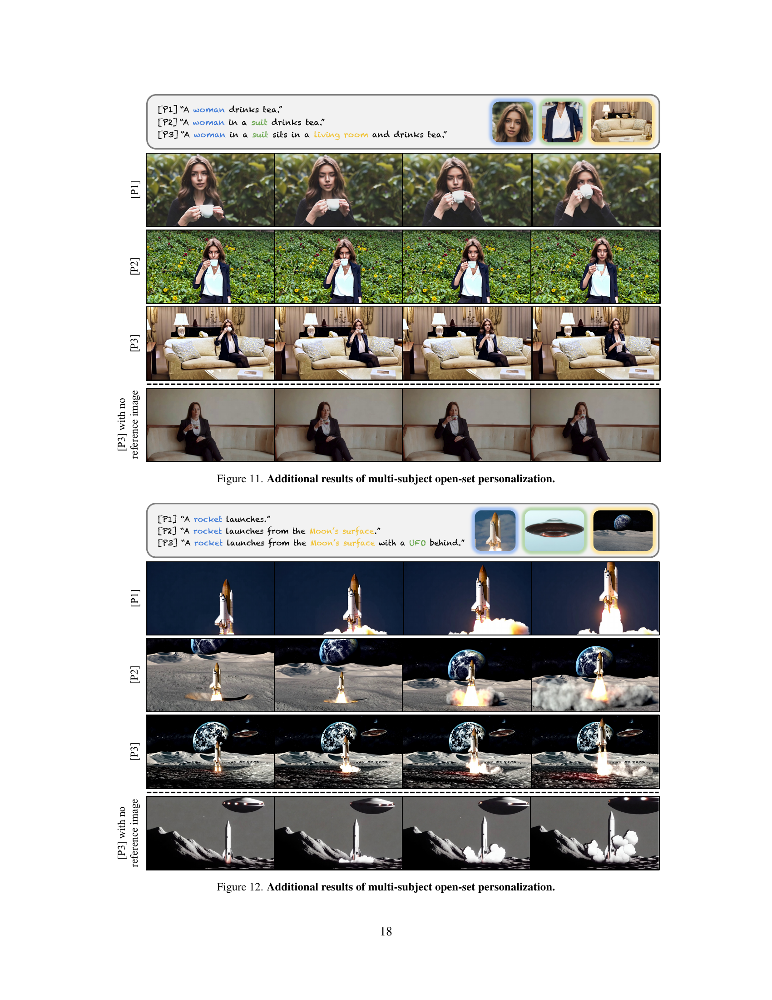

 


 2501.06187 
 Tsai-Shien Chen et el. 
 
 🤗 2025-01-13 
 



↗ arXiv


↗ Hugging Face


↗ Papers with Code


### TL;DR



기존의 비디오 개인화 기술은 **단일 주체 또는 제한된 범주**에만 초점을 맞추고, **시간이 많이 소요되는 최적화 과정**이 필요하다는 한계가 있습니다. 또한, **새로운 개체나 배경**에 대한 일반화 성능이 떨어집니다. 이러한 문제를 해결하기 위해, 본 논문에서는 **다중 주체 개방형 개인화 기능**을 갖춘 새로운 비디오 생성 모델인 Video Alchemist를 제시합니다.

Video Alchemist는 **확산 변환기(Diffusion Transformer)** 모듈을 기반으로, 각 참조 이미지와 해당 주체에 대한 텍스트 프롬프트를 결합합니다. 또한, **자동화된 데이터 구축 파이프라인**을 통해 대규모 학습 데이터를 생성하고, **오버피팅 문제**를 완화하기 위한 데이터 증강 기법을 제시합니다.  실험 결과, Video Alchemist는 기존 방법보다 **주체 정확도와 배경 충실도**가 훨씬 높은 것으로 나타났습니다. 제시된 새로운 개인화 벤치마크를 통해 다양한 시나리오에서 성능 우위를 입증했습니다.



#### Key Takeaways


 다중 주체와 개방형 객체에 대한 비디오 개인화 기능을 통합한 Video Alchemist 모델 제시 



 오버피팅 문제 해결을 위한 새로운 데이터 증강 기법과 평가 벤치마크 제안 



 정량적 및 정성적 평가를 통해 기존 방법 대비 성능 우위 입증 


#### Why does it matter?
본 논문은 **다중 주체 개방형 개인화 비디오 생성** 분야에 중요한 기여를 합니다. 기존 방법들의 한계를 극복하고 새로운 벤치마크를 제시하여, 향후 연구의 새로운 방향을 제시하며, **실제 응용 가능성을 높이는 기술**을 제공합니다. 특히 **개방형 집합(open-set)** 개체와 배경을 지원하는 모델은 다양한 응용 분야에 혁신적인 영향을 미칠 수 있습니다.

------
#### Visual Insights

> 🔼 본 그림은 비디오 알케미스트(Video Alchemist) 모델의 기능을 보여줍니다.  텍스트 프롬프트('A man pets a dog on...')와 각 객체(사람, 강아지) 및 배경(다리, 사막, 바다 얼음, 달 표면)에 대한 참조 이미지가 주어지면, 모델은 자연스러운 동작을 합성하면서 동시에 객체의 정체성과 배경의 충실도를 유지합니다.  즉, 입력된 텍스트와 이미지들을 바탕으로 사람과 강아지가 자연스럽게 상호작용하는 영상을 생성하고, 배경 또한 프롬프트에 맞춰 일관성 있게 표현하는 모델의 능력을 시각적으로 보여줍니다.
> 

> 
read the caption

> Figure 1:  Given a text prompt as well as reference images for each subject (i.e., man, dog) and background images (i.e., bridge, desert, sea ice, Moon’s surface), Video Alchemist synthesizes natural motions while preserving subject identity and background fidelity.
> 


| Method | Test-time Optimization | Reference Images: Subject | Reference Images: Background | Text-S↑ | Vid-S↑ | Subj-S↑ | Dync-D↑ |
|---|---|---|---|---|---|---|---| 
| ELITE† [74] | ✗ | single | ✗ | 0.245 | 0.620 | 0.359 | - |
| VideoBooth [28] | ✗ | single | ✗ | 0.222 | 0.612 | 0.395 | 0.448 |
| DreamVideo [75] | ✓ | single | ✗ | 0.261 | 0.611 | 0.310 | 0.311 |
| *Video Alchemist* | ✗ | single | ✗ | 0.269 | 0.732 | 0.617 | 0.466 |
| DreamVideo [75] | ✓ | multiple | ✗ | 0.253 | 0.604 | 0.256 | 0.303 |
| *Video Alchemist* | ✗ | multiple | ✗ | 0.268 | 0.743 | 0.626 | 0.473 |
| *Video Alchemist* | ✗ | multiple | ✓ | 0.254 | 0.780 | 0.570 | 0.506 |

> 🔼 표 1은 MSRVTT-Personalization 데이터셋을 사용한 정량적 비교 결과를 보여줍니다. 비디오 알케미스트(Video Alchemist) 모델을 최첨단 개인화 모델들과 텍스트 유사도(Text-S), 비디오 유사도(Vid-S), 객체 유사도(Subj-S), 얼굴 유사도(Face-S), 동적 정도(Dync-D) 등 여러 지표를 통해 비교 분석했습니다. 상단 표는 객체 모드, 하단 표는 얼굴 모드 평가 결과를 각각 나타냅니다. 텍스트-이미지 모델의 경우 시간적 품질 평가 없이 단일 프레임 비디오로 처리되었으며, 비디오 알케미스트 모델은 512x288 해상도 비디오를 사용하여 평가했습니다. 단일 참조 이미지 설정에서 상위 2개 모델을 강조 표시했습니다.
> 

> 
read the caption

> Table 1: Quantitative comparison on MSRVTT-Personalization.  We compare Video Alchemist with state-of-the-art personalization methods across multiple metrics, including text similarity (Text-S), video similarity (Vid-S), subject similarity (Subj-S), face similarity (Face-S), and dynamic degree (Dync-D). The top and bottom tables show the evaluations for subject and face modes, respectively. †For text-to-image models, outputs are treated as single-frame videos without evaluating temporal quality. We evaluate Video Alchemist with the videos at 512⁢p⁢x×288⁢p⁢x512px288px512\mathrm{px}\times 288\mathrm{px}512 roman_p roman_x × 288 roman_p roman_x resolution. We highlight the top two models for the single reference image setting.
> 

### In-depth insights

#### Multi-subject VidGen
다중 객체 비디오 생성(Multi-subject VidGen)은 **단일 객체에 국한되지 않고 여러 객체를 동시에 고려하여 비디오를 생성하는 기술**을 의미합니다. 이는 기존의 단일 객체 중심 VidGen의 한계를 넘어서는 중요한 발전으로, 보다 현실적이고 풍부한 비디오 생성을 가능하게 합니다.  **다양한 객체의 상호 작용 및 시너지 효과를 반영**하여 더욱 자연스럽고 몰입도 높은 결과물을 만들어낼 수 있습니다.  하지만, 다중 객체를 효과적으로 처리하기 위해서는 **객체 간의 관계, 위치, 움직임 등을 정확하게 모델링하고 제어**하는 기술이 필수적입니다. 또한, **데이터셋 구축 및 평가의 어려움** 또한 극복해야 할 과제입니다. 다양한 객체와 배경의 조합을 포함하는 대규모 데이터셋 확보 및 객체 식별, 추적, 상호 작용 분석 등을 위한 효과적인 평가 지표 개발이 중요합니다.  **다중 객체 VidGen 기술은 메타버스, 게임, 영화 등 다양한 분야에 혁신적인 변화**를 가져올 것으로 예상됩니다.

#### Diffusion Transformer
본 논문에서 제시된 "확산 트랜스포머(Diffusion Transformer)"는 **비디오 개인화를 위한 새로운 아키텍처**로, 텍스트 프롬프트와 각 개체에 대한 참조 이미지를 효과적으로 융합하여 **다중 주체 및 개방형 집합 개인화**를 가능하게 합니다.  기존 방법의 한계를 극복하기 위해 **크로스 어텐션 레이어**를 사용하여 텍스트와 이미지 정보를 결합하고, **주체별 융합 메커니즘**을 통해 다중 주체의 조건을 효과적으로 처리합니다.  **데이터 증강 및 효율적인 모델 훈련 전략**을 통해 오버피팅 문제를 완화하고, 새로운 평가 기준을 제시하여 개인화 성능을 정확하게 평가할 수 있도록 했습니다.  결과적으로, **정량적 및 정성적 평가 모두에서 기존 방법보다 우수한 성능**을 보여주는 강력한 비디오 개인화 모델을 제시합니다.  특히, **오픈셋 환경에서의 다양한 개인화 시나리오**에 대한 지원은 큰 장점입니다.

#### Data Augmentation
본 논문에서 제시된 데이터 증강 기법은 **과적합 문제 해결**에 초점을 맞추고 있습니다.  기존의 단순 재구성 방식 모델이 배경, 조명, 자세 등의 요소에 과도하게 의존하는 경향을 극복하기 위해, **다양한 증강 기법**들을 적용하여 모델이 대상 객체의 본질적인 특징에 집중하도록 유도합니다.  **해상도 조절, 가우시안 블러, 색상 왜곡, 밝기 조정, 좌우 반전, 시어링, 회전** 등의 기법을 통해 모델의 과적합을 완화하고, 다양한 환경과 조건에서도 안정적인 성능을 발휘할 수 있도록 합니다.  이는 특히 **개방형 집합(open-set)** 환경에서 다양한 객체와 배경을 다루는 데 효과적이며, **일관성 있는 주제 표현**을 가능하게 합니다.  **데이터 증강의 효과**는 정량적 및 정성적 평가를 통해 검증되었으며, 제안된 기법이 모델의 성능 향상에 크게 기여함을 보여줍니다.  **하지만**, 증강 기법의 과도한 적용은 오히려 역효과를 낼 수 있으므로, 적절한 수준의 증강 전략을 수립하는 것이 중요합니다.

#### Personalization Bench
본 논문에서 제시된 '개인화 벤치마크(Personalization Bench)'는 비디오 개인화 모델의 성능을 평가하기 위한 **종합적이고 견고한 평가 기준**을 제공합니다. 기존의 단순 유사도 측정 방식을 넘어 **다양한 조건(얼굴, 객체, 배경 등)** 하에서의 성능을 평가하여 모델의 일반화 능력 및 개인화 정확도를 포괄적으로 검증합니다.  **여러 주체를 동시에 고려**하는 능력 평가를 통해 기존 방식의 한계를 극복하고 **개방형 집합(open-set)** 개체에 대한 모델의 적응력을 평가하는데 초점을 맞춥니다. 이는 **실제 응용 시나리오**에 더욱 부합하는 평가 방식으로,  단순한 이미지 유사도가 아닌 **주체의 정확도**와 **비디오의 자연스러운 움직임**까지 고려하여 더욱 정교한 분석을 가능하게 합니다.  **다양한 평가 지표**를 통해 정량적 분석과 더불어 사용자 선호도 조사를 병행하여 정성적 분석까지 포함함으로써 더욱 신뢰할 수 있는 결과를 도출합니다. 따라서, 제시된 개인화 벤치마크는 **비디오 개인화 모델의 발전**에 중요한 기여를 할 것으로 기대됩니다.

#### Open Set Limits
**오픈셋(Open Set)** 개념은 인공지능 모델이 훈련 중에 보지 못한 새로운 데이터에도 일반화될 수 있는 능력을 의미합니다.  영상 생성 분야에서 오픈셋 한계는 모델이 훈련 데이터에 존재하는 특정 객체나 배경에 과도하게 의존하여 새로운 환경이나 객체에 대한 적응력이 떨어지는 현상을 말합니다.  **기존의 클로즈드셋(Closed Set)** 방식은 특정 객체에 대해서만 학습하기 때문에 새로운 객체를 인식하지 못하고, 성능이 저하될 수 있습니다.  **본 논문에서는 오픈셋 영상 개인화를 위한 새로운 접근법**을 제시하여 이러한 한계를 극복하고자 합니다.  이를 위해 다양한 객체와 배경에 대한 일반화 능력을 향상시키는 데이터 증강 기법과 새로운 평가 지표를 제시합니다.  **특히, 다중 객체에 대한 개인화 성능 평가를 위한 새로운 벤치마크**를 소개하여 오픈셋 영상 개인화 모델의 성능을 객관적으로 비교할 수 있는 기반을 마련합니다.  결과적으로 **제시된 방법은 기존 방법 대비 향상된 성능**을 보여주는 것으로 나타났습니다.  하지만, 여전히 극복해야 할 과제는 남아있습니다.  **극한의 오픈셋 상황**에서는 여전히 성능 저하가 발생할 가능성이 있으며, 더욱 강력한 일반화 능력을 가진 모델 개발이 필요합니다.  **향후 연구**에서는 다양한 오픈셋 상황에서의 성능 개선을 위한 추가적인 연구가 필요합니다.

### More visual insights

More on figures

> 🔼 그림 2는 비디오 개인화를 위한 데이터셋 수집 과정을 보여줍니다. 세 단계를 거쳐 비디오와 캡션 쌍을 이용하여 훈련 데이터셋을 구성합니다. 첫째, 캡션에서 세 가지 종류의 엔티티 단어(주제, 개체, 배경)를 식별합니다. 다음으로, 이러한 엔티티 단어들을 이용하여 선택된 세 개의 비디오 프레임에서 주제와 개체를 찾아 분할합니다. 마지막으로, 중간 프레임에서 주제와 개체를 제거하여 깨끗한 배경 이미지를 추출합니다.
> 

> 
read the caption

> Figure 2: Dataset collection pipeline for video personalization.  We construct our training dataset using video and caption pairs through three steps. First, we identify three categories of entity words from the caption: subject, object, and background. Next, we use these entity words to localize and segment the target subjects and objects in three selected video frames. Finally, we extract a clean background image by removing the subjects and objects from the middle frame.
> 

> 🔼 그림 3은 Video Alchemist 모델의 아키텍처를 보여줍니다. 이 모델은 latent Diffusion Transformer (DiT) [50] 기반으로, 비디오를 video tokens으로 인코딩한 후, latent space에서 DiT blocks의 연속적인 denoising을 통해 복원합니다. 각 DiT block은 개별 reference image와 해당하는 entity word의 embedding을 결합한 personalization embedding (f=Concat(f1,…,fn,…,fN))과의 추가적인 cross-attention 연산을 포함합니다. 여기서, fn은 reference image xn과 entity word cn의 embedding을 융합한 것입니다. 그림에서 각 사각형은 1-D 토큰을 나타냅니다.
> 

> 
read the caption

> Figure 3: Model architecture.  Our model is a latent DiT [50], where we first encode a video into video tokens and denoise them with a deep cascade of DiT blocks in the latent space. Each DiT block includes an additional cross-attention operation with personalization embeddings f=Concat⁢(f1,…,fn,…,fN)𝑓Concatsubscript𝑓1…subscript𝑓𝑛…subscript𝑓𝑁f=\textrm{Concat}(f_{1},\dots,f_{n},\dots,f_{N})italic_f = Concat ( italic_f start_POSTSUBSCRIPT 1 end_POSTSUBSCRIPT , … , italic_f start_POSTSUBSCRIPT italic_n end_POSTSUBSCRIPT , … , italic_f start_POSTSUBSCRIPT italic_N end_POSTSUBSCRIPT ), where fnsubscript𝑓𝑛f_{n}italic_f start_POSTSUBSCRIPT italic_n end_POSTSUBSCRIPT fuses the embeddings of both the reference image xnsubscript𝑥𝑛x_{n}italic_x start_POSTSUBSCRIPT italic_n end_POSTSUBSCRIPT and the corresponding entity word cnsubscript𝑐𝑛c_{n}italic_c start_POSTSUBSCRIPT italic_n end_POSTSUBSCRIPT. Each square in the figure represents a 1-D token.
> 

> 🔼 그림 4는 논문에서 제시하는 MSRVTT-Personalization 벤치마크의 테스트 샘플을 보여줍니다. 이 벤치마크는 얼굴 조건화, 단일 또는 다중 주제 조건화, 전경 및 배경 조건화를 포함한 다양한 모드를 지원하는 종합적인 비디오 개인화 평가 기준입니다. 그림은 다양한 조건화 모드를 사용하여 비디오를 개인화하는 방법을 보여주는 예시를 제공합니다.  즉, 얼굴만을 사용하거나, 여러 명의 사람 또는 사물을 조건화하거나, 전경과 배경을 모두 조건화하는 등 다양한 방식으로 비디오를 생성할 수 있습니다. 이를 통해 다양한 비디오 개인화 기법의 성능을 보다 정확하고 포괄적으로 평가할 수 있습니다.
> 

> 
read the caption

> Figure 4: Test sample in MSRVTT-Personalization.  We present a comprehensive video personalization benchmark. Our benchmark supports various modes, including face conditioning, single or multiple subjects conditioning, and foreground and background conditioning.
> 

> 🔼 그림 5는 MSRVTT-Personalization 기준으로 다양한 비디오 개인화 모델의 질적 비교 결과를 보여줍니다. 공정한 비교를 위해 각 모델에 단일 참조 이미지만을 사용했습니다. 기존 방법과 비교하여, 본 논문의 결과는 입력 텍스트 프롬프트와 참조 피사체를 충실히 반영하면서 자연스러운 동작과 자세 변화를 보여줍니다.  이는 모델이 텍스트와 이미지 정보를 효과적으로 결합하여 실제와 유사한 비디오를 생성할 수 있음을 시사합니다.
> 

> 
read the caption

> Figure 5: Qualitative comparison on MSRVTT-Personalization.  We use a single reference image to each model for a fair comparison. Compared to existing methods, our results closely match the input text prompt and reference subjects while exhibiting natural motion and pose variations.
> 

> 🔼 그림 6은 ablation study의 결과를 보여줍니다.  상단부터 순서대로, 1) Video Alchemist는 DINOv2 [47]를 이미지 인코더로 사용했을 때 더 나은 주제 충실도를 달성합니다. 2) 조건부 이미지와 단어 토큰을 사용하여 조건부 이미지와 개체 단어를 올바르게 연결합니다. 3) 제안된 데이터 증강을 통해 복사-붙여넣기 효과를 완화하고 텍스트와 일치하는 비디오를 합성합니다. 참고 이미지는 DALL-E 3 [3]에 의해 합성되었습니다.
> 

> 
read the caption

> Figure 6: Qualitative results of the ablation study.  From top to bottom, we show that 1) Video Alchemist achieves better subject fidelity using DINOv2 [47] as the image encoder; 2) it correctly binds the conditional image and entity word with the usage of word tokens; 3) it mitigates the copy-and-paste effect and synthesizes text-aligned videos via the proposed data augmentation. The reference image is synthesized by DALL·E 3 [3].
> 

> 🔼 이 그림은 논문의 데이터셋 생성 과정에서 사용된 프롬프트 템플릿을 보여줍니다.  LLM(대규모 언어 모델)을 이용하여 이미지 캡션에서 배경, 주제, 시각적으로 분리 가능한 개체 등 세 가지 유형의 엔티티 단어를 추출하는 방법을 설명하기 위한 템플릿입니다.  각 엔티티 유형에 대한 정의와 함께,  LLM이 올바른 결과를 생성하기 위한 형식과 규칙(명사만 사용, 캡션의 부분집합이어야 함 등)을 제시하고 있습니다.  여러 예시를 통해 LLM이 어떻게 엔티티 단어를 추출하는지 보여줍니다.
> 

> 
read the caption

> Figure 7: Prompt template for retrieving the entity words.
> 

> 🔼 이 그림은 논문의 훈련 데이터셋에서 무작위로 1만 개의 비디오를 추출하여, 각 비디오의 캡션에서 추출된 주요 객체(subject)와 사물(object)에 대한 단어들을 워드 클라우드로 시각화한 것입니다. 단어 크기는 해당 단어가 데이터셋에서 얼마나 자주 등장하는지를 나타냅니다.  자주 등장하는 단어일수록 크게 표시됩니다. 이를 통해 논문에서 사용된 훈련 데이터셋의 주요 구성 요소와  다양성을 파악할 수 있습니다.
> 

> 
read the caption

> Figure 8: Word cloud of the entity words.  We randomly sample 10k videos from our training dataset and plot the word cloud of the retrieved subject and object entity words.
> 

> 🔼 그림 9는 논문에서 제시하는 다중 주체 개방형 집합 개인화의 추가적인 결과를 보여줍니다. 이 그림은 다양한 조합의 주체와 배경을 사용하여 생성된 비디오들을 보여주는 여러 개의 예시를 포함하고 있습니다. 각 예시는 입력 텍스트 프롬프트와 참조 이미지, 그리고 생성된 비디오 시퀀스를 보여줍니다. 이를 통해, 제안된 모델이 다중 주체와 배경을 효과적으로 처리하고 다양한 시각적 내용을 생성할 수 있는 능력을 보여줍니다.
> 

> 
read the caption

> Figure 9: Additional results of multi-subject open-set personalization.
> 

> 🔼 그림 10은 논문에서 제시된 다중 주체 개방형 집합 개인화 비디오 생성 모델의 추가적인 결과를 보여줍니다.  여러 명의 사람이 등장하는 다양한 배경과 상황에서,  텍스트 프롬프트와 참조 이미지들을 조합하여  비디오를 생성한 결과들을 시각적으로 보여줍니다. 각 행은 특정 프롬프트에 대한 결과물들을 보여주며,  참조 이미지의 수가 증가할수록 (P1, P2, P3)  생성된 비디오의 정확도와 디테일이 높아지는 것을 확인할 수 있습니다. 마지막 열 ([P3] with no reference image) 은 참조 이미지 없이 텍스트 프롬프트만으로 생성한 결과를 보여주어 참조 이미지가 생성 결과에 미치는 영향을 비교할 수 있도록 합니다.
> 

> 
read the caption

> Figure 10: Additional results of multi-subject open-set personalization.
> 

> 🔼 그림 11은 제시된 텍스트 프롬프트와 여러 참조 이미지를 사용하여 비디오를 생성하는 다중 주체 개방형 집합 개인화의 추가 결과를 보여줍니다. 각 행은 다른 수의 참조 이미지를 사용하여 생성된 결과를 보여주며, 프롬프트에 따라 배경과 주체가 어떻게 변경되는지 보여줍니다.  이를 통해 모델의 다중 주체와 개방형 집합 개인화 기능을 더 잘 이해할 수 있습니다.
> 

> 
read the caption

> Figure 11: Additional results of multi-subject open-set personalization.
> 

> 🔼 그림 12는 본 논문에서 제시하는 다중 주체 개방형 집합 개인화 비디오 생성 모델의 추가 결과를 보여줍니다.  각 행은 동일한 텍스트 프롬프트를 사용하지만, 참조 이미지의 수가 달라지는 다양한 결과를 보여줍니다.  첫 번째 열([P1])은 프롬프트에 따른 기본 결과를, 두 번째 열([P2])은 하나의 추가 참조 이미지를 사용한 결과를, 세 번째 열([P3])은 두 개의 추가 참조 이미지를 사용한 결과를 나타냅니다. 마지막 열([P3] with no reference image)은 참조 이미지 없이 텍스트 프롬프트만 사용했을 때의 결과를 보여줍니다. 이를 통해 참조 이미지의 수가 결과에 미치는 영향과 모델의 개방형 집합 개인화 능력을 확인할 수 있습니다.  특히, 로켓 발사 장면을 다양한 배경과 함께 생성하여 모델의 유연성을 보여줍니다.
> 

> 
read the caption

> Figure 12: Additional results of multi-subject open-set personalization.
> 

> 🔼 본 그림은 논문의 핵심 내용인 다중 객체 개방형 집합 개인화 비디오 생성 모델의 성능을 보여줍니다. 동일한 텍스트 프롬프트를 사용하여 여러 다른 사람의 참조 이미지를 사용했을 때 생성된 비디오 결과를 보여주는 비교 결과입니다.  각각 다른 사람의 이미지를 참조 이미지로 사용하여 동일한 프롬프트에 대해 어떻게 결과가 달라지는지 보여줍니다. 이는 모델이 입력 이미지에 과도하게 의존하지 않고, 프롬프트의 내용을 충실히 반영하여 비디오를 생성하는 능력을 시각적으로 보여주는 부분입니다.
> 

> 
read the caption

> Figure 13: Same text prompt with different reference images of person.
> 

> 🔼 그림 14는 동일한 텍스트 프롬프트를 사용하여 강아지의 참조 이미지를 다르게 했을 때 생성된 비디오를 보여줍니다.  각 행은 다른 강아지의 참조 이미지를 사용하여 생성한 동일한 프롬프트의 비디오 시퀀스를 나타냅니다. 이를 통해 다양한 강아지의 외형을 유지하면서도 동일한 텍스트 프롬프트에 따른 비디오 생성의 일관성을 확인할 수 있습니다. 첫 번째 열은 참조 이미지 없이 생성된 결과를 보여줍니다.
> 

> 
read the caption

> Figure 14: Same text prompt with different reference images of dog.
> 

> 🔼 본 그림은 논문의 실험 결과 부분에 있는 것으로, 강아지를 조건으로 하는 비디오 생성에 대한 정성적 비교 결과를 보여줍니다.  Video Alchemist를 포함한 여러 비디오 개인화 모델들이 생성한 비디오 영상들을 보여주며, 각 모델의 성능을 시각적으로 비교 분석할 수 있도록 합니다.  각 모델이 생성한 영상들은 입력된 텍스트 프롬프트와 참조 이미지에 얼마나 충실하게 강아지의 모습과 움직임을 재현하는지 보여주는 지표가 됩니다.  이를 통해 각 모델의 강점과 약점, 그리고 개인화 성능의 차이를 효과적으로 비교할 수 있습니다.
> 

> 
read the caption

> Figure 15: Qualitative comparison on the conditional subject of dog.
> 

> 🔼 그림 16은 고양이를 조건부 피사체로 사용한 정성적 비교 결과를 보여줍니다.  다양한 비디오 개인화 모델(Video Alchemist, DreamVideo [75], VideoBooth [28], ELITE [74])이 생성한 결과와 실제 영상을 나란히 배치하여 비교 분석합니다.  각 모델이 고양이의 자연스러운 움직임과 외형을 얼마나 정확하게 재현하는지,  조건부 정보(텍스트, 참조 이미지)를 얼마나 충실히 반영하는지, 그리고 전체적인 비디오 품질을 시각적으로 비교하여 모델 성능 차이를 보여줍니다.  이를 통해 다양한 모델의 개인화 성능을 정성적으로 평가합니다.
> 

> 
read the caption

> Figure 16: Qualitative comparison on the conditional subject of cat.
> 

> 🔼 그림 17은 자동차를 조건부 주제로 하는 정성적 비교를 보여줍니다.  비디오 알케미스트(Video Alchemist)를 비롯한 최첨단 개인화 모델의 결과와 실제 영상을 나란히 보여주어, 각 모델의 자동차 묘사 능력과 자연스러운 움직임 생성 능력을 시각적으로 비교 분석합니다.  특히, 다양한 각도와 조명 아래에서 자동차의 외관 및 주변 환경을 얼마나 정확하게 재현하는지, 그리고 자동차의 움직임이 얼마나 자연스럽고 현실적인지를 평가합니다.
> 

> 
read the caption

> Figure 17: Qualitative comparison on the conditional subject of car.
> 

More on tables


| Method | Test-time Optimization | Reference Images | Text-S↑ | Vid-S↑ | Face-S↑ | Dync-D↑ |
|---|---|---|---|---|---|---|
| IP-Adapter† [82] | ✗ | single | 0.251 | 0.648 | 0.269 | - |
| PhotoMaker† [34] | ✗ | single | 0.278 | 0.569 | 0.189 | - |
| Magic-Me [42] | ✓ | single | 0.251 | 0.602 | 0.135 | 0.418 |
| *Video Alchemist* | ✗ | single | 0.273 | 0.687 | 0.382 | 0.424 |
| PhotoMaker† [34] | ✗ | multiple | 0.275 | 0.582 | 0.216 | - |
| Magic-Me [42] | ✓ | multiple | 0.248 | 0.618 | 0.153 | 0.385 |
| *Video Alchemist* | ✗ | multiple | 0.272 | 0.694 | 0.411 | 0.402 |
> 🔼 표 2는 사용자 선호도 연구 결과를 보여줍니다. 왼쪽에는 객체 모드에 대한 사용자 선호도 비율을, 오른쪽에는 얼굴 모드에 대한 사용자 선호도 비율을 각각 백분율로 나타냅니다. 이 표는 사용자들이 제시된 다양한 비디오 개인화 방법들 중 어떤 방법을 더 선호하는지 정량적으로 보여주는 역할을 합니다.  각 방법에 대한 선호도 비율을 통해, 주어진 조건에서 어떤 모델이 시각적 품질과 주제 충실도 측면에서 더 나은 성능을 보이는지 비교 분석할 수 있습니다.
> 

> 
read the caption

> Table 2: User preference study.  We show the user preference percentage for subject (left) and face modes (right), respectively.
> 


| Method | Preference Ratio ↑ | Quality | Fidelity |
|---|---|---|---|
| ELITE [74] | 2.7% | 0.6% |
| VideoBooth [28] | 0.3% | 0.8% |
| DreamVideo [75] | 0.5% | 0.5% |
| Video Alchemist | 96.5% | 98.1% |
> 🔼 표 3은 주제 모드에 대한 ablation 연구 결과를 보여줍니다. 각 모델에 대해 단일 참조 이미지를 사용하고 세 가지 제어 요소(이미지 인코더, 단어 토큰 사용 여부, 이미지 증강 사용 여부)를 조사했습니다. 실험은 256px × 144px 해상도의 비디오에서 수행되었습니다. 이 표는 제안된 방법의 다양한 구성 요소의 효과를 정량적으로 평가하여 모델 성능에 미치는 영향을 분석합니다.
> 

> 
read the caption

> Table 3: Ablation study for the subject mode.  We use a single reference image for each model and examine three control factors. The experiments are conducted on the videos at 256⁢p⁢x×144⁢p⁢x256px144px256\mathrm{px}\times 144\mathrm{px}256 roman_p roman_x × 144 roman_p roman_x resolution.
> 


| Method | Preference Ratio ↑ | Quality | Fidelity |
|---|---|---|---|
| IP-Adapter [82] | 10.4% | 20.2% | 
| PhotoMaker [34] | 37.5% | 7.4% | 
| Magic-Me [42] | 4.4% | 4.0% | 
| Video Alchemist | 47.6% | 68.4% | 
> 🔼 표 4는 비디오 개인화 모델 학습에 사용된 데이터 증강 기법들을 보여줍니다.  각 증강 기법의 적용 확률과, 증강 기법에 사용된 하이퍼파라미터,  증강 기법의 유형, 그리고 각 하이퍼파라미터의 샘플링 범위를 나타냅니다.  'Downscale', 'Gaussian blur', 'Color jitter', 'Brightness', 'Horizontal flip', 'Shearing (x-axis)', 'Shearing (y-axis)', 'Rotation', 'Random crop' 과 같은 여러 가지 증강 기법들이 사용되었으며,  각 기법은 참조 이미지의 높이(h)와 너비(w)를 기준으로 샘플링 범위가 정해집니다. 예를 들어, 'Downscale'의 경우,  샘플링 범위는 [112/max(h, w), 1.0]로,  참조 이미지의 최대 크기(h, w 중 큰 값)에 따라 스케일링 비율이 조정됩니다.
> 

> 
read the caption

> Table 4: Training augmentations.  We denote the height and width of the reference image as hℎhitalic_h and w𝑤witalic_w.
> 


| Method | Image Encoder | Use Word Token | Image Augmentations | Text-S↑ | Vid-S↑ | Subj-S↑ | Dync-D↑ |
|---|---|---|---|---|---|---|---| 
| Use CLIP | CLIP [52] | ✓ | ✓ | 0.269 | 0.768 | 0.569 | 0.552 |
| No word token | DINOv2 [47] | ✗ | ✓ | 0.256 | 0.790 | 0.566 | 0.569 |
| No augmentation | DINOv2 [47] | ✓ | ✗ | 0.251 | 0.781 | 0.609 | 0.506 |
| *Video Alchemist* | DINOv2 [47] | ✓ | ✓ | 0.257 | 0.790 | 0.600 | 0.570 |
> 🔼 표 5는 비디오 생성 백본과 이미지 인코더의 구조적 세부 정보를 보여줍니다.  비디오 백본은 DiT(Diffusion Transformer) 아키텍처를 기반으로 하며, 이미지 인코더는 CLIP(Contrastive Language–Image Pre-training)과 DINOv2(self-supervised vision transformer) 두 가지 모델을 사용합니다.  표에는 각 구성 요소의 입력 채널 수, 패치 크기, 토큰 수, 어텐션 헤드 수, 사용된 추가 모듈(예: 플래시 어텐션, 퓨즈드 레이어 정규화) 등의 정보가 자세히 나와 있습니다. 이 표는 모델의 아키텍처를 이해하는 데 필수적인 정보를 제공합니다.
> 

> 
read the caption

> Table 5: Architecture details of video generation backbone and image encoders.
> 


| Apply | Probability | Hyperparameters |
|---|---|---|
|  |  | Type | Sampling Range |
| Downscale | 1.0 | scale | [112/max(h,w),1.0] |
| Gaussian blur | 1.0 | kernel size (px) | [1,max(h,w)/50] |
| Color jitter | 1.0 | scale | [-0.05,0.05] |
| Brightness | 1.0 | scale | [0.9,1.1] |
| Horizontal flip | 0.5 | - | - |
| Shearing (x-axis) | 1.0 | value (px) | [-0.05,0.05]x w |
| Shearing (y-axis) | 1.0 | value (px) | [-0.05,0.05]x h |
| Rotation | 1.0 | value (°)| [-20,20] |
| Random crop | 1.0 | scale | [0.67,1.0] |
> 🔼 표 6은 논문의 3. Methodology 섹션에 있는 모델 학습 하이퍼파라미터를 보여줍니다. 왼쪽 표는 1단계 학습, 오른쪽 표는 2단계 학습에 대한 하이퍼파라미터를 각각 나타냅니다.  각 단계별로 학습 스텝 수, 샘플 수, 배치 크기, 학습률, 최적화 알고리즘, 가중치 감소, 그래디언트 클리핑 등의 정보가 포함되어 있습니다.  특히, 2단계 학습에서는 이미지 조건화 여부 및 추가적인 하이퍼파라미터 설정이 다르게 적용됨을 확인할 수 있습니다.
> 

> 
read the caption

> Table 6: Training hyperparameters.  The right table is for stage II training.
> 

### Full paper



