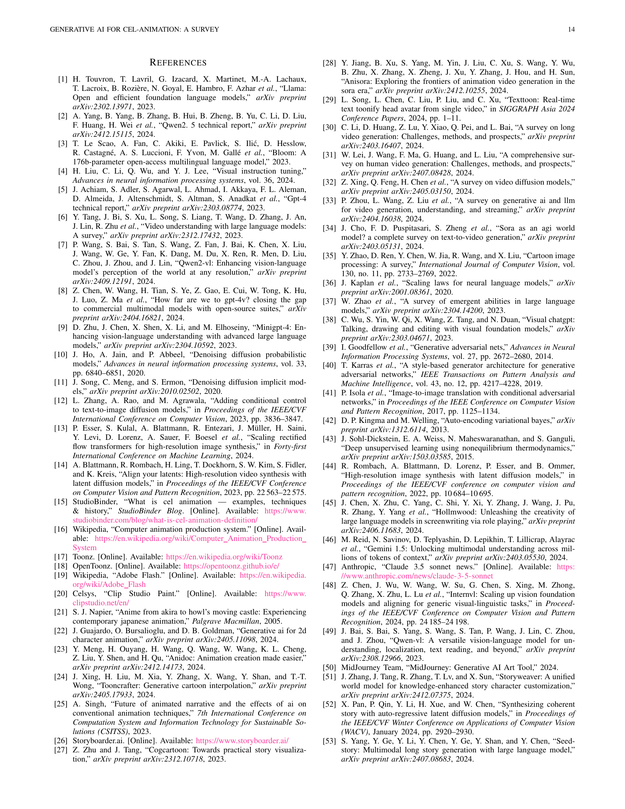

 


 2501.06250 
 Yunlong Tang et el. 
 
 🤗 2025-01-13 
 



↗ arXiv


↗ Hugging Face


### TL;DR



셀 애니메이션 제작은 **시간과 비용이 많이 소요되는 수작업 중심**이었으며, **일관성 유지 및 효율성 확보**에 어려움이 있었습니다.  기존의 디지털 도구는 일부 작업을 자동화했지만, 여전히 많은 수작업이 필요했습니다. 

본 논문에서는 **생성형 AI 기술을 활용하여 셀 애니메이션 제작 전 과정을 혁신**하는 방안을 제시합니다.  **대규모 언어 모델, 다중 모드 모델, 확산 모델** 등 생성형 AI 기술을 통해 스토리보드, 키프레임, 중간 프레임 생성, 채색 등의 작업을 자동화하고, **생산성과 창의성을 높이는 방법**을 제시합니다.  또한, **기존 연구의 한계점을 분석**하고 **향후 연구 방향**을 제시하여 AI 기반 애니메이션 제작 기술의 발전에 기여합니다.



#### Key Takeaways


 생성형 AI는 셀 애니메이션 제작의 시간 및 비용을 절감하고 효율성을 높일 수 있습니다. 



 생성형 AI는 스토리보드 제작, 키프레임 애니메이션, 중간 프레임 생성, 채색 등 다양한 작업에 활용될 수 있습니다. 



 생성형 AI 기술의 발전에도 불구하고, 시각적 일관성 유지, 스타일 일관성 유지, 윤리적 문제 해결 등 과제가 남아 있습니다. 


#### Why does it matter?
본 논문은 **세계 최초로 생성형 AI를 셀 애니메이션 제작 전 과정에 적용한 연구를 종합적으로 분석**하여,  **기존의 어려움을 해결하고 효율성과 창의성을 높이는 방안**을 제시합니다.  **AI 기반 애니메이션 제작의 현재와 미래 방향을 제시**하여, 관련 분야 연구자들에게 중요한 지침을 제공합니다. 또한, **새로운 데이터셋 구축, 다중 에이전트 시스템 개발 등 향후 연구 방향**을 제시하여,  **차세대 애니메이션 제작 기술 발전에 크게 기여**할 것으로 예상됩니다.

------
#### Visual Insights

> 🔼 그림 1은 셀 애니메이션 역사의 세 가지 주요 단계를 보여줍니다. 수작업 셀 시대(1920년대~2010년대), 컴퓨터 지원 셀 시대(1980년대~현재), 그리고 등장하는 AIGC 셀 시대(2020년대 이후)입니다. 셀 애니메이션의 계층적 구조도 함께 표시되어 있습니다. 그림에 나오는 작품의 이름은 부록 A에서 확인할 수 있습니다.
> 

> 
read the caption

> Figure 1: The three major phases in Cel-Animation history: the Handcrafted Cel Age (1920s–2010s), the Computer-Assisted Cel Age (1980s–present), and the emerging AIGC Cel Era (2020s onward). A layered structure of Cel-Animation is also shown. The names of the works featured in the teaser can be found in Appendix A.
> 


| Dataset | Format | Task in Cel | #Clips | #Samples |
|---|---|---|---|---|
| Sakuga-42M [151] | Video | Comprehension, Generation | 1.2M | 42M |
| AniSora [28] | Video | Comprehension, Generation | 10M |  |
| Anim-400K [125] | Video | Dubbing |  | 400K |
| V2C-Animation [129] | Video | Dubbing | 10,217 |  |
| iHarmony4 [100] | Image | Compositing, Photography (Harmonization) |  | 73,146 |
| SSHarmonization [103] | Image | Compositing, Photography (Harmonization) |  | 216 |
| HVIDIT [152] | Image | Compositing, Photography (Harmonization) |  | 3,336 |
| Alchemist [108] | Image | Compositing, Photography (T2I Generation) |  |  |
| AnimeRun [153] | Video | Inbetweening, Colorization | 30 | 2,891 |
| ATD-12K [78] | Image | Inbetweening |  | 12,000 triplets |
| Mixamo-Line240 [85] | Image | Inbetweening |  | 49,262 |
| AnT [97] | Image | Colorization |  | 11,000 |
| PaintBucket-Character [98] | Image | Colorization |  | 14,545 |
| MangaZero [68] | Image | Layout |  | 470K |
| Manga109Story [69] | Image | Layout |  | 21K |
| Ads-1k [111] | Video | Cutting | 1K |  |
| ANITA DATASET [154] | Image | Genga, Nigen, Colorization |  | 16,000 |

> 🔼 본 논문의 표는 셀 애니메이션 및 관련 작업을 위한 데이터셋에 대한 종합적인 개요를 제공합니다. 셀 애니메이션 작업(예: Sakuga-42M, AniSora, AnimeRun, ATD-12K, Mixamo-Line240, AnT 및 PaintBucket-Character)을 위해 특별히 설계된 데이터셋을 자세히 요약하고 있으며, 애니메이션 이해, 생성, 중간 프레임 생성 및 색상 지정과 같은 목표에 중점을 둡니다. 또한 셀 애니메이션을 위해 특별히 만들어지지는 않았지만, 더빙, 조화, 레이아웃 및 장면 자르기와 같은 관련 작업에 매우 중요한 데이터셋(Anim-400K, V2C-애니메이션, iHarmony4, SSHarmonization, HVIDIT, Alchemist, MangaZero 및 Ads-1k 포함)을 강조합니다. 클립 및 샘플 수와 같은 주요 지표가 포함되어 애니메이션 연구 및 개발에서 이러한 리소스의 범위, 규모 및 적용 가능성을 강조합니다.
> 

> 
read the caption

> TABLE I: Comprehensive Overview of Datasets for Cel-Animation and Related Tasks: This table provides a detailed summary of datasets explicitly designed for cel-animation tasks—such as Sakuga-42M, AniSora, AnimeRun, ATD-12K, Mixamo-Line240, AnT, and PaintBucket-Character—focusing on objectives like animation comprehension, generation, inbetweening, and colorization. It also highlights datasets not specifically created for cel-animation but highly relevant to adjacent tasks, including Anim-400K, V2C-Animation, iHarmony4, SSHarmonization, HVIDIT, Alchemist, MangaZero, and Ads-1k, which support applications like dubbing, harmonization, layout, and scene cutting. Key metrics, such as the number of clips and samples, are included to emphasize the scope, scale, and applicability of these resources in animation research and development.
> 

### In-depth insights

#### Cel-Animation's AI Revolution
셀 애니메이션 분야는 인공지능(AI)의 발전으로 혁신적인 변화를 맞이하고 있습니다. **AI 기반 도구는 스토리보드 제작, 레이아웃 디자인, 키프레임 애니메이션, 중간 프레임 생성, 색상 지정 등의 작업을 자동화하여** 기존의 수작업 방식의 비효율성을 극복하고 있습니다. 이는 제작 시간 단축과 생산성 향상으로 이어지며, **더 넓은 범위의 크리에이터들이 셀 애니메이션 제작에 참여할 수 있는 기회를 제공**합니다.  특히, **AI는 반복적인 작업을 자동화함으로써 아티스트들이 창의적인 표현과 예술적 혁신에 더욱 집중**할 수 있도록 지원합니다. 하지만, **AI 기술의 발전에도 불구하고 시각적 일관성 유지, 스타일 일관성 확보, 윤리적 문제 해결 등 극복해야 할 과제**들이 남아 있습니다.  향후 AI 기술의 발전 방향은 **시각적 일관성을 유지하면서 다양한 애니메이션 스타일을 지원하고, 아티스트의 창의적 자유도를 보장하며, 윤리적 문제점을 해결**하는 데 집중되어야 할 것입니다.  **AI와 아티스트의 협업을 통해 셀 애니메이션의 새로운 가능성**을 열어갈 수 있을 것입니다.

#### GenAI Workflow Integration
GenAI는 셀 애니메이션 제작 과정에 통합되어 **기존의 수작업 기반 파이프라인을 혁신적으로 변화**시키고 있습니다. **스토리보드 제작, 레이아웃 디자인, 키프레임 애니메이션, 중간 프레임 생성, 채색 등 다양한 단계**에서 GenAI 기반 도구들이 활용되면서 **생산성 향상과 창의적 표현 확장**이라는 두 마리 토끼를 잡을 수 있게 되었습니다. 특히, **반복적인 작업 자동화를 통한 시간 및 비용 절감 효과**는 매우 크며, 아티스트들은 **보다 창의적인 작업에 집중**할 수 있게 되었습니다. 하지만, GenAI 기술은 아직 완벽하지 않으며, **시각적 일관성 유지, 스타일 일관성 확보, 윤리적 문제 해결**과 같은 과제들이 남아 있습니다.  앞으로 **GenAI와 셀 애니메이션 제작 과정의 더욱 긴밀한 통합**을 위해서는 **데이터셋 확장, 고급 GenAI 모델 개발, 다중 프로세스 통합 프레임워크 구축, 다중 에이전트 시스템 구현** 등의 노력이 필요합니다. 이를 통해 **셀 애니메이션의 효율성과 창의성을 극대화**할 수 있을 것입니다.

#### GenAI Tools & Techniques
본 논문에서 제시된 GenAI 도구 및 기법에 대한 심층적인 분석 결과를 요약하면 다음과 같습니다. **LLMs(대규모 언어 모델)**은 스토리텔링, 캐릭터 설정, 시나리오 작성 등 전반적인 사전 제작 단계에 효율성을 더하고 있습니다. 반면, **GANs(적대적 생성 신경망)**과 **확산 모델**은 애니메이션 프레임 생성, 채색, 배경 합성 등 제작 단계에서 혁신을 일으키고 있습니다. 특히, **AniDoc, ToonCrafter, AniSora**와 같은 GenAI 기반 도구는 기존의 복잡한 작업 과정을 자동화하여 제작 시간과 비용을 절감하는 데 크게 기여하고 있습니다. 그러나, **시각적 일관성 유지, 스타일 일치, 윤리적 문제** 등 여전히 해결해야 할 과제들이 존재합니다. **다양한 GenAI 기법들을 효과적으로 통합하고 활용하는 융합적 접근 방식**이 향후 연구의 중요한 방향이 될 것입니다. 이러한 기술들을 발전시켜 나감으로써, 창의성과 생산성을 동시에 향상시키는 새로운 애니메이션 제작 환경을 구축할 수 있을 것입니다.

#### Challenges and Limitations
본 논문에서 논의된 생성 AI 기반 셀 애니메이션의 과제와 한계는 크게 세 가지로 요약할 수 있습니다. 첫째, **기술적 한계**입니다. 현재의 생성 AI 모델들은 스타일 일관성 유지, 세밀한 움직임 표현, 장면 간의 자연스러운 전환 등에서 어려움을 겪고 있습니다. 특히, **복잡한 움직임이나 표현이 필요한 장면**에서는 여전히 수동 작업이 필요하며, 이는 셀 애니메이션 제작의 효율성 향상에 제약으로 작용합니다. 둘째, **창의성 제약**입니다. 생성 AI는 기존 데이터셋을 기반으로 학습되기 때문에 예측 가능한 결과를 생성하는 경향이 있습니다. 따라서, **새로운 스타일이나 독창적인 표현**을 구현하는 데에는 어려움이 있으며, 애니메이션 제작자의 창의성을 제한할 수 있습니다. 셋째, **윤리적 문제**입니다. 생성 AI 모델의 학습 과정에서 저작권 침해나 개인 정보 유출 등의 문제가 발생할 수 있으며, 생성된 콘텐츠의 저작권 문제 또한 해결해야 할 과제입니다.  **데이터셋의 질과 양** 또한 중요한 요소입니다.  더욱 방대한 양의 고품질 데이터셋을 확보하고, 다양한 스타일과 표현을 담아낼 수 있는 모델 개발이 필요합니다. 또한,  **인간과 AI의 협업 방식**을 개선하여 AI의 장점을 최대한 활용하면서도 애니메이션 제작자의 창의성과 통제력을 보장할 수 있는 시스템 구축이 중요합니다.

#### Future Research Directions
본 논문에서 제시된 셀 애니메이션 분야의 미래 연구 방향은 크게 네 가지로 요약할 수 있습니다. 첫째, **대규모 셀 애니메이션 데이터셋 구축**입니다. 기존 데이터셋의 한계를 극복하고 다양한 애니메이션 스타일과 제작 단계를 포함하는 종합적인 데이터셋을 구축하여 모델의 성능 향상을 도모해야 합니다. 둘째, **LLM 기반 콘텐츠 생성 방식 고도화**입니다. 단순한 텍스트 기반 생성을 넘어 시각적 요소와의 통합 및 다중 모드 이해를 통해 셀 애니메이션 특유의 미묘한 표현까지 고려하는 고급 모델 개발이 필요합니다. 셋째, **통합형 다중 처리 생성 프레임워크 구축**입니다. 애니메이션 제작 과정 전반에 걸쳐 일관성 있는 결과물을 생성하기 위해 여러 단계를 통합하는 프레임워크를 개발하여 효율성을 높여야 합니다. 마지막으로 **스크립트-애니메이션 생성을 위한 다중 에이전트 시스템 개발**입니다. 셀 애니메이션 제작 과정의 복잡성을 고려하여 각 단계별 전문 모델을 갖춘 다중 에이전트 시스템을 통해 효과적인 협업과 고품질 애니메이션 제작을 가능하게 해야 합니다.

### More visual insights

More on figures

> 🔼 그림 2는 전통적인 애니메이션 제작 파이프라인의 전체적인 워크플로우 다이어그램입니다. 계획, 사전 제작, 제작, 후반 제작 단계를 보여주며, 스크립팅, 설정, 스토리보딩, 레이아웃, 키프레임 애니메이션, 중간 프레임 생성, 채색, 촬영, 더빙 등의 세부적인 과정을 자세히 설명합니다.
> 

> 
read the caption

> Figure 2: Comprehensive workflow diagram of a traditional animation production pipeline, illustrating the stages of planning, pre-production, production, and post-production, with detailed processes such as scripting, setting, storyboarding, layout, keyframe animation, inbetweening, colorization, photography, dubbing, etc.
> 

> 🔼 그림 3은 아이템, 캐릭터, 장면, 메카의 설정(세테이) 예시를 보여줍니다.  각각 던전에서의 만찬(2024), 걸즈 밴드 크라이(2024), 바이올렛 에버가든(2018), 건담 빌드 다이버즈(2018)에서 가져온 예시입니다.  세테이는 애니메이션 제작에서 배경, 캐릭터 디자인, 소품 등의 시각적 요소에 대한 상세한 지침을 담은 자료로, 애니메이션의 일관된 비주얼 스타일과 세계관 구축에 중요한 역할을 합니다. 그림에서는 각 애니메이션의 독특한 스타일과 분위기를 보여주는 다양한 설정 자료의 예시를 보여줍니다. 이는 캐릭터의 외형, 의상, 소품, 배경 디자인, 연출 방향 등 다양한 측면을 포함합니다. 이러한 세테이 자료는 애니메이터들이 작품의 시각적 일관성을 유지하고, 작품 세계관에 대한 이해도를 높이는 데 도움을 줍니다.
> 

> 
read the caption

> Figure 3: Examples of settings (setteis) of items, characters, scenes, and mecha. The examples are from Delicious in Dungeon (2024), Girls Band Cry (2024), Violet Evergarden (2018), and Gundam Build Divers (2018), respectively.
> 

> 🔼 그림 4는 스토리보드에서 최종 합성 단계까지의 장면 변환 과정을 보여주는 제작 예시입니다. 레이아웃(L/O), 키프레임 애니메이션, 채색, 배경 통합 등 주요 단계를 보여줍니다. 스토리보드는 장면의 흐름과 구성을 간략하게 보여주는 초기 단계의 스케치이며, 레이아웃 단계에서는 카메라 각도, 캐릭터 위치, 배경 요소 등을 보다 자세하게 설정합니다. 키프레임 애니메이션 단계에서는 캐릭터의 주요 움직임을 정의하고, 채색 단계에서는 색상과 그림자 등을 추가하여 시각적 디테일을 더합니다. 마지막으로 배경 통합 단계에서는 완성된 캐릭터 애니메이션에 배경을 추가하여 최종 장면을 완성합니다.
> 

> 
read the caption

> Figure 4: A production example showing the transformation of a scene from storyboard to final compositing, demonstrating key stages including layout (L/O), keyframe animation, coloring, and background integration.
> 

> 🔼  그림 5는 전통적인 애니메이션 제작 과정에서 이웃 프레임을 추가하여 부드러운 움직임과 전환을 만드는 인터폴레이션(inbetweening) 과정을 보여줍니다. 이 예시에서는 키프레임 1과 5를 기반으로 이웃 프레임 3을 먼저 생성하고, 이후 키프레임 1과 이웃 프레임 3을 사용하여 이웃 프레임 2를 생성합니다. 마찬가지로 이웃 프레임 4도 동일한 방식으로 생성할 수 있습니다.  키프레임 사이에 추가적인 프레임을 생성하는 과정을 시각적으로 보여주어, 움직임의 부드러움을 확보하는 데 인터폴레이션이 얼마나 중요한지 보여줍니다.
> 

> 
read the caption

> Figure 5: The conventional process of inbetweening involves adding inbetween frames between every two keyframes to create smoother motion and transitions. In this example, Inbetween(3) is created first based on Keyframe(1) and Keyframe(5). Then, Inbetween(2) can be created based on Keyframe(1) and Inbetween(3). Similarly, Inbetween(4) can be obtained in the same way.
> 

> 🔼 그림 6은 애니메이션 컬러링 작업 지시를 위한 컬러 차트의 예시를 보여줍니다. 2018년 애니메이션 작품인 <바이올렛 에버가든>의 컬러 차트를 사용하여, 캐릭터의 피부색, 의상 색상, 머리카락 색상, 배경 색상 등 다양한 요소에 대한 색상 정보를 상세하게 제공합니다. 그림에서 확인할 수 있듯이, 각 색상은 숫자 코드와 함께 명칭으로 구분되어 있으며, 애니메이션 제작 과정에서의 색상 일관성 유지를 위해 중요한 역할을 합니다.  이는 다양한 색조와 명도의 색상을 일관되게 사용하여 캐릭터와 배경의 시각적 조화를 유지하고, 애니메이션의 전반적인 미적 완성도를 높이는 데 기여합니다.
> 

> 
read the caption

> Figure 6: Color chart for directing the colorization. Example from Violet Evergarden (2018).
> 

> 🔼 그림 7은 셀 애니메이션 제작 과정에 관여하는 작업들을 중심으로 GenAI 기술 분류 체계를 보여줍니다. 주요 단계는 녹색, 주황색, 보라색으로 강조 표시되어 있습니다. 셀 애니메이션 제작 과정에서 여러 작업을 처리할 수 있는 방법들은 빨간색으로 표시되며, 원래 셀 애니메이션 관련 작업을 위해 개발되지 않았지만 셀 애니메이션에 적용될 가능성이 있는 방법들은 파란색으로 표시됩니다. 앞으로 파란색이 아닌 다른 색상의 모델들이 이 그림에 더 많이 나타날 것입니다.
> 

> 
read the caption

> Figure 7: The taxonomy of GenAI for Cel-Animation is primarily organized by the tasks involved in the production workflow. Key steps are highlighted by Green, Orange, and Purple. Methods capable of addressing multiple tasks within the Cel-Animation production process are indicated by Red, while Blue signifies methods that are not originally developed for Cel-related tasks but have the potential to be applied to Cel-Animation. In the future, there will be more and more models with non-blue colored fonts appearing in this figure.
> 

> 🔼 그림 8은 대화형 인공지능(LLM)을 사용한 스토리 생성 과정을 보여줍니다. 사용자는 생성형 AI와 협업하여 스토리 스크립트를 개발합니다. AI 에이전트는 반복적인 피드백, 수정 기반의 개선, 역할극 상호 작용을 통해 플롯 계획, 스토리 확장, 시나리오 작성을 지원합니다. 그림은 논문 [45]에서 각색된 예시입니다.  AI 에이전트는 스토리의 뼈대를 구성하는 플롯 계획부터 스토리의 세부적인 부분까지 확장하고, 최종 시나리오 초안까지 도와줍니다.  사용자의 피드백을 반영하여 반복적인 수정 과정을 거치고,  역할극을 통해 등장인물 간의 대화와 상호 작용을 보다 풍성하게 만들어줍니다.
> 

> 
read the caption

> Figure 8: LLMs for Script Generation: Users collaborate with generative AI to develop story scripts. The AI agent facilitates plot planning, story expansion, and screenplay creation through iterative feedback, revision-based refinement, and role-playing interactions. Example adapted from [45].
> 

> 🔼 그림 9는 Midjourney [50]와 Stable Diffusion [44]을 사용하여 생성된 배경 이미지의 예시를 보여줍니다. 다양한 아이템, 캐릭터, 배경, 메카 등의 디자인이 포함되어 있습니다.  각 이미지는 서로 다른 스타일과 분위기를 가지고 있으며, AI가 다양한 시각적 요소를 생성할 수 있는 능력을 보여줍니다.  이러한 AI 생성 배경 이미지들은 애니메이션 제작 과정에서 배경 설정 단계에 활용될 수 있으며,  전통적인 방식보다 효율적이고 다양한 배경 디자인을 제공할 수 있습니다.
> 

> 
read the caption

> Figure 9: Examples of AI-generated Settings with Midjourney [50] and Stable Diffusion [44], showing various designs including items, characters, scenes, and mecha.
> 

> 🔼 그림 10은 StoryWeaver [51]에서 가져온 예시로, AI가 생성한 스토리보드를 보여줍니다.  핵심은 연속적인 이미지 생성 과정에서 캐릭터의 일관성을 유지하고, 스토리 스크립트와 이미지 의미 사이의 정합성을 유지하는 것입니다.  이 그림은 스토리의 흐름에 따라 여러 장면을 보여주며, 각 장면은 스토리의 특정 부분을 시각적으로 표현합니다.  각 이미지는 스토리 스크립트의 특정 내용과 일치하며, 스토리텔링의 일관성과 시각적 흐름을 보여줍니다.  즉, AI 모델이 스토리의 내용을 정확하게 이해하고 이를 일관된 시각적 언어로 변환하는 능력을 보여주는 것입니다.
> 

> 
read the caption

> Figure 10: AI-generated Storyboard. Identity preservation during sequential generation and alignment between story scripts and image semantics are the two core components of storyboard generation. This figure illustrates an example adapted from StoryWeaver [51].
> 

> 🔼 그림 11은 AI 기반 레이아웃 생성 결과를 보여줍니다. 위쪽 부분은 다양한 방법을 사용하여 스케치와 텍스트 설명으로 레이아웃을 생성한 결과이며, 객체 배치 및 외관을 개선하는 능력을 보여줍니다. 아래쪽 부분은 카메라 모션 제어를 통해 전경과 배경의 동작을 동기화하고, 역동적인 원근감 변화와 프레임 간의 지속적인 장면 조정을 가능하게 하는 방법을 보여줍니다. 이 그림은 논문의 [65]와 [70]에서 발췌되었습니다.
> 

> 
read the caption

> Figure 11: AI-generated Layouts. (Top) Layout generation guided by sketches and textual descriptions using various methods, showcasing their ability to refine object placement and appearance. (Bottom) Camera motion control enables synchronized foreground and background motion, dynamic perspective shifts, and continuous scene adjustments across frames. Adapted from [65] and  [70].
> 

> 🔼 그림 12는 AI 기반 키프레임 애니메이션을 보여줍니다. 소스 이미지와 목표 2D 랜드마크를 조건으로 모델은 목표 자세를 가진 변형된 아바타를 생성할 수 있습니다. 이 그림은 기존의 키프레임 애니메이션 방식과 달리, AI를 활용하여 목표 자세에 맞춰 캐릭터의 자세를 자동으로 변형하는 과정을 보여줍니다. 이를 통해 애니메이터는 수동으로 자세를 조정하는 데 드는 시간과 노력을 줄일 수 있으며, 더욱 자연스럽고 정교한 애니메이션을 제작할 수 있습니다.
> 

> 
read the caption

> Figure 12: Keyframe animation with AI. Conditioned on the source image and the target 2D landmarks, the model is capable of generating the deformed avatar with the target pose. Example adapted from [71].
> 

> 🔼 그림 13은 GenAI 기반의 중간 프레임 생성 및 보간에 대한 설명입니다.  이 그림은 스케치와 색칠된 프레임을 입력으로 받아 중간 프레임을 생성할 수 있는 모델의 기능을 보여줍니다.  [24]번 문헌에서 발췌한 예시를 사용하여, 입력된 스케치와 색상 정보를 바탕으로, 모델이 매끄러운 애니메이션을 위해 필요한 중간 프레임들을 자동으로 생성하는 과정을 시각적으로 보여줍니다.  이는 전통적인 셀 애니메이션 제작 과정에서 수작업으로 진행되던 중간 프레임 작업을 GenAI가 효율적으로 대체할 수 있음을 보여주는 중요한 예시입니다.
> 

> 
read the caption

> Figure 13: GenAI for inbetweening and interpolation. The model can generate inbetweens with sketches and colored frames as input. Example adapted from [24].
> 

> 🔼 그림 14는 AI 기반 색칠(Colorization) 과정을 보여줍니다.  스케치 이미지를 입력받아, 특정 그림 스타일로 변환하는 스타일 변환 모델의 성능을 보여주는 예시입니다.  단순히 색을 입히는 것을 넘어, 원본 스케치의 선과 질감을 유지하면서 원하는 스타일의 그림으로 변환하는 기술을 시각적으로 보여줍니다. 이 예시는 논문의 참고문헌 [86]에서 가져온 것입니다.
> 

> 
read the caption

> Figure 14: Colorization. Stylization models achieve domain transfer from sketch images to target picture styles. This example is adapted from [86].
> 

> 🔼 그림 15는 논문 [99]에서 가져온 예시로, 확산 모델을 사용하여 조명 조화 및 편집 기능을 달성할 수 있는 능력을 보여줍니다.  이는 전경과 배경 요소 간의 조화로운 조명 효과를 생성하고, 조명과 그림자의 미묘한 변화를 보여주는 등 복잡한 합성 작업을 수행하는 능력을 시각적으로 보여줍니다.  단순한 오버레이를 넘어, 사실적인 조명 효과를 통해 시각적 일관성과 몰입도를 높이는 컴퓨터 사진 촬영의 고급 기술을 보여줍니다.
> 

> 
read the caption

> Figure 15: Compositing & Photography: This example adapted from  [99] demonstrate the capability of achieving illumination harmonization and editing with Diffusion Models.
> 

> 🔼 그림 16은 GenAI 기반 더빙 과정을 보여줍니다. 이 과정에서 모델은 목표 아바타의 얼굴 영역을 감지하고 주어진 오디오에 따라 동기화된 얼굴 표정과 입술 움직임으로 교체합니다. 그림은 논문 [124]에서 가져온 예시를 보여줍니다. 모델은 먼저 침묵 비디오, 텍스트/자막 및 참조 오디오를 분석하여 시각적 요소와 일치하는 감정적으로 표현력 있는 음성을 생성합니다. 이 과정은 참조 음성의 음향적 특징, 음소 수준의 발음 습관, 시각적 단서에서 파생된 감정 표현을 결합하여 애니메이션 캐릭터에 대한 자연스러운 동기화된 음성-모션 대응을 가능하게 합니다.
> 

> 
read the caption

> Figure 16: GenAI for Dubbing. During this procedure, models detect the facial regions of the target avatar and replace with synchronized facial expressions and lip movements conditioned on given audio. The figure depicts an example sourced from [124].
> 

### Full paper



