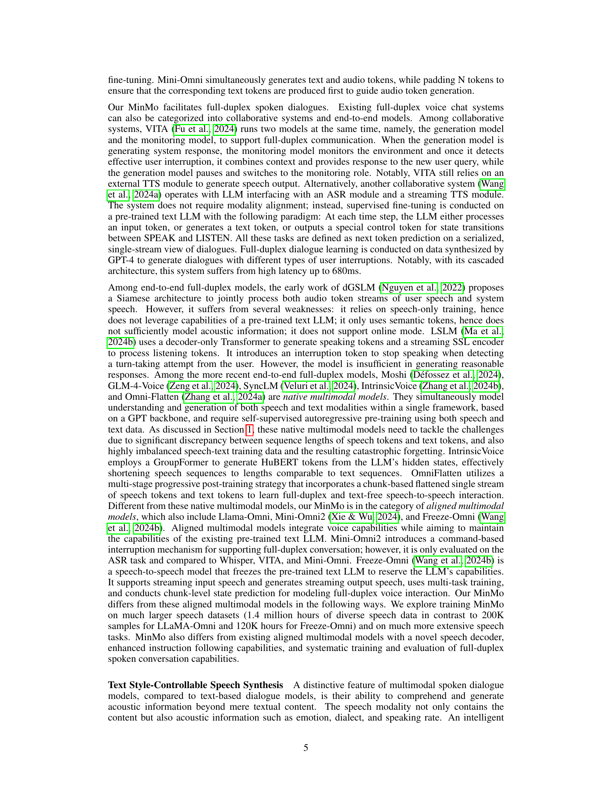

 


 2501.06282 
 Qian Chen et el. 
 
 🤗 2025-01-14 
 



↗ arXiv


↗ Hugging Face


↗ Papers with Code


### TL;DR



최근 대규모 언어 모델(LLM)의 발전은 원활한 음성 상호 작용을 위한 혁신적인 기술을 제공했습니다. 그러나 기존의 음성-텍스트 다중 모달 모델은 음성과 텍스트 시퀀스 길이의 차이, 부족한 음성 사전 훈련, 그리고 텍스트 LLM의 지식에 대한 치명적인 망각이라는 과제에 직면했습니다. 본 논문에서는 이러한 제한을 해결하기 위해 MinMo를 제시합니다. MinMo는 140만 시간 이상의 방대한 음성 데이터를 사용하여 다단계 정렬 방식으로 훈련되었습니다. 

MinMo는 다양한 음성 작업에서 최첨단 성능을 달성할 뿐만 아니라, 텍스트 LLM의 기능을 유지하면서 양방향 동시 통신을 가능하게 합니다. 또한 기존 모델보다 성능이 우수한 새로운 음성 디코더를 제안하고, 사용자의 지시에 따라 감정, 방언, 말하는 속도 등을 제어하고 특정 목소리를 모방할 수 있는 향상된 지시 따르기 기능을 제공합니다.  MinMo의 음성-텍스트 지연 시간은 약 100ms이고, 양방향 지연 시간은 이론적으로 약 600ms, 실제로는 약 800ms입니다.



#### Key Takeaways


 80억 개의 매개변수를 가진 다중 모달 대규모 언어 모델 MinMo를 소개합니다. 



 MinMo는 140만 시간의 다양한 음성 데이터로 훈련되어 실시간 양방향 음성 대화를 가능하게 합니다. 



 MinMo는 다양한 음성 벤치마크에서 최첨단 성능을 달성합니다. 


#### Why does it matter?
본 논문은 **매우 큰 규모의 다양한 음성 데이터셋**을 사용하여 훈련된 **80억 개의 매개변수를 가진 다중 모드 대규모 언어 모델 MinMo**를 제시합니다. 이는 **실시간 양방향 음성 대화**를 가능하게 하며, **다양한 음성 작업에서 최첨단 성능**을 달성합니다. 이는 **음성 상호 작용 시스템의 미래 발전에 중요한 영향**을 미칠 수 있으며, 연구자들에게 새로운 연구 방향을 제시할 것입니다.

------
#### Visual Insights

> 🔼 그림 1은 MinMo (약 80억 개의 파라미터)와 Moshi, Freeze-Omni, GLM-4-Voice, SeamlessM4T Large v2, NExT-GPT, Qwen2-Audio, Whisper-large-v3 등 최첨단 음성-텍스트 다중 모드 모델들의 성능 비교를 보여줍니다.  MinMo는 자동 음성 인식(ASR), 음성-텍스트 변환(S2TT), 구어 질문 응답(SQA, 음성-텍스트 및 음성-음성 포함), 음성 분류(VSC), 음성 감정 인식(SER), 언어 식별(LID), 연령 및 성별 감지 등 다양한 작업에서 우수한 성능을 보여줍니다. 평가 지표는 작업별로 다르며, ASR은 1-WER%(Fleurs 및 Common Voice 결과는 zh, en, ja, ko, yue, de, fr, ru, es, it 10개 언어에 대한 평균), S2TT는 BLEU(CoVoST2 결과는 en2zh, en2ja, zh/ja/de/fr/ru/es/it2en 변환 방향에 대한 평균), SQA는 정확도, SER은 가중 평균 정확도를 사용합니다. MinMo는 모든 과제에서 기존 최고 성능 모델들을 능가합니다.
> 

> 
read the caption

> Figure 1: Performance comparison between our MinMo(∼similar-to\sim∼8B parameters) and top-tier speech-text multimodal models, including Moshi(7B) (Défossez et al., 2024), Freeze-Omni(7.5B) (Wang et al., 2024b), GLM-4-Voice(9B) (Zeng et al., 2024), SeamlessM4T Large v2(2.3B) (Communication et al., 2023), NExT-GPT(12.42B) (Wu et al., 2024), speech-to-text model Qwen2-Audio(∼similar-to\sim∼8B) (Chu et al., 2024), Whisper-large-v3(1.55B) (Radford et al., 2023), and others. We demonstrate capabilities of MinMo on automatic speech recognition (ASR), speech-to-text translation (S2TT), spoken question answering (SQA) encompasses both speech-to-text (S2T) and speech-to-speech (S2S), vocal sound classification (VSC), speech emotion recognition (SER), language identification (LID), age recognition and gender detection. ASR is evaluated using 1-WER%, with Fleurs & Common Voice results are averaged over 10 languages (zh, en, ja, ko, yue, de, fr, ru, es, it). S2TT is evaluated using BLEU, with CoVoST2 results averaged over en2zh, en2ja, zh/ja/de/fr/ru/es/it2en translation directions. SQA is eavaluated using Accuracy. SER is evaluated using Weighted Accuracy. MinMo surpasses the previous SOTA models on all these tasks.
> 


| Module | Description | Number of Parameters |
|---|---|---|
| Voice Encoder | Initialized with the encoder parameters of the pre-trained SenseVoice-Large audio understanding model (An et al., 2024) | ~636M |
| Input Projector | 2 Transformer layer and 1 CNN layer for dimensional transformation and perform 2x downsampling on the input | ~170M |
| Large Language Model | Initialized with Qwen2.5-7B-instruct (Team, 2024) | 7B |
| Output Projector | Linear layer for dimensional transformation | ~6M |
| Voice Token LM | Initialized with the LLM of the pre-trained CosyVoice2 (Du et al., 2024b) | ~370M |
| Full Duplex Predictor | 1 Transformer layer and 1 linear-softmax output layer, both randomly initialized | ~18M |

> 🔼 표 1은 논문의 그림 3에 묘사된 MinMo 모델의 각 모듈에 대한 설명을 자세히 제공합니다. MinMo 모델은 총 약 80억 개의 파라미터를 가지고 있습니다.  표에는 각 모듈의 이름, 설명, 그리고 파라미터 수가 포함되어 있습니다. 이를 통해 MinMo 모델의 구조와 각 구성 요소의 역할을 이해하는 데 도움이 됩니다. Voice Encoder는 음성 이해를 담당하며, Input Projector는 차원 정합을 위해 사용됩니다. Large Language Model은 사전 훈련된 언어 모델이고, Output Projector와 Voice Token LM은 음성 생성에 관여합니다. 마지막으로 Full Duplex Predictor는 양방향 대화를 제어하는 모듈입니다.
> 

> 
read the caption

> Table 1: Descriptions of the modules in MinMo as depicted in Figure 3. MinMo has approximately 8 billion parameters in total.
> 

### In-depth insights

#### MinMo's Architecture
MinMo의 아키텍처는 **사전 훈련된 거대 언어 모델(LLM)을 기반으로 다양한 모듈의 효율적인 통합**을 보여줍니다. 음성 인코더는 SenseVoice-large를 사용하여 강력한 음성 이해 능력을 제공하고, 입력 프로젝터는 차원 정렬을 수행합니다. **LLM은 주로 텍스트 처리를 담당하며, 출력 프로젝터와 음성 토큰 LM은 텍스트를 음성으로 변환하는 과정**을 담당합니다. 특히, **새로운 음성 디코더는 LLM의 은닉 상태와 음성 토큰을 혼합하여 효율성과 성능을 개선**하였습니다. 전체적인 구조는 **다중 단계 정렬을 통해 음성 이해, 생성 및 양방향 대화 기능을 통합**하는 것이 특징입니다. 또한, **전이 학습 전략을 통해 기존 LLM의 성능을 유지하면서 새로운 음성 기능을 추가**하는 점도 중요합니다. 풀 듀플렉스 예측기는 실시간 양방향 대화를 가능하게 합니다.  **모듈 간 효율적인 정보 흐름과 낮은 지연 시간**을 목표로 설계된 MinMo의 아키텍처는 실제 사용 환경에서의 효과적인 음성 상호작용을 위한 중요한 기반을 제공합니다.

#### Multi-Stage Training
본 논문에서 제시된 다단계 학습 방법은 **음성-텍스트 정렬, 텍스트-음성 정렬, 음성-음성 정렬 및 양방향 상호작용 정렬**의 네 단계로 구성됩니다. 각 단계는 특정 과제에 초점을 맞추어 모델의 성능을 점진적으로 향상시키는 전략을 취합니다.  **초기 단계에서는 음성과 텍스트 간의 일관성을 확보**하는 데 중점을 두고, **후속 단계에서는 음성 생성 및 양방향 대화 능력을 향상**시키는 데 집중합니다. 이러한 다단계 학습은 각 단계의 목표를 명확히 함으로써 모델의 훈련 효율성을 높이고, **텍스트 LLM의 기능을 유지하면서 음성 이해 및 생성 능력을 향상**시키는 데 효과적입니다.  **대량의 다양한 음성 데이터**를 활용한 훈련은 모델의 강건성과 다양한 음성 과제에 대한 적응력을 높였습니다. 특히, **마지막 단계의 양방향 상호작용 정렬**은 실제와 유사한 대화 환경을 구축하여 모델의 자연스러운 대화 능력을 향상시키는 데 중요한 역할을 합니다.  **다만, 각 단계의 세부적인 학습 전략이나 하이퍼파라미터 조정에 대한 정보가 부족하여** 전체적인 학습 과정을 완전히 이해하기에는 다소 제한적입니다.  추가적인 정보가 제공된다면 더욱 심도 있는 분석이 가능할 것입니다.

#### Voice Decoder Design
본 논문에서 제시된 음성 디코더 설계는 **기존의 오토리그레시브(AR) 방식과 비오토리그레시브(NAR) 방식의 단점을 극복**하기 위해 고안되었습니다. 기존 AR 방식은 계산량이 많고 지연 시간이 길다는 단점이 있었으며, NAR 방식은 성능이 떨어지는 문제가 있었습니다. 본 논문의 음성 디코더는 **AR 스트리밍 트랜스포머를 기반**으로 설계되어, **LLM의 출력과 음성 토큰을 혼합하여 사용**함으로써 계산량과 지연 시간을 줄이면서도 높은 음성 생성 성능을 유지합니다. 특히, **텍스트와 음성 토큰을 고정 비율로 혼합하는 기법**을 통해 모델 구조의 복잡성을 줄이고, **단순하면서도 효율적인 구조**를 갖추도록 설계되었습니다.  이러한 설계는 실시간 음성 상호작용에 필요한 낮은 지연 시간을 달성하는 데 중요한 역할을 합니다. 또한, 본 논문에서는 **사용자의 지시에 따라 감정, 방언, 말하는 속도 등을 제어**할 수 있도록 설계되어, **다양하고 풍부한 음성 스타일**을 지원하는 강점을 보여줍니다.

#### Benchmark Results
본 논문의 벤치마크 결과는 제시된 다양한 과제에 걸쳐 **MinMo 모델의 우수성을 입증**합니다. 특히, **다국어 음성 인식 및 번역 과제에서 기존 최고 성능 모델을 능가**하며, **감정 인식, 화자 분석 등 다양한 음성 분석 과제에서도 뛰어난 성능**을 보입니다.  **풀 듀플렉스 대화 시스템 구축을 위한 벤치마크 또한 포함**되어 있으며, **실시간 양방향 대화를 위한 MinMo의 효율성과 실용성을 보여줍니다.** 이는 MinMo의 **다양한 음성 작업에 대한 폭넓은 적용성과 우수한 성능**을 보여주는 중요한 지표입니다.  **대규모 데이터셋을 활용한 MinMo의 훈련 과정이 성능 향상에 크게 기여**했음을 시사하며, **향후 다양한 멀티모달 언어 모델 개발에 중요한 참고자료**가 될 것으로 예상됩니다.  **특히, 낮은 지연시간과 높은 정확도**는 실제 응용 분야에서의 **MinMo의 경쟁력**을 강조합니다.

#### MinMo's Limits
MinMo는 뛰어난 성능을 보이지만, 몇 가지 제한점이 있습니다. **오디오 이해 및 생성 기능은 사전 훈련된 텍스트 LLM에 정렬을 적용하여 구축되었기 때문에, 다양한 지시사항을 따르는 능력이 제한적**입니다. 특히, **긴 꼬리 발음 오류 문제**와 지시에 따른 오디오 생성 효율성 개선이 필요합니다.  **LLM의 일대다 토큰 유지** 및 **특수 기호의 효과적인 음성 변환**이 추가적인 개선 과제입니다. 또한, **듀플렉스 모듈은 의미론에 기반**하지만, 별도의 AEC 및 VAD 모듈이 필요하다는 점에서 완벽한 엔드투엔드 시스템이라고 보기 어렵습니다.  **향후 연구**에서는 다양한 지시사항에 대한 LLM의 능력 향상, 오디오 생성의 효율성 개선, 긴 꼬리 문제 해결, 듀플렉스 모듈의 완전한 통합 등에 초점을 맞춰야 합니다.

### More visual insights

More on figures

> 🔼 그림은 MinMo의 다양한 기능들을 보여주는 예시입니다. 사용자와 MinMo 간의 양방향 음성 대화(speech-to-speech chat), 음성을 텍스트로 변환(speech-to-text translation), 사용자 지정 스타일의 음성 합성(style-controllable speech synthesis), 그리고 동시에 송수신이 가능한 전이중 상호작용(full duplex interaction) 등 MinMo의 주요 기능들을 보여줍니다.  이 그림은 특히 사용자가 MinMo에게 질문을 하고 MinMo가 텍스트와 음성으로 응답하는 모습, 감정이나 말투 등을 조절하여 음성을 생성하는 능력을 잘 보여줍니다.
> 

> 
read the caption

> (a) An example showcases MinMo’s capabilities, including speech-to-speech chat, speech-to-text translation, style-controllable speech synthesis, and full duplex interaction.
> 

> 🔼 그림 (b)는 MinMo의 다양한 기능을 보여주는 예시입니다. 사용자와 시스템 간의 실시간 음성 대화(speech-to-speech chat)는 물론, 오디오 내 이벤트 감지(audio event detection), 화자 분석(speaker analysis), 그리고 음성을 텍스트로 변환(speech-to-text translation) 기능까지 포함하고 있습니다. 이는 사용자가 자연스럽고 원활한 음성 상호작용을 할 수 있도록 MinMo가 다양한 모달리티를 통합하여 처리하는 능력을 보여줍니다.
> 

> 
read the caption

> (b) An example showcases MinMo’s capabilities, including speech-to-speech chat, audio event detection, speaker analysis and speech-to-text translation.
> 

> 🔼 그림 2는 MinMo의 다양한 기능들을 보여주는 두 가지 예시를 보여줍니다. (a)는 사용자와의 자연스러운 대화, 음성을 텍스트로 변환, 사용자의 지시에 따른 스타일 조절이 가능한 음성 합성, 그리고 양방향 완전 이중 통신을 보여줍니다. (b)는 사용자와의 자연스러운 대화, 오디오 이벤트 감지, 화자 분석, 음성을 텍스트로 변환을 보여줍니다. 그림 2에서 보여지는 것 외에도 표 2에 나열된 다양한 작업들을 MinMo가 수행할 수 있습니다.
> 

> 
read the caption

> Figure 2: Examples demonstrating various capabilities of MinMo. More capabilities of MinMo include the tasks shown in Table 2.
> 

> 🔼 그림 3은 MinMo의 전체 아키텍처를 보여줍니다. 이 그림은 음성 인코더, 입력 프로젝터, 대규모 언어 모델, 출력 프로젝터, 음성 토큰 LM, 전이중 예측기, 음성 디코더, 토큰2웨이브 합성기의 8개 모듈로 구성되어 있습니다. 각 모듈의 자세한 설명은 표 1에 나와 있습니다. MinMo는 사전 훈련된 텍스트 LLM을 기반으로 하며, 다단계 정렬 전략을 통해 오디오 이해, 오디오 생성 및 양방향 음성 상호 작용 기능을 획득합니다. 이 그림은 MinMo의 각 모듈 간의 상호 작용과 데이터 흐름을 시각적으로 보여주어 MinMo의 작동 원리를 이해하는 데 도움을 줍니다.
> 

> 
read the caption

> Figure 3: The overall architecture of MinMo. Table 1 provides detailed descriptions of each module in this diagram.
> 

More on tables


| Category | Specific Tasks | Hours |
|---|---|---|
| **Speech-to-Text** | Automatic Speech Recognition (ASR) | 630k |
|  | Speech-to-Text Translation (S2TT) | 451k |
|  | Language Identification (LID) | 34k |
|  | Contextual Bias Speech Recognition | 50k |
|  | Speech Emotion Recognition (SER) | 48k |
|  | Audio Event Detection (AED) | 11k |
|  | Speaker Analysis | 24k |
|  | Spoken Language Smoothing | 0.4k |
|  | Speech-to-Text Chat | 10k |
| **Text-to-Speech** | Speech Synthesis | 170k |
|  | Instruct Speech Synthesis | 1k |
| **Speech-to-Speech** | Speech-to-Speech chat | 10k |
|  | Style-controllable Speech-to-Speech Chat | 0.1k |
| **Speech-to-ControlToken** | Full Duplex Interaction | 4k |
> 🔼 MinMo 모델의 다중 작업 훈련 데이터를 보여주는 표입니다.  표에는 각 작업의 종류(음성 인식, 음성-텍스트 변환, 텍스트-음성 변환, 음성 대화 등)와 각 작업에 사용된 훈련 데이터의 시간(시간)이 나와 있습니다. 표에 제시된 각 작업에 대한 자세한 내용은 본문 4절에서 확인할 수 있습니다.
> 

> 
read the caption

> Table 2: The multitask training data for MinMo. Task specifications can be found in Section 4.
> 


| User | Assistant |
|---|---| 
| **User:** Please speaking very fast: Today is a happy day, full of laughter and joy. | **Assistant:** (Fast speaking rate) Today is a happy day, full of laughter and joy. |
| **User:** Speaking with a tone of sadness: I miss my dear friend who moved away last month. | **Assistant:** (Sad) I miss my dear friend who moved away last month. |
> 🔼 표 3은 사용자의 지시에 따라 제어되는 음성합성 데이터의 예시를 보여줍니다.  본 논문에서는 사용자의 감정, 방언, 말하는 속도, 역할극과 같은 다양한 속성을 지정하는 지시어를 사용하여 음성을 생성하는 방법을 제시합니다.  표는 이러한 지시어에 따른 사용자 입력과 시스템의 음성 응답을 보여주는 예시들을 보여줍니다.  이는 사용자의 지시에 따라 음성 합성의 다양한 측면을 제어할 수 있는 MinMo 모델의 기능을 보여주는 예시입니다.
> 

> 
read the caption

> Table 3: Examples of text-to-speech data controlled by instructions.
> 


| Model | Fleurs(102) |
|---|---| 
| w2v-bert-51 (0.6B) | 71.4 |
| mSLAM-CTC (2B) | 77.7 |
| Zero-shot Whisper | 64.5 |
| MinMo | **85.3** |
> 🔼 본 표는 MinMo 모델의 성능 평가에 사용된 벤치마크들의 요약 정보를 보여줍니다.  자세히 살펴보면, 다국어 음성 인식 및 번역, 음성 분석 및 이해(음성 감정 인식, 화자 분석, 오디오 이벤트 탐지 등), 음성 향상(화자 언어 부드럽게 하기, 구두점 삽입, 역 정규화 등), 음성 생성(텍스트 음성 변환 및 지시어 따른 음성 생성), 그리고 음성 채팅(질문 답변, 대화, 양방향 대화 등)과 관련된 다양한 작업들을 포함합니다. 각 벤치마크에 대한 데이터셋, 평가 지표도 함께 제시되어 있습니다.
> 

> 
read the caption

> Table 4: Summary of evaluation benchmarks for MinMo in this report.
> 


| Test Set | MinMo |  |  | SALMONN |  |  | Qwen-Audio |  |  | EmoBox |  |  |
|---|---|---|---|---|---|---|---|---|---|---|---|---|
|  | UA | WA | F1 | UA | WA | F1 | UA | WA | F1 | UA | WA | F1 |
| CASIA | **98.1** | **98.1** | **98.1** | 35.9 | 35.6 | 33.8 | 40.0 | 38.4 | 36.0 | 59.6 | 59.6 | 56.3 |
| CREMA-D | **94.8** | **94.8** | **94.8** | 49.7 | 50.2 | 43.7 | 82.2 | 83.8 | 83.2 | 76.8 | 76.5 | 76.6 |
| ESD | **99.9** | **99.9** | **99.9** | 33.9 | 34.5 | 31.7 | 47.3 | 47.4 | 43.6 | 84.6 | 84.6 | 84.3 |
| IEMOCAP | **74.9** | **75.7** | **74.2** | 59.0 | 60.6 | 59.0 | 69.6 | 67.6 | 62.9 | 73.5 | 72.9 | 73.1 |
| MELD | **61.0** | **65.1** | **54.0** | 39.2 | 47.2 | 39.6 | 49.9 | 56.8 | 46.8 | 31.5 | 51.9 | 32.9 |
| MSPPodcast | **66.4** | **74.5** | **62.5** | 40.1 | 58.0 | 40.3 | 57.9 | 70.0 | 54.6 | 21.4 | 43.4 | 21.5 |
> 🔼 표 5는 MinMo와 기준 모델의 다국어 음성 인식 결과를 보여줍니다.  만다린어, 영어 및 다국어 공개 테스트 세트에서 단어 오류율(WER)과 문자 오류율(CER)을 기준으로 평가했습니다.  괄호 안의 결과는 논문에서 직접 인용한 것입니다. 각 테스트 세트에 대한 최상의 결과는 굵게 표시되어 있습니다.
> 

> 
read the caption

> Table 5: Multilingual speech recognition results from our MinMo and baseline models in terms of word error rate (WER) and character error rate (CER) on Mandarin, English, and multilingual public test sets. Results in parentheses are directly cited from papers. The best result for each test set is boldfaced.
> 


| Task | MinMo | Qwen-Audio Turbo | Qwen-Audio | Pandagpt | SALMONN | Next-gpt |
|---|---|---|---|---|---|---|
| Language ID | **99.2%** | 95.9% | 92.8% | 34.6% | 28.1% | 23.7% |
| Gender | **86.7%** | 82.5% | 67.2% | 66.5% | 35.5% | 57.0% |
| Age | **70.1%** | 58.8% | 36.0% | 42.5% | 48.7% | 62.4% |
| Emotion | **64.5%** | 60.0% | 43.2% | 26.0% | 29.9% | 25.7% |
| Vocal Sound | **93.0%** | 78.1% | 84.9% | 31.6% | 45.3% | 23.5% |
| Sound Question | 50.3% | 62.8% | **64.6%** | 48.7% | 28.4% | 18.8% |
> 🔼 표 6은 MinMo와 기준 모델이 CoVoST2 및 Fleurs 테스트 세트에서 달성한 다국어 음성 번역 결과를 보여줍니다. BLEU 점수(높을수록 좋음)를 기준으로 평가했으며, † 표시는 번역 프롬프트에서 대상 언어뿐 아니라 원본 언어도 명시한 경우의 결과를 나타냅니다. 원 논문에 보고되지 않은 결과는 본 연구 저자들이 재현한 것입니다.
> 

> 
read the caption

> Table 6: Multilingual speech translation results from MinMo and baseline models on CoVoST2 and Fleurs test sets, in terms of BLEU score (higher is better). Results marked with † are obtained using translation prompts that specify the source language, rather than only indicating the target language. Results not reported in the original papers have been reproduced by the authors of this work.
> 


| Model | AESDD (el) | CAFE (fr) | RESD (ru) | ASED (am) | EmoDB (de) | EMOVO (it) | MESD (es) | Polish (pl) | SUBESCO (bn) | ShEMO (fa) | URDU (ur) | TurEV-DB (tr) |
|---|---|---|---|---|---|---|---|---|---|---|---|---|
| wavlm-large | 78.9, 67.6, 67.6 | 62.2, 61.3, 61.1 | 55.8, 56.4, 55.8 | 96.4, 96.4, 96.4 | 92.5, 92.6, 92.5 | 48.8, 48.8, 44.1 | 62.5, 62.4, 62.3 | 79.2, 79.2, 79.0 | 65.3, 65.3, 65.0 | 71.7, 87.1, 73.5 | 86.6, 86.6, 86.6 | 79.5, 80.0, 79.5 |
| data2vec2.0-large | 72.2, 72.3, 71.8 | 59.0, 58.0, 57.5 | 44.0, 44.6, 44.2 | 94.3, 94.2, 94.2 | 79.3, 80.4, 79.9 | 45.8, 45.8, 43.6 | 48.4, 48.4, 46.8 | 74.0, 74.0, 74.0 | 66.4, 66.4, 66.2 | 64.0, 82.6, 68.4 | 78.1, 78.1, 78.1 | 63.7, 64.1, 63.0 |
| whisper-large-v3 | 79.1, 79.1, 79.1 | 69.4, 68.8, 68.0 | 54.9, 55.5, 54.9 | **96.7**, **96.7**, **96.7** | 91.2, 92.4, 91.8 | 57.8, 57.8, 56.0 | 69.7, 69.6, 69.6 | **83.2**, **83.2**, **82.7** | 73.0, 73.0, 72.9 | **80.2**, **89.5**, **82.9** | 82.5, 82.5, 82.4 | 81.3, 81.5, 81.3 |
| MinMo | **96.1**, **96.5**, **96.2** | **94.9**, **94.8**, **94.9** | **76.7**, **78.6**, **76.3** | 75.3, 75.2, 73.7 | **98.4**, **98.7**, **98.7** | **81.7**, **81.1**, **68.3** | **89.5**, **89.1**, **88.6** | 58.1, 58.1, 55.9 | **80.1**, **80.5**, **72.8** | 70.9, 84.0, 72.7 | 82.1, 82.1, 79.4 | **82.0**, **82.1**, **81.6** |
> 🔼 표 7은 Fleurs 데이터셋(102개 언어 포함)을 사용하여 MinMo 및 기준 모델의 언어 식별 결과를 정확도 측면에서 보여줍니다.  MinMo의 성능과 비교 대상 모델들의 성능을 비교 분석하여 MinMo 모델의 언어 식별 능력을 평가하고, 다양한 언어에 대한 MinMo의 일반화 성능을 확인합니다.
> 

> 
read the caption

> Table 7: Language identification results from MinMo and baseline models on the Fleurs data set (covering 102 languages), in terms of Accuracy.
> 


| Source | Target |
|---|---| 
| **Source** | eh? You have more 1, eh, more one voice, eh, eh, produced in the in the moment. | 
| **Target** | You have more voices producing in the moment. | 
| **Source** | so what, what do they need to do left? | 
| **Target** | What tasks do they need to complete? | 
| **Source** | Well, I think you two, especially you and, and Daniel, you both had, the less creative, roles and the project. That’s true. Of course. | 
| **Target** | I believe that you two, especially you and Daniel, had the less creative roles in the project. |
> 🔼 표 8은 문맥적 편향 음성 인식 성능 평가를 위한 세 가지 테스트 세트의 통계를 보여줍니다. 각 테스트 세트는 다른 특징을 가지고 있으며, 테스트 세트의 크기, 포함된 핫워드의 비율, 기본 음성 인식에서 재현율이 40% 미만인 하드케이스 핫워드의 수를 보여줍니다. 이 정보는 문맥적 편향 음성 인식 모델의 성능을 측정하고 비교하는 데 사용됩니다.
> 

> 
read the caption

> Table 8: Statistics of the test sets for evaluating contextual biasing speech recognition. (hc denotes hard-case hotwords, which are hotwords with recall rates under 40% in basic speech recognition.
> 


| Model | CER ↓ | BLEU ↑ | ROUGE-L ↑ | BLEURT ↑ | S-Faithful ↑ (Human) | S-Faithful ↑ (LLM) | S-Formal ↑ (Human) | S-Formal ↑ (LLM) |
|---|---|---|---|---|---|---|---|---|
| Qwen2.5-7B | 0.75 | 21.06 | **42.01** | **64.61** | **9.04** | **8.06** | **9.80** | **7.63** |
| MinMo | **0.72** | **22.31** | 41.42 | 61.50 | 8.66 | 7.59 | 9.72 | 7.52 |
> 🔼 표 9는 MinMo와 기준 모델의 성능을 세 가지 측면(CER, R, R-hc)에서 비교 분석한 결과를 보여줍니다.  세 가지 지표는 각각 문자 오류율(Character Error Rate), 핫워드 재현율(Recall of hotwords), 어려운 핫워드 재현율(Recall of hard-case hotwords)을 나타냅니다. 핫워드 편향 테스트 세트에서 MinMo의 성능을 정량적으로 평가하여 기준 모델과 비교 분석합니다. 이 표는 MinMo가 핫워드 기반 음성 인식 작업에서 우수한 성능을 보임을 보여줍니다.
> 

> 
read the caption

> Table 9: Performance of contextual biasing speech recognition from MinMo and the baseline model on the hotwords biasing test sets, in terms of character error rate (CER), recall of hotwords (R), and recall of hard-case hotwords (R-hc).
> 


| Model | PUNC |  | ITN |  | 
|---|---|---|---|---| 
|  | Fleurs-zh | Fleurs-en | Fleurs-zh | Fleurs-en | 
| SenseVoice-L | 2.49 | 1.40 | 2.48 | 1.48 | 
| whisper-large-v3 | 1.23 | 2.49 | 1.39 | 2.43 | 
| MinMo | **2.65** | **2.58** | **2.61** | **2.57** | 
> 🔼 표 10은 일반적인 바이어스 테스트 세트에서 MinMo의 문맥 바이어스 음성 인식 성능을 보여줍니다.  세 가지 주요 지표인 문자 오류율(CER), 정밀도(P), 재현율(R)을 사용하여 MinMo 모델의 성능을 평가합니다.  CER은 오류 비율을 나타내며, 낮을수록 좋습니다. 정밀도는 올바르게 예측된 비율을, 재현율은 실제 양성 사례 중 올바르게 예측된 비율을 나타냅니다.  높을수록 좋은 지표입니다. 이 표는 MinMo 모델이 문맥 바이어스 음성 인식 작업에서 얼마나 정확하고 효율적인지를 보여주는 정량적 결과를 제공합니다.
> 

> 
read the caption

> Table 10: Performance of contextual biasing speech recognition from MinMo on the general biasing test sets, in terms of character error rate (CER), precision (P), and recall (R).
> 


| Model | zh CER | zh NMOS | en WER | en NMOS |
|---|---|---|---|---|
| CosyVoice 2.0-SFT | 2.06 | 3.73 | 3.19 | 3.71 |
| MinMo | 2.48 | 3.69 | 2.90 | 3.56 |
> 🔼 표 11은 다양한 평가 벤치마크에서 MinMo와 기준 모델의 음성 감정 인식 성능을 보여줍니다.  성능 지표는 가중치가 없는 평균 정확도(UA), 가중치가 있는 평균 정확도(WA), 그리고 매크로 F1 점수(F1)를 사용합니다. SALMONN과 Qwen-Audio의 결과는 논문 저자들에 의해 재현되었습니다.  이 표는 각 모델이 다양한 데이터셋(CREMA-D, MELD, IEMOCAP, MSP-Podcast, CASIA, MER2023, ESD)에서 얼마나 정확하게 음성 감정을 인식하는지 보여줍니다. 각 데이터셋은 다른 언어와 시나리오 (연기, 드라마, 일상 대화 등)를 포함하고 있습니다.
> 

> 
read the caption

> Table 11: Speech emotion recognition performance from MinMo and the baseline models on various evaluation benchmarks, in terms of unweighted average accuracy (UA), weighted average accuracy (WA), and macro F1 score (F1). Results for SALMONN and Qwen-Audio are reproduced by the authors of this work.
> 


| Model | Emotion | Dialect | Speaking Rate | Role-playing | Default | Total |
|---|---|---|---|---|---|---|
| GLM-4-Voice | 75.6 | 42.9 | 80.0 | 70.4 | 88.2 | 63.1 |
| MinMo | 97.6 | 100 | 100 | 96.3 | 96.3 | 98.4 |
> 🔼 표 12는 AIR-Bench 벤치마크에서 MinMo와 기준 모델들의 성능을 비교한 표입니다. 언어 식별, 성별, 나이, 감정, 음성 사운드 및 사운드 질문 분류 작업을 포함하며, 정확도를 기준으로 평가합니다. Qwen-Audio 및 Qwen-Audio-Turbo (Chu et al., 2023), Pandagpt (Su et al., 2023), SALMONN (Tang et al., 2024) 및 Next-gpt (Wu et al., 2024)의 결과는 공식 AIR-Bench 웹사이트에서 인용했습니다.
> 

> 
read the caption

> Table 12: Performance comparison between MinMo and the baseline models on the AIR-Bench benchmark, including Language ID, Gender, Age, Emotion, Vocal Sound, and Sound Question classification tasks, in terms of Accuracy. Results of Qwen-Audio and Qwen-Audio-Turbo (Chu et al., 2023), Pandagpt (Su et al., 2023), SALMONN (Tang et al., 2024) and Next-gpt (Wu et al., 2024) are cited from the official AIR-Bench website.
> 


| Model | Llama Question |  | TriviaQA* |  | Web Questions |  |
|---|---|---|---|---|---|---|
| Moshi (Défossez et al., 2024) | 62.3 | 21 | 22.8 | 7.3 | 26.6 | 9.2 |
| GLM-4-Voice (Zeng et al., 2024) | 64.7 | 50.7 | 39.1 | 26.5 | 32.2 | 15.9 |
| Freeze-Omni (Wang et al., 2024b) | 72.0 | - | 53.9 | - | 44.7 | - |
| MinMo | **78.9** | **64.1** | 48.3 | 37.5 | **55.0** | **39.9** |
|  | S2T | S2S | S2T | S2S | S2T | S2S |
> 🔼 표 13은 다양한 언어의 EmoBox 데이터셋에서 MinMo와 기준 모델들의 음성 감정 인식(SER) 성능을 보여줍니다.  세 가지 평가 지표인 가중치 없는 평균 정확도(UA), 가중치 있는 평균 정확도(WA), 그리고 매크로 F1 점수(F1)를 사용하여 MinMo의 SER 성능을 다양한 기준 모델들과 비교 분석합니다. 이 표는 MinMo의 다국어 SER 성능과 일반화 능력을 보여주는 중요한 결과를 제시합니다.
> 

> 
read the caption

> Table 13: SER performance of MinMo and the baseline models on the multi-languages datasets from EmoBox, in terms of unweighted average accuracy (UA), weighted average accuracy (WA), and macro F1 score (F1).
> 


|                   | Alpaca Test (Li et al., 2023) | ChitChat Test |
| :----------------- | :------------------------: | :------------: |
| Ground Truth        | 7.73                        | 7.62          |
| ASR + Qwen2.5      | 6.59                        | 7.18          |
| MinMo              | 6.48                        | 7.20          |
> 🔼 본 표는 논문의 SWAB 테스트 세트에서 샘플링한 음성 언어 다듬기 작업에 대한 MinMo의 소스 및 예측 결과를 보여줍니다.  MinMo 모델이 ASR 전사를 얼마나 잘 다듬어서 자연스럽고 형식적인 텍스트로 변환하는지 보여주는 구체적인 예시들을 제공합니다.  각 예시는 원본 ASR 결과(Source)와 MinMo 모델의 예측 결과(Target)를 보여주어 모델의 성능을 직접적으로 비교할 수 있게 합니다.
> 

> 
read the caption

> Table 14: Examples of the source and the prediction of MinMo for the spoken language smoothing task, sampled from the SWAB test set.
> 


| Full-duplex predictor | Speech-to-text | Text-to-speech token | Token2Wav |
|---|---|---|---| 
| (Assistant turn-taking) | (1 or 5 text tokens) | (15 speech tokens) |  |
| 250ms | 95ms or 150ms | 70ms | 130ms |
> 🔼 표 15는 SWAB 테스트 세트에서 MinMo와 Qwen2.5-7B의 어휘 단위 평가 지표(CER, BLEU, ROUGE-L, BLEURT)를 기반으로 한 구어체 언어 다듬기 성능을 보여줍니다.  CER(Character Error Rate)은 문자 오류율, BLEU(Bilingual Evaluation Understudy)는 기계 번역의 정확도를 측정하는 지표, ROUGE-L(Recall-Oriented Understudy for Gisting Evaluation)은 요약의 일치도를 측정하는 지표, BLEURT(Bilingual Evaluation Understudy using Representations from Transformers)는 최신의 문장 생성 평가 지표입니다. 이 표는 MinMo와 Qwen2.5-7B 모델이 얼마나 효과적으로 구어체 텍스트를 깔끔하고 정확한 문장으로 바꾸는지를 목표 지표를 사용하여 정량적으로 비교 분석한 결과를 제시합니다.
> 

> 
read the caption

> Table 15: Spoken language smoothing performance of MinMo and Qwen2.5-7B on the SWAB test set, in terms of objective metrics (CER, BLEU, ROUGE-L, and BLEURT)
> 


| Data | Assistant's Turn-taking (Pos. F1, @K=1/5/10) | User's Turn-taking (Pos. F1, @K=1/5/10) | User's Back-channel (Acc.) |
|---|---|---|---|
| Alimeeting | 0.6138 / 0.7542 / 0.8036 | 0.4751 / 0.9366 / 1 | 0.7124 |
| Fisher | 0.6682 / 0.8372 / 0.8813 | 0.4271 / 0.9455 / 0.9994 | 0.8123 |
| Simulation | 0.7868 / 0.9616 / 0.985 | 0.2571 / 0.8152 / 0.9942 | - |
> 🔼 본 표는 Fleurs 데이터셋의 중국어 및 영어 하위 데이터셋에 대해 MinMo와 기준 모델의 구두점 삽입 및 ITN(Inverse Text Normalization) 성능을 GPT-4 Turbo 순위 점수로 비교 분석한 결과를 보여줍니다.  각 모델의 성능은 GPT-4 Turbo에 의해 주관적으로 평가되었으며,  구두점 사용의 적절성 및 ITN의 정확성을 종합적으로 평가합니다. 1위는 3점, 2위는 2점, 3위는 1점으로 점수가 매겨지고, 최종 점수는 모든 점수의 평균입니다.
> 

> 
read the caption

> Table 16: GPT-4 Turbo ranking scores of punctuation insertion and ITN for MinMo and the baseline models on the Chinese and English subsets of the Fleurs dataset.
> 


| Assistant’s Turn-taking |
|---|---|---|---|---|
| (Pos. F1, @K=1/5/10) | | | | |
> 🔼 표 17은 중국어(zh)와 영어(en) 텍스트 음성 변환 테스트 세트에서 MinMo와 TTS 기준 모델인 CosyVoice 2.0-SFT의 내용 일관성(CER/WER)과 객관적 음성 품질(NMOS)을 비교한 결과를 보여줍니다.  내용 일관성은 자동 음성 인식 오류율(CER)과 단어 오류율(WER)로 측정되었고, 음성 품질은 NMOS 점수로 평가되었습니다. 이 표는 MinMo의 음성 생성 성능과 기준 모델과의 차이를 보여주는 주요 결과를 제시합니다.
> 

> 
read the caption

> Table 17: Performance comparison of content consistency (CER/WER) and objective speech quality (NMOS) between MinMo and the TTS baseline CosyVoice 2.0-SFT on the text-to-speech Chinese (zh) and English (en) test sets.
> 


| User’s Turn-taking |
|---|---|---| 
| (Pos. F1, @K=1/5/10) | | |
> 🔼 표 18은 MinMo와 기준 GLM-4-Voice 모델의 명령어를 따르는 음성 생성 성능을 다중 회전 음성-음성 중국어 테스트 세트에서 비교한 결과를 보여줍니다.  다양한 지시(감정, 방언, 말하기 속도, 역할극 등)에 따른 음성 생성 정확도를 평가하여 MinMo의 우수성을 보여줍니다.
> 

> 
read the caption

> Table 18: Performance comparison of instruction-following voice generation between MinMo and the baseline GLM-4-Voice on the multi-turn speech-to-speech Chinese test set.
> 


| User’s Back-channel |
|---|---| 
|(Acc. )|
> 🔼 표 19는 음성 질문 답변 성능 비교 결과를 보여줍니다. Moshi, GLM-4-Voice, Freeze-Omni 모델의 결과는 해당 논문에서 가져왔습니다. S2T는 음성-텍스트 평가를, S2S는 음성-음성 평가를 나타냅니다. 평가 지표는 정확도입니다. TriviaQA* 데이터셋은 공개 테스트 세트를 제공하지 않으므로, 수치 결과는 직접 비교할 수 없으며 참고용으로만 간주해야 합니다.
> 

> 
read the caption

> Table 19: Comparison of Spoken Question Answering Performance: Results for Moshi, GLM-4-Voice, and Freeze-Omni are sourced from their respective papers. S2T refers to the Speech-to-Text evaluation, while S2S denotes the Speech-to-Speech evaluation. The metric used for these assessments is accuracy. The TriviaQA∗ dataset does not provide a public test set, so the numerical results are not directly comparable and should be considered for reference only.
> 


| Data | Average Latency (ms.) |  | 
|---|---|---| 
|  | Assistant’s Turn-taking | User’s Turn-taking | 
| Alimeeting | 448.8 | 663.4 | 
| Fisher | 189.1 | 641.8 | 
| Simulation | 88.8 | 673.7 | 
> 🔼 표 20은 MinMo 모델의 대화 능력을 평가하기 위해 사용된 두 가지 사내 다회차 음성-음성 대화 테스트 세트(알파카 테스트 세트와 ChitChat 테스트 세트)의 결과를 보여줍니다. 알파카 테스트 세트는 논리적 추론 능력 평가에 중점을 두고, ChitChat 테스트 세트는 일상적인 대화 상황 평가에 초점을 맞춥니다. 점수는 Qwen-Max 모델을 사용하여 자동으로 매겼습니다.
> 

> 
read the caption

> Table 20: Performance of MinMo in two in-house multi-turn speech-to-speech test sets: the Alpaca test set and the ChitChat test set. The Alpaca test set focuses on assessing logical reasoning capabilities, while the ChitChat test set is designed to evaluate casual conversational scenarios. For scoring, we utilized the Qwen-Max model.
> 

### Full paper



