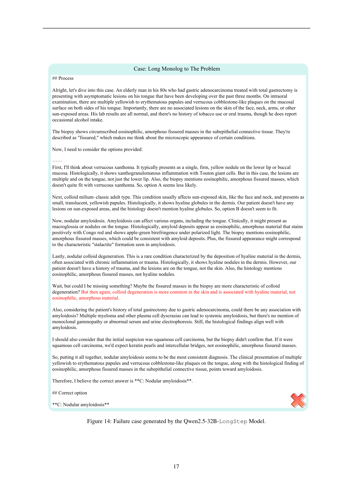

 


 2501.06458 
 Zhongzhen Huang et el. 
 
 🤗 2025-01-14 
 



↗ arXiv


↗ Hugging Face


↗ Papers with Code


### TL;DR



본 연구는 의료 분야에서 대규모 언어 모델(LLM)의 추론 시간을 늘리는 것이 성능 향상에 도움이 된다는 것을 밝히고 있습니다. 기존 연구에서는 모델의 파라미터 수나 훈련 데이터의 양을 늘리는 방법이 주로 사용되었지만, 이 연구는 **추론 시간 자체를 늘림으로써** 성능 향상을 도모하고 있습니다. 이는 특히 복잡한 의료 문제 해결에 효과적이며, 저니 러닝이라는 새로운 학습 방식과의 시너지 효과도 확인되었습니다.

연구진은 MedQA, Medbullets, JAMA Clinical Challenges 등 다양한 의료 데이터셋을 사용하여 실험을 진행하였습니다. 그 결과, **모델의 추론 시간을 적절히 늘림으로써** 6~11%의 성능 향상을 달성하였습니다. 또한, **과제의 복잡성이 증가할수록** 더 긴 추론 과정이 필요하다는 것을 확인하였고, **추론 시간 확장과 저니 러닝**의 결합을 통해 의료 분야에서 LLM의 활용 가능성을 높일 수 있음을 보여주었습니다.



#### Key Takeaways


 의료 추론 과제의 복잡성에 따라 추론 체인의 길이가 달라져야 함 



 추론 시간 확장은 의료 데이터에 대한 대규모 언어 모델의 성능 향상에 효과적임 



 추론 시간 확장과 저니 러닝의 시너지 효과가 있음 


#### Why does it matter?
본 논문은 **의료 분야에서의 추론 시간 확장의 효과**를 보여주는 실험 결과를 제시하여, 의료 응용을 위한 대규모 언어 모델의 발전에 중요한 의미를 지닙니다. 특히, **의료 문제 해결을 위한 새로운 접근법**을 제시하고, **추후 연구를 위한 방향**을 제시하여 의료 인공지능 분야 연구에 큰 영향을 미칠 것으로 예상됩니다.

------
#### Visual Insights

> 🔼 그림 1은 의료 분야에서 O1 복제 과정을 보여줍니다. 이 과정은 깊이 있는 과학적 사고가 가능한 시스템을 개발하여 궁극적으로 AI 기반 의료 혁신을 가능하게 하는 것을 목표로 합니다. 그림에는 복잡한 임상 문제에 대한 추론 시간 확장의 효과를 보여주는 그래프가 포함되어 있으며, 추론 시간을 늘리면 정확도가 향상되는 것을 보여줍니다. 이는 의료 분야에서 대규모 언어 모델(LLM)의 추론 성능을 향상시키기 위한 연구의 일환입니다.  그림은 의료 AI 발전에 대한 연구 여정의 상징적인 이미지를 시각적으로 표현하여 독자들이 쉽게 이해할 수 있도록 합니다.
> 

> 
read the caption

> Figure 1: Illustration of our O1 replication journey in the medical field.  which aims to develop systems capable of deep scientific thinking, ultimately enabling AI-driven breakthroughs in medical domains.
> 


| Model Name | Param. Size | Mean Acc. | JAMA (646) Acc. | JAMA (646) #Avg. Token | Medbullets (308) Acc. | Medbullets (308) #Avg. Token | MedQA (1273) Acc. | MedQA (1273) #Avg. Token |
|---|---|---|---|---|---|---|---|---|
| **Proprietary** |  |  |  |  |  |  |  |  |
| GPT-4o | - | 80.01 | 63.77 | - | 77.92 | - | 88.76 | - |
| GPT-4o-Vanilla CoT | - | 81.83 | 63.77 | 335 | 81.68 | 323 | 91.04 | 300 |
| o1-mini | - | 77.45 | 50.00 | - | 80.51 | - | 90.65 | - |
| o1-preview | - | 87.95 | 73.21 | - | 89.28 | - | 95.12 | - |
| **Open Source Models** |  |  |  |  |  |  |  |  |
| Qwen2.5 | 7B | 51.23 | 42.41 | - | 46.75 | - | 56.79 | - |
| Qwen2.5-Vanilla CoT | 7B | 49.61 | 40.40 | 371 | 46.42 | 353 | 55.06 | 344 |
| InternLM2.5 | 7B | 45.84 | 39.78 | - | 43.18 | - | 49.56 | - |
| InternLM2.5-Vanilla CoT | 7B | 42.47 | 34.05 | 303 | 38.63 | 273 | 48.15 | 291 |
| LLama3.1 | 8B | 55.71 | 46.67 | - | 49.43 | - | 61.82 | - |
| InternLM2.5 | 20B | 51.90 | 43.34 | - | 49.02 | - | 56.95 | - |
| InternLM2.5-Vanilla CoT | 20B | 51.18 | 42.41 | 312 | 46.01 | 330 | 56.87 | 323 |
| Qwen2.5 | 32B | 64.20 | 49.84 | - | 59.74 | - | 72.58 | - |
| Qwen2.5-Vanilla CoT | 32B | 65.86 | 50.92 | 351 | 61.68 | 332 | 74.46 | 329 |
| LLama3.1 | 70B | 71.39 | 59.59 | - | 67.85 | - | 78.24 | - |
| LLama3.1-Vanilla CoT | 70B | 73.59 | 57.27 | 529 | 66.55 | 496 | 83.11 | 477 |
| Qwen2.5 | 72B | 65.82 | 50.15 | - | 63.63 | - | 74.31 | - |
| Qwen2.5-Vanilla CoT | 72B | 69.10 | 50.15 | 435 | 65.58 | 387 | 79.57 | 375 |
| **Supervised Fine-tuning with Vanilla CoT** |  |  |  |  |  |  |  |  |
| Qwen2.5-CoT SFT | 32B | 67.13 | 52.16 | 383 | 61.03 | 340 | 76.19 | 323 |
| LLama3.1-CoT SFT | 70B | 74.48 | 56.03 | 386 | 72.07 | 342 | 84.44 | 333 |
| Qwen2.5-CoT SFT | 72B | 70.94 | 53.09 | 402 | 67.20 | 355 | 80.91 | 346 |
| **Ours (Journey Learning)** |  |  |  |  |  |  |  |  |
| Qwen2.5-LongStep | 32B | 70.08 | 56.34 | 759 | 66.23 | 645 | 78.00 | 615 |
| Qwen2.5-LongMonolog | 32B | 70.23 | 53.71 | 1098 | 68.50 | 1023 | 79.02 | 997 |
| LLama3.1-LongStep | 70B | 76.59 | 60.21 | 819 | 74.67 | 721 | 85.38 | 669 |
| LLama3.1-LongMonolog | 70B | 77.36 | 59.44 | 1153 | 77.27 | 1029 | 86.48 | 953 |
| Qwen2.5-LongStep | 72B | 75.51 | 58.66 | 762 | 72.07 | 692 | 84.91 | 631 |
| Qwen2.5-LongMonolog | 72B | 77.18 | 59.28 | 1076 | 76.29 | 917 | 86.48 | 873 |

> 🔼 본 표는 세 가지 의료 벤치마크(JAMA, Medbullets, MedQA)에 걸쳐 독점, 오픈소스 및 지도 학습 방식으로 미세 조정된 모델들의 성능을 비교 분석한 결과를 보여줍니다.  평가 지표는 정확도(Acc.)와 평균 출력 토큰 길이(Avg. Token)이며, 평균 정확도(Mean Acc.)는 세 데이터셋에 대한 가중 평균을 나타냅니다.  독점 API를 제외한 최고 점수는 굵게 표시하고, 두 번째로 높은 점수는 밑줄을 그었습니다.  다양한 모델 아키텍처와 학습 전략에 따른 성능 차이를 비교하여, 의료 분야에서의 대규모 언어 모델 성능 향상을 위한 효과적인 방법을 제시합니다.
> 

> 
read the caption

> Table 1: Performance comparison of proprietary, open-source, and supervised fine-tuned models across three medical benchmarks. The metrics include accuracy (Acc.) and average output token length (Avg. Token). Mean Acc. represents the weighted average across the three datasets. The best score excluding closed-source APIs was bolded, and the second-best score was underlined.
> 

### In-depth insights

#### Inference-Time Scaling
본 논문은 의료 추론을 위한 대규모 언어 모델(LLM)에서 추론 시간 확장의 잠재력을 탐구합니다. **추론 시간 확장은 모델이 복잡한 의료 문제를 해결하기 위해 더 많은 시간을 사용할 수 있도록 함으로써 성능을 향상시키는 기법**입니다. 이를 통해 모델은 진단 및 치료 계획에서 더욱 정교하고 심층적인 추론을 수행할 수 있습니다. 실험 결과, 추론 시간 증가는 다양한 의료 벤치마크에서 상당한 성능 향상으로 이어짐을 보여줍니다. 특히, **과제의 복잡성이 높을수록 더 긴 추론 체인이 필요하며, 이는 추론 시간 확장의 중요성을 강조**합니다. 또한, 본 논문은 추론 시간 확장과 학습 여정(journey learning) 간의 시너지 효과를 보여주는 데 초점을 맞추고 있습니다.  **추론 시간 확장은 의료 분야에서 LLM의 실제 임상 추론 능력을 향상시키는 유망한 방법**임을 제시합니다.

#### Medical Reasoning LLMs
의료 추론에 특화된 대규모 언어 모델(LLM)은 **의료 데이터의 방대한 양과 복잡성**을 고려할 때 상당한 잠재력을 가지고 있습니다.  이러한 모델은 진단, 치료 계획 수립, 환자 관리 등 다양한 의료 분야에서 활용될 수 있으며, **의사의 의사결정 과정을 지원**하고 효율성을 높이는 데 기여할 수 있습니다.  **정확성과 신뢰성**을 확보하기 위한 지속적인 연구가 필요하며, **데이터 편향, 개인정보 보호, 윤리적 문제** 등 해결해야 할 과제도 존재합니다.  특히, 의료 분야의 특수성을 반영한 **데이터 전처리 및 모델 학습 전략**의 개발이 중요합니다.  의료 LLM은 **의학 지식의 빠른 접근 및 활용**을 가능하게 하여 의료 서비스 접근성을 개선하는 데 기여할 수 있으나, **인간 전문가의 역할을 대체하기보다는 보완**하는 것을 목표로 해야 합니다.  궁극적으로, 환자 안전 및 의료 질 향상에 기여하는 **안전하고 효과적인 의료 LLM 개발**이 중요한 목표입니다.

#### Journey Learning
본 논문에서 제시된 '저니 러닝(Journey Learning)' 개념은 **대규모 언어 모델(LLM)**이 복잡한 문제 해결 과정에서 **단계별 추론(step-by-step reasoning)**을 통해 학습하고 발전하는 방식을 의미합니다. 이는 단순히 정답을 맞추는 것을 넘어, **문제 해결 과정 자체에 대한 이해와 통찰력**을 LLM에 부여하는 데 중점을 둡니다.  **의료 분야**에서 이러한 저니 러닝은 복잡한 진단 및 치료 계획 수립 과정을 단계적으로 모델링함으로써 **정확성과 신뢰성을 높이는 데 기여**합니다.  특히, **중간 과정의 상세한 설명을 생성**하는 능력은 의사의 의사결정 과정을 투명하게 만들어주고,  모델의 **오류 원인을 분석**하고 개선하는 데 도움을 줄 수 있습니다.  하지만, 저니 러닝을 성공적으로 구현하기 위해서는 **충분한 양질의 데이터**와 **모델의 충분한 용량**이 필요하며,  **단순한 다수결 투표(majority voting)** 보다는 **더욱 정교한 추론 과정**이 요구될 수 있습니다.  **의료 데이터의 특수성**을 고려한 데이터 생성 및 모델 학습 방식 또한 중요한 고려 사항입니다.

#### Benchmark Datasets
본 논문에서 다루는 의료 분야의 벤치마크 데이터셋은 **의료적 추론 능력**을 평가하는 데 초점을 맞춥니다.  다양한 복잡도를 가진 데이터셋을 사용하여 모델 성능을 포괄적으로 평가하고, **과제의 복잡성과 모델 성능 간의 상관관계**를 분석합니다.  **의료 질문응답(MedQA), 의학 시험(Medbullets), JAMA 임상 과제(JAMA)** 등 다양한 데이터셋이 사용되었는데, 각 데이터셋은 질병 진단, 치료 계획 수립 등 다양한 의료적 추론 과제를 포함하며, **데이터의 질과 양** 측면에서 차이가 존재합니다.  따라서, 각 데이터셋의 특징을 고려하여 모델 성능을 분석하고, 벤치마크 결과의 **일반화 가능성**과 **한계점**을 논의하는 것이 중요합니다.  **다양한 의료 데이터셋을 통합적으로 활용**함으로써, 의료 AI 모델의 실제 임상 적용 가능성을 보다 정확하게 평가할 수 있을 것입니다.  이는 의료 AI 기술 개발의 **신뢰성과 실용성**을 높이는 데 기여할 것으로 예상됩니다.

#### Future Directions
본 논문은 의료 분야에서의 추론 시간 확장의 유용성을 보여주는 초기 연구이며, **의료 추론 과제의 복잡성을 다루는 데 있어 추론 시간 확장의 효과**를 강조합니다.  하지만,  **모델의 크기와 복잡도에 따른 성능 차이**,  **과제의 난이도에 따른 추론 시간의 상관관계**, 그리고 **다양한 데이터 증강 기법의 성능 비교** 등에 대한 심층적인 분석이 부족합니다.  향후 연구는 **더욱 다양하고 대규모의 의료 데이터셋**을 활용하고, **다양한 크기와 구조의 언어 모델**을 비교 분석하여 일반화 가능성을 높여야 합니다. 특히,  **추론 과정의 해석 가능성을 높이기 위한 기술 개발**과  **의료 전문가의 검증 과정을 통합**하는 것이 중요하며, 이를 통해 의료 현장에서 실제로 활용 가능한 시스템을 개발하는 데 기여할 수 있을 것입니다.  **추론 시간 확장 기법의 효율성을 극대화하기 위한 최적화 전략**에 대한 연구도 필요합니다.  궁극적으로는, **인간 전문가의 의사 결정 과정을 더욱 잘 모방**하고 **신뢰성 있는 의료 추론 결과**를 제공하는 모델 개발을 목표로 해야 할 것입니다.

### More visual insights

More on figures

> 🔼 그림 2는 세 가지 다른 언어 모델(Qwen2.5-72B-Instruct, LLama3.1-70B, Qwen2.5-32B)을 사용하여 세 가지 의료 데이터셋에서 다양한 전략(Vanilla, Vanilla CoT, CoT SFT, LongStep, LongMonolog)을 적용했을 때의 가중 평균 정확도를 보여줍니다. 각 전략은 추론 시간을 확장하여 모델의 성능에 미치는 영향을 평가하기 위해 사용되었습니다.  Vanilla는 기본 모델의 성능을, Vanilla CoT는 사고 과정(Chain-of-Thought) 프롬프트를 사용한 성능을, CoT SFT는 사고 과정을 이용한 지도 학습 미세 조정의 성능을, LongStep과 LongMonolog는 저자들이 제시하는 Journey Learning 데이터셋을 사용한 미세 조정의 성능을 각각 나타냅니다. 이 그림을 통해 추론 시간을 늘리는 것이 모델의 정확도 향상에 어떤 영향을 미치는지, 그리고 각 전략의 효과를 비교 분석할 수 있습니다.
> 

> 
read the caption

> Figure 2: Weighted mean accuracy of Qwen2.5-72B-Instruct, LLama3.1-70B, and Qwen2.5-32B across three datasets using distinct strategies.
> 

> 🔼 그림 3은 추론 시간 조정을 사용하여 MedQA 데이터셋에서 Qwen2.5-72B 계열 모델의 정확도를 보여줍니다. 다양한 추론 전략(Vanilla, Vanilla CoT, LongStep, LongMonolog)과 다수결 투표(Majority Voting)를 사용한 결과를 보여주는 여러 선 그래프가 있습니다. x축은 문제당 평균 출력 토큰 수(즉, 추론 시간의 대리 지표)이고, y축은 정확도입니다. 이 그래프는 추론 시간 증가가 모델 정확도에 미치는 영향을 시각적으로 보여줍니다. 특히, LongStep과 LongMonolog 전략은 Vanilla 또는 Vanilla CoT 전략보다 높은 정확도를 달성했으며, Majority Voting을 추가하면 추가적인 정확도 향상을 보여줍니다.
> 

> 
read the caption

> Figure 3: The Accuracy of Qwen2.5-72B-Series on MedQA with inference-time scaling.
> 

> 🔼 그림 4는 문제를 단계별로 해결하도록 프롬프팅하는 것이 오픈소스 모델의 성능에 미치는 영향을 보여줍니다.  양의 축은 문제를 작은 단계로 나누는 것이 모델 성능을 향상시킬 수 있음을 나타내고, 음의 축은 그렇게 하면 수익이 감소할 수 있음을 시사합니다. 각 원은 크기가 모델의 매개변수 크기에 해당하는 서로 다른 모델을 나타냅니다.  즉, 큰 모델일수록 단계적 접근 방식의 이점이 클 수 있음을 보여줍니다. 반면 작은 모델은 단계적 접근이 오히려 역효과를 낼 수 있습니다.
> 

> 
read the caption

> Figure 4: The benefits of prompting open-source models to solve problems step by step are illustrated. The positive axis indicates that breaking down the problem into smaller steps can enhance model performance, while the negative axis suggests that doing so may lead to diminished returns. Each bubble represents a different model, with bubble size corresponding to the model’s parameter size.
> 

> 🔼 그림 5는 세 가지 다른 전략(왼쪽부터 Vanilla CoT, LongStep, LongMonolog)을 사용하여 세 가지 데이터 세트(JAMA, Medbullets, MedQA)에서 Qwen2.5-72B의 정확도와 평균 출력 토큰 길이를 비교한 것입니다.  각 데이터 세트의 난이도가 다르며(JAMA가 가장 어렵고 MedQA가 가장 쉽다고 가정), 각 전략은 추론 과정에 대한 접근 방식이 다릅니다. Vanilla CoT는 기본적인 사고 과정을 따르는 반면, LongStep과 LongMonolog는 더욱 상세하고 긴 추론 과정을 거칩니다.  이 그림은 각 전략의 성능과 추론 길이 사이의 관계를 보여주어,  더 어려운 작업에는 더 긴 추론이 필요하다는 것을 시사합니다.  또한, LongStep과 LongMonolog 전략이 Vanilla CoT보다 더 높은 정확도를 달성하는 경향이 있으며,  이러한 개선은 데이터 세트의 난이도에 따라 다르게 나타납니다.
> 

> 
read the caption

> Figure 5: Comparison of accuracy and average length of output tokens of Qwen2.5-72B across three datasets using distinct strategies(from left to right: Vanilla CoT, LongStep and LongMonolog)
> 

> 🔼 그림 6은 JAMA Clinical Challenges에서 발췌한 감별 진단 문제를 보여줍니다. 그림에는 72세 남성 환자의 병력, 신체 검사 결과, 검사 결과, 영상 검사 결과가 포함되어 있으며, 이를 바탕으로 의사가 질병을 진단해야 합니다. 환자는 다계통성 질환을 앓고 있으며, 여러 가지 증상을 보입니다.  의사는 제공된 정보를 바탕으로 환자의 상태를 정확하게 진단해야 하며, 이는 의료 인공지능 모델의 복잡한 추론 능력을 평가하는 데 유용한 자료입니다.
> 

> 
read the caption

> Figure 6: Problem of Differential Diagnosis from JAMA Clinical Challenges
> 

> 🔼 그림 7은 Qwen-2.5-72B 모델이 감별 진단 문제에 대해 자유 형식으로 답변한 잘못된 결과를 보여줍니다.  이 그림은 모델이 환자의 병력, 증상, 검사 결과 및 영상 촬영 결과를 분석하고, 감별 진단 목록을 제시하는 과정을 보여줍니다. 그러나 모델의 최종 진단은 실제 진단과 일치하지 않습니다.  이것은 모델의 의학적 지식이나 추론 능력에 한계가 있음을 시사합니다. 자세히는, 모델이 증상들을 잘못 해석하거나, 관련된 질병들 간의 미묘한 차이점을 구별하지 못했을 가능성을 보여줍니다.  또한, 모델이 제공하는 감별 진단 목록이 불완전하거나, 설명이 부족할 수도 있습니다. 이는 추론 과정에서 의학적 전문 지식의 부족과, 복잡한 의학적 사례에 대한 제한된 이해를 나타냅니다.
> 

> 
read the caption

> Figure 7: Free-form Response: Incorrect Output of Qwen2.5-72B to Differential Diagnosis
> 

> 🔼 그림 8은 Qwen-2.5 72B 모델이 장문의 내적 독백 방식(LongMonolog)으로 질병 감별 진단을 수행한 결과를 보여줍니다.  이 그림은 논문에서 제시된 질병 감별 진단 문제에 대한 모델의 응답을 보여주는 것으로, 모델이 다양한 가능성을 고려하고 논리적 추론 과정을 거쳐 최종 진단에 도달하는 과정을 자세히 설명합니다.  이는 단순히 답만 제시하는 것이 아니라, 의사의 사고 과정과 유사하게 다양한 가능성을 검토하고 증거들을 평가하여 결론에 이르는 과정을 보여주는 것입니다.  따라서 그림 8은 단순한 결과 제시를 넘어 모델의 추론 능력과 의학적 지식을 보여주는 중요한 부분입니다.
> 

> 
read the caption

> Figure 8: Free-form Respons: Correct Output of Qwen2.5-72B-LongMonolog to Differential Diagnosis
> 

> 🔼 그림 9는 의료 데이터 합성을 위한 원본 문제 사례를 보여줍니다.  이 그림은 의학적 추론 문제를 해결하기 위한 여정 학습 데이터를 생성하는 과정을 보여주는 예시입니다. 그림에는 환자의 병력, 증상, 검사 결과 등이 포함되어 있으며, 이를 바탕으로 의사가 어떻게 진단하고 치료 계획을 세우는지에 대한 상세한 설명이 담겨있습니다.  이러한 사례들은 대형 언어 모델이 의학적 추론 능력을 향상시키는 데 사용될 수 있습니다.
> 

> 
read the caption

> Figure 9: Case of problems for synthesizing data.
> 

> 🔼 그림 10은 JAMA Clinical Challenge 데이터셋에 포함된 질문 중 하나를 보여줍니다.  80대 남성 환자가 위암 수술 후 혀에 여러 개의 황색 또는 홍반성 구진과 사마귀 모양의 돌처럼 생긴 판이 생겼다는 내용입니다.  3개월 동안 점차적으로 악화되었고, 얼굴, 목, 팔 등의 햇볕에 노출된 부위에는 병변이 없었습니다.  혈액 검사, 생화학 검사 등의 검사 결과는 모두 정상이었고, 편평세포암종을 의심하여 절제 생검을 시행했습니다. 조직 검사 결과는 상피하 결합조직 내에 한정된 호산성 무정형의 균열 병변을 보여줍니다. 이러한 임상 증상과 조직 병리학적 소견을 바탕으로, 질문은 제시된 네 가지 진단 옵션(결절성 황색종, 유상 밀리움(고전적 성인형), 결절성 아밀로이드증, 결절성 콜로이드 변성) 중에서 가장 적절한 진단을 선택하는 것입니다.  본 그림은 논문의 벤치마크 개요(Benchmark Overview) 섹션에 속해있습니다.
> 

> 
read the caption

> Figure 10: One case of JAMA problems.
> 

> 🔼 그림 11은 논문에서 제시된 의료 문제에 대한 증류된 장문 단계 데이터의 사례를 보여줍니다. 이 그림은 의사의 추론 과정을 모방하여 장문의 답변을 생성하는 모델의 훈련에 사용된 데이터를 보여줍니다. 이 데이터는 단순히 질문과 답변의 쌍이 아니라, 문제 해결 과정을 단계별로 설명하는 자세한 추론 과정을 포함하고 있습니다. 그림은 의료 문제에 대한 자세한 배경 정보, 증상, 진단 과정, 그리고 최종 진단을 포함합니다. 이러한 장문의 데이터는 모델이 복잡한 의료 문제를 해결하는 데 도움이 됩니다.
> 

> 
read the caption

> Figure 11: Case of our distilled long step data for the problem.
> 

### Full paper



