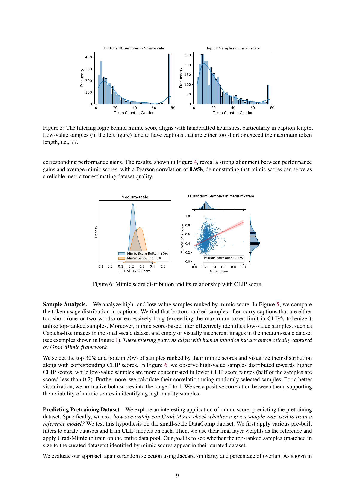
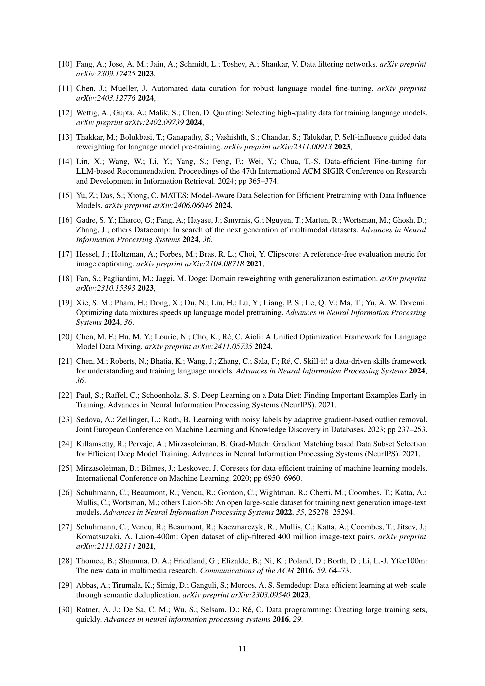

 


 2501.06708 
 Tzu-Heng Huang et el. 
 
 🤗 2025-01-14 
 



↗ arXiv


↗ Hugging Face


↗ Papers with Code


### TL;DR



기존의 데이터 선택 기법들은 **주관적인 휴리스틱이나 하류 평가 데이터셋, 또는 특수한 점수 모델에 의존**하여 훈련 과정에서 데이터 샘플의 유용성을 간과하는 경향이 있습니다. 이는 **데이터셋에 노이즈, 편향, 무관한 콘텐츠가 포함되어 모델 성능 저하 및 훈련 비효율성을 초래**할 수 있습니다.

본 논문에서는 **사전 훈련된 참조 모델을 활용하여 새로운 데이터 품질 지표인 Mimic Score를 제안**합니다. 이 지표는 새로운 모델의 파라미터 기울기와 가중치 공간에서 참조 모델을 향하는 벡터 간의 정렬을 측정하여 데이터 샘플의 유용성을 평가합니다. Mimic Score를 기반으로 **유용한 샘플을 식별하고 우선순위를 지정하는 데이터 선택 프레임워크인 Grad-Mimic을 개발**하였습니다. 실험 결과, Grad-Mimic은 이미지 데이터셋에서 일관된 성능 향상을 달성하고 CLIP 모델의 성능을 향상시켰으며, 기존 필터링 방법보다 우수한 성능을 보였습니다.



#### Key Takeaways


 새로운 데이터 품질 지표 Mimic Score 제시 



 Mimic Score 기반 데이터 선택 프레임워크 Grad-Mimic 개발 



 다양한 데이터셋에서 모델 성능 향상 및 데이터셋 품질 평가 정확도 향상 확인 


#### Why does it matter?
이 논문은 **데이터 선택의 새로운 지표인 Mimic Score와 이를 기반으로 한 데이터 선택 프레임워크인 Grad-Mimic을 제시**하여 기존 방법의 한계를 극복하고 모델 성능 향상 및 데이터셋 품질 평가에 대한 새로운 접근법을 제시합니다. **대규모 데이터셋을 사용하는 기초 모델 연구에 큰 영향**을 미칠 수 있으며, **데이터셋 품질 평가 및 효율적인 데이터 선택 전략**에 대한 새로운 연구 방향을 제시합니다.

------
#### Visual Insights

> 🔼 그림 1은 Mimic Score에 의해 식별된 고품질 및 저품질 샘플을 보여줍니다. 웹에서 크롤링한 데이터 상위 5%(첫 번째 행)와 하위 5%(두 번째 행)에서 무작위로 선택된 샘플들이 Mimic Score에 따라 순위가 매겨져 있습니다. 각 이미지 아래에는 해당 캡션과 CLIP 점수가 표시되어 있으며, CLIP 점수가 높을수록 품질이 좋다는 것을 나타냅니다 [17]. Mimic Score는 CLIP 점수와 거의 일치하며, 고품질 샘플은 일반적으로 자세한 캡션과 일관된 시각적 내용을 가지고 있는 반면 저품질 샘플은 짧은 캡션과 일치하지 않는 내용을 가지고 있습니다.
> 

> 
read the caption

> Figure 1:  High-value vs. Low-value Samples Identified by Mimic Score: We present randomly selected samples from the top 5% (first row) and bottom 5% (second row) of web-crawled data, ranked by their mimic scores. Below each image, we show their caption and corresponding CLIP score (where a higher score suggests good quality [17]). Mimic scores closely align with their CLIP scores. High-value samples generally have detailed captions and coherent visual content, while low-value ones carry short captions and misaligned content.
> 


| Full Fine-tuning | DTD |  |  | Flowers102 |  |  | STL10 |  |  | Oxford-IIIT Pet |  |  | CIFAR10 |  |  | CIFAR100 |  |  | Average |
|---|---|---|---|---|---|---|---|---|---|---|---|---|---|---|---|---|---|---|
| Ref. Model | 65.59 |  |  | 91.01 |  |  | 93.20 |  |  | 82.88 |  |  | 94.89 |  |  | 81.34 |  |  | 84.82 |
| Noise Level | 0.4 | 0.5 | 0.6 | 0.4 | 0.5 | 0.6 | 0.4 | 0.5 | 0.6 | 0.4 | 0.5 | 0.6 | 0.4 | 0.5 | 0.6 | 0.4 | 0.5 | 0.6 |  |
| SGD | 46.91 | 42.02 | 33.24 | 65.54 | 55.90 | 39.84 | 75.35 | 58.57 | 49.98 | 70.43 | 64.62 | 55.63 | 90.31 | 86.69 | 82.01 | 69.42 | 63.77 | 59.28 | 59.28 |
| GraNd | 29.73 | 8.83 | 15.43 | 10.80 | 2.78 | 27.92 | 78.39 | 52.32 | 64.30 | 56.83 | 45.38 | 45.43 | 87.56 | 83.79 | 80.04 | 18.65 | 8.83 | 7.84 | 40.16 |
| AGRA | 46.28 | 37.29 | 32.39 | 0.62 | 0.93 | 0.82 | 84.35 | 79.94 | 78.17 | 76.97 | 77.11 | 69.39 | 89.23 | 86.79 | 68.09 | 11.96 | 8.44 | 6.88 | 42.62 |
| Grad-Match | 48.88 | 42.66 | 33.24 | 37.92 | 54.94 | 42.62 | 83.86 | 81.16 | 77.18 | 74.35 | 61.73 | 51.16 | 44.48 | 35.69 | 37.59 | 69.41 | 66.21 | 20.09 | 43.65 |
| Grad-Mimic | 49.20 | 42.82 | 33.83 | 68.58 | 56.46 | 44.27 | 72.06 | 71.85 | 83.09 | 81.98 | 78.30 | 73.34 | 90.52 | 89.07 | 66.41 | 73.97 | 74.31 | 24.02 | 54.16 |
|  |  |  |  |  |  |  |  |  |  |  |  |  |  |  |  |  |  |  |  |
| Linear Probing | DTD |  |  | Flowers102 |  |  | STL10 |  |  | Oxford-IIIT Pet |  |  | CIFAR10 |  |  | CIFAR100 |  |  | Average |
|---|---|---|---|---|---|---|---|---|---|---|---|---|---|---|---|---|---|---|
| Ref. Model | 60.00 |  |  | 56.98 |  |  | 97.41 |  |  | 89.45 |  |  | 94.18 |  |  | 77.89 |  |  | 79.32 |
| Noise Level | 0.4 | 0.5 | 0.6 | 0.4 | 0.5 | 0.6 | 0.4 | 0.5 | 0.6 | 0.4 | 0.5 | 0.6 | 0.4 | 0.5 | 0.6 | 0.4 | 0.5 | 0.6 |  |
| SGD | 51.91 | 47.71 | 44.44 | 28.64 | 21.50 | 15.43 | 96.26 | 95.49 | 93.56 | 87.33 | 85.55 | 83.51 | 92.86 | 92.14 | 91.19 | 75.56 | 74.38 | 73.25 | 66.40 |
| GraNd | 36.22 | 30.59 | 25.32 | 18.23 | 13.90 | 10.49 | 68.70 | 59.55 | 49.68 | 69.47 | 60.02 | 48.13 | 88.02 | 85.61 | 81.48 | 71.60 | 70.51 | 69.27 | 47.40 |
| AGRA | 41.81 | 36.28 | 31.49 | 41.81 | 36.28 | 31.49 | 96.19 | 95.15 | 93.11 | 85.25 | 82.53 | 78.39 | 92.51 | 92.01 | 90.99 | 72.50 | 71.30 | 69.69 | 65.86 |
| Grad-Match | 51.81 | 47.55 | 41.33 | 27.00 | 20.21 | 14.90 | 96.06 | 95.34 | 93.44 | 86.86 | 85.75 | 83.18 | 92.62 | 92.04 | 91.17 | 75.39 | 74.46 | 73.18 | 66.20 |
| Grad-Mimic | 54.68 | 54.10 | 50.43 | 42.75 | 37.10 | 31.71 | 97.16 | 97.00 | 96.90 | 88.80 | 88.25 | 87.14 | 94.15 | 93.92 | 93.80 | 77.24 | 76.82 | 76.05 | 73.01 |

> 🔼 표 1은 시뮬레이션 실험의 1단계 결과를 보여줍니다.  이 표는 다양한 노이즈 수준(0.4, 0.5, 0.6)에서 여러 이미지 분류 데이터셋(DTD, Flowers102, STL10, Oxford-IIIT Pet, CIFAR10, CIFAR100)을 사용하여 미믹 점수를 활용한 학습 방법의 효과를 보여줍니다.  미믹 점수를 사용하면 잘못 라벨링된 샘플의 가중치를 효과적으로 줄일 수 있으며, 이는 향상된 잡음 제거 및 성능 향상으로 이어집니다. 표에는 각 데이터셋과 노이즈 수준별로 미믹 점수를 사용한 학습 방법과 기준 방법(SGD, GraNd, AGRA, Grad-Match)의 결과(정확도)가 제시되어 있습니다.  선형 프로빙(linear probing)과 전체 미세 조정(full fine-tuning) 두 가지 설정의 결과가 모두 포함되어 있습니다. 이 표는 미믹 점수 기반의 데이터 선택 전략을 통해 노이즈가 많은 데이터셋에서 모델 성능을 향상시킬 수 있음을 보여줍니다.
> 

> 
read the caption

> Table 1: Stage 1 Results in Simulation Experiment: Using mimic scores can effectively down-weight mislabeled samples during training, leading to improved denoising and performance gains.
> 

### In-depth insights

#### Mimic Score Metric
본 논문에서 제시된 **Mimic Score Metric**은 기존의 데이터 선택 방법들이 갖는 단점, 즉 인간의 직관이나 하류 평가 데이터셋, 또는 전문적인 점수 모델에 의존하여 훈련 과정에서의 샘플 유용성을 간과할 수 있다는 점을 해결하기 위한 새로운 접근 방식입니다. **기존 참조 모델의 가중치 공간에서 새로운 모델의 파라미터 기울기 벡터와 참조 모델 방향 벡터 간의 정렬**을 측정하여 데이터 샘플의 유용성을 평가합니다.  **기울기 벡터와 참조 모델 방향 벡터 간의 정렬 정도가 낮을수록 해당 샘플은 훈련에 부정적인 영향**을 미칠 가능성이 높으며, 따라서 필터링되어 제거될 수 있습니다. 이러한 Mimic Score는 데이터의 질적 평가와 효과적인 필터 생성에 유용하게 활용될 수 있으며, **기존 방법들보다 더욱 정확한 데이터셋 품질 추정**을 가능하게 합니다.  결과적으로 **모델 훈련의 효율성을 높이고 성능 향상**을 가져올 수 있다는 점에서 큰 의의를 갖습니다.

#### Grad-Mimic Framework
Grad-Mimic 프레임워크는 **미리 훈련된 참조 모델을 활용하여 데이터 샘플의 유용성을 평가하고 효과적인 필터를 자동으로 생성하는 데이터 선택 기법**입니다.  두 단계로 구성되는데, 1단계에서는 **미믹 점수(Mimic Score)를 사용하여 샘플의 기울기(gradient)와 참조 모델 방향 간의 정렬을 측정**하고, 이를 통해 모델 훈련 과정에서 유용한 샘플을 우선적으로 학습시킵니다. 2단계에서는 훈련 단계별 샘플 유용성 평가를 종합하여 **앙상블 필터를 생성**함으로써 노이즈 감지 및 데이터셋 품질 추정의 정확도를 높입니다.  **기존의 수동 필터링 방식이나 하류 평가 데이터셋에 의존하지 않고, 참조 모델의 가중치 공간을 기준으로 샘플의 기여도를 평가**하기 때문에 효율적이며, 다양한 이미지 데이터셋에서 성능 향상을 보여줍니다. **특히 대규모 웹 크롤링 데이터셋에서도 효과적**으로 작동하며, 기존 필터링 방법을 보완하여 모델 성능을 향상시키는 데 기여합니다.

#### Dataset Quality
본 논문에서 데이터셋 품질은 **모델 성능과 직접적으로 관련**되어 있으며, 잡음, 편향, 무관한 데이터 등은 모델 학습에 악영향을 미친다는 점을 강조합니다.  **Mimic Score**는 기존의 데이터 선택 방법들이 간과했던 샘플의 학습 과정에서의 유용성을 평가하는 지표로 제시되며, **참조 모델과의 가중치 공간에서의 정렬**을 통해 데이터 샘플의 질을 측정합니다.  이는 기존의 휴리스틱 기반 방법이나 하류 평가 데이터셋에 의존하지 않고, 사전 훈련된 참조 모델을 활용하여 효율적으로 데이터 품질을 추정할 수 있는 강점을 가집니다.  Grad-Mimic 프레임워크는 Mimic Score를 기반으로 유용한 샘플을 자동으로 선택하고 필터링하여 모델 학습의 효율성을 높이며, **데이터셋의 품질을 정확하게 추정**하는 데 기여합니다.  결과적으로, 본 연구는 데이터셋의 품질 평가 및 효과적인 데이터 선택에 대한 새로운 관점을 제시하고 있으며, 이를 통해 기초 모델의 성능 향상 및 데이터 활용 효율성 증대에 기여할 수 있을 것으로 기대됩니다.

#### Simulation Study
본 연구의 시뮬레이션 연구는 **잡음이 포함된 레이블 데이터에 대한 모델의 강건성을 평가하기 위해 설계되었습니다.**  연구진은 다양한 수준의 레이블 잡음을 6개의 이미지 분류 데이터셋에 추가하여 **합성적으로 제어된 환경**을 조성했습니다. 이를 통해, **Grad-Mimic의 정확한 샘플 식별 능력과 잡음 데이터에 대한 강건성을 객관적으로 평가**할 수 있었습니다.  **다양한 잡음 수준과 데이터셋에서 일관된 성능 향상**을 보인 Grad-Mimic은 잡음 샘플의 가중치를 낮추고, 모델의 성능을 향상시키는 효과를 보였습니다.  **단순한 기울기 기반 접근법과의 비교**를 통해 Grad-Mimic의 우수성이 입증되었고, 이는 **Grad-Mimic이 잡음 데이터 처리에 있어 효과적이고 실용적인 방법론**임을 시사합니다. 시뮬레이션 연구는 실제 웹 크롤링 데이터셋의 분석에 앞서, **Grad-Mimic의 기본적인 기능과 효율성을 검증**하는데 중요한 역할을 수행했습니다.  **결론적으로 시뮬레이션 연구는 제어된 환경 하에서 Grad-Mimic의 성능을 검증함으로써 실제 데이터셋 분석의 신뢰성을 높이는 기반**이 되었습니다.

#### Web Data Selection
웹 데이터 선택은 **대규모 웹 크롤링 데이터셋**에 의존하는 기초 모델의 성공에 매우 중요합니다. 하지만 이러한 데이터셋은 종종 노이즈, 편향, 무관한 콘텐츠를 포함하고 있습니다. 따라서 **데이터 선택**은 모델 개발 파이프라인에서 중요한 단계입니다. 기존의 데이터 선택 기법들은 종종 휴리스틱, 하류 평가 데이터셋, 또는 특수한 스코어링 모델에 의존하며, 훈련 과정에서 샘플의 유용성을 간과할 수 있습니다. 이 논문은 **사전 훈련된 참조 모델**을 사용하여 새로운 모델 훈련을 위한 데이터 샘플의 유용성을 평가하는 새로운 방법인 **Mimic Score**를 제안합니다. Mimic Score는 새로운 모델 매개변수의 기울기와 가중치 공간에서 참조 모델을 향하는 벡터 사이의 정렬을 기반으로 합니다. 이러한 정렬이 잘 되지 않은 샘플은 낮은 가치를 가진 것으로 간주되어 필터링될 수 있습니다. 이러한 Mimic Score를 기반으로 효과적인 필터를 자동으로 생성하는 데이터 선택 프레임워크인 **Grad-Mimic**을 개발했습니다. 실험 결과는 이미지 데이터셋에서 일관된 성능 향상을 보여주었습니다.

### More visual insights

More on figures

> 🔼 Grad-Mimic의 두 단계 작업 과정을 보여주는 그림입니다. 1단계에서는 참조 모델의 가중치 공간을 향하는 벡터를 사용하여 각 샘플의 음수 기울기와의 정렬을 측정합니다. 그런 다음 정렬 점수를 조정하여 가중치 이동에 기여한 기울기를 재가중합니다. 2단계에서는 도출된 정렬 점수(모방 점수)를 사용하여 저품질 샘플을 식별하고 앙상블 필터를 구축하여 정확한 노이즈 탐지, 정밀한 데이터셋 품질 평가 및 교육용 데이터셋 발견을 가능하게 합니다.
> 

> 
read the caption

> Figure 2: Grad-Mimic Two-stage Workflow: In Stage 1, Grad-Mimic uses the vector pointing toward the reference model’s weight space to measure alignments with each sample’s negative gradients. Then it adapts alignment scores to reweight gradients that contributed to the weight movements. In Stage 2, derived alignment scores, mimic scores, are used to identify low-value samples and build an ensemble filter, enabling accurate noise detection, precise dataset quality assessment, and training dataset discovery.
> 

> 🔼 그림 3은 0.5의 노이즈 수준을 가진 CIFAR100 데이터셋에서 추출된 Mimic Score 분포를 보여줍니다.  정답 레이블과 오답 레이블의 Mimic Score 분포가 명확하게 구분되는 것을 확인할 수 있습니다.  즉, Mimic Score가 레이블의 정확성과 잘 연관되어 있음을 시각적으로 보여주는 그림입니다. 각 에포크별(Epoch 1~5) 분포를 통해 시간에 따른 변화도 확인 가능합니다.
> 

> 
read the caption

> Figure 3: Mimic Score Distribution: Extracted from CIFAR100 dataset with a noise level of 0.5. The distributions clearly separate, aligning with the correctness of the labels.
> 

> 🔼  그림 (a)는 시뮬레이션 실험에서 데이터셋 품질을 평가하는 방법을 보여줍니다. 다양한 노이즈 수준에서 여러 데이터셋에 대해 Grad-Mimic의 정확도를 평가하고, 노이즈 수준과 성능 향상 간의 상관관계를 보여줍니다.  Grad-Mimic이 노이즈가 있는 샘플을 효과적으로 식별하고 제거하여 성능 향상에 기여하는 것을 확인할 수 있습니다.  x축은 노이즈 수준이고 y축은 예측된 데이터셋 품질입니다.
> 

> 
read the caption

> ((a))
> 

> 🔼 그림 (b)는 DataComp 실험에서 데이터셋 품질을 평가한 결과를 보여줍니다.  가로축은 노이즈 수준을 나타내고 세로축은 추정된 데이터셋 품질을 나타냅니다.  다양한 필터링 방법(CLIP 점수 기반 필터링, Grad-Mimic 등)을 사용하여 얻은 결과를 비교하여, Grad-Mimic이 데이터셋 품질을 보다 정확하게 추정하는 것을 보여줍니다.  각 점은 특정 필터링 전략과 노이즈 수준에 대한 데이터셋 품질 추정치를 나타내며,  상관 관계는 DataComp 데이터셋의 크기(작거나 중간)에 따라 다르게 나타납니다.  이 그래프는 Grad-Mimic이 데이터의 품질을 정확하게 평가할 수 있음을 시각적으로 보여줍니다.
> 

> 
read the caption

> ((b))
> 

> 🔼 그림 4는 Grad-Mimic의 데이터셋 품질 추정 능력을 보여줍니다. (a)는 시뮬레이션 실험에서 필터링 후 남은 샘플의 비율을 계산하여 데이터셋 품질을 평가하는 방법을 보여줍니다. (b)는 각 필터링된 데이터셋에서 평균 Mimic 점수를 사용하여 데이터셋 품질을 추정하는 방법을 보여줍니다. [S/M]은 필터가 적용된 DataComp 데이터셋의 크기를 나타내며, S는 소규모, M은 중규모를 의미합니다.
> 

> 
read the caption

> Figure 4: Mimic scores offer precise dataset quality estimation: Left figure (a) computes the portion of retained samples to evaluate dataset quality in simulation experiments. Right figure (b) takes the average on mimic scores in each filtered dataset for estimation. [S/M] denotes the scale of DataComp dataset—small [S] or medium [M]—that the filter is designed on.
> 

> 🔼 그림 5는 Mimic Score의 필터링 로직이, 특히 캡션 길이 측면에서 수작업으로 만든 휴리스틱과 일치함을 보여줍니다. 왼쪽 그림에서 볼 수 있듯이, 낮은 Mimic Score를 가진 샘플들은 캡션이 너무 짧거나(토큰 수가 적거나) 최대 토큰 길이(77개 토큰)를 초과하는 경향이 있습니다. 이는 낮은 품질의 데이터를 나타내는 지표로 해석될 수 있습니다.
> 

> 
read the caption

> Figure 5:  The filtering logic behind mimic score aligns with handcrafted heuristics, particularly in caption length. Low-value samples (in the left figure) tend to have captions that are either too short or exceed the maximum token length, i.e., 77.
> 

> 🔼 그림 (a)는 시뮬레이션 실험에서 데이터셋의 품질을 평가하는 방법을 보여줍니다.  다양한 수준의 노이즈가 추가된 여섯 개의 이미지 분류 데이터셋에 대해, Grad-Mimic의 성능을 평가하고 있습니다.  x축은 노이즈 수준을 나타내고 y축은 추정된 데이터셋 품질을 나타냅니다.  각 점은 특정 노이즈 수준에서의 데이터셋 품질을 나타내며, 선은 다양한 노이즈 수준에 대한 데이터셋 품질의 추세를 보여줍니다. 이 그래프를 통해 Grad-Mimic이 노이즈 수준에 따른 데이터셋 품질을 정확하게 추정하는 능력을 확인할 수 있습니다.
> 

> 
read the caption

> ((a))
> 

More on tables


| Noise Level | DTD (0.4) | DTD (0.5) | DTD (0.6) | Flowers102 (0.4) | Flowers102 (0.5) | Flowers102 (0.6) | STL10 (0.4) | STL10 (0.5) | STL10 (0.6) | Oxford-IIIT Pet (0.4) | Oxford-IIIT Pet (0.5) | Oxford-IIIT Pet (0.6) | CIFAR10 (0.4) | CIFAR10 (0.5) | CIFAR10 (0.6) | CIFAR100 (0.4) | CIFAR100 (0.5) | CIFAR100 (0.6) |
|---|---|---|---|---|---|---|---|---|---|---|---|---|---|---|---|---|---|---|
| Threshold (1/32) | 85.13 | 88.91 | 91.82 | 90.93 | 94.9 | **96.92** | 90.31 | 94.11 | **97.21** | 94.41 | 96.86 | **97.93** | 98.37 | **98.19** | 97.19 | 97.66 | **97.57** | 95.80 |
| 1D k-means | 77.13 | 76.68 | 77.17 | 84.45 | 87.62 | 87.47 | 78.90 | 83.04 | 78.82 | 95.80 | 95.49 | 93.73 | **98.62** | 98.17 | **97.56** | **98.10** | 97.46 | **96.62** |
| GMM | **97.85** | **96.72** | **95.68** | **98.39** | **96.96** | 94.21 | **97.96** | **97.16** | 95.69 | **98.04** | **97.07** | 95.86 | 95.70 | 92.89 | 88.62 | 95.86 | 94.31 | 92.55 |
> 🔼 표 2는 시뮬레이션 실험의 2단계 결과를 보여줍니다. Grad-Mimic은 다양한 데이터셋과 식별 방법에서 일관되게 오분류된 샘플을 정확하게 감지합니다. 특히, Grad-Mimic의 성능은 노이즈 수준에 관계없이 높고 견고하게 유지됩니다. F1 점수 측정항목을 사용하여 오분류된 샘플의 감지 성능을 평가합니다. Grad-Mimic은 다양한 데이터셋과 샘플 식별 방법에서 일관되게 높은 정확도를 보이며, 노이즈 수준에 관계없이 성능이 뛰어나고 안정적임을 보여줍니다.
> 

> 
read the caption

> Table 2: Stage 2 Results in Simulation Experiment: We report detection results using F1-score metric. Grad-Mimic consistently achieves precise detection of mislabeled samples across datasets and identification methods. Notably, its performance remains high and robust regardless of the noise level.
> 


| Scale | Training Method | Mimic Layer  θref | Temperature τ | ImageNet | ImageNet dist. shifts | VTAB | Retrieval | Average over 38 datasets (↑) | 
|---|---|---|---|---|---|---|---|---|
|  | Standard Training | — | — | 0.026 | 0.035 | 0.139 | 0.114 | 0.131 |
|  |  |  | 0.03 | 0.026 | 0.035 | 0.153 | 0.115 | **0.136** |
|  |  |  | 0.05 | 0.026 | 0.035 | 0.147 | 0.114 | **0.135** |
|  |  |  | 0.07 | 0.026 | 0.035 | 0.151 | 0.116 | **0.135** |
|  |  |  | 0.3 | 0.026 | 0.034 | 0.154 | 0.112 | **0.137** |
|  |  | Last MLP Layer in Text Encoder | 0.5 | 0.027 | 0.035 | 0.152 | 0.114 | **0.139** |
|  |  |  | 0.03 | 0.025 | 0.035 | 0.149 | 0.114 | **0.133** |
|  |  |  | 0.05 | 0.026 | 0.037 | 0.162 | 0.118 | **0.146** |
|  |  |  | 0.07 | 0.027 | 0.036 | 0.166 | 0.118 | **0.145** |
|  |  |  | 0.3 | 0.026 | 0.035 | 0.161 | 0.114 | **0.144** |
| Small | Grad-Mimic | Last MLP Layer in Image Encoder | 0.5 | 0.027 | 0.035 | 0.160 | 0.117 | **0.145** |
|  | Standard Training | — | — | 0.171 | 0.148 | 0.253 | 0.217 | 0.254 |
| Medium | Grad-Mimic | Last MLP Layer in Image Encoder | 0.05 | 0.169 | 0.151 | 0.262 | 0.216 | **0.258** |
> 🔼 표 3은 DataComp 실험의 1단계 결과를 보여줍니다. 공개적으로 사용 가능한 사전 훈련된 가중치를 사용하여 Grad-Mimic은 두 가지 데이터셋 규모 모두에서 CLIP 모델 성능을 지속적으로 향상시킵니다.  더 자세히 설명하자면, 이 표는 Grad-Mimic이 사전 훈련된 CLIP 모델 가중치를 참조하여,  작은 규모와 중간 규모의 두 가지 DataComp 데이터셋에서 CLIP 모델의 성능을 향상시키는지 보여줍니다.  여러 가지 하이퍼파라미터(Mimic 레이어, 온도, 학습 방법)를 바꿔가면서 실험을 진행했고, 그 결과를 표로 정리했습니다.  이를 통해 Grad-Mimic의 성능 향상이 일관적임을 확인할 수 있습니다.
> 

> 
read the caption

> Table 3: Stage 1 Results in DataComp Experiment: On both dataset scales, with the aid of publicly available pretrained weights, Grad-Mimic consistently improves CLIP model performance.
> 


| ImageNet | dist. shifts |
|---|---|
> 🔼 표 4는 DataComp 실험의 2단계 결과를 보여줍니다. 기본 필터링보다 Mimic 점수 기반 필터가 성능이 우수하며, 낮은 가치의 샘플을 제거함으로써 CLIP 점수 기반 필터를 보완합니다.  '∖' 기호는 큐레이션된 데이터셋을 제외했음을 나타냅니다.  표는 다양한 필터링 전략(기본 필터링, Mimic 점수 상위 30%, Mimic 점수 상위 35%, Mimic 점수 상위 40%, CLIP 점수 상위 30%, CLIP 점수와 Mimic 점수 하위 15% 조합, CLIP 점수와 Mimic 점수 하위 20% 조합)에 따른 ImageNet, ImageNet 분포 변화, VTAB 검색 성능 및 38개 데이터셋 평균 성능을 비교 분석하여 각 필터링 전략의 효과를 정량적으로 제시합니다.  데이터셋 크기(Small, Medium)에 따른 성능 차이도 보여줍니다.
> 

> 
read the caption

> Table 4: Stage 2 Results in DataComp Experiment: Mimic score-based filters perform better than basic filtering and complement CLIP score-based filters by removing low-value samples. Symbol “∖\setminus∖” denotes the exclusion of curated datasets.
> 


| Average over |
|---|---| 
| 38 datasets (↑) |
> 🔼 이 표는 참조 모델을 학습시키는 데 사용된 샘플을 예측하는 데 Mimic 점수가 얼마나 효과적인지 보여줍니다.  무작위 선택과 Mimic 점수 선택 두 가지 방법을 사용하여 참조 모델을 학습시키는 데 사용된 샘플과 일치하는 샘플의 비율을 비교합니다. Mimic 점수 선택이 무작위 선택보다 참조 모델 학습에 사용된 샘플을 더 정확하게 식별하는 것을 보여줍니다.
> 

> 
read the caption

> Table 5: Mimic score can help in predicting whether a sample was used to train the reference model.
> 


| Last MLP Layer | in Image Encoder |
|---|---|
> 🔼 표 6은 다양한 온도 설정에서 시뮬레이션 실험의 1단계 결과를 보여줍니다. 낮은 온도는 모델이 고품질 샘플에 집중하여 학습하게 하여 테스트 정확도를 높입니다. 이 표는 Grad-Mimic의 성능이 온도에 따라 어떻게 변하는지, 그리고 낮은 온도에서 더 나은 결과를 얻는 이유를 보여줍니다.  다양한 노이즈 수준에서 여러 데이터셋에 대해 Grad-Mimic, Grad-Match 및 SGD의 성능을 비교하여 Grad-Mimic의 효과를 보여줍니다.
> 

> 
read the caption

> Table 6: Stage 1 Results in Simulation Experiment with Different Temperature: Lower temperature makes the model focus more on training with high-value samples, resulting in a higher testing accuracy.
> 

### Full paper



