 


 2501.06751 
 Michael Toker et el. 
 
 🤗 2025-01-15 
 



↗ arXiv


↗ Hugging Face


↗ Papers with Code


### TL;DR



텍스트-이미지(T2I) 변환 모델은 사용자의 텍스트 프롬프트를 이미지로 변환하는 인공지능 모델입니다. 이러한 모델들은 일반적으로 프롬프트의 길이를 일정하게 맞추기 위해 패딩 토큰을 사용하지만, 이 패딩 토큰의 역할에 대한 연구는 부족했습니다. 본 논문에서는 T2I 모델에서 패딩 토큰의 역할을 최초로 심층적으로 분석합니다.

본 연구는 **두 가지 인과적 분석 기법**(텍스트 인코더 출력 간섭 및 확산 과정 간섭)을 개발하여 패딩 토큰이 모델의 다양한 구성 요소(텍스트 인코더, 확산 모델)에서 어떻게 정보를 처리하는지 분석했습니다. 그 결과, 패딩 토큰은 텍스트 인코딩 단계, 확산 과정, 또는 무시되는 세 가지 시나리오 중 하나의 영향을 미치며, 그 영향은 모델 구조(크로스/셀프 어텐션), 텍스트 인코더 학습 여부와 같은 요인에 따라 달라짐을 밝혔습니다. 이러한 연구 결과는 향후 T2I 모델의 설계 및 학습 전략을 개선하는 데 중요한 시사점을 제공합니다.



#### Key Takeaways


 T2I 모델에서 패딩 토큰은 **텍스트 인코더가 학습되었는지 여부**에 따라 이미지 생성에 다른 영향을 미칩니다. 



 **다양한 모델 구조(크로스 어텐션, 셀프 어텐션)**에 따라 패딩 토큰의 역할이 달라집니다. 



 패딩 토큰은 **텍스트 인코더 학습 여부와 무관하게 확산 과정에서 '레지스터' 역할**을 수행하여 정보를 저장 및 활용할 수 있습니다. 


#### Why does it matter?
본 논문은 **패딩 토큰이 T2I 모델의 이미지 생성 과정에 미치는 영향을 최초로 심층 분석**하여, 모델 설계 및 학습 전략 개선에 중요한 시사점을 제공합니다. **텍스트 인코더와 확산 모델의 상호 작용**에 대한 이해를 높이고, 향후 **T2I 모델의 성능 향상 및 효율성 증대**에 기여할 수 있습니다.  또한, 제시된 **인과적 분석 기법**은 다른 생성 모델 연구에도 적용 가능하여, 폭넓은 파급 효과를 기대할 수 있습니다.

------
#### Visual Insights

> 🔼 그림 1은 FLUX 모델을 사용하여 입력 프롬프트의 여러 부분에서 생성된 이미지들을 보여줍니다. 왼쪽에서 오른쪽으로 각 열은 다음을 나타냅니다. (1) 전체 프롬프트(프롬프트 토큰과 패딩 토큰 모두 함께 인코딩됨)를 사용하여 생성된 이미지, (2) 프롬프트 토큰과 깨끗한 패딩 토큰만 사용하여 생성된 이미지, (3) 프롬프트와 함께 프롬프트-맥락 패딩만 인코딩하고 프롬프트 토큰은 깨끗한 패딩 토큰으로 대체하여 생성된 이미지입니다. 이 그림은 패딩 토큰이 이미지 생성 과정에 미치는 영향을 시각적으로 보여주는 데 도움이 됩니다.
> 

> 
read the caption

> Figure 1: Images generated with FLUX from different segments of the input prompt. Description of each column, from left to right: (1) An image generated using the full prompt (both prompt tokens and padding tokens encoded together), (2) An image generated using only the prompt tokens and clean padding tokens, (3) An image generated using only the prompt-contextual pads encoded with the prompt, while the prompt tokens were replaced with clean pad tokens.
> 


| Model | Prompt | Pads |
|---|---|---|
| **Flux-schnell** | 0.01 | 14.52 |
| **LDM** | 0.88 | 4.53 |
| **LLaMA UNet** | 7.37 | 0.48 |
| **Stable Diffusion 2** | 0.02 | 31.09 |
| **Stable Diffusion 3** | 0.01 | 15.74 |

> 🔼 본 표는 프롬프트-맥락 패딩 토큰만을 사용하여 생성된 이미지와 프롬프트 토큰만을 사용하여 생성된 이미지 간의 Kernel Inception Distance (KID) 점수를 보여줍니다. KID 점수는 두 이미지 집합 간의 유사성을 측정하는 지표이며, 값이 낮을수록 두 이미지 집합이 더 유사함을 의미합니다.  이 표에서는 전체 프롬프트를 사용하여 생성된 이미지를 기준으로 KID 점수를 계산하였습니다. 따라서, 프롬프트-맥락 패딩 토큰만을 사용했을 때 생성된 이미지가 전체 프롬프트를 사용했을 때 생성된 이미지와 얼마나 유사한지를 나타냅니다. 낮은 KID 점수는 프롬프트-맥락 패딩 토큰이 이미지 생성에 중요한 정보를 담고 있음을 시사합니다.
> 

> 
read the caption

> Table 1: KID scores between the images generated from the prompt-contextual pads vs. images generated only from prompt representations. Lower is better. The KID is calculated w.r.t images generated from the full representation.
> 

### In-depth insights

#### Padding's Impact
본 논문은 이미지 생성 모델에서 패딩 토큰의 영향에 대해 심도 있게 분석합니다. **패딩 토큰은 고정된 입력 길이를 맞추기 위해 사용되는데, 놀랍게도 이미지 생성 과정에 영향을 미칠 수 있다는 것을 밝혔습니다.**  텍스트 인코더의 학습 여부에 따라 패딩 토큰의 역할이 달라지는데, 훈련되지 않은 인코더의 경우 패딩 토큰은 무시되지만, 훈련된 인코더의 경우 의미있는 정보를 담고 이미지 생성에 영향을 미칩니다. 특히 **다중 모드 어텐션 메커니즘을 사용하는 모델에서는 패딩 토큰이 확산 과정 전반에 걸쳐 정보를 저장하고 불러오는 '레지스터' 역할을 한다는 점이 흥미롭습니다.**  이러한 분석 결과는 T2I 모델 설계 및 훈련 과정 개선에 중요한 시사점을 제공하며,  **패딩 토큰을 효율적으로 활용하는 새로운 모델 아키텍처 및 훈련 전략 개발에 대한 가능성을 열어줍니다.**

#### Causal Analysis
본 논문에서 제시된 인과 분석은 **T2I 모델의 패딩 토큰 역할에 대한 심층적인 이해**를 제공합니다. 두 가지 주요 방법인 ITE(Intervention in the Text Encoder Output)와 IDP(Intervention in the Diffusion Process)는 인과 관계를 분석하여 패딩 토큰이 어떤 시점(텍스트 인코딩 단계, 확산 과정 또는 무시)에 영향을 미치는지 규명하는 데 사용되었습니다.  **모델 아키텍처(교차 또는 자기 주의)와 학습 과정(고정 또는 학습된 텍스트 인코더)**은 이러한 영향에 중요한 역할을 합니다. **고정된 텍스트 인코더를 가진 모델은 패딩 토큰을 무시하지만, 학습된 텍스트 인코더를 가진 모델은 패딩 토큰에 의미론적 중요성을 부여**합니다.  더 나아가,  **일부 모델에서는 텍스트 인코더가 패딩 토큰을 사용하지 않더라도 확산 과정에서 '레지스터' 역할을 하여 의미 있는 정보를 저장하고 불러올 수 있음**을 보여줍니다.  이러한 분석은 T2I 모델의 작동 메커니즘에 대한 깊이 있는 이해를 제공하며, 미래 모델 설계 및 학습 방식 개선에 기여할 수 있습니다.

#### Model Architectures
본 논문은 다양한 텍스트-이미지(T2I) 모델 아키텍처의 차이점과 각 아키텍처가 패딩 토큰을 처리하는 방식에 대한 깊이 있는 분석을 제시합니다. **특히, 텍스트 인코더가 고정되어 있는 모델(예: Stable Diffusion 2, FLUX)과 훈련 가능한 텍스트 인코더를 사용하는 모델(예: LDM, Lavi-Bridge)**의 패딩 토큰 처리 방식을 비교 분석하여 그 차이점을 명확히 밝힙니다. 고정된 텍스트 인코더를 사용하는 모델은 패딩 토큰을 무시하는 경향을 보이는 반면, 훈련 가능한 텍스트 인코더를 사용하는 모델은 패딩 토큰에 의미있는 정보를 담는다는 것을 발견합니다.  **또한, 크로스 어텐션(cross-attention)과 멀티모달 셀프 어텐션(MM-DiT)**을 사용하는 모델 아키텍처의 차이가 패딩 토큰의 활용 방식에 영향을 미치는 중요한 요소임을 밝힙니다. **크로스 어텐션 모델에서는 패딩 토큰이 텍스트 인코딩 과정에서 무시되지만, MM-DiT 모델에서는 패딩 토큰이 확산(diffusion) 과정에서 정보를 저장하고 전달하는 ‘레지스터’ 역할**을 할 수 있다는 점이 흥미로운 결과입니다. 이러한 연구 결과는 앞으로 T2I 모델의 설계 및 훈련 방식에 대한 새로운 시각을 제공하고, 패딩 토큰을 효율적으로 활용하는 방법에 대한 귀중한 통찰력을 제공합니다.

#### Future of Padding
패딩 토큰의 미래는 **텍스트-이미지(T2I) 모델의 설계 및 훈련 방식에 대한 심오한 영향**을 시사합니다. 본 논문은 패딩 토큰이 단순히 자리 채우기 역할을 넘어 모델의 성능에 영향을 미칠 수 있음을 보여줍니다.  **훈련 과정에서 텍스트 인코더가 고정되어 있는지 여부**에 따라 패딩 토큰의 역할이 달라지며, 이는 모델 아키텍처(교차 주의 또는 자기 주의)와도 관련이 있습니다. 따라서 **미래의 T2I 모델은 패딩 토큰의 이러한 역할을 명확히 이해하고 설계 및 훈련 과정에 반영**해야 합니다.  **패딩 토큰을 효율적으로 활용하는 새로운 아키텍처 및 훈련 기법**의 개발이 중요하며, 이를 통해 모델의 성능 향상과 더불어 컴퓨팅 자원의 효율적인 사용을 기대할 수 있습니다. 또한, **패딩 토큰에 대한 보다 정교한 분석**을 통해, 기존 모델의 한계를 극복하고 새로운 가능성을 열 수 있을 것입니다.  **다양한 모델 아키텍처와 훈련 전략에 따른 패딩 토큰의 역할을 심층적으로 연구**하고, 그 결과를 바탕으로 향상된 모델을 개발하는 것이 미래 연구의 중요한 방향이 될 것입니다.

#### Study Limitations
본 연구는 다양한 T2I 모델들을 분석하여 패딩 토큰의 역할을 규명하고자 하였으나, **모든 T2I 모델의 설계 및 훈련 방식을 포괄적으로 다루지는 못했습니다.**  분석에 사용된 프롬프트의 다양성에도 한계가 있으며, **일부 특수한 상황에서 패딩 토큰이 다르게 활용될 가능성** 또한 고려해야 합니다.  CLIP Score와 KID와 같은 평가 지표는 이미지 품질의 모든 측면을 완벽히 반영하지 못할 수 있습니다. 따라서 본 연구의 결과는 **일반화 가능성에 대한 추가적인 연구**를 필요로 하며, **향후 패딩 토큰 처리 전략 개선**을 위한 발판으로 활용될 수 있을 것입니다.  특히, 다양한 모델 아키텍처와 훈련 방식에서 패딩 토큰의 역할을 심층적으로 파악하기 위한 추가 연구가 필요하며, **더욱 정교한 평가 지표 개발** 또한 중요한 과제입니다.

### More visual insights

More on figures

> 🔼 그림 2는 텍스트 인코더 내 패딩 토큰의 정보를 해석하는 ITE(Intervention in Text Encoder) 방법을 보여줍니다.  먼저 전체 프롬프트와 깨끗한(clean) 패딩 토큰을 별도로 인코딩합니다. 그런 다음 해석하고자 하는 토큰을 유지하고 다른 모든 토큰을 깨끗한 패딩 토큰으로 바꿉니다.  이렇게 수정된 표현을 사용하여 이미지를 생성합니다. 그림의 예시는 LLaMA-UNet에서 패딩 토큰을 해석하여 패딩 토큰에 포함된 의미론적 정보를 보여줍니다.  즉,  원본 프롬프트의 문맥 정보를 포함하지 않는 '깨끗한' 패딩 토큰과 원본 패딩 토큰을 비교하여 패딩 토큰이 의미있는 정보를 가지고 있는지 확인하는 과정입니다.
> 

> 
read the caption

> Figure 2: ITE: Interpreting information within pad tokens in the text encoder. We first encode the full prompt and an clean pads separately. Next, we keep the tokens we want to interpret and replace all other tokens with clean pad tokens. We then generate an image conditioned on this mixed representation. In the example shown here, we interpret the pad tokens in LLaMA-UNet, revealing semantic information embedded within the pad tokens.
> 

> 🔼 그림 3은 ITE(Intervention in Text Encoder) 기법을 사용하여 생성된 이미지들을 보여줍니다. 입력 프롬프트의 여러 부분들을 사용하여 생성된 이미지들을 비교 분석합니다.  첫 번째 열은 전체 프롬프트(프롬프트 토큰과 패딩 토큰 모두 포함)를 사용하여 생성된 이미지입니다. 두 번째 열은 프롬프트 토큰만 사용하고 패딩 토큰은 '깨끗한'(clean) 패딩 토큰으로 대체하여 생성된 이미지입니다. 마지막 열은 프롬프트 토큰을 '깨끗한' 패딩 토큰으로 대체하고, 프롬프트와 함께 문맥 정보를 포함한 패딩 토큰만 사용하여 생성된 이미지입니다. 이를 통해 패딩 토큰이 이미지 생성 과정에 어떤 영향을 미치는지 분석합니다.
> 

> 
read the caption

> Figure 3: Images generated from different segments of the input prompt using ITE. Description of each column, from left to right: (1) An image generated using the full prompt (both prompt tokens and padding tokens encoded together), (2) An image generated using only the prompt tokens and clean padding tokens, (3) An image generated using only the prompt-contextual pads encoded with the prompt, while the prompt tokens were replaced with clean pad tokens.
> 

> 🔼 그림 4는 다양한 표현 방식(전체 프롬프트, 프롬프트만, 프롬프트 문맥 패딩, 정리된 패딩)에서 생성된 5,000개의 이미지에 대한 평균 CLIP 점수를 보여줍니다. LDM과 LLaMA-UNet 모델만 패딩 토큰에서 생성된 이미지에 대해 높은 CLIP 점수를 달성하여, 텍스트 인코딩 과정에서 패딩 토큰이 사용됨을 나타냅니다. 표준 편차는 부록의 표 4를 참조하십시오.
> 

> 
read the caption

> Figure 4:  Average CLIP score over 5,000 images generated from the different representations: full prompt, only prompt, prompt-contextual pads and clean pads. LDM and LLaMA-UNet are the only models achieving high CLIP scores for images generated from padding tokens, indicating their use during text encoding. See Table 4 in the Appendix for standard deviations.
> 

> 🔼 이 그림은 Lavi-Bridge 모델에서 LoRA의 스케일링 계수 α (y축)에 따른 이미지 생성 결과를 보여줍니다. 패딩 토큰 세그먼트를 분석하여 첫 번째 열에는 전체 이미지를, 다음 열에는 연속적인 20%의 패딩 토큰을 표시합니다. α가 감소함에 따라 사용되는 패딩 토큰의 수가 줄어듭니다.  즉, LoRA의 스케일링 계수가 작아질수록 모델이 이미지 생성에 패딩 토큰을 덜 활용한다는 것을 보여줍니다. 이는 패딩 토큰이 모델의 학습 및 이미지 생성 과정에서 어떻게 활용되는지에 대한 통찰력을 제공합니다.
> 

> 
read the caption

> Figure 5: Images generated from Lavi-bridge with LoRa loaded with scaling factor α𝛼\alphaitalic_α (y-axis). We analyze pad token segments: the first column shows the full image, and the next columns show three consecutive 20% of the pads. As α𝛼\alphaitalic_α decreases, fewer pad tokens are used.
> 

> 🔼 그림 6은 Stable Diffusion XL과 FLUX 모델에서 각 토큰에 대한 어텐션 히스토그램을 보여줍니다. 두 모델 모두 패딩 토큰에서 의미 정보를 제외하지만, FLUX는 이러한 패딩 토큰을 활용하는 반면 Stable Diffusion은 그렇지 않다는 것을 보여줍니다. 시각화 개선을 위해 FLUX의 어텐션이 낮은 긴 중간 부분을 제거했습니다.  두 모델 모두에서 패딩 토큰의 어텐션 분포를 비교 분석하여, 어텐션 메커니즘 상에서 패딩 토큰의 활용 여부와 그 차이를 보여주는 그림입니다. 특히 FLUX 모델의 경우, 패딩 토큰에 대한 어텐션 값이 상대적으로 높게 나타나 패딩 토큰을 모델의 정보 처리 과정에 적극적으로 활용함을 시각적으로 보여줍니다.
> 

> 
read the caption

> Figure 6:  Attention histogram for Stable Diffusion XL and FLUX* for each token reveals that while both models exclude semantic information from padding tokens, FLUX utilizes these tokens, whereas Stable Diffusion does not. *In FLUX, we have removed the long middle part with low attention in order to improve visualization.
> 

> 🔼 그림 7은 FLUX 확산 모델에서 어텐션 맵을 보여줍니다. 어텐션 맵은 프롬프트 토큰과 의미적으로 관련된 이미지 토큰 간의 강력한 정렬을 보여줍니다. 또한, 패딩 토큰이 이미지의 주요 개체와 높은 어텐션을 가지는 것을 보여줍니다.  즉,  FLUX 모델은 이미지 생성 과정에서 프롬프트의 의미 정보 뿐만 아니라 패딩 토큰의 정보까지도 활용하여 이미지 생성에 영향을 미친다는 것을 시각적으로 보여주는 그림입니다.  특히, 이미지 내 주요 개체와 패딩 토큰 간의 높은 어텐션은 패딩 토큰이 단순한 채움 역할을 넘어 이미지 생성 과정에 의미있는 정보를 제공할 수 있음을 시사합니다.
> 

> 
read the caption

> Figure 7: Attention maps for FLUX diffusion show strong alignment between prompt tokens and semantically relevant image tokens. These maps also reveal high attention for padding tokens with the main objects in the image.
> 

> 🔼 그림 8은 텍스트-이미지(T2I) 확산 모델의 확산 과정에서 패딩 토큰의 역할을 분석하는 방법인 IDP(Intervention in the Diffusion Process)를 보여줍니다.  IDP는 전체 프롬프트와 패딩 토큰만으로 구성된 프롬프트 두 개를 동시에 확산시켜,  각 확산 단계마다 패딩 토큰의 정보를 분석합니다.  구체적으로,  각 어텐션 블록 앞에서 원하는 토큰(여기서는 프롬프트 관련 패딩 토큰)을 유지하고 다른 토큰을 깨끗한 패딩 토큰으로 바꿉니다.  이렇게 수정된 표현을 사용해 이미지를 생성하고,  패딩 토큰이 확산 과정에 어떻게 영향을 미치는지 분석합니다. 그림에서는 FLUX 모델을 사용한 예시를 보여주며,  확산 과정 중 패딩 토큰에 의미있는 정보가 포함되어 있음을 보여줍니다.
> 

> 
read the caption

> Figure 8: IDP: Interpreting information within pad tokens in the diffusion model. We perform a diffusion of two prompts simultaneously: the full prompt and an clean pads. During the diffusion, we keep the tokens we want to interpret (here: the prompt-contextual padding tokens) and replace all other tokens with clean pad tokens. We perform this intervention before each attention block in the diffusion model, through all diffusion steps. We then generate an image conditioned on this mixed representation. In the example shown here, we interpret the pad tokens in FLUX, revealing semantic information embedded within the pad tokens during diffusion.
> 

> 🔼 그림 9는 FLUX 모델을 사용하여 생성된 이미지를 보여줍니다. 세 개의 열은 각각 전체 프롬프트(프롬프트 토큰과 패딩 토큰 모두 포함), 프롬프트 토큰만, 그리고 프롬프트와 관련된 패딩 토큰만을 사용하여 생성된 이미지를 나타냅니다. 이 그림은 프롬프트 토큰이 이미지의 의미적인 내용을 결정하는 반면, '아늑한'과 같은 시각적 미묘함은 프롬프트와 관련된 패딩 토큰에서만 나타난다는 것을 보여줍니다. 즉, 패딩 토큰이 단순히 자리 채우기 역할을 넘어 이미지 생성 과정에 세부적인 시각적 요소를 추가하는 데 기여할 수 있음을 시사합니다.
> 

> 
read the caption

> Figure 9:  Images generated with FLUX from different prompt segments show distinct alignments: prompt tokens produce semantically accurate images, while the visual nuance like ’cozy’ emerges only from the prompt-contextual pad tokens.
> 

> 🔼 그림 10은 IDP(Intervention in the Diffusion Process) 기법을 사용하여 입력 프롬프트의 여러 부분에서 생성된 이미지의 추가적인 예시들을 보여줍니다. 각 열은 다음과 같은 이미지를 보여줍니다. (1) 전체 프롬프트(프롬프트 토큰과 패딩 토큰 모두 함께 인코딩)를 사용하여 생성된 이미지, (2) 프롬프트 토큰과 프롬프트에 인코딩되지 않은 깨끗한 패딩 토큰만을 사용하여 생성된 이미지, (3) 프롬프트에 인코딩된 패딩 토큰만을 사용하고 프롬프트 토큰은 깨끗한 패딩 토큰으로 대체하여 생성된 이미지입니다. 자세한 내용은 그림 8을 참조하십시오.
> 

> 
read the caption

> Figure 10: Additional examples of images generated from different segments of the input prompt using IDP. Description of each column, from left to right: (1) An image generated using the full prompt (both prompt tokens and padding tokens encoded together), (2) An image generated using only the prompt tokens and clean padding tokens that were not encoded with the prompt, (3) An image generated using only the padding tokens encoded with the prompt, while the prompt tokens were replaced with clean pad tokens. See Figure 8 for further technical details.
> 

More on tables


| Pad Segment | CLIP Score |
|---|---| 
| 1 | 0.30 ± 0.018 |
| 2 | 0.23 ± 0.018 |
| 3 | 0.17 ± 0.022 |
> 🔼 본 표는 LLaMA-UNet 모델에서 패딩 토큰의 의미 정보가 어떻게 분포하는지 보여줍니다.  패딩 토큰을 20%씩 세 구간으로 나누어 각 구간에서 생성된 이미지의 CLIP 점수를 비교합니다. 결과적으로,  패딩 토큰의 의미 정보는 처음 20% 구간에 가장 많이 집중되어 있으며,  구간이 뒤로 갈수록 점차 감소하는 것을 확인할 수 있습니다. 이는 패딩 토큰 내 의미 정보의 분포가 균일하지 않고,  프롬프트 토큰과 가까운 패딩 토큰일수록 더 많은 의미 정보를 포함하고 있음을 시사합니다.
> 

> 
read the caption

> Table 2: Average CLIP scores for different prompt-contextual pad segments in LLaMA-UNet: the first 20% of the pads, the next 20%, and then the subsequent 20%. We observe that the semantic information degrades gradually, with most of it concentrated in the initial tokens.
> 


| **Representation** | **Image** | **Prompt** |
|---|---|---|
| Pads | 0.76 ± 0.022 | 0.23 ± 0.015 |
| Prompt | 0.90 ± 0.036 | 0.33 ± 0.028 |
| Clean | 0.46 ± 0.018 | 0.10 ± 0.009 |
| Full | 1.0 ± 0.0 | 0.34 ± 0.020 |
> 🔼 표 3은 FLUX 모델을 사용하여 다양한 IDP(Intervention in the Diffusion Process) 방법으로 생성된 이미지와 전체 프롬프트 또는 전체 프롬프트로 생성된 이미지 간의 평균 CLIP 점수를 보여줍니다.  'Pad'는 프롬프트와 관련된 패딩 토큰을, 'Prompt'는 실제 프롬프트 토큰을, 'Clean'은 비교를 위한 패딩 토큰으로만 구성된 프롬프트를, 'Full'은 실제 토큰과 패딩 토큰이 모두 포함된 프롬프트를 나타냅니다. 이 표는 패딩 토큰이 이미지 생성 과정에 어떤 영향을 미치는지, 특히 확산 과정에서의 영향을 분석하기 위해 사용되었습니다.
> 

> 
read the caption

> Table 3: Average CLIP scores between images generated (with FLUX) with different IDP interventions and either the full prompt or an image generated from the full prompt. ‘Pad’: prompt-contextual pads; ‘Prompt’: prompt tokens; ‘Clean’: a prompt full of pads, used for comparison; ‘Full’: a prompt with real tokens and pads.
> 


| Model | Clean Pads | Full | Pads | Prompt |
|---|---|---|---|---|
| flux-schnell | 0.039 | 0.037 | 0.036 | 0.036 |
| ldm | 0.033 | 0.037 | 0.043 | 0.042 |
| LLaMA unet | 0.034 | 0.035 | 0.034 | 0.041 |
| stable diffusion 2 | 0.037 | 0.033 | 0.037 | 0.034 |
| stable diffusion 3 | 0.039 | 0.035 | 0.046 | 0.036 |
| stable diffusion XL | 0.023 | 0.036 | 0.043 | 0.039 |
> 🔼 표 4는 논문에서 사용된 여섯 가지 T2I 모델(Flux-schnell, LDM, LLaMA UNet, Stable Diffusion 2, Stable Diffusion 3, Stable Diffusion XL)에 대해 다양한 텍스트 인코더 개입(Clean Pads, Full, Pads, Prompt) 하에서 생성된 이미지의 CLIP 점수 표준 편차를 보여줍니다.  각 모델과 개입 유형에 따른 CLIP 점수의 변동성을 정량적으로 나타내어, 결과의 안정성과 신뢰도를 평가하는 데 도움을 줍니다.
> 

> 
read the caption

> Table 4: Calculated Standard Deviation of CLIP Scores for each Model and different text encoder interventions.
> 

### Full paper


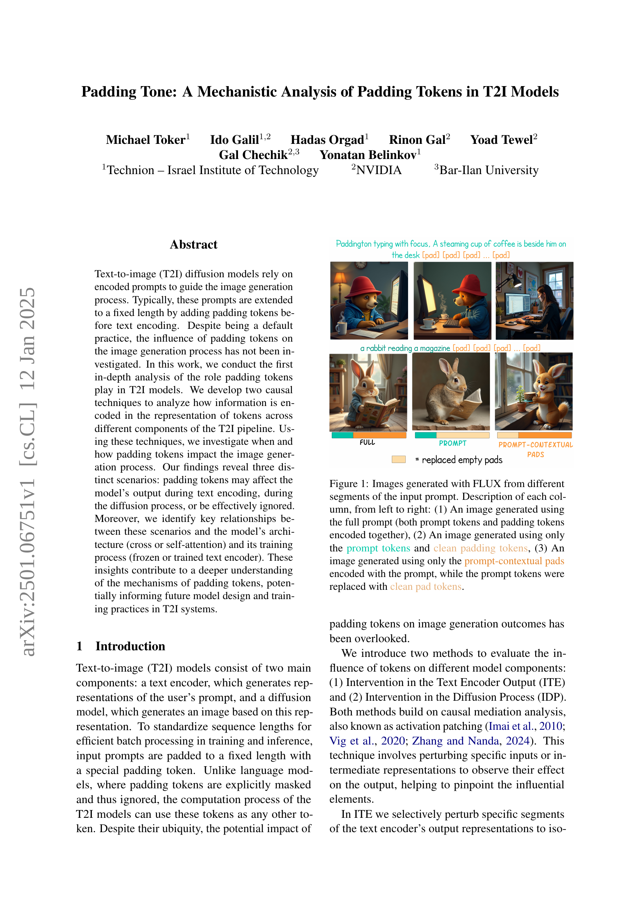
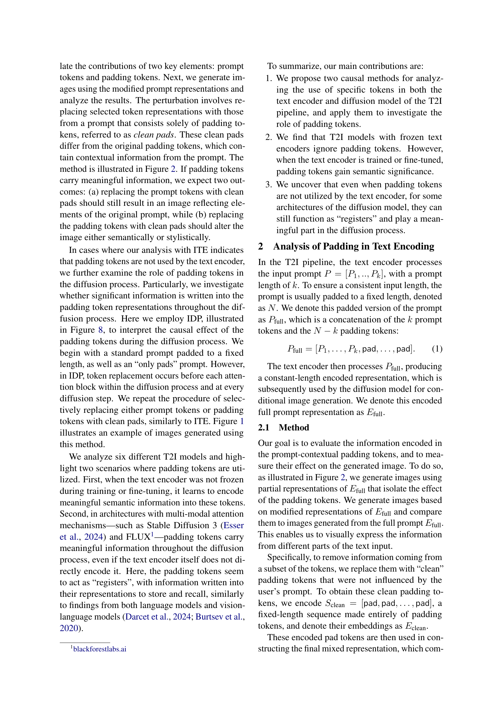
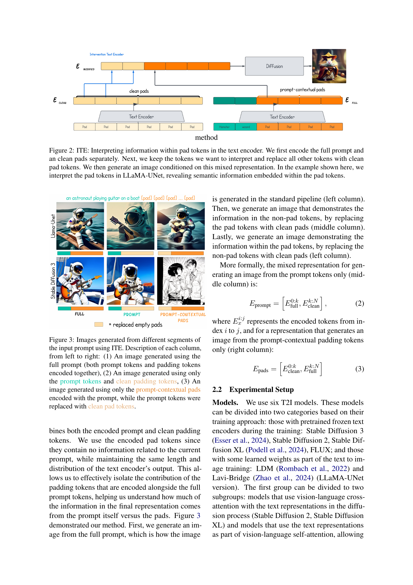
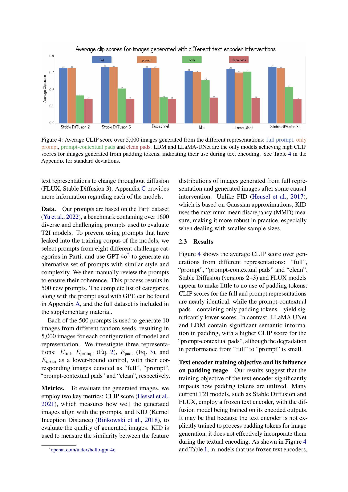
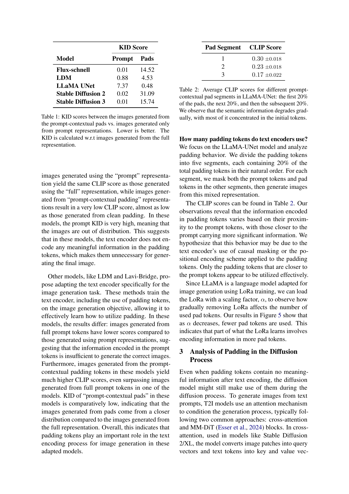
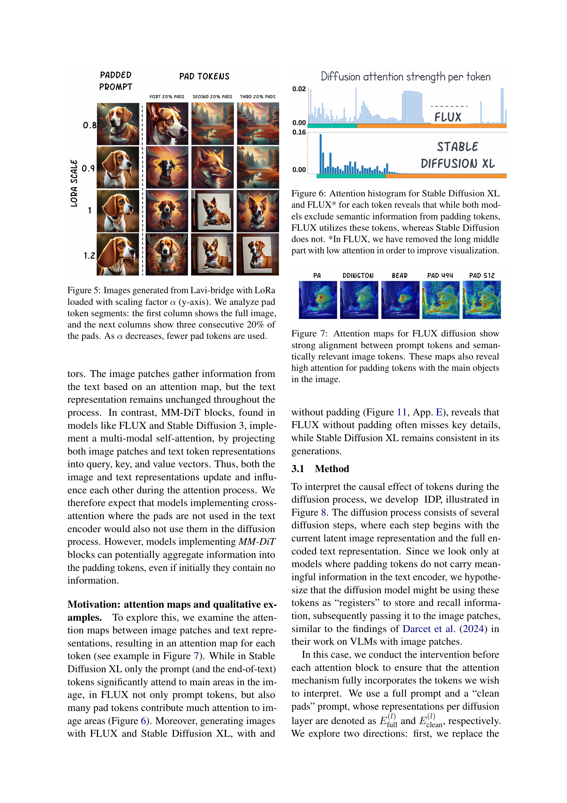
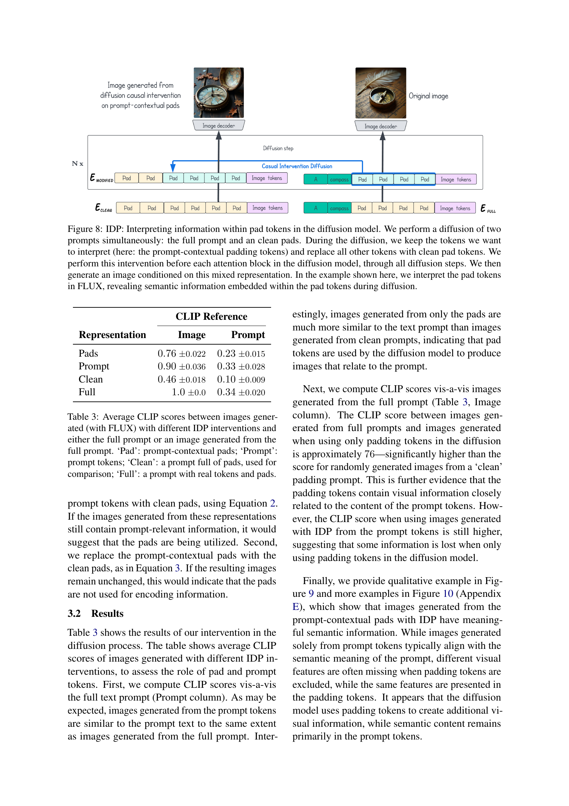
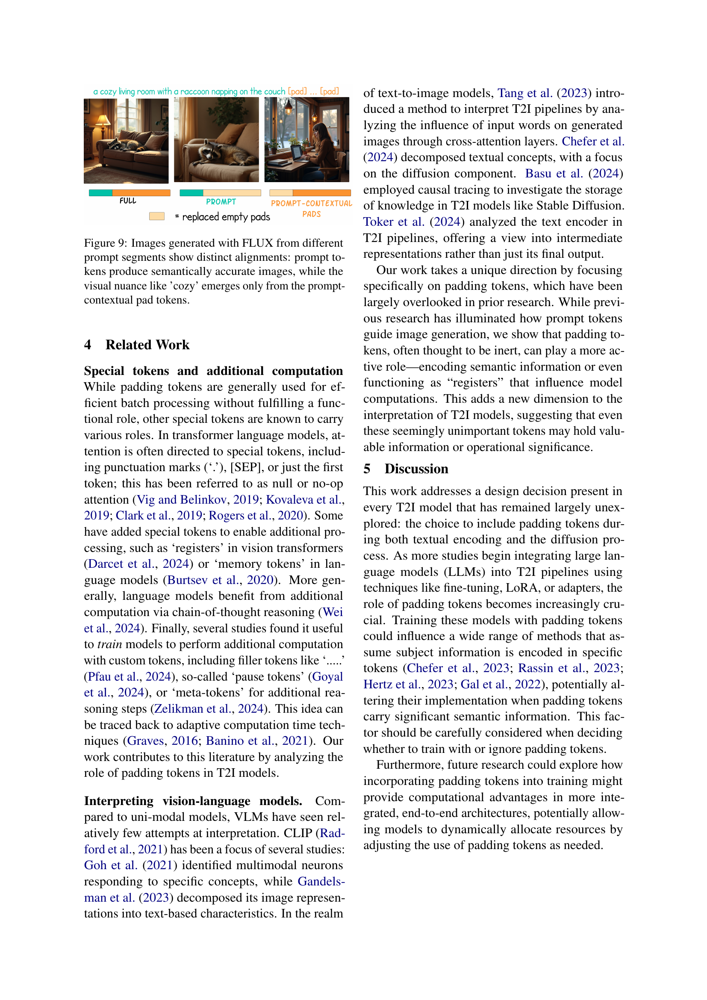
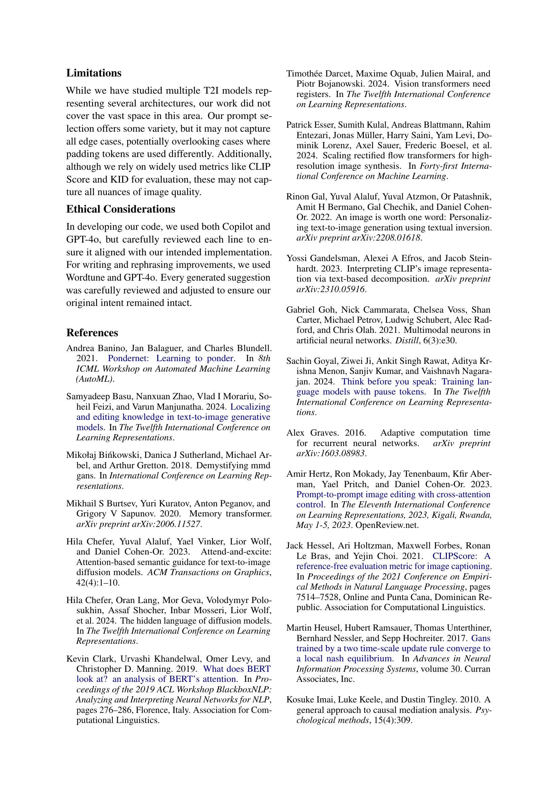
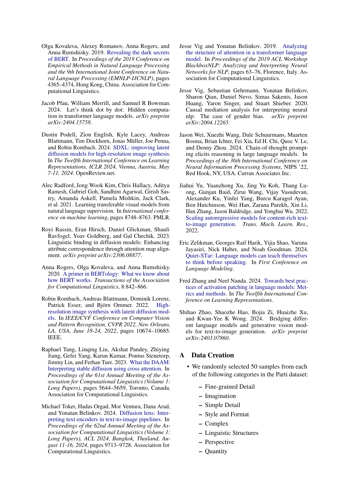
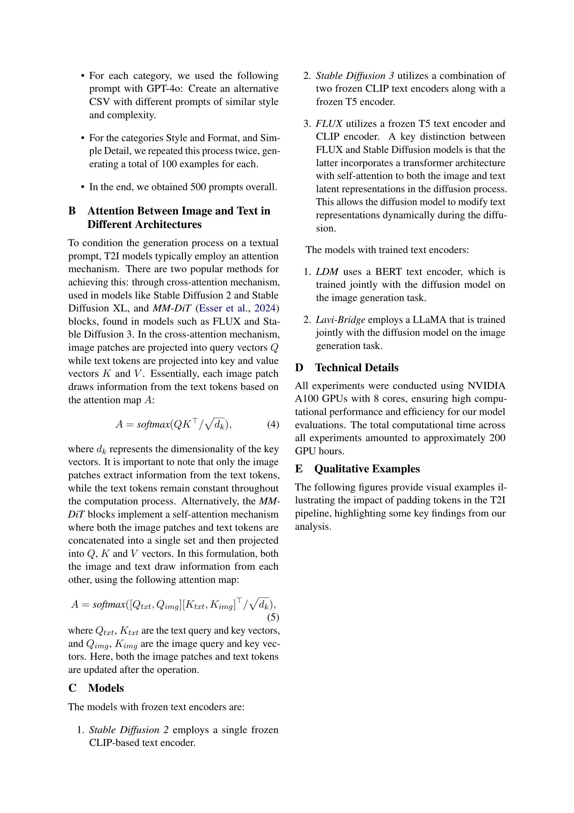
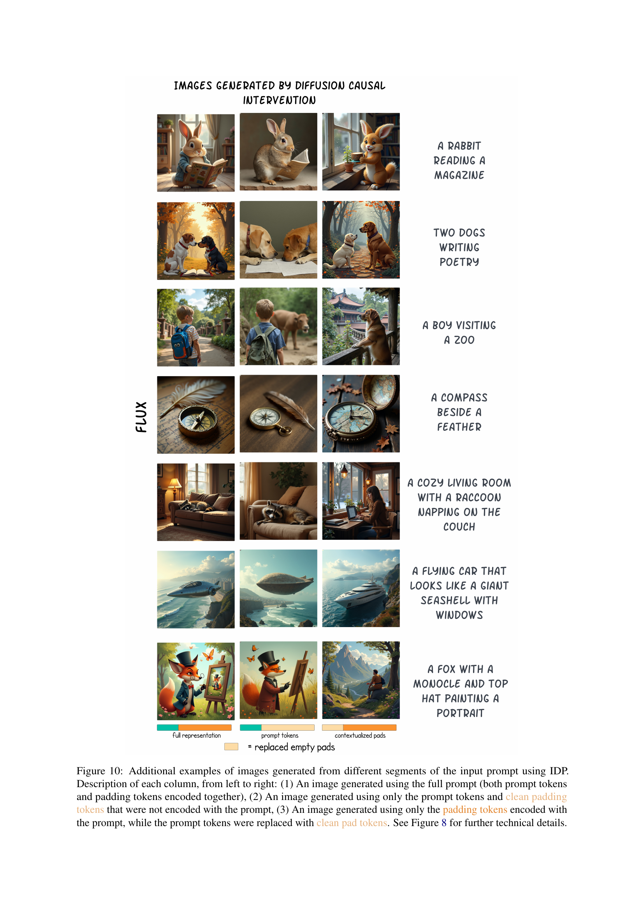
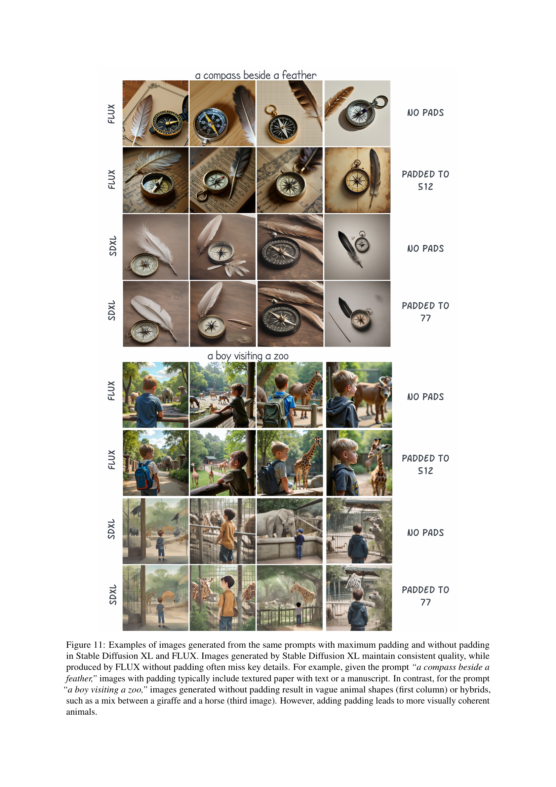
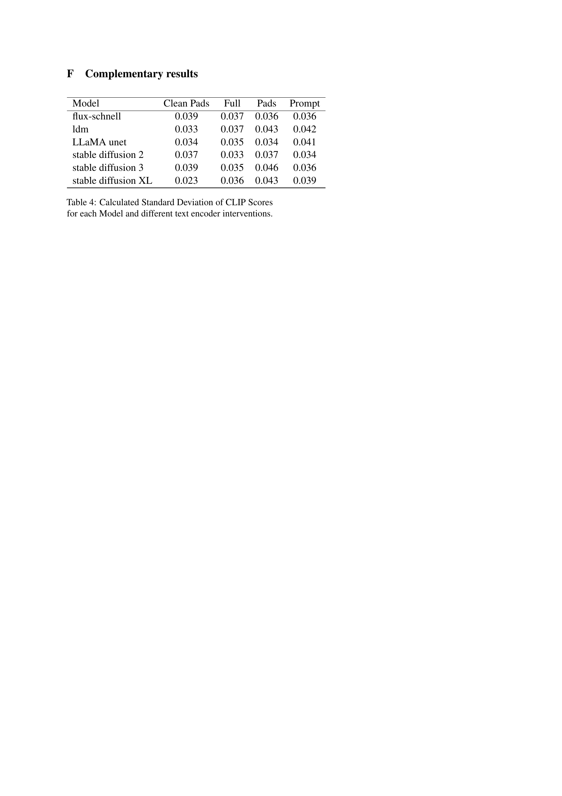
