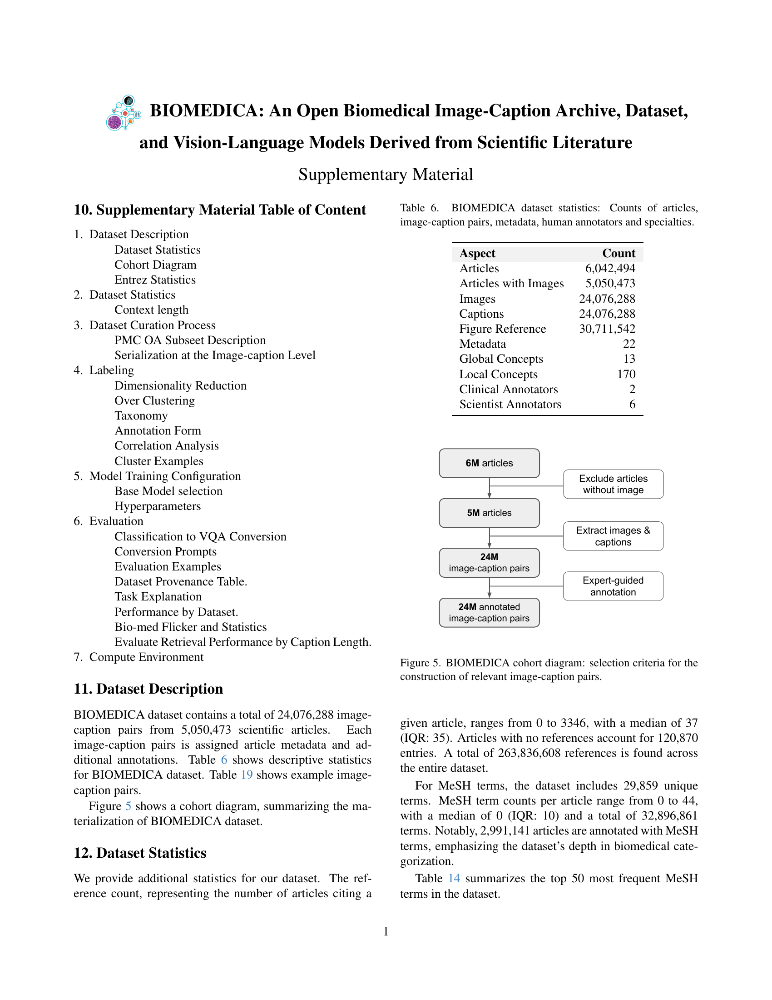
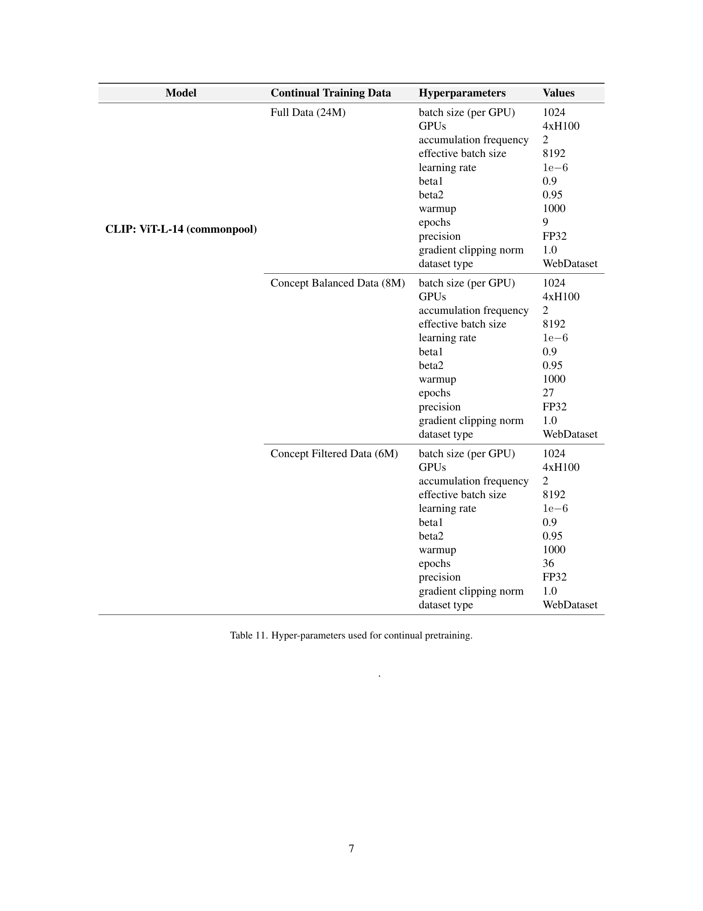

 


 2501.07171 
 Alejandro Lozano et el. 
 
 🤗 2025-01-14 
 



↗ arXiv


↗ Hugging Face


↗ Papers with Code


### TL;DR



현재 의료 분야에서는 **다양한 의료 영상과 텍스트 데이터의 부족**으로 인해, 일반화된 의료 비전-언어 모델 개발에 어려움을 겪고 있습니다. 기존 연구들은 특정 영역에만 국한되어 전체 의료 지식의 다양성을 반영하지 못하는 한계가 있습니다. 

본 연구에서는 이러한 문제를 해결하기 위해 **PubMed Central Open Access 데이터셋을 활용하여 2천4백만 개 이상의 이미지-캡션 쌍으로 구성된 대규모 공개 데이터셋 BIOMEDICA를 구축**했습니다. 또한, BIOMEDICA 데이터셋을 기반으로 학습된 최첨단 비전-언어 모델 BMCA-CLIP을 개발하고, 다양한 의료 영상 분석 작업에서 **최첨단 성능**을 달성했습니다.  BIOMEDICA는 **의료 영상 분석 분야의 지식 불균형 문제를 해결**하고, **새로운 연구 방향**을 제시할 뿐만 아니라, 다양한 **의료 영상 분석 및 진단 응용 분야**에 적용될 수 있는 잠재력을 지닌 중요한 연구입니다.



#### Key Takeaways


 대규모 의료 이미지-캡션 데이터셋 BIOMEDICA 공개 



 최첨단 비전-언어 모델 BMCA-CLIP 개발 및 성능 검증 



 생의학 영상 분석 및 진단 응용 분야의 혁신적 발전 가능성 제시 


#### Why does it matter?
본 논문은 **의료 영상 및 텍스트 데이터의 대규모 공개 데이터셋인 BIOMEDICA**를 소개하고, 이를 기반으로 학습된 최첨단 비전-언어 모델을 제시하여 **생의학 영상 분석 분야에 획기적인 발전**을 가져올 수 있음을 보여줍니다. 의료 분야의 지식 불균형 문제를 해결하고, 새로운 연구 방향을 제시하며, **다양한 의료 영상 분석 및 진단 응용 분야**에 적용 가능한 잠재력을 지닌 중요한 연구입니다.

------
#### Visual Insights

> 🔼 본 그림은 BIOMEDICA 데이터셋이 생의학 연구의 다양한 분야를 얼마나 잘 포괄하고 있는지를 보여줍니다. 각 색상과 레이블이 지정된 영역은 주제별 집중도를 반영하며, 데이터셋 내 다양한 주제를 보여줍니다. 회색 점은 데이터셋에 포함되지 않은 논문을 나타냅니다.  BIOMEDICA 데이터셋은 병리학, 방사선과, 안과, 피부과, 외과, 분자생물학, 기생충학, 세포생물학 등 광범위한 생의학 분야를 아우르는 2,400만 쌍 이상의 이미지-텍스트 데이터를 포함합니다.
> 

> 
read the caption

> Figure 1:  Overlap of \dataset dataset with the Landscape of Biomedical Research [22] Each color and labeled region reflects thematic concentrations, capturing the diversity of topics within our dataset. Gray points represent articles not present in our dataset.
> 


| Model | DM | MD | ST | SMD | Avg. |
|---|---|---|---|---|---| 
| OpenCLIP[25] | 49.67 | 85.66 | 46.77 | 29.23 | 53.03 |
| CoCa[65] | 47.29 | 71.89 | 39.27 | 48.00 | 47.29 |
| PMC-CLIP[34] | 5.56 | 14.68 | 10.92 | 12.49 | 10.91 |
| BioMedCLIP[67] | 41.54 | 74.72 | 49.74 | 32.89 | 49.72 |
| BMCA-CLIPCF | 49.07 | 78.71 | 59.17 | 14.54 | 50.37 |
| BMCA-CLIPCB | 40.07 | 83.4 | 57.28 | 25.48 | 51.55 |
| BMCA-CLIP | 44.56 | 85.70 | 58.40 | 26.72 | 53.84 |
| BMCA-CLIPCF/WiSE-FT | 58.78 | 86.88 | 60.84 | 27.65 | 58.53 |
| BMCA-CLIPCB/WiSE-FT | 52.12 | 87.21 | 61.84 | 25.04 | 56.55 |
| BMCA-CLIP/WiSE-FT | 56.26 | 83.97 | 54.81 | 27.89 | 55.73 |

> 🔼 이 표는 기존의 문헌 기반 생의학 데이터셋과 BIOMEDICA 데이터셋을 비교 분석한 결과입니다. BIOMEDICA는 기존 데이터셋보다 과학 논문 수는 2배, 이미지-캡션 쌍, 메타데이터 필드는 1.6배 더 많이 제공합니다.  또한, 스트리밍 지원 및 임상의와 과학자들이 직접 기여한 전문가 검토 개념을 제공한다는 점에서 차별화됩니다. 자세한 메타데이터 목록은 표 2를 참조하십시오.
> 

> 
read the caption

> Table 1: Comparison of our work to existing literature-based biomedical datasets. BIOMEDICA stands out by offering 2x more scientific papers and 1.6x more image-caption pairs, metadata fields, support for streaming, and expert-curated concepts from clinicians and scientists. ∗See Table 2 for a full list of provided metadata.
> 

### In-depth insights

#### Biomedical VLM Gap
생의학 분야에서의 거대 언어 모델(LLM) 발전은 **대규모의 다양한 다중 모드 데이터 세트**의 부족으로 인해 제한적입니다. 기존 연구는 특정 영역에 국한되어 있으며, 과학 문헌에 담긴 생의학 지식의 다양성을 충분히 반영하지 못합니다. **공개적으로 접근 가능한 주석이 달린 데이터 세트**가 부족하여 일반적인 생의학 VLM을 개발하는 데 어려움이 있습니다. 이러한 격차를 해결하기 위해서는 **다양한 생의학 영역을 포괄하는 대규모의 주석 달린 데이터 세트**를 구축하고, **개인 정보 보호 문제**와 **전문가 수준의 주석**과 관련된 어려움을 해결해야 합니다. 과학 문헌은 다양한 모드의 정보를 풍부하게 담고 있으므로, 이를 활용하여 대규모의 생의학 데이터 세트를 구축하는 것이 **일반적인 생의학 VLM 개발**의 중요한 해결책이 될 것입니다. 

#### BIOMEDICA Pipeline
BIOMEDICA 파이프라인은 **PubMed Central Open Access (PMC-OA) 데이터셋으로부터 방대한 생의학 이미지-캡션 데이터를 추출, 변환, 로드하는 전 과정**을 포괄합니다.  먼저, **데이터 추출 단계**에서는 PMC-OA로부터 메타데이터, 캡션, 이미지 등 다양한 정보를 수집합니다.  다음 **데이터 변환 단계**에서는 이미지에 대한 DINO v2 특징을 추출하고 PCA 및 k-means를 이용하여 클러스터링을 수행하며, 전문가의 주석을 통해 클러스터를 분류하고 전반적인 개념 체계를 구축합니다. 마지막으로 **데이터 로드 단계**에서는 Hugging Face를 통해 데이터셋을 공개하고 사용 편의성을 높입니다.  **전체 과정은 효율성과 확장성을 고려하여 설계**되었으며, 대규모 데이터셋 생성 및 관리에 필요한 여러 기술적 과제를 해결하고자 노력한 흔적이 보입니다.  **특히, 전문가 주석을 통한 정확성 확보 및 스트리밍 기반 접근 방식을 통한 효율적인 데이터 접근**은 BIOMEDICA 파이프라인의 주요 강점으로 볼 수 있습니다.

#### BMCA-CLIP Models
본 논문에서 제시된 BMCA-CLIP 모델은 **BIOMEDICA 데이터셋을 기반으로 CLIP(Contrastive Language–Image Pre-training) 모델을 지속적으로 사전 훈련(Continual Pre-training)**한 결과물입니다.  단순히 대규모 데이터셋으로 훈련하는 대신, **스트리밍 기법을 활용하여 27TB에 달하는 방대한 데이터를 효율적으로 처리**하는 전략을 채택했습니다.  이를 통해 기존의 CLIP 모델들이 갖는 성능 한계를 극복하고, 다양한 생의학 영상 분류 작업에서 **최첨단 성능**을 달성했습니다. 특히, **병리학, 방사선학, 안과학 등 다양한 의료 영역에서 우수한 제로샷(zero-shot) 성능**을 보였으며, **계산 자원을 10배나 절약**하면서도 동등하거나 더 나은 성능을 달성한 점이 주목할 만합니다.  **지속적인 사전 훈련 및 데이터 필터링/균형 조정** 등 다양한 훈련 전략을 통해 모델 성능을 향상시킨 점 또한 중요한 발견입니다.  **Hugging Face를 통해 코드, 데이터셋, 그리고 모델을 공개**하여, 지속적인 연구와 협업을 장려하고 재현성을 높이는 데 기여하고 있습니다.  **향후 연구는 짧은 문맥 길이 및 다양한 이미지 크기 문제를 해결하여 더욱 범용적이고 강력한 모델을 개발**하는 데 초점을 맞춰야 할 것입니다.

#### Benchmark Results
본 논문의 벤치마크 결과는 제시된 모델의 성능을 다양한 측면에서 평가한 것을 보여줍니다. **다양한 기존 모델들과의 비교**를 통해 제시된 모델의 우수성을 확인하고, 특히 특정 작업(예: **의학 영상 분류**)에서 **상당한 성능 향상**을 보여줍니다. 하지만, **제한된 데이터셋이나 특정 작업에 대한 편향** 등의 잠재적 한계점 또한 논의되어야 합니다.  결과 해석의 객관성을 높이기 위해 **신뢰 구간** 등의 통계적 지표를 활용한 점은 주목할 만합니다.  **실험 환경 및 데이터셋에 대한 상세한 설명**을 통해 재현성을 확보하려는 노력도 긍정적으로 평가할 수 있습니다. 전체적으로, 벤치마크 결과는 제시된 모델의 강점과 약점을 균형 있게 제시하며, 향후 연구 방향을 제시하는 데 유용한 정보를 제공합니다.  **다양한 지표**를 이용하여 종합적으로 성능을 평가하고 있으며, 이는 연구의 신뢰성을 높이는 데 기여합니다.  하지만, **추가적인 벤치마크**를 통해 더욱 폭넓은 성능 평가가 이루어질 필요가 있습니다.

#### Future Directions
본 논문에서 제시된 BIOMEDICA 데이터셋 및 BMCA-CLIP 모델은 생의학 영상-텍스트 모델링 분야에 중요한 기여를 했지만, **여전히 개선의 여지가 많다.**  미래 연구 방향은 다음과 같이 요약할 수 있다. 첫째, **데이터셋의 확장성**을 고려해야 한다. 현재 24M 이미지-캡션 쌍은 방대하지만, 의료 영상의 다양성을 완전히 포괄하기에는 부족하다. 더욱 다양한 의료 분야, 다양한 해상도 및 모달리티의 이미지, 그리고 더욱 풍부한 텍스트 정보를 포함하는 데이터셋 확장이 필요하다. 둘째, **모델의 성능 향상**을 위한 연구가 지속되어야 한다.  **Zero-shot 성능**은 향상되었지만, 특정 과제에 대한 fine-tuning을 통해 더욱 높은 정확도를 달성할 수 있다.  세째, **모델의 설명력**을 높이는 연구가 필요하다.  현재 모델은 블랙박스와 같아 의사결정 과정을 이해하기 어렵다.  모델의 예측 결과를 해석하고 신뢰도를 평가하는 방법에 대한 연구가 중요하다. 마지막으로 **데이터의 편향성** 문제를 해결해야 한다. 데이터셋의 구성에 따라 모델의 성능이 특정 분야에 편향될 수 있다. 이러한 편향성을 완화하고 공정성을 확보하기 위한 연구가 필요하다. 이러한 미래 연구 방향들을 통해 BIOMEDICA 데이터셋과 BMCA-CLIP 모델은 의료 영상 분석 분야에서 더욱 강력하고 유용한 도구가 될 것이다.

### More visual insights

More on figures

> 🔼 본 논문의 그림 2는 BIOMEDICA 데이터셋을 만드는 과정을 보여주는 흐름도입니다. 크게 세 단계 (추출, 변환, 적재)로 나뉩니다. 추출 단계에서는 PMC-OA(PubMed Central Open Access)에서 메타데이터, 캡션, 그림 참조, 전체 텍스트 및 이미지를 가져옵니다. 변환 단계에서는 DINO v2 기능을 사용하여 각 이미지에 대한 특징을 생성하고, PCA와 k-means를 사용하여 클러스터링합니다. 임상의와 과학자들은 이러한 클러스터에 주석을 달아 12개의 글로벌 개념과 170개의 로컬 개념을 식별하고 모든 이미지에 적용합니다. 마지막으로 적재 단계에서는 생성된 데이터셋이 Hugging Face에서 사용할 수 있도록 합니다.
> 

> 
read the caption

> Figure 2: \dataset curation pipeline: In the Extract phase, metadata, text (caption, figure reference, full-text), and images are sourced and processed from PMC-OA. In the Transform phase, DINO v2 features are generated for each image, followed by clustering using PCA and k-means. Clinicians and scientists annotate these clusters, identifying 12 global concepts and 170 local concepts, which are then propagated across all images. Finally, in the Load phase, the dataset is made available on Hugging Face with the listed features.
> 

> 🔼 그림 3은 BIOMEDICA 데이터셋에 포함된 이미지의 예시와 BIOMEDICA 분류 체계의 개념 분류 시각화를 보여줍니다. 왼쪽은 임상 영상부터 지도, 막대 그래프까지 다양한 유형의 이미지를 보여줍니다. 오른쪽은 파이 차트의 안쪽 원이 이미지 패널 유형(연두색은 다중 패널, 진한 연두색은 단일 패널)을, 바깥쪽 원이 개별 분류 체계의 상위 개념을 나타내고, 단어 구름은 가장 빈번한 하위 개념의 비율을 보여줍니다.
> 

> 
read the caption

> Figure 3: Left: Examples of images included in the \dataset dataset, ranging from clinical imaging to maps and bar plots. Right: Visualization of the concept breakdown in the BIOMEDICA taxonomy. The inner level of the pie chart reflects the panel type (light green indicates multi panel, dark green indicates single panel) and the outer level reflects the global concept of individual taxonomies, and the word cloud reflects the fine-grained local concept proportions for the most frequent concepts.
> 

> 🔼 본 그림은 BMCA-CLIP 모델의 성능을 기존 연구의 결과와 비교하여 보여줍니다. BMCA-CLIP 모델은 BIOMEDICA 데이터셋을 사용하여 훈련된 CLIP 스타일의 비전-언어 모델입니다. 그림은 다양한 생의학 영상 분류 작업에 대한 BMCA-CLIP의 성능을 보여주는 차트를 포함하고 있으며, 기존의 다른 모델들에 비해 BMCA-CLIP의 우수성을 시각적으로 보여줍니다.
> 

> 
read the caption

> Figure 4: Average model performance of best BMCA-CLIP models compared to prior work.
> 

> 🔼 그림 5는 BIOMEDICA 데이터셋의 구성을 보여주는 코호트 다이어그램입니다.  PMC-OA 데이터셋에서 출발하여 이미지와 캡션이 있는 기사만을 추출하고, 추가적인 전문가 검토를 거쳐 최종적으로 24M의 이미지-캡션 쌍을 선택하는 과정을 시각적으로 나타냅니다.  데이터셋 구축 과정의 각 단계별 기준과 필터링 과정을 명확히 보여줍니다.  이를 통해, BIOMEDICA 데이터셋의 규모와 다양성, 그리고 품질 관리를 위한 노력을 한눈에 파악할 수 있습니다.
> 

> 
read the caption

> Figure 5:  \dataset cohort diagram: selection criteria for the construction of relevant image-caption pairs.
> 

> 🔼 그림 6은 BIOMEDICA 데이터셋의 구축 과정을 보여줍니다. (A)는 PMC 논문들을 나타내는 사전들의 목록을 담은 JSON 파일의 구조를 보여줍니다. 각 논문 사전에는 PMID, nXML 경로, 초록, 제목, 키워드와 중첩된 그림 집합과 같은 메타데이터 필드가 포함됩니다. 그림 집합은 각각 사전에 그림의 PMID, 권호, 이미지 파일, 캡션, 문맥 등이 포함된 사전들의 목록입니다. (B)는 데이터가 여러 .tar 아카이브(예: data-000.tar, data-001.tar)에 저장되는 WebDataset 형식을 보여줍니다. 각 아카이브에는 쌍을 이룬 텍스트와 이미지 파일이 포함되어 개별 레코드를 나타냅니다.
> 

> 
read the caption

> Figure 6: A) Diagram illustrating the structure of a JSON file containing a list of dictionaries representing PMC articles. Each article dictionary includes metadata fields such as PMID, nXML path, abstract, title, keywords, and a nested figure set. The figure set is a list of dictionaries, where each dictionary contains the figure’s PMID, volume number, image file, caption, and context. B) Diagram illustrating the WebDataset format, where data is stored across multiple .tar archives (e.g., data-000.tar, data-001.tar). Each archive contains paired text and image files representing individual records.
> 

> 🔼 그림 7은 DINOv2 특징 벡터에 대한 주성분 분석(PCA) 결과를 보여주는 스크리 플롯입니다. 스크리 플롯은 PCA를 통해 추출된 주성분들의 설명된 분산 비율을 나타내는 그래프로, 각 주성분이 데이터의 전체 분산을 얼마나 잘 설명하는지를 보여줍니다. 이 플롯은 주성분 분석에서 몇 개의 주성분을 선택하는 것이 적절한지를 결정하는 데 유용하게 사용됩니다. 이 그림에서는 설명된 분산 비율의 변화를 통해 적절한 주성분의 개수를 시각적으로 확인할 수 있습니다.
> 

> 
read the caption

> Figure 7: DinoV2 features Scree plot
> 

> 🔼 그림 8은 세 명의 전문가(두 명의 임상의와 한 명의 생물정보학자)가 BIOMEDICA 데이터셋의 이미지 클러스터에 대한 레이블을 지정하는 과정에서의 의견 불일치 정도를 보여줍니다. 낮은 값일수록 레이블 지정에 대한 전문가들의 의견 일치도가 높음을 나타냅니다. 각 그래프는 패널 유형, 글로벌 분류, 로컬 분류에 대한 의견 불일치 분포를 히스토그램으로 표현하며, x축은 의견 불일치 비율(%)을, y축은 해당 비율을 가진 클러스터의 개수를 나타냅니다. 이 그림을 통해 데이터셋의 품질과 레이블 일관성에 대한 통찰력을 얻을 수 있습니다.
> 

> 
read the caption

> Figure 8: Inter-annotator disagreement (lower is better).
> 

> 🔼 본 논문의 그림 9는 데이터셋 내 토큰 수와 이미지 크기의 분포를 보여줍니다. 캡션, 그림 참조 및 본문 전체에 대한 토큰 수의 히스토그램과 이미지 너비 및 높이의 히스토그램이 표시됩니다. 중심 경향과 데이터 밀도가 높은 영역을 강조하기 위해 이상치는 제외되었습니다.
> 

> 
read the caption

> Figure 9: Distributions of token counts and image dimensions in the dataset. Histograms are shown for token counts in captions, figure references, and full text, as well as for image widths and heights. Outliers have been excluded to highlight the central tendencies and areas of higher data density.
> 

> 🔼 그림 10은 BIOMEDICA 데이터셋에 포함된 이미지의 계층적 분류 체계를 보여줍니다.  각 이미지는 전문가에 의해 여러 개의 개념으로 분류되었고, 이러한 개념들은 상위 수준의 범주와 하위 수준의 세부 범주로 계층적으로 구성되어 있습니다.  예를 들어, '임상 영상 데이터'는 'X선 사진', '컴퓨터 단층 촬영' 등의 하위 범주를 포함하고, '현미경 데이터'는 '형광 현미경', '전자 현미경' 등을 포함합니다.  이러한 계층적 구조는 이미지의 다양한 특징을 포괄적으로 표현하여,  더욱 정교하고 효율적인 이미지 검색 및 분석에 활용될 수 있도록 합니다.
> 

> 
read the caption

> Figure 10: Hierarchical Taxonomy
> 

More on tables


| Aspect | Count |
|---|---| 
| Articles | 6,042,494 |
| Articles with Images | 5,050,473 |
| Images | 24,076,288 |
| Captions | 24,076,288 |
| Figure Reference | 30,711,542 |
| Metadata | 22 |
| Global Concepts | 13 |
| Local Concepts | 170 |
| Clinical Annotators | 2 |
| Scientist Annotators | 6 |
> 🔼 이 표는 BIOMEDICA 데이터셋에 포함된 다양한 유형의 데이터에 대한 목록을 보여줍니다. 이미지 데이터(3가지), 이미지 메타데이터(5가지), 이미지 주석(4가지), 논문 메타데이터(13가지), 이미지 임베딩(2가지) 등이 포함되며, 각 데이터의 출처(concept provenance)도 함께 제시됩니다.  BIOMEDICA 데이터셋의 구성 요소를 자세히 이해하는 데 도움이 되는 표입니다.
> 

> 
read the caption

> Table 2: List of image data (n=3), image metadata (n=5), image annotations (n=4), article metadata (n=13), and image embeddings (n=2) provided in \dataset dataset, alongside concept provenance.
> 


| Subset | Serialization Time (Hrs) |
|---|---| 
| Commercial | 23:50:57 |
| NonCommercial | 7:36:35 |
| Other | 1:36:42 |
| Total | 33:04:14 |
> 🔼 이 표는 21개의 고유한 데이터셋에서 나온 35개의 분류 작업에 걸쳐 BMCA-CLIP 모델의 평균 제로샷 성능을 보여줍니다.  각 도메인과 작업별로 계층화하여, 전체 BIOMEDICA 데이터셋, 개념 필터링(CF)된 하위 집합, 개념 균형(CB)된 하위 집합에서 모델의 세 가지 변형에 대한 결과를 보여줍니다.  WiSE-FT 표시가 있는 모델은 논문 [59]에서 설명된 것처럼 병합된 모델입니다.  굵은 글씨는 최고 성능을, 밑줄은 두 번째로 높은 성능을 나타냅니다.
> 

> 
read the caption

> Table 3: General Biomedical Imaging Classification Average zero-shot performance across 35 classification tasks (from 21 unique datasets) stratified by domain and task. We show results for three variants of our model, including continual pretraining on all of \dataset, a subset after concept-filtering (CF), and a subset after concept-balancing (CB). Models with indication WiSE-FT are merged counterparts as described in [59]. Bold indicates best performance, underline indicates second best performance.
> 


| Model | Pretraining Dataset | Mean |
|---|---|---|
| ViT-L-14 | commonpool | 38.465 |
| ViT-B-32 | laion2b | 37.892 |
| ViT-SO400M-14-SigLIP | webli | 35.010 |
| ViT-L-14 | laion2b | 33.951 |
| convnext-larged-320 | laion2b | 33.773 |
| ViT-L-14 | datacomp | 33.148 |
| EVA02-B-16 | merged2b s8b b131k | 32.995 |
| RN50-quickgelu | openai | 32.736 |
| ViT-B-16-SigLIP-384 | webli | 32.482 |
| ViT-B-16-SigLIP | webli | 32.399 |
| ViT-B-16-SigLIP-256 | webli | 31.762 |
| EVA02-L-14 | merged2b s4b b131k | 31.680 |
| ViT-B-16-SigLIP-512 | webli | 31.319 |
| ViT-B-32 | commonpool | 30.614 |
| coca-ViT-B-32 | laion2b | 29.133 |
| ViT-B-32 | datacomp | 29.077 |
| convnext-B | laion2b | 28.701 |
| ViT-B-16 | laion2b | 25.786 |
| coca-ViT-L-14 | laion2b | 25.212 |
> 🔼 본 표는 BioMed-Flickr 데이터셋에 대한 Top-K 검색 성능을 보여줍니다.  각 모델(OpenCLIP, CoCa, PMC-CLIP, BiomedCLIP, 그리고 다양한 BMCA-CLIP 변형)의 이미지-텍스트 및 텍스트-이미지 검색 정확도(Recall@1, Recall@10, Recall@100)를 비교하여, BMCA-CLIP 모델의 우수한 성능을 강조합니다.  굵은 글씨는 가장 좋은 성능을, 밑줄은 두 번째로 좋은 성능을 나타냅니다.
> 

> 
read the caption

> Table 4: Top-K retrieval performance on BioMed-Flickr.Bold indicates best performance, underline indicates second best performance.
> 


| Model | Continual Training Data | Hyperparameters | Values |
|---|---|---|---|
| CLIP: ViT-L-14 (commonpool) | Full Data (24M) | batch size (per GPU) | 1024 |
|  |  | GPUs | 4xH100 |
|  |  | accumulation frequency | 2 |
|  |  | effective batch size | 8192 |
|  |  | learning rate | 1e-6 |
|  |  | beta1 | 0.9 |
|  |  | beta2 | 0.95 |
|  |  | warmup | 1000 |
|  |  | epochs | 9 |
|  |  | precision | FP32 |
|  |  | gradient clipping norm | 1.0 |
|  |  | dataset type | WebDataset |
|  | Concept Balanced Data (8M) | batch size (per GPU) | 1024 |
|  |  | GPUs | 4xH100 |
|  |  | accumulation frequency | 2 |
|  |  | effective batch size | 8192 |
|  |  | learning rate | 1e-6 |
|  |  | beta1 | 0.9 |
|  |  | beta2 | 0.95 |
|  |  | warmup | 1000 |
|  |  | epochs | 27 |
|  |  | precision | FP32 |
|  |  | gradient clipping norm | 1.0 |
|  |  | dataset type | WebDataset |
|  | Concept Filtered Data (6M) | batch size (per GPU) | 1024 |
|  |  | GPUs | 4xH100 |
|  |  | accumulation frequency | 2 |
|  |  | effective batch size | 8192 |
|  |  | learning rate | 1e-6 |
|  |  | beta1 | 0.9 |
|  |  | beta2 | 0.95 |
|  |  | warmup | 1000 |
|  |  | epochs | 36 |
|  |  | precision | FP32 |
|  |  | gradient clipping norm | 1.0 |
|  |  | dataset type | WebDataset |
> 🔼 본 표는 μ-Bench Perception 데이터셋의 병리학 및 생물학 분야 4가지 세분화된 분류 작업에 대한 현미경 구성 요소 식별 성능을 보여줍니다. 표에는 각 작업에 대한 여러 모델의 성능(정확도)이 제시되며, 최고 성능은 굵게, 두 번째로 높은 성능은 밑줄로 표시되어 있습니다. 이 표는 다양한 모델의 현미경 이미지 분석 능력을 비교하여 각 모델의 강점과 약점을 파악하는 데 도움이 됩니다.
> 

> 
read the caption

> Table 5: Microscopy Composition Identification Performance in 4 course-grained classification tasks from μ𝜇\muitalic_μ-Bench Perception across pathology and biology. Bold indicates best performance, underline indicates second best performance.
> 


| MeSH Term | Frequency |
|---|---| 
| Humans | 2,189,713 |
| Female | 990,873 |
| Male | 897,332 |
| Animals | 775,314 |
| Adult | 521,585 |
| Middle Aged | 483,806 |
| None | 375,532 |
| Aged | 371,170 |
| Mice | 288,320 |
| Young Adult | 205,580 |
| Adolescent | 200,700 |
| Retrospective Studies | 178,740 |
| Child | 166,187 |
| COVID-19 | 149,167 |
| Cross-Sectional Studies | 135,551 |
| Risk Factors | 135,111 |
| Treatment Outcome | 131,638 |
| Aged, 80 and over | 125,351 |
| Signal Transduction | 109,685 |
| SARS-CoV-2 | 100,287 |
| Cell Line, Tumor | 100,154 |
| Surveys and Questionnaires | 98,150 |
| Prospective Studies | 96,729 |
| Prognosis | 89,765 |
| Rats | 89,433 |
| Pregnancy | 88,439 |
| Child, Preschool | 79,751 |
| Mutation | 79,073 |
| Biomarkers | 77,093 |
| Disease Models, Animal | 76,046 |
| Cell Proliferation | 75,080 |
| Time Factors | 75,034 |
| Mice, Inbred C57BL | 72,500 |
| Infant | 71,594 |
| Pandemics | 70,915 |
| China | 68,963 |
| Algorithms | 64,904 |
| Neoplasms | 64,674 |
| Cohort Studies | 64,563 |
| Reproducibility of Results | 62,995 |
| Phylogeny | 62,412 |
| Prevalence | 61,952 |
| Apoptosis | 61,057 |
| Cells, Cultured | 58,811 |
| Cell Line | 57,933 |
| Gene Expression Profiling | 57,680 |
| Brain | 57,472 |
| Case-Control Studies | 57,044 |
| Quality of Life | 56,170 |
| Infant, Newborn | 55,529 |
> 🔼 이 표는 BIOMEDICA 데이터셋의 통계를 요약하여 보여줍니다.  총 기사 수, 이미지-캡션 쌍의 수, 메타데이터 항목 수, 데이터셋에 참여한 전문가(의사 및 과학자) 수 등을 포함하고 있습니다.  데이터셋의 규모와 전문가 참여의 정도를 한눈에 파악하는 데 유용합니다.
> 

> 
read the caption

> Table 6: \dataset dataset statistics: Counts of articles, image-caption pairs, metadata, human annotators and specialties.
> 


| Category | Other | Commercial | Noncommercial | Total |
|---|---|---|---|---|
| Scientific Formulae and Equations | 2,322 | 20,384 | 6,182 | 28,888 |
| PCR | 2,307 | 25,353 | 7,693 | 35,353 |
| Tools and Materials | 10,320 | 210,740 | 51,339 | 272,399 |
| Maps | 18,700 | 264,092 | 41,473 | 324,265 |
| Hand Drawn and Screen Based Visuals | 24,690 | 356,047 | 76,404 | 457,141 |
| Graph and Network | 26,453 | 415,737 | 83,470 | 525,660 |
| Tables | 26,190 | 269,384 | 343,455 | 639,029 |
| Immuno Assays | 38,055 | 651,339 | 215,238 | 904,632 |
| Chemical Structures | 92,881 | 839,082 | 196,119 | 1,128,082 |
| Clinical Imaging | 82,349 | 1,078,901 | 766,908 | 1,928,158 |
| Microscopy | 101,617 | 1,818,302 | 597,413 | 2,517,332 |
| Illustrative Diagrams | 140,925 | 2,227,690 | 551,380 | 2,919,995 |
| Plots and Charts | 542,718 | 9,426,147 | 2,394,358 | 12,389,066 |
> 🔼 표 7은 BIOMEDICA 데이터셋의 통계적 개요를 보여줍니다. 텍스트 토큰 및 문자 길이, 이미지 크기 등의 세부 정보를 제공합니다. 텍스트 통계의 경우, 토큰은 tiktoken 라이브러리의 BPE 토크나이저를 사용하여 생성됩니다.
> 

> 
read the caption

> Table 7: Overview of dataset statistics, detailing text token and character lengths, and image dimensions. For text statistics, tokens are generated using the BPE tokenizer from the tiktoken library
> 


| License Type | Number of Articles |
|---|---| 
| CC0 | 132592 |
| CC BY | 3795419 |
| CC BY-SA | 1287 |
| CC BY-ND | 7900 |
| CC BY-NC | 771755 |
| CC BY-NC-SA | 275638 |
| CC BY-NC-ND | 642982 |
| Other | 414857 |
> 🔼 이 표는 PMC-OA 하위 집합별 데이터 직렬화에 걸린 총 시간을 보여줍니다.  PMC-OA는 PubMed Central Open Access의 약자이며, 과학 논문의 오픈 액세스 하위 집합입니다. 이 표는 상업용, 비상업용, 기타 라이선스 유형으로 분류된 하위 집합별로 직렬화에 소요된 시간(시간)을 보여줍니다. 이를 통해 각 라이선스 유형의 데이터 크기와 복잡성에 따라 직렬화 시간이 어떻게 달라지는지 파악하는 데 도움이 됩니다.
> 

> 
read the caption

> Table 8: Total Serialization time by PMC-OA subset
> 

### Full paper



