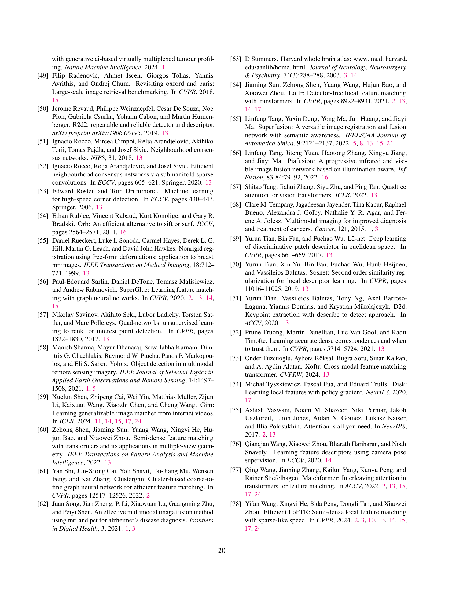

 


 2501.07556 
 Xingyi He et el. 
 
 🤗 2025-01-15 
 



↗ arXiv


↗ Hugging Face


↗ Papers with Code


### TL;DR



본 논문은 **다양한 영상 모달리티(예: MRI, CT, 위성 사진) 간의 이미지 매칭**이 어려운 점을 다룹니다. 기존 방법들은 특정 모달리티에 특화되어 있거나, 데이터 부족으로 일반화 성능이 떨어지는 문제가 있습니다.  이를 해결하기 위해 **합성 데이터를 활용한 대규모 사전 훈련 프레임워크**를 제안합니다.

제안된 프레임워크는 **다양한 데이터 소스(다시점 영상, 비디오, 단일 영상)**를 활용하여 모델을 훈련시키고, **영상 변환 네트워크**를 통해 다양한 모달리티 간의 합성 훈련 데이터를 생성합니다. 이를 통해 **8가지 이상의 다중 모달리티 이미지 매칭 과제**에서 기존 방법보다 우수한 성능을 달성했습니다. **의료 영상, 원격 탐사, 자율 주행** 등 다양한 분야에 적용 가능성을 확인했습니다.



#### Key Takeaways


 대규모 사전 훈련을 통해 다양한 영상 모달리티 간의 이미지 매칭 문제를 해결 



 합성 데이터를 활용한 혁신적인 사전 훈련 전략으로 실제 데이터 부족 문제 해결 



 의료 영상 분석, 원격 탐사, 자율 주행 등 다양한 분야에 적용 가능한 범용적인 이미지 매칭 기술 개발 


#### Why does it matter?
**본 논문은 다양한 영상 모달리티 간의 이미지 매칭 문제를 해결하기 위해 대규모 사전 훈련 프레임워크를 제시함으로써, 의료 영상 분석, 원격 탐사, 자율 주행 등 다양한 분야에 적용 가능한 범용적인 이미지 매칭 기술을 개발하는 데 중요한 의미를 가집니다.**  **특히, 합성 데이터를 활용한 혁신적인 사전 훈련 전략은 실제 데이터 부족 문제를 효과적으로 해결하여, 의료 등 데이터 획득이 어려운 분야에서도 뛰어난 성능을 달성할 수 있는 가능성을 제시합니다.** 이는 관련 연구 분야의 발전에 크게 기여하고, 새로운 응용 분야를 개척할 수 있는 잠재력을 가지고 있습니다.

------
#### Visual Insights

> 🔼 본 그림은 논문에서 제시된 대규모 사전 훈련 프레임워크로 사전 훈련된 이미지 매칭 모델의 성능을 보여줍니다. 녹색 선은 이미지 내에서 일치하는 픽셀 위치를 나타냅니다. 동일한 네트워크 가중치를 사용하여 변환기 기반의 검출기 없는 매처 [78]는 다양한 실제 환경의 이미 보지 못한 단일 및 교차 모드 매칭 작업에서 뛰어난 일반화 능력을 보여주며, 의료 이미지 분석, 조직병리학, 원격 감지, 무인 항공기 위치 확인, 자율 주행 등 다양한 분야의 응용 프로그램에 도움이 됩니다. 그림은 색상으로 보고 확대하여 보는 것이 좋습니다.
> 

> 
read the caption

> Figure 1: Capabilities of the image matching model pre-trained by our framework. Green lines indicate the identified corresponding pixel localizations between images. Using the same network weight, the detector-free matcher [78] with Transformer exhibits impressive generalization abilities across extensive unseen real-world single- and cross-modality matching tasks, benefiting diverse applications in disciplines such as (a) medical image analysis, (b) histopathology, (c) remote sensing, autonomous systems including (d) UAV positioning, (e) autonomous driving, and more. The figure is best viewed in color and with zoom-in for clarity.
> 


| Method | Harvard Brain |  | Visible-Thermal Aerial View |  | Visible-SAR |  | Visible-Semantic Map |  |
|---|---|---|---|---|---|---|---|---|
|  | SR@5pix | SR@10pix | SR@5pix | SR@10pix | SR@5pix | SR@10pix | SR@5pix | SR@10pix |
|---|---|---|---|---|---|---|---|---|
| Full | **12.15** | **31.70** | **30.01** | 43.65 | **70.91** | **93.29** | **69.10** | **90.40** |
| (1) w/o all cross-modality signals | 8.86 | 19.96 | 14.29 | 19.98 | 40.01 | 51.29 | 2.20 | 3.00 |
| (2) replaced by photometric augmentations | 9.29 | 22.01 | 14.79 | 21.87 | 42.11 | 55.62 | 1.60 | 3.50 |
| (3) w/o synthetic thermal modality | 10.60 | 30.49 | 21.29 | 33.96 | 53.41 | 86.91 | 69.70 | 86.40 |
| (4) w/o synthetic night-time modality | 9.88 | 27.61 | 26.91 | 37.28 | 55.56 | 83.61 | 50.10 | 79.80 |
| (5) w/o depth modality | 10.01 | 25.31 | 22.71 | 35.98 | 64.88 | 88.12 | 40.70 | 65.20 |
| (6) multi-stages training | 12.10 | 30.17 | 26.89 | 40.01 | 65.83 | 86.19 | 63.10 | 83.40 |
| (7) w/o single-image dataset | 9.37 | 25.87 | 27.80 | **44.31** | 53.69 | 71.04 | 54.60 | 76.90 |
| (8) w/o video dataset | 8.12 | 27.94 | 24.56 | 33.12 | 57.42 | 74.29 | 61.50 | 80.30 |
| (9) w/o coarse-to-fine design in video dataset | 10.51 | 29.26 | 26.25 | 39.21 | 63.81 | 90.43 | 67.50 | 85.70 |

> 🔼 표 1은 ROMA 매칭 모델을 사용하여 여러 가지 교차 모달 매칭 작업에서 프레임워크의 설계 선택을 검증하기 위해 수행한 실험 결과를 보여줍니다.  성공률을 측정 기준으로 사용했습니다. (1-5)에서 보듯이, 교차 모달 훈련 신호의 각 구성 요소를 생략하거나 사진 측정 증강으로 대체하면 모든 작업에서 성능이 일관되게 저하됩니다. 이는 교차 모달 훈련 데이터를 사용하면 매칭 모델이 보이지 않는 교차 모달 이미지 쌍에 일반화할 수 있다는 것을 보여줍니다. (6-8)은 다중 자원 혼합 훈련 전략의 효과를 보여줍니다. 동시 훈련에서 다단계 훈련으로 전환하거나 단일 이미지 또는 비디오 시퀀스 데이터 세트를 제외하면 성능이 저하됩니다. 마지막으로 (9)는 비디오 시퀀스 데이터 세트에서 기준 매칭을 생성하는 데 제안된 조잡한 미세 프레임워크의 중요성을 강조합니다.
> 

> 
read the caption

> Extended Data Table 1: Ablation Studies. We conduct experiments to validate the design choices of our framework with the ROMA matching model on multiple cross-modality matching tasks. The success rate at different thresholds is used as a metric. As shown in (1-5), omitting each component of the cross-modality training signals or replacing them with photometric augmentations consistently degrades performance across all tasks. This demonstrates the effectiveness of using cross-modality training data in enabling the matching model to generalize to unseen cross-modality image pairs. (6-8) demonstrate the effectiveness of the multi-resource mixture training strategy. Switching from simultaneous to multi-stage training, or excluding either single-image or video sequence datasets, results in performance degradation. Finally, (9) highlights the importance of the proposed coarse-to-fine framework in generating ground truth matches on the video sequence dataset.
> 

### In-depth insights

#### Universal Matcher
본 논문에서 제시된 "Universal Matcher"는 **다양한 모달리티의 이미지 매칭 문제에 대해 일반화된 성능**을 보이는 모델을 의미합니다. 기존의 이미지 매칭 기법들은 특정 모달리티나 제한된 조건에 최적화되어 다른 조건에서는 성능이 저하되는 한계를 가지고 있습니다. 하지만, Universal Matcher는 **대규모 사전 학습**을 통해 **다양한 이미지 유형과 모달리티에 대한 일반화 능력**을 확보하여 이러한 문제를 해결합니다. 특히, **합성 데이터를 활용한 훈련**을 통해 실제 환경에서 얻기 어려운 대량의 다양한 데이터를 확보하고, 이를 통해 모델의 **로버스트성과 일반화 성능**을 향상시킨 점이 핵심입니다.  결과적으로 Universal Matcher는 의료 영상 분석, 원격 탐사, 자율 주행 등 다양한 분야에 적용 가능하며, **단일 네트워크 가중치**로 여러 이미지 매칭 작업을 수행할 수 있음을 보여줍니다. 이는 **시간 및 자원 절약**에 큰 효과를 가져올 수 있으며, 향후 멀티모달 인공지능 연구 발전에 크게 기여할 것으로 예상됩니다.

#### Synthetic Data
본 논문에서 합성 데이터의 역할은 **교차 모드 매칭 모델의 일반화 성능을 향상시키는 데 매우 중요**합니다. 실제 교차 모드 이미지 데이터는 구하기 어렵고 주석 달기가 어렵기 때문에, 합성 데이터를 사용하여 다양한 조건과 모달리티의 이미지 쌍을 생성함으로써 모델이 훈련될 수 있습니다. **합성 데이터는 이미지 변환 네트워크를 활용하여 실제 이미지를 다른 모달리티로 변환**하는 방식으로 생성됩니다. 이를 통해 모델은 외관의 변화에 영향을 받지 않고 이미지의 기본 구조를 인식하고 일치시키는 능력을 학습하게 됩니다. **여러 데이터 소스를 결합하여 합성 데이터를 생성하는 전략**은 모델의 강건성과 일반화 능력을 향상시키는 데 중요한 역할을 합니다. 다양한 조건과 모달리티를 포함하는 합성 데이터를 통해 모델은 실제 환경에서 마주칠 수 있는 다양한 상황에 더 잘 적응할 수 있게 됩니다. **결론적으로, 합성 데이터는 교차 모달리티 이미지 매칭 모델의 성능을 크게 향상**시키고 실제 응용 분야에서의 적용 가능성을 확대하는 데 필수적인 요소입니다.

#### Cross-Modality
본 논문은 **다양한 영상 모달리티 간의 매칭 문제**를 해결하는 데 초점을 맞추고 있습니다.  기존의 영상 매칭 방법들은 단일 모달리티 데이터에 특화되어 있어, 서로 다른 영상 모달리티(예: 적외선, 가시광선, 의료 영상 등) 간의 매칭 성능이 저하되는 한계를 가지고 있었습니다.  이를 극복하기 위해 본 논문에서는 **대규모 사전 학습 프레임워크**를 제시하며, **합성 데이터를 활용**하여 모델의 일반화 능력을 향상시켰습니다.  **다양한 데이터 소스**를 통합하여 모델이 다양한 영상 구조를 인식하고 매칭할 수 있도록 학습시킨 것이 핵심입니다.  결과적으로, 제안된 방법은 여러 가지 미지의 교차 모달리티 영상 매칭 작업에서 기존 방법들을 능가하는 성능을 보이며, **의료 영상 분석, 원격 탐사, 자율 주행 시스템 등 다양한 분야**에 적용 가능성을 시사합니다. 특히, **합성 데이터를 이용한 사전 학습**은 실제 데이터의 부족 문제를 해결하는 중요한 전략으로 제시되었으며, 앞으로의 교차 모달리티 영상 매칭 연구에 큰 영향을 미칠 것으로 예상됩니다.

#### Generalization
본 논문에서 다루는 "일반화(Generalization)" 개념은 제시된 대규모 사전 학습 프레임워크의 핵심 성과 중 하나입니다. **다양한 영상 데이터와 모달리티를 활용한 사전 학습을 통해, 모델은 이전에 보지 못한 다양한 크로스-모달리티 이미지 매칭 작업에서도 뛰어난 성능을 보여줍니다.** 이는 기존 방법들이 특정 작업에 맞춰 세밀하게 조정되어 일반화 능력이 떨어지는 것과 대조적입니다. **본 연구는 합성 데이터를 포함한 다양한 데이터 소스를 활용하여 모델의 일반화 능력을 향상시켰으며, 이를 통해 의료 영상 분석, 조직병리학, 원격 탐사 등 다양한 분야에 적용 가능성을 높였습니다.**  특히, 동일한 네트워크 가중치를 사용하여 8개 이상의  크로스-모달리티 등록 작업에서 우수한 성능을 달성한 점은 **일반화 능력의 탁월함**을 보여주는 중요한 지표입니다.  **단일 네트워크 가중치로 다양한 작업에 적용될 수 있는 일반화 능력은 실제 응용 분야에서 매우 중요한 의미를 지닙니다.**

#### Future Work
본 논문의 핵심은 **다양한 모달리티의 이미지 매칭에 대한 일반화 성능을 크게 향상**시킨 대규모 사전 학습 프레임워크를 제시한 것입니다.  하지만, 아직 개선의 여지가 있으며, 미래 연구 방향으로는 다음과 같은 부분에 집중할 수 있을 것입니다. 첫째, **더욱 다양한 모달리티와 데이터셋을 포함**하여 프레임워크의 강건성과 일반화 능력을 더욱 향상시킬 수 있습니다. 특히, 항공 사진이나 위성 이미지와 같이 극심한 시점 변화를 포함하는 데이터를 추가하는 것이 중요하며, 이는 현실 세계 적용에 필수적입니다. 둘째, **효율적인 최적화 기법**을 연구하여 현재의 계산 비용을 줄일 필요가 있습니다.  특히, 실시간 응용을 위해서는 처리 속도를 높이는 것이 중요한 과제입니다. 셋째, **의료 영상과 같이 민감한 데이터**를 다룰 때 프라이버시 보호에 대한 연구가 필요합니다.  **연합 학습**과 같은 기술을 활용하여 데이터 보안을 유지하면서 모델의 성능을 향상시킬 수 있는 방안을 모색해야 합니다. 마지막으로, **다양한 downstream task**에 대한 적용 연구가 필요합니다. 이미지 매칭 기술은 의료 영상 분석, 자율 주행, 원격 탐사 등 다양한 분야에 활용될 수 있으며, 각 분야의 특징을 고려한 최적화된 모델을 개발하는 것은 중요한 미래 연구 과제입니다.

### More visual insights

More on figures

> 🔼 그림 2는 제안된 대규모 사전 학습 프레임워크를 사용하여 훈련된 모델과 네 가지 대표적인 기준 모델 간의 다양한 의료 영상(Harvard Brain 데이터셋과 Liver CT-MR 데이터셋)의 교차 모드 단층 촬영 영상등록 작업 결과를 비교 분석한 그림입니다. 그림의 좌측 상단에는 다양한 임계값에 따른 성공률(SR) 측정값의 변화 곡선을, 좌측 하단에는 SR@10 픽셀 지표에 대한 상세한 비교 분석과 상대적 개선율을 보여줍니다. 또한, 우측에는 예측된 매칭 및 정렬된 이미지에 대한 정성적 비교 분석 결과가 나타나 있으며, 매칭 오류에 따라 색상이 다르게 표시되어 녹색은 오류가 5픽셀 미만임을 나타냅니다. 기준 모델과의 정량적 비교 분석 결과는 Extended Data Table 2에 자세히 제시되어 있습니다.
> 

> 
read the caption

> Figure 2: Comparisons on cross-modality tomography image registration datasets. Our trained models are compared with four representative baselines. Parts a and b are the results of the Harvard Brain dataset and Liver CT-MR dataset respectively. The curve of the success rate (SR) metric under different thresholds is shown on the left-up side of each part, where the detailed comparisons with relative improvements on SR@10 pixels metric are shown on the left-down side. Qualitative comparisons of predicted matches and aligned images are shown on the right side of each section. The matches are colored by the match error, where the green color means that the match error is less than 5 pixels. For a full table of quantitative comparisons with baselines, see the Extended Data Tab.  2.
> 

> 🔼 그림 3은 제안된 방법의 성능을 평가하기 위해 수행된 실험 결과를 보여줍니다. (a) 부분은 ANHIR 데이터셋을 사용한 조직 병리 이미지 레지스트레이션 작업의 결과를, (b) 부분은 FIRE 데이터셋을 사용한 망막 이미지 레지스트레이션 작업의 결과를 보여줍니다. 각 부분의 상단 표는 최첨단 기법들과의 정량적 비교 결과를, 하단 그림은 제안된 모델의 매칭 및 레지스트레이션 결과를 시각적으로 보여줍니다.  즉, 서로 다른 염색 방식으로 염색된 조직 이미지 또는 서로 다른 시점에서 촬영된 망막 이미지와 같이, 다양한 조건에서 촬영된 이미지들 간의 대응점을 찾는 모델의 성능을 보여줍니다.
> 

> 
read the caption

> Figure 3: Results on cross-modality histology registration and retina image registration tasks. Parts a, b show the results of the histology registration task evaluated on the ANHIR dataset and the results of the retina image registration task using the FIRE dataset. For each part, the upper table shows the quantitative comparisons with state-of-the-art baselines, whereas the lower figure shows the matching and registration results of our trained models.
> 

> 🔼 그림 4는 가시광선-열화상 등록 작업에 대한 결과를 보여줍니다. 본 연구에서 제안된 모델과 네 가지 대표적인 기준 모델 간의 비교 결과를 제시합니다. (a), (b), (c)는 각각 원격 탐사, 항공 촬영, 지상 촬영 장면에 대한 결과를 보여줍니다. 각 파트의 왼쪽 열에는 기준 모델들과의 정량적 비교 결과가 나와 있으며, 임계값 범위에 따른 성공률(SR)과 Part a는 SR@10 픽셀, Part b, c는 SR@10도를 사용한 상대적 성능 향상을 보여줍니다. 오른쪽 열에는 매칭 품질 및 등록 오류 측면에서 기준 모델들과의 정성적 비교 결과가 나와 있습니다. Part a의 경우, 매칭 오류가 5픽셀 미만인 경우 녹색으로 표시되고, Part b, c의 경우 에피폴라 오류가 3×10⁻³ 미만인 경우 녹색으로 표시됩니다. Part a에서는 정렬된 이미지와 왜곡 오류가, Part b, c에서는 자세 추정 오류가 표시됩니다. 기준 모델과의 정량적 비교 결과에 대한 자세한 내용은 Extended Data Table 2를 참조하십시오.
> 

> 
read the caption

> Figure 4: Results on visible-thermal registration tasks. Our trained models are compared with four representative baselines. Parts a, b, c show the results on remote sensing, aerial view, and ground view scenes respectively. The left column of each part shows the quantitative comparisons with baselines using success rates (SR) with a range of thresholds, as well as the detailed comparisons with relative improvements using SR@10 pixels for Part a, and SR@10°°\degree° for Parts b, c. The right column shows the qualitative comparisons with baselines in terms of matching quality and registration error. The green matches mean the match errors are less than 5 pixels for Part a and epipolar error is less than 3×10−33superscript1033\times 10^{-3}3 × 10 start_POSTSUPERSCRIPT - 3 end_POSTSUPERSCRIPT for Parts b, c. The aligned images and warping errors are shown in Part a and the pose estimation errors are shown in Part b, c. For a full table of quantitative comparisons with baselines, see Extended Data Tab. 2.
> 

> 🔼 그림 5는 가시광선-SAR 및 가시광선-벡터화 지도 등록 작업에 대한 결과를 보여줍니다. 훈련된 모델을 네 개의 대표적인 기준 모델과 비교합니다. 왼쪽 열에는 임계값 범위에서 기준 모델과의 정량적 비교를 성공률(SR) 지표를 사용하여 보여주고, 기준 모델보다 방법의 상대적 개선 사항을 SR@10 픽셀을 사용하여 자세히 보여줍니다. 오른쪽 열에는 일치 품질과 일치에서 복구된 변환으로 정렬된 이미지를 비교합니다. 그림 5b의 경우 일치 오류에 따라 일치 색상이 지정되며, 녹색은 오류가 5픽셀 이내임을 의미합니다. 기준 모델과의 정량적 비교에 대한 전체 표는 확장 데이터 표 2를 참조하십시오.
> 

> 
read the caption

> Figure 5: Results on visible-SAR and visible-vectorized map registration tasks are shown in Parts a, b respectively. Our trained models are compared with four representative baselines. The left column shows the quantitative comparisons with baselines using success rate (SR) metrics at a range of thresholds, as well as the detailed comparisons using SR@10 pixels with the relative improvements of our methods over baselines. The right column compares the matching quality and images aligned by the transformations recovered from matches. For Part b, the matches are colored by the match errors, where the green means the error is within 5 pixels. For a full table of quantitative comparisons with baselines, see Extended Data Tab. 2.
> 

> 🔼 그림 6은 제안된 방법의 개요를 보여줍니다. (a)는 밀집 및 반밀집 변환기 기반 검출기 없는 매칭 아키텍처 두 가지를 소개하고, 이를 사전 훈련 프레임워크의 기본 모델로 사용하는 것을 보여줍니다. (b)는 제안된 대규모 범용 교차 모드 사전 훈련 프레임워크를 보여줍니다. 이 프레임워크는 (1) 다양한 데이터 유형의 장점을 통합하여 기본값 매칭을 가진 이미지 쌍을 생성하는 다중 자원 데이터 세트 혼합 엔진으로 구성됩니다. 이 엔진은 (i) 이미지를 다른 이미지로 왜곡하여 기본값 매칭을 얻는 기하학적 데이터 세트가 있는 다중 뷰 이미지, (ii) 비디오 프레임의 연속성을 활용하여 점 궤적을 생성하고, 그런 다음 멀리 떨어진 프레임 간에 의사 기본값 매칭을 가진 훈련 쌍을 만드는 비디오 시퀀스, (iii) 대규모 단일 이미지 데이터 세트에 대한 원근 변화를 가진 합성 이미지 쌍을 생성하는 변환 샘플링을 통한 이미지 왜곡으로 구성됩니다. (2) 그 후, 이미지 생성 모델을 사용하여 다른 모드에서 픽셀 정렬 이미지를 얻고, 원본 이미지를 훈련 쌍에서 대체하여 기본 이미지 구조와 기하학적 정보를 학습하는 교차 모드 훈련 쌍이 생성됩니다.
> 

> 
read the caption

> Figure 6: Method Overview. a. We first introduce two types of transformer-based detector-free matching architectures, including dense and semi-dense, serving as base models for our pre-training framework. b. The proposed large-scale universal cross-modality pre-training framework consists of (1) a multi-resource dataset mixture engine designed to generate image pairs with ground truth matches by integrating the strengths of various data types. This engine is composed of (i) multi-view images with known geometry datasets that obtain ground truth matches by warping pixels using depth maps to other images; (ii) video sequences by leveraging the continuity inherent in video frames to construct point trajectories in a coarse-to-fine manner, and then build training pairs with pseudo ground truth matches between distant frames; (iii) image warping that sample transformations to construct synthetic image pairs with perspective changes for large-scale single image datasets. (2) Subsequently, cross-modality training pairs are generated to train matching models in learning fundamental image structure and geometric information, which is achieved by using image generation models to obtain pixel-aligned images in other modalities, and then substituted for the original image in the training pairs.
> 

> 🔼 이 그림은 논문의 4.2.2절 (Video Sequences)에서 제시된 비디오 시퀀스로부터 정확한 정답 데이터를 생성하는 방법을 보여줍니다.  대규모 비표현 데이터셋을 사용하여 훈련하는 과정에서 원거리 프레임 간의 매칭을 위해 제안된 방법은 연속적인 프레임들 간의 매칭을 통해 점 점적 궤적을 생성하고, 이를 기반으로 원거리 프레임 간의 매칭을 수행합니다.  기존 방식의 한계점은 근접 프레임 매칭의 불일치로 인해 점 궤적이 단편화되는 것입니다.  이를 해결하기 위해, 제안된 방법은 프레임 전체에 걸쳐 매칭 결과와 신뢰도 점수를 집계하고, 비최대 억제(non-maximum suppression) 과정을 통해 점 궤적을 통합합니다. 이후, 다중 뷰 정제 과정을 통해 점 궤적의 정확도를 높여 정확한 정답 데이터를 생성합니다. 이 그림은 이러한 과정을 단계별로 시각적으로 보여주는 상세 설명을 제공합니다.
> 

> 
read the caption

> Figure 7: Extended Data Figure 1: Construct training pairs with ground truth matches for unlabelled video sequences. For training with large-scale unlabelled video sequence datasets, we propose a coarse-to-fine framework to construct ground truth matches between distant image frames with challenging perspective changes by leveraging the continuity of video sequences. (1). Given a set of consecutive frames Ii,j,k,lsubscriptI𝑖𝑗𝑘𝑙\textbf{I}_{i,j,k,l}I start_POSTSUBSCRIPT italic_i , italic_j , italic_k , italic_l end_POSTSUBSCRIPT, we perform image matching using a state-of-the-art detector-free matcher [20] between near frames, which is relatively easy matching task due to the small perspective changes between adjacent frames. The confidence scores associated with each match are visually represented by color shades. These near-frame matches are used to construct point trajectories, which are crucial for establishing matches between distant frames. However, the detector-free matchers are dependent on each image pair, where applying them to multiple images will lead to inconsistencies, resulting in fragmentary trajectories, as highlighted by the red circle in step (2). The proposed coarse-to-fine framework addresses this problem by first aggregating all matches and their corresponding confidence scores across frames for each image. For instance, in step (2), we demonstrate the aggregated matches for IjsubscriptI𝑗\textbf{I}_{j}I start_POSTSUBSCRIPT italic_j end_POSTSUBSCRIPT. (3) Next, we apply a non-maximum suppression process over the frame using a window size of 7×7777\times 77 × 7 with matching confidence as a criterion. This process can merge the fragmented matches into a single localization with the highest confidence within their local neighborhood, resulting in continuous trajectories. Despite obtaining continuous trajectories, the merging process can reduce their accuracy due to point movements. To correct this, we perform (4) multi-view refinement of the entire trajectory using a transformer-based approach [25], achieving precise trajectories. These refined trajectories allow us to establish accurate matches between distant frames IisubscriptI𝑖\textbf{I}_{i}I start_POSTSUBSCRIPT italic_i end_POSTSUBSCRIPT and IlsubscriptI𝑙\textbf{I}_{l}I start_POSTSUBSCRIPT italic_l end_POSTSUBSCRIPT, which serve as ground truths for training.
> 

More on tables


| Method | Liver CT-MR Dataset |  |  | Harvard Brain Dataset |  |  |
|---|---|---|---|---|---|---|
|  | SR@5pix | SR@10pix | SR@20pix | SR@5pix | SR@10pix | SR@20pix |
| MCNet | 0.00 | 0.00 | 0.04 | 0.00 | 0.22 | 3.43 |
| SIFT | 0.00 | 0.00 | 0.00 | 0.00 | 0.00 | 0.00 |
| SRIF | 1.58 | 9.87 | 29.95 | 1.50 | 6.67 | 11.21 |
| SP+LG | 1.87 | 8.72 | 20.50 | 1.51 | 3.70 | 6.12 |
| AspanFormer | 3.24 | 12.25 | 26.13 | 2.47 | 4.57 | 11.23 |
| MatchFormer | 0.00 | 2.52 | 7.03 | 2.22 | 4.94 | 8.52 |
| ELoFTR | 3.03 | 12.94 | 31.28 | 3.09 | 7.90 | 18.81 |
| SuperFusion | 0.00 | 0.00 | 0.00 | 0.00 | 0.64 | 7.65 |
| DKM | 6.85 | 23.24 | 44.14 | 6.67 | 11.85 | 23.58 |
| GIM | 16.76 | 46.49 | 75.68 | 4.44 | 8.52 | 13.46 |
| ROMA | 20.94 | 57.62 | 84.22 | 8.67 | 17.93 | 36.59 |
| Ours_(ELoFTR) | 22.09 | **67.75** | **91.93** | 7.78 | 15.58 | 27.56 |
| Ours_(ROMA) | **26.05** | 65.30 | 90.38 | **12.15** | **31.70** | **58.72** |
> 🔼 표는 다양한 기준 방법들과 비교하여 제안된 프레임워크로 학습된 모델의 성능을 보여줍니다. 성공률(SR) 측정기준을 사용하여 여러 임계값에서 통계적 비교를 제시합니다.  호모그래피 회귀 방법인 MCNet [92],  희소 매칭 방법인 SIFT [41], SRIF [31], SuperPoint [16]+LightGlue [34] (SP+LG),  반밀집 매칭 방법인 AspanFormer [12], MatchFormer [77], ELoFTR [78],  밀집 매칭 방법인 SuperFusion [65], DKM [19], GIM [59], ROMA [20] 와 비교했을 때, 제안된 프레임워크로 학습된 모델이 모든 다중 모달 매칭 및 레지스트레이션 작업에서 훨씬 더 나은 성능을 보여줍니다. 가장 좋은 성능을 나타내는 결과는 굵게 표시되어 있습니다.
> 

> 
read the caption

> Extended Data Table 2: Detailed results across multiple datasets. We present statistical comparisons across a full list of baselines, using the success rate (SR) metric at different thresholds. Compared to homography regression method MCNet [92], the sparse matching methods SIFT [41], SRIF [31] and SuperPoint [16]+LightGlue [34] (SP+LG), semi-dense matching methods AspanFormer [12], MatchFormer [77], ELoFTR [78], dense matching methods SuperFusion [65], DKM [19], GKM [59], and ROMA [20], the models trained with our framework outperform them by a large margin on all cross-modality matching and registration tasks. Bold indicates the best performance.
> 


| Method | Visible-Thermal Remote Sensing Dataset |  |  | Visible-Thermal Aerial View Dataset |  |  | Visible-Thermal Ground View Dataset |  |  | 
|---|---|---|---|---|---|---|---|---|---|---|
|  | SR@5pix | SR@10pix | SR@20pix | SR@5° | SR@10° | SR@20° | SR@5° | SR@10° | SR@20° |
| MCNet | 1.10 | 1.40 | 5.10 | - | - | - | - | - | - |
| SIFT | 0.10 | 0.10 | 0.10 | 0.00 | 0.00 | 0.07 | 0.04 | 0.93 | 5.65 |
| SRIF | 1.10 | 5.30 | 11.50 | 0.00 | 0.00 | 0.00 | 0.33 | 1.71 | 5.36 |
| SP+LG | 3.00 | 4.40 | 5.00 | 7.02 | 12.74 | 16.36 | 2.64 | 11.59 | 28.09 |
| AspanFormer | 7.50 | 9.10 | 11.70 | 6.01 | 11.00 | 13.85 | 4.47 | 21.34 | 44.92 |
| MatchFormer | 7.40 | 8.80 | 10.70 | 4.66 | 8.95 | 12.54 | 4.88 | 21.95 | 51.83 |
| ELoFTR | 15.20 | 17.70 | 21.00 | 5.21 | 9.59 | 13.57 | 8.60 | 29.27 | 56.23 |
| SuperFusion | 0.90 | 1.50 | 1.50 | 0.00 | 0.13 | 1.08 | 0.00 | 2.15 | 9.80 |
| DKM | 3.80 | 5.60 | 7.40 | 8.67 | 14.59 | 18.60 | 6.50 | 24.19 | 49.39 |
| GIM | 3.70 | 4.50 | 4.70 | 8.67 | 17.11 | 23.22 | 4.47 | 17.28 | 41.26 |
| ROMA | 17.00 | 20.90 | 23.20 | 11.92 | 19.07 | 24.02 | 7.64 | 32.36 | 69.15 |
| Ours_(ELoFTR) | 22.60 | 41.90 | 58.40 | 11.00 | 18.15 | 23.50 | 8.60 | 32.66 | 63.75 |
| Ours_(ROMA) | **65.30** | **74.20** | **81.80** | **30.01** | **43.65** | **52.00** | **8.79** | **37.80** | **77.18** |
> 🔼 표는 AUC 측정항목을 사용하여 여러 데이터셋에 걸쳐 다양한 방법들의 자세한 결과를 보여줍니다. AUC는 임계값 미만의 넓은 값 범위에 걸쳐 전반적인 성능을 평가하기 때문에 성공률보다 더 엄격한 평가 지표입니다. 본 논문에서 제시된 프레임워크를 사용하여 학습된 모델들은 모든 데이터셋에서 일관되게 모든 기준모델들을 능가하며, 제시된 방법의 효과를 더욱 강조합니다. 가장 좋은 성능을 나타내는 결과는 굵게 표시되어 있습니다.
> 

> 
read the caption

> Extended Data Table 3: Detailed results across multiple datasets using AUC metric. We present statistical results for a full list of methods using the Area Under the Curve (AUC) metric at different thresholds for comparison. The AUC metric provides a more strict assessment than the success rate, as it evaluates overall performance across a broad range of values below a threshold. Using AUC metrics, the models trained with our framework still consistently outperform all baselines across all datasets, further demonstrating the effectiveness of our approach. Bold indicates the best performance.
> 

### Full paper



