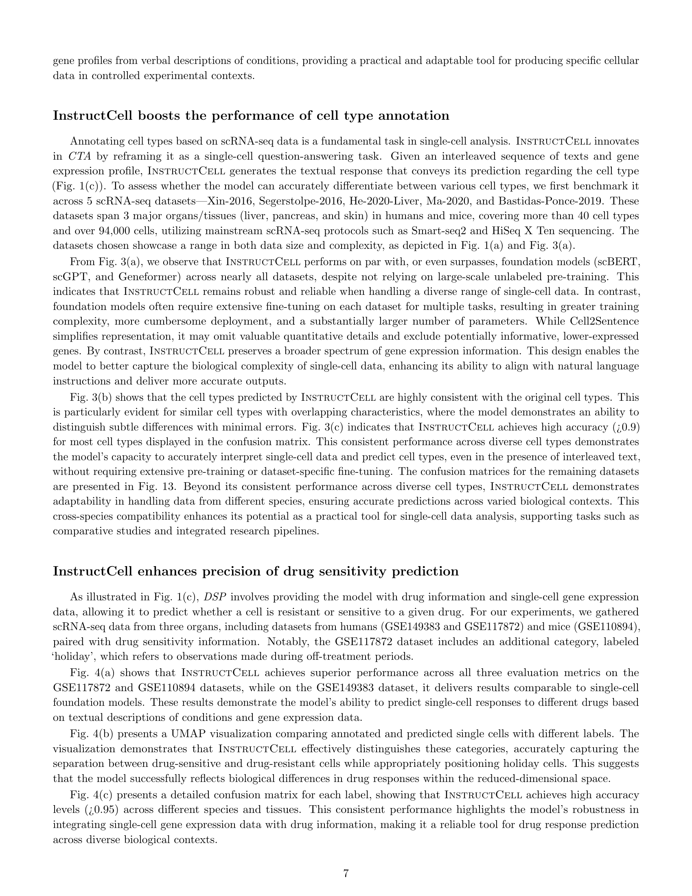
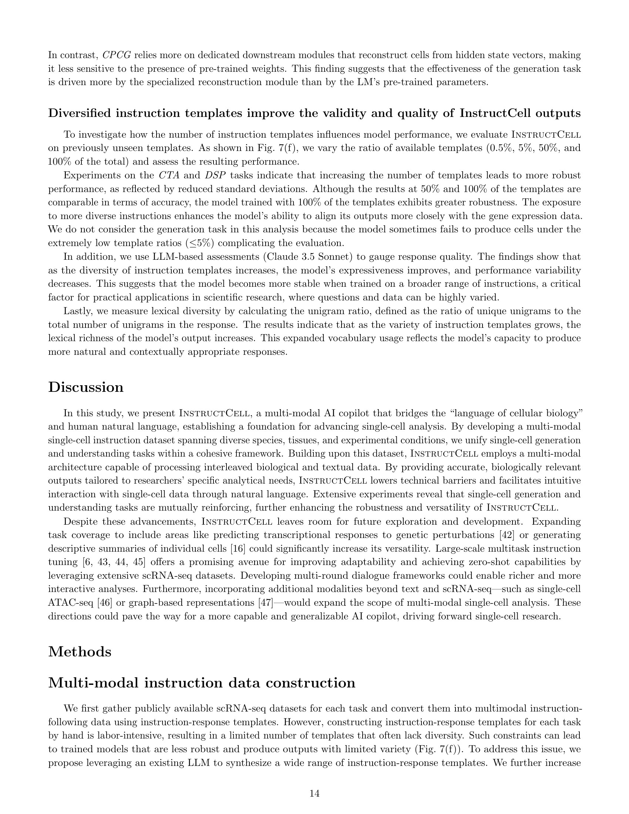

 


 2501.08187 
 Yin Fang et el. 
 
 🤗 2025-01-15 
 



↗ arXiv


↗ Hugging Face


↗ Papers with Code


### TL;DR



단일 세포 RNA 시퀀싱(scRNA-seq) 데이터는 세포 생물학의 언어로, 복잡한 유전자 발현 패턴을 담고 있습니다. 하지만 기존의 분석 도구들은 비효율적이고 사용하기 어려워 연구자들에게 어려움을 주었습니다. 이에 본 연구에서는 **INSTRUCTCELL이라는 다모달 AI 코파일럿**을 제시합니다.

INSTRUCTCELL은 **텍스트 기반의 명령어와 scRNA-seq 프로필을 함께 처리**하여 세포 유형 주석, 조건부 가상 세포 생성, 약물 민감도 예측 등을 수행합니다. 다양한 조직과 종에 걸친 방대한 다모달 명령어 데이터셋을 구축하고, 다모달 세포 언어 아키텍처를 개발하여 이를 가능하게 했습니다. 실험 결과, INSTRUCTCELL은 기존 모델보다 우수한 성능을 보였으며, 다양한 실험 조건에 적응하고 직관적인 사용자 인터페이스를 제공하여 복잡한 데이터 분석의 장벽을 낮췄습니다.



#### Key Takeaways


 INSTRUCTCELL은 자연어를 기반으로 단일 세포 분석을 위한 다모달 AI 코파일럿으로, **단일 세포 데이터와 자연어 명령어를 동시에 해석하고 처리**합니다. 



 INSTRUCTCELL은 세포 유형 주석, 조건부 가상 세포 생성, 약물 민감도 예측 등의 작업을 **간단한 자연어 명령어**로 수행할 μ 있습니다. 



 INSTRUCTCELL은 기존의 단일 세포 기반 모델을 능가하는 성능을 보이며, 다양한 실험 조건에 적응하고 복잡한 단일 세포 데이터를 탐색하는 λ° **직관적이고 접근하기 쉬운 도구**를 제공합니다. 


#### Why does it matter?
본 논문은 **단일 세포 분석을 위한 다모달 AI 코파일럿인 INSTRUCTCELL**을 제시하여, 연구자들이 자연어를 사용하여 직접적이고 유연한 단일 세포 분석을 수행할 수 있도록 합니다. 기존의 단일 세포 분석 방법의 비효율성과 비직관성을 해결하고, 다양한 실험 조건에 적응하며, 접근성이 높은 도구를 제공하여 심층적인 생물학적 통찰력을 얻을 수 있도록 합니다.  이는 **단일 세포 분석 분야의 기술적 장벽을 낮추고 연구의 범위를 확장**하는 데 크게 기여할 것으로 예상됩니다.

------
#### Visual Insights

> 🔼 그림 1은 INSTRUCTCELL의 개요를 보여줍니다. (a)는 통합된 단일 세포 데이터의 요약입니다. INSTRUCTCELL은 인간과 마우스에서 유래한 299,155개의 scRNA-seq 샘플을 여러 장기에 걸쳐 통합합니다. CPCG는 조건부 의사 세포 생성을, CTA는 세포 유형 주석을, DSP는 약물 민감도 예측을 나타냅니다. (b)는 다중 모드 세포 언어 모델의 아키텍처를 보여줍니다. 이 모델은 단일 세포 유전자 발현 지식을 포착하는 Q-Former, 백본으로 사전 훈련된 LM, 단일 세포 유전자 발현 프로필을 생성하는 세포 재구성 모듈의 세 가지 주요 구성 요소를 통해 텍스트와 단일 세포 데이터를 모두 처리합니다. (c)는 다중 모드 단일 세포 지침 데이터의 구성을 보여줍니다. 완전한 지침-응답 쌍은 텍스트와 단일 세포 모드의 필수 및 선택적 속성을 결합하여 형성됩니다. (d)는 다양한 의사소통 스타일의 시뮬레이션을 보여줍니다. LLMs는 다양한 특성(개성, 동기, 숙련도)을 가진 채팅 템플릿을 생성하여 작업 관련 정보를 다양한 의사소통 스타일로 전달하는 지침을 생성합니다.
> 

> 
read the caption

> Fig. 1:  Overview of InstructCell. a, Summary of incorporated single-cell data. InstructCell incorporates 299,155 scRNA-seq samples from human and mouse origins, spanning multiple organs. CPCG denotes Conditional Pseudo-cell Generation, CTA denotes Cell Type Annotation, and DSP denotes Drug Sensitivity Prediction. b, Architecture of the multi-modal cell language model. The model processes both text and single-cell data via three primary components: a Q-Former to capture single-cell gene expression knowledge, a pre-trained LM as the backbone, and a cell reconstruction module for generating single-cell gene expression profiles. c, Construction of multi-modal single-cell instruction data. Complete instruction-response pairs are formed by combining required and optional attributes from text and single-cell modalities. d, Simulation of diverse communication styles. LLMs generate chat templates with varying traits (personality, motivation, and proficiency) to produce instructions that convey task-related information in different communication styles.
> 

### In-depth insights

#### Multimodal AI Copilot
본 논문에서 제시된 다중 모드 AI 코파일럿은 **단일 세포 분석을 위한 새로운 접근 방식**을 제시합니다. 자연어 처리와 컴퓨터 비전 기술을 결합하여, 연구자들이 복잡한 단일 세포 데이터를 직관적으로 분석할 수 있도록 돕습니다. **텍스트 기반의 명령어를 통해 단일 세포 데이터 분석 작업을 수행**하도록 설계되었으며, 이는 기존의 복잡하고 비효율적인 도구 사용 방식을 대체합니다. 이 시스템은 다양한 조직 및 종에서 얻은 단일 세포 RNA 시퀀싱(scRNA-seq) 프로필을 포함하는 다중 모드 지침 데이터 세트를 사용하여 학습됩니다. **다양한 생물학적 맥락을 고려**하여 유연하고 직관적인 분석 환경을 제공하는 것이 특징입니다.  또한, **세포 유형 주석, 조건부 의사 세포 생성 및 약물 민감도 예측과 같은 중요한 작업을 수행**할 수 있습니다. 기존의 단일 세포 기반 모델을 능가하는 성능을 보여주며, 다양한 실험 조건에 적응할 수 있습니다.  이를 통해 **기술적 장벽을 낮추고 생물학적 통찰력을 향상**시키는 데 기여할 것으로 기대됩니다.

#### Instruction Following
본 논문에서 "Instruction Following"이라는 개념은 **대규모 언어 모델(LLM)이 자연어 명령어를 해석하고, 단일 세포 분석과 같은 복잡한 과학적 작업을 수행하는 능력**을 의미합니다.  연구진은 이러한 능력을 활용하여, 사용자의 자연어 명령어만으로도 세포 유형 주석, 조건부 의사 세포 생성, 약물 민감도 예측 등의 다양한 단일 세포 분석 작업을 수행할 수 있는 **다중 모드 AI 코파일럿인 INSTRUCTCELL**을 개발했습니다.  **INSTRUCTCELL의 핵심은 다양한 조직 및 종에서 얻은 단일 세포 RNA 시퀀싱(scRNA-seq) 프로필과 텍스트 기반 지침을 짝지어 만든 광범위한 다중 모드 지침 데이터 세트**입니다. 이를 통해 모델은 수치적 단일 세포 데이터와 자연어 명령어를 동시에 해석하고 처리하여, 사용자에게 직관적이고 효율적인 분석 환경을 제공합니다.  **본 연구는 LLM의 지침 따르기 기능이 생물의학 연구에 미치는 영향을 보여주는 중요한 사례**이며, 향후 다양한 생물학적 데이터 분석에 대한 새로운 가능성을 제시합니다.  **특히, 자연어를 통해 직접적으로 복잡한 단일 세포 데이터를 탐색하는 접근 방식**은 연구자의 기술적 장벽을 낮추고 심층적인 생물학적 통찰력을 얻는 데 크게 기여할 것으로 예상됩니다.

#### Cell Language Model
본 논문에서 제시된 핵심 개념인 "셀 언어 모델"은 **단일 세포 분석을 위한 다중 모드 AI 모델**을 지칭합니다. 이 모델은 **자연어와 단일 세포 RNA 시퀀싱 데이터를 동시에 해석하고 처리**하여, 세포 유형 주석, 조건부 의사 세포 생성, 약물 민감도 예측과 같은 다양한 작업을 수행합니다. **자연어 명령어를 통해 직관적이고 유연한 단일 세포 분석**을 가능하게 하며, 기존의 단일 세포 기반 모델의 성능을 능가하는 동시에 다양한 실험 조건에 적응합니다. **다중 모드 아키텍처는 텍스트 처리를 위한 사전 훈련된 언어 모델과 단일 세포 유전자 발현 프로필을 처리하는 Q-Former 모듈로 구성**되어 있으며, 세포 재구성 블록을 통해 세포 유전자 발현 프로필을 생성합니다. 이러한 아키텍처는 **단일 세포 데이터와 텍스트 데이터 간의 효율적인 상호 작용**을 가능하게 하여 단일 세포 데이터 분석의 효율성과 접근성을 높입니다.  **직관적인 사용자 인터페이스**를 통해 전문 지식이 부족한 연구자들도 쉽게 사용할 수 있으며, 복잡한 단일 세포 데이터 분석 과정을 간소화하고 심층적인 생물학적 통찰력을 얻을 수 있게 합니다.  **다양한 실험 조건과 질문 유형에 대한 모델의 강인성**은 광범위한 연구 분야에 적용 가능성을 시사합니다.

#### Experimental Robustness
본 연구는 다양한 실험적 조건 하에서 모델의 강건성을 평가하는 실험적 강건성 부분을 다룹니다. **다양한 데이터셋과 다양한 지침 스타일**을 사용하여 모델의 성능을 평가하고, 이를 통해 모델의 일반화 능력과 견고성을 확인합니다. 이는 모델의 실제 응용 가능성을 높이는 중요한 요소입니다. 특히, **다양한 지침 스타일**에 대한 실험을 통해, 모델이 사용자의 의도를 정확하게 이해하고, 다양한 표현 방식에도 일관된 성능을 유지함을 보여줍니다.  **데이터셋의 다양성**은 모델의 일반화 능력을 평가하는 데 중요한 역할을 합니다. 다양한 조직 및 종에 걸친 데이터를 사용하여 모델의 강건성을 확인합니다. 또한, **결과 분석의 꼼꼼함**은 연구의 신뢰성을 높입니다. 다양한 지표를 사용하여 분석을 수행하고, 결과의 통계적 유의성을 검증합니다.  **전반적으로, 이 연구는 모델의 실험적 강건성을 다각적으로 평가하고, 그 결과를 상세히 분석함으로써 모델의 신뢰성과 실용성을 높이는 데 기여**합니다.

#### Future Directions
본 논문에서 제시된 INSTRUCTCELL 모델은 단일 세포 분석에 있어 자연어 처리와 멀티모달 학습을 성공적으로 통합한 획기적인 시도입니다.  하지만, **향후 연구 방향**으로는 몇 가지 중요한 발전 가능성이 존재합니다.  먼저, **더욱 다양한 단일 세포 데이터 유형** (예: ATAC-seq, spatial transcriptomics)을 통합하여 모델의 일반화 능력을 향상시킬 수 있습니다.  다음으로, **복잡한 생물학적 질문**에 대한 답변을 생성하는 능력을 강화하기 위해, **더욱 정교하고 세밀한 지시사항**을 처리할 수 있도록 모델을 개선해야 합니다.  마지막으로,  **모델의 해석 가능성**을 높이기 위한 연구가 필요하며,  이는 **예측 결과에 대한 신뢰도를 높이고 생물학적 통찰력을 강화**하는 데 중요한 역할을 할 것입니다.  **대규모 멀티 태스크 학습**을 통해 모델의 일반화 성능을 더욱 높이고,  **다양한 실험 조건**에 대한 적응력을 개선하는 것 또한 중요한 과제입니다.

### More visual insights

More on figures

> 🔼 그림 2는 INSTRUCTCELL이 생성한 의사 세포의 결과를 보여줍니다. (a)는 실제 세포와 생성된 세포의 UMAP 시각화를 보여줍니다. 왼쪽 그림은 실제 세포와 생성된 세포 간의 겹침을 보여주고, 가운데와 오른쪽 그림은 서로 다른 색상으로 세포 유형을 나타내는 실제 세포와 생성된 세포를 각각 보여줍니다. (b)는 Tabular-Sapiens 테스트 세트를 기반으로 Welch의 t-검정을 사용하여 각 세포 유형에 대한 상위 세 가지 중요 유전자를 식별하고 x축에 표시한 실제 세포(위쪽)와 생성된 세포(아래쪽)의 유전자 발현 패턴 점도표를 보여줍니다. 세포 유형은 y축에 배열됩니다. 각 점의 크기는 해당 세포 유형 내에서 유전자를 발현하는 단일 세포의 비율을 나타내고, 점의 색상은 해당 세포 유형 내에서 유전자의 평균 발현 수준을 나타냅니다. 나머지 두 데이터 세트의 결과는 그림 12에 나와 있습니다. (c)는 네 가지 데이터 세트에 대한 세포 생성 성능에 대한 정량적 평가를 보여줍니다. 낮은 ΔsKNN 값은 더 나은 구조적 정렬을 나타내고, 높은 pKNN 값은 위치 일치도가 향상되었음을 반영하며, 낮은 MMD 값은 전반적인 데이터 분포에 대한 더 정확한 근사치를 나타냅니다.
> 

> 
read the caption

> Fig. 2:  Conditional pseudo-cell generation results by InstructCell. a, UMAP visualizations of real and generated cells. The left plot shows the overlap between real and generated cells. The middle and right plots display real and generated cells, respectively, with distinct colors indicating different cell types. b, Dot plots of gene expression patterns derived from real (top) and generated (bottom) cells. Based on the test set from Tabular-Sapiens, we use Welch’s t𝑡titalic_t-test to identify top three significant genes for each cell type and display them along x-axis. Cell types are arranged along y-axis. The size of each dot indicates the proportion of single cells within the corresponding cell type that express the gene, while the color of the dot represents the mean expression level of the gene within that cell type. The results of the remaining two datasets are available in Fig.12. c, Quantitative evaluation of cell generation performance across four datasets. A lower △△\triangle△sKNN value indicates better structural alignment, a higher pKNN value reflects improved positional correspondence, and a lower MMD value denotes a more accurate approximation of the global data distribution.
> 

> 🔼 그림 3은 INSTRUCTCELL의 세포 유형 주석 기능 성능을 보여줍니다. (a)는 인간의 심장, 간, 췌장 및 마우스 피부 및 췌장 데이터셋에서 다양한 모델의 가중치 F1 점수, 매크로 F1 점수 및 정확도를 비교하여 INSTRUCTCELL의 성능을 평가합니다. (b)는 세 가지 서로 다른 데이터셋에 대한 UMAP 시각화를 보여줍니다. 왼쪽 패널은 원래 연구의 전문가가 주석을 단 세포 유형으로 색상이 지정되고, 오른쪽 패널은 INSTRUCTCELL의 예측 결과로 색상이 지정됩니다. (c)는 세 가지 데이터셋에 대한 예측된 세포 유형과 실제 주석 간의 혼동 행렬을 보여줍니다. 더 어두운 색조는 모델의 예측과 실제 세포 유형 주석 간의 일치 빈도가 더 높음을 나타냅니다.
> 

> 
read the caption

> Fig. 3:  Cell type annotation results by InstructCell. a, Evaluation of InstructCell’s CTA performance across human heart, liver, pancreas, and mouse skin and pancreas datasets. Performance is quantified using weighted F1, macro F1, and accuracy metrics, with different colors representing different models. b, UMAP visualization of three different datasets. The left panel is colored by expert-annotated cell types from the original research, and the right panel is colored by InstructCell prediction results. c, Confusion matrices between predicted cell types and actual annotations for the three datasets. Darker shades denote a higher frequency of agreement between the model’s predictions and the actual cell type annotations.
> 

> 🔼 그림 4는 INSTRUCTCELL의 약물 민감도 예측 성능을 보여줍니다. (a)에서는 세 가지 데이터셋(인간 구강, 폐 및 마우스 골수)에 대한 INSTRUCTCELL의 세포 유형 주석 성능 평가 결과를 보여줍니다. 가중 F1 점수, 거시 F1 점수 및 정확도 측정값을 사용하여 성능이 정량화되며, 서로 다른 색상은 서로 다른 모델을 나타냅니다. (b)에서는 세 가지 데이터셋의 UMAP 시각화를 보여주는데, 세포는 전문가가 주석을 단 결과와 INSTRUCTCELL 예측 결과 모두에 대해 약물 민감도 레이블(민감성, 내성 및 휴일)별로 색상이 지정되어 있습니다. (c)에서는 세 가지 데이터셋에 대한 예측된 세포 유형과 실제 주석 간의 혼동 행렬을 보여줍니다. 어두운 색조는 모델 예측과 실제 약물 민감도 주석 간의 일치도가 높음을 나타냅니다.
> 

> 
read the caption

> Fig. 4:  Drug sensitivity prediction results by InstructCell. a, Evaluation of InstructCell’s CTA performance across human oral, lung, and mouse bone datasets. Performance is quantified using weighted F1, macro F1, and accuracy metrics, with different colors representing different models. b, UMAP visualization of the three datasets, with cells colored by drug sensitivity labels (sensitive, resistant, and holiday) for both expert-annotated results and InstructCell predictions. c, Confusion matrices between predicted cell types and actual annotations for the three datasets. Darker shades denote a higher frequency of agreement between the model’s predictions and the actual drug sensitivity annotations.
> 

> 🔼 그림 5는 InstructCell 모델의 강건성을 보여줍니다. (a) 부분은 기존(seen) 및 미확인(unseen) 명령어 템플릿 하에서 조건부 의사 세포 생성(CPCG) 작업에 대한 정량적 비교를 보여줍니다. △SKNN 및 pKNN 지표는 이웃 수 K가 다양하게 변화하는 동안 계산되며, MMD 지표도 함께 제시됩니다. 명령어 템플릿이 기존 것인지 미확인 것인지에 따라 다른 색상으로 표시됩니다. (b) 부분은 InstructCell의 지시(instruct) 및 채팅(chat) 모드에서 각 작업에 대한 평균 성능을 보여줍니다. 왼쪽(분류 작업)에서 각 산점도 점의 모양은 옵션이 제공되었는지 여부를 나타내고, 색상은 모델 버전을 구분합니다. 각 구성에는 옵션이 있는 20개와 없는 20개를 포함하여 40개의 산점도 점이 포함됩니다. 오른쪽(생성 작업)에서 서로 다른 색상은 서로 다른 모델 버전을 나타냅니다.
> 

> 
read the caption

> Fig. 5:  Robustness of InstructCell. a, Quantitative comparison of the CPCG task under seen and unseen instruction templates. Results are shown for △△\triangle△sKNN and pKNN metrics at varying numbers of neighbors K𝐾Kitalic_K, as well as for MMD. Different colors denote whether the instruction templates are seen or unseen. b, Average performance of InstructCell under instruct and chat modes across each task. On the left side (classification tasks), the shape of each scatter point indicates whether options are provided or not, while the color distinguishes model versions. Each configuration includes 40 scatter points (20 with options and 20 without). On the right side (generative task), different colors represent different model versions.
> 

> 🔼 그림 6은 InstructCell이 두 데이터셋(He-2020-Liver 및 Xin-2016)에서 각 세포 유형에 대해 식별한 상위 10개의 중요 유전자를 보여줍니다. (a)와 (b)는 기울기 중요도 기반 방법을 사용하여 InstructCell에서 추출한 중요 유전자의 히트맵입니다. 색상 기울기는 빨간색에서 파란색으로 갈수록 유전자 중요도를 나타내며, 빨간색은 더 높은 중요도 점수를, 파란색은 더 낮은 중요도 점수를 나타냅니다. 각 행의 빨간색 표시는 모델이 식별한 상위 10개의 주요 유전자 중 CellMarker 2.0 데이터베이스 또는 최근 문헌에 해당 세포 유형의 마커 유전자로 보고된 유전자를 나타냅니다.
> 

> 
read the caption

> Fig. 6:  Top 10 significant genes identified by InstructCell for each cell type in two datasets. a, b Heatmaps of the significant genes extracted from InstructCell by using gradient saliency-based method for (a) He-2020-Liver and (b) Xin-2016 datasets. The color gradient from red to blue represents gene importance, with red indicating higher importance scores and blue indicating lower scores. Red markers in each row indicate that genes among the top 10 key genes identified by the model, are either reported as marker genes for the corresponding cell type in the CellMarker2.0 database or in recent literature.
> 

> 🔼 그림 7은 INSTRUCTCELL의 성능을 자세히 분석한 결과를 보여줍니다. (a)는 LLM 기반 평가 방식을 사용하여 INSTRUCTCELL의 응답 품질을 평가한 결과입니다. 유창성, 문법 및 예측 결과 포함 여부를 기준으로 평가했으며, Claude 3.5 Sonnet을 객관적인 평가자로 사용했습니다. CPCG 작업에 대한 추가 내용은 보라색으로 강조 표시되어 있습니다. (b)는 단일 세포 데이터 인코딩을 위해 Q-Former와 표준 MLP를 비교하여 모델 성능에 미치는 Q-Former의 영향을 분석한 결과입니다. (c)는 다양한 쿼리 임베딩 수를 사용하여 모델 성능을 비교 분석한 결과입니다. (d)는 다중 작업 및 단일 작업 지시 사항 미세 조정의 성능을 비교한 결과입니다. 단일 작업 지시 사항 미세 조정을 위해서는 다중 모드 지시 사항 데이터 세트를 작업 유형별로 나누어 각 특정 작업에 대해 별도의 모델을 학습시켰습니다. INSTRUCTCELL-instruct 버전을 사용하여 모든 데이터 세트의 평균 메트릭을 보고했습니다. (e)는 INSTRUCTCELL-chat 버전을 사용하여 사전 학습된 LM 가중치를 사용하거나 사용하지 않을 경우 모델 성능에 미치는 영향을 분석한 결과입니다. (f)는 다중 작업 지시 사항 미세 조정을 사용하여 모든 분류 데이터 세트에서 다양한 비율의 템플릿(총 템플릿의 0.5%, 5%, 50%, 100%)을 사용하여 학습된 4개의 채팅 버전 모델을 사용하여 모델 출력에 미치는 템플릿 비율 변화의 영향을 분석한 결과입니다. CTA 및 DSP 작업의 경우 평가를 위해 40개의 보이지 않는 지시 템플릿(다중 선택 옵션이 있는 20개, 없는 20개)을 선택했습니다. 각 템플릿의 평균 성능 및 표준 편차는 두 작업에 대해 모든 데이터 세트에서 계산했습니다. 또한, 500개의 보이지 않는 지시 템플릿을 샘플링하여 Claude 3.5 Sonnet을 사용하여 모델 출력의 표현력을 평가하고, 유니그램 분석을 수행하여 어휘 다양성을 평가했습니다.
> 

> 
read the caption

> Fig. 7:  A closer look of InstructCell. a, Evaluation of response quality in InstructCell using the LLM-as-a-judge approach. Response quality is assessed based on fluency, grammar, and inclusion of predictive results, with Claude 3.5 Sonnet [4] serving as an unbiased evaluator. Text highlighted in purple indicates additional content for the CPCG task compared to the two classification tasks. b, Impact of Q-Former on model performance. Performance comparison between the Q-Former and a standard MLP for encoding single-cell data. c, Impact of query embedding quantity on model performance. Performance comparison across different numbers of query embeddings. d, Comparative performance of multi-task vs. single-task instruction tuning. For single-task instruction tuning, we divide our multi-modal instruction dataset by task type and train separate models for each specific task. We report the average metrics across all datasets for each task using the InstructCell-instruct version. e, Comparative performance of without vs. with pre-trained LM weights. We conduct experiments using the InstructCell-chat version to explore the impact of employing or not employing pre-trained weights on model performance. f, Impact of varying template ratios on model outputs. Four chat version models are trained on all classification datasets using multi-task instruction tuning with varying ratios of templates (0.5%, 5%, 50%, and 100% of the total templates). For the CTA and DSP tasks, 40 unseen instruction templates are selected for evaluation: 20 with multiple-choice options and 20 without. The mean performance and standard deviation for each template are calculated across all datasets for these two tasks. Additionally, we sample 500 unseen instruction templates and use Claude 3.5 Sonnet to score the model’s outputs for expressiveness, while unigram analysis is conducted to assess lexical diversity.
> 

> 🔼 그림 8은 CPCG(Conditional Pseudo-cell Generation)을 위한 instruction-response 템플릿을 생성하는 데 사용된 프롬프트의 예시를 보여줍니다. (a)는 다양한 성격 특성을 생성하기 위한 프롬프트 예시, (b)는 CPCG를 위한 동기를 생성하기 위한 프롬프트 예시, (c)는 CPCG를 위한 instruction 템플릿을 생성하기 위한 프롬프트 예시, (d)는 CPCG를 위한 response 템플릿을 생성하기 위한 프롬프트 예시, (e)는 다양성을 높이기 위해 instruction 템플릿을 다시 작성하기 위한 프롬프트 예시입니다.  각각의 예시는 다양한 질문 유형과 답변 스타일을 생성하는 데 사용되는 프롬프트의 구체적인 형태와 구성 요소를 보여주어, INSTRUCTCELL 모델의 다양한 instruction-response 템플릿 생성 과정을 자세히 이해하는 데 도움을 줍니다.
> 

> 
read the caption

> Fig. 8:  The examples of the prompts used to construct instruction-response templates for CPCG. a, An example of the prompts for generating personality traits. b, An example of the prompts used to generate motivations for CPCG. c, An example of the prompts used to generate instruction templates for CPCG. d, An example of the prompts used to generate response templates for CPCG. e, An example of the prompts for rewriting instruction templates to enhance diversity.
> 

> 🔼 그림 9는 본 연구에서 사용된 scRNA-seq 데이터셋에 대한 상세 개요와 UMAP 시각화를 보여줍니다. 총 11개의 데이터셋이 사용되었으며, 2종의 생물종과 11가지 조직 유형에 걸쳐 있습니다. 이 중 5개 데이터셋은 세포 유형 주석(CTA), 3개 데이터셋은 약물 민감도 예측(DSP), 3개 데이터셋은 조건부 의사 세포 생성(CPCG)에 사용되었습니다. 각 데이터셋의 샘플 수는 '# Samples' 열에 나와 있습니다. 가운데 세 개의 UMAP 플롯은 단일 세포 데이터의 분포를 보여주는 단일 세포 데이터 풍경을 보여주며, 서로 다른 데이터셋, 종, 조직 간의 분포를 보여줍니다. 아래쪽 UMAP 플롯은 Ma-2020, GSE110894 및 PBMC68K에 대한 레이블 분포를 보여줍니다. 세 가지 작업을 다루는 본 연구의 데이터에는 DSP의 반응 레이블과 다른 두 가지 작업의 세포 유형 레이블 등 다양한 레이블이 포함되어 있습니다.
> 

> 
read the caption

> Fig. 9:  Detailed overview and UMAP visualizations of scRNA-seq datasets used in this work. A total of 11 datasets are utilized, spanning 2 species and 11 tissue types. Among them, 5 datasets are employed for CTA, 3 for DSP, and 3 for CPCG. The number of samples for each dataset is listed under the column # Samples. The middle three UMAP plots present the single-cell data landscape, showcasing the distributions across different datasets, species, and tissues. The lower UMAP plot shows the label distribution for Ma-2020, GSE110894, and PBMC68K. Covering three distinct tasks, our data include various labels, such as response labels for DSP and cell type labels for other two tasks.
> 

> 🔼 그림 10은 합성된 instruction-response 템플릿의 통계를 보여줍니다. (a)는 다양한 커뮤니케이션 스타일(개성, 동기, 숙련도, 조합)에 따른 instruction 템플릿 길이 분포를 나타냅니다. 전체 특성을 가진 버전과 비교하여 개성, 동기, 숙련도 특성을 체계적으로 제거하여 각 특성의 영향을 평가합니다. 각 분포의 분산은 괄호 안에 표시됩니다. (b)는 다양한 커뮤니케이션 스타일에서 instruction 템플릿 간 유사성을 보여줍니다. 템플릿 유사도는 쌍으로 측정되며, 유사도 임계값이 0.75를 초과하는 샘플은 제외됩니다. 각 스타일의 평균 유사도 값은 괄호 안에 보고됩니다. (c)는 다양한 커뮤니케이션 스타일에서 instruction 템플릿의 어휘 다양성을 보여줍니다. 어휘 다양성은 각 instruction 템플릿에서 고유한 unigram의 비율로 정량화됩니다. (d)는 세 가지 작업(셀 유형 주석, 약물 민감도 예측, 조건부 의사 세포 생성)에 걸친 instruction과 response 템플릿 길이 분포를 산점도로 보여줍니다. 다른 색상은 다른 작업 범주를 나타냅니다.
> 

> 
read the caption

> Fig. 10:  Statistics of synthetic instruction-response templates. a, Length of instruction templates for different communication styles. Traits such as personality (orange), motivation (green), proficiency (red), and their combination (purple) are systematically removed to evaluate their impact, compared to the full trait version (blue). Variance for each distribution is shown in parentheses. b, Similarity of instruction templates across different communication styles. Template similarity is measured pairwise, with samples exceeding a similarity threshold of 0.75 excluded. Average similarity values for each style are reported in parentheses. c, Lexical diversity of instruction templates across communication styles. Lexical diversity is quantified using the unigram ratio, defined as the proportion of unique unigrams to the total number of unigrams in each instruction template. d, Length distribution of instruction and response templates across tasks. A scatter plot illustrates the lengths of instructions and responses for distinct tasks, with different colors representing task categories.
> 

> 🔼 그림 11은 InstructCell-chat의 질적 예시들을 보여줍니다. 각 작업에 대한 설명적인 예시들이 제시되어 있으며, 사용자의 지시, InstructCell-chat이 생성한 응답, 해당하는 정답, 그리고 데이터 출처를 보여줍니다. 이 그림은 InstructCell-chat이 세 가지 다른 단일 세포 분석 작업(조건부 의사 세포 생성, 세포 유형 주석, 약물 민감도 예측)을 수행하는 방법을 보여주는 대표적인 예시들을 제시함으로써, 모델의 다양한 기능과 성능을 보다 명확하게 이해하는 데 도움을 줍니다.
> 

> 
read the caption

> Fig. 11:  Qualitative examples of InstructCell-chat. Illustrative examples for each task are presented, showcasing instructions, model-generated responses from InstructCell-chat, the corresponding ground truth answers, and their sample sources.
> 

> 🔼 그림 12는 조건부 의사 세포 생성에 대한 버블 플롯입니다. 그림 2(b)의 보충 자료로서, 본 연구의 나머지 두 데이터셋의 각 세포 유형에 대한 상위 세 가지 중요 유전자를 강조 표시합니다. 모델이 생성한 세포의 경우, 이러한 중요 유전자의 발현 비율과 평균 발현 수준을 보여줍니다. 더 붉은 색조는 더 높은 평균 유전자 발현을 나타내고, 더 큰 원은 해당 세포 유형 내에서 더 높은 비율의 유전자 발현을 나타냅니다.
> 

> 
read the caption

> Fig. 12:  Bubble plot for conditional pseudo-cell generation. As a supplement to Fig. 2(b), this plot highlights the top three significant genes for each cell type from the remaining two datasets in our study. For model-generated cells, we display the expression ratios and average expression levels of these significant genes. Redder hues indicate higher average gene expression, while larger circles represent a higher proportion of gene expression within the corresponding cell type.
> 

### Full paper



