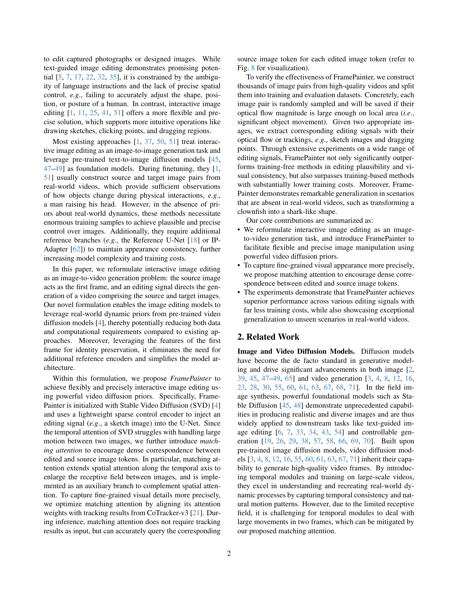

 


 2501.08225 
 Yabo Zhang et el. 
 
 🤗 2025-01-15 
 



↗ arXiv


↗ Hugging Face


↗ Papers with Code


### TL;DR



기존의 대화형 이미지 편집 방법들은 **대규모 훈련 데이터**와 **추가적인 참조 인코더**가 필요하여 효율성이 떨어지고 일반화 성능이 낮다는 문제점이 있습니다. 또한, **시간적 어텐션**의 한계로 인해 두 프레임 사이의 큰 움직임을 처리하는 데 어려움을 겪습니다. 

본 논문에서는 **이미지-비디오 생성 문제**로 대화형 이미지 편집을 재구성하고, 이를 해결하기 위해 비디오 확산 사전을 활용한 FramePainter를 제안합니다. **경량화된 제어 인코더**와 **매칭 어텐션** 기법을 사용하여 효율성과 정확성을 높였으며, **실제 세계 비디오에 없는 시나리오에서도 우수한 성능**을 보였습니다. FramePainter는 다양한 편집 신호(스케치, 점, 드래그)에 효과적으로 작동하며, **기존 방법들보다 적은 훈련 데이터**로도 높은 성능을 달성했습니다. 



#### Key Takeaways


 비디오 확산 사전을 이용한 효율적인 대화형 이미지 편집 프레임워크 FramePainter 제시 



 다양한 편집 신호(스케치, 점, 드래그)에 대한 우수한 성능 및 일반화 능력 



 적은 훈련 데이터로도 높은 효율성과 정확성 달성 


#### Why does it matter?
**본 논문은 비디오 확산 사전을 사용하여 대화형 이미지 편집을 위한 새로운 프레임워크인 FramePainter를 제시하여 이미지 편집 분야의 발전에 크게 기여합니다.** 기존 방법들의 한계를 극복하고 효율성과 일반화 성능을 높인 FramePainter는 **다양한 편집 신호(스케치, 점, 영역 드래그)**에 효과적이며, **적은 훈련 데이터로도 우수한 성능**을 보입니다. 또한 **실제 세계 비디오에 없는 시나리오에서도 뛰어난 일반화 능력**을 보여줍니다.  이러한 결과는 이미지 편집 연구에 새로운 방향을 제시하고, 관련 연구자들에게 중요한 영향을 미칠 것입니다.  특히, **비디오 확산 사전의 활용**, **매칭 어텐션 기법**, **실제 세계 데이터의 활용**은 다른 연구에도 적용 가능한 유용한 기술입니다. 

------
#### Visual Insights

> 🔼 본 그림은 FramePainter의 예시를 보여줍니다. FramePainter는 사용자가 스케치, 클릭, 드래그 등 직관적인 시각적 지시어를 통해 이미지를 조작할 수 있게 합니다. 비디오 확산 사전(video diffusion priors)을 활용하여 일반적인 상황(예: 빨간색 상자 안의 컵의 반사 조정)에서 직관적이고 그럴듯한 편집을 가능하게 할 뿐만 아니라 도메인 외부(out-of-domain) 사례(예: 흰동가리 물고기를 상어 모양으로 변환)에서도 뛰어난 일반화 성능을 보여줍니다.
> 

> 
read the caption

> Figure 1:  Examples of FramePainter. FramePainter allows users to manipulate images through intuitive visual instructions like drawing sketches, clicking points, and dragging regions. Benefiting from powerful video diffusion priors, it not only enables intuitive and plausible edits in common scenarios (e.g., adjust the reflection of the cup in red box), but also exhibits exceptional generalization in out-of-domain cases, e.g., transform the clownfish into shark-like shape.
> 


| Method | Editing Signal | Training Samples | CLIP-FID () | LPIPS () | SSIM () |
|---|---|---|---|---|---| 
| MasaCtrl + ControlNet | Sketch | None | 17.933 | 0.302 | 0.655 |
| **FramePainter (Ours)** | Sketch | 20k | **7.783** | **0.140** | **0.859** |
| Magic Fixup | Coarse Edit | 2,500k | 8.757 | 0.166 | 0.855 |
| **FramePainter (Ours)** | Coarse Edit | 20k | **7.573** | **0.132** | **0.888** |
| DragDiffusion | Points | None | 9.192 | 0.187 | 0.811 |
| LightningDrag | Points | 220k | 9.894 | 0.214 | 0.794 |
| **FramePainter (Ours)** | Points | 20k | **8.513** | **0.166** | **0.825** |

> 🔼 표 1은 다양한 유형의 시각적 편집 지시어에 대한 정량적 비교 결과를 보여줍니다. 최첨단 방법 [51, 1]보다 훈련 샘플 수가 10% 또는 1% 미만임에도 불구하고 FramePainter는 모든 편집 신호에서 다른 방법들을 능가합니다. 최고의 결과는 굵게 표시되어 있습니다.
> 

> 
read the caption

> Table 1:  Quantitative comparisons across different types of visual editing instructions. Despite using fewer than 10%percent1010\%10 % or 1%percent11\%1 % training samples than previous state-of-the-art methods [51, 1], FramePainter surpasses alternative approaches across all editing signals. The best results are bolded.
> 

### In-depth insights

#### Video Diffusion Priors
본 논문에서 "비디오 확산 사전(Video Diffusion Priors)"은 **이미지 편집 과정에 비디오 데이터의 시간적 일관성 및 현실적인 물리적 상호작용 정보를 통합하는 핵심 개념**입니다. 기존의 이미지 편집 방법들이 이미지-이미지 변환에 집중하는 것과 달리, 본 연구는 이미지-비디오 생성 문제로 재구성하여 **비디오 확산 모델의 강력한 사전 정보**를 활용합니다. 이를 통해 적은 훈련 데이터로도 현실감 있는 이미지 편집 결과를 얻을 수 있고, 시간적 일관성을 유지하며, 실제 영상에 없는 상황(예: 흰동가리 물고기를 상어처럼 변형)에도 일반화가 잘 됩니다.  **Stable Video Diffusion과 같은 사전 훈련된 비디오 확산 모델**을 기반으로, 경량화된 제어 인코더를 통해 편집 신호를 주입하여 효율성을 높였습니다.  특히, **매칭 어텐션(Matching Attention)** 기법은 시간적 어텐션의 한계를 극복하여 프레임 간의 큰 움직임에도 정확한 대응 관계를 유지합니다.  결과적으로, 비디오 확산 사전을 활용한 이 접근법은 **데이터 효율성 및 일반화 성능**을 크게 향상시키는 혁신적인 방법을 제시합니다.

#### Matching Attention
본 논문에서 제시된 '매칭 어텐션(Matching Attention)'은 기존의 1차원 시간적 어텐션의 한계를 극복하고자 **영상 편집에서 프레임 간의 정확한 대응 관계를 확보하기 위한 핵심 메커니즘**입니다. 기존의 시간적 어텐션은 큰 움직임이 있는 경우 프레임 간의 일관성을 유지하는 데 어려움을 겪는 반면, 매칭 어텐션은 **공간적 어텐션을 시간적 축으로 확장**, 수용 영역을 넓히고 소스 이미지 토큰과 편집된 이미지 토큰 간의 **밀집된 대응 관계를 유도**하여 보다 정밀한 시각적 세부 사항을 포착합니다. 특히, **CoTracker-v3를 활용하여 추적 결과와 어텐션 가중치를 정렬**, 매칭 어텐션의 정확도를 높이고 추가적인 추적 결과 없이도 추론 과정에서 정확한 대응 관계를 쿼리할 수 있게 합니다. 이를 통해 FramePainter는 다양한 편집 신호에 대해 **훨씬 적은 훈련 데이터로도 우수한 성능**을 달성하고, 실제 영상에 존재하지 않는 상황에서도 뛰어난 일반화 능력을 보여줍니다.  **매칭 어텐션은 단순한 기술적 개선을 넘어, 영상 편집 모델의 성능 향상과 일반화 능력 향상에 크게 기여**하는 핵심 요소임을 알 수 있습니다.

#### Image-to-Video Task
이 논문은 영상 편집을 이미지-투-비디오(image-to-video) 작업으로 재구성하는 참신한 아이디어를 제시합니다. **기존의 이미지-투-이미지 접근 방식과 달리, 입력 이미지를 비디오의 첫 번째 프레임으로 간주하고, 편집 신호를 통해 후속 프레임을 생성하는 방식**입니다. 이는 **비디오 확산 모델의 강력한 사전 정보를 활용하여** 시간적 일관성을 유지하고, 훈련 데이터 및 계산 비용을 줄이는 효과를 가져옵니다.  **기존 방식에서 필요했던 추가적인 참조 인코더 없이도 이미지의 외관 일관성을 유지**할 수 있습니다. 이러한 접근 방식은 특히 대규모 동작이 있는 경우, 이미지 간의 밀접한 대응 관계를 유지하는 데 도움이 되는 **매칭 어텐션(matching attention)** 메커니즘과 결합하여 그 효과가 극대화됩니다. 따라서, 이 논문의 핵심은 **영상 편집 문제를 비디오 생성 문제로 재정의함으로써, 비디오 확산 모델의 장점을 효과적으로 활용**하여 더욱 효율적이고 효과적인 이미지 편집 모델을 구축하는 데 있습니다.

#### Ablation Studies
본 논문의 ablation study는 **매칭 어텐션(Matching Attention)**과 **소스 이미지 재구성(Source Image Reconstruction)**의 효과를 면밀히 분석합니다.  매칭 어텐션은 기존의 Temporal Attention이나 Cross-Frame Attention보다 **정확한 공간적 대응 관계**를 확보하여, 특히 큰 영역 편집 시에도 시각적 일관성을 유지하는 데 탁월한 성능을 보여줍니다.  이는 정량적 지표(CLIP-FID, LPIPS, SSIM) 개선과 시각적 결과 비교를 통해 명확히 입증됩니다.  또한, 소스 이미지 재구성은 **일관성 있는 시각적 결과**를 얻는 데 기여하며, 특히 색상과 질감 보존 측면에서 긍정적 효과를 보입니다.  **두 가지 요소 모두 모델 성능 향상에 중요한 역할**을 수행하며, 제안된 방법의 효율성과 효과를 강력하게 뒷받침합니다. 이를 통해, 논문에서 제시하는 프레임페인터(FramePainter)의 우수성과 디자인의 타당성을 더욱 확고히 합니다.

#### Future Work
본 논문의 "미래 연구" 부분에 대한 심도있는 고찰은 **비디오 확산 모델의 한계점 극복**과 **상호작용적 이미지 편집의 실용성 증대**라는 두 가지 주요 방향으로 나아갈 수 있습니다.  먼저, **장기간에 걸친 동작이나 복잡한 물체 변형**에 대한 모델의 취약성을 해결하기 위해 더욱 발전된 temporal attention 메커니즘이나 새로운 아키텍처를 연구해야 합니다.  **다양한 유형의 편집 신호 통합** 또한 중요한 과제입니다.  예를 들어, 텍스트, 음성, 제스처 등 다양한 입력을 효과적으로 처리하고 통합하는 시스템을 개발함으로써 사용자 경험을 더욱 풍부하게 만들 수 있습니다.  마지막으로, **훈련 데이터의 양을 줄이면서 성능을 향상**시키는 효율적인 학습 방법 연구도 필요합니다.  이를 위해 **메타 학습**이나 **지식 증류**와 같은 기법들을 활용하는 것을 고려해 볼 수 있습니다.  궁극적으로, **실시간 이미지 편집 시스템 구축**을 목표로 연구가 진행되어야 하며, 이를 위해서는 모델의 경량화 및 최적화가 필수적입니다.

### More visual insights

More on figures

> 🔼  그림 2는 FramePainter의 개요를 보여줍니다. FramePainter는 이미지 편집을 이미지-비디오 생성 작업으로 재구성하여, 소스 이미지와 편집 지침을 첫 번째 프레임과 제어 지침으로 사용하고, 재구성된 이미지와 타겟 이미지로 구성된 두 프레임 비디오를 생성합니다. 큰 움직임이 있는 두 이미지의 시각적 일관성을 개선하기 위해, 수용 영역을 확장하고 타겟 및 소스 이미지 토큰 간의 밀집된 대응 관계를 유도하는 매칭 어텐션이 제안되었습니다.  FramePainter는 Stable Video Diffusion을 초기화하고, 경량화된 희소 제어 인코더를 사용하여 편집 신호를 U-Net에 주입합니다.  또한, 두 이미지 간의 큰 움직임을 처리하는 데 어려움을 겪는 SVD의 시간적 어텐션의 한계를 고려하여, 매칭 어텐션을 통해 편집된 이미지 토큰과 소스 이미지 토큰 간의 밀집된 대응 관계를 유도합니다.
> 

> 
read the caption

> Figure 2:  Overview of FramePainter. Reformulating image editing as an image-to-video generation task, FramePainter takes a source image and an editing instruction as the first frame and control guidance, and produces a two-frame video comprising of reconstructed and target images. To improve visual consistency of two images involving large motion, matching attention is proposed to enlarge the receptive field and encourage dense correspondence between target and source image tokens.
> 

> 🔼 이 그림은 논문에서 사용된 비디오 데이터에서 수집된 이미지 샘플들을 보여줍니다.  상단부터 하단까지 세 가지 유형의 편집 신호가 제시되어 있는데, 각각 스케치, 점 클릭, 영역 드래그입니다. 이는 사용자가 이미지를 편집하는 데 사용하는 상호 작용 방식의 종류를 보여주는 예시입니다.  다양한 편집 방법에 따른 이미지 변화를 직관적으로 이해하는 데 도움이 됩니다.
> 

> 
read the caption

> Figure 3:  Collected samples from videos. We present three types of editing signals from top to bottom: drawing sketches, click points, and dragging regions.
> 

> 🔼 그림 4는 다양한 시각적 편집 지시어에 대한 정성적 비교 결과를 보여줍니다. 기존 방법들과 비교했을 때, FramePainter는 더욱 일관성 있고 그럴듯한 편집 결과를 생성할 뿐만 아니라, 중복된 꼬리를 제거하고 거울 속 자동차 문을 조정하는 것과 같이 실제 세계의 동역학을 충족하도록 편집된 이미지를 자동으로 다듬습니다 (빨간색 상자로 강조 표시). LightningDrag 및 DragDiffusion은 사용자가 추가 마스크를 제공해야 하지만, FramePainter는 그럴 필요가 없습니다.
> 

> 
read the caption

> Figure 4:  Qualitative comparisons across different visual editing instructions. Compared to the baselines, FramePainter not only achieves more coherent and plausible editing results, but also automatically polishes the edited images to meet real-world dynamics, e.g., remove duplicate tail and adjust car door in mirror (highlighted in red box). We note that LightningDrag and DragDiffusion require users to provide additional masks, whereas FramePainter does not.
> 

> 🔼  그림 5는 FramePainter의 놀라운 기능들을 보여줍니다. 실제 세계 비디오의 이미지 쌍으로 학습되었음에도 불구하고, FramePainter는 다음과 같은 세 가지 주요 기능을 편리한 도구로서 제공합니다. (i) 직관적이고 간단한 지시를 지원합니다. (ii) 복잡한 편집 신호를 정밀하게 제어할 수 있습니다. (iii) 도메인 외부의 경우(예: 형태 변환)에도 잘 일반화됩니다.  예시로,  펭귄의 부리를 바꾸거나, 시계의 모양을 바꾸는 등 다양한 편집 작업을 보여줍니다. 
> 

> 
read the caption

> Figure 5:  Emerging capabilities of FramePainter. Although FramePainter is trained on image pairs from real-world videos, it demonstrates several emerging capabilities as a convenient tool: (i) Supporting highly intuitive and simplified instructions. (ii) Offering precise control over complex editing signals. (iii) Generalizing well to out-of-domain cases, such as shape transformation.
> 

> 🔼 그림 6은 매칭 어텐션의 효과에 대한 정성적 에이블레이션 연구 결과를 보여줍니다. 매칭 어텐션은 세밀한 시각적 일관성을 유지하면서 그럴듯한 편집 결과를 얻습니다. 반면에, 시간적 어텐션은 크게 편집된 영역이 포함된 편집 신호를 처리하지 못하고, 교차 프레임 어텐션은 모양을 정확하게 포착하는 데 어려움을 겪습니다.
> 

> 
read the caption

> Figure 6:  Qualitative ablation study on the effectiveness of matching attention. Matching attention obtains plausible edited results with fine-grained visual consistency. In contrast, temporal attention fails to handle editing signals involving large edited areas, while cross-frame attention struggles to precisely capture appearance.
> 

> 🔼 그림 7은 소스 이미지 재구성에 대한 정성적 에이베이션 연구 결과를 보여줍니다.  소스 이미지를 재구성하지 않은 경우와 비교하여, 확산 손실에서 소스 이미지를 재구성하면 색상과 질감이 더 잘 보존되고 시각적으로 더 일관성 있는 편집된 이미지가 생성됨을 보여줍니다.  즉, 소스 이미지의 특징을 더 잘 유지하면서,  편집된 이미지의 시각적 일관성을 높이는 효과를 보여줍니다.
> 

> 
read the caption

> Figure 7:  Qualitative ablation study on source image reconstruction. Compared to w/o reconstruction, reconstruction source image in diffusion loss can better preserve its color and texture and produce more visually consistent edited image.
> 

> 🔼 그림 8은 FramePainter의 Matching Attention 메커니즘을 시각적으로 보여줍니다. 빨간색 점으로 표시된 특정 타겟 이미지 토큰과 모든 소스 이미지 토큰 간의 어텐션 가중치를 계산하여 어텐션 맵을 생성합니다.  유사도가 가장 높은 소스 이미지 토큰이 매칭 포인트로 표시됩니다. 단순화를 위해 전경 객체의 토큰만 시각화했습니다.  이 그림은 매칭 어텐션이 타겟 이미지의 각 토큰을 해당하는 소스 이미지의 토큰과 정확하게 연결하는 방식을 보여줍니다. 이를 통해 FramePainter는 편집 신호를 정확하게 적용하고 이미지의 시각적 일관성을 유지할 수 있습니다.
> 

> 
read the caption

> Figure 8:  Visualization of attention weights and dense correspondence. The attention map is computed between the selected target image token (i.e., red query point) and all source image tokens. Among all source image tokens, the token with the highest similarity is marked as the matching point. We only visualize the tokens of foreground objects for simplicity.
> 

> 🔼 그림 9는 FramePainter의 다양한 시각적 예시들을 보여줍니다. 그림에는 고양이 귀의 위치 변경과 같이 기존 영역 내에서의 편집(도메인 내)과 사슴 뿔 확대와 같은 기존 영역 밖의 편집(도메인 외)을 포함한 다양한 시나리오가 제시되어 있습니다. 이는 FramePainter가 다양한 상황과 유형의 편집 작업에 적용될 수 있음을 보여줍니다.
> 

> 
read the caption

> Figure 9:  More visualization examples of FramePainter. This figure presents both a wide range of scenarios, including in-domain (e.g., change the position of cat ear) and out-of-domain cases (e.g., enlarge the dear horn in hat).
> 

> 🔼 그림 10은 스케치 이미지를 사용한 편집 결과에 대한 추가적인 정성적 비교 결과를 보여줍니다. FramePainter를 포함하여 여러 가지 방법으로 생성된 이미지들을 보여주며, 각 방법의 장단점과 특징을 시각적으로 비교하여 FramePainter의 성능을 더 자세하게 이해할 수 있도록 합니다. 다양한 스케치 입력에 따른 이미지 편집 결과의 차이를 보여주는 여러 이미지 세트가 포함되어 있습니다.
> 

> 
read the caption

> Figure 10:  More qualitative comparisons in sketch images.
> 

> 🔼 이 그림은 다양한 이미지 편집 방법을 비교하여 보여줍니다. 특히, '대략적인 편집(Coarse Edit)'이라는 시각적 지시에 따라 이미지를 편집하는 여러 방법을 제시하고 있습니다.  FramePainter를 포함한 각 방법은 원본 이미지와 대략적인 편집 지시, 그리고 편집된 결과 이미지를 보여줍니다.  이를 통해 각 방법의 성능과 특징, 그리고 FramePainter의 우수성을 시각적으로 비교 분석할 수 있습니다.  각각의 편집 결과 이미지에서 세부적인 차이와 강점, 약점을 관찰할 수 있습니다.
> 

> 
read the caption

> Figure 11:  More qualitative comparisons in coarsely edited images.
> 

More on tables


| Method Comparison | Visual Cons. | Edit Acc. | Image Qual. |
|---|---|---|---|
| Ours vs. MasaCtrl | 88.3% | 82.0% | 83.2% |
| Ours vs. Magic Fixup | 71.1% | 72.4% | 76.5% |
| Ours vs. LightningDrag | 73.2% | 68.9% | 72.7% |
> 🔼 이 표는 사용자 선호도 연구 결과를 보여줍니다. FramePainter가 다른 기준 모델보다 이미지 편집 결과가 더 우수하다는 것을 보여주는 사용자 평가 결과를 백분율로 나타냅니다. 각 열은 시각적 일관성, 편집 정확도, 이미지 품질 세 가지 측면에서 FramePainter와 다른 기준 모델을 비교한 결과를 보여줍니다.
> 

> 
read the caption

> Table 2:  User preference study. The numbers denote the percentage of raters who favor the images edited by FramePainter over other baselines.
> 


| Attention Type | CLIP-FID () | LPIPS() | SSIM () |
|---|---|---|---|
| Temporal Attn | 8.398 | 0.165 | 0.807 |
| Cross-Frame Attn | 8.099 | 0.156 | 0.826 |
| **Matching Attn (Ours)** | **7.783** | **0.140** | **0.859** |
> 🔼 표 3은 매칭 어텐션의 효과에 대한 정량적 절삭 연구 결과를 보여줍니다.  SVD(Stable Video Diffusion)에서 사용되는 기본적인 1차원 시간적 어텐션(Temporal Attn)과, 공간적 어텐션을 시간 축으로 확장한 크로스-프레임 어텐션(Cross-frame Attn)과 비교하여 매칭 어텐션의 성능을 평가합니다.  각 어텐션 방법에 따른 CLIP-FID, LPIPS, SSIM 값을 제시하여, 매칭 어텐션이 다른 방법들보다 이미지 편집의 일관성과 시각적 품질을 향상시키는 데 더 효과적임을 보여줍니다.
> 

> 
read the caption

> Table 3:  Quantitative ablation study on the effectiveness of matching attention. Temporal Attn denotes vanilla 1D temporal attention in SVD, while cross-frame Attn is inflated from spatial attention along temporal axis.
> 


| Name | CLIP-FID (↓) | LPIPS (↓) | SSIM (↑) |
|---|---|---|---|
| w/o Reconstruction | 8.201 | 0.154 | 0.834 |
| **w/ Reconstruction (Ours)** | **7.783** | **0.140** | **0.859** |
> 🔼 표 4는 소스 이미지 재구성의 효과에 대한 정량적 비교 실험 결과를 보여줍니다.  'w/ Reconstruction'은 확산 손실(diffusion loss)에서 소스 이미지와 타겟 이미지를 모두 재구성하는 것을 의미합니다.  이 표는 소스 이미지 재구성을 수행했을 때와 하지 않았을 때의 CLIP-FID, LPIPS, SSIM 지표 값을 비교하여 소스 이미지 재구성이 모델 성능에 미치는 영향을 분석합니다.
> 

> 
read the caption

> Table 4:  Quantitative ablation study on the effectiveness of source image reconstruction. w/ Reconstruction means reconstructing both source and target images in diffusion loss.
> 

### Full paper



