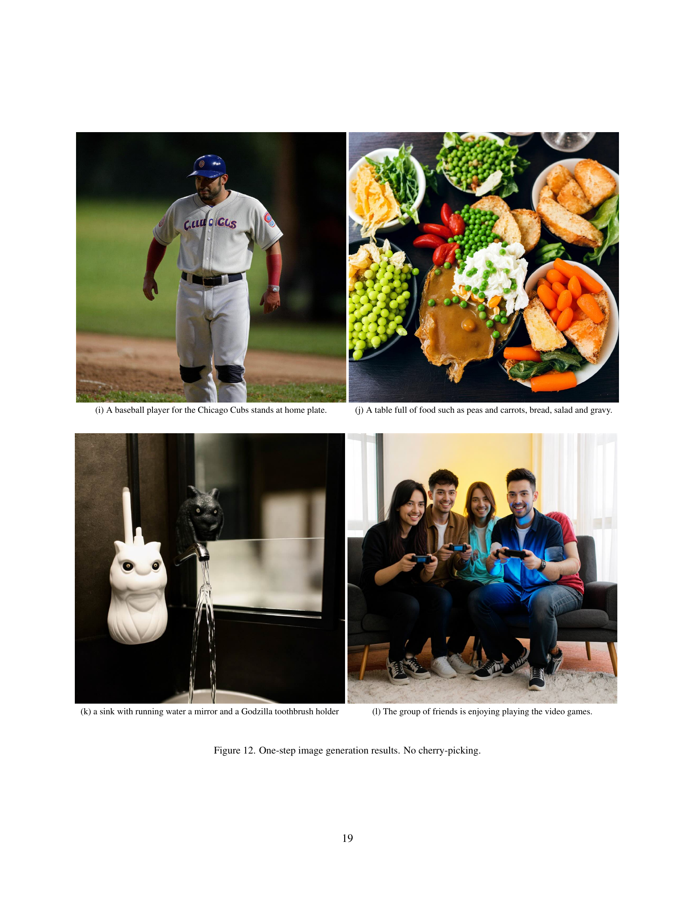

 


 2501.08316 
 Shanchuan Lin et el. 
 
 🤗 2025-01-15 
 



↗ arXiv


↗ Hugging Face


↗ Papers with Code


### TL;DR



기존의 diffusion model은 반복적인 생성 과정으로 속도가 느리고 비용이 많이 드는 문제가 있었습니다.  특히, 고해상도 비디오 생성은 더욱 어려웠습니다.  이러한 문제를 해결하기 위해 기존 연구들은 diffusion step distillation 기법을 사용하여 생성 단계를 줄이려 했지만, 고품질 비디오 생성에는 여전히 어려움이 있었습니다.  단일 단계에서 고품질 비디오를 생성하는 것은 특히 어려운 과제였습니다.

본 연구는 이러한 문제를 해결하기 위해 새로운 방법인 APT(Adversarial Post-Training)를 제안합니다. APT는 diffusion pre-training된 모델을 기반으로 하여, 실제 데이터를 대상으로 adversarial training을 수행하는 방식입니다.  여기에는 모델 아키텍처와 훈련 절차 개선, 그리고 근사 R1 정규화를 포함하여, 훈련 안정성과 품질을 높였습니다.  실험 결과, APT는 2초 길이, 1280x720 해상도, 24fps의 비디오를 단일 전방향 계산으로 실시간 생성할 수 있음을 보였으며,  이는 기존 최첨단 기법들과 비교할 만한 품질을 달성했습니다.



#### Key Takeaways


 단일 단계에서 고해상도(1280x720, 24fps) 비디오 생성을 실시간으로 달성했습니다. 



 APT(Adversarial Post-Training) 기법을 통해 기존의 diffusion modelì˜ 한계를 극복하고, 품질을 크게 향상시켰습니다. 



 대규모 GAN 훈련의 안정성을 높이는 여러 가지 개선 사항(모델 아키텍처, 훈련 절차, R1 정규화)을 제시했습니다. 


#### Why does it matter?
본 논문은 **단일 단계 비디오 생성** 분야에서 획기적인 발전을 제시하며, 고해상도 비디오 생성의 속도와 품질을 크게 향상시켰습니다. 이는 해당 분야 연구의 새로운 지평을 열고, **더욱 효율적이고 실용적인 비디오 생성 모델** 개발에 중요한 기여를 합니다.  또한, **대규모 GAN 훈련**에 대한 새로운 접근 방식을 제시하여, 관련 연구에 귀중한 통찰력을 제공합니다. 따라서, 비디오 생성 및 GAN 분야 연구자들에게 매우 중요한 의미를 가집니다.

------
#### Visual Insights

> 🔼 본 그림은 논문의 방법론(Method) 부분에 제시된 생성기(Generator)와 판별기(Discriminator)의 아키텍처를 보여줍니다.  두 모델 모두 동일한 기반 아키텍처인 확산 트랜스포머(Diffusion Transformer)를 공유하는데, 그림에서는 파란색으로 표시되어 있습니다.  판별기 네트워크에는 추가적인 출력 헤드가 있어 스칼라 로짓(scalar logit)을 생성하는데, 그림에서는 녹색으로 표시되어 있습니다. 이는 판별기가 실제 이미지와 생성된 이미지를 구분하는 데 사용되는 값입니다.  즉,  생성기는 이미지를 생성하고 판별기는 그 이미지의 진위 여부를 판단하는 역할을 하며, 두 모델 모두 동일한 확산 트랜스포머 아키텍처를 기반으로 하지만 판별기에는 추가적인 출력 헤드가 있다는 것을 시각적으로 보여주는 그림입니다.
> 

> 
read the caption

> Figure 1: Architecture overview. Both the generator and the discriminator backbone share the diffusion transformer architecture (blue). We add additional output heads on the discriminator network to produce the scalar logit (green).
> 


| Method             | Result 1                    | Method             | Result 2                    |
|----------------------|-----------------------------|----------------------|-----------------------------|
| **Diffusion** 25 Steps (50NFE) |                             | **Diffusion** 25 Steps (50NFE) |                             |
| **APT** 1 Step (1NFE) |                             | **APT** 1 Step (1NFE) |                             |

> 🔼 이 표는 논문의 4.2절 '사용자 연구'에서, 25단계 확산 모델과 비교하여 단일 단계 이미지 생성의 성능을 정량적으로 비교 분석한 결과를 보여줍니다.  구체적으로는 시각적 충실도, 구조적 무결성, 텍스트 정렬 세 가지 측면에서 단일 단계 모델의 성능 저하 정도를 백분율로 제시합니다.  각 지표에 대해 단일 단계 모델의 성능이 25단계 모델 대비 얼마나 감소했는지를 보여주는 결과는, 단일 단계 생성 모델이 고품질의 이미지를 생성하는 데 어려움을 겪고 있음을 시사합니다.  특히, 구조적 무결성 측면에서의 성능 저하가 상당히 큰 것으로 나타납니다.
> 

> 
read the caption

> Table 1: One-step image generation compared to their corresponding original diffusion models in 25 steps.
> 

### In-depth insights

#### One-Step Diffusion
본 논문에서 제시된 'One-Step Diffusion' 개념은 기존의 반복적인 확산 모델의 계산 비용 문제를 해결하기 위한 혁신적인 시도입니다. **단일 단계 내에서 고품질의 이미지 및 비디오를 생성**하는 것을 목표로 하며, 이는 기존의 다중 단계 확산 과정을 크게 단축시켜 효율성을 높입니다.  이는 **어드버세리얼 포스트 트레이닝(APT)** 기법을 통해 가능해졌는데, 이는 사전 훈련된 확산 모델을 기반으로 실제 데이터에 대한 적대적 훈련을 수행하여 모델의 생성 능력을 향상시키는 방법입니다.  하지만 **단일 단계 생성의 어려움**으로 인해 이미지 디테일과 구조적 무결성, 텍스트 정렬 등에서 여전히 한계를 보이는데, 이는 향후 연구에서 개선되어야 할 부분입니다.  **고해상도 비디오 생성**에 대한 성공적인 시도로 주목할 만하지만,  **모델의 안정적인 훈련**을 위해 다양한 기술적 개선이 이루어졌다는 점 또한 중요한 의미를 지닙니다.  결론적으로, One-Step Diffusion은 컴퓨팅 자원을 효율적으로 사용하면서 고품질의 결과물을 생성할 수 있는 잠재력을 보여주는 접근법이나,  더욱 개선된 성능을 위해 지속적인 연구가 필요합니다.

#### Adversarial Training
본 논문에서 제안하는 APT(Adversarial Post-Training)는 **실제 데이터에 대한 적대적 훈련**을 통해 사전 훈련된 확산 모델을 미세 조정하는 방법입니다.  단순히 기존의 teacher-student 방식의 지식 증류가 아닌, **실제 데이터를 직접 활용**함으로써 teacher 모델의 한계를 넘어 더욱 사실적이고 고품질의 이미지와 비디오를 생성하는 데 중점을 둡니다.  **안정적인 훈련을 위해** 여러 가지 개선 사항을 도입했는데, 여기에는 근사화된 R1 정규화 손실 함수를 사용하여 대규모 모델의 훈련 안정성을 확보하는 것이 포함됩니다.  **생성기의 초기화 전략** 또한 중요한데, 결정적 증류를 통해 생성기 모델을 초기화하고, 이를 통해 초기 훈련 단계의 불안정성을 줄이고 훈련의 효율성을 높이는 효과를 가져옵니다.  **결론적으로**, APT는 단일 단계에서 고해상도 비디오 생성을 가능하게 하면서도, 기존 방법들에 비해 품질과 안정성을 크게 향상시킨 혁신적인 접근 방식임을 보여줍니다.

#### High-Res Video Gen
고해상도 비디오 생성(High-Res Video Gen)은 인공지능 분야에서 특히 어려운 과제입니다.  **기존의 방법들은 계산 비용이 많이 들고 생성 속도가 느린 반면, 본 논문에서는 적대적 사후 훈련(APT)을 통해 고해상도 비디오를 빠르게 생성하는 방법을 제시합니다.**  **핵심은 단일 전방향 통과(single forward pass)로 1280x720, 24fps의 2초짜리 비디오를 실시간으로 생성하는 것입니다.** 이는 기존의 반복적인 생성 과정을 획기적으로 개선한 것으로, **실시간 응용 분야에 큰 영향을 미칠 수 있습니다.**  하지만 **고품질 생성을 위해서는 여전히 큰 모델과 안정적인 훈련 과정이 필요하며, 구조적 무결성과 텍스트 정렬 측면에서는 개선의 여지가 있습니다.**  **추가적인 연구를 통해 이러한 한계점을 극복하고 더욱 향상된 고해상도 비디오 생성 기술을 개발하는 것이 중요합니다.**  특히, **더욱 효율적인 모델 아키텍처와 훈련 기법을 개발하고, 텍스트와 비디오 간의 정렬 문제를 해결하는 연구가 필요합니다.**  APT 기법 자체는 흥미로운 접근 방식이지만, **실제 응용을 위해서는 모델 크기와 훈련 안정성 개선에 대한 추가적인 연구가 필수적입니다.**

#### R1 Regularization
논문에서 R1 정규화에 대한 심층적인 논의는 **GAN(Generative Adversarial Network) 훈련의 안정성을 크게 향상시키는 데 중요한 역할**을 한다는 점을 보여줍니다.  **R1 정규화의 근본적인 목적은 생성자의 붕괴를 방지하고 실제 데이터와 유사한 고품질 이미지 및 비디오를 생성하는 데 있습니다.** 이를 위해, 논문은 기존의 R1 정규화의 계산 비용이 높다는 점을 인지하고, **근사된 R1 정규화를 제안**하여 대규모 모델 학습에서도 효율적으로 적용할 수 있도록 합니다.  **근사된 R1 정규화는 실제 데이터에 대한 판별자의 그래디언트 크기를 제어**하여 학습 과정의 안정성을 유지하는 역할을 합니다.  실험 결과는 근사된 R1 정규화가 **모델의 붕괴를 막고, 보다 현실적이고 세밀한 이미지 및 비디오 생성**에 필수적임을 보여줍니다.  결론적으로, 본 논문은 R1 정규화의 효과적인 적용을 통해 **고품질의 단일 단계 이미지 및 비디오 생성**이라는 중요한 목표를 달성하는 데 기여합니다.

#### Future Directions
본 논문에서 제시된 APT(Adversarial Post-Training) 방법은 고해상도 비디오를 단일 단계로 생성하는 데 있어 획기적인 발전을 이루었지만, 여전히 개선의 여지가 있습니다. **미래 연구 방향**으로는 첫째, **비디오 길이 제한 문제 해결**을 위한 연구가 필요합니다. 현재 모델은 2초 길이의 비디오 생성에 국한되어 있으므로, 더 긴 비디오 생성을 위한 효율적인 방법을 모색해야 합니다. 둘째, **구조적 무결성 및 텍스트 정렬 개선**에 중점을 둔 연구가 필요합니다. 현재 모델은 고품질의 이미지를 생성하지만, 비디오의 구조적 일관성과 텍스트 설명과의 정합성이 떨어지는 경향이 있습니다. 따라서, 이러한 문제점을 해결하기 위한 새로운 손실 함수나 학습 전략을 개발해야 합니다. 셋째, **다양한 데이터셋 및 모델 아키텍처 적용**을 통해 일반화 성능을 향상시키는 연구가 필요합니다. 현재 모델은 특정 데이터셋과 모델 아키텍처에 최적화되어 있으므로, 더 다양한 데이터셋과 아키텍처에 적용 가능하도록 모델의 견고성을 높여야 합니다. 마지막으로, **계산 비용 감소**를 위한 연구가 필요합니다. 고해상도 비디오 생성은 상당한 계산 비용을 필요로 하므로, 더 효율적인 알고리즘이나 하드웨어를 활용하여 계산 비용을 줄이는 방법을 연구해야 합니다.

### More visual insights

More on figures

> 🔼 그림 2는 기존 확산 모델(25단계)과 적대적 사후 훈련(APT) 단일 단계 모델의 이미지 생성 결과를 비교한 것입니다.  분류기 없는 안내(classifier-free guidance)를 사용한 확산 모델은 과다 노출된 비자연스러운 이미지를 생성하는 반면, APT 모델은 시각적 충실도(visual fidelity)를 향상시켜 더욱 자연스럽고 사실적인 이미지를 생성합니다.  즉, 기존의 25단계 확산 모델이 과다 노출 문제로 인해 부자연스러운 이미지를 생성하는 데 반해, APT 모델은 단 한 단계만으로도 더 나은 화질을 제공하며, 자연스러운 이미지 생성에 성공함을 보여줍니다.
> 

> 
read the caption

> Figure 2: Image generation comparison between the original diffusion 25-step model and adversarial post-trained (APT) 1-step model. The diffusion model with classifier-free guidance can generate over-exposed images that look unnatural. APT improves visual fidelity.
> 

> 🔼 이 그림은 논문의 4.1절(정성적 평가)에서 제시된 여러 이미지 생성 결과 중 하나입니다.  '좌절한 아이'라는 짧은 설명과 달리, 실제 그림은 아이의 표정과 자세, 배경 등을 통해 복잡한 감정 상태를 보여줍니다.  정확한 연령이나 상황은 알 수 없지만, 그림은 아이의 감정을 생생하게 포착하여 독자들에게 보다 깊은 이해를 제공하고자 합니다. 이 그림은 논문에서 제안하는 APT 모델과 기존의 25단계 확산 모델의 성능을 비교하는 데 사용되었습니다.
> 

> 
read the caption

> (a) A frustrated child.
> 

> 🔼 런던의 도시 풍경을 보여주는 이미지입니다. 런던의 상징적인 건물들과 거리 모습이 담겨 있으며, 사진은 도시의 역동적인 분위기와 아름다움을 보여줍니다. 다양한 건축 양식과 도시의 넓은 시야가 특징입니다.
> 

> 
read the caption

> (b) The city of London.
> 

> 🔼 이 그림은 부엉이의 눈을 클로즈업하여 생생하게 표현하고 있습니다. 섬세한 깃털의 질감과 눈의 깊이 있는 표현은 이미지의 사실성을 더하고 있으며, 부엉이의 날카로운 시선과 묘한 분위기를 자아냅니다. 빛의 처리와 색감 또한 훌륭하여 마치 실제 부엉이를 보고 있는 듯한 착각을 불러일으킵니다. 이 이미지는 딥러닝 기반의 이미지 생성 모델의 뛰어난 성능을 보여주는 좋은 예시이며, 특히 세밀한 부분까지 묘사할 수 있는 모델의 능력을 강조합니다.
> 

> 
read the caption

> (c) A close-up of the eyes of an owl.
> 

> 🔼 이 그림은 울타리를 뚫고 자라는 나무를 보여줍니다.  울타리는 낡고 부서져 있으며, 나무는 울타리 사이를 비집고 힘차게 자라고 있습니다. 이 그림은 자연의 생명력과 강인함, 그리고 인간의 구조물과 자연의 조화 또는 대립을 보여주는 상징적인 이미지입니다.  나무의 잎과 가지의 디테일, 울타리의 재질 등이 자세하게 묘사되어 있으며, 그림의 전체적인 분위기는 평화로우면서도 역동적인 느낌을 줍니다.
> 

> 
read the caption

> (d) A tree growing through a fence.
> 

> 🔼 그림 3은 다양한 이미지 생성 방법 및 모델들을 비교 분석한 결과를 보여줍니다. 1단계 생성과 대조되는 25단계 확산 모델 생성 결과를 함께 제시하여 비교합니다. 본 논문에서 제안하는 방법은 이미지 디테일 측면에서 상당히 우수하며, 구조적 무결성 측면에서도 최상위권에 속함을 보여줍니다.  즉,  경쟁 모델들보다 더욱 세밀하고 정확한 이미지를 생성하며, 이미지 구성 요소들의 배치 및 연결이 더욱 자연스럽다는 것을 의미합니다.
> 

> 
read the caption

> Figure 3: Image generation comparison across methods and models. We show results of 1-step generation and the corresponding diffusion model 25-step generation. Our method is significantly better in image details and is among the best in structural integrity.
> 

> 🔼 이 그림은 적대적 사후 훈련(APT)이 영상 생성의 디테일과 현실감을 향상시키는 것을 보여주는 좋은 사례입니다. 그림 (a)는 햇빛이 잎사귀 사이로 비추는 서양풍 공주의 얼굴 클로즈업을 보여줍니다. APT는 디테일과 현실감을 향상시켜 인공적인 느낌을 줄이고 더욱 사실적인 이미지를 생성합니다.
> 

> 
read the caption

> (a) Good case: Adversarial post-training enhances details and realism. A Western princess, with sunlight shining through the leaves on her face, facial close-up.
> 

> 🔼 이 그림은 적대적 사후 훈련(APT)이 비디오 생성에 미치는 영향을 보여줍니다. 왼쪽에는 기존 확산 모델의 결과가, 가운데와 오른쪽에는 APT 모델의 결과가 2단계와 1단계로 각각 표시되어 있습니다.  APT 모델은 원본 확산 모델보다 훨씬 더 사실적이고 영화적인 결과를 생성합니다. 특히, 웡카이와이 감독의 스타일을 본떠 상하이 거리에서 치파오를 입은 여성의 뒷모습을 묘사한 장면은 세피아 색조와 밝고 채도 높은 색감으로 인해 APT 모델의 우수성을 잘 보여줍니다.  확산 모델 결과는 합성적인 느낌이 드는 반면 APT 모델 결과는 현실감이 훨씬 뛰어납니다.
> 

> 
read the caption

> (b) Good case: Adversarial post-training produces more realistic and cinematic results, whereas the diffusion results look synthetic. Wong Kar-wai style, on the streets of Shanghai, back shot of a woman walking in a cheongsam, nostalgic sepia tone, brightly saturated colors.
> 

> 🔼 이 그림은 적대적 사후 훈련(APT)이 비디오 생성에 미치는 영향을 보여줍니다.  (c)는 평균적인 사례로, APT는 장면을 생성하지만 구조와 텍스트 정렬이 저하되는 것을 보여줍니다.  1인칭 시점에서 카메라가 교실을 지나 학교 운동장으로 들어가는 모습을 보여줍니다.  APT가 이미지의 세부 사항을 향상시키는 데 효과적이지만, 복잡한 장면이나 긴 시퀀스의 경우 구조적 무결성이나 텍스트 정렬과 같은 측면에서 여전히 한계가 있음을 보여줍니다.
> 

> 
read the caption

> (c) Average case: Adversarial post-training can produce the scene but with degradation in structure and text alignment. First-person perspective, the camera passes through a classroom entering the school playground.
> 

> 🔼 이 그림은 적대적 사후 훈련(APT)이 모든 프롬프트에서 성공적으로 작동하지 않을 수 있음을 보여줍니다.  점토로 만든 전사가 한 손에 흰 종이를 들고 있는데, 바람에 종이가 나부끼고 배경은 박물관입니다.  APT 모델이 이미지의 세부 사항(전사의 손에 있는 종이, 바람에 의해 생기는 움직임)을 생성하는 데 어려움을 겪는 것을 보여주는 실패 사례입니다.  이것은 모델의 한계를 보여주는 예시로, 특히 복잡하거나 특이한 장면을 생성하는 데 어려움을 겪을 수 있음을 시사합니다.
> 

> 
read the caption

> (d) Failure case: Adversarial post-training can fail at some prompts. A terracotta warrior holds a white paper in one hand, and the paper flutters in the wind. The background is a museum.
> 

> 🔼 그림 4는 제안된 적대적 사후 훈련(APT) 방법을 사용한 비디오 생성 결과를 보여줍니다.  왼쪽 열은 기존 확산 모델(25단계)의 결과를, 가운데 열은 APT로 2단계 생성한 결과를, 오른쪽 열은 APT로 1단계 생성한 결과를 보여줍니다.  APT를 사용하면 세부 사항과 현실감이 향상되어 시각적 충실도가 개선됨을 알 수 있습니다. 하지만, 적은 단계의 생성에서는 구조와 텍스트 정렬이 저하되는 현상이 여전히 나타납니다.  즉, APT는 비디오의 세부 묘사 및 사실성을 개선하지만, 단계 수가 적을 경우 구조적 무결성과 텍스트 일관성이 떨어질 수 있다는 것을 보여줍니다.  각 열의 예시는 다양한 비디오 생성 시나리오를 보여줍니다.
> 

> 
read the caption

> Figure 4: Video generation results. Adversarial post-training can improve visual fidelity, i.e. details and realism, but few-step generation still has degradation in structure and text alignment.
> 

> 🔼 그림 5는 R1 규제의 효과를 보여줍니다. 회색 선은 근사된 R1 규제 없이 학습했을 때의 판별자 손실을 나타내며, 손실이 0에 가까워지면서 학습이 실패하는 것을 보여줍니다. 반면에 녹색 선은 근사된 R1 규제를 사용했을 때의 판별자 손실을 나타내며, 손실이 0에 도달하지 않고 안정적인 학습이 진행되는 것을 보여줍니다. 이는 근사된 R1 규제가 학습의 안정성에 중요한 역할을 한다는 것을 시사합니다.
> 

> 
read the caption

> Figure 5: Without approximated R1 regularization, the discriminator loss reaches zero (grey) and the training collapses. With approximated R1 regularization, the discriminator loss does not reach zero (green).
> 

> 🔼 이 그림은 본 논문의 3.3절(Discriminator)에서 다루는 내용을 보여줍니다.  더 깊은 판별자 네트워크(Discriminator network)를 사용하면 생성 품질이 향상됨을 보여주는 실험 결과입니다.  구체적으로,  사전 훈련된 네트워크의 전체 깊이를 포함하는 판별자를 사용했을 때, 절반 또는 3분의 2 깊이만 사용했을 때보다 훨씬 더 좋은 이미지 생성 품질을 얻을 수 있음을 시각적으로 보여줍니다. 각각의 이미지는 특정 깊이의 판별자를 사용하여 생성된 결과를 나타냅니다.  전체 깊이의 판별자를 사용했을 때 더욱 세밀하고 사실적인 이미지가 생성되는 것을 확인할 수 있습니다.
> 

> 
read the caption

> Figure 6: Using a deeper discriminator that includes the full depth of the pre-trained network leads to better generation quality.
> 

More on tables


|---|---|---|---|
|  |  |  |  |
> 🔼 표 2는 최첨단 단일 단계 이미지 생성 모델들과 제안된 APT 모델의 성능을 비교한 표입니다.  절대적 선호도 점수와 기준 모델 성능을 고려하여 조정된 상대적 선호도 점수를 모두 제시합니다.  선호도 점수는 사용자 연구를 통해 얻은 것으로, 시각적 충실도, 구조적 무결성, 텍스트 정렬 세 가지 기준에 따른 평가 결과를 반영합니다.  모델들은 평균 선호도 점수에 따라 정렬되어 있습니다. 이 표는 제안된 방법의 우수성을 보여주는 정량적 데이터를 제공하며,  단일 단계 이미지 생성에서 다른 모델들과의 경쟁력을 평가하는 데 도움을 줍니다.
> 

> 
read the caption

> Table 2: Comparison to the state-of-the-art one-step image generation. Both absolute and relative preference scores (adjusted for base model performance) are presented. The methods are sorted by average preference.
> 


| Method | Ours (Diffusion) | Ours (APT) | FLUX (Dev) | FLUX (Schnell) | SD3.5 (Diffusion) | SD3.5 (Turbo) | SDXL (Diffusion) | SDXL (DMD2) | SDXL (Hyper) | SDXL (Lightning) | SDXL (Nitro) |
|---|---|---|---|---|---|---|---|---|---|---|---| 
| Steps | 25 | 1 | 25 | 1 | 25 | 1 | 25 | 1 | 1 | 1 | 1 |
> 🔼 표 3은 논문에서 제시된 기본 이미지 생성 모델과 다른 기본 확산 모델들을 비교한 결과를 보여줍니다. 모든 모델은 25단계 평가를 거쳤습니다. 본 논문의 모델은 이미지와 비디오 생성 모두를 처리하도록 설계되었기 때문에 FLUX와 SD3.5 모델보다 이미지 생성 성능이 약간 떨어집니다. 이 표는 다양한 기본 확산 모델의 이미지 생성 품질에 대한 상대적인 비교를 제공하여, 본 논문에서 제안된 모델의 성능을 맥락적으로 이해하는 데 도움을 줍니다.
> 

> 
read the caption

> Table 3: Comparison of other base diffusion models with our base model for image generation. All models are evaluated using 25 steps. Since our model is designed to handle both video and image generation, its image generation performance is slightly inferior to FLUX and SD3.5.
> 


|         | 267_ours_25step.jpg | 267_ours_1step.jpg | 267_flux_25step.jpg | 267_flux_1step.jpg | 267_sd35_25step.jpg | 267_turbo_1step.jpg | 267_sdxl_25step.jpg | 267_dmd2_1step.jpg | 267_hyper_1step.jpg | 267_lightning_1step.jpg | 267_nitro_1step.jpg |
|---------|-----------------------|----------------------|----------------------|----------------------|-----------------------|-----------------------|-----------------------|-----------------------|------------------------|--------------------------|------------------------|
| Full    | [https://arxiv.org/html/2501.08316/extracted/6130580/img/qualitative/267_ours_25step.jpg](https://arxiv.org/html/2501.08316/extracted/6130580/img/qualitative/267_ours_25step.jpg) | [https://arxiv.org/html/2501.08316/extracted/6130580/img/qualitative/267_ours_1step.jpg](https://arxiv.org/html/2501.08316/extracted/6130580/img/qualitative/267_ours_1step.jpg) | [https://arxiv.org/html/2501.08316/extracted/6130580/img/qualitative/267_flux_25step.jpg](https://arxiv.org/html/2501.08316/extracted/6130580/img/qualitative/267_flux_25step.jpg) | [https://arxiv.org/html/2501.08316/extracted/6130580/img/qualitative/267_flux_1step.jpg](https://arxiv.org/html/2501.08316/extracted/6130580/img/qualitative/267_flux_1step.jpg) | [https://arxiv.org/html/2501.08316/extracted/6130580/img/qualitative/267_sd35_25step.jpg](https://arxiv.org/html/2501.08316/extracted/6130580/img/qualitative/267_sd35_25step.jpg) | [https://arxiv.org/html/2501.08316/extracted/6130580/img/qualitative/267_turbo_1step.jpg](https://arxiv.org/html/2501.08316/extracted/6130580/img/qualitative/267_turbo_1step.jpg) | [https://arxiv.org/html/2501.08316/extracted/6130580/img/qualitative/267_sdxl_25step.jpg](https://arxiv.org/html/2501.08316/extracted/6130580/img/qualitative/267_sdxl_25step.jpg) | [https://arxiv.org/html/2501.08316/extracted/6130580/img/qualitative/267_dmd2_1step.jpg](https://arxiv.org/html/2501.08316/extracted/6130580/img/qualitative/267_dmd2_1step.jpg) | [https://arxiv.org/html/2501.08316/extracted/6130580/img/qualitative/267_hyper_1step.jpg](https://arxiv.org/html/2501.08316/extracted/6130580/img/qualitative/267_hyper_1step.jpg) | [https://arxiv.org/html/2501.08316/extracted/6130580/img/qualitative/267_lightning_1step.jpg](https://arxiv.org/html/2501.08316/extracted/6130580/img/qualitative/267_lightning_1step.jpg) | [https://arxiv.org/html/2501.08316/extracted/6130580/img/qualitative/267_nitro_1step.jpg](https://arxiv.org/html/2501.08316/extracted/6130580/img/qualitative/267_nitro_1step.jpg) |
| Cropped | [https://arxiv.org/html/2501.08316/extracted/6130580/img/qualitative/267_ours_25step_crop.jpg](https://arxiv.org/html/2501.08316/extracted/6130580/img/qualitative/267_ours_25step_crop.jpg) | [https://arxiv.org/html/2501.08316/extracted/6130580/img/qualitative/267_ours_1step_crop.jpg](https://arxiv.org/html/2501.08316/extracted/6130580/img/qualitative/267_ours_1step_crop.jpg) | [https://arxiv.org/html/2501.08316/extracted/6130580/img/qualitative/267_flux_25step_crop.jpg](https://arxiv.org/html/2501.08316/extracted/6130580/img/qualitative/267_flux_25step_crop.jpg) | [https://arxiv.org/html/2501.08316/extracted/6130580/img/qualitative/267_flux_1step_crop.jpg](https://arxiv.org/html/2501.08316/extracted/6130580/img/qualitative/267_flux_1step_crop.jpg) | [https://arxiv.org/html/2501.08316/extracted/6130580/img/qualitative/267_sd35_25step_crop.jpg](https://arxiv.org/html/2501.08316/extracted/6130580/img/qualitative/267_sd35_25step_crop.jpg) | [https://arxiv.org/html/2501.08316/extracted/6130580/img/qualitative/267_turbo_1step_crop.jpg](https://arxiv.org/html/2501.08316/extracted/6130580/img/qualitative/267_turbo_1step_crop.jpg) | [https://arxiv.org/html/2501.08316/extracted/6130580/img/qualitative/267_sdxl_25step_crop.jpg](https://arxiv.org/html/2501.08316/extracted/6130580/img/qualitative/267_sdxl_25step_crop.jpg) | [https://arxiv.org/html/2501.08316/extracted/6130580/img/qualitative/267_dmd2_1step_crop.jpg](https://arxiv.org/html/2501.08316/extracted/6130580/img/qualitative/267_dmd2_1step_crop.jpg) | [https://arxiv.org/html/2501.08316/extracted/6130580/img/qualitative/267_hyper_1step_crop.jpg](https://arxiv.org/html/2501.08316/extracted/6130580/img/qualitative/267_hyper_1step_crop.jpg) | [https://arxiv.org/html/2501.08316/extracted/6130580/img/qualitative/267_lightning_1step_crop.jpg](https://arxiv.org/html/2501.08316/extracted/6130580/img/qualitative/267_lightning_1step_crop.jpg) | [https://arxiv.org/html/2501.08316/extracted/6130580/img/qualitative/267_nitro_1step_crop.jpg](https://arxiv.org/html/2501.08316/extracted/6130580/img/qualitative/267_nitro_1step_crop.jpg) |
> 🔼 표 4는 제안된 APT 방법을 사용한 1단계 및 2단계 비디오 생성 결과와 원본 25단계 확산 모델의 결과를 비교한 표입니다.  비디오 생성의 시각적 충실도, 구조적 무결성 및 텍스트 정렬 세 가지 측면에서 정량적 평가를 제공합니다.  단계 수를 줄였음에도 불구하고, APT 모델이 원본 모델에 비해 시각적 충실도 측면에서 개선된 성능을 보여주는지, 그리고 구조적 무결성 및 텍스트 정렬 측면에서는 어느 정도의 저하가 발생하는지 알 수 있습니다.  즉,  빠른 생성 속도와 비교적 높은 화질 사이의 절충점을 보여주는 표입니다.
> 

> 
read the caption

> Table 4: Comparison of one-step (and two-step) video generation with the original 25-step diffusion models.
> 


|               |               |               |               |               |               |               |               |               |               |               |
| :------------ | :------------ | :------------ | :------------ | :------------ | :------------ | :------------ | :------------ | :------------ | :------------ | :------------ |
| [047_ours_25step](https://arxiv.org/html/2501.08316/047_ours_25step.png) | [047_ours_1step](https://arxiv.org/html/2501.08316/047_ours_1step.png) | [047_flux_25step](https://arxiv.org/html/2501.08316/047_flux_25step.png) | [047_flux_1step](https://arxiv.org/html/2501.08316/047_flux_1step.png) | [047_sd35_25step](https://arxiv.org/html/2501.08316/047_sd35_25step.png) | [047_sd35_1step](https://arxiv.org/html/2501.08316/047_sd35_1step.png) | [047_sdxl_25step](https://arxiv.org/html/2501.08316/047_sdxl_25step.png) | [047_dmd_1step](https://arxiv.org/html/2501.08316/047_dmd_1step.png) | [047_hyper_1step](https://arxiv.org/html/2501.08316/047_hyper_1step.png) | [047_lightning_1step](https://arxiv.org/html/2501.08316/047_lightning_1step.png) | [047_nitro_1step](https://arxiv.org/html/2501.08316/047_nitro_1step.png) |
| [047_ours_25step_crop](https://arxiv.org/html/2501.08316/047_ours_25step_crop.png) | [047_ours_1step_crop](https://arxiv.org/html/2501.08316/047_ours_1step_crop.png) | [047_flux_25step_crop](https://arxiv.org/html/2501.08316/047_flux_25step_crop.png) | [047_flux_1step_crop](https://arxiv.org/html/2501.08316/047_flux_1step_crop.png) | [047_sd35_25step_crop](https://arxiv.org/html/2501.08316/047_sd35_25step_crop.png) | [047_sd35_1step_crop](https://arxiv.org/html/2501.08316/047_sd35_1step_crop.png) | [047_sdxl_25step_crop](https://arxiv.org/html/2501.08316/047_sdxl_25step_crop.png) | [047_dmd_1step_crop](https://arxiv.org/html/2501.08316/047_dmd_1step_crop.png) | [047_hyper_1step_crop](https://arxiv.org/html/2501.08316/047_hyper_1step_crop.png) | [047_lightning_1step_crop](https://arxiv.org/html/2501.08316/047_lightning_1step_crop.png) | [047_nitro_1step_crop](https://arxiv.org/html/2501.08316/047_nitro_1step_crop.png) |
> 🔼 표 5는 COCO5K 데이터셋에서 다양한 모델과 방법에 대한 정량적 지표(FID, PFID, CLIP)를 보여줍니다. FID는 생성된 이미지와 실제 이미지 간의 차이를 측정하고, PFID는 이미지 세부 사항의 차이를, CLIP은 텍스트와 이미지 간의 일관성을 측정합니다. 논문에서는 이러한 지표가 모델의 실제 성능을 정확하게 반영하지 못한다는 점을 발견하고, 자세한 내용은 부록 A에서 논의합니다.  즉,  정량적 지표는 참고용일 뿐, 모델 성능의 완벽한 척도는 아니라는 것을 보여줍니다.
> 

> 
read the caption

> Table 5: Quantitative metrics on COCO5K across different models and methods. We find the metrics inaccurately capture the actual performance of the model. Discussion are provided in Appendix A.
> 


|  |   |   |   |   |   |   |   |   |   |
|---|---|---|---|---|---|---|---|---|---| 
|  |  |  |  |  |  |  |  |  |  |
|  |  |  |  |  |  |  |  |  |  |
|  |  |  |  |  |  |  |  |  |  |
> 🔼 표 6은 COCO10K 데이터셋을 기반으로 FID, PFID, CLIP 점수를 측정한 양적 지표들을 보여줍니다. 이 지표들은 모델의 성능을 정확히 반영하지 못할 수 있으며, 자세한 내용은 부록 A를 참조하십시오.  본 논문에서는 이미지 생성 품질 평가에 있어서 이러한 양적 지표의 한계점을 지적하고, 사용자 연구 결과를 더 중요하게 다루고 있습니다.
> 

> 
read the caption

> Table 6: Quantitative metrics on COCO10K. The metrics also inaccurately capture the actual performance of the model. Discussion are provided in Appendix A.
> 


|           | 25 steps      | 1 step        | 25 steps      | 1 step        | 25 steps      | 1 step        | 25 steps      | 1 step        | 1 step        | 1 step        | 1 step        |
| :-------- | :------------- | :------------- | :------------- | :------------- | :------------- | :------------- | :------------- | :------------- | :------------- | :------------- | :------------- |
|           |  |  |  |  |  |  |  |  |  |  |  |
|           |  |  |  |  |  |  |  |  |  |  |  |
> 🔼 표 7은 2초 길이, 1280x720 해상도, 초당 24프레임의 비디오를 한 번의 단계로 생성하는 데 필요한 시간을 H100 GPU의 개수에 따라 비교한 표입니다.  GPU 개수가 증가함에 따라 처리 속도가 빨라지는 것을 보여줍니다.  특히, 하나의 H100 GPU를 사용했을 때는 6.03초가 걸렸지만, 8개의 H100 GPU를 병렬 처리했을 때는 실시간 처리가 가능함을 보여줍니다.
> 

> 
read the caption

> Table 7: Inference speed under different numbers of H100 GPUs for one-step two-second 1280×\times×720 24fps video generation.
> 

### Full paper



