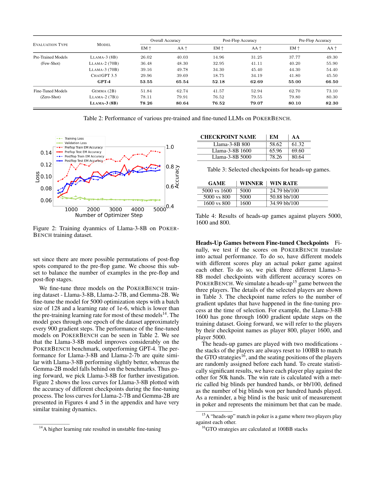

<br>


 2501.08328 
 Richard Zhuang et el. 
 
 🤗 2025-01-15 
 



↗ arXiv


↗ Hugging Face


↗ Papers with Code



### TL;DR




최근 **대규모 언어 모델(LLM)**이 다양한 분야에서 뛰어난 성능을 보이지만, **복잡한 전략적 게임**에서는 여전히 한계를 보입니다. 포커는 불완전 정보 게임으로 수학적 추론, 전략적 사고, 심리적 요인 등 다양한 능력이 필요하기 때문에 LLM의 능력을 평가하는 좋은 척도가 될 수 있습니다. 기존의 포커 AI는 계산 시간이 오래 걸리고, 제한된 시나리오만 처리 가능하며, 상대방의 실수를 이용하지 못하는 등의 단점이 있습니다.  

본 연구는 **LLM의 포커 플레이 능력을 평가하기 위한 새로운 벤치마크인 POKERBENCH**를 제안합니다. POKERBENCH는 **11,000개의 중요한 포커 시나리오**를 포함하며, 포커 전문가들과의 협력을 통해 개발되었습니다.  GPT-4, ChatGPT 등 최신 LLM들을 평가한 결과, 모두 최적의 포커 플레이를 하지 못했지만, **파인튜닝을 통해 성능이 크게 향상**되었음을 확인했습니다.  또한, POKERBENCH 점수가 실제 포커 게임 승률과 높은 상관관계를 보이는 것을 확인하여 벤치마크의 유용성을 검증했습니다.




#### Key Takeaways


 LLM의 포커 플레이 능력 평가를 위한 새로운 벤치마크인 POKERBENCH 제시 



 최첨단 LLM들이 최적의 포커 플레이를 하지 못한다는 사실 발견 및 파인튜닝을 통한 성능 향상 확인 



 POKERBENCH 점수가 실제 포커 게임 승률과 상관관계가 있음을 검증 


#### Why does it matter?
본 논문은 **대규모 언어 모델(LLM)의 포커 플레이 능력을 평가하기 위한 새로운 벤치마크인 POKERBENCH를 제시**함으로써, LLM의 복잡한 게임 플레이 능력 연구에 중요한 기여를 합니다.  **POKERBENCH는 포커 전문가들과 협력하여 개발**되었으며, **다양한 포커 상황을 포괄적으로 다루고 있어 LLM의 포커 전략 및 의사결정 능력을 효과적으로 평가**할 수 있습니다. 또한, **LLM의 포커 플레이 능력 향상을 위한 새로운 연구 방향을 제시**하고 있어, **인공지능 게임 연구 분야에 큰 영향**을 미칠 것으로 예상됩니다.

------
#### Visual Insights


> 🔼 그림 (a)는 논문의 POKERBENCH 벤치마크 데이터셋에 대한 설명 그림입니다.  보다 구체적으로, 그림은 사전 플랍(pre-flop) 단계의 훈련 데이터셋에서 각 행동(액션) 유형(레이즈, 폴드, 콜, 체크)의 비율을 보여줍니다.  이를 통해 모델 훈련에 사용된 데이터의 분포를 이해할 수 있습니다.  플랍 이후 단계의 데이터셋 분포와 비교 분석하여 모델의 성능에 미치는 데이터 불균형의 영향을 파악하는데 도움을 줍니다.
> <details>
> <summary>read the caption</summary>
> (a) Pre-flop Train Set
> </details>



| DATASET TYPE | PRE-FLOP SPOTS | POST-FLOP SPOTS |
|---|---|---|
| PokerBench | 1,000 | 10,000 |
| Training Set | 60,000 | 500,000 |

> 🔼 표 1은 POKERBENCH 벤치마크의 요약 정보를 보여줍니다.  POKERBENCH는  LLM(대규모 언어 모델)의 포커 플레이 능력을 평가하기 위한 벤치마크 데이터셋입니다. 표에는 POKERBENCH 벤치마크에 포함된 프리플랍(pre-flop)과 포스트플랍(post-flop) 시나리오의 개수가 요약되어 있습니다. 프리플랍은 플레이어들이 자신의 카드를 받은 직후의 베팅 라운드이고, 포스트플랍은 공개된 공동 카드를 기반으로 베팅하는 라운드입니다.  데이터셋은 훈련용과 평가용으로 나뉘어져 있으며, 각각의 데이터셋에 포함된 시나리오의 수를 보여줍니다.  이 표는  POKERBENCH 데이터셋의 규모와 구성에 대한 개괄적인 정보를 제공합니다.
> <details>
> <summary>read the caption</summary>
> Table 1: PokerBench summary
> </details>


### In-depth insights


#### LLM Poker Play
LLM을 이용한 포커 게임은 **불완전 정보 게임**의 특성으로 인해 전통적인 NLP 작업보다 훨씬 더 복잡한 과제입니다.  LLM이 수학적 추론, 전략적 사고, 심리적 요인을 고려해야 하기 때문입니다.  연구는 최첨단 LLM이 최적의 포커 전략을 구사하는 데 어려움을 겪는다는 것을 보여주지만, **미세 조정을 통해 상당한 성능 향상**을 이룰 수 있음을 시사합니다. **POKERBENCH와 같은 벤치마크**는 LLM의 포커 플레이 능력을 평가하고 향상시키는 데 중요한 역할을 하며,  **지속적인 연구**를 통해 LLM의 복잡한 게임 플레이 능력을 더욱 발전시킬 수 있을 것으로 기대됩니다.  특히 **GTO 전략**과의 차이점 분석을 통해 LLM 학습 방식의 개선점을 도출하고, 게임 이론적 최적 전략에 근접하는 LLM을 개발하는 데 초점을 맞추는 것이 중요합니다.

#### Pokerbench Eval
Pokerbench 평가는 **대규모 언어 모델(LLM)**의 포커 실력을 평가하기 위한 벤치마크로, **게임 이론적 최적 플레이(GTO)**에 기반하여 설계되었습니다.  **다양한 포커 상황**을 포괄적으로 담고 있어 LLM의 의사 결정 능력을 종합적으로 평가하는 데 유용합니다.  **사전 플롭과 플롭 이후 상황**을 모두 포함하며, 모델의 정확성과 효율성을 측정하는 지표를 제공합니다.  그러나 Pokerbench 평가는 **LLM의 학습 전략과 한계점**을 보여주는 데에도 도움이 됩니다. 단순 지도 학습으로는 최적 전략을 학습하는 데 어려움이 있으며,  **더욱 정교한 학습 방법론**의 필요성을 시사합니다. 따라서 Pokerbench는 LLM의 포커 실력 향상을 위한 벤치마크이자 동시에 LLM의 복잡한 게임 플레이 능력 향상을 위한 연구 방향을 제시하는 중요한 역할을 합니다.  **실제 포커 게임과의 상관관계**가 검증되어 신뢰성을 높였고,  **모델 간의 비교 분석**을 통해 LLM의 발전 과정을 효과적으로 연구할 수 있게 해줍니다.

#### Fine-tuning LLMs
본 논문에서 제시된 "LLM의 미세 조정" 부분은 **대규모 언어 모델(LLM)**의 포커 플레이 능력 향상에 초점을 맞추고 있습니다. 기존의 최첨단 LLM들이 포커 게임에서 최적의 전략을 구사하는 데 어려움을 겪는다는 점을 발견하고, 이를 개선하기 위해 미세 조정 기법을 적용했습니다. **POKERBENCH라는 독자적인 벤치마크 데이터셋**을 사용하여 다양한 LLM 모델을 평가하고, **Llama-3-8B, Llama-2-7B, Gemma-2B와 같은 모델들을 미세 조정**했습니다. 미세 조정 결과, **모델들의 포커 플레이 능력이 향상**되었으며, 특히 Llama-3-8B 모델이 상당한 성능 향상을 보였습니다. 이러한 결과는 **미세 조정이 LLM의 복잡한 게임 플레이 능력 향상에 효과적**임을 보여줍니다. 하지만, 미세 조정된 모델과 GPT-4 간의 대결 결과, 단순한 지도 학습 방식의 미세 조정만으로는 최적의 포커 전략을 학습하는 데 한계가 있음을 시사합니다. 따라서, **더욱 발전된 학습 방법론의 필요성**을 강조하며, **LLM의 복잡한 게임 플레이 능력 향상을 위한 새로운 연구 방향**을 제시하고 있습니다.

#### GTO Strategy
**게임 이론 최적 전략(GTO)**은 포커에서 상대방이 어떤 카드를 가지고 있든 착취당하지 않는 최적의 플레이 방식을 의미합니다.  **GTO 전략은 수학적 모델링과 확률 계산을 기반**으로 하며, 장기적으로 볼 때 가장 수익성이 높은 전략입니다.  하지만 **GTO는 완벽한 정보 게임이 아닌 포커의 불완전 정보 특성 때문에 실제 적용에 어려움**이 있습니다.  상대방의 행동 패턴과 심리 상태를 고려해야 하며, 단순히 수학적 계산만으로는 최적의 플레이를 할 수 없습니다. **LLM이 포커를 플레이하는 데 GTO 전략의 중요성은 상대방의 플레이를 예측하고 대응하는 데 있습니다.**  LLM은 GTO 전략을 학습하여 **장기적인 수익 극대화**를 위한 최적의 의사결정을 내릴 수 있지만,  **실시간 상황 대처 및 상대방 심리 분석**에 대한 추가적인 학습이 필요합니다.  따라서 **LLM이 GTO 전략을 완벽히 구현하기 위해서는 더욱 고도화된 알고리즘과 방대한 데이터**가 필요하며,  향후 연구는 이러한 방향에 집중되어야 할 것입니다.

#### Future of Poker AI
포커 AI의 미래는 **심층 강화 학습 및 대규모 언어 모델의 발전**에 크게 의존할 것입니다.  현재의 포커 AI는 게임 이론적으로 최적의 플레이를 수행하지만, 계산 비용이 많이 들고 실시간 플레이에는 적합하지 않습니다.  **LLM(대규모 언어 모델)을 활용**하면 게임 트리 탐색의 한계를 극복하고, 다양한 상황에서 빠르게 전략을 생성할 수 있습니다.  그러나 LLM은 아직 **인간의 심리적 요소와 불완전 정보 게임의 복잡성**을 완전히 이해하지 못하고 있으므로, 이를 해결하기 위한 연구가 필요합니다.  **혼합 전략**,  즉 게임 이론 최적 전략과 LLM의 직관적 전략을 결합하는 접근법이 유망하며, **인간-AI 협력 시스템** 개발도 중요한 방향이 될 것입니다.  궁극적으로 포커 AI는 **인간 수준 또는 그 이상의 플레이 능력**을 달성하고, 게임 전략에 대한 새로운 통찰력을 제공할 것입니다.  하지만 윤리적인 측면, 특히 AI의 악용 가능성에 대한 고려도 필요합니다.


### More visual insights

<details>
<summary>More on figures
</summary>


> 🔼 그림 (b)는 논문의 POKERBENCH 벤치마크에 사용된 훈련 데이터셋 중 포스트플랍(Post-flop) 단계의 액션 분포를 보여줍니다.  포스트플랍 단계는 플랍(flop), 턴(turn), 리버(river) 세 단계의 카드 공개 이후 베팅이 이루어지는 단계이며,  각 액션(레이즈, 폴드, 콜, 체크, 베트)의 비율을 나타냅니다. 이 그림은 모델의 훈련 과정에서 각 액션의 빈도를 파악하는 데 도움을 줍니다.  데이터 불균형 문제를 해결하기 위해 특정 액션(예: 폴드)에 대한 샘플링 전략이 사용되었을 수 있으며, 이는 모델의 학습 효율에 영향을 미칠 수 있습니다.
> <details>
> <summary>read the caption</summary>
> (b) Post-flop Train Set
> </details>


> 🔼 그림 (c)는 논문의 POKERBENCH 벤치마크에 대한 설명에서 Pre-flop 단계의 벤치마크 데이터셋 분포를 보여줍니다.  Pre-flop은 포커 게임 시작 시 플레이어들이 자신의 카드를 받고 처음으로 베팅을 하는 단계입니다. 이 그림은 Pre-flop 단계에서 발생할 수 있는 다양한 행동(raise, fold, call, check)들의 비율을 시각적으로 나타내어,  POKERBENCH 벤치마크가 Pre-flop 상황을 얼마나 잘 대표하는지를 보여줍니다.  각 행동의 비율은 해당 행동이 Pre-flop 단계에서 얼마나 자주 발생하는지를 나타냅니다.  즉,  데이터 셋에서 각 행동이 차지하는 비율을 보여주는 그래프입니다.
> <details>
> <summary>read the caption</summary>
> (c) Pre-flop Benchmark
> </details>


> 🔼 그림 (d)는 논문의 POKERBENCH 벤치마크에 대한 설명에서, 특히 플랍 이후(post-flop) 시나리오에 대한 행동 분포를 보여줍니다.  각 행동(레이즈, 폴드, 콜, 체크)의 비율을 나타내어, 모델 평가에 사용된 포커 상황의 유형을 보여줍니다.  즉,  실제 포커 게임에서 플랍 이후 어떤 행동이 얼마나 자주 발생하는지에 대한 분포를 시각적으로 보여줍니다.
> <details>
> <summary>read the caption</summary>
> (d) Post-flop Benchmark
> </details>


> 🔼 그림 1은 포커 게임에서의 행동 분포를 보여줍니다. (a)와 (b)는 학습 데이터셋의 행동 분포를, (c)와 (d)는 PokerBench 벤치마크에 포함된 샘플들의 행동 분포를 나타냅니다. 각 그래프는 '올인', '폴드', '콜', '체크', '베팅'과 같은 행동 유형과 그 빈도를 보여주어, 학습 데이터와 벤치마크 데이터 간의 행동 패턴 차이를 비교 분석하는 데 유용한 정보를 제공합니다.  특히, (a)와 (b)는 학습에 사용된 데이터의 균형을 평가하고, (c)와 (d)는 벤치마크의 대표성을 평가하는 데 도움이 됩니다.
> <details>
> <summary>read the caption</summary>
> Figure 1: Action distributions. (a) and (b) show the training dataset distribution, while (c) and (d) show the distribution for hands selected to be part of the PokerBench Benchmark.
> </details>


> 🔼 그림 2는 POKERBENCH 훈련 데이터셋을 사용하여 Llama-3-8B 모델을 훈련시키는 동안의 역동성을 보여줍니다.  그래프는 훈련 단계(Optimizer Step)에 따른 훈련 손실(Training Loss), 검증 손실(Validation Loss), 프리플랍 훈련 EM 정확도(Preflop Train EM Accuracy), 프리플랍 테스트 EM 정확도(Preflop Test EM Accuracy), 포스트플랍 훈련 EM 정확도(Postflop Train EM Accuracy), 그리고 포스트플랍 테스트 EM 정확도(Postflop Test EM Accuracy)를 나타냅니다.  이를 통해 모델의 훈련 과정에서의 성능 변화와 안정성을 파악할 수 있습니다.
> <details>
> <summary>read the caption</summary>
> Figure 2: Training dyanmics of Llama-3-8B on PokerBench training dataset.
> </details>


> 🔼 그림 (a)는 턴이 시작되기 전에 플롭에 단 하나의 높은 숫자 카드(A, K, Q, J, 10 중 하나)만 있고, 다른 카드들은 낮은 숫자 카드이며, 플러쉬나 스트레이트를 만들 수 있는 가능성이 적은 상황(즉, 드라이한 상황)을 보여줍니다.  이러한 상황은 텍사스 홀덤 포커에서 흔히 발생하며, 선수들은 이러한 상황에서 어떻게 베팅할지 전략적으로 결정해야 합니다.  이 그림은 POKERBENCH 벤치마크 데이터셋을 구성하는 보드 텍스쳐 유형 중 하나를 예시로 보여줍니다.
> <details>
> <summary>read the caption</summary>
> (a) Single Broadway Dry
> </details>


> 🔼 그림 (b)는 팟에 흥미로운 액션이 발생할 가능성이 높은 플랍을 보여줍니다. '싱글 브로드웨이 웻'이라는 용어는 플랍에 브로드웨이 카드(A, K, Q, J, 10) 한 장만 있고, 다른 카드가 웻(페어나 드로우 가능성이 높음)인 경우를 의미합니다. 이 유형의 플랍은 플레이어에게 다양한 전략적 선택지를 제공하여 게임을 더욱 흥미롭게 만듭니다.
> <details>
> <summary>read the caption</summary>
> (b) Single Broadway Wet
> </details>


> 🔼 그림 (c)는 텍사스 홀덤 포커에서 플랍(flop) 단계의 보드 텍스처(board texture) 중 하나인 '더블 브로드웨이(Double Broadway)'를 보여줍니다.  브로드웨이 카드(Broadway cards)는 10 이상의 숫자 카드(10, J, Q, K, A)를 의미하며, 더블 브로드웨이란 플랍에 브로드웨이 카드가 두 장 이상 나온 경우를 말합니다. 이러한 유형의 플랍은 강한 스타팅 핸드를 가진 플레이어에게 유리할 수 있으며, 게임의 전개에 큰 영향을 미칠 가능성이 높습니다. 그림에서는 브로드웨이 카드 두 장을 포함한 예시 플랍을 시각적으로 보여줍니다.
> <details>
> <summary>read the caption</summary>
> (c) Double Broadway
> </details>


> 🔼 그림 (d)는 플랍 단계에서 세 장의 카드가 모두 높은 숫자 카드(Broadway cards, 10 이상의 카드)인 경우를 보여줍니다. 이러한 상황은 일반적으로 팟에 많은 돈이 걸려 있고, 플레이어들이 강한 핸드를 가지고 있을 가능성이 높다는 것을 시사합니다. 따라서, 이 시점에서의 플레이어 결정은 매우 중요하며,  상대방의 핸드를 예측하고 자신이 가지고 있는 카드를 바탕으로 최적의 전략을 선택해야 합니다.  게임의 복잡성과 전략적 중요성을 잘 보여주는 예시입니다.
> <details>
> <summary>read the caption</summary>
> (d) Triple Broadway
> </details>


> 🔼 그림 (e)는 텍사스 홀덤 포커 게임에서 사용되는 보드 텍스처의 한 종류인 'Mid Dry'를 보여줍니다.  'Mid Dry'는 플랍(flop)에 낮은 숫자의 카드와 높은 숫자의 카드가 섞여 있고, 특정 패를 만들 확률이 낮은 보드를 의미합니다. 이러한 특징은 플레이어의 전략 결정에 영향을 미치며,  'Mid Dry' 보드는 플레이어가 어떻게 베팅 전략을 선택하는지에 대한 분석에 도움이 됩니다.  해당 그림은 POKERBENCH 벤치마크에서 사용되는 다양한 보드 유형의 예시 중 하나입니다.
> <details>
> <summary>read the caption</summary>
> (e) Mid Dry
> </details>


> 🔼 그림 (f)는 텍사스 홀덤 포커 게임에서 플랍(flop) 단계의 보드 텍스처 유형 중 하나인 '다이내믹(Dynamic)'을 보여줍니다. 다이내믹 보드는 곧바로 승리하는 핸드를 형성하지는 않지만, 다음에 나올 턴(turn)과 리버(river) 카드에 따라 강력한 핸드가 완성될 가능성이 높은 보드를 의미합니다.  즉, 게임의 흐름이 역동적으로 변할 수 있는 상황을 나타냅니다. 그림에서는 다이내믹 보드의 예시로 9♥ 4♥ 7♦ 와 같은 카드 조합이 제시되어 있습니다. 이는 플러시나 스트레이트를 만들 가능성이 있어, 게임 결과에 큰 영향을 미칠 수 있습니다.
> <details>
> <summary>read the caption</summary>
> (f) Dynamic
> </details>


> 🔼 그림 (g)는 매우 습하고 역동적인 플랍의 예시를 보여줍니다.  즉, 여러 강력한 족보(예: 플러시, 스트레이트)가 완성될 가능성이 높고, 게임의 흐름이 빠르게 변화할 수 있는 상황을 나타냅니다.  이러한 플랍에서는  다양한 베팅 전략을 사용할 수 있으며,  상대방의 카드와 베팅 패턴을 정확히 파악하는 것이 중요합니다.
> <details>
> <summary>read the caption</summary>
> (g) Very Wet/Dynamic
> </details>


> 🔼 그림 (h)는 낮은 텍스처의 예시입니다. 즉, 카드의 숫자가 낮은 플롭을 보여줍니다. 이는 포커 게임에서 플레이어의 손패에 따라 전략을 세우는 데 영향을 미칠 수 있습니다.  낮은 숫자의 카드는 일반적으로 강한 패를 만들기 어렵기 때문에, 플레이어는 더욱 신중하게 베팅해야 할 수 있습니다.
> <details>
> <summary>read the caption</summary>
> (h) Low
> </details>


> 🔼 그림 (i)는 5장의 공개 카드가 모두 같은 무늬(예: 모두 하트)인 텍사스 홀덤 포커의 플랍 상황을 보여줍니다. 이러한 상황은 플러시(Flush, 같은 무늬 5장)가 가능하다는 것을 의미하며, 게임 전략에 큰 영향을 미칩니다. 즉, 플레이어는 이 무늬에 맞춰 카드를 가지고 있는지, 또는 상대방이 가지고 있을 가능성을 고려하여 베팅 전략을 세워야 합니다. 이러한 유형의 플랍은 게임의 불확실성을 높이고, 플레이어의 심리적 요소와 전략적 사고를 더욱 중요하게 만듭니다.
> <details>
> <summary>read the caption</summary>
> (i) Monotone
> </details>


> 🔼 그림 (j)는 포커 벤치마크 데이터셋 구성에 사용된 보드 텍스처 중 하나이며, '페어드 드라이(Paired Dry)' 라고 명명되어 있습니다.  이는 플랍(flop, 첫 세 장의 공개 카드)에 페어(같은 숫자의 카드 두 장)가 없고, 드로우(flush나 straight 같은 강한 패를 만들 가능성)가 없는 상황을 나타냅니다.  즉, 보드에 강한 패를 만들 가능성이 적은, 상대적으로 '드라이(dry)'한 상황에서 페어가 없는 패를 의미합니다. 이러한 특징을 가진 플랍은 게임 전략 수립에 있어 특별한 고려가 필요하며, 따라서 포커 벤치마크 데이터셋에 포함되어 모델의 다양한 게임 상황 이해 능력을 평가하는데 활용됩니다.
> <details>
> <summary>read the caption</summary>
> (j) Paired Dry
> </details>


> 🔼 그림 (k)는 텍사스 홀덤 포커 게임에서 사용되는 보드 텍스처 중 하나인 '페어드 다이내믹(Paired Dynamic)'을 보여줍니다.  '페어드 다이내믹'은 플랍(flop)에 두 장의 같은 숫자 카드(페어)가 포함되어 있고, 턴(turn)이나 리버(river)에서 같은 무늬의 카드가 추가로 나올 가능성이 높아 플러쉬(flush)나 스트레이트(straight)가 완성될 가능성이 있는 보드 텍스처 유형을 말합니다.  이러한 보드 텍스처는 게임 전략에 상당한 영향을 미치므로, 포커 AI 모델의 성능 평가를 위해 중요한 데이터로 사용됩니다.
> <details>
> <summary>read the caption</summary>
> (k) Paired Dynamic
> </details>


> 🔼 그림 3은 후술할 포커 벤치마크(POKERBENCH) 데이터셋 생성 과정에서 사용된 플랍(flop) 보드 텍스처 유형들을 보여줍니다.  플랍은 3장의 커뮤니티 카드가 공개되는 포커 게임의 단계이며, 이 시점에서의 보드 패턴은 게임의 향방을 크게 좌우합니다.  POKERBENCH는 플랍 보드의 특징을 11가지 텍스처로 분류하여, 각 텍스처는 유사한 게임 상황을 나타내는 보드들을 포함합니다.  이러한 분류를 통해 전체 플랍 보드의 수를 줄여 모델 평가의 효율성을 높이고,  다양한 게임 상황을 고루 포함하는 균형 잡힌 데이터셋을 구축하는 데 도움이 됩니다.  예시로, (a)는 단일 브로드웨이 드라이(Single Broadway Dry), (b)는 단일 브로드웨이 웻(Single Broadway Wet), (c)는 이중 브로드웨이(Double Broadway), (d)는 삼중 브로드웨이(Triple Broadway), (e)는 중간 드라이(Mid Dry), (f)는 다이나믹(Dynamic), (g)는 매우 웻/다이나믹(Very Wet/Dynamic), (h)는 로우(Low), (i)는 모노톤(Monotone), (j)는 페어드 드라이(Paired Dry), (k)는 페어드 다이나믹(Paired Dynamic) 보드 텍스처를 보여줍니다. 각 텍스처는 플랍 보드의 카드 구성과 강도, 그리고 그에 따른 게임 전략의 유사성을 기준으로 분류되었습니다.
> <details>
> <summary>read the caption</summary>
> Figure 3: Different board textures used to classify flops for filtering post-flop search space.
> </details>


</details>


<details>
<summary>More on tables
</summary>



| Evaluation Type | Model | Overall Accuracy EM ↑ | Overall Accuracy AA ↑ | Post-Flop Accuracy EM ↑ | Post-Flop Accuracy AA ↑ | Pre-Flop Accuracy EM ↑ | Pre-Flop Accuracy AA ↑ |
|---|---|---|---|---|---|---|---| 
| Pre-Trained Models (Few-Shot) | Llama-3 (8B) | 26.02 | 40.03 | 14.96 | 31.25 | 37.77 | 49.30 |
|  | Llama-2 (70B) | 36.48 | 48.30 | 32.95 | 41.11 | 40.20 | 55.90 |
|  | Llama-3 (70B) | 39.16 | 49.78 | 34.30 | 45.40 | 44.30 | 54.40 |
|  | ChatGPT 3.5 | 29.96 | 39.69 | 18.75 | 34.19 | 41.80 | 45.50 |
|  | **GPT-4** | **53.55** | **65.54** | **52.18** | **62.69** | **55.00** | **66.50** |
| Fine-Tuned Models (Zero-Shot) | Gemma (2B) | 51.84 | 62.74 | 41.57 | 52.94 | 62.70 | 73.10 |
|  | Llama-2 (7B)) | 78.11 | 79.91 | 76.52 | 79.55 | 79.80 | 80.30 |
|  | **Llama-3 (8B)** | **78.26** | **80.64** | **76.52** | **79.07** | **80.10** | **82.30** |
> 🔼 이 표는 다양한 사전 훈련된 및 미세 조정된 대규모 언어 모델(LLM)의 포커벤치(PokerBench) 성능을 보여줍니다.  포커벤치는 LLM의 포커 플레이 능력을 평가하기 위한 벤치마크이며, 표에는 각 모델의 사전 훈련(Few-Shot) 및 미세 조정(Zero-Shot) 성능이 정확도(EM, AA)와 함께 제시됩니다.  정확도는 사전 훈련된 모델과 미세 조정된 모델 간의 성능 차이를 보여주는 지표입니다.
> <details>
> <summary>read the caption</summary>
> Table 2: Performance of various pre-trained and fine-tuned LLMs on PokerBench.
> </details>


| CHECKPOINT NAME | EM | AA |
|---|---|---|
| Llama-3-8B 800 | 58.62 | 61.32 |
| Llama-3-8B 1600 | 65.96 | 69.60 |
| Llama-3-8B 5000 | 78.26 | 80.64 |
> 🔼 이 표는 1대1 포커 게임을 위한 세 가지 모델의 체크포인트를 보여줍니다. 각 체크포인트는 Llama-3-8B 모델의 미세 조정 과정에서 특정 최적화 단계를 나타내며, EM(정확히 일치하는 정확도)과 AA(행동 정확도)라는 두 가지 지표를 사용하여 성능이 평가됩니다.  각 지표의 수치는 해당 체크포인트에서 모델의 포커 플레이 능력을 나타냅니다. 이러한 체크포인트는 후속 실험에서 서로 대결하여 POKERBENCH 점수와 실제 포커 게임 승률 간의 상관관계를 분석하는 데 사용됩니다.
> <details>
> <summary>read the caption</summary>
> Table 3: Selected checkpoints for heads-up games.
> </details>


| GAME | WINNER | WIN RATE |
|---|---|---|
| 5000 vs 1600 | 5000 | 24.79 bb/100 |
| 5000 vs 800 | 5000 | 50.88 bb/100 |
| 1600 vs 800 | 1600 | 34.99 bb/100 |
> 🔼 표 4는 세 개의 미세 조정된 Llama-3-8B 모델 검사점 간의 1대1 포커 게임 결과를 보여줍니다. 각 모델은 POKERBENCH 벤치마크에서 다른 점수를 받았습니다. 각 모델은 다른 두 모델과 5만 번의 핸드를 플레이하여 통계적으로 유의미한 결과를 얻었습니다. 표에는 각 게임의 승자와 100핸드당 빅 블라인드(bb/100) 단위로 표현된 승률이 나와 있습니다. 이는 모델의 POKERBENCH 점수와 실제 포커 플레이 성능 간의 상관관계를 평가하기 위한 것입니다.
> <details>
> <summary>read the caption</summary>
> Table 4: Results of heads-up games against players 5000, 1600 and 800.
> </details>


| GAME STAGE | WINNER | WIN RATE |
|---|---|---|
| Overall | GPT-4 | 22.20 bb/100 |
| Pre-flop | 5000 | 17.80 bb/100 |
| Flop | GPT-4 | 34.97 bb/100 |
| Turn | GPT-4 | 24.04 bb/100 |
| River | 5000 | 18.02 bb/100 |
> 🔼 표 5는 5000번 플레이어와 GPT-4 간의 1,000회 헤드업 게임 결과를 보여줍니다. 표본 크기가 제한적이므로 승률의 절대값은 그다지 의미가 없습니다. 대신, 모델 성능을 더 잘 이해하기 위해 플레이 스타일 분석을 제공합니다.  GPT-4는 전체 게임에서, 그리고 플랍, 턴 단계에서도 승률이 높았습니다. 리버 단계에서는 5000번 플레이어가 승률이 더 높았습니다. 이는 GPT-4가 공격적인 플레이 스타일을 보인 반면, 5000번 플레이어는 보다 수동적인 전략을 사용했기 때문입니다.
> <details>
> <summary>read the caption</summary>
> Table 5: Results of the 1,000 heads-up games between Player 5000 and GPT-4. As the sample size is limited, the absolute value of win-rate is less meaningful. Instead, we provide a playing style analysis to better understand the models’ performances.
> </details>


| GAME STAGE | ACTION | GPT-4 | LLAMA |
|---|---|---|---| 
| Pre-flop | Open-Raises (Percentage) | 15.3% | **27.3%** |
| Flop + Turn | Donking-Bets (Percentage) | **25.0%** | 0.0% |
| Flop + Turn | Bets/Raises (Times/Street) | **0.823** | 0.312 |
| River | Bets/Raises (Times/Street) | **0.465** | 0.134 |
> 🔼 이 표는 GPT-4와 미세 조정된 모델(Player 5000)의 플레이 스타일을 요약하여 비교 분석한 결과를 보여줍니다.  프리플랍, 플랍 및 턴, 리버 단계별로 각 모델의 공격성(레이즈 빈도) 및 특정 전략(예: 돈킹 전략 사용 여부)을 정량적으로 비교하여, 각 모델의 강점과 약점을 파악하고 전반적인 플레이 스타일의 차이점을 보여줍니다.
> <details>
> <summary>read the caption</summary>
> Table 6: Playing Style Summary of GPT-4 vs. Player 5000
> </details>


| Few-Shot Prompt |  |
|---|---| 
| ```text
You are a specialist in playing 6-handed No Limit Texas Holdem. The following will be a game scenario and you need to make the optimal decision.

Here is a game summary:

The small blind is 0.5 chips and the big blind is 1 chips. Everyone started with 100 chips.

The player positions involved in this game are UTG, HJ, CO, BTN, SB, BB.

In this hand, your position is HJ, and your holding is [King of Heart and King of Spade].

Before the flop, HJ raise 2.0, CO raise 6.5, and SB raise 17.5. Assume that all other players that is not mentioned folded.

Now it is your turn to make a move.

To remind you, the current pot size is 27.0 chips, and your holding is [King of Heart and King of Spade].

Decide on an action based on the strength of your hand on this board, your position, and actions before you. Do not explain your answer.

Your optimal action is: **all in**
``` |  |
> 🔼 표 7은 사전 훈련된 거대 언어 모델의 몇 번의 시도만으로 평가하기 위해 사용된 예시 프롬프트를 보여줍니다. 위 예시는 하나의 단일 지점에 대한 프롬프트이며, 실제 몇 번의 시도만으로 평가 시나리오에서는 질의 지점이 제시되기 전에 여러 지점이 모델에 제시됩니다.
> <details>
> <summary>read the caption</summary>
> Table 7: Example prompt used for few-shot evaluations of pre-trained LLMs. The above example is a prompt for one single spot. In the few-shot scenario, multiple such spots are presented to the model before the query spot is presented.
> </details>

</details>


### Full paper







