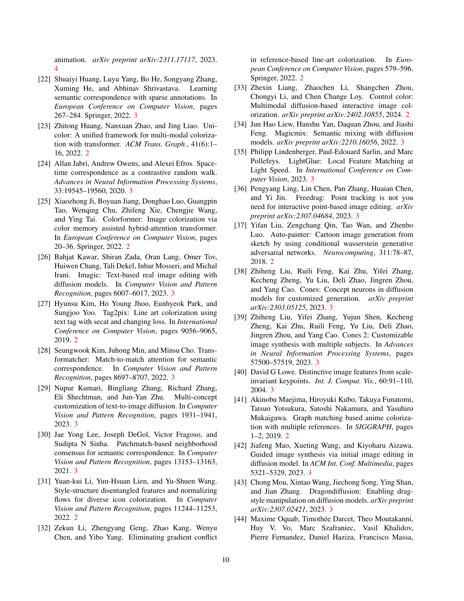
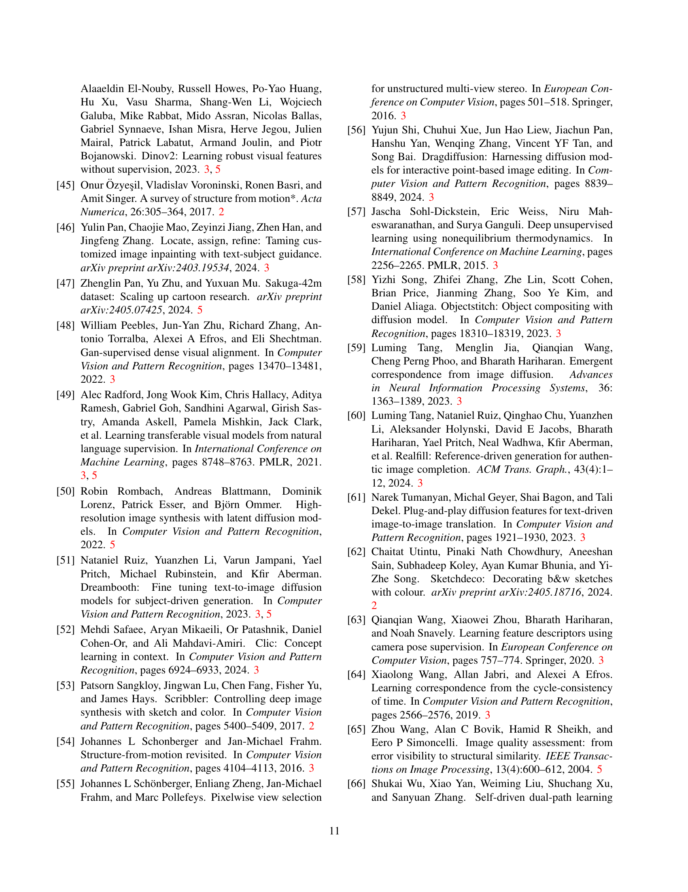

 


 2501.08332 
 Zhiheng Liu et el. 
 
 🤗 2025-01-15 
 



↗ arXiv


↗ Hugging Face


↗ Papers with Code


### TL;DR



라인 아트 색상화는 애니메이션 등 콘텐츠 제작에 중요하지만, 기존 방법은 참조 이미지와 라인 아트 간 차이, 세밀한 제어 부족으로 어려움을 겪습니다. 특히, 복잡한 구성이나 극단적인 자세, 그림자 표현 등에서는 정확도가 떨어지고, 다양한 참조 이미지 활용에도 제한적입니다. 

본 논문에서는 이러한 문제를 해결하기 위해 MangaNinja라는 새로운 방법을 제안합니다. **MangaNinja는 참조 이미지와 라인 아트 간의 정확한 대응을 위해 패치 셔플링 모듈을 사용하고, 사용자의 포인트 제어를 통해 세밀한 색상 조정을 가능하게 합니다.**  실험 결과는 MangaNinja가 기존 방법보다 우수한 성능을 보임을 보여주며, 특히 상호 작용적인 포인트 제어는 다양한 어려운 상황에서도 높은 정확도를 유지하는 데 크게 기여함을 확인했습니다. **이는 애니메이션 산업 등 다양한 분야에 긍정적인 영향을 줄 것으로 기대됩니다.**



#### Key Takeaways


 참조 기반 라인 아트 색상화에서 정확도와 효율성을 크게 향상시키는 MangaNinja 기법 제시 



 패치 셔플링과 PointNet을 활용한 독창적인 방법으로 정교한 색상 매칭 및 상호 작용적인 포인트 제어 기능 구현 



 다양한 실험 결과를 통해 기존 방법 대비 우수한 성능 및 복잡한 작업 처리 능력을 입증 


#### Why does it matter?
**본 논문은 참조 기반 라인 아트 색상화 분야의 새로운 연구이며, 정확도와 효율성을 모두 높이는 혁신적인 방법을 제시합니다.** 기존 방법의 한계를 극복하고, 상호 작용적인 포인트 제어 기능을 통해 복잡한 작업도 가능하게 함으로써 애니메이션 산업 및 다양한 콘텐츠 제작 분야에 상당한 영향을 미칠 것으로 예상됩니다. **특히, 패치 셔플링과 PointNet을 결합한 새로운 접근 방식은 향후 관련 연구에 중요한 참고 자료가 될 수 있으며, 다양한 응용 분야로의 확장 가능성을 제시합니다.**

------
#### Visual Insights

> 🔼 그림 1은 MangaNinja의 라인 아트 색상화 결과를 보여줍니다. MangaNinja는 참조 이미지를 기반으로 라인 아트를 색상화하는 방법으로, 참조 이미지와 라인 아트를 자동으로 정렬하여 매우 일관된 결과를 생성합니다.  사용자는 점 기반 제어 기능을 사용하여 더욱 복잡한 작업을 수행할 수 있습니다.  본 논문에서는 MangaNinja가 애니메이션 산업의 색상화 프로세스를 가속화할 수 있을 것으로 기대합니다.
> 

> 
read the caption

> Figure 1: Line art colorization results. We propose MangaNinja, a reference-based line art colorization method. MangaNinja automatically aligns the reference with the line art for colorization, demonstrating remarkable consistency. Additionally, users can achieve more complex tasks using point control. We hope that MangaNinja can accelerate the colorization process in the anime industry.
> 

### In-depth insights

#### Diffusion-based Coloring
본 논문에서 제시된 확산 기반 컬러링(Diffusion-based Coloring)은 **기존의 참조 기반 라인 아트 컬러링 방식의 한계를 극복하기 위한 혁신적인 접근 방식**입니다. 기존 방법들은 라인 아트와 참조 이미지 간의 차이로 인해 의미론적 불일치나 색상 혼동이 발생하는 문제점을 지니고 있었으며, 세밀한 제어 기능이 부족하여 참조 이미지의 중요한 세부 정보가 손실되는 문제가 있었습니다.  하지만 본 논문의 확산 기반 컬러링은 **패치 셔플링 모듈**을 통해 라인 아트와 참조 이미지 간의 국소적 일치 학습을 강화하여 이러한 문제를 해결합니다. 또한, **점 기반 제어 방식**을 도입하여 사용자가 원하는 부분에 대한 색상을 세밀하게 조절할 수 있도록 합니다. 이러한 두 가지 설계를 통해 **정확한 캐릭터 디테일 전사**가 가능해집니다.  **사전 훈련된 확산 모델의 풍부한 사전 정보**를 활용하여 라인 아트와 참조 이미지 간의 대응 관계를 효과적으로 찾아내고, 다양한 어려운 상황(극단적인 포즈, 그림자, 여러 참조 이미지 사용 등)에서도 우수한 성능을 보입니다.  결과적으로, 본 논문의 확산 기반 컬러링은 애니메이션 산업에서 컬러링 과정을 가속화하고, 보다 정확하고 창의적인 결과물을 얻을 수 있도록 도울 것으로 기대됩니다.

#### Patch Shuffling Impact
패치 셔플링 기법은 **참조 이미지와 라인 아트 간의 불일치 문제**를 해결하기 위한 핵심 전략입니다. 단순히 전체 이미지를 비교하는 대신, **참조 이미지를 작은 패치들로 나누어 무작위로 섞는 과정**을 통해 모델이 국소적인 특징 매칭에 집중하도록 유도합니다. 이는 전역적인 스타일 전달이 아닌, **세밀한 의미적 매칭**을 가능하게 합니다.  **모델의 학습 과정에서 불확실성을 증가**시켜, 단순한 전역 매칭에 의존하지 않고 보다 **강건하고 정확한 국소적 특징 학습**을 유도하는 효과를 가져옵니다.  결과적으로,  **다양한 포즈와 그림자, 복잡한 구성** 등 어려운 상황에서도 정확한 색상 매칭을 가능하게 하여, 보다 자연스럽고 정교한 결과를 얻을 수 있습니다.  **패치 셔플링의 단계적 적용**은 모델이 먼저 전역적 특징을 학습한 후 점차적으로 국소적 특징에 집중하도록 돕는 효과적인 학습 전략입니다.

#### Point Control Refinement
포인트 제어 개선은 참고 이미지와 선화 이미지 간의 세밀한 일치를 가능하게 하는 핵심적인 부분입니다. **패치 셔플링 기법**을 통해 모델은 국소적인 특징 매칭에 집중하여 선화에 존재하지 않는 참고 이미지의 세부적인 부분(예: 그림자, 섬세한 패턴)을 효과적으로 처리할 수 있습니다.  **포인트 기반 제어**는 사용자가 직접 특정 영역의 색상을 지정하여 모델의 색상 선택에 영향을 줄 수 있게 합니다. 이는 **극도의 포즈, 그림자, 그리고 복잡한 구도**와 같은 어려운 상황에서도 정확한 색상 일치를 달성하는 데 중요한 역할을 합니다.  **멀티 레퍼런스 및 상호 참조 해결** 또한 포인트 제어를 통해 가능해집니다. 서로 다른 참고 이미지의 정보를 조합하여 보다 완벽한 컬러링 결과를 생성할 수 있게 됩니다.  결론적으로, 포인트 제어 개선은 정확성과 유연성을 모두 높여 다양한 애니메이션 스타일과 복잡한 시나리오에 적용 가능한 강력한 라인 아트 색칠 시스템을 구축하는 데 기여합니다.

#### Benchmark & Evaluation
본 논문의 벤치마크 및 평가는 **기존 방법론의 한계를 극복하기 위한 새로운 기준 마련**에 중점을 두고 있습니다.  기존 연구들은 특정 도메인에 국한되거나 참조 이미지와 대상 이미지 간의 차이가 적은 데이터셋을 사용하는 경우가 많았고, 평가 지표 또한 일관되지 않았다는 점을 지적합니다. 이에 따라 **다양한 애니메이션 스타일과 복잡한 시나리오를 포함하는 포괄적인 벤치마크 데이터셋**을 구축하여 객관적이고 체계적인 평가를 수행합니다.  **PSNR, MS-SSIM, CLIP 및 DINO 유사도, 그리고 LPIPS와 같은 다양한 지표**를 활용하여 정량적 분석을 실시하고, **정성적 평가를 통해 시각적 충실도와 정체성 보존** 측면을 종합적으로 평가합니다. 특히, 여러 참조 이미지를 사용하거나 참조와 대상 이미지 간 차이가 큰 복잡한 상황에서의 성능을 중점적으로 평가함으로써, **모델의 견고성과 실제 적용 가능성**을 높이 평가합니다. 이러한 꼼꼼한 벤치마크 및 평가 과정을 통해 제시된 MangaNinja 모델의 우수성을 보다 신뢰도 있게 입증합니다.

#### Future Research Needs
본 논문은 만화 이미지의 정확한 색상화를 위한 참조 기반 방법인 MangaNinja를 제시합니다.  **미래 연구는 몇 가지 중요한 방향으로 나아갈 수 있습니다.** 첫째, **다양한 스타일과 복잡한 배경을 가진 만화 이미지에 대한 일반화 성능을 높이는 것**입니다.  현재 모델은 특정 스타일의 데이터셋으로 학습되었으므로, 다양한 스타일의 이미지에 대한 적응력을 높이기 위한 추가 연구가 필요합니다. 둘째, **점 기반 제어의 효율성을 개선하는 것**입니다.  사용자 입력에 대한 의존도를 줄이고, 보다 자연스럽고 직관적인 상호작용을 가능하게 하는 알고리즘 개발이 중요합니다. 셋째, **시간적 일관성을 유지하는 비디오 만화 색상화** 연구입니다. 프레임 간의 일관성을 유지하면서 효율적으로 색상화하는 것은 어려운 과제이며, 동영상 편집 및 애니메이션 제작 분야에 큰 영향을 미칠 수 있습니다.  넷째, **다양한 입력 모드(텍스트, 스케치 등)를 통합하여 보다 유연하고 강력한 시스템을 구축**하는 연구입니다.  마지막으로, **에너지 효율적인 모델 경량화 및 실시간 처리를 위한 최적화** 연구가 필요합니다.  이러한 연구를 통해 MangaNinja는 만화 산업 뿐 아니라 다양한 이미지 색상화 응용 분야에 더욱 널리 활용될 수 있을 것입니다.

### More visual insights

More on figures

> 🔼 그림 2는 MangaNinja가 점 기반 안내를 통해 어떻게 다양한 어려운 작업들을 처리할 수 있는지 보여줍니다. 예를 들어, 참조 이미지와 라인 아트 간에 상당한 차이가 있더라도 세부 정보를 유지하면서 색상을 정확하게 일치시킬 수 있습니다. 4.3절에서 더 자세히 설명합니다.
> 

> 
read the caption

> Figure 2: Visualization of point guidance. By introducing points as guidance, MangaNinja can tackle many challenging tasks, such as when there are significant variations between reference images and line art while preserving details. See more in Sec. 4.3.
> 

> 🔼 그림 3은 MangaNinja의 훈련 과정을 보여줍니다. 비디오 데이터에서 두 프레임을 무작위로 선택하여 하나는 참조 이미지로, 다른 하나는 라인 아트 이미지로 사용합니다. 두 프레임 모두 각각 참조 U-Net과 잡음 제거 U-Net에 입력됩니다. 모델의 자동 매칭 및 세밀한 제어 기능을 향상시키기 위해 점진적 패치 셔플링을 포함한 일련의 훈련 전략을 제안합니다. 또한 기존 모델을 사용하여 두 프레임에서 매칭 포인트를 추출하고 이러한 점 지도를 PointNet을 통해 주 분기에 입력합니다.
> 

> 
read the caption

> Figure 3: The training process of MangaNinja. We randomly select two frames from video data, using one frame as a reference image and extracting the line art from the other. Both frames are input into the Reference U-Net and the Denoising U-Net, respectively. To enhance the model’s automatic matching and fine-grained control capabilities, we propose a series of training strategies, including progressive patch shuffling. Additionally, we employ an off-the-shelf model to extract matching points from the two frames, and these point maps are fed into the main branch through PointNet.
> 

> 🔼 그림 4는 제안된 MangaNinja 방법과 기존의 최첨단 비생성적 컬러라이제이션 방법인 BasicPBC, 일관성 생성 방법인 IP-Adapter, AnyDoor 방법을 비교한 결과를 보여줍니다.  결과는 MangaNinja가 색상 정확도와 생성된 이미지 품질 면에서 다른 방법들보다 상당히 우수함을 보여줍니다. 특히, MangaNinja는 생성 결과에 포인트 기반의 가이드를 사용하지 않고도 우수한 성능을 달성했다는 점을 강조합니다.  각 방법의 결과 이미지를 나란히 배치하여 시각적으로 비교하며, 참조 이미지, 라인 아트, 각 방법의 결과 이미지, 그리고 정답 이미지를 함께 제시합니다. 이를 통해 사용자는 각 방법의 장단점과 제안된 방법의 우수성을 명확하게 이해할 수 있습니다.
> 

> 
read the caption

> Figure 4: Qualitative comparisons. We compare our method with the state-of-the-art non-generative colorization method BasicPBC, the consistency generation method IP-Adapter, and AnyDoor. The results demonstrate that our method significantly outperforms them in terms of colorization accuracy and generated image quality. Notably, our method does not use points for guidance in the generated results.
> 

> 🔼 그림 5는 다양한 자세나 누락된 세부 정보가 있는 어려운 상황에서 점 기반 안내를 사용하여 MangaNinja가 어떻게 여러 가지 어려운 작업을 처리할 수 있는지 보여줍니다.  첫 번째와 두 번째 줄에서는 참조 이미지와 라인 아트 간에 상당한 차이가 있습니다.  또한, 사용자는 참조 이미지에 일치하는 부분이 없는 영역이나 요소(예: 세 번째 샘플의 옷 아랫부분)를 색칠하기 위해 점 기반 안내를 사용할 수 있습니다. 여러 개체를 처리할 때 점 기반 안내는 색상 혼동을 효과적으로 방지합니다(마지막 줄).
> 

> 
read the caption

> Figure 5: Visualization of varying poses or missing details. With point guidance, MangaNinja can tackle many challenging cases. For instance, in the first two rows, there are significant variations between the reference image and line art. Furthermore, users can employ point guidance to colorize regions or elements with no matches in the reference; for example, the lower parts of the clothing are missing in the reference image of the third sample. When dealing with multiple objects, point guidance effectively prevents color confusion, as demonstrated in the last row.
> 

> 🔼 그림 6은 MangaNinja의 다중 참조 이미지 색상화 기능을 보여줍니다. 사용자는 여러 개의 참조 이미지에서 특정 영역을 점으로 선택하여 선화 이미지의 모든 요소에 대한 가이드를 제공할 수 있습니다.  또한, MangaNinja는 여러 참조 이미지에서 유사한 시각적 요소 간의 충돌을 효과적으로 해결합니다.  즉, 서로 다른 참조 이미지에서 같은 대상의 색상이 조금씩 다르더라도, MangaNinja는 이러한 차이점들을 조화롭게 통합하여 일관성 있는 색상을 생성합니다.
> 

> 
read the caption

> Figure 6: Visualization of multi-ref colorization. MangaNinja enables users to select specific areas from multiple reference images through points, providing guidance for all elements in the line art. Additionally, it effectively resolves conflicts between similar visual elements across the reference images.
> 

### Full paper



