 


 2501.08828 
 Kuicai Dong et el. 
 
 🤗 2025-01-16 
 



↗ arXiv


↗ Hugging Face


↗ Papers with Code


### TL;DR



기존의 다모달 문서 검색 평가 벤치마크는 질문의 질, 문서의 질, 검색의 세분성 측면에서 부족한 점이 많았습니다. 특히, 장문 문서에 대한 다모달 검색 평가는 더욱 어려운 과제였습니다.  본 논문에서는 이러한 문제를 해결하기 위해 새로운 벤치마크인 MMDocIR을 제안합니다. 

MMDocIR은 페이지 수준과 레이아웃 수준의 두 가지 검색 과제를 포함하며, 1,685개의 질문과 페이지/레이아웃 수준의 주석을 포함하는 풍부한 데이터셋을 제공합니다.  실험 결과, 시각 기반 검색 방식이 텍스트 기반 방식보다 훨씬 우수한 성능을 보였으며, MMDocIR 학습 데이터셋을 활용한 다모달 검색 모델의 성능 향상을 확인했습니다. 이러한 결과는 시각 정보의 중요성을 강조하며, 다모달 문서 검색 시스템 개발에 새로운 방향을 제시합니다.



#### Key Takeaways


 새로운 다모달 문서 검색 벤치마크 MMDocIR 제시 



 시각 정보가 텍스트 정보보다 검색 성능에 더 크게 기여 



 MMDocIR 데이터셋과 실험 결과를 통해 다모달 검색 시스템 성능 향상 가능성 제시 


#### Why does it matter?
본 논문은 **장문 문서에 대한 다모달 검색의 성능을 평가하기 위한 새로운 벤치마크인 MMDocIR을 제시**함으로써, 연구자들이 다모달 검색 시스템의 성능을 효과적으로 평가하고 향상시킬 수 있는 기반을 마련합니다. 또한, **시각 정보가 텍스트 정보보다 검색 성능에 훨씬 크게 기여**한다는 것을 밝힘으로써 다모달 검색 분야의 미래 연구 방향을 제시합니다. **새로운 벤치마크 데이터셋과 실험 결과는 다모달 검색 시스템 개발에 직접적으로 활용**될 수 있으며, 다양한 연구자들에게 큰 도움이 될 것입니다.

------
#### Visual Insights

> 🔼 그림 1은 MMDocIR 데이터셋이 10개의 서로 다른 도메인에서 수집된 313개의 긴 문서와 1,685개의 질문-답변 쌍으로 구성되어 있음을 보여줍니다. 각 질문에 대해, 선택된 스크린샷을 통해 페이지 수준의 어노테이션이 제공되며, 빨간색 경계 상자는 레이아웃 수준의 어노테이션을 나타냅니다.  즉,  시스템이 특정 페이지뿐 아니라 페이지 내 특정 레이아웃(텍스트 단락, 수식, 표, 그림 등)까지 정확하게 찾을 수 있도록 세분화된 주석이 달려있다는 것을 의미합니다.
> 

> 
read the caption

> Figure 1. MMDocIR comprises 313 lengthy documents across 10 different domains, along with 1,685 questions. For each question, page-level annotations are provided via selected screenshots. Red boundary boxes represent layout-level annotations.
> 


| Benchmarks | Question Type | By Expert? | For IR? | #Num | Evidence Type | Document Domain | #Pages | Document Source | Page | Label Layout | 
|---|---|---|---|---|---|---|---|---|---|---|
| DocCVQA (Tito et al., 2021) | VQA question | ✓ | ✓ | 20 | TXT/L | Finance | 1.0 | ✓ | ✓ | ✗ | 
| SciMMIR (Wu et al., 2024) | Image caption | ✗ | ✗ | 530K | TAB/I | Science | 1.0 | ✗ | ✗ | ✗ | 
| ViDoRe (Faysse et al., 2024) | VQA question | ✓ | ✗ | 3,810 | TXT/C/TAB/I | Multi-domain | 1.0 | ✗ | ✓ | ✗ | 
| PDF-MVQA (Ding et al., 2024) | Search query | ✗ | ✓ | 260k | TXT/TAB/I | Biomedical | 9.6 | ✓ | ✓ | ✓ | 
| MMLongBench-Doc (Ma et al., 2024b) | VQA question | ✓ | ✗ | 1,082 | TXT/L/C/TAB/I | Multi-domain | 47.5 | ✓ | ✓ | ✗ | 
| Wiki-SS (Ma et al., 2024a) | Natural question | ✗ | ✓ | 3,610 | TXT | Wikipedia | 1.0 | ✗ | ✓ | ✗ | 
| DocMatix-IR (Ma et al., 2024a) | VQA question | ✗ | ✗ | 5.61M | TXT/L/C/TAB/I | Multi-domain | 4.2 | ✓ | ✓ | ✗ | 
| MMDocIR | VQA question | ✓ | ✓ | 1,658 | TXT/C/TAB/I | Multi-domain | 65.1 | ✓ | ✓ | ✓ |

> 🔼 표 1은 본 논문에서 제안하는 새로운 벤치마크인 MMDocIR과 기존의 문서 검색 데이터셋들을 비교 분석한 표입니다.  MMDocIR의 특징과 차이점을 명확히 보여주기 위해 질문 유형, 전문가 검토 여부, IR 적합성, 증거 유형, 도메인, 페이지 수, 데이터 출처, 페이지 레이블, 레이아웃 레이블 등의 다양한 측면에서 비교 분석하고 있습니다.  TXT/L/C/TAB/I는 순수 텍스트, 일반화된 레이아웃, 차트, 표, 이미지를 각각 나타냅니다.  기존 데이터셋들이 가지는 질문의 질, 문서의 질, 검색 세분성(granularity) 등의 한계점을 MMDocIR이 어떻게 개선하는지 확인할 수 있습니다.
> 

> 
read the caption

> Table 1. Comparison between our benchmark and previous Document IR datasets. TXT/L/C/TAB/I: pure text/generalized layout/chart/table/image.
> 

### In-depth insights

#### MMDocIR Benchmark
MMDocIR 벤치마크는 **장문 문서에 대한 다중 모드 검색 성능 평가를 위한 새로운 기준**을 제시합니다. 기존 벤치마크의 한계를 극복하고자 **페이지 단위 및 레이아웃 단위 검색이라는 두 가지 과제**를 제시하며, **페이지 수준의 관련성뿐 아니라, 표, 그림, 방정식 등 세부 레이아웃 요소의 정확한 식별까지 평가**합니다.  **1,685개의 질문-답변 쌍과 페이지/레이아웃 수준의 주석**을 포함한 풍부한 데이터셋을 제공하여, 다양한 다중 모드 검색 시스템의 성능을 종합적으로 평가할 수 있도록 합니다.  **시각적 검색 시스템이 텍스트 기반 시스템보다 우수한 성능을 보이며, MMDocIR 학습 데이터셋이 다중 모드 문서 검색 모델 학습에 효과적으로 기여**한다는 것을 실험을 통해 밝혀냈습니다.  결론적으로 MMDocIR 벤치마크는 **다중 모드 문서 검색 기술 발전에 중요한 기여**를 할 것으로 기대됩니다.

#### Dual-Task Retrieval
본 논문에서 제안하는 **듀얼 태스크 검색(Dual-Task Retrieval)**은 장문 문서 검색의 효율성과 정확성을 높이기 위한 혁신적인 접근 방식입니다. 기존의 단순 페이지 단위 검색을 넘어, **페이지 수준 검색(page-level retrieval)**과 **레이아웃 수준 검색(layout-level retrieval)**이라는 두 가지 과제를 동시에 수행합니다. 페이지 수준 검색은 질의에 가장 관련성이 높은 페이지를 식별하는 반면, 레이아웃 수준 검색은 단락, 방정식, 표, 그림 등 구체적인 레이아웃 요소까지 정확하게 찾아냅니다. 이는 **세분화된 검색 정확도**를 제공하며, 사용자 질의에 대한 더욱 정확하고 포괄적인 답변을 가능하게 합니다. **다양한 형태의 콘텐츠(텍스트, 이미지, 표, 차트)**를 통합적으로 처리하여, 단순 텍스트 기반 검색의 한계를 극복합니다. 이러한 접근 방식은 **다양한 모달리티의 데이터를 활용**, 사용자 질의에 대한 더욱 풍부하고 정확한 정보를 제공할 수 있습니다.  **MMDocIR 벤치마크**는 이러한 듀얼 태스크 검색의 성능을 평가하기 위한 표준화된 평가 기준을 제공하며, 향후 다양한 응용 분야에서의 **멀티모달 문서 검색 기술 발전**에 기여할 것으로 예상됩니다.

#### Visual Retrieval Wins
본 논문에서 "Visual Retrieval Wins"라는 제목을 가진 부분은 시각적 정보를 활용한 검색 방식이 텍스트 기반 검색보다 우수한 성능을 보여주는 현상을 설명합니다. **이는 시각 정보가 문서 이해에 중요한 역할을 하며, 단순 텍스트만으로는 파악하기 어려운 의미를 시각적 요소가 보완하기 때문**입니다.  특히, 복잡하고 긴 문서에서 다양한 형태의 정보(표, 차트, 이미지 등)를 포함하는 경우, 시각적 검색이 텍스트 정보만을 이용하는 검색보다 훨씬 효과적임을 보여줍니다. **단순히 OCR을 통해 텍스트로 변환하는 것보다, 이미지 자체를 직접 처리하는 것이 더욱 정확하고 효율적인 정보 검색**을 가능하게 합니다.  **이는 딥러닝 기반의 비전-언어 모델(VLMs)의 발전과 그 활용 덕분**이며, 이러한 기술 발전이 다양한 형태의 정보를 포함하는 복잡한 문서에서 정보 검색의 정확도와 효율성을 크게 향상시킨다는 것을 시사합니다.  **MMDocIR 벤치마크 결과는 이러한 시각적 검색의 우월성을 뒷받침하는 강력한 증거**가 되며, 앞으로 멀티모달 문서 검색 분야의 연구 방향에 중요한 영향을 미칠 것으로 예상됩니다.

#### VLM-Text Advantage
본 논문은 VLM(Vision-Language Model) 기반 텍스트가 OCR 텍스트보다 훨씬 우수한 성능을 보이는 **VLM-Text의 장점**을 심도있게 다룹니다.  **VLM은 이미지와 텍스트를 통합적으로 이해**하여, 단순한 OCR 텍스트 변환의 한계를 뛰어넘어 시각적 정보까지 담아내는 강점을 지닙니다.  **특히 표나 그림과 같은 비텍스트적 요소**를 처리할 때, VLM-Text는 OCR 방식보다 훨씬 풍부하고 정확한 정보를 추출하여, **다모달 문서 검색의 정확도 향상**에 크게 기여합니다.  단순히 이미지를 텍스트로 변환하는 것 이상으로, **VLM은 이미지의 시각적 의미를 이해하고 텍스트 정보와 결합**하여 더욱 심층적인 의미를 파악합니다.  하지만 VLM-Text는 OCR-Text보다 계산 비용이 많이 들고 처리 시간이 길다는 단점도 존재합니다.  따라서, 실제 적용 시에는 **성능과 효율성 사이의 균형**을 고려해야 합니다.  결론적으로, VLM-Text는 **다모달 문서 검색 시스템의 정확도와 효율성을 개선**하는데 중요한 역할을 하지만,  **계산 자원의 제약** 또한 고려해야 할 중요한 요소임을 시사합니다.

#### Future Directions
본 논문에서 제시된 다양한 모델들의 성능 비교 결과를 바탕으로 볼 때, **시각 정보를 효과적으로 활용하는 다중 모드 검색 시스템**의 중요성이 강조됩니다.  향후 연구 방향은 **더욱 정교한 시각적 특징 추출 및 처리 기술** 개발에 집중되어야 합니다.  **OCR 기술의 한계를 극복**하고 이미지 내 텍스트뿐 아니라 표, 차트 등 다양한 시각 요소를 정확하게 이해하고 활용하는 기술이 필요합니다. 또한, **다양한 문서 유형 및 도메인에 대한 일반화 성능 향상**을 위한 연구가 필요하며, **장문 문서 처리에 대한 효율성 개선**도 중요한 과제입니다.  **보다 정확하고 세분화된 레이아웃 수준의 검색 기능**을 제공하는 시스템 개발 및 **대규모 다중 모드 데이터셋 구축**을 통한 모델 학습 방식 개선도 중요한 연구 과제로 생각됩니다.  마지막으로, **다중 모드 검색 시스템의 실제 응용 분야 확대**를 위한 연구가 필요하며, 이를 위해서는 사용자 경험과 관련된 연구도 병행되어야 할 것입니다.

### More visual insights

More on figures

> 🔼 그림 2는 MMLongBench-Doc 벤치마크에서 다양한 모달리티(텍스트, 이미지, 표, 제목)의 영역 비율을 전체적으로 그리고 도메인별로 보여줍니다.  백색 공간, 머리글, 바닥글은 영역 계산에서 제외되었습니다.  이 그림은 각 도메인에서 텍스트, 이미지, 표, 제목 등 다양한 모달리티가 차지하는 비율을 시각적으로 보여주어,  멀티모달 문서 검색에서 각 모달리티의 중요성을 파악하는 데 도움이 됩니다.
> 

> 
read the caption

> Figure 2. Area ratio of different modalities (1) in overall and (2) by domains in MMLongBench-Doc benchmark (Ma et al., 2024b). Note that the white spaces, headers, and footers are removed from the area counting.
> 

> 🔼 이 그림은 (a) 평균 단어 길이와 (b) 단어 길이 분포 밀도를 보여줍니다.  (a)에서는 OCR 텍스트와 VLM 텍스트의 평균 단어 길이를 표, 이미지, 전체 데이터셋에 대해 비교 분석하고 있습니다. (b)에서는 히스토그램을 통해 각 텍스트 유형의 단어 길이 분포를 시각적으로 보여줍니다. 이를 통해 OCR과 VLM을 이용한 텍스트 처리 방식의 차이를 단어 길이라는 측면에서 정량적, 시각적으로 이해할 수 있습니다.
> 

> 
read the caption

> (a) Avg word length
> 

> 🔼 그림 (b)는 단어 길이 분포 밀도를 보여줍니다.  즉, 다양한 길이의 단어들이 얼마나 자주 나타나는지를 보여주는 그래프입니다.  x축은 단어의 길이를 나타내고, y축은 해당 길이의 단어가 전체 단어 중에서 차지하는 비율을 나타냅니다. 이 그래프를 통해,  OCR과 VLM 텍스트에서 단어 길이가 어떻게 분포되어 있는지, 그리고 두 가지 방식의 차이점을 한눈에 파악할 수 있습니다.  예를 들어, 특정 길이의 단어가 OCR 텍스트보다 VLM 텍스트에서 더 많이 나타난다면, VLM이 보다 다양하고 긴 단어들을 생성한다는 것을 알 수 있습니다.
> 

> 
read the caption

> (b) Distribution density of word length
> 

### Full paper


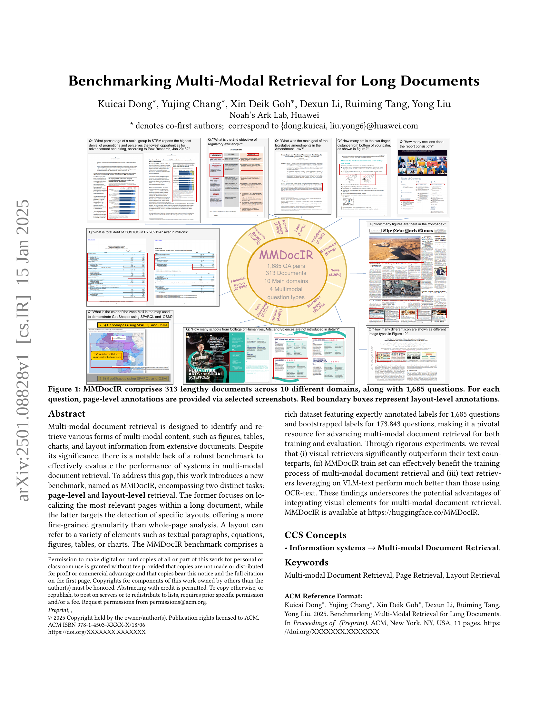
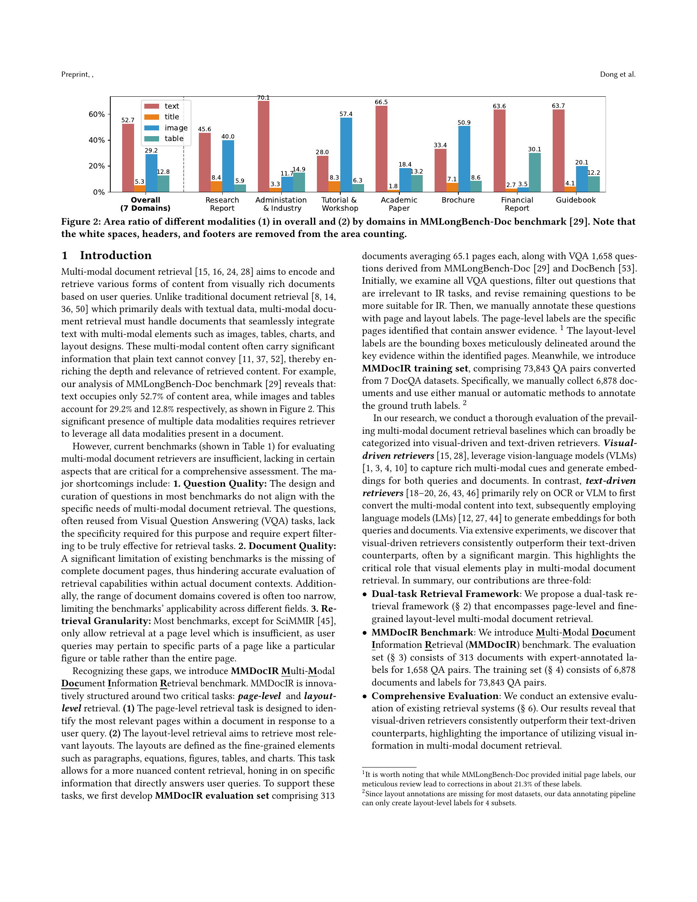
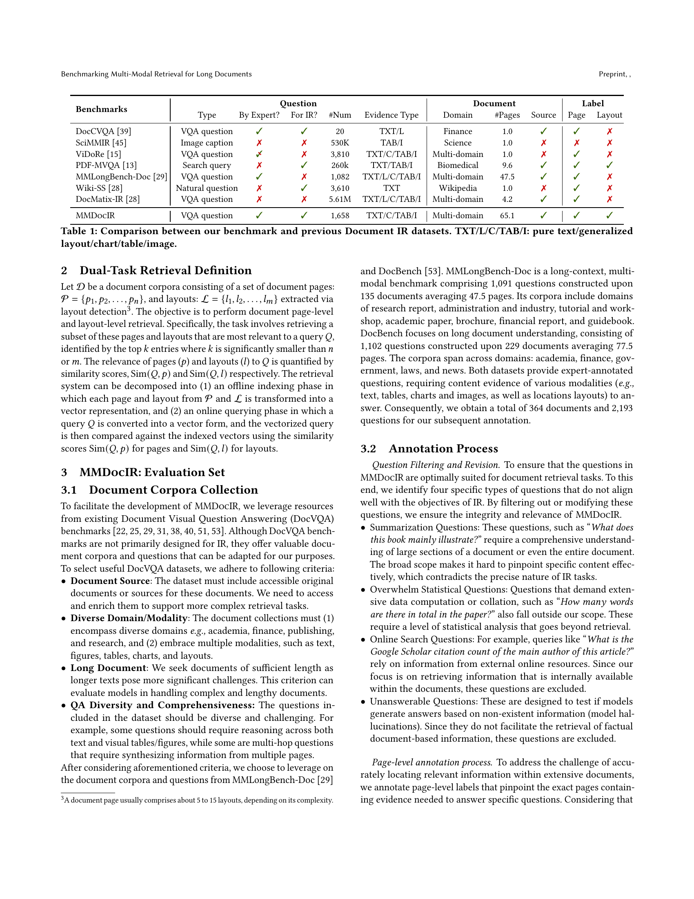
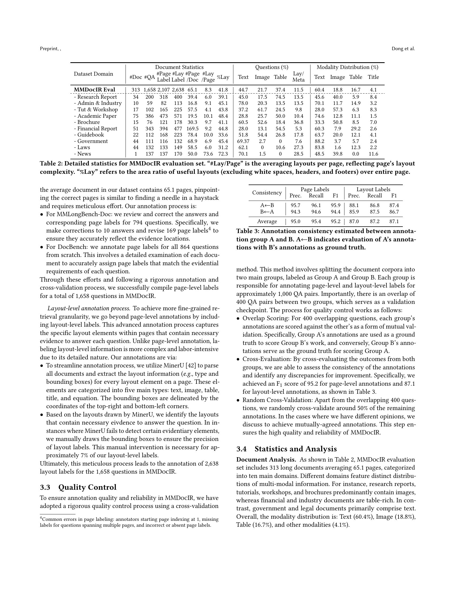
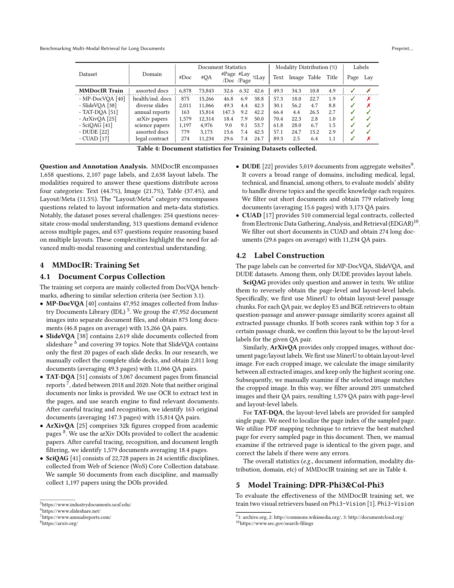
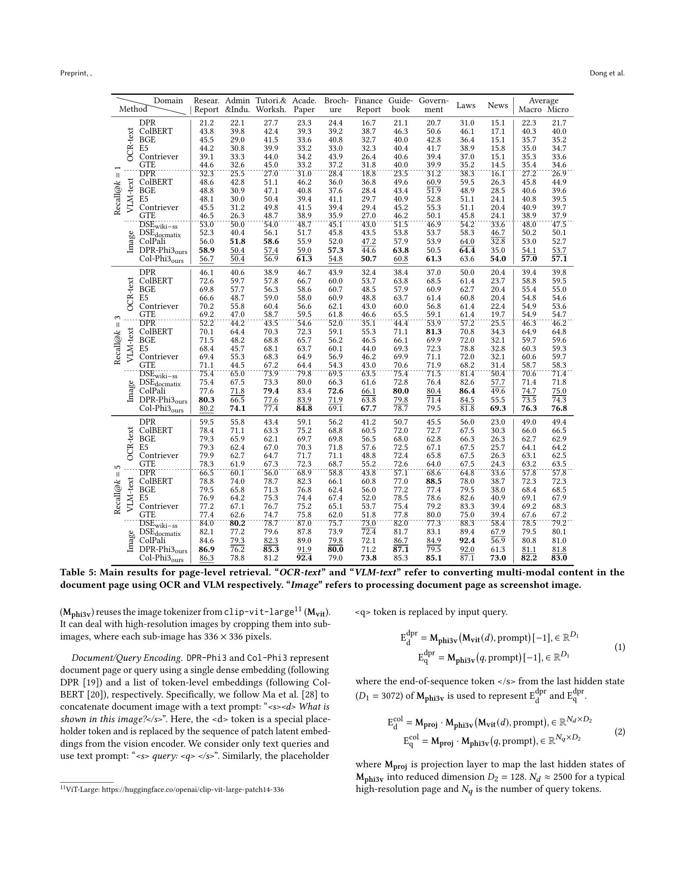
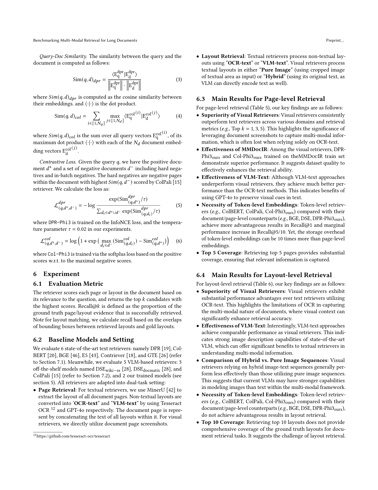
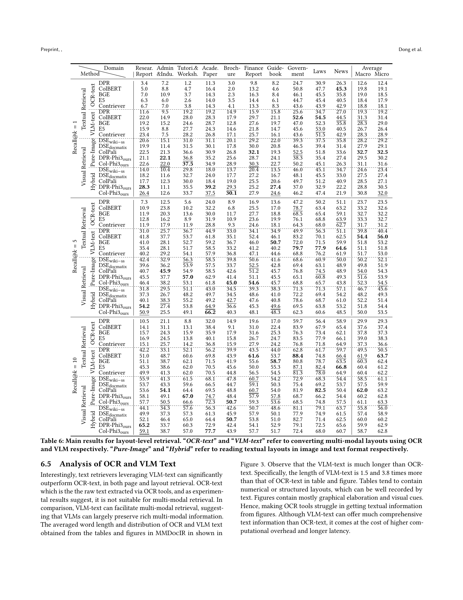
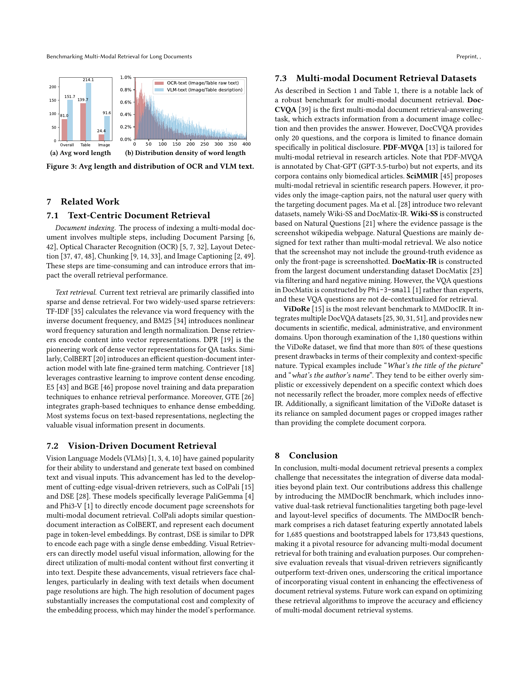
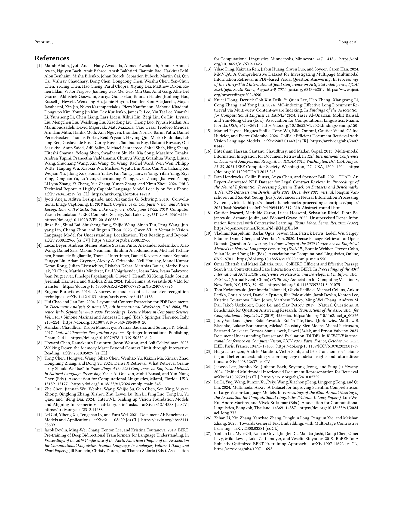
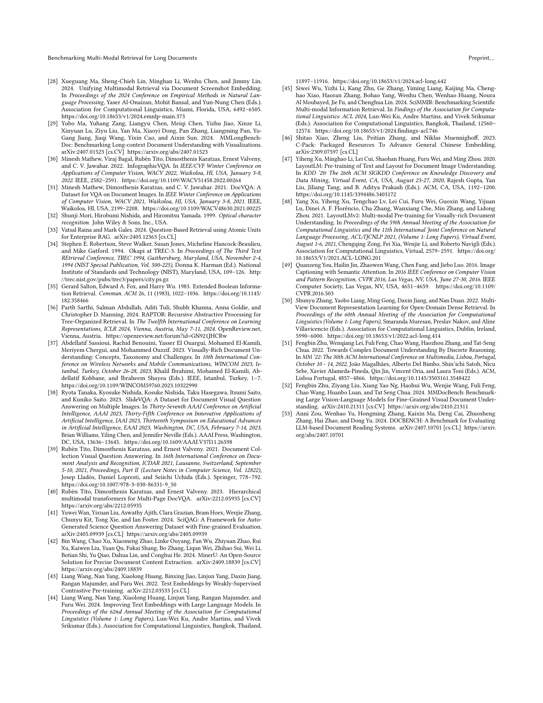
