 


 2501.08970 
 Ilia Shumailov et el. 
 
 🤗 2025-01-16 
 



↗ arXiv


↗ Hugging Face


↗ Papers with Code


### TL;DR



기존의 암호화 기반 개인 정보 보호 기술은 처리 가능한 데이터의 크기와 복잡도에 제한이 있습니다. 이러한 문제를 해결하기 위해, 연구자들은 **신뢰할 수 있는 능력 있는 모델 환경(TCME)**이라는 새로운 접근 방식을 제안합니다. TCME는 머신러닝 모델을 신뢰할 수 있는 제3자로 활용하여, 입력/출력 제약 조건과 명시적인 정보 흐름 제어를 통해 안전한 계산을 가능하게 합니다.

TCME는 **무상태성, 명시적인 정보 흐름 제어, 신뢰할 수 있는 능력 있는 모델**이라는 세 가지 핵심 속성을 만족해야 합니다. 논문에서는 TCME를 사용하여 기존 암호화 기술로는 해결할 수 없었던 여러 가지 문제를 해결할 수 있음을 보여주는 실제 사례들을 제시하고 있으며, **특히, 기존 기술 대비 TCME의 장단점을 비교 분석**하고, **향후 연구 방향을 제시**함으로써, 다양한 분야의 연구자들에게 중요한 시사점을 제공합니다.



#### Key Takeaways


 신뢰할 수 있는 능력 있는 모델 환경(TCME)을 사용하여 개인 정보 보호를 유지하면서 복잡한 문제 해결 



 기존 암호화 기술(MPC, ZKP)과 비교하여 TCME의 장단점을 분석하고, 각 기술의 적용 가능한 상황을 제시 



 다양한 실제 응용 사례를 통해 TCME의 실용성과 효용성을 검증 


#### Why does it matter?
**본 논문은 기존 암호화 기술의 한계를 극복하고 개인 정보 보호를 유지하면서 복잡한 문제를 해결할 수 있는 새로운 방법을 제시합니다.** 머신러닝 모델을 활용한 새로운 추론 패러다임을 제시함으로써, 기존에는 불가능했던 응용 분야에 대한 안전한 계산을 가능하게 합니다. **특히, 의료, 금융 등 민감한 개인 정보를 다루는 분야에서 높은 활용성이 기대됩니다.** 또한, 다양한 분야의 연구자들에게 새로운 연구 방향을 제시하며 향후 연구 발전에 중요한 기여를 할 것으로 예상됩니다.

------
#### Visual Insights

> 🔼 이 그림은 비즈니스 공간의 잠재적인 손상을 모니터링하면서 개인 정보를 보호하는 데 TCME(Trusted Capable Model Environment)를 사용하는 방법을 보여줍니다. 사전에 합의된 모델과 프롬프트를 사용하는 시스템은 카메라 녹화를 분석합니다. 시스템은 심각한 손상이 감지된 경우에만 'YES'를 출력하도록 제한되어 최소한의 침입을 보장합니다.
> 

> 
read the caption

> Figure 1: Practical Example of TCME in Damage Monitoring: TCME can be used to monitor potential damage to business space while preserving privacy. The system, utilizing a pre-agreed model and prompt, analyzes camera recordings. It is restricted to output only 'YES' if significant damage is detected, ensuring minimal intrusion.
> 

### In-depth insights

#### TCME: A New Paradigm
TCME는 **기존 암호화 방식의 한계를 극복**하고 **사생활 보호를 유지하면서 복잡한 연산을 가능하게 하는 새로운 패러다임**을 제시합니다. 기존의 다자간 연산(MPC)이나 영지식 증명(ZKP)과 달리, TCME는 **학습된 머신러닝 모델을 신뢰할 수 있는 제3자**로 활용하여 **복잡하고 구조화되지 않은 작업**을 처리할 수 있습니다. 이는 특히 기존 암호화 기법으로는 불가능했던 **비정형 데이터 분석이나 협업**을 가능하게 합니다. **무상태성, 명시적인 정보 흐름 제어, 신뢰할 수 있는 모델**이라는 세 가지 핵심 요소는 TCME의 안전성과 효율성을 보장합니다. 하지만 **모델의 신뢰성과 성능, 확장성, 부채널 공격** 등은 향후 해결해야 할 과제입니다.  TCME는 잠재적으로 **다양한 분야에 혁신을 가져올 수 있는 가능성**을 보여주지만, 실제 구현 및 안전성 확보를 위해서는 추가적인 연구와 개발이 필요합니다.

#### Model Trust & Privacy
본 논문에서 제시된 신뢰할 수 있는 능력 있는 모델 환경(TCME)의 핵심은 **모델의 신뢰성과 개인 정보 보호의 균형**을 이루는 데 있습니다.  TCME는 기존의 암호화 기법과 달리, **머신러닝 모델 자체를 신뢰할 수 있는 제3자**로 활용하여 민감한 데이터를 처리합니다. 이를 위해서는 모델의 무상태성, 명시적인 정보 흐름 제어, 그리고 신뢰할 수 있는 모델 자체의 확보라는 세 가지 기본적인 속성을 충족해야 합니다.  **무상태성**은 모델이 과거 상호작용을 기억하거나 학습하지 않음을 의미하며, **정보 흐름 제어**는 데이터 유출을 방지하기 위한 명확한 규칙을 설정하는 것을 의미합니다. 마지막으로, **신뢰할 수 있는 모델**은 주어진 작업을 정확하게 수행하고 예상된 대로 동작하는 모델을 의미합니다.  하지만, 모델의 신뢰성과 무결성을 완벽하게 보장하는 것은 어렵기 때문에, **지속적인 모니터링 및 검증**을 통해 위험을 완화하는 것이 중요합니다.  **TCME는 기존의 암호화 기법보다 복잡한 연산에 적합**하지만, 모델 자체의 신뢰성에 대한 의존도가 높다는 점을 명심해야 합니다. 따라서,  **모델의 신뢰성을 확보하기 위한 추가적인 메커니즘** 및 **보안 취약점에 대한 철저한 평가**가 TCME의 실제 구현에 있어 중요한 과제가 될 것입니다.

#### TCME vs. Crypto
본 논문에서 제시된 신뢰할 수 있는 기능 모델 환경(TCME)과 기존 암호화 기법 간의 비교는 **사생활 보호를 위한 접근 방식의 근본적인 차이**를 보여줍니다.  TCME는 **머신러닝 모델을 신뢰할 수 있는 제3자**로 활용하여 개인 정보 유출 없이 안전한 연산을 가능하게 합니다. 반면, 기존 암호화 기법(예: 다자간 컴퓨팅, 영지식 증명)은 수학적 가정에 의존하며, 복잡성이 증가함에 따라 확장성에 제약이 있습니다.  **TCME는 복잡하고 구조화되지 않은 작업**에 더 적합하며, **인간의 언어를 직접 사용**할 수 있는 유연성을 제공합니다.  **암호화 기법은 증명 가능한 보안을 제공**하지만, 처리할 수 있는 작업의 크기와 복잡도에 제한이 있습니다. 따라서, TCME와 암호화 기법은 서로 상호 보완적인 관계를 가지며, 문제의 특성에 따라 적절한 기법을 선택하는 것이 중요합니다.  **TCME는 특히 대규모 데이터나 복잡한 계산이 필요한 경우 효율적**일 수 있습니다.

#### Practical TCME Use
본 논문은 **TCME(Trusted Capable Model Environments)**의 실용적인 활용 사례를 제시하며, 기존 암호화 기법으로는 불가능했던 개인 정보 보호를 위한 연산을 가능하게 합니다.  **다양한 분야의 문제들을 해결**할 수 있는 잠재력을 보여주며, **기존 기술과의 차별점**을 명확히 제시합니다.  특히, **비구조적 데이터나 불확실성이 높은 상황**에서 TCME가 큰 강점을 보이며, **다양한 이해관계자들 간의 협업**을 가능하게 하는 점을 강조합니다.  하지만, **모델의 신뢰성과 성능, 확장성 문제**는 향후 연구가 필요한 부분입니다.  **실제 구현 및 보안 강화**를 위한 추가적인 연구가 필요하며, 특히 **측 채널 공격 등에 대한 대응 방안**이 중요합니다.

#### Future Research
미래 연구는 **신뢰할 수 있는 머신러닝 모델 환경(TCME)**의 기본적인 속성인 **무상태성, 명시적 정보 흐름 제어, 신뢰성 있는 모델**을 더욱 강화하는 데 초점을 맞춰야 합니다.  **개인정보보호 및 정확성** 측면에서 현재 TCME가 제공하는 휴리스틱한 보장을 더욱 엄격한 수학적 보장으로 개선하기 위한 노력이 필요합니다.  **모델의 신뢰성과 기능**에 대한 보다 견고한 검증 및 검사 메커니즘 개발이 중요하며, 특히 오픈 모델에 의존하는 현재 접근 방식의 한계를 극복하기 위한 연구가 필요합니다.  **확장성 및 복잡성** 문제 또한 심층적으로 조사하여 다양한 참여자와 데이터 유형을 처리할 수 있는 TCME 구축 방안을 모색해야 합니다.  **측면 채널 공격**에 대한 취약성을 해결하고, 다양한 공격에 대한 방어 메커니즘을 강화하는 연구가 필수적입니다.  **암호화 기법과 TCME의 상호 작용**에 대한 연구를 통해 서로의 강점을 결합하여 더욱 강력하고 효율적인 개인정보보호 시스템을 구축할 수 있는 가능성을 탐구해야 합니다.

### More visual insights

More on figures

> 🔼 그림 2는 TCME를 사용하여 TEE에 배포되고 개인 정보 보호 구성 요소를 포함하는 '신뢰성 확인'에 참여하는 비공개 코드와 모델을 감사하는 방법을 보여줍니다.  개인 정보 보호가 필요한 코드 또는 모델의 감사 과정을 보여주는 단계별 다이어그램입니다. 플랫폼 제공자와 사용자 간의 상호 작용, 공개 배포 코드와 TCME(Trusted Capable Model Environments), TEE(Trusted Execution Environments)에서의 비공개 모델 배포, 감사 프로세스, 그리고 감사 결과의 신뢰성 확인까지 보여줍니다.  각 단계는 코드 및 모델의 개인 정보를 보호하면서 안전한 감사를 수행하는 방법을 보여줍니다.
> 

> 
read the caption

> Figure 2: TCME can be used to perform auditing of private code and models that are deployed in the TEE and participate in the ‘attestation’ that includes private components.
> 

> 🔼 그림 3은 Gemini-1.5-Flash 모델이 그래프의 3색칠 검증을 수행한 결과를 보여줍니다. 모델은 일반적으로 높은 정밀도(83%)와 낮은 재현율(14%)을 보입니다.  즉, 모델이 올바른 3색칠을 올바르다고 판별하는 경우는 많지만, 실제 올바른 3색칠을 잘못 판별하는 경우도 많다는 의미입니다. 이는 모델이 아직 그래프 3색칠 검증 작업에 완벽하게 적합하지 않음을 시사합니다. 그림은 모델이 예측한 결과와 실제 결과를 비교 분석하여 정확도를 평가한 혼동행렬을 보여줍니다.
> 

> 
read the caption

> Figure 3: Graph coloring verification performed by Gemini-1.5-Flash. The model generally has a high precision (83%) and low recall (14%).
> 

### Full paper


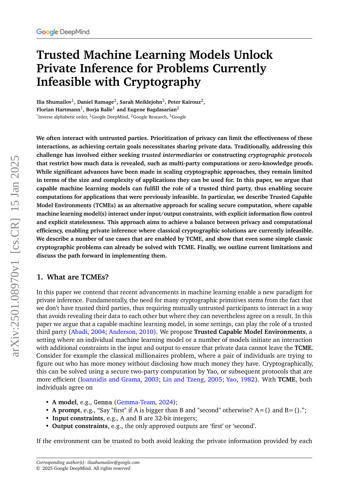
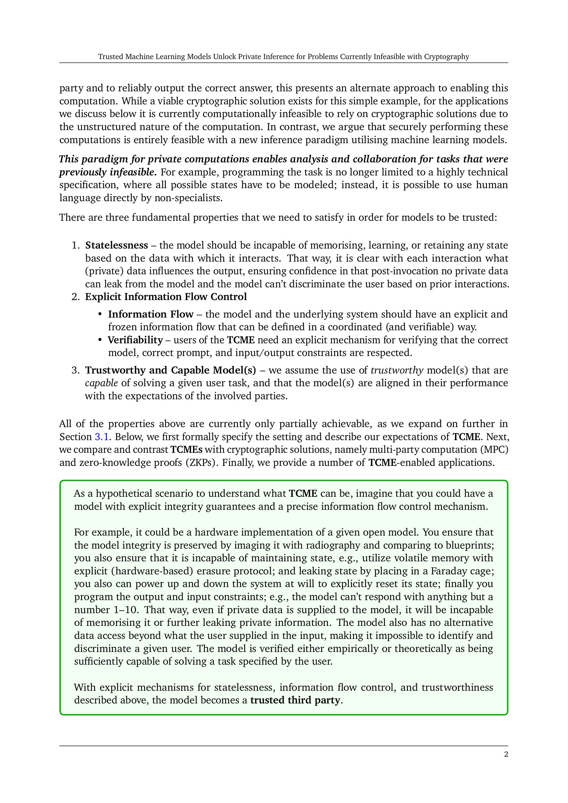
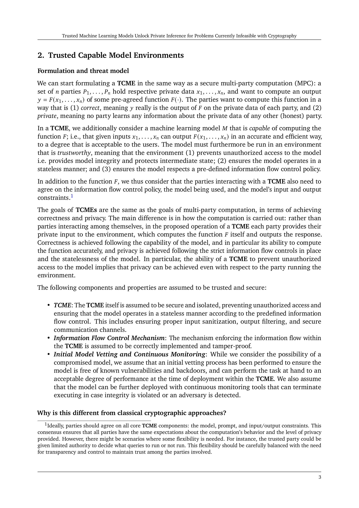
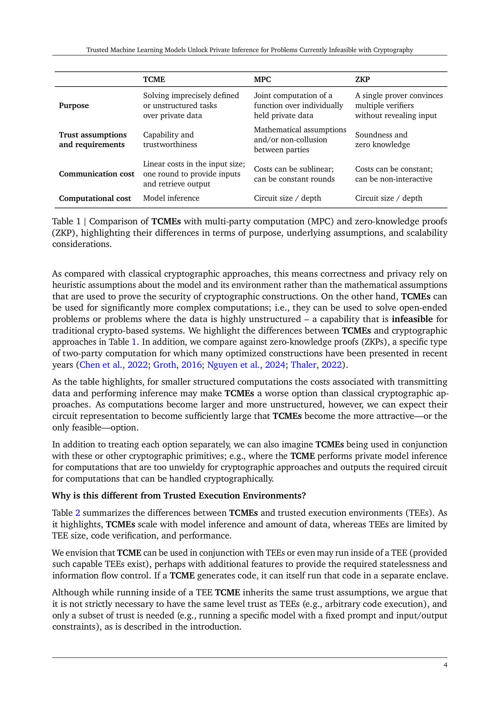
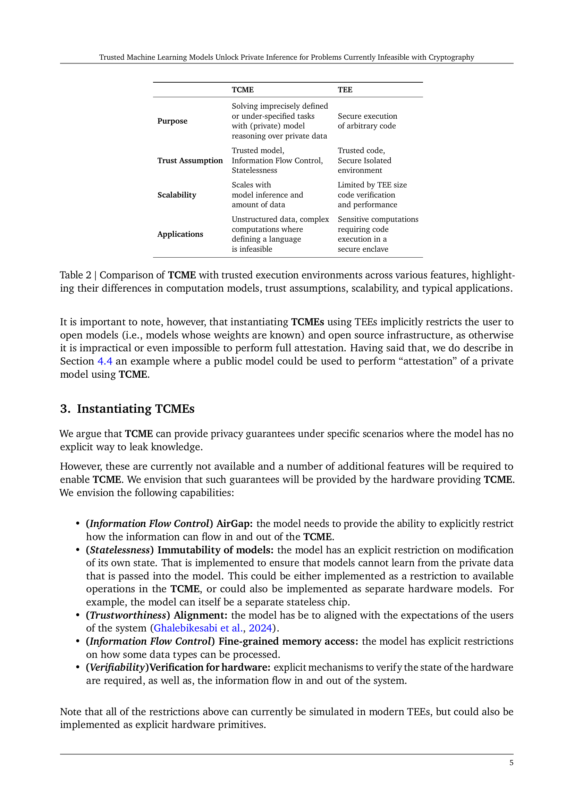
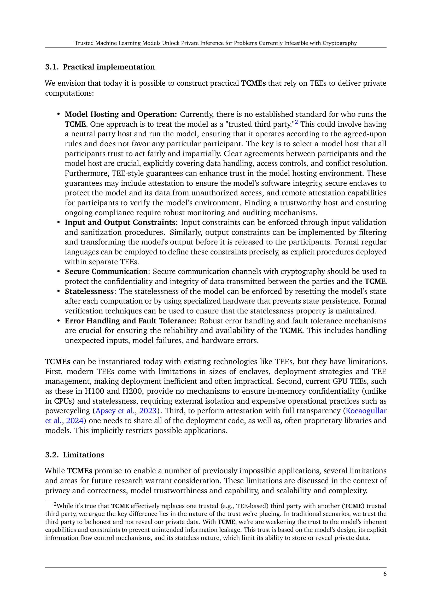
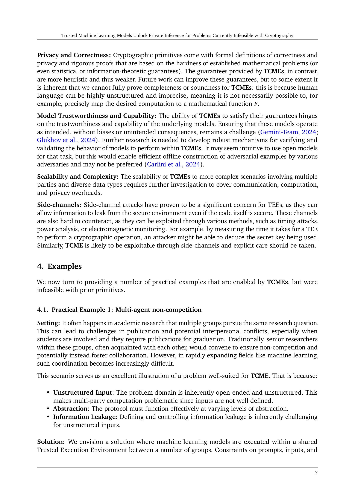
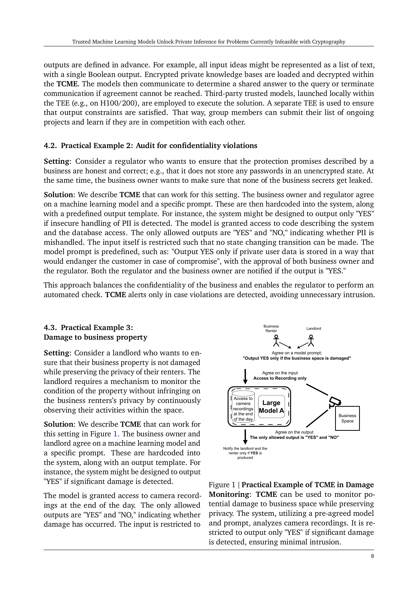
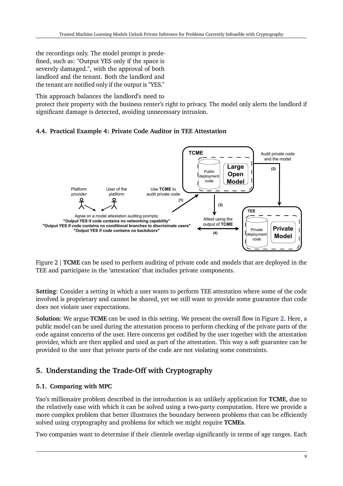
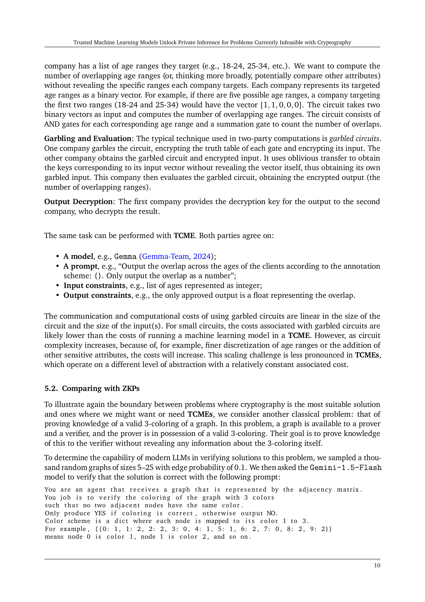
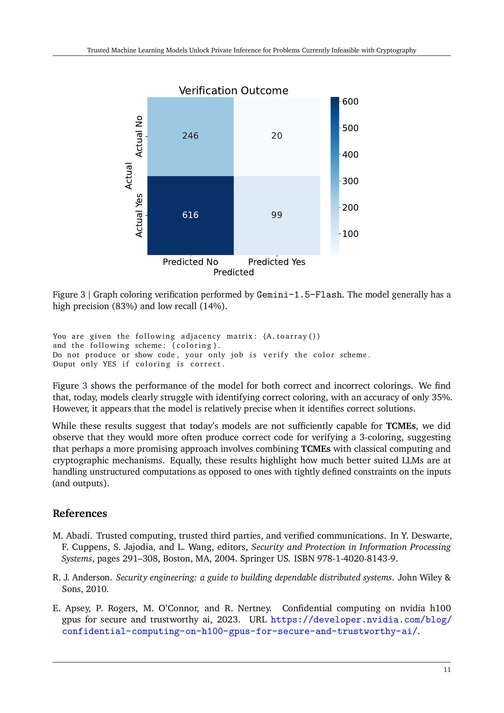
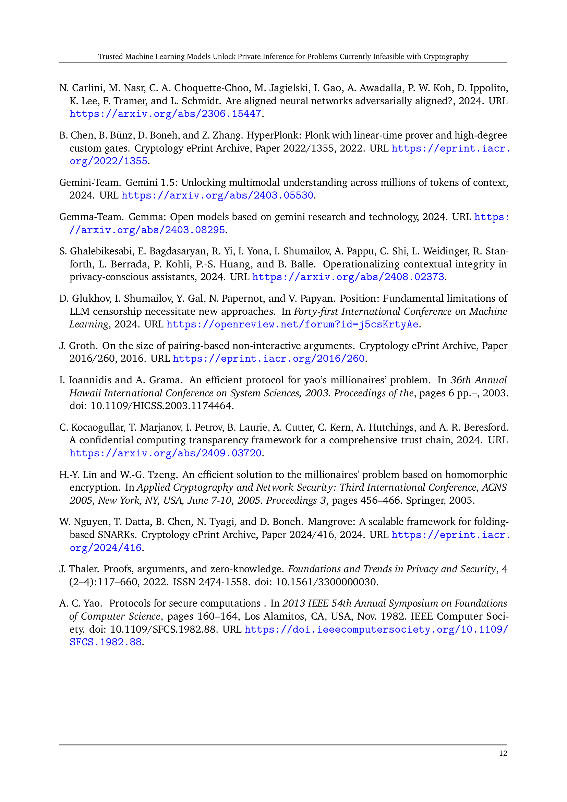
