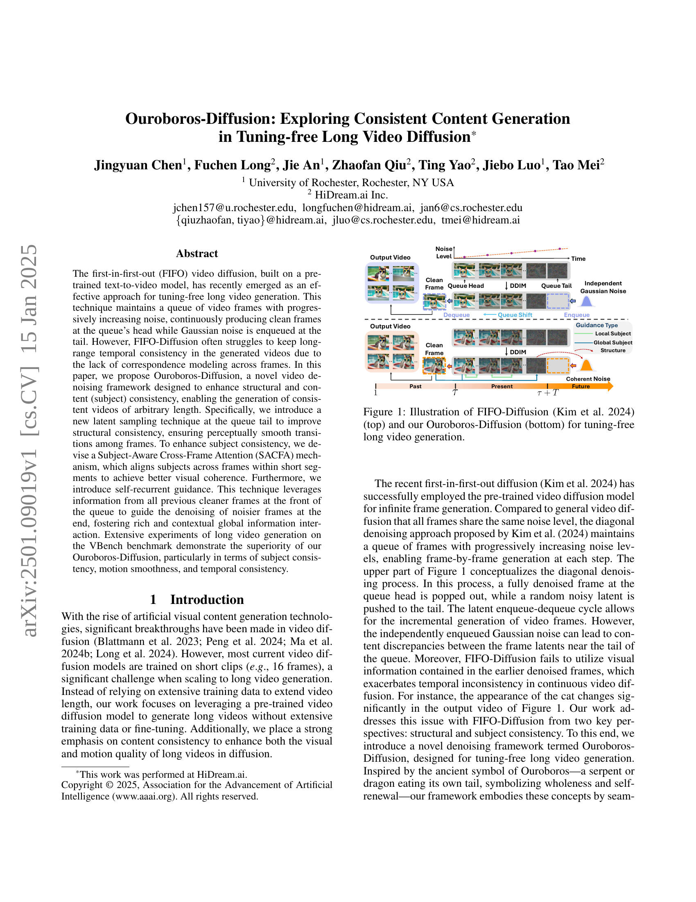
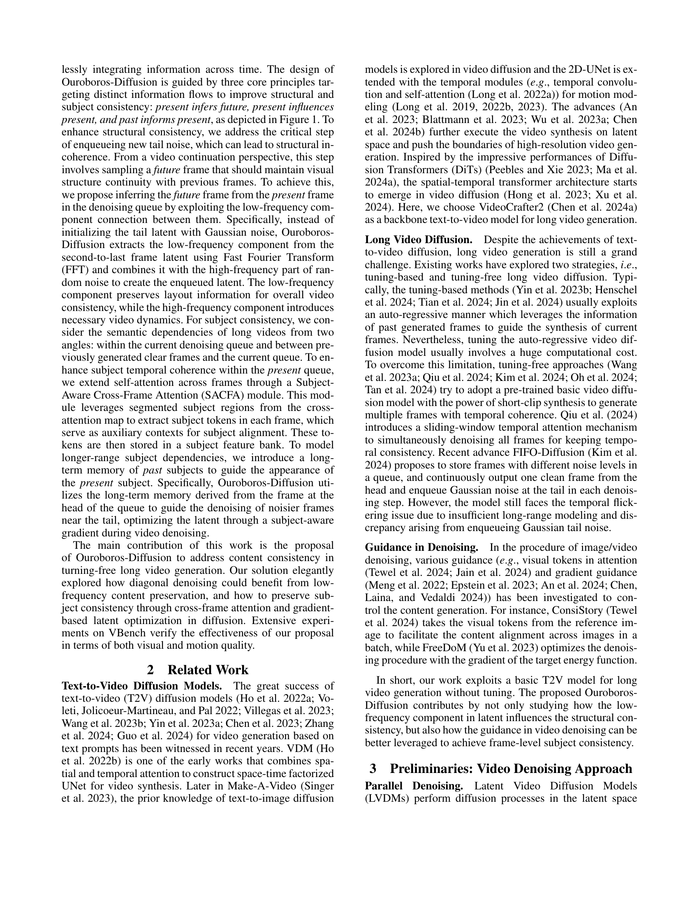
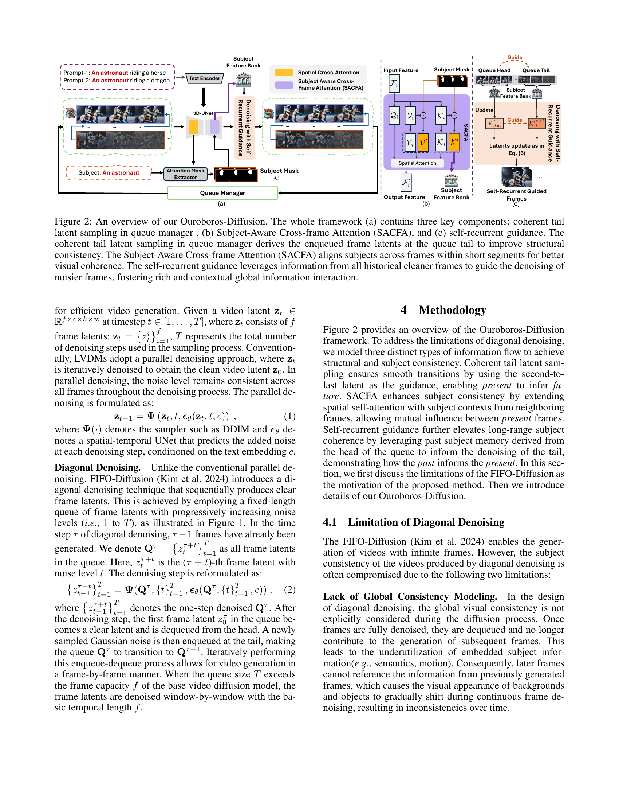
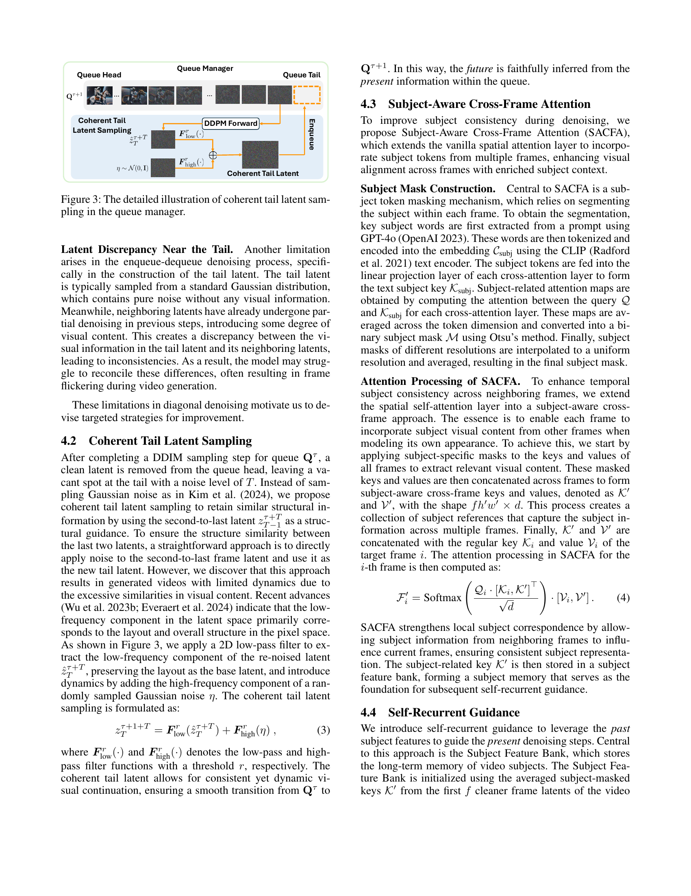
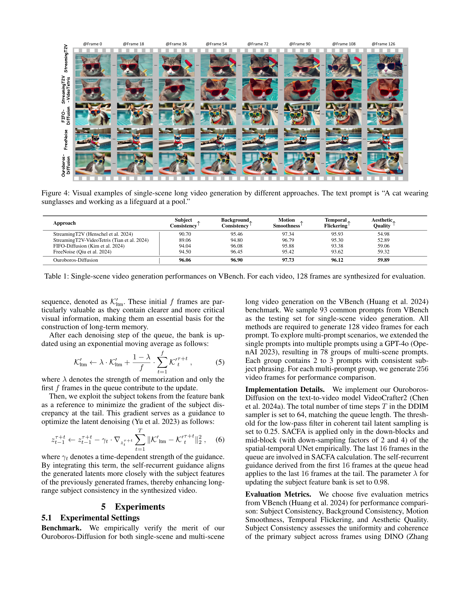
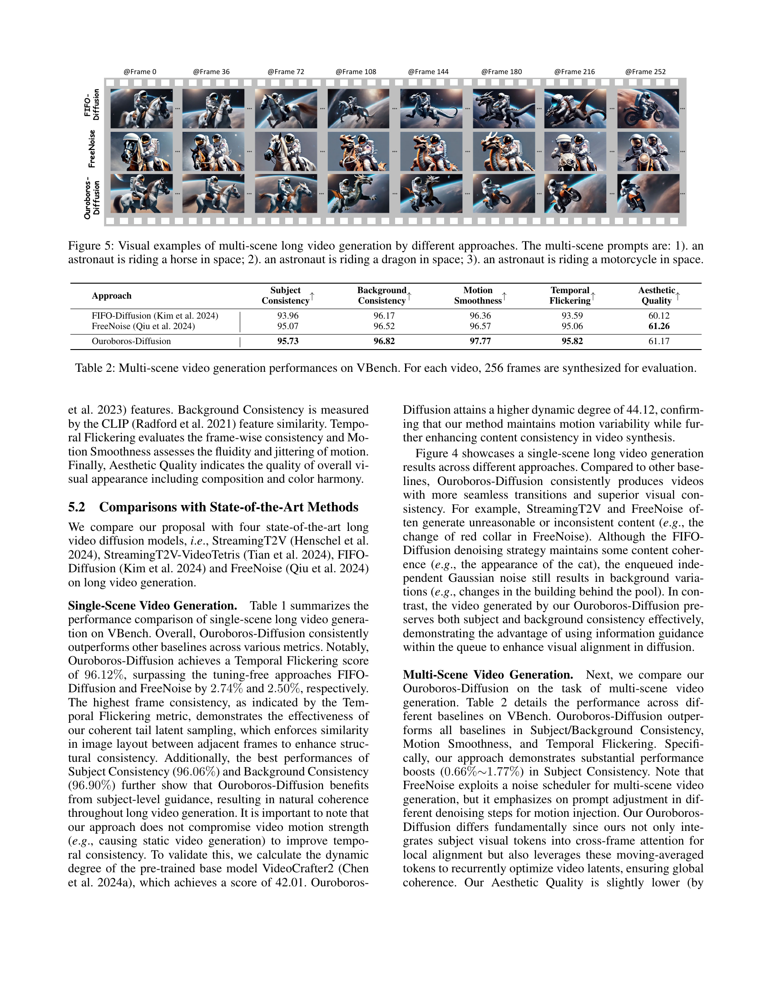
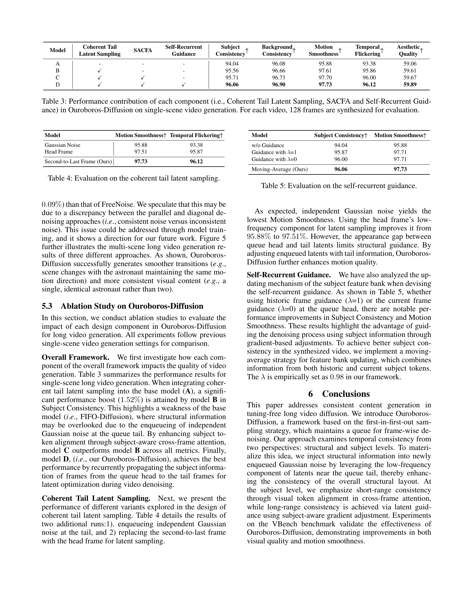
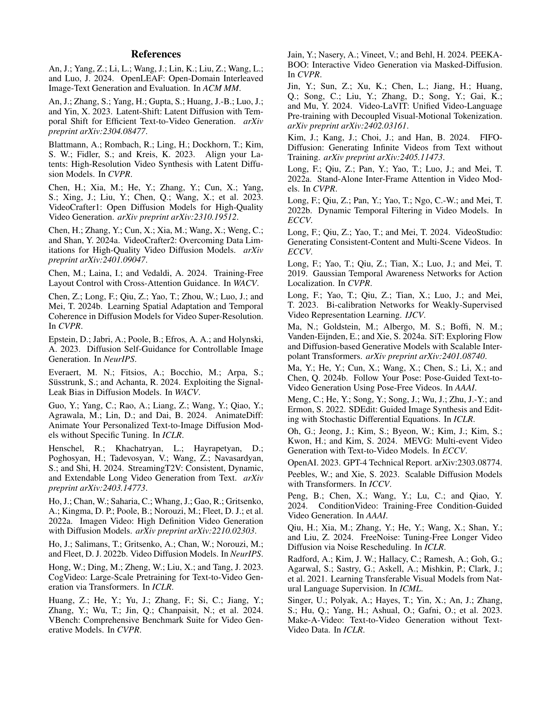
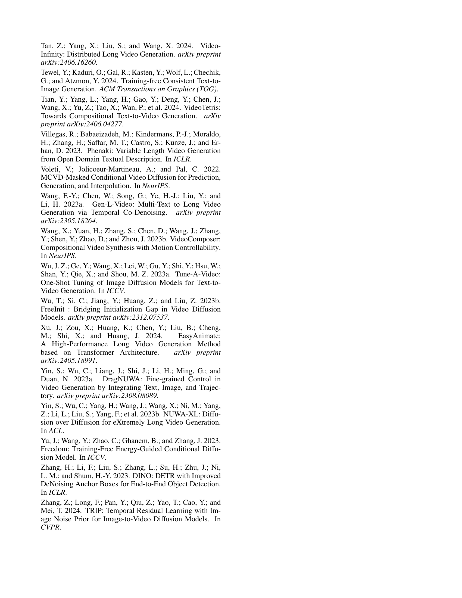

 


 2501.09019 
 Jingyuan Chen et el. 
 
 🤗 2025-01-16 
 



↗ arXiv


↗ Hugging Face


↗ Papers with Code


### TL;DR



대부분의 기존 비디오 확산 모델은 짧은 클립(예: 16프레임)으로 훈련되어 긴 비디오 생성에 어려움을 겪습니다.  **첫 번째로**, 이는 긴 비디오 생성에 필요한 방대한 양의 훈련 데이터를 확보하기 어렵기 때문입니다. **두 번째로**, 긴 비디오 생성 시 일관성 유지를 어렵게 만드는 시간적 일관성 부족 문제가 있습니다.  이러한 문제를 해결하기 위해, 기존의 FIFO-Diffusion 방식을 개선한 Ouroboros-Diffusion이 제안되었습니다. 

Ouroboros-Diffusion은 **대기열의 끝에 새로운 잠재적인 샘플링 기법**을 도입하여 구조적 일관성을 높입니다. 이는 인접 프레임 간의 시각적 전환을 부드럽게 만들어줍니다. 또한, **주제 인식 교차 프레임 어텐션 메커니즘**을 통해 짧은 구간 내의 프레임 간 주제 정렬을 개선하고, **자기 순환적 안내 기법**을 통해 과거의 깨끗한 프레임으로부터 정보를 활용하여 노이즈가 많은 프레임의 제거를 안내하여 풍부하고 문맥적인 전역 정보 상호 작용을 촉진합니다. 실험 결과, Ouroboros-Diffusion은 주제 일관성, 동작 부드러움, 시간적 일관성 측면에서 우수한 성능을 보였습니다.



#### Key Takeaways


 새로운 잠재적 샘플링 기법과 주제 인식 교차 프레임 어텐션을 통해 구조적 및 주제 일관성 향상 



 자기 순환적 안내 메커니즘을 사용하여 과거 프레임 정보를 활용, 장기적 일관성 확보 



 VBench 벤치마크에서 기존의 긴 비디오 생성 방법들보다 우수한 성능을 입증 


#### Why does it matter?
이 논문은 **긴 비디오 생성에 대한 새로운 접근법**을 제시하여 연구자들이 **일관성 있고 매끄러운 긴 비디오를 생성하는 기술을 발전**시키는 데 중요한 영향을 미칩니다. 기존의 제한된 길이 비디오 생성 기술의 문제를 해결하고, **새로운 구조적 및 주제 일관성 향상 기법**을 제안함으로써, 장기 비디오 생성 분야의 발전에 기여하며, 향후 연구의 새로운 방향을 제시합니다. 또한, **다양한 응용 분야**에서 활용 가능성이 높아 연구의 중요성을 더욱 높입니다.

------
#### Visual Insights

> 🔼 그림 1은 Kim et al.(2024)의 FIFO-Diffusion(위쪽)과 제안된 Ouroboros-Diffusion(아래쪽)을 보여줍니다. 두 방법 모두 사전 훈련된 텍스트-비디오 모델을 기반으로 하여 튜닝 없이 긴 비디오를 생성하는 기법입니다. FIFO-Diffusion은 비디오 프레임들을 큐에 저장하고, 노이즈가 점점 증가하는 프레임들을 큐의 꼬리에 추가하며, 큐의 머리에서 깨끗한 프레임들을 지속적으로 생성하는 방식입니다. 반면 Ouroboros-Diffusion은 구조적 및 내용적 일관성을 개선하기 위해 새로운 잠재 표본 추출 기법과 SACFA(Subject-Aware Cross-Frame Attention) 메커니즘, 그리고 자기 순환 안내를 도입했습니다. 이를 통해 임의의 길이를 가진 일관된 비디오를 생성할 수 있습니다.
> 

> 
read the caption

> Figure 1: Illustration of FIFO-Diffusion (Kim et al. 2024) (top) and our Ouroboros-Diffusion (bottom) for tuning-free long video generation.
> 


| Approach | Subject Consistency ↑ | Background Consistency ↑ | Motion Smoothness ↑ | Temporal Flickering ↑ | Aesthetic Quality ↑ |
|---|---|---|---|---|---| 
| StreamingT2V [Henschel et al. 2024] | 90.70 | 95.46 | 97.34 | 95.93 | 54.98 |
| StreamingT2V-VideoTetris [Tian et al. 2024] | 89.06 | 94.80 | 96.79 | 95.30 | 52.89 |
| FIFO-Diffusion [Kim et al. 2024] | 94.04 | 96.08 | 95.88 | 93.38 | 59.06 |
| FreeNoise [Qiu et al. 2024] | 94.50 | 96.45 | 95.42 | 93.62 | 59.32 |
| Ouroboros-Diffusion | **96.06** | **96.90** | **97.73** | **96.12** | **59.89** |

> 🔼 표 1은 VBench 데이터셋을 사용하여 단일 장면 비디오 생성 성능을 보여줍니다. 각 비디오에 대해 128개의 프레임이 합성되어 평가되었으며, StreamingT2V, StreamingT2V-VideoTetris, FIFO-Diffusion, FreeNoise, 그리고 Ouroboros-Diffusion 등 다섯 가지 방법의 성능을 비교 분석했습니다.  성능 지표는 주제 일관성, 배경 일관성, 동작 부드러움, 시간적 깜빡임, 그리고 미적 품질 등 다섯 가지로 구성됩니다. 이를 통해 각 알고리즘의 장단점과 Ouroboros-Diffusion의 우수성을 정량적으로 제시합니다.
> 

> 
read the caption

> Table 1: Single-scene video generation performances on VBench. For each video, 128 frames are synthesized for evaluation.
> 

### In-depth insights

#### FIFO Diffusion Limits
FIFO (선입선출) 확산 모델은 긴 비디오 생성에 효과적이지만, **장기간의 일관성 유지에는 어려움**이 있습니다. 큐의 꼬리에 무작위 노이즈를 추가하는 방식 때문에 프레임 간의 내용 불일치가 발생하고, 이전 프레임의 정보를 활용하지 못해 시간적 일관성이 부족합니다. **이러한 한계는 특히 장기 비디오 생성 시 시각적, 운동적 일관성 저하**로 이어집니다.  따라서, **긴 비디오 생성을 위해서는 프레임 간의 상관관계를 모델링하고 글로벌 일관성을 유지하는 메커니즘**이 필수적입니다. 이는 단순히 프레임을 순차적으로 생성하는 것을 넘어, 과거 및 현재 프레임의 정보를 종합적으로 활용하여 미래 프레임을 예측하고 생성하는 고차원적인 접근 방식을 필요로 합니다.

#### Ouroboros Design
이 논문에서 제안하는 Ouroboros 설계는 **장기 비디오 생성에서 일관성 있는 콘텐츠 생성**을 위한 혁신적인 접근 방식입니다. 기존의 FIFO-Diffusion 방식의 한계를 극복하기 위해 **세 가지 핵심 원칙** (현재가 미래를 유추, 현재가 현재에 영향, 과거가 현재에 정보 제공)을 바탕으로 설계되었습니다.  **일관성 있는 꼬리 잠재적 표본 추출** 기법을 통해 구조적 일관성을 향상시키고, **주제 인식 교차 프레임 주의 메커니즘**을 통해 주제 일관성을 강화하며, **자기 순환 안내**를 통해 장기적 시계열 일관성을 확보합니다.  **저주파수 성분을 활용**하여 매끄러운 전환을 유도하고, **주제 토큰을 활용**하여 프레임 간 주제 정렬을 개선하며, 과거 주제 정보를 활용하여 현재 프레임의 잡음 제거를 안내함으로써 **전반적인 비디오 품질과 일관성 향상**을 목표로 합니다. 이러한 다층적 접근 방식은 Ouroboros라는 고대 상징에서 영감을 받아 **전체성과 자기 갱신**의 개념을 구현합니다.

#### SACFA Attention
논문에서 제시된 SACFA 어텐션은 장편 비디오 생성에서의 **주제 일관성** 문제를 해결하기 위한 핵심 메커니즘입니다.  기존의 공간적 어텐션에 시간적 차원을 추가하여 **인접 프레임 간의 주제 정합**을 강화합니다.  **주제 영역 마스크**를 활용, 프레임 내에서 주제를 명확히 구분하고, **주제 토큰**을 추출하여 어텐션 메커니즘에 통합합니다. 이는 비디오 내에서 주제의 시각적 일관성을 유지하며, 프레임 간의 부드러운 전이를 가능하게 합니다.  **장기적 주제 일관성**을 위해 과거 프레임의 주제 정보를 활용하는 **자기 순환 지도(self-recurrent guidance)**와의 연계 또한 중요합니다.  SACFA는 단순히 주제 정보를 결합하는 것이 아니라, **주제 토큰 기반의 어텐션 가중치 조절**을 통해 주제 영역의 중요도를 더욱 명확히 합니다.  결과적으로, SACFA는 시각적, 운동적 일관성을 유지하는 장편 비디오 생성에 크게 기여할 것으로 예상됩니다.  **특히, 주제 분할 정확도**가 SACFA 성능에 직접적인 영향을 미칠 것으로 판단되며, 향후 연구에서는 더욱 정교한 주제 분할 기법의 도입이 필요합니다.

#### Long-Term Memory
본 논문에서 제시된 Ouroboros-Diffusion의 핵심 개념 중 하나인 장기 기억(Long-Term Memory)은 **이전에 생성된 고품질 프레임들의 정보를 활용하여 현재 생성 중인 프레임의 품질을 향상시키는 메커니즘**입니다.  단순히 최근 프레임만 고려하는 것이 아니라, 과거의 정보를 활용하여 시계열적 일관성을 유지하고 장면의 주요 객체(subject)를 더욱 정확하게 재현합니다.  **특히, 큐의 앞쪽에 위치한 고품질 프레임들로부터 추출된 주요 객체 특징 정보를 저장하고 활용**하여, 시간이 지남에 따라 객체의 외형이나 특징이 변화하는 것을 방지하며, 장기적인 일관성을 확보합니다. 이는 단순히 현재 프레임만을 고려하는 기존의 방법론들과는 달리, **전체 시계열적 맥락을 고려**하여 더욱 자연스럽고 일관성 있는 비디오 생성을 가능하게 합니다.  따라서 장기 기억 메커니즘은 Ouroboros-Diffusion의 높은 성능 달성에 중요한 역할을 수행합니다. **이 메커니즘은 특히 장시간 비디오 생성 시, 내용의 일관성을 유지하는 데 매우 효과적**이며, 향후 장기 비디오 생성 분야의 발전에 기여할 중요한 기술적 진보로 평가될 수 있습니다.

#### Future Extensions
**미래 확장 방향**으로는 우선, **더욱 정교한 주제 일관성**을 위해 세분화된 주제 모델링 기법을 도입하는 것을 고려할 수 있습니다. 현재는 단순한 키워드 매칭에 의존하지만, 시맨틱 분석이나 객체 트래킹 등을 통해 주제의 변화를 보다 정확하게 파악하고, 각 주제에 대한 보다 풍부한 정보를 활용하는 것이 중요합니다.  또한, **다양한 모달리티를 통합하는 연구**를 진행할 수 있습니다. 텍스트 외에도 오디오나 센서 데이터를 추가적으로 활용하여 더욱 현실감 있는 장면을 생성할 수 있으며, 멀티모달 정보의 상호작용을 통해 콘텐츠 일관성을 더욱 강화할 수 있습니다.  그리고 **효율성 개선**을 위해 경량화된 모델 아키텍처나 효율적인 학습 방법을 연구하는 것이 필요합니다. 현재 모델은 상당한 컴퓨팅 자원을 필요로 하므로, 실시간 영상 생성 등의 응용을 위해서는 모델의 경량화 및 효율화가 필수적입니다. 마지막으로, **다양한 영상 스타일의 생성 및 제어**를 위한 연구도 중요합니다.  예를 들어, 특정 화풍이나 분위기를 지정하여 영상을 생성하거나, 영상의 톤이나 색감을 조절하는 기능을 추가할 수 있습니다.

### More visual insights

More on figures

> 🔼 그림 2는 Ouroboros-Diffusion의 전체 구조를 보여줍니다. (a)는 큐 관리자 내 일관된 꼬리잠재표본추출, (b)는 주제 인식 교차 프레임 주의 메커니즘(SACFA), (c)는 자기 순환 안내의 세 가지 주요 구성 요소를 보여줍니다. 큐 관리자의 일관된 꼬리 잠재 표본 추출은 구조적 일관성을 개선하기 위해 큐의 꼬리에 있는 인코딩된 프레임 잠재값을 생성합니다. SACFA는 시각적 일관성을 개선하기 위해 짧은 구간 내에서 프레임 간 주제를 정렬합니다. 자기 순환 안내는 풍부하고 문맥에 맞는 전역 정보 상호 작용을 촉진하기 위해 이전의 모든 깨끗한 프레임으로부터 정보를 활용하여 더 노이즈가 많은 프레임의 잡음 제거를 안내합니다.
> 

> 
read the caption

> Figure 2:  An overview of our Ouroboros-Diffusion. The whole framework (a) contains three key components: coherent tail latent sampling in queue manager , (b) Subject-Aware Cross-frame Attention (SACFA), and (c) self-recurrent guidance. The coherent tail latent sampling in queue manager derives the enqueued frame latents at the queue tail to improve structural consistency. The Subject-Aware Cross-frame Attention (SACFA) aligns subjects across frames within short segments for better visual coherence. The self-recurrent guidance leverages information from all historical cleaner frames to guide the denoising of noisier frames, fostering rich and contextual global information interaction.
> 

> 🔼 그림 3은 Ouroboros-Diffusion 모델의 큐 관리자에서 일관된 꼬리잠재 표본추출 과정을 자세히 보여줍니다. 기존의 FIFO 방식과 달리, Ouroboros-Diffusion은 큐의 꼬리에 새로운 노이즈를 추가할 때 이전 프레임의 저주파수 성분을 활용하여 새로운 프레임의 구조적 일관성을 유지합니다. 이를 통해 이전 프레임과의 시각적 연속성을 유지하면서 부드러운 전환을 가능하게 합니다. 그림은 큐 관리자의 구조, DDPM 포워드 과정, 일관된 꼬리잠재 생성 과정, 그리고 큐에 새로운 잠재값을 추가하는 과정을 시각적으로 보여줍니다.
> 

> 
read the caption

> Figure 3: The detailed illustration of coherent tail latent sampling in the queue manager.
> 

> 🔼 그림 4는 다양한 방법으로 생성한 긴 비디오의 시각적 예시를 보여줍니다.  모든 비디오는 '선글라스를 끼고 수영장에서 라이프가드로 일하는 고양이' 라는 텍스트 프롬프트를 사용하여 생성되었습니다.  각 방법의 결과 비디오를 비교함으로써, Ouroboros-Diffusion이 다른 방법들에 비해 일관성 있는 시각적 품질과 부드러운 동작을 생성하는 데 더 뛰어남을 보여줍니다. 그림은 각 기법의 비디오 프레임 일부를 보여주어, 시간에 따른 일관성(특히 배경과 주제의 일관성) 및 동작의 매끄러움을 시각적으로 비교할 수 있도록 합니다.
> 

> 
read the caption

> Figure 4: Visual examples of single-scene long video generation by different approaches. The text prompt is “A cat wearing sunglasses and working as a lifeguard at a pool.”
> 

> 🔼 그림 5는 세 가지 다른 프롬프트 (우주에서 말을 타는 우주비행사, 우주에서 용을 타는 우주비행사, 우주에서 오토바이를 타는 우주비행사)를 사용하여 여러 접근 방식으로 생성된 장면이 많은 긴 비디오의 시각적 예를 보여줍니다.  각 접근 방식은 비디오 생성 품질, 특히 장면 일관성과 동작의 부드러움 측면에서 비교됩니다. 이 그림은 Ouroboros-Diffusion이 장면 전환 시 시각적 일관성과 동작의 부드러움을 유지하는 데 어떻게 효과적이었는지 보여줍니다.
> 

> 
read the caption

> Figure 5: Visual examples of multi-scene long video generation by different approaches. The multi-scene prompts are: 1). an astronaut is riding a horse in space; 2). an astronaut is riding a dragon in space; 3). an astronaut is riding a motorcycle in space.
> 

More on tables


| Approach | Subject Consistency ↑ | Background Consistency ↑ | Motion Smoothness ↑ | Temporal Flickering ↑ | Aesthetic Quality ↑ |
|---|---|---|---|---|---| 
| FIFO-Diffusion (Kim et al. 2024) | 93.96 | 96.17 | 96.36 | 93.59 | 60.12 |
| FreeNoise (Qiu et al. 2024) | 95.07 | 96.52 | 96.57 | 95.06 | 61.26 |
| Ouroboros-Diffusion | **95.73** | **96.82** | **97.77** | **95.82** | 61.17 |
> 🔼 표 2는 VBench 벤치마크를 사용하여 다중 장면 비디오 생성 성능을 보여줍니다. 각 비디오에 대해 256개의 프레임이 생성되어 평가되었으며, 제시된 지표는 주제 일관성, 배경 일관성, 동작 부드러움, 시간적 깜빡임, 미적 품질 등입니다. 이 표는 다양한 모델들의 비디오 생성 품질을 정량적으로 비교 분석하여 Ouroboros-Diffusion 모델의 성능 우수성을 보여주는 역할을 합니다.
> 

> 
read the caption

> Table 2: Multi-scene video generation performances on VBench. For each video, 256 frames are synthesized for evaluation.
> 


| Model | Coherent Tail | Latent Sampling | SACFA | Self-Recurrent Guidance | Subject Consistency ↑ | Background Consistency ↑ | Motion Smoothness ↑ | Temporal Flickering ↑ | Aesthetic Quality ↑ |
|---|---|---|---|---|---|---|---|---|---| 
| A | - | - | - | - | 94.04 | 96.08 | 95.88 | 93.38 | 59.06 |
| B | ✓ | - | - | - | 95.56 | 96.66 | 97.61 | 95.86 | 59.61 |
| C | ✓ | ✓ | - | - | 95.71 | 96.73 | 97.70 | 96.00 | 59.67 |
| D | ✓ | ✓ | ✓ | ✓ | **96.06** | **96.90** | **97.73** | **96.12** | **59.89** |
> 🔼 이 표는 Ouroboros-Diffusion 모델의 성능에 대한 각 구성 요소(일관된 꼬리잠재적 샘플링, SACFA, 자기 회귀적 안내)의 기여도를 보여줍니다. 단일 장면 비디오 생성 작업에 대해, 각 비디오마다 128개의 프레임이 합성되어 평가되었습니다.  A는 기준 모델(FIFO-Diffusion)이고, B, C, D는 각 구성 요소를 순차적으로 추가한 모델입니다.  각 모델의 주요 지표(주제 일관성, 배경 일관성, 동작 부드러움, 시간적 깜빡임, 미적 품질)를 비교하여 각 구성 요소의 효과를 정량적으로 분석합니다.
> 

> 
read the caption

> Table 3: Performance contribution of each component (i.e., Coherent Tail Latent Sampling, SACFA and Self-Recurrent Guidance) in Ouroboros-Diffusion on single-scene video generation. For each video, 128 frames are synthesized for evaluation.
> 


| Model | Motion Smoothness ↑ | Temporal Flickering ↑ |
|---|---|---|
| Gaussian Noise | 95.88 | 93.38 |
| Head Frame | 97.51 | 95.87 |
| Second-to-Last Frame (Ours) | **97.73** | **96.12** |
> 🔼 표 4는 일관된 꼬리잠재적 표본추출에 대한 평가 결과를 보여줍니다.  가우시안 잡음을 사용했을 때와 비교하여 헤드 프레임의 저주파 성분을 사용했을 때, 그리고 제안된 방법인 이전 프레임의 저주파 성분을 사용했을 때의 운동 부드러움(Motion Smoothness)과 시간적 깜빡임(Temporal Flickering) 점수를 비교 분석합니다.  이는 제안된 일관된 꼬리 잠재적 표본추출 방법의 효과를 정량적으로 보여주는 표입니다.
> 

> 
read the caption

> Table 4: Evaluation on the coherent tail latent sampling.
> 


| Model | Subject Consistency ↑ | Motion Smoothness ↑ |
|---|---|---|
| w/o Guidance | 94.04 | 95.88 |
| Guidance with λ=1 | 95.87 | 97.71 |
| Guidance with λ=0 | 96.00 | 97.71 |
| Moving-Average (Ours) | **96.06** | **97.73** |
> 🔼 표 5는 자기 회귀적 안내의 효과를 평가하기 위한 실험 결과를 보여줍니다.  구체적으로, 가우시안 노이즈를 사용한 기준 모델과, 헤드 프레임의 저주파 성분을 사용한 방법, 그리고 제안된 방법인 이동 평균을 사용한 방법의 성능을 비교 분석합니다.  모션 부드러움과 일관성 있는 주제 유지를 중점적으로 평가하며,  각 방법의 주요 지표인 모션 부드러움(Motion Smoothness)과 시간적 깜박임(Temporal Flickering) 점수를 제시하여, 제안된 자기 회귀적 안내가 비디오 생성의 질을 향상시키는 데 효과적인지 확인합니다.
> 

> 
read the caption

> Table 5: Evaluation on the self-recurrent guidance.
> 

### Full paper



