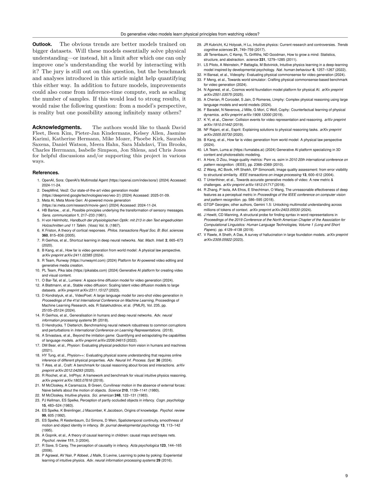

 


 2501.09038 
 Saman Motamed et el. 
 
 🤗 2025-01-17 
 



↗ arXiv


↗ Hugging Face


↗ Papers with Code


### TL;DR



현재의 첨단 AI 비디오 생성 모델은 비디오의 시각적 사실성을 높이는 데는 성공했지만, **물리적 현상에 대한 이해는 매우 부족**하다는 문제가 제기되고 있습니다. 기존 연구는 물리적 원리를 이해하지 못하고 단순히 화소를 예측하는 것만으로도 시각적 사실성을 달성할 수 있다는 주장과, 비디오 예측을 통해 물리적 원리를 학습할 수 있다는 상반된 주장을 제시하고 있습니다.

본 연구는 이러한 문제를 해결하기 위해 **Physics-IQ라는 새로운 벤치마크 데이터셋**을 개발했습니다. Physics-IQ는 다양한 물리적 원리 (유체 역학, 광학, 고체 역학 등)에 대한 이해가 필요한 여러 시나리오를 포함합니다. 연구진은 여러 최신 모델을 Physics-IQ로 평가한 결과, **모델들의 물리적 이해 능력이 시각적 사실성과는 관계없이 매우 제한적**임을 발견했습니다. 하지만, 일부 시나리오에서는 성공적으로 문제를 해결하는 경우도 있어, 관찰만으로 특정 물리적 원리를 학습할 가능성을 시사했습니다. 이는 향후 비디오 생성 모델의 물리적 이해 능력 향상을 위한 중요한 발걸음이 될 것입니다.



#### Key Takeaways


 새로운 Physics-IQ 벤치마크를 통해 생성 비디오 모델의 물리적 이해 능력을 평가 



 물리적 사실성과 시각적 사실성 간의 상관관계가 매우 낮음을 발견 



 일부 모델은 특정 물리적 원리를 학습할 수 있지만, 상당한 어려움이 존재 


#### Why does it matter?
**본 논문은 생성 비디오 모델이 비디오 시청을 통해 물리적 원리를 학습하는지 여부를 평가하는 새로운 벤치마크인 Physics-IQ를 제시합니다.** 이는 AI 비디오 생성 분야의 핵심적인 질문에 대한 답을 제시하고, **물리적 사실성과 시각적 사실성 간의 차이**를 보여줍니다. 이 연구는 AI 시스템의 물리적 이해 수준을 측정하고 개선하는 데 중요한 영향을 미칠 수 있습니다. 또한, **물리적 원리를 학습하는 새로운 방법**에 대한 연구를 촉진하고, 보다 **현실적이고 물리적으로 일관된 비디오 생성 모델** 개발에 기여할 수 있습니다.

------
#### Visual Insights

> 🔼 그림 1은 물리적 이해력을 평가하기 위해 Physics-IQ 데이터셋에서 가져온 샘플 시나리오들을 보여줍니다.  이미지-비디오 모델의 경우에는 단일 프레임을, 비디오-비디오 모델의 경우에는 3초 분량의 비디오 클립을 모델에 보여주고, 다음 5초 동안의 비디오를 예측하도록 합니다. 이는 고체역학, 유체역학, 광학, 열역학, 자기력 등 다양한 물리적 원리를 이해해야만 가능한 작업입니다.  각 시나리오는 다양한 물리적 현상을 보여주는 여러 개의 비디오 클립으로 구성되어 있습니다. 해당 그림의 애니메이션 버전을 확인할 수 있는 링크도 포함되어 있습니다.
> 

> 
read the caption

> Figure 1: Sample scenarios from the Physics-IQ dataset for testing physical understanding in generative video models. Models are shown the beginning of a video (single frame for image2video models; 3 seconds for video2video models) and need to predict how the video continues over the next 5 seconds, which requires understanding different physical properties: Solid Mechanics, Fluid Dynamics, Optics, Thermodynamics, and Magnetism. See here for an animated version of this figure.
> 


| Model | Spatial IoU ↑ | Spatiotemporal IoU ↑ | Weighted spatial IoU ↑ | MSE ↓ | Physics-IQ Score ↑ |
|---|---|---|---|---|---| 
| Physical Variance | 0.645 | 0.512 | 0.626 | 0.002 | 100.0 |
| VideoPoet (multiframe) | 0.245 | 0.143 | 0.054 | 0.010 | 24.1 |
| Runway Gen 3 (i2v) | 0.220 | 0.109 | 0.044 | 0.015 | 18.4 |
| Lumiere (multiframe) | 0.170 | 0.146 | 0.034 | 0.013 | 18.2 |
| VideoPoet (i2v) | 0.175 | 0.106 | 0.057 | 0.012 | 18.0 |
| Lumiere (i2v) | 0.138 | 0.165 | 0.024 | 0.016 | 17.1 |
| Stable Video Diffusion (i2v) | 0.139 | 0.054 | 0.088 | 0.021 | 13.5 |
| Pika 1.0 (i2v) | 0.151 | 0.034 | 0.026 | 0.014 | 9.5 |
| Sora (i2v) | 0.142 | 0.041 | 0.055 | 0.036 | 8.7 |

> 🔼 표 1은 다양한 비디오 생성 모델에 대한 지표 점수를 비교한 표입니다. 각 지표에서 가장 성능이 좋은 모델은 굵게 표시되어 있습니다. 물리적 변동성(Physical Variance)은 각 지표의 성능 상한선으로, 실제 비디오 두 개의 차이를 나타내며 실제 환경의 고유한 변동성을 반영합니다.
> 

> 
read the caption

> Table 1: Comparison of metric scores for different models. The best-performing model for each metric is marked in bold. Note that Physical Variance serves as a performance upper bound for each metric, representing the difference between two real videos and capturing the inherent variability in real-world scenarios.
> 

### In-depth insights

#### Video Physics IQ
"비디오 물리 지능(Video Physics IQ)"은 생성적 비디오 모델이 비디오 시청을 통해 물리적 원리를 실제로 학습하는지 평가하기 위한 벤치마크 데이터셋 및 평가 방법을 제시하는 개념입니다. 이는 단순한 화소 예측을 넘어 물리적 현상에 대한 이해를 측정하는 데 중점을 둡니다. **실제 세계의 다양한 물리적 현상을 담은 고품질 비디오 데이터**를 활용하여, 모델이 유체 역학, 광학, 고체 역학 등 다양한 물리 법칙을 얼마나 잘 이해하는지 평가합니다.  **정량적인 평가 지표**를 통해 모델의 물리적 이해 수준을 객관적으로 측정하고, 시각적 사실성과 물리적 이해 사이의 상관관계를 분석합니다.  본 연구는 **시각적 사실성이 물리적 이해를 보장하지 않음**을 보여주는 동시에, 관찰만으로도 특정 물리적 원리를 학습할 가능성을 시사합니다.  **향후 연구**는 더욱 발전된 모델과 더욱 풍부한 데이터를 통해 물리적 이해 능력의 향상을 기대하며,  **인간의 물리적 직관**과의 비교 및 상호작용을 통한 물리적 이해 능력 향상 방안에 대한 연구를 제시합니다.

#### Generative Models
본 논문은 생성적 비디오 모델이 비디오 시청을 통해 물리적 원리를 학습하는지 여부를 조사합니다. **핵심은 생성적 모델이 시각적 사실성을 달성하기 위해 물리적 원리를 이해해야 하는지, 또는 단순히 복잡한 픽셀 예측기로서 작동하는지 여부**를 탐구하는 것입니다. 이를 위해 연구자들은 물리적 원리에 대한 깊은 이해가 필요한 Physics-IQ 벤치마크 데이터셋을 개발했습니다. 다양한 최신 모델을 평가한 결과, **물리적 이해는 시각적 사실성과는 무관하며 상당히 제한적**임을 발견했습니다. 일부 테스트 사례는 성공적으로 해결되었지만, 관찰만으로 물리적 원리를 습득하는 데는 여전히 상당한 어려움이 있음을 시사합니다. 이는 시각적 사실성이 물리적 이해를 의미하지 않음을 보여줍니다.  **물리적 이해는 단순히 패턴 재현을 넘어서는 분포 외 일반화 능력을 요구하는 어려운 문제**라는 사실을 강조합니다.  향후 빠른 발전이 기대되지만, 시각적 사실성이 곧 물리적 이해를 의미하는 것은 아닙니다.  결론적으로, 생성적 모델의 물리적 이해 능력은 향상될 여지가 많으며, 더욱 정교하고 포괄적인 평가가 필요함을 시사합니다.

#### Physics Benchmarks
본 논문에서 다루는 "물리적 벤치마크"는 **영상 생성 모델이 물리 법칙에 대한 이해를 얼마나 잘 갖추고 있는지 평가하기 위한 다양한 기준 및 테스트**를 의미합니다.  단순히 시각적 사실성만을 평가하는 기존 방식에서 벗어나, **중력, 유체 역학, 광학 등 다양한 물리 현상을 반영한 시나리오**들을 통해 모델의 물리적 이해 능력을 종합적으로 평가하고자 합니다.  여기에는 **다양한 물체의 움직임, 상호작용, 물리적 변화** 등을 포함하며,  **정량적 지표**를 활용해 모델의 예측 성능을 측정합니다.  **실제 촬영한 고품질 영상 데이터셋**을 기반으로 하며, **다양한 모델의 성능 비교**를 통해  현재 영상 생성 모델의 물리적 이해 수준과 향후 연구 방향을 제시합니다.  **특히, 시각적 사실성과 물리적 이해의 상관관계를 분석**하여 **두 가지가 별개의 문제임**을 강조하는 것이 중요합니다.

#### Visual vs. Physics
본 논문은 시각적 사실성과 물리적 이해 사이의 괴리를 심도있게 다룹니다. **단순히 사실적으로 보이는 영상 생성 모델이 실제로 물리적 법칙을 이해하는 것은 아님**을 강조하며, Physics-IQ 벤치마크를 통해 이를 객관적으로 평가합니다.  **시각적 사실성은 물리적 이해와 상관관계가 적음**을 보여주는 실험 결과는,  단순히 패턴 인식에 기반한 시각적 현실감과 물리적 현상에 대한 진정한 이해 간의 차이를 명확히 드러냅니다.  **물리적 법칙을 이해하는 모델은 시각적 사실성을 넘어 예측 불가능한 상황에서도 정확한 결과를 제시**해야 하며,  현재의 모델들은 이러한 요구사항을 충족하지 못하고 있음을 보여줍니다.  **향후 연구는 상호작용을 통한 물리적 이해 증진 및 더욱 포괄적인 벤치마크 개발**에 초점을 맞춰야 함을 시사합니다.

#### Future Directions
본 논문의 "미래 방향"에 대한 고찰은 **대규모 데이터셋과 상호작용의 중요성**을 강조합니다.  더욱 방대한 양의 다양한 비디오 데이터를 활용한 모델 학습은 물리적 이해도 향상에 크게 기여할 것으로 예상되며,  **실제 환경과의 상호작용을 통해 데이터를 수집 및 학습하는 방식** 또한 중요한 연구 방향이 될 것입니다. **모델의 물리적 추론 능력을 정량적으로 평가하는 새로운 지표 개발**도 필요하며,  **현실 세계의 복잡한 물리적 현상을 보다 정확하게 모델링하고 예측하는 새로운 아키텍처** 연구도 중요합니다.  또한,  **합성 데이터와 실제 데이터 간의 차이를 줄이는 연구**,  **모델의 설명 가능성 및 투명성을 높이는 연구**,  그리고 **다양한 물리 법칙에 대한 이해도를 종합적으로 평가하는 벤치마크 개발** 역시 중요한 미래 과제입니다.  이는 단순히 시각적 사실성을 넘어 진정한 의미의 물리적 이해를 가진 AI 시스템 개발을 위한 필수적인 단계가 될 것입니다.

### More visual insights

More on figures

> 🔼 그림 2는 Physics-IQ 평가 프로토콜을 개괄적으로 보여줍니다. 비디오 생성 모델은 조건 프레임(들)의 5초 연속을 생성하며, 텍스트 입력을 허용하는 모델의 경우 조건 프레임에 대한 텍스트 설명을 선택적으로 포함할 수 있습니다. 생성된 프레임은 물리적 이해의 다양한 속성을 정량화하는 네 가지 지표를 사용하여 실제 프레임과 비교됩니다. 이러한 지표는 방법론 섹션에서 정의 및 설명되며, 평가를 실행하는 코드는 Physics-IQ-benchmark에서 이용할 수 있습니다.
> 

> 
read the caption

> Figure 2: Overview of the Physics-IQ evaluation protocol. A video generative model produces a 5 second continuation of the conditioning frame(s), optionally including a textual description of the conditioning frames for models that accept text input. They are compared against the ground truth test frames using four metrics that quantify different properties of physical understanding. The metrics are defined and explained in the methods section. Code to run the evaluation is available at Physics-IQ-benchmark.
> 

> 🔼 그림 3은 물리적 이해와 관련된 최근 합성 데이터셋들을 보여줍니다.  이 데이터셋들은 각 목적에 맞게 잘 설계되었지만, 실제 영상 데이터로 학습된 모델들을 평가하는 데는 적합하지 않습니다.  실제 영상과 합성 영상 간의 차이(분포 차이) 때문에 모델의 일반화 성능을 제대로 평가할 수 없기 때문입니다. 그림에는 CRAFT, IntPhys, Physion, ESPRIT, Physion++, CoPhy, CLEVERER, PhyWorld 데이터셋들이 포함되어 있습니다.  각 데이터셋은 물리적 현상을 다루지만, 시뮬레이션 환경에서 생성되었기 때문에 실제 세계의 복잡성과는 차이가 있습니다.
> 

> 
read the caption

> Figure 3: A qualitative overview of recent synthetic datasets related to physical understanding (19, 20, 17, 38, 18, 36, 37, 39). These datasets are great for the purposes they were designed for, but not ideal for evaluating models trained on real-world videos due to the distribution shift.
> 

> 🔼 그림 4는 현재 비디오 생성 모델이 물리적 원리를 얼마나 잘 이해하는지 보여줍니다. 왼쪽 그래프는 네 가지 개별 지표를 종합한 Physics-IQ 점수를 보여줍니다. 물리적 무작위성만 다른 실제 비디오 쌍의 점수를 100%로 정규화했습니다. 평가된 모든 모델은 큰 격차를 보이며, 최고 모델의 점수가 24.1%에 불과하여 물리적 이해가 매우 제한적임을 나타냅니다. 오른쪽 그래프는 네 가지 지표에 걸친 모델의 평균 순위를 보여줍니다. 왼쪽 그래프의 집계 결과와 오른쪽 그래프의 평균 순위 간의 스피어만 상관 관계는 높습니다(-0.87, p<.005). 따라서 단일 Physics-IQ 점수로 집계하면 모델 순위가 크게 유지됩니다.
> 

> 
read the caption

> Figure 4: How well do current video generative models understand physical principles? Left. The Physics-IQ score is an aggregated measure across four individual metrics, normalized such that pairs of real videos that differ only by physical randomness score 100%. All evaluated models show a large gap, with the best model scoring 24.1%, indicating that physical understanding is severely limited. Right. In addition, the mean rank of models across all four metrics is shown here; the Spearman correlation between aggregated results on the left and mean rank on the right is high (-⁢.87,p<.005-.87p.005\text{-}.87,\emph{p}<.005- .87 , p < .005), thus aggregating to a single Physics-IQ score largely preserves model rankings.
> 

> 🔼 그림 5는 시각적 사실성과 물리적 이해 간의 관계를 보여줍니다. 왼쪽 그래프는 다중 모드 대규모 언어 모델(Gemini 1.5 Pro)을 사용하여 생성된 비디오와 실제 비디오를 구분하는 2AFC(two-alternative forced choice) 패러다임에서 각 시나리오에 대한 MLLM 점수를 보여줍니다. 확률은 50%이며, 점수가 낮을수록 모델이 생성된 비디오와 실제 비디오를 구분하기 어렵다는 것을 의미합니다(즉, 사실성이 높음). Sora가 생성한 비디오는 모델이 실제 비디오와 구분하기 가장 어려웠고, Lumiere(다중 프레임)가 가장 쉬웠습니다. 오른쪽 그래프는 MLLM 점수로 평가한 사실적인 비디오를 생성하는 모델이 Physics-IQ 점수로 평가한 물리적 이해도에서도 더 좋은 점수를 받는지 여부를 보여줍니다. 선형 회귀선과 95% 신뢰 구간을 음영 처리한 영역으로 표시한 산점도는 시각적 사실성과 물리적 이해 간에 상관관계가 없음을 보여줍니다(피어슨 상관 계수 r = -0.46, p=.247, 유의하지 않음). 해석을 용이하게 하기 위해 y축이 반전되어 있습니다(위쪽 및 오른쪽이 가장 좋음).
> 

> 
read the caption

> Figure 5: Relationship between visual realism and physical understanding. Left. A multimodal large language model (Gemini 1.5 Pro) is asked to identify the generated video among the real and the generated video for each scenario (MLLM score) in a two-alternative forced choice paradigm. Chance rate is 50%; lower scores indicate that the model finds it harder to tell apart generated from real videos (= better realism). Sora-generated videos are hardest to distinguish from real videos for the model, whereas Lumiere (multiframe) is easiest. Right. Do models that produce ‘realistic-looking’ videos (as assessed by the MLLM score) also score better in terms of physical understanding (as assessed via the Physics-IQ score)? This scatterplot with linear fit and 95% confidence interval as a shaded blue area shows that this is not the case: Visual realism is uncorrelated with physical understanding (Pearson’s r = - 0.46, p=.247 not significant). Note that the y axis on this plot is inverted for easier interpretation (up & right are best).
> 

> 🔼 그림 6은 다양한 물리적 범주(열, 행)에 걸쳐 비디오 생성 모델의 성능을 비교한 것입니다. 상위 세 가지 지표는 값이 높을수록 좋고, 마지막 지표는 값이 낮을수록 좋습니다.  실제 비디오의 물리적 무작위성으로 인한 성능(물리적 분산)은 점선으로 표시되어 있습니다. 모든 지표와 범주에서 모델은 물리적 이해가 부족함을 보여줍니다.  작용이 발생한 위치만 평가하는 Spatial-IoU와 같은 관대한 지표는 작용이 언제, 얼마나 많이 발생했는지 고려하는 보다 엄격한 지표보다 점수가 높습니다.
> 

> 
read the caption

> Figure 6: Performance comparison of video generative models across different physical categories (columns) and metrics (rows). For the top three metrics, higher is better; for the last metric lower values are best. Throughout, physical variance (i.e., the performance that is achievable by real videos differing only by physical randomness) is indicated by a dashed line. Across metrics and categories, models show a considerable lack in physical understanding. More lenient metrics like 𝖲𝗉𝖺𝗍𝗂𝖺𝗅⁢-⁢𝖨𝗈𝖴𝖲𝗉𝖺𝗍𝗂𝖺𝗅-𝖨𝗈𝖴\mathsf{Spatial}\text{-}\mathsf{IoU}sansserif_Spatial - sansserif_IoU (top row) that only assess where an action occurred lead to higher scores than more strict metrics that also take into account e.g. when or how much action should be taking place.
> 

> 🔼 그림 7은 논문에서 제시된 척도에 따라 유체 역학 및 고체 역학 범주에서 두 가지 최고 성능 모델인 VideoPoet과 Runway Gen 3의 성공 및 실패 사례를 시각적으로 보여줍니다. 두 모델 모두 유리에 페인트를 바르는(VideoPoet) 및 고무 오리에 빨간 액체를 붓는(Runway Gen 3) 시나리오와 같이 물리적으로 타당한 프레임을 생성할 수 있습니다. 하지만 동시에 이 모델들은 상자에 공이 떨어지는 것 또는 칼로 귤을 자르는 것을 시뮬레이션하는 데 실패합니다. 애니메이션 버전은 여기에서 확인할 수 있습니다.
> 

> 
read the caption

> Figure 7: We here visualize success and failure scenarios within the fluid dynamics and solid mechanics categories for the two best models, VideoPoet and Runway Gen 3, according to our metrics. Both models are able to generate physics plausible frames for scenarios such as smearing paint on glass (VideoPoet) and pouring red liquid on a rubber duck (Runway Gen 3). At the same time, the models fail to simulate a ball falling into a crate or cutting a tangerine with a knife. See here for an animated version.
> 

> 🔼 그림 8은 논문의 Physics-IQ 벤치마크 데이터셋을 수집하기 위한 녹화 설정과 세 가지 다른 각도(왼쪽, 중앙, 오른쪽)에서 촬영한 이미지를 보여줍니다. 상단은 세 개의 카메라가 삼각대에 고정되어 물체의 움직임을 다양한 시점에서 포착하도록 배치된 녹화 설정을 보여줍니다. 하단은 각각의 카메라 위치에서 캡처된 동일한 장면의 이미지를 보여주어, 다양한 시각적 관점에서 동일한 물리적 현상을 어떻게 다르게 포착할 수 있는지 보여줍니다. 이는 Physics-IQ 데이터셋이 다양한 시각적 정보를 포함하여 모델의 물리적 이해도를 보다 포괄적으로 평가할 수 있도록 설계되었음을 강조합니다.
> 

> 
read the caption

> Figure 8: Illustration of recording setup (top) and perspectives (bottom).
> 

> 🔼 그림 9는 Physics-IQ 벤치마크 데이터셋에 포함된 모든 시나리오의 '스위치 프레임'(Switch Frame)을 보여줍니다. 스위치 프레임은 모델이 향후 5초 동안의 영상을 예측하기 전에 제공되는 마지막 조건 프레임입니다. 즉, 모델은 스위치 프레임까지의 영상을 보고 그 다음 5초간의 영상을 예측해야 합니다. 그림에서는 각 시나리오에 대한 중앙 시점의 스위치 프레임만을 보여주고 있습니다.
> 

> 
read the caption

> Figure 9: The switch frames (here: center view only) of all scenarios in the Physics-IQ benchmark. A switch frame is the last conditioning frame before a model is asked to predict 5 seconds of future frames.
> 

> 🔼 그림 10은 평균 제곱 오차(MSE) 값이 직관적으로 이해하기 어려울 수 있기 때문에, 이미지에 왜곡을 적용했을 때의 효과를 보여줍니다. 이는 다양한 수준의 MSE 노이즈가 이미지에 미치는 영향을 대략적으로 이해하는 데 도움이 되는 시각적 설명입니다. 그림에서는 노이즈가 없는 이미지부터 MSE 값이 점점 커짐에 따라 이미지가 왜곡되는 정도를 보여줍니다.
> 

> 
read the caption

> Figure 10: Since mean squared error (MSE) values can be hard to interpret, this figure shows the effect of a distortion applied to the scene, serving as a rough intuition for the effect of a MSE at different noise levels.
> 

### Full paper



