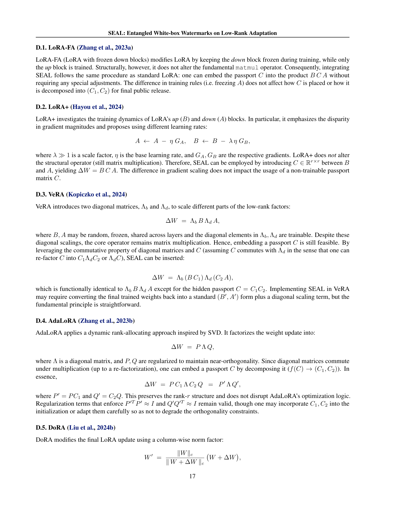

 


 2501.09284 
 Giyeong Oh et el. 
 
 🤗 2025-01-21 
 



↗ arXiv


↗ Hugging Face


↗ Papers with Code


### TL;DR



최근 **대규모 사전 학습 모델의 특정 작업 버전을 효율적으로 훈련 및 공유**하는 방법으로 **LoRA(Low-Rank Adaptation)**가 널리 사용되고 있습니다. 하지만 **LoRA 가중치의 저작권 보호** 문제는 여전히 미해결 과제로 남아있습니다. 특히, 워터마킹 기반 기법을 통한 LoRA 가중치의 저작권 보호는 충분히 연구되지 않았습니다.  

본 논문에서는 **LoRA 가중치에 대한 보안 워터마킹 기법인 SEAL(SEcure wAtermarking on LoRA weights)**을 제안합니다. SEAL은 **훈련 과정에서 훈련 불가능한 비밀 행렬(passport)을 훈련 가능한 LoRA 가중치 사이에 삽입**하여 저작권을 주장하는 데 사용됩니다.  **passport는 LoRA 가중치와 얽히게 되며**, 추가적인 손실 없이도 **훈련 후 passport를 숨긴 미세 조정된 가중치를 배포**할 수 있습니다. 실험 결과, SEAL은 **commonsense reasoning, textual/visual instruction tuning, text-to-image synthesis 작업에서 성능 저하 없이** 견고하게 작동하는 것을 확인했습니다.



#### Key Takeaways


 LoRA 모델의 저작권 보호를 위한 새로운 워터마킹 기법 SEAL 제시 



 기존 LoRA의 성능 저하 없이 저작권 보호 가능 



 제거, 혼란, 모호성 공격에 대한 강력한 견고성 


#### Why does it matter?
본 논문은 **LoRA(Low-Rank Adaptation)**의 저작권 보호 문제를 해결하기 위한 새로운 방법인 **SEAL(SEcure wAtermarking on LoRA weights)**을 제시하여, 연구자들이 효율적으로 **모델의 지적 재산권을 보호**할 수 있도록 지원합니다.  **LoRA의 경량성과 효율성을 유지**하면서 **저작권 침해에 대한 강력한 방어**를 제공함으로써, **AI 모델 공유 및 상용화**에 큰 영향을 미칠 수 있습니다. 특히, **다양한 공격 유형에 대한 견고성을 검증**하여 실제 적용 가능성을 높였으며, **향후 연구 방향을 제시**하여 LoRA의 보안 및 저작권 보호 기술 발전에 기여할 것으로 예상됩니다.

------
#### Visual Insights

> 🔼 그림 1은 논문에서 제안하는 LoRA 저작권 보호 기법인 SEAL의 개념을 보여줍니다.  먼저 LoRA 가중치 A와 B, 그리고 비훈련 가능한 워터마크(Passport)인 C와 Cp를 준비합니다.  훈련 중에, 워터마크 C와 Cp는 B와 A 사이에 삽입되어 모델이 이들을 의존하도록 만들고, 결과적으로 가중치와 워터마크를 서로 얽어매게 됩니다.  훈련 후에는 워터마크 C가 f(C) = (C1, C2) 함수를 통해 분해되어 B와 A에 통합되어 일반적인 LoRA 가중치 B'와 A'를 생성합니다.  한편, 소유권 확인을 위해 Cp는 개인적으로 보관됩니다.
> 

> 
read the caption

> Figure 1: Overview of SEAL. (1) We begin with LoRA’s weights A𝐴{A}italic_A and B𝐵{B}italic_B, plus non-trainable passports C,Cp𝐶subscript𝐶𝑝{C},{C}_{p}italic_C , italic_C start_POSTSUBSCRIPT italic_p end_POSTSUBSCRIPT. (2) During training, C𝐶{C}italic_C and Cpsubscript𝐶𝑝{C}_{p}italic_C start_POSTSUBSCRIPT italic_p end_POSTSUBSCRIPT are inserted between B𝐵{B}italic_B and A𝐴{A}italic_A, forcing the model to rely on them and thus entangling the weights with the passports. (3) Afterward, C𝐶{C}italic_C is factorized via f⁢(C)=(C1,C2)𝑓𝐶subscript𝐶1subscript𝐶2f({C})=({C}_{1},{C}_{2})italic_f ( italic_C ) = ( italic_C start_POSTSUBSCRIPT 1 end_POSTSUBSCRIPT , italic_C start_POSTSUBSCRIPT 2 end_POSTSUBSCRIPT ) and merged into B𝐵{B}italic_B and A𝐴{A}italic_A, resulting in standard-looking LoRA weights B′superscript𝐵′{B}^{\prime}italic_B start_POSTSUPERSCRIPT ′ end_POSTSUPERSCRIPT and A′superscript𝐴′{A}^{\prime}italic_A start_POSTSUPERSCRIPT ′ end_POSTSUPERSCRIPT. Meanwhile, Cpsubscript𝐶𝑝{C}_{p}italic_C start_POSTSUBSCRIPT italic_p end_POSTSUBSCRIPT remains private for ownership verification.
> 


| Method | BoolQ | PIQA | SIQA | HellaSwag | Wino. | ARC-e | ARC-c | OBQA | Avg. ↑ |
|---|---|---|---|---|---|---|---|---|---| 
| LLaMA-2-7B | LoRA | 73.75 | 82.99 | 79.85 | 86.14 | 85.06 | 86.15 | 73.63 | 81.67 ± 1.03 |
|  | SEAL (Ours) | 72.70 | 85.27 | 81.27 | 90.15 | 85.79 | 87.07 | 74.60 | 82.73 ± 0.14 |
|  | SEAL† (Ours) | 73.19 | 86.31 | 81.95 | 91.21 | 86.69 | 88.55 | 75.51 | **83.78** ± 0.27 |
| LLaMA-2-13B | LoRA | 75.57 | 86.98 | 81.39 | 91.82 | 88.53 | 90.08 | 78.78 | 84.98 ± 0.17 |
|  | SEAL (Ours) | 75.34 | 87.41 | 83.28 | 93.33 | 88.42 | 90.68 | 79.61 | 85.60 ± 0.34 |
|  | SEAL† (Ours) | 75.67 | 88.63 | 83.21 | 93.95 | 89.29 | 91.72 | 81.46 | **86.56** ± 0.10 |
| LLaMA-3-8B | LoRA | 74.76 | 88.22 | 80.96 | 92.00 | 86.08 | 90.09 | 82.41 | 85.10 ± 1.39 |
|  | SEAL (Ours) | 73.88 | 88.23 | 82.29 | 94.84 | 88.35 | 91.67 | 82.00 | 85.94 ± 0.29 |
|  | SEAL† (Ours) | 75.78 | 90.37 | 83.25 | 96.05 | 89.92 | 93.49 | 84.73 | **88.02** ± 0.11 |
| Gemma-2B | LoRA | 67.05 | 83.19 | 77.26 | 87.07 | 79.74 | 83.91 | 69.34 | 78.43 ± 0.32 |
|  | SEAL (Ours) | 66.56 | 81.79 | 77.65 | 84.82 | 79.16 | 82.79 | 68.40 | 77.55 ± 0.04 |
|  | SEAL† (Ours) | 66.70 | 82.50 | 78.88 | 87.57 | 80.19 | 83.81 | 69.97 | **78.68** ± 0.11 |
| Mistral-7B-v0.1 | LoRA | 75.92 | 90.72 | 81.78 | 94.68 | 88.69 | 93.10 | 83.36 | 87.07 ± 0.27 |
|  | SEAL (Ours) | 73.08 | 87.52 | 81.92 | 91.23 | 87.97 | 90.19 | 78.70 | 84.84 ± 0.44 |
|  | SEAL† (Ours) | 76.92 | 90.42 | 82.51 | 94.57 | 90.08 | 93.31 | 83.25 | **87.85** ± 0.02 |

> 🔼 표 1은 세 가지 상식 추론 작업(BoolQ, PIQA, SIQA, HellaSwag, Winograd Schema Challenge, ARC-e, ARC-c, OBQA)에 대한 세 가지 모델(LLaMA-2-7B, LLaMA-2-13B, LLaMA-3-8B)의 성능을 보여줍니다. 각 작업에 대해 LoRA와 SEAL의 평균 정확도를 세 번의 독립적인 실행으로 계산했습니다.  표에는 각 모델과 방법에 대한 평균 점수와 표준 편차가 표시되어 있습니다. SEAL†는 정규 분포에서 생성된 상수 행렬 C를 사용하는 SEAL 변형을 나타냅니다.
> 

> 
read the caption

> Table 1: Commonsense Reasoning Performance (3-run Avg.). Scores are averaged over three random seeds, with standard deviation shown in a smaller font for the last column. SEAL† denotes using a constant matrix C𝐶Citalic_C from normal distribution.
> 

### In-depth insights

#### LoRA Watermarking
LoRA(Low-Rank Adaptation)는 대규모 사전 학습 모델을 효율적으로 미세 조정하는 기법으로, 최근 급부상하고 있습니다.  **LoRA 워터마킹**은 이러한 LoRA의 효율성과 간편성을 활용하여 저작권 보호를 강화하는 새로운 접근 방식입니다. 기존의 워터마킹 기법들은 모델의 구조에 종속적인 반면, **LoRA 워터마킹은 모델의 구조에 구애받지 않고 워터마크를 삽입할 수 있다는 장점**을 가지고 있습니다.  이를 통해 다양한 모델에 적용 가능하며, 특히 LoRA 가중치를 공유하는 오픈소스 환경에서 저작권 보호의 새로운 지평을 열 수 있습니다.  **핵심은 훈련 과정에서 LoRA 가중치 사이에 비훈련 가능한 매트릭스(패스포트)를 삽입하여 가중치와 패스포트를 얽히게 하는 것**입니다.  이렇게 생성된 미세 조정된 가중치는 일반적인 LoRA 가중치와 구별되지 않지만,  **패스포트는 저작권 확인을 위한 비밀키**로 작용합니다.  **다양한 공격(제거, 난독화, 모호화)에 대한 강력한 저항성**을 보이는 것이 중요하며, 성능 저하 없이 저작권 보호를 달성하는 것이 LoRA 워터마킹의 핵심 목표입니다.  향후 연구는 **다양한 LoRA 변형 및 다른 PEFT(Parameter-Efficient Fine-Tuning) 기법에 대한 적용 가능성**을 확대하고,  더욱 강력하고 안전한 워터마킹 기법을 개발하는 데 초점을 맞춰야 할 것입니다.

#### SEAL's Robustness
본 논문에서 제시된 SEAL 알고리즘의 강건성은 다양한 적대적 공격에 대한 저항력을 의미합니다. **가장 중요한 부분은 저작권 침해 공격에 대한 방어 능력**입니다.  논문에서는 제거, 난독화, 모호성 공격이라는 세 가지 주요 공격 유형에 대한 SEAL의 강건성을 보여줍니다. **특히, 저작권자만이 암호화된 패스포트를 추출할 수 있다는 점과, 패스포트 제거 시 모델 성능이 심각하게 저하된다는 점은 SEAL의 강력한 저작권 보호 기능을 보여주는 핵심 증거**입니다.  또한, 다양한 모델과 작업에 걸쳐 성능 저하 없이 작동하는 것을 확인했으며, 이는 실제 응용 환경에서의 실용성을 시사합니다.  **다만, 모든 방어 메커니즘이 완벽하지 않다는 점을 고려하여, 지속적인 연구와 평가를 통해 SEAL의 강건성을 더욱 향상시켜야 함을 시사**합니다.  결론적으로, **SEAL은 LoRA 가중치 보호에 있어 강력하고 실용적인 솔루션을 제공**하지만,  **지속적인 개선과 검증이 필요**합니다.

#### Passport-based Method
패스포트 기반 방법은 **DNN 저작권 보호를 위한 새로운 접근 방식**을 제시합니다. 기존의 가중치 또는 활성화 기반 방법과 달리, 패스포트는 모델의 성능에 직접적으로 영향을 미치는 **숨겨진 매개변수** 역할을 합니다.  **올바른 패스포트를 사용할 때만 정상적인 성능을 유지**하고, 잘못된 패스포트를 사용하면 성능이 저하됩니다. 이는 **저작권자의 신원을 검증하는 효과적인 방법**이 됩니다. 하지만, 패스포트 자체가 변조될 위험성이 있으며, 이를 방지하기 위한 추가적인 보안 조치가 필요할 수 있습니다.  또한, 패스포트의 크기 및 복잡도가 모델의 성능에 미치는 영향을 신중하게 고려해야 합니다. **모델의 성능 저하 없이 효과적으로 저작권을 보호**하는 것이 중요하며,  향후 연구에서는 패스포트의 안전성 및 효율성을 더욱 높이기 위한 다양한 기술들이 연구될 것으로 예상됩니다.

#### Experimental Design
본 논문의 "실험 설계" 부분에 대한 심층적인 분석은 다음과 같습니다. **다양한 모델과 작업에 대한 광범위한 평가**가 이루어졌으며, **일반적인 사고 능력, 지시어 미세 조정, 텍스트-이미지 합성과 같은 다양한 작업**에서 성능을 평가하여 **SEAL의 범용성**을 보여주었습니다. 특히, **기존 LoRA와의 성능 비교**를 통해 성능 저하 없이 저작권 보호 기능을 추가할 수 있음을 확인했습니다. **제거, 난독화, 모호성 공격에 대한 견고성 평가**는 실험 설계의 중요한 부분이며, 이를 통해 SEAL의 강력한 저작권 보호 성능을 입증하였습니다.  **다양한 공격 시나리오에 대한 포괄적인 검증**을 통해 실험의 신뢰성을 높였습니다. **정량적 및 정성적 분석**을 병행하여 결과의 객관성과 명확성을 확보했습니다.  **단순하면서도 효과적인 저작권 보호 기법**을 제시하고, 다양한 측면에서 **실험적으로 검증**하여 연구의 신뢰성을 높였습니다.

#### Future Directions
본 논문에서 제시된 SEAL 방법의 미래 방향에 대해 심도있게 고찰해보면, **다양한 PEFT(Parameter-Efficient Fine-Tuning) 기법들과의 호환성 확장**이 중요한 과제입니다.  LoRA 외 다른 기법들(예: Adapter, Kronecker product 기반 방법)에도 SEAL을 적용할 수 있는 일반적인 프레임워크를 개발하는 것이 필요합니다. 또한, **워터마킹의 안전성 강화**를 위해,  **다중 워터마크**, **데이터 기반 매핑**, **비선형 연산** 등을 활용한 고급 기법들을 연구하여 강건성을 더욱 높일 수 있습니다.  **적대적 공격에 대한 방어 메커니즘**을 강화하는 것도 중요합니다. 특히, 워터마크 제거, 난독화, 모호화 공격에 효과적으로 대응할 수 있는 새로운 기술 개발이 필요합니다.  **실제 상용 환경에서의 적용 및 평가**를 통해 실용성을 검증하는 연구도 중요한 미래 과제입니다.  마지막으로, **윤리적, 법적 측면의 고려**가 필수적입니다.  워터마킹 기술의 악용 가능성을 줄이고, 저작권 보호와 기술 발전의 조화를 이루는 방향으로 연구가 진행되어야 할 것입니다. 

### More visual insights

More on figures

> 🔼 그림 2는 LoRA와 SEAL의 특징값 분포를 비교하여 보여줍니다.  LoRA(파란색)와 SEAL(주황색) 모델을 Llama-2, Mistral, Gemma 모델에 적용하여 학습한 후, 각 모델의 상위 32개 특이값의 음의 로그 값을 누적분포함수(CDF) 형태로 나타냈습니다. 이 그래프를 통해 SEAL이 LoRA에 비해 학습된 특징 공간이 여러 특이값에 더 고르게 분포되어 있음을 보여줍니다. 이는 특정 특이값을 제거하거나 변경하는 공격에 대한 SEAL의 강건성을 시사합니다.
> 

> 
read the caption

> Figure 2:  Negative log singular value (CDF), collection of top-32 singular values. LoRA (blue) vs. SEAL (orange) across Llama-2, Mistral, and Gemma models.
> 

> 🔼 그림 3은 가지치기 공격에 대한 실험 결과를 보여줍니다. 가로축은 L1 규범을 기준으로  ℕ(𝐵′,𝐴′) 에서 가장 작은 파라미터의 제로화 비율을 나타내고, 왼쪽 세로축은 상식 추론 작업에 대한 충실도 점수를, 오른쪽 세로축은 로그 스케일에서의 −log(p값)을 보여줍니다. −log(p값)이 3.3보다 크면(즉, p값 < 5×10⁻⁴), 워터마크 탐지를 성공한 것으로 간주합니다. 그래프는 제로화 비율이 증가함에 따라 충실도 점수가 감소함을 보여줍니다. 이는 99.9%의 가중치가 제로화될 때까지 워터마크가 탐지 가능함을 나타내며, 이는 호스트 작업의 성능을 크게 저하시킵니다.
> 

> 
read the caption

> Figure 3: Pruning Attack. The x-axis represents the zeroing ratio of the smallest parameters of ℕ⁢(B′,A′)ℕsuperscript𝐵′superscript𝐴′\mathbb{N}(B^{\prime},A^{\prime})blackboard_N ( italic_B start_POSTSUPERSCRIPT ′ end_POSTSUPERSCRIPT , italic_A start_POSTSUPERSCRIPT ′ end_POSTSUPERSCRIPT ) based on their L1 norms, the left y-axis shows the fidelity score on commonsense reasoning tasks, and the right y-axis displays the  −log⁡(p-value)p-value-\log(\text{p-value})- roman_log ( p-value ) on a log scale. If  −log⁡(p-value)p-value-\log(\text{p-value})- roman_log ( p-value ) is above 3.3 (i.e., p-value <5×10−4absent5superscript104<5\times 10^{-4}< 5 × 10 start_POSTSUPERSCRIPT - 4 end_POSTSUPERSCRIPT), detecting the watermark succeeds. The graphs show that as the zeroing ratio increases, the fidelity score decreases. This indicates the watermark remains detectable until 99.9% of the weights are zeroed, which significantly degrades the host task’s performance.
> 

> 🔼 그림 4는 적대적 환경에서의 SEAL의 강건성을 보여줍니다.  x축은 위조된 비밀키(passport) C~p-adv 와 실제 비밀키(passport) Cp 의 유사도(1-γ)를 나타내고, y축은 일반적인 상식 추론 작업에 대한 정확도를 나타냅니다. γ가 0.6보다 클 경우, 검증 과정의 임계값(ϵT)보다 정확도 차이가 현저하게 낮아져, 공격자가 위조된 비밀키를 사용하더라도,  검증 과정을 통과하지 못함을 시사합니다.  이를 통해 SEAL이 적대적 공격에 강인함을 보여줍니다.
> 

> 
read the caption

> Figure 4: Ambiguity Attacks. Fidelity score, MT(ℕ(A,B,Ct)M_{T}(\mathbb{N}(A,B,C_{t})italic_M start_POSTSUBSCRIPT italic_T end_POSTSUBSCRIPT ( blackboard_N ( italic_A , italic_B , italic_C start_POSTSUBSCRIPT italic_t end_POSTSUBSCRIPT ), as average accuracy on Commonsense Reasoning tasks, T𝑇Titalic_T, with the passport Ctsubscript𝐶𝑡C_{t}italic_C start_POSTSUBSCRIPT italic_t end_POSTSUBSCRIPT, which is the inference time passport. The x-axis represents the dissimilarity, γ𝛾\gammaitalic_γ, where Ct=(1−γ)⁢Cp+γ⁢C~p⁢-advsubscript𝐶𝑡1𝛾subscript𝐶𝑝𝛾subscript~𝐶𝑝-advC_{t}=(1-\gamma)C_{p}+\gamma\widetilde{C}_{p\text{-adv}}italic_C start_POSTSUBSCRIPT italic_t end_POSTSUBSCRIPT = ( 1 - italic_γ ) italic_C start_POSTSUBSCRIPT italic_p end_POSTSUBSCRIPT + italic_γ over~ start_ARG italic_C end_ARG start_POSTSUBSCRIPT italic_p -adv end_POSTSUBSCRIPT. Cpsubscript𝐶𝑝{C}_{p}italic_C start_POSTSUBSCRIPT italic_p end_POSTSUBSCRIPT is the concealed passport, and C~p⁢-advsubscript~𝐶𝑝-adv\widetilde{C}_{p\text{-adv}}over~ start_ARG italic_C end_ARG start_POSTSUBSCRIPT italic_p -adv end_POSTSUBSCRIPT is the adversary’ matrix. When γ>0.6𝛾0.6\gamma>0.6italic_γ > 0.6, the difference between fidelity scores significantly drops below the threshold of the verification process, ϵTsubscriptitalic-ϵ𝑇\epsilon_{T}italic_ϵ start_POSTSUBSCRIPT italic_T end_POSTSUBSCRIPT, as shown in Table 5.
> 

> 🔼 그림 6은 LoRA와 SEAL의 성능을 비교하기 위해, 미세조정된 가중치 업데이트(rank=32인 N(·)에 대해)의 상위 32개 특이값 σ에서 얻은 -log(σ)의 분포를 커널 밀도 추정(KDE)을 사용하여 시각화한 것입니다.  LoRA와 SEAL 모두에서 얻은 -log(σ)의 분포를 비교하여 두 모델의 특이값 분포 차이를 보여줍니다. 이를 통해 SEAL이 LoRA보다 더 넓은 특이값 분포를 가지며, 따라서 워터마킹 제거 공격에 대해 더 강인함을 시사합니다.
> 

> 
read the caption

> Figure 6: KDE of −log⁡(σ)𝜎-\log(\sigma)- roman_log ( italic_σ ) for LoRA vs. SEAL. We extract the top-32 singular values σ𝜎\sigmaitalic_σ from each module of the finetuned Δ⁢WΔ𝑊\Delta Wroman_Δ italic_W (for rank=32 ℕ⁢(⋅)ℕ⋅\mathbb{N}(\cdot)blackboard_N ( ⋅ )) and plot −log⁡(σ)𝜎-\log(\sigma)- roman_log ( italic_σ ) via a kernel density estimate (KDE).
> 

> 🔼 이 그림은 LoRA와 SEAL을 사용한 이미지 생성 결과를 비교한 것입니다.  세 개의 행으로 구성되어 있으며, 첫 번째 행은 참조 이미지, 두 번째 행은 LoRA를 사용하여 생성한 이미지, 세 번째 행은 SEAL을 사용하여 생성한 이미지를 보여줍니다. 각 행에는 여러 개의 이미지가 나란히 배치되어 다양한 대상에 대한 이미지 생성 결과를 비교 분석할 수 있도록 합니다.  이를 통해 LoRA와 SEAL이 생성한 이미지의 시각적 유사성과 차이점을 관찰하고, SEAL이 이미지 생성 성능에 미치는 영향을 평가할 수 있습니다.
> 

> 
read the caption

> Figure 7: Comparison of LoRA and SEAL in Text-to-Image Synthesis
> 

> 🔼  그림 8은 논문에서 제안하는 SEAL 방법의 핵심 구성 요소인 비훈련 가능한 매개변수(Passport)의 예시를 보여줍니다. 왼쪽은 YouTube 동영상(https://www.youtube.com/watch?v=2zHHkSu1br4)의 일부를 잘라내고 크기 조절하여 32x32 흑백 비트맵으로 만든 Passport (C)를 보여줍니다. 오른쪽은 LLaMA-2-7B 모델에서 SEAL 가중치의 10%를 제거했을 때 부분적으로 복구된 Passport (C)를 보여줍니다. 이 그림은 저해상도 비트맵 이미지가 모델의 매개변수 공간에 어떻게 통합될 수 있고, 소유권 확인을 위해 추출될 수 있는지를 시각적으로 보여주는 역할을 합니다.
> 

> 
read the caption

> Figure 8: Passport Example. Left: A 32×\times×32 grayscale bitmap (cropped and downsampled from a YouTube clip333https://www.youtube.com/watch?v=2zHHkSu1br4) serves as our non-trainable passport C𝐶Citalic_C. Right: The passport partially recovered (from 10% zeroed SEAL weight on LLaMA-2-7B).
> 

> 🔼 이 그림은 워터마크 매트릭스 C의 표준 편차(std)가 SEAL 가중치에 미치는 영향을 보여줍니다.  std = σ로 표시된 출력은 C ~ N(0, σ²)가 없는 SEAL 가중치(즉, N(B, A, Ø))만을 사용하여 생성된 것입니다.  'Vanilla SD 1.5'는 동일한 프롬프트를 사용한 Vanilla Stable Diffusion 1.5의 출력입니다.  다양한 표준 편차 값(σ)에서 생성된 이미지의 시각적 차이를 보여주며, 표준 편차가 작을수록(0.01) 원본 모델과의 차이가 커지고, 표준 편차가 클수록(10.0 또는 100.0) 차이가 작아짐을 시각적으로 보여줍니다.  즉, C가 없을 때, 작은 표준 편차는 고주파 아티팩트를 유발하고, 큰 표준 편차는 원본 모델과 유사한 결과를 생성합니다.
> 

> 
read the caption

> Figure 9: Effect of passport C𝐶Citalic_C standard deviation (std) on SEAL weight. std = σ𝜎\sigmaitalic_σ: Outputs are using only SEAL weight without C∼𝒩⁢(0,σ2)similar-to𝐶𝒩0superscript𝜎2C\sim\mathcal{N}(0,\sigma^{2})italic_C ∼ caligraphic_N ( 0 , italic_σ start_POSTSUPERSCRIPT 2 end_POSTSUPERSCRIPT ), ℕ⁢(B,A,∅)ℕ𝐵𝐴\mathbb{N}(B,A,\emptyset)blackboard_N ( italic_B , italic_A , ∅ ). Vanilla SD 1.5: output from vanila Stable Diffusion 1.5 with same prompt.
> 

More on tables


| Task | Inst. Tune |  | Text-to-Image | 
|---|---|---|---|---|
|  | Textual | Visual | CLIP-T | CLIP-I | DINO. |
| Metric ↑ | MT-B | Acc. |  |  |  |
| LoRA | **5.83** | **66.9** | **0.20** | **0.80** | **0.68** |
| SEAL | 5.81 | 63.1 | **0.20** | **0.80** | 0.67 |
> 🔼 표 2는 다양한 작업에서의 충실도를 보여줍니다. 여기에는 지시어 미세 조정(Instruction Tuning), MT-Bench(MT-B) 및 텍스트-이미지(t2i) 작업이 포함됩니다. 시각적 지시어 미세 조정 점수는 7가지 비전-언어 작업에 대한 평균 점수입니다(부록 참조). CLIP-I와 DINO는 주제 충실도 점수를 보여주는 반면, CLIP-T는 프롬프트 충실도 점수를 보여줍니다.
> 

> 
read the caption

> Table 2:  Fidelity across various tasks involves Inst. Tune (instruction tuning), MT-B (MT-Bench) and t2i task. Visual Inst. Tune score averages over seven vision-language tasks (see Appendix). CLIP-I and DINO demonstrate subject fidelity scores, while CLIP-T shows prompt fidelity scores.
> 


| Method | Wall Time (h) | Avg. |
|---|---|---|
| LoRA | 12.0 | 81.67 ± 1.03 |
| DoRA | 18.5 | 81.98 ± 0.26 |
| SEAL | 19.6 | **83.78** ± 0.27 |
| SEAL + DoRA | 27.8 | 81.88 ± 1.08 |
> 🔼 표 3은 Llama-2-7B 모델에 대해 LoRA, DoRA 및 SEAL의 일반적인 상식 추론 성능을 보여줍니다. SEAL+DoRA는 DoRA 변형에 SEAL 기법을 적용한 것을 나타냅니다.  초매개변수 설정은 부록 F에 나와 있습니다. 이 표는 다양한 매개변수 효율적인 미세 조정 방법(PEFT)의 상식 추론 성능을 비교하여 SEAL의 효과와 DoRA와의 호환성을 보여줍니다.
> 

> 
read the caption

> Table 3: Average Commonsense Reasoning Performance on Llama-2-7B for LoRA, DoRA, and SEAL. The notation SEAL+DoRA signifies that the SEAL approach has been applied in conjunction with the DoRA variant. Hyperparameter settings are in Appendix F.
> 


| Tasks | Acc. | MT-B | p-value |
|---|---|---|---|
| C3e | 83.1 | - | - |
| I3e | - | 5.81 | - |
| I3e→C1e | 60.2 | 4.94 | 1.71e-1171 |
| C3e→I1e | 0.24 | 3.56 | 2.81e-178 |
| C3e→C1e | 82.9 | - | 3.86e-3111 |
| I3e→I1e | - | 3.78 | 9.08e-06 |
> 🔼 표 4는 SEAL의 견고성을 평가하기 위한 미세 조정 공격 실험 결과를 보여줍니다.  같거나 다른 데이터셋에서 미세 조정을 수행한 후,  워터마크(패스포트)의 검출 가능성을 평가합니다.  실험은 일반적인 추론 작업(Commonsense Reasoning)과 Alpaca 데이터셋을 사용한 지시 조정(Instruction Tuning) 두 가지 작업에 대해 수행되었습니다. 표에는 각 작업에 대한 정확도(Accuracy)와 MT-B 점수, 그리고 워터마크 검출의 p-값이 제시되어 있습니다. p-값이 작을수록 워터마크가 성공적으로 검출되었음을 의미합니다. 이 표는 다양한 미세조정 공격 시나리오에서 SEAL의 워터마킹의 강건성을 보여줍니다.
> 

> 
read the caption

> Table 4: Finetuning Attack. The detectability of passport on SEAL across either the same or different datasets.
> 


| Model | $C_{t}=C$ | $C_{t}=C_{p}$ | $\
ewline \\\epsilon_{T}$ |
|---|---|---|---| 
| LLaMA-2-7B | 82.2 | 82.7 | 0.5 |
| Mistral-7B-v0.1 | 84.2 | 87.9 | 3.7 |
| Gemma-2B | 76.3 | 76.6 | 0.3 |
> 🔼 표 5는 다양한 상식 추론 작업에서 두 개의 패스포트에 대한 충실도 성능을 보여줍니다.  각 패스포트에 대한 평균 정확도를 보여주는 지표인 𝑀𝑇(𝑁(𝐵,𝐴,𝐶))가 제시되어 있으며, ğ‘€ğ‘‡는 작업별 지표, 𝑁(𝐵,𝐴,𝐶)는 LoRA 모델의 적응 계층을 나타냅니다.  표는 LoRA 모델의 훈련 과정에서 두 개의 서로 다른 패스포트(C와 Cp)가 얼마나 유사하게 성능을 유지하는지 보여줍니다. 이는 저작권 보호를 위한 SEAL 알고리즘의 강력함을 보여주는 중요한 지표입니다.
> 

> 
read the caption

> Table 5: Fidelity performance, MTsubscript𝑀𝑇M_{T}italic_M start_POSTSUBSCRIPT italic_T end_POSTSUBSCRIPT, table for each passport on commonsense reasoning task, T𝑇Titalic_T.
> 


Symbol|Description
---|---|---
W|Pretrained model weight (size $b \times a$) on which LoRA is applied.
B,A|LoRA’s trainable _up_ and _down_ blocks, where $B \in \mathbb{R}^{b \times r}$, $A \in \mathbb{R}^{r \times a}$, and $r \ll \min(b,a)$.
B',A'|Publicly released LoRA weights _after_ distributing the passport C (see Def. 3.2). These have the same shape as B,A.
ΔW|The weight offset from LoRA (or SEAL). For instance, $\Delta W = B \, C \, A$ or $B \, A$ depending on context.
$\mathbb{N}(\cdot)$|The adaptation layer operator; e.g., $\mathbb{N}(B,A)$ for standard LoRA, or $\mathbb{N}(B,A,C)$ for SEAL.
C,$C_p$|Non-trainable _passports_ in SEAL. C is the main passport hidden into B',A'; $C_p$ is an additional passport for ownership verification. Both are in $\mathbb{R}^{r \times r}$.
$\widetilde{B}, \widetilde{A}, \widetilde{C} \,(\widetilde{C}_{p\text{-adv}})$|An _adversarial factorization_ of publicly released weights (B',A') that an attacker attempts to construct; e.g. $\widetilde{B}\,\widetilde{C}\,\widetilde{A} = B'A'$. In some scenarios, an attacker may generate $\widetilde{C}_{p\text{-adv}}$ to forge an additional passport. These have the same shape as B,A,C respectively.
C_t|A _runtime passport_ (e.g., used in inference or verification) for given B,A.
f(\cdot)|Decomposition function that takes C and returns two factors ($C_1, C_2$) such that $C_1C_2 = C$. For example, $f_{svd}$ uses Singular Value Decomposition (SVD).
T|The _host task_ (e.g., instruction following, QA), to which LoRA (SEAL) is adapted.
M_T(\cdot)|A _fidelity score_ or performance metric (e.g., accuracy) of the adaptation layer on task T.
V(\cdot)|The verification process (function) that checks authenticity of passports (Sec. 3.6.3). It outputs `True` or `False`.
ϵ_T|A threshold used in the verification stage to decide ownership claims.
> 🔼 표 6은 논문에서 제안하는 SEAL(SEcure wAtermarking on LoRA weights) 방법에 사용된 주요 기호와 정의를 설명하는 표입니다.  각 기호는 모델 가중치, LoRA(Low-Rank Adaptation) 계층, 워터마킹을 위한 패스포트 행렬 등을 나타내며, 각 기호의 의미와 크기, 그리고 SEAL 알고리즘 동작 방식을 이해하는 데 필수적인 정보를 담고 있습니다.  본 표는 SEAL 알고리즘의 핵심 개념을 이해하는 데 중요한 역할을 합니다.
> 

> 
read the caption

> Table 6: Notation table for SEAL. Key symbols and their definitions.
> 


| Models | Gemma-2B |  | Mistral-7B-v0.1 |  | LLaMA-2-7B |  | LLaMA-2-13B |  | LLaMA-3-8B |  |
|---|---|---|---|---|---|---|---|---|---|---|
| Method | LoRA | SEAL | LoRA | SEAL | LoRA | SEAL | LoRA | SEAL | LoRA | SEAL |
| r | 32 |  |  |  |  |  |  |  |  |  |
| alpha | 32 |  |  |  |  |  |  |  |  |  |
| Dropout | 0.05 |  |  |  |  |  |  |  |  |  |
| LR | 2e-4 | 2e-5 | 2e-5 | 2e-5 | 2e-4 | 2e-5 | 2e-4 | 2e-5 | 2e-4 | 2e-5 |
| Optimizer | AdamW (Loshchilov & Hutter, 2019) |  |  |  |  |  |  |  |  |  |
| LR scheduler | Linear |  |  |  |  |  |  |  |  |  |
| Weight Decay | 0 |  |  |  |  |  |  |  |  |  |
| Warmup Steps | 100 |  |  |  |  |  |  |  |  |  |
| Total Batch size | 16 |  |  |  |  |  |  |  |  |  |
| Epoch | 3 |  |  |  |  |  |  |  |  |  |
| Target Modules | Query Key Value UpProj DownProj |  |  |  |  |  |  |  |  |  |
> 🔼 표 7은 Gemma-2B, Mistral-7B-v0.1, LLaMA-2-7B/13B, LLaMA-3-8B 모델에서 상식 추론 작업에 대해 SEAL과 LoRA의 하이퍼파라미터 설정을 보여줍니다. 모든 실험은 LLaMA-2-13B의 경우 4x A100 80GB, 다른 모델의 경우 4x RTX 3090을 사용하여 약 15시간 동안 수행되었습니다.  표에는 각 모델과 방법(LoRA, SEAL)에 대한 하이퍼파라미터 값(예: rank(r), alpha, dropout 비율, 학습률(LR), 최적화기, 학습률 스케줄러, 가중치 감쇠, 웜업 단계, 배치 크기, 에포크 수, 대상 모듈)이 포함되어 있습니다. 이 표는 다양한 모델과 방법에 대한 하이퍼파라미터 설정을 비교하여 실험의 재현성과 신뢰성을 높이는 데 도움이 됩니다.
> 

> 
read the caption

> Table 7: Hyperparameter configurations of SEAL and LoRA for Gemma-2B, Mistral-7B-v0.1, LLaMA2-7B/13B, and LLaMA3-8B on the commonsense reasoning. All experiments are done with 4x A100 80GB (for LLaMA-2-13B) and 4x RTX 3090 (for the other models) with approximately 15 hours.
> 


| Model | Method |  | 
|---|---|---|
| LLaMA-2-7B | LoRA | SEAL |
| r | 32 |  32 |
| alpha | 32 |  |
| Dropout | 0.0 |  |
| LR | 2e-5 |  |
| LR scheduler | Cosine |  |
| Optimizer | AdamW |  |
| Weight Decay | 0 |  |
| Total Batch size | 8 |  |
| Epoch | 3 |  |
| Target Modules | All w/o LM HEAD |  |
> 🔼 표 8은 지시 조정(Instruction Tuning)을 위한 SEAL 및 LoRA의 하이퍼파라미터 설정을 보여줍니다. 모든 실험은 1x A100 80GB GPU를 사용하여 약 2시간 동안 수행되었습니다. LM HEAD를 제외한 모든 모듈(Query, Key, Value, Out, UpProj, DownProj, GateProj)에 대해 하이퍼파라미터가 설정됩니다.  표에는 LoRA와 SEAL 모두에 대한 하이퍼파라미터 값이 각 열에 나열되어 있으며, rank, alpha, dropout, 학습률(LR), 최적화 알고리즘, 학습률 스케줄러, 가중치 감쇠, 웜업 단계, 배치 크기, 에포크 수 등이 포함되어 있습니다.
> 

> 
read the caption

> Table 8: Hyperparameter configurations of SEAL and LoRA for Instruction Tuning. All experiments are done with 1x A100 80GB for approximately 2 hours. All w/o LM HEAD are Query, Key, Value, Out, UpProj, DownProj, GateProj.
> 


| Method | # Params (%) | VQAv2 | GQA | VisWiz | SQA | VQAT | POPE | MMBench | Avg |
|---|---|---|---|---|---|---|---|---|---| 
| FT | 100 | 78.5 | 61.9 | 50.0 | 66.8 | 58.2 | 85.9 | 64.3 | 66.5 |
| LoRA | 4.61 | 79.1 | 62.9 | 47.8 | 68.4 | 58.2 | 86.4 | 66.1 | **66.9** |
| SEAL | 4.61 | 75.4 | 58.3 | 41.6 | 66.9 | 52.9 | 86.0 | 60.5 | 63.1 |
> 🔼 표 9는 7가지 시각적 지시 조정 벤치마크에 대한 세 가지 방법(FT, LoRA, SEAL)의 성능을 비교한 표입니다.  각 방법에 대한 매개변수 수, VQAv2, GQA, VisWiz, SQA, VQAT, POPE 및 MMBench 벤치마크의 정확도 점수, 그리고 평균 정확도 점수가 표시되어 있습니다. 이 표는 SEAL이 LoRA와 비슷한 성능을 보이며, 파라미터 효율성 측면에서도 우수함을 보여줍니다.
> 

> 
read the caption

> Table 9: Performance comparison of different methods across seven visual instruction tuning benchmarks
> 


| Model | LLaVA-1.5-7B |
|---|---| 
| Method | LoRA | SEAL |
| r | 128 |
| alpha | 128 |
| LR | 2e-4 | 2e-5 |
| LR scheduler | Linear |
| Optimizer | AdamW |
| Weight Decay | 0 |
| Warmup Ratio | 0.03 |
| Total Batch size | 64 |
> 🔼 표 10은 시각적 지시 조정을 위한 하이퍼파라미터 설정을 보여줍니다.  실험은 4개의 A100 80GB GPU를 사용하여 약 24시간 동안 수행되었습니다.  표에는 LoRA와 SEAL 방법 모두에 대한 하이퍼파라미터(rank, alpha, 학습률, 최적화 알고리즘, 학습률 스케줄러, 가중치 감쇠, 웜업 단계, 배치 크기, 에폭, 대상 모듈)가 포함되어 있습니다. 이 표는 본 논문의 실험 설정에 대한 자세한 정보를 제공하여 재현성을 높이고, 다른 연구자들이 동일한 실험 환경을 구축하는 데 도움을 줍니다.
> 

> 
read the caption

> Table 10: Hyperparameters for visual instruction tuning. All experiments were performed with 4x A100 80GB with approximately 24 hours
> 


| Prompts for Non-Live Objects | Prompts for Live Subjects |
|---|---| 
| a {} in the jungle | a {} in the jungle |
| a {} in the snow | a {} in the snow |
| a {} on the beach | a {} on the beach |
| a {} on a cobblestone street | a {} on a cobblestone street |
| a {} on top of pink fabric | a {} on top of pink fabric |
| a {} on top of a wooden floor | a {} on top of a wooden floor |
| a {} with a city in the background | a {} with a city in the background |
| a {} with a mountain in the background | a {} with a mountain in the background |
| a {} with a blue house in the background | a {} with a blue house in the background |
| a {} on top of a purple rug in a forest | a {} on top of a purple rug in a forest |
| a {} with a wheat field in the background | a {} wearing a red hat |
| a {} with a tree and autumn leaves in the background | a {} wearing a santa hat |
| a {} with the Eiffel Tower in the background | a {} wearing a rainbow scarf |
| a {} floating on top of water | a {} wearing a black top hat and a monocle |
| a {} floating in an ocean of milk | a {} in a chef outfit |
| a {} on top of green grass with sunflowers around it | a {} in a firefighter outfit |
| a {} on top of a mirror | a {} in a police outfit |
| a {} on top of the sidewalk in a crowded street | a {} wearing pink glasses |
| a {} on top of a dirt road | a {} wearing a yellow shirt |
| a {} on top of a white rug | a {} in a purple wizard outfit |
| a red {} | a red {} |
| a purple {} | a purple {} |
| a shiny {} | a shiny {} |
| a wet {} | a wet {} |
| a cube shaped {} | a cube shaped {} |
> 🔼 이 표는 논문의 4.5절 'Text-to-Image Synthesis'에서 사용된 DreamBooth 데이터셋에 대한 설명입니다.  DreamBooth 데이터셋은 15개의 서로 다른 종류에 속하는 30개의 개별 객체(무생물 및 생물)로 구성됩니다. 각 객체는 4~6개의 이미지로 구성됩니다.  표는 무생물 객체와 생물 객체 각각에 대해 사용된 텍스트 프롬프트를 보여줍니다.  각 객체 유형에 대해 다양한 배경, 위치, 그리고 추가적인 속성(예: 색상, 형태)을 포함하는 여러 프롬프트가 제시되어 있습니다.  이러한 다양한 프롬프트는 모델의 성능을 다각적으로 평가하기 위해 사용되었습니다.  즉, 이미지 생성 모델이 주어진 객체를 다양한 상황에서도 정확하게 생성할 수 있는지를 평가하기 위한 다양한 프롬프트들을 보여줍니다.
> 

> 
read the caption

> Table 11: DreamBooth text prompts used for evaluation of inanimate objects and live subjects.
> 


| Model | Method |  | 
|---|---|---|
| Stable Diffusion 1.5 | LoRA | SEAL |
| r | 32 | 32 |
| alpha | 32 | 32 |
| Dropout | 0.0 | 0.0 |
| LR | 5e-5 | 1e-5 |
| LR scheduler | Constant | Constant |
| Optimizer | AdamW | AdamW |
| Weight Decay | 1e-2 | 1e-2 |
| Total Batch size | 32 | 32 |
| Steps | 300 | 300 |
| Target Modules | Q K V Out AddK AddV | Q K V Out AddK AddV |
> 🔼 표 12는 LoRA와 SEAL을 사용한 텍스트-이미지 합성 실험에 대한 하이퍼파라미터 설정을 보여줍니다.  4개의 RTX 4090 GPU를 사용하여 각 주제당 약 15분 동안 실험을 진행했습니다.  표에는 LoRA와 SEAL 방법 모두에 대한 하이퍼파라미터 값(rank, alpha, dropout 비율, 학습률, 학습률 스케줄러, 최적화 알고리즘, 가중치 감쇠, 웜업 단계, 배치 크기, 에포크 수, 대상 모듈)이 자세히 나열되어 있습니다. 이를 통해 LoRA와 SEAL의 성능 비교 및 하이퍼파라미터 조정의 영향을 분석하는 데 도움이 됩니다.
> 

> 
read the caption

> Table 12: Hyperparameter configurations of SEAL and LoRA for Text-to-Image Synthesis. All experiments are done with 4x RTX 4090 with approximately 15 minutes per subject.
> 


| Model | LLaMA-2-7B |
|---|---| 
| Method | LoRA |
| r | 32 |
| alpha | 32 |
| LR | 2e-5 |
| Optimizer | AdamW |
| LR scheduler | Linear |
| Weight Decay | 0 |
| Warmup Steps | 100 |
| Batch size | 16 |
| Epoch | 1 |
| Target Modules | Query Key Value UpProj DownProj |
> 🔼 표 13은 SEAL 모델에 대한 미세 조정 공격에 대한 하이퍼파라미터 설정을 보여줍니다.  3 에폭 동안 훈련된 SEAL 가중치  ℕ(𝐵′,𝐴′)ℕsuperscript𝐵′superscript𝐴′ mathbb{N}(B^{ abla},A^{ abla}) 에 대해 미세 조정 훈련을 재개합니다. 여기서 비선형 매핑 함수  𝑓𝑠𝑣𝑑를 통해 패스포트  𝐶가  𝐵와  𝐴에 분포되어 있습니다.  표는 미세 조정 공격에 사용된 하이퍼파라미터 (𝑟, α, 드롭아웃, 학습률, 최적화 알고리즘, 학습률 스케줄러, 가중치 감쇠, 워밍업 단계, 배치 크기, 에폭, 대상 모듈)들을 보여줍니다.  LLaMA-2-7B 모델에 대한 설정이 제공됩니다.
> 

> 
read the caption

> Table 13: Hyperparameter configurations of Finetruning Attack on SEAL which trains on 3-epoch. We resume training on ℕ⁢(B′,A′)ℕsuperscript𝐵′superscript𝐴′\mathbb{N}(B^{\prime},A^{\prime})blackboard_N ( italic_B start_POSTSUPERSCRIPT ′ end_POSTSUPERSCRIPT , italic_A start_POSTSUPERSCRIPT ′ end_POSTSUPERSCRIPT ), which passport C𝐶Citalic_C is distributed in B,A𝐵𝐴B,Aitalic_B , italic_A via fs⁢v⁢dsubscript𝑓𝑠𝑣𝑑f_{svd}italic_f start_POSTSUBSCRIPT italic_s italic_v italic_d end_POSTSUBSCRIPT.
> 


| Model | Method | LRa | SEAL | DoRA | SEAL+DoRA |
|---|---|---|---|---|---| 
| LLaMA-2-7B | LoRA | 2e-4 | 2e-5 | 2e-4 | 2e-5 |
| r |  | 32 |  |  |  |
| alpha |  | 32 |  |  |  |
| Dropout |  | 0.05 |  |  |  |
| LR |  | 2e-4 | 2e-5 | 2e-4 | 2e-5 |
| Optimizer |  | AdamW |  |  |  |
| LR scheduler |  | Linear |  |  |  |
| Weight Decay |  | 0 |  |  |  |
| Warmup Steps |  | 100 |  |  |  |
| Total Batch size |  | 16 |  |  |  |
| Epoch |  | 3 |  |  |  |
| Target Modules |  | Query Key Value UpProj DownProj |  |  |  |
> 🔼 표 14는 DoRA와 통합된 LoRA 및 SEAL의 하이퍼파라미터 설정을 보여줍니다.  모델은 LLaMA-2-7B를 사용하며, 각 방법(LoRA, SEAL, DoRA, SEAL+DoRA)에 대한 rank(r), alpha, dropout 비율, 학습률(LR), 옵티마이저, 학습률 스케줄러, 가중치 감쇠, 웜업 단계, 배치 크기, 에포크 수, 그리고 목표 모듈(Query Key Value UpProj DownProj) 등의 하이퍼파라미터 값이 제시되어 있습니다.  이 표는 DoRA라는 LoRA의 변형 모델과 SEAL을 결합했을 때의 성능 비교를 위한 실험 설정을 보여줍니다.
> 

> 
read the caption

> Table 14: Hyperparameter configurations of Integrating with DoRA.
> 


| Rank | BoolQ | PIQA | SIQA | HellaSwag | Wino. | ARC-c | ARC-e | OBQA | Avg. |
|---|---|---|---|---|---|---|---|---|---| 
| 4 | 65.05 | 78.18 | 75.64 | 76.16 | 73.56 | 65.02 | 81.65 | 74.80 | 73.76 |
| 8 | 64.83 | 81.23 | 77.02 | 83.92 | 77.35 | 68.43 | 83.00 | 79.20 | 76.87 |
| 16 | 66.24 | 82.32 | 77.94 | 86.10 | 79.24 | 67.32 | 83.12 | 78.60 | **77.61** |
| 32 | 66.45 | 82.16 | 78.20 | 83.72 | 79.95 | 68.09 | 82.62 | 79.40 | 77.57 |
| LoRAr=32 | 65.96 | 78.62 | 75.23 | 79.20 | 76.64 | 79.13 | 62.80 | 72.40 | 73.75 |
> 🔼 표 15는 다양한 순위 설정에서 상식 추론 작업에 대한 정확도를 보여줍니다. 이 표에는 LoRA r=32와 SEAL r=32뿐만 아니라 SEAL의 순위 구성(4, 8, 16)에 대한 결과가 포함되어 있습니다.  다양한 차원의 저차원 적응(LoRA) 모델을 사용했을 때의 성능을 비교 분석한 표입니다.  각 순위 설정(4, 8, 16)에서 SEAL의 성능과 기준 LoRA 모델(r=32)의 성능을 비교하여,  SEAL의 성능이 순위에 크게 영향받지 않고 안정적임을 보여줍니다.
> 

> 
read the caption

> Table 15: Accuracy across various rank settings on commonsense reasoning tasks. The table includes results for rank configurations (4, 8, 16) of SEAL, as well as LoRA r=32 and SEAL r=32.
> 


| Ref. | Metric ↑ | Standard Deviation of C | Standard Deviation of C | Standard Deviation of C | Standard Deviation of C | Standard Deviation of C |
|---|---|---|---|---|---|---|
|  |  | 0.01 | 0.1 | 1.0 | 10.0 | 100.0 |
| Obj.1 | SSIM | 0.104 | 0.691 | 0.936 | 0.987 | 0.998 |
|  | PSNR | 7.80 | 19.02 | 30.87 | 43.64 | 53.16 |
| Obj.2 | SSIM | 0.102 | 0.652 | 0.941 | 0.993 | 0.998 |
|  | PSNR | 7.91 | 18.51 | 33.15 | 47.24 | 54.21 |
| Obj.3 | SSIM | 0.115 | 0.651 | 0.959 | 0.992 | 0.998 |
|  | PSNR | 8.08 | 18.39 | 32.92 | 45.39 | 53.58 |
> 🔼 표 16은 워터마크 C가 없는 상태(즉, C~N(0,σ²)에서 생성된 이미지에 대한 PSNR 및 SSIM 값을 비교한 표입니다. 즉, C가 없는 훈련된 SEAL 가중치만 사용하여 생성된 이미지 N(B,A,∅)에 대한 PSNR과 SSIM값을 표에 보여주고 있습니다.  다양한 표준편차(std) 값을 가진 패스포트 C를 사용하여 생성된 이미지와 Vanilla SD 1.5 모델을 사용하여 생성된 이미지 간의 비교를 보여줍니다.  대상 이미지는 고양이(Obj. 1), 배낭을 멘 강아지(Obj. 2), 오리 인형(Obj. 3)입니다. 대상 이미지 이름은 Ruiz et al.(2023)의 논문에서 따온 것입니다.
> 

> 
read the caption

> Table 16: Comparision of PSNR and SSIM values for images generated without C∼𝒩⁢(0,σ2)similar-to𝐶𝒩0superscript𝜎2C\sim\mathcal{N}(0,\sigma^{2})italic_C ∼ caligraphic_N ( 0 , italic_σ start_POSTSUPERSCRIPT 2 end_POSTSUPERSCRIPT ), using only ℕ⁢(B,A,∅)ℕ𝐵𝐴\mathbb{N}(B,A,\emptyset)blackboard_N ( italic_B , italic_A , ∅ ), under varying standard deviations of the passport C𝐶Citalic_C, with images generated under vanilla SD 1.5 model. Obj. 1: Cat, Object 2: Backpack dog, Obj. 3: Ducky toy. Object names are same as (Ruiz et al., 2023)
> 

### Full paper



