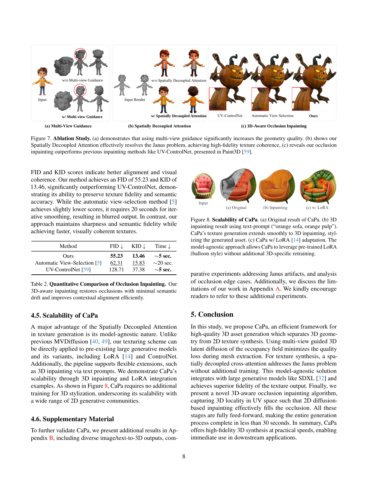

 


 2501.09433 
 Hwan Heo et el. 
 
 🤗 2025-01-17 
 



↗ arXiv


↗ Hugging Face


↗ Papers with Code


### TL;DR



현대 생성 모델링에서 텍스트 또는 이미지 입력으로부터 고품질 3D 자산을 합성하는 것은 중심 목표가 되었습니다. 하지만 기존의 3D 생성 알고리즘들은 다중 뷰 불일치, 느린 생성 시간, 낮은 충실도, 표면 재구성 문제 등 여러 가지 어려움에 직면해 왔습니다. 이러한 문제점을 해결하기 위해, 본 논문에서는 고품질 3D 자산을 효율적으로 생성하는 새로운 프레임워크인 CaPa를 제시합니다.

CaPa는 기하학적 생성과 텍스처 합성을 분리하는 2단계 과정을 사용합니다. 첫 번째 단계에서는 다중 뷰 입력으로 안내되는 3D 잠재 확산 모델을 사용하여 기하학적 구조를 생성합니다. 두 번째 단계에서는 새로운 모델-애그노스틱 공간적 분리 어텐션을 활용하여 고해상도 텍스처(최대 4K)를 합성합니다. 또한, 3D 인식 폐색 채우기 알고리즘을 통해 텍스처가 없는 영역을 채워 전체 모델의 일관성을 확보합니다. CaPa는 30초 이내에 고품질 3D 자산을 생성하여 게임, 영화, VR/AR 등 다양한 상업적 응용 분야에 바로 사용할 수 있도록 합니다. 실험 결과는 CaPa가 텍스처 충실도와 기하학적 안정성 모두에서 뛰어난 성능을 보임을 보여줍니다.



#### Key Takeaways


 30초 이내에 고품질 4K 텍스처를 가진 3D 모델 생성 



 기하학적 생성과 텍스처 합성 분리, 효율성 및 유연성 증대 



 모델-애그노스틱 공간 분리 크로스 어텐션 및 3D 인식 폐색 채우기 알고리즘으로 텍스처 충실도 및 기하학적 안정성 향상 


#### Why does it matter?
본 논문은 **고품질 텍스처를 가진 4K 해상도의 3D 모델을 빠르게 생성하는 새로운 프레임워크 CaPa**를 제시하여 3D 자산 생성 분야의 효율성과 정확도를 크게 향상시켰다는 점에서 중요합니다. **기존 방법들의 한계점인 속도 저하, 품질 저하, 다중 뷰 일관성 문제 등을 효과적으로 해결**하여 게임, 영화, VR/AR 등 다양한 상업 분야에 바로 적용 가능한 3D 자산을 제공합니다. 또한, **모델-애그노스틱 방식의 공간적 분리 크로스 어텐션 및 3D 인식 폐색 채우기 알고리즘**을 통해 텍스처 충실도와 기하학적 안정성을 크게 향상시켰으며, 이는 향후 3D 생성 모델 연구에 새로운 방향을 제시할 수 있습니다.

------
#### Visual Insights

> 🔼 그림 1은 CaPa 파이프라인을 보여줍니다. 먼저 3D 잠재 확산 모델을 사용하여 3D 기하 형태를 생성합니다. ShapeVAE로 학습된 3D 잠재 공간을 사용하여, 생성된 형태와 질감 간의 정렬을 보장하기 위해 다중 뷰 이미지로 안내되는 3D 잠재 확산 모델을 학습시킵니다. 3D 기하 형태가 생성된 후, 메시의 사중 직교 뷰를 렌더링하여 질감 생성을 위한 입력으로 사용합니다. 새로운 모델 독립적인 공간 분리 주의 집중 방식을 사용하여, 제아누스 문제를 방지하면서 고품질 질감을 생성합니다. 마지막으로, 역투영과 3D 인식 폐색 페인팅 알고리즘을 통해 초고품질 질감 메시를 얻습니다.
> 

> 
read the caption

> Figure 1: CaPa pipeline. We first generate 3D geometry using a 3D latent diffusion model. Using the learned 3D latent space with ShapeVAE, we train a 3D Latent Diffusion Model that generates 3D geometries, guided by multi-view images to ensure alignment between the generated shape and texture. After the 3D geometry is created, we render four orthogonal views of the mesh, which serve as inputs for texture generation. To produce a high-quality texture while preventing the Janus problem, we utilize a novel, model-agnostic spatially decoupled attention. Finally, we obtain a hyper-quality textured mesh through back projection and a 3D-aware occlusion inpainting algorithm.
> 


| Method | CLIP (I-I) ↑ | FID ↓ | Time ↓ |
|---|---|---|---|
| Ours | **86.34** | **47.56** | ~30 seconds |
| DreamCraft3D [43] | 77.61 | 75.66 | ~3 hours |
| Unique3D [54] | **81.92** | **67.17** | ~2 minutes |
| Era3D [18] | 66.81 | 89.18 | ~10 minutes |
| SF3D [3] | 70.18 | 84.52 | **~10 seconds** |

> 🔼 표 1은 CaPa 모델의 정량적 성능을 평가한 결과를 보여줍니다. CLIP 점수와 FID 점수 모두에서 CaPa는 기존 최첨단 기법들보다 상당히 높은 점수를 기록했으며, 생성 시간 또한 합리적인 수준을 유지했습니다. 이는 CaPa가 고품질 3D 자산을 효율적으로 생성하는 데 뛰어난 성능을 가짐을 보여줍니다.
> 

> 
read the caption

> Table 1:  Quantitative results.  CaPa outperforms all the competitors by a significant margin in both CLIP score and FID score, with a reasonable generation time.
> 

### In-depth insights

#### CaPa: Carve-n-Paint
CaPa: Carve-n-Paint는 텍스트 또는 이미지 입력으로부터 고품질 3D 텍스처 메시를 효율적으로 생성하는 신규 프레임워크입니다. 이는 기존 방법들의 한계를 극복하기 위해 **기하 생성과 텍스처 합성을 분리**하는 2단계 프로세스를 채택합니다. 먼저, 다중 뷰 입력으로 유도되는 3D 잠재 확산 모델을 사용하여 기하 구조를 생성하고 일관성을 유지합니다. 다음으로, 모델과 무관한 공간적 분리 주의 메커니즘을 활용하여 최대 4K의 고해상도 텍스처를 합성합니다. 여기에는 3D 인식 폐색 채우기 알고리즘을 도입하여 텍스처 일관성을 더욱 향상시키고, **30초 이내에 고품질 3D 자산을 생성**하여 상용 애플리케이션에 바로 적용할 수 있게 합니다.  **기존 방법들과 비교하여 텍스처 충실도와 기하 안정성을 크게 향상**시키는 것으로 실험 결과가 입증되었습니다.  **메시 최적화 3D 생성 파이프라인, 공간적 분리 교차 주의 메커니즘, 3D 인식 빠른 폐색 채우기 알고리즘** 등이 CaPa의 핵심 기여로 제시됩니다.

#### 3D Asset Synthesis
본 논문은 3D 자산 합성 분야에서 **고품질 텍스처 생성의 효율성**을 높이는 데 중점을 둡니다. 기존 방법들의 한계점인 다중 뷰 불일치, 느린 생성 시간, 낮은 충실도 등을 해결하기 위해, **기하학적 생성과 텍스처 합성을 분리**하는 2단계 과정을 제시합니다. 첫 번째 단계에서는 다중 뷰 입력을 사용하여 구조적 일관성을 유지하면서 기하학적 형태를 생성하고, 두 번째 단계에서는 공간적으로 분리된 어텐션 메커니즘을 통해 고해상도 텍스처를 합성합니다. 특히, **모델에 독립적인 방식**으로 4K 해상도의 텍스처를 생성하고, 3D 인식 폐색 채우기 알고리즘을 통해 텍스처 완성도를 높입니다. 이러한 접근 방식은 상용 애플리케이션에 바로 사용 가능한 고품질 3D 자산을 30초 이내에 생성하여, **효율성과 품질을 동시에 만족**하는 혁신적인 결과를 보여줍니다.  **다중 뷰 일관성 문제 해결**, **고해상도 텍스처 생성**, **효율적인 처리 과정**이라는 세 가지 핵심적인 강점을 통해 3D 자산 합성 분야의 새로운 기준을 제시합니다.

#### Multi-view Diffusion
다시 말해, 멀티뷰 확산(Multi-view Diffusion)은 **여러 시점에서 얻은 이미지 정보를 통합하여 3D 모델을 생성하는 기법**입니다. 이는 단일 시점의 이미지만으로는 얻기 어려운 3D 모델의 공간적 일관성과 정확도를 높이는 데 중요한 역할을 합니다.  **기존의 단일 시점 기반 3D 생성 모델은 뷰의 부족으로 인한 정보 손실이나 불일치**로 인해 품질이 떨어지는 경우가 많았으나, 멀티뷰 확산은 **여러 뷰의 정보를 종합적으로 고려**함으로써 이러한 문제를 해결합니다. 하지만, **계산 비용 증가 및 뷰 간의 일관성 유지의 어려움** 등의 과제도 존재합니다.  따라서 멀티뷰 확산의 효과적인 구현을 위해서는 **계산 효율성을 높이는 알고리즘 개발**과 **뷰 간의 정보 통합 전략**이 중요하며, **데이터의 질과 양**도 중요한 요소입니다.  **고품질의 3D 모델 생성**을 위해서는 이러한 요소들을 종합적으로 고려한 연구가 필요합니다.

#### Occlusion Inpainting
본 논문에서 제시된 폐색 영역 채우기 방법은 기존의 방법들과는 달리 **3D 지오메트리 정보를 적극 활용**하여, 폐색으로 인해 텍스처가 생성되지 않은 영역을 효과적으로 채웁니다. 단순히 2D 이미지 처리만으로는 해결하기 어려운 3D 폐색 문제를, **3D-aware occlusion mapping과 inpainting 알고리즘**을 통해 해결하여, 보다 자연스럽고 일관성 있는 텍스처를 생성할 수 있다는 장점을 가지고 있습니다. 특히, **k-means 클러스터링 기법**을 사용하여 폐색 영역을 효율적으로 분할하고, 각 영역에 특화된 UV 맵을 생성하여, **2D diffusion model의 성능을 최대한 활용**함으로써, 고해상도 텍스처를 빠르게 생성하는 효율성도 확보합니다.  하지만, 복잡한 폐색 구조의 경우 완벽한 복원에는 한계가 있을 수 있으며, **추가적인 연구를 통해 더욱 개선**될 여지가 있다는 점을 논문에서도 언급하고 있습니다.  전반적으로, 본 논문에서 제시된 폐색 영역 채우기 방법은 **3D 모델 생성의 효율성 및 품질 향상**에 크게 기여할 수 있는 핵심적인 기술로 평가될 수 있습니다.

#### Future of 3D Gen
3D 생성 기술의 미래는 **실시간 고품질 3D 자산 생성**을 향한 끊임없는 추구에 달려 있습니다.  현재 기술은 속도와 품질 면에서 상당한 발전을 이루었지만, 여전히 물리적 기반 렌더링(PBR) 재질 이해, 다양한 시점에서의 일관성 유지, 복잡한 장면의 효율적인 생성 등의 과제가 남아 있습니다. **다중 시점 지도 학습 기반 모델**은 이러한 문제를 해결하는 데 중요한 역할을 할 것으로 예상되며, **더욱 정교한 3D 모델과 텍스처 생성**을 가능하게 합니다. 또한, **모델의 크기와 연산 비용을 줄이는 경량화 기술**의 발전 또한 필수적입니다. 특히, 모바일 및 증강현실(AR)과 같은 제한된 환경에서의 3D 생성 기술 활용을 위해서는 경량화가 매우 중요합니다.  **텍스트 및 이미지를 포함한 다양한 입력 모드**에 대한 지원 또한 확대될 것으로 예상되며, 사용자의 편의성과 창의성을 더욱 높일 수 있습니다.  **AI 기반 자동화 기술**의 발전은 3D 자산 생성 과정의 효율성을 더욱 높이고, 전문가가 아닌 사용자들도 손쉽게 고품질 3D 콘텐츠를 제작할 수 있도록 돕습니다.  궁극적으로, **메타버스와 게임, 영화, VR/AR 등 다양한 산업 분야**에서 3D 생성 기술의 활용 범위는 더욱 확대될 것이며, 이는 **새로운 차원의 몰입형 경험**을 제공할 것으로 기대됩니다.

### More visual insights

More on figures

> 🔼 그림 2는 CaPa 모델의 핵심 구성 요소인 공간적으로 분리된 크로스 어텐션(Spatially Decoupled Cross Attention) 메커니즘을 보여줍니다.  이 메커니즘은 주어진 3D 기하 구조에 대해 고품질의 다중 뷰 이미지를 생성하기 위해 설계되었으며, 모델과 무관하게(model-agnostic) 동작합니다.  기존의 다중 뷰 이미지 생성 방식과 달리, 노이즈 제거 U-Net 내부의 크로스 어텐션 과정에서 은닉 특징 채널(hidden feature channels)을 복제하여 각 복제된 채널이 특정 뷰에만 집중하도록 합니다. 이를 통해 각 뷰의 공간적 정보가 독립적으로 처리되면서도 일관성을 유지할 수 있습니다.  또한, 이러한 모델 독립적인 설계 덕분에 외부 ControlNet을 활용하여 입력 메시에 정렬된 텍스처를 생성하는 데 도움을 받을 수 있습니다.
> 

> 
read the caption

> Figure 2: Spatially Decoupled Cross Attention. To produce high-quality multi-view images for a given geometry, we design a model-agnostic Spatially Decoupled Cross Attention. During cross-attention in denoising U-Net, we replicate hidden feature channels so that each duplicated channels focuses solely on the designated view. Since the design is model-agnostic, we can utilize an external ControlNet to guide the textures aligned with the input mesh.
> 

> 🔼 그림 3은 CaPa의 3D-Aware Occlusion Inpainting 알고리즘을 보여줍니다. 먼저, 텍스처가 생성되지 않은(occluded) 면들의 법선 벡터와 공간 좌표를 클러스터링합니다. 클러스터 중심을 새로운 뷰포인트로 사용하여 투영 매핑을 통해 특수한 UV 맵을 생성합니다. 이 UV 맵은 표면의 지역적 특징(surface locality)을 보존하여 2D 확산 기반의 인페인팅(inpainting)을 통해 텍스처가 없는 영역을 효과적으로 채울 수 있도록 합니다. 이 UV 맵은 오직 폐색 영역을 채우는 용도로만 사용됩니다.
> 

> 
read the caption

> Figure 3: 3D-Aware Occlusion Inpainting. First, we cluster the normal and spatial coordinates of the occluded face. Using clustered centers as viewpoints, we create specialized UV maps through projection mapping. This approach captures surface locality, allowing 2D diffusion-based inpainting to effectively fill occluded regions. Note that this UV map is utilized solely for occlusion.
> 

> 🔼 본 그림은 기존의 텍스처 생성 방법과 CaPa의 텍스처 생성 결과를 비교하여 CaPa의 우수성을 보여줍니다. 기존 방법들은 뷰 간의 일관성이 부족하여 Janus 문제(여러 얼굴이 나타나는 현상)가 발생했지만, CaPa는 독창적인 공간적 분리 어텐션(Spatially Decoupled Attention) 기법을 사용하여 이 문제를 효과적으로 해결하고 일관된 텍스처를 생성합니다. 이는  ID 일관성을 유지하면서 고품질 텍스처를 생성하는 CaPa의 능력을 시각적으로 보여줍니다.
> 

> 
read the caption

> Figure 4: Comparison of Texturing Method. Unlike prior works, CaPa effectively resolved the Janus problem with consistent ID.
> 

> 🔼 이 그림은 CaPa를 최첨단 이미지 투 3D 변환 방법들과 비교하여, 생성된 3D 자산의 품질을 보여줍니다. 모든 자산은 공식 코드를 사용하여 다각형 메쉬로 변환되었습니다. CaPa는 특히 후면 및 측면 뷰에서 기하학적 안정성과 질감 품질 면에서 다른 방법들보다 훨씬 뛰어난 성능을 보여줍니다. 후면 및 측면 뷰의 시각적 충실도와 질감 일관성이 특히 향상되었습니다.
> 

> 
read the caption

> Figure 5: Qualitative Comparison of Image-to-3D Generation. We compare CaPa with state-of-the-art Image-to-3D methods. Here, all the assets are converted to polygonal mesh, using its official code. The proposed CaPa significantly outperforms both geometry stability and texture quality, especially for the back and side view’s visual fidelity and texture coherence.
> 

> 🔼 그림 6은 CaPa 모델의 ablation study 결과를 보여줍니다. (a)는 다중 뷰 가이드를 사용했을 때 기하학적 품질이 크게 향상됨을 보여줍니다. (b)는 CaPa의 공간적으로 분리된 어텐션 메커니즘이 제이너스 문제(Janus problem)를 효과적으로 해결하고 고품질의 질감 일관성을 달성함을 보여줍니다. (c)는 CaPa의 폐색 보간법(occlusion inpainting)이 Paint3D [59] 논문에서 제시된 UV-ControlNet과 같은 기존의 보간법보다 성능이 우수함을 보여줍니다.
> 

> 
read the caption

> Figure 6: Ablation Study. (a) demonstrates that using multi-view guidance significantly increases the geometry quality. (b) shows our Spatially Decoupled Attention effectively resolves the Janus problem, achieving high-fidelity texture coherence, (c) reveals our occlusion inpainting outperforms previous inpainting methods like UV-ControlNet, presented in Paint3D [59].
> 

> 🔼 그림 7은 CaPa의 확장성을 보여줍니다. (a)는 CaPa의 기본 결과물이고, (b)는 '오렌지색 소파, 오렌지색 과육'이라는 텍스트 프롬프트를 사용하여 3D 페인팅 결과를 보여줍니다. CaPa의 텍스처 생성은 3D 페인팅으로 매끄럽게 확장되어 생성된 자산을 스타일링합니다. (c)는 사전 훈련된 LoRA(풍선 스타일)를 추가적인 3D 특정 재훈련 없이 활용할 수 있도록 하는 CaPa의 모델 독립적 접근 방식을 보여줍니다.
> 

> 
read the caption

> Figure 7: Scalability of CaPa. (a) Original result of CaPa. (b) 3D inpainting result using text-prompt (“orange sofa, orange pulp”). CaPa’s texture generation extends smoothly to 3D inpainting, stylizing the generated asset. (c) CaPa w/ LoRA [14] adaptation. The model-agnostic approach allows CaPa to leverage pre-trained LoRA (balloon style) without additional 3D-specific retraining.
> 

> 🔼 그림 8은 CaPa가 물리 기반 렌더링(PBR) 머티리얼을 분리할 수 있는 능력을 보여줍니다. 이 그림은 '도시', '스튜디오', '밤'의 세 가지 조명 조건에서 PBR 인식 생성 결과를 보여줍니다. Blender의 기본 환경 설정을 사용하여 생성되었습니다. CaPa는 다양한 조명 환경에 효과적으로 적응하여 PBR 인식 자산 생성의 잠재력을 강조합니다.  즉, CaPa가 생성한 3D 모델이 다양한 조명 환경에서도 일관된 외관을 유지하며, 물리 기반 렌더링(PBR) 머티리얼에 대한 이해도를 가지고 있음을 보여줍니다.
> 

> 
read the caption

> Figure 8: Result of the CaPa with PBR Understanding. We demonstrate CaPa’s capability for disentangling physically based rendering (PBR) materials. The figure shows PBR-aware generation results under various lighting conditions: ‘city,’ ‘studio,’ and ‘night,’ using Blender’s default environment settings [7]. As shown, CaPa effectively adapts to different light environments, highlighting its potential for PBR-aware asset generation.
> 

> 🔼 그림 10은 CaPa의 추가적인 이미지-투-3D 결과를 보여줍니다. CaPa는 텍스트 및 비주얼 입력으로 다양한 물체를 생성할 수 있습니다. 결과는 다양한 범주에서 CaPa의 다양성을 보여주며, 실용적인 3D 자산 생성 방법론에서 중요한 발전을 이루었음을 보여줍니다.
> 

> 
read the caption

> Figure 9: Additional Image-to-3D Results of CaPa. CaPa can generate diverse objects from textual, and visual input. The result demonstrates our diversity across the various categories, marking a significant advancement in practical 3D asset generation methodologies.
> 

> 🔼 이 그림은 CaPa 모델이 생성한 3D 모델의 품질을 기존 최첨단 방법들(Unique3D, Era3D, DreamCraft3D, SF3D)과 비교하여 보여줍니다. 특히 뒷면과 측면과 같이 가려진 부분에서 CaPa 모델이 기하학적 안정성과 질감의 정확성 측면에서 훨씬 우수한 성능을 보임을 시각적으로 보여줍니다.  각 모델의 정면, 측면, 후면 이미지를 비교하여 CaPa의 우수성을 강조합니다.  이를 통해 CaPa가 다양한 시점에서도 일관된 고품질 텍스처를 생성하며, 기존 방법들의 한계를 극복함을 확인할 수 있습니다.
> 

> 
read the caption

> Figure 10: Additional Comparison of Image-to-3D Generation. CaPa significantly outperforms both geometry stability and texture quality, especially for the back and side view’s visual fidelity and texture coherence.
> 

> 🔼 그림 11은 제안된 공간적 분리 크로스 어텐션 메커니즘의 자누스 현상 방지 기능을 보여줍니다. 각 행은 (a) 공간적 분리 크로스 어텐션 적용, (b) 공간적 분리 크로스 어텐션 미적용, (c) 현재 뷰의 메시 렌더링을 각각 보여줍니다. 이 그림은 다양한 뷰에서 일관된 고품질 텍스처를 생성하는 데 있어서 공간적 분리 크로스 어텐션의 효과를 보여주는 추가적인 실험 결과입니다. 자누스 현상이란, 3D 모델의 서로 다른 뷰에서 텍스처가 불일치하는 현상을 말합니다.
> 

> 
read the caption

> Figure 11: Impact of Spatially Decoupled Cross Attention on Janus Artifacts. In this additional figure, We demonstrate the capability of Janus prevention in the proposed spatially decoupled cross-attention mechanism. Each row depicts, (a) with spatially decoupled cross attention, (b) without spatially decoupled cross attention, and (c) a mesh rendering of the current view, respectively.
> 

> 🔼 그림 12는 세 가지 서로 다른 폐색 영역 채우기 방법의 정성적 결과를 보여줍니다. (a)는 논문에서 제안하는 3D-aware 폐색 영역 채우기 방법의 결과이고, (b)는 자동 뷰 선택 방법의 결과이며, (c)는 UV ControlNet을 사용한 결과입니다. 이 그림은 각 방법의 강점과 약점을 보여주고 3D 자산 생성에서 폐색 영역 처리의 중요성을 강조합니다. 특히, 다양한 물체에 대한 각 방법의 결과를 비교하여 어떤 방법이 복잡한 폐색 영역 처리에 더 적합한지 시각적으로 보여줍니다. 각 방법은 서로 다른 장점과 단점을 가지고 있으므로, 실제 응용 프로그램에서는 여러 가지 방법을 비교 분석하여 가장 적합한 방법을 선택하는 것이 중요합니다.
> 

> 
read the caption

> Figure 12: Qualitative results for different occlusion inpainting methods. (a) shows results from our 3D-aware occlusion inpainting method, (b) uses automatic view selection, and (c) employs UV ControlNet.
> 

> 🔼 이 그림은 CaPa 모델이 텍스트 및 시각적 입력으로부터 다양한 3D 개체를 생성할 수 있음을 보여줍니다. 생성된 3D 모델들은 고해상도의 질감과 잘 정의된 기하학적 형태를 가지고 있으며, CaPa가 고품질의 텍스처와 정확한 기하학적 구조를 동시에 생성하는 데 뛰어난 성능을 가짐을 보여줍니다.
> 

> 
read the caption

> Figure 13: Text-to-3D Results of CaPa. CaPa can generate diverse objects from textual, and visual input. The result underscores CaPa’s strengths in generating high-resolution textures that align with well-defined geometries.
> 

> 🔼 이 그림은 논문의 3D 메쉬 생성 알고리즘에 대한 후처리 과정인 리메싱(remeshing) 기법을 보여줍니다.  원본 다각형 메쉬(a)에서 사각형 면으로 구성된 리메싱 결과(b)와 삼각형 면으로 구성된 리메싱 결과(c)를 비교하여 보여줍니다. 리메싱은 3D 자산을 다양한 응용 프로그램에 실제로 사용하기 위해 기하학적 품질을 향상시키는 과정입니다.  (b)와 (c)의 결과는 다양한 응용 프로그램에 적합한 고품질 메쉬를 얻기 위한 사각형과 삼각형 메쉬의 각각의 장단점을 보여주는 것을 목표로 합니다.
> 

> 
read the caption

> Figure 14: Results of Our Remeshing Algorithm. We employ a carefully designed remeshing scheme after geometry generation for better practical usage for broader applications. (a) shows the original polygonal mesh, (b) shows remeshed output of quadrilateral faces, and (c) shows remeshed output of triangular faces.
> 

More on tables


| Method | FID ↓ | KID ↓ | Time ↓ |
|---|---|---|---|
| Ours | **55.23** | **13.46** | ~**5 sec.** |
| Automatic View-Selection [5] | **62.31** | **15.83** | ~20 sec. |
| UV-ControlNet [59] | 128.71 | 37.38 | ~**5 sec.** |
> 🔼 표 2는 3D-aware occlusion inpainting 기법의 정량적 비교 결과를 보여줍니다. 제안된 방법은 최소한의 의미론적 드리프트(semantic drift)로 폐색 영역을 복원하고 문맥적 정렬(contextual alignment)을 효율적으로 개선합니다.  기존 방법들과 비교하여 FID와 KID 점수를 통해 정량적으로 성능을 평가합니다. FID와 KID 점수가 낮을수록 이미지 품질이 좋음을 의미합니다.
> 

> 
read the caption

> Table 2:  Quantitative Comparison of Occlusion Inpainting.  Our 3D-aware inpainting restores occlusions with minimal semantic drift and improves contextual alignment efficiently.
> 


| Method | CLIP (N-I) ↑ | 
|---|---| 
| w/ Spatially Decoupled Attention | **85.37** | 
| w/o Spatially Decoupled Attention | 81.28 | 
> 🔼 이 표는 CaPa 모델의 멀티뷰 일관성(multi-view consistency)을 정량적으로 평가한 결과를 보여줍니다.  Janus 문제(여러 뷰에서 텍스처가 불일치하는 현상)를 완화하기 위한 CaPa의 공간적 분리 주의집중(Spatially Decoupled Attention) 메커니즘의 효과를 CLIP 점수를 사용하여 측정했습니다. 렌더링된 노말(normal)과 텍스처 간의 CLIP 유사도 점수를 계산하여 멀티뷰 일관성을 평가했습니다.  공간적 분리 주의집중 메커니즘을 사용했을 때와 사용하지 않았을 때의 CLIP 점수 차이를 통해 Janus 문제 해결에 대한 정량적 분석을 수행했습니다.
> 

> 
read the caption

> Table 3:  Quantitative analysis of Janus Artifacts, measuring a CLIP score between rendered normals and textures across random views.
> 

### Full paper



