 


 2501.09484 
 Zhaocheng Liu et el. 
 
 🤗 2025-01-17 
 



↗ arXiv


↗ Hugging Face


↗ Papers with Code


### TL;DR



온라인 의료 상담(OMC)은 의사가 환자 정보를 질문을 통해서만 얻기 때문에 진단 과정이 복잡해지고 정확도가 떨어지는 문제가 있습니다. 기존 연구는 주로 충분한 정보 하에서의 진단 정확도 향상에 초점을 맞춰왔지만, 질문 단계(Inquiry)에 대한 연구는 부족했습니다.  본 연구는 질문과 진단 간의 관계를 밝히고 OMC의 효율성을 높이는 데 기여할 수 있는 중요한 발견입니다.

본 연구는 실제 의사-환자 대화 데이터를 분석하여 환자의 대화 전략을 추출하고, 이를 바탕으로 현실적인 환자 시뮬레이터를 개발했습니다.  개발된 시뮬레이터를 사용하여 다양한 의료 언어 모델(LLM)의 질의 능력을 평가하고, 질의와 진단 간의 상관관계를 분석했습니다. 그 결과, 질문의 질이 진단의 정확도에 큰 영향을 미치며, 다양한 LLM의 질의 능력에 차이가 있음을 발견했습니다.  본 연구는 OMC의 질 개선을 위한 새로운 방향을 제시하고, 향후 의료 AI 연구의 발전에 기여할 것입니다.



#### Key Takeaways


 실제 의사-환자 대화 전략을 활용한 환자 시뮬레이터 개발 



 질의와 진단의 관계가 Liebig's law를 따른다는 발견 (질의의 질이 낮으면 진단 성능이 제한됨) 



 다양한 의료 LLM의 질의 성능 차이 분석 및 개선 방향 제시 


#### Why does it matter?
본 논문은 **온라인 의료 상담(OMC)의 질을 높이기 위한 새로운 접근 방식**을 제시합니다.  **질의(Inquiry) 단계와 진단(Diagnosis) 단계 간의 관계를 심층적으로 분석**하여 진단 정확도 향상에 기여할 뿐만 아니라, **다양한 의료 언어 모델(LLM)의 질의 성능 차이**를 규명하고 개선 방향을 제시합니다.  이는 의료 AI 분야의 발전에 크게 기여하고, 향후 연구 방향을 제시하는 데 중요한 의미를 가집니다.

------
#### Visual Insights

> 🔼 그림 1은 동일한 환자 기록과 의사 모델을 사용하여 연구진이 개발한 환자 시뮬레이터(오른쪽)와 기존 GPT-40 프롬프트 엔지니어링 기반 환자 시뮬레이터(왼쪽)를 비교한 결과를 보여줍니다. 온라인 상담 대화는 질문(Inquiry) 단계와 진단(Diagnosis) 단계로 나뉘며, D는 의사, P는 환자를 나타냅니다. 본 논문에서 미리 정의된 일련의 대화 전략을 바탕으로, 연구진의 모델이 생성한 대화 전략은 보라색으로 강조 표시되어 있습니다. 연구진의 환자 시뮬레이터 출력에는 감정이나 능동적인 질문이 포함될 수 있으며, 이는 녹색으로 표시됩니다. 반면 기존 방식은 첫 번째 라운드에서 더욱 포괄적인 증상을 제공하는 경향이 있으며, 추가적인 증상과 중요한 차이점은 빨간색으로 강조 표시됩니다. 이러한 차이점을 통해 연구진의 모델이 실제 환자의 행동을 더 잘 반영함을 알 수 있습니다.
> 

> 
read the caption

> Figure 1. Using the same patient records and doctor model, our patient simulator (shown on the right in the figure) is compared to the baseline patient simulator (prompt engineering on GPT-4o, shown on the left in the figure). Online consultation dialogues are divided into inquiry and diagnosis stages, with D representing the doctor and P representing the patient in the figure. Based on the predefined set of dialogue strategies outlined in this paper, the dialogue strategies output by our model are highlighted in purple. The output from our patient simulator may contain emotions or proactive questions, marked in green. In contrast, the baseline tends to provide more comprehensive symptoms in the first round, with additional symptoms and resulting significant differences highlighted in red. These dimensions illustrate that our model better approximates a real patient.
> 


| Model | HR ↓ | IRR ↓ | AS ↑ |
|---|---|---|---|
| Qwen2.5-72B-Instruct | 4.97% | 7.48% | 0.28 |
| AgentClinic | 3.71% | **0.93%** | 0.31 |
| ours | **0.31%** | 4.79% | **0.87** |
| Alignment with Human Evaluation | 99% | 100% | 90.6% |

> 🔼 표 1은 제안된 환자 시뮬레이터의 성능 평가 결과를 보여줍니다.  Hallucination Rate(HR, 환각률), Irrelevant Response Rate(IRR, 무관응답률), Anthropomorphism Score(AS, 의인화 점수) 세 가지 지표를 사용하여 평가했습니다. HR은 시뮬레이터가 의학적 사실과 모순되는 응답을 생성하는 비율을 나타내고, IRR은 시뮬레이터가 질문과 무관한 응답을 생성하는 비율을 나타내며, AS는 시뮬레이터의 응답이 얼마나 사람과 같은지를 나타내는 점수입니다.  마지막 행은 GPT-40의 평가 결과와 인간 평가자의 결과를 비교하여 일관성을 확인한 결과입니다.
> 

> 
read the caption

> Table 1. Evaluation results of different patient simulators based on our defined Hallucination Rate (HR), Irrelevant Response Rate (IRR) and Anthropomorphism Score (AS). The final row presents the consistency results, derived from sample checks, between the performance of GPT-4o and human evaluations across these three indicators.
> 

### In-depth insights

#### Inquiry-Diagnosis Link
본 논문은 의료 상담 과정에서 질문(Inquiry)과 진단(Diagnosis)의 관계를 심층적으로 분석합니다. **질문의 질이 진단의 정확도에 직접적인 영향**을 미치며, 질문 단계에서 효과적인 정보 수집이 이루어지지 않으면 아무리 우수한 진단 모델을 사용하더라도 정확한 진단을 내리기 어렵다는 점을 강조합니다.  즉, **질문과 진단은 상호의존적이며, Liebig's Law처럼 질문의 질이 전체 과정의 성능을 제한**하는 요소임을 실험적으로 증명합니다.  나아가, 다양한 언어 모델을 이용한 실험을 통해 각 모델의 질문 전략에 따른 진단 정확도 차이를 분석하고, 질문 유형을 분류하여 모델별 질문 전략의 특징을 비교 분석합니다.  **질문 유형별 분포 차이가 진단 정확도에 영향**을 미치는 것을 발견하고,  **향후 연구 방향으로는 제한된 상호작용 횟수 내에서 효과적인 질문 전략**을 개발하는 것을 제시합니다.

#### Patient Simulators
본 논문에서 **환자 시뮬레이터**는 의사-환자 대화 전략을 추출하여 실제 환자의 행동을 반영하는 데 중점을 둡니다.  **실제 의료 대화 데이터**를 기반으로, 시뮬레이터는 질문에 대한 다양한 반응과 감정 표현을 생성하여 더욱 사실적인 상호 작용을 제공합니다.  이를 통해 기존의 단순한 프롬프트 엔지니어링 방식을 넘어 **인간과 유사한 상호 작용**을 가능하게 합니다.  **질문과 진단의 관계**를 탐구하는 데 중요한 역할을 하며, 시뮬레이션을 통해 다양한 의사 모델의 질문 전략 차이와 진단 정확도의 상관관계를 분석하는 데 사용됩니다.  **Liebig's Law**를 적용하여, 질문의 질이 진단 정확도에 중요한 영향을 미침을 보여줍니다.  따라서 환자 시뮬레이터는 **온라인 의료 상담 시스템**의 효율성과 정확성을 높이는 데 기여할 수 있는 중요한 요소임을 알 수 있습니다.

#### Liebig's Law in OMC
본 논문은 온라인 의료 상담(OMC)에서 질의의 질이 진단의 정확도에 미치는 영향을 Liebig의 법칙을 통해 설명하고 있습니다. **Liebig의 법칙은 시스템의 성과가 가장 부족한 요소에 의해 제한된다는 원리**입니다. OMC 환경에서는 의사가 환자와 직접 만나지 않고 질문에만 의존하여 진단해야 하므로, **질의의 질이 진단의 정확성을 결정짓는 중요한 요소**가 됩니다.  즉, 아무리 우수한 진단 모델을 사용하더라도 질의의 질이 낮다면 진단의 정확도는 크게 떨어질 수 있습니다.  반대로, 질의의 질이 높더라도 진단 모델의 능력이 부족하면 정확한 진단을 내리기 어렵습니다. 따라서 **질의와 진단은 상호 의존적이며, 둘 중 하나라도 부족하면 전체적인 진단 성과가 저하**됩니다. 본 논문은 이러한 관계를 실제 의사-환자 대화 데이터와 고급 환자 시뮬레이터를 통해 실험적으로 검증하고 있습니다. 이러한 분석 결과는 OMC 시스템의 효율성을 높이기 위해 **질의 과정 개선에 대한 중요성을 강조**하고 있습니다.

#### Inquiry Strategy Types
본 논문에서 제시된 질의 전략 유형에 대한 심층적인 분석은 의료 상담 과정에서 **의사의 질문 방식**이 진단 정확도에 미치는 영향을 이해하는 데 중요한 시사점을 제공합니다.  **주요 증상 질의, 알려진 증상의 구체화, 동반 증상 질의, 가족력 및 병력 수집** 등 다양한 질의 유형은 각각 다른 정보를 얻는 데 초점을 맞추고 있으며, 이러한 질의 전략의 적절한 조합은 효과적인 진단을 위한 핵심 요소임을 시사합니다.  **의사의 질문 전략에 따른 질의 유형의 분포 차이**는 진단 정확도의 차이를 가져올 수 있으며, 따라서 의료 AI 모델 개발 시 **다양한 질의 유형을 고려한 설계**가 중요함을 강조합니다.  **Liebig의 법칙**에 비추어 볼 때, 질의 전략의 질이 낮으면 진단 능력이 높더라도 진단의 정확성에 한계가 있으며, 반대로 우수한 진단 능력만으로는 부실한 질의 전략으로 인한 정보 부족을 극복할 수 없음을 보여줍니다. 따라서 **질의와 진단의 상호작용**을 고려한 최적의 의사-환자 상호 작용 모델 개발이 향후 연구의 중요한 방향이 될 것입니다.

#### OMC Future Research
OMC 분야의 미래 연구는 **의료 챗봇의 대화 능력 향상**에 초점을 맞춰야 합니다.  현재의 챗봇은 질문에 대한 답변 능력은 뛰어나지만, **환자의 감정이나 의도를 정확히 파악하고 유연하게 대처하는 능력은 부족**합니다. 따라서 환자와의 자연스러운 소통을 위한 심층적인 언어 모델링 기술 개발과, 환자의 다양한 표현 방식을 이해하고 적절한 반응을 생성하는 AI 모델 개발이 필요합니다.  또한 **다양한 유형의 의료 데이터와 챗봇 상호작용 데이터를 활용한 훈련**을 통해, 챗봇의 정확성과 효율성을 높이는 연구가 중요합니다.  **개인 맞춤형 의료 서비스 제공**을 위해 환자의 특성과 선호도를 고려하는 지능형 의료 챗봇 개발 또한 중요한 연구 방향입니다. 마지막으로, **윤리적, 법적 문제에 대한 심도있는 연구**를 통해 안전하고 신뢰할 수 있는 OMC 시스템 구축이 필요합니다.  이는 개인정보 보호, 의료 정보의 정확성, 의료 책임 등과 관련된 다양한 측면을 포함합니다.

### More visual insights

More on figures

> 🔼 그림 2는 환자 시뮬레이터 훈련 대화를 합성하기 위한 프롬프트(명령어)들을 보여줍니다.  이 프롬프트는 사용자(연구자)가 환자 기록과 대화 전략 흐름을 입력하면, 시스템(AI 모델)이 실제 의사-환자 대화와 유사한 대화를 생성하도록 설계되었습니다.  구체적으로, 사용자는 환자의 의료 기록과 대화의 흐름(예시: 의사가 먼저 인사를 하고, 환자가 증상을 설명하고, 의사가 추가 질문을 하는 등의 순서)을 입력합니다. 시스템은 이러한 정보를 바탕으로 환자의 역할을 수행하는 AI 모델이 자연스러운 응답을 생성하도록 유도하는 프롬프트를 생성합니다.  즉, 시스템은 이 프롬프트들을 사용하여  실제 환자처럼 행동하는 AI 환자 모델을 훈련시키기 위한 데이터를 생성하는 것입니다.
> 

> 
read the caption

> Figure 2. Prompts for synthesizing patient simulator training dialogues.
> 

> 🔼 그림 3은 논문에서 사용된 환자 시뮬레이터의 시스템 프롬프트를 보여줍니다.  간단히 말해, 시스템 프롬프트는 환자 시뮬레이터가 환자의 역할을 수행하도록 지시하는 명령어입니다.  여기에는 환자의 의료 기록(patient_records)이 포함되어 시뮬레이터가 환자의 배경 정보를 이해하고 그에 맞는 응답을 생성하도록 합니다.  이를 통해 시뮬레이터는 실제 환자와 유사한 방식으로 의사와의 대화에 참여할 수 있게 됩니다.
> 

> 
read the caption

> Figure 3. The system prompt of our patient simulator.
> 

> 🔼 본 그림은 대화형 대규모 언어 모델(LLM)을 사용하여 진단 정확도를 평가하는 워크플로우를 보여줍니다. 환자 기록을 기반으로 의사-환자 대화가 생성되고, 이 대화에서 추출된 질병 진단이 실제 진단(Ground Truth)과 비교됩니다.  두 진단이 일치하면 점수 1점을 부여하고, 불일치하면 0점을 부여합니다. 이러한 점수를 통해 LLM 기반 의사 모델의 진단 정확도를 정량적으로 평가할 수 있습니다.
> 

> 
read the caption

> Figure 4. Workflow for assessing diagnostic accuracy in conversations using LLMs.
> 

> 🔼 그림 5는 의사들이 서로 다른 언어 모델을 사용하여 고정된 라운드(n)만큼 환자 시뮬레이터와 상호 작용하고, 생성된 질의 기록을 서로 다른 의사 모델을 이용해 진단하는 실험 결과를 보여줍니다. x축은 라운드 수(n=1, 2, 3, 4, 5), y축은 진단 정확도를 나타냅니다. 환자는 일관되게 연구팀의 환자 시뮬레이터를 사용하고, 다양한 의사 모델이 질의 기록을 생성하고 진단하는 과정을 통해 진단 정확도를 비교 분석합니다.
> 

> 
read the caption

> Figure 5. Patients consistently use our patient simulator, and doctors initially employ different models to interact with the simulator for fixed n rounds (x-axis, n values are 1, 2, 3, 4, 5) to generate inquiry records. These records are then diagnosed using different doctor models, and the diagnostic accuracy (y-axis) is calculated.
> 

> 🔼 그림 6은 의사(D)와 환자(P)의 대화를 통해 네 가지 유형의 질문(주요 증상 질문, 알려진 증상 명세화, 동반 증상 질문, 가족력 또는 병력 수집)을 보여주는 예시입니다. 각 유형의 질문은 의사가 환자의 상태를 더 잘 이해하고 진단을 내리는 데 어떻게 도움이 되는지 보여줍니다.
> 

> 
read the caption

> Figure 6. Examples of four types of inquiry with D representing the doctor and P representing the patient in the figure.
> 

> 🔼 그림 7은 질문 라운드별로 나누어 GPT-4o, GPT-4o-mini, Claude-3-5-sonnet 세 가지 모델의 질문 유형 분포를 비교 분석한 것입니다. x축은 질문 모델을, y축은 네 가지 질문 유형(주요 증상 질문, 알려진 증상 세부 질문, 동반 증상 질문, 가족력/병력 질문)의 비율을 나타냅니다. 각 모델이 질문 라운드에 따라 어떤 유형의 질문을 얼마나 자주 사용하는지 시각적으로 보여줍니다.  이를 통해 각 모델의 질문 전략과 특징을 비교 분석하여, 진단 정확도에 미치는 영향을 파악할 수 있습니다.
> 

> 
read the caption

> Figure 7. The comparison focuses on the distribution of four inquiry types across GPT-4o, GPT-4o-mini, and Claude-3-5-sonnet as inquiry models, segmented by inquiry rounds. The x-axis represents the inquiry models, while the y-axis indicates the proportion of the four inquiry types.
> 

> 🔼 그림 8은 의료 상담에서 의사의 질문 유형을 GPT-4를 사용하여 주석 처리하기 위한 프롬프트를 보여줍니다.  프롬프트는 의사의 응답이 주요 증상 질문, 알려진 증상에 대한 세부 정보 질문, 수반되는 증상 질문, 가족력 또는 병력 질문, 의학적 진단 또는 조언 등 다섯 가지 유형 중 어느 것에 해당하는지 0 또는 1로 표시하도록 안내합니다.  각 유형에 대한 자세한 설명과 추가 지침이 제공되어 정확한 주석 처리를 돕습니다.
> 

> 
read the caption

> Figure 8. Inquiry Type Annotation Prompt
> 

### Full paper


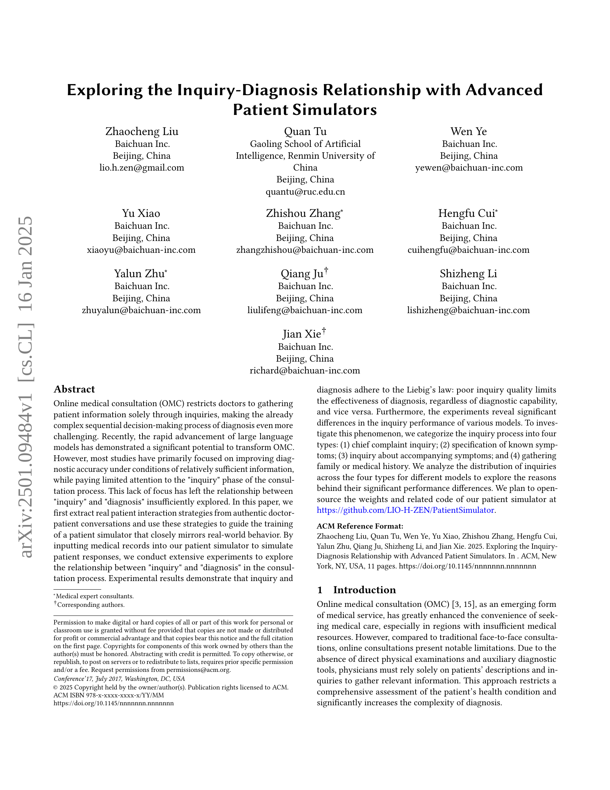
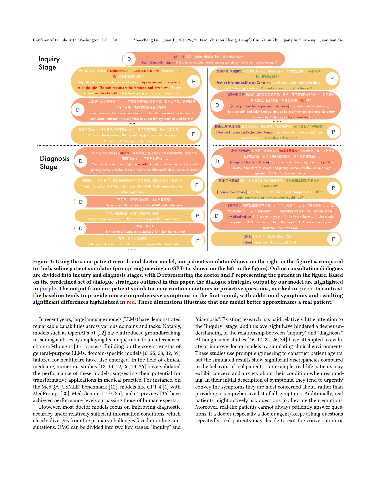
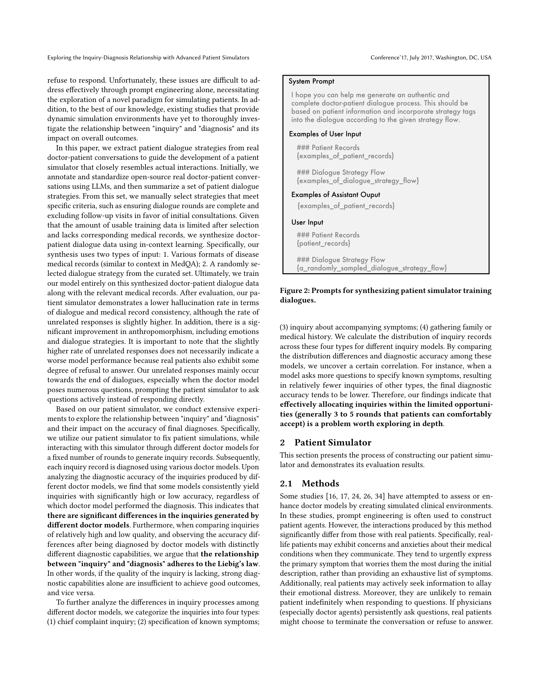
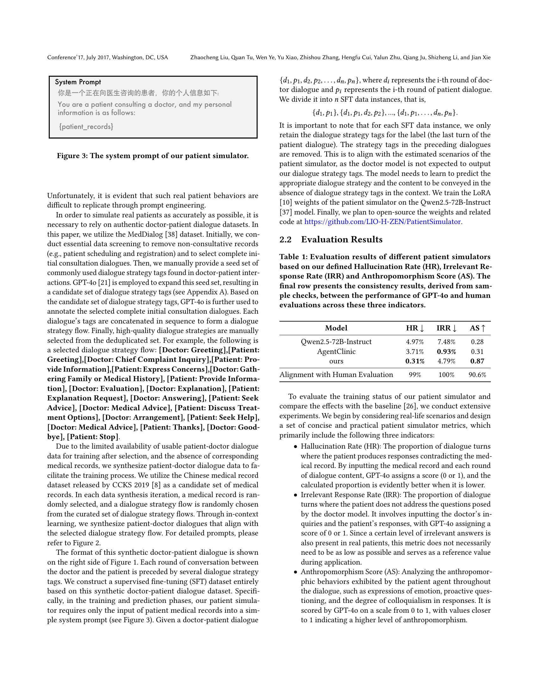
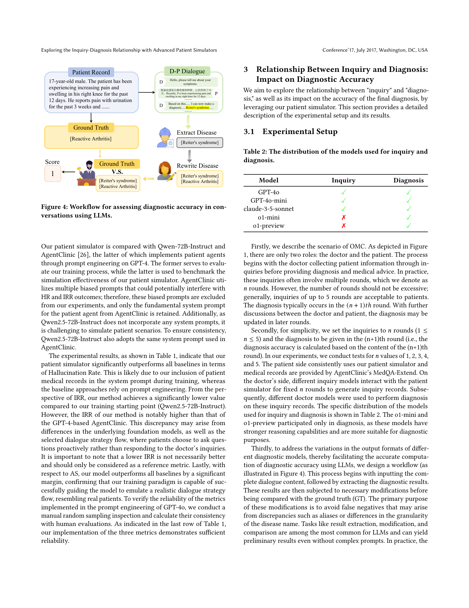
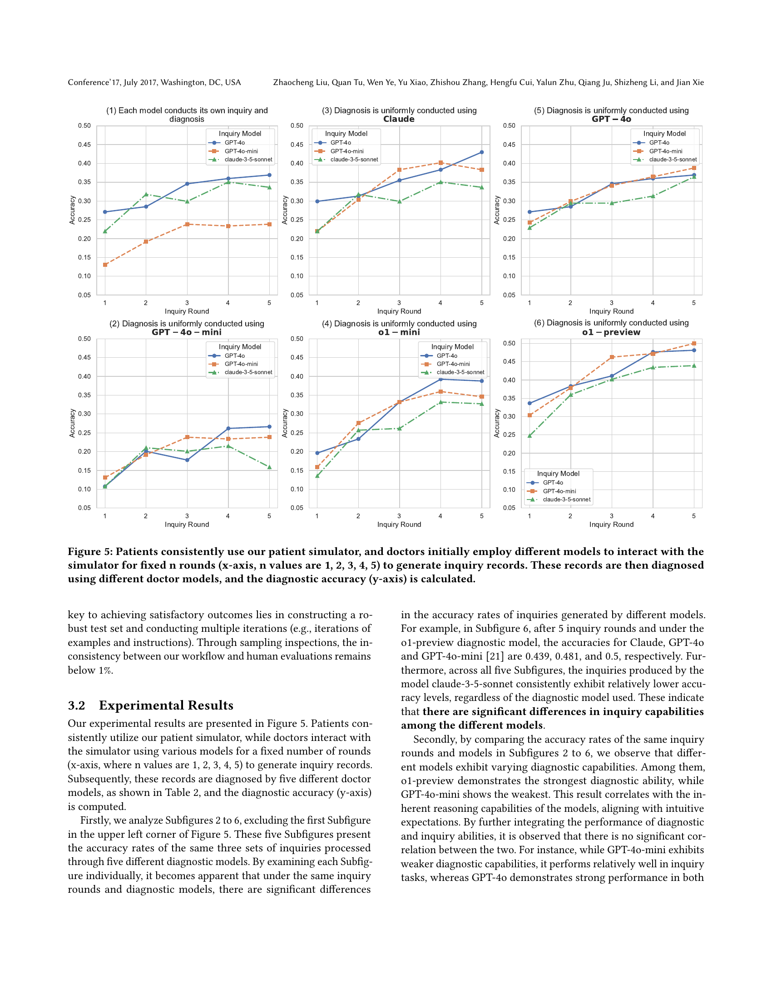
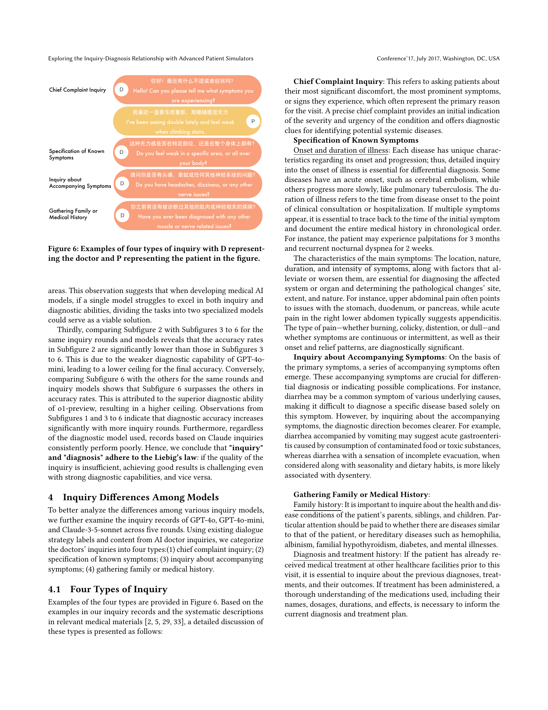
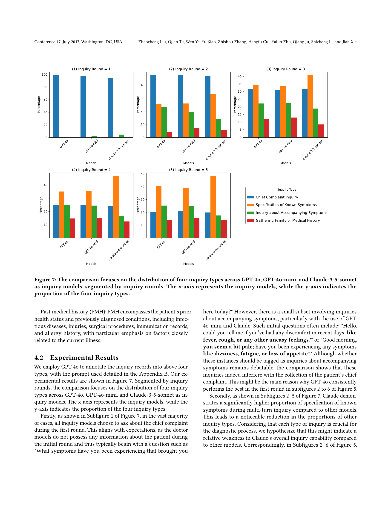
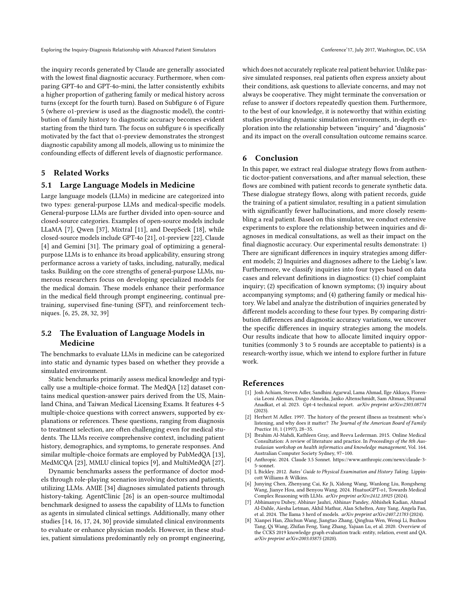
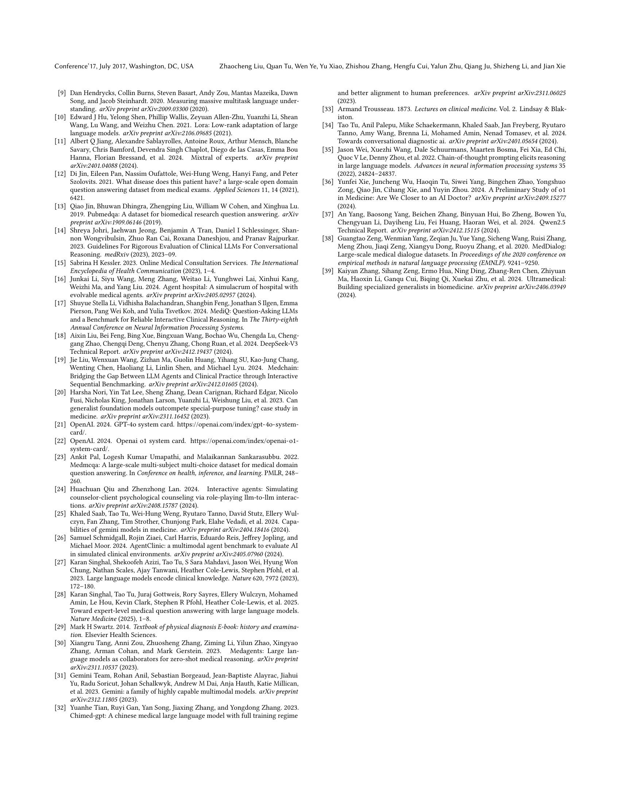
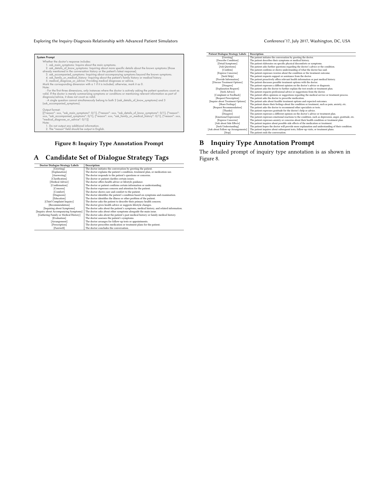
